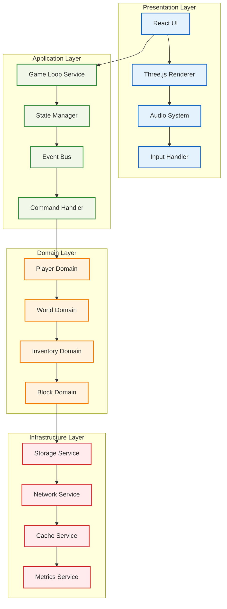

# 🔗 統合例（エキスパート向け）

## 🧭 スマートナビゲーション

> **📍 現在位置**: ホーム → 実例集 → 統合例
> **🎯 学習目標**: 完全統合システムの実装とテスト戦略
> **⏱️ 所要時間**: 60-90分
> **👤 対象**: Effect-TS上級者、システムアーキテクト

**全ての機能を統合した、プロダクションレベルのMinecraftシステムを構築しましょう！**

## 🎯 統合実装例一覧

### 🏗️ 01. 完全機能実装
- **[フルスタックMinecraft実装](./01-full-feature-implementation.md)**
  - **学習目標**: 全機能を統合したシステム設計と実装
  - **実装内容**: ブロック配置、プレイヤー移動、インベントリ、ワールド生成の完全統合
  - **技術要素**: マイクロサービス、イベントソーシング、CQRS、リアルタイム通信

### 🧪 02. テスト統合
- **[包括的テスト統合](./02-testing-integration.md)**
  - **学習目標**: 統合テスト戦略と実装手法
  - **実装内容**: E2Eテスト、パフォーマンステスト、ロードテスト
  - **技術要素**: Test環境構築、モックサービス、テストデータ管理

## 💡 統合アーキテクチャ



## 🚀 システム特徴

### 🌟 1. スケーラブル設計

```typescript
/**
 * マイクロサービスアーキテクチャ
 *
 * 🎯 特徴：
 * - 独立してスケール可能な各サービス
 * - イベント駆動による疎結合
 * - 障害隔離とサービス復旧
 */
interface MinecraftMicroservice {
  readonly name: string
  readonly initialize: () => Effect.Effect<void, ServiceError>
  readonly healthCheck: () => Effect.Effect<HealthStatus, never>
  readonly shutdown: () => Effect.Effect<void, never>
}

const services = {
  player: new PlayerService(),
  world: new WorldService(),
  inventory: new InventoryService(),
  networking: new NetworkingService(),
  persistence: new PersistenceService()
}
```

### ⚡ 2. リアルタイム処理

```typescript
/**
 * 60FPS ゲームループ統合
 *
 * 🎯 特徴：
 * - フレームレート安定化
 * - 適応的品質調整
 * - バッチ処理最適化
 */
const integratedGameLoop = Effect.gen(function* () {
  while (true) {
    const frameStart = Date.now()

    // 並列処理による最適化
    yield* Effect.all([
      updatePlayerSystems(),
      updateWorldSystems(),
      updateRenderingSystems(),
      updateAudioSystems()
    ], { concurrency: 4 })

    // フレームレート調整
    const frameTime = Date.now() - frameStart
    const targetFrameTime = 16.67 // 60FPS

    if (frameTime < targetFrameTime) {
      yield* Effect.sleep(`${targetFrameTime - frameTime}ms`)
    }
  }
})
```

### 🔒 3. エラー復旧システム

```typescript
/**
 * 自動回復機能
 *
 * 🎯 特徴：
 * - サービス障害の自動検出
 * - 段階的な機能縮退
 * - ユーザー体験の維持
 */
const resilientSystemManager = Effect.gen(function* () {
  const healthMonitor = yield* startHealthMonitoring()

  yield* Effect.forever(
    Effect.gen(function* () {
      const systemHealth = yield* checkAllServices()

      if (systemHealth.criticalErrors > 0) {
        yield* activateEmergencyMode()
      } else if (systemHealth.warnings > 3) {
        yield* activateDegradedMode()
      }

      yield* Effect.sleep("5s")
    })
  )
})
```

## 📊 パフォーマンス目標

### 🎯 レスポンス時間
- **ブロック配置**: < 16ms（1フレーム以内）
- **インベントリ操作**: < 100ms
- **ワールド生成**: < 2秒（新規チャンク）
- **プレイヤー移動**: < 1ms（フレーム毎）

### 💾 メモリ使用量
- **基本ゲーム**: < 512MB
- **大規模ワールド**: < 2GB
- **メモリリーク**: 0（長時間稼働）

### 🌐 ネットワーク
- **レイテンシ**: < 50ms（マルチプレイヤー）
- **帯域幅**: < 1Mbps（通常プレイ）
- **同時接続**: 100+ プレイヤー

## 🧪 テスト戦略

### 📋 テストピラミッド

```mermaid
pyramid
    title Test Strategy Pyramid

    "E2E Tests" : 10
    "Integration Tests" : 30
    "Unit Tests" : 60
```

### 🔬 テストカテゴリ

1. **単体テスト** (60%)
   - ドメインロジック検証
   - サービス層テスト
   - ユーティリティ関数テスト

2. **統合テスト** (30%)
   - サービス間通信
   - データベース統合
   - 外部API連携

3. **E2Eテスト** (10%)
   - ユーザーシナリオ
   - パフォーマンステスト
   - ブラウザ自動化テスト

## 🚀 デプロイメント戦略

### 🌍 環境構成

```typescript
interface Environment {
  readonly name: "development" | "staging" | "production"
  readonly config: {
    database: DatabaseConfig
    cache: CacheConfig
    monitoring: MonitoringConfig
    scaling: ScalingConfig
  }
}

const environments: Record<string, Environment> = {
  development: {
    name: "development",
    config: {
      database: localPostgreSQL,
      cache: localRedis,
      monitoring: basicLogging,
      scaling: singleInstance
    }
  },
  production: {
    name: "production",
    config: {
      database: clusteredPostgreSQL,
      cache: distributedRedis,
      monitoring: comprehensiveAPM,
      scaling: autoScaling
    }
  }
}
```

### 📈 監視・観測性

```typescript
/**
 * 包括的監視システム
 *
 * 🎯 監視項目：
 * - アプリケーションメトリクス
 * - インフラメトリクス
 * - ビジネスメトリクス
 * - ユーザー体験メトリクス
 */
const monitoringSystem = Effect.gen(function* () {
  yield* Effect.all([
    trackApplicationMetrics(),
    trackInfrastructureMetrics(),
    trackBusinessMetrics(),
    trackUserExperienceMetrics()
  ], { concurrency: 4 })
})
```

## 💡 実装のベストプラクティス

### 🏗️ 1. アーキテクチャパターン

- **Event Sourcing**: 全変更をイベントとして記録
- **CQRS**: 読み書きの分離による性能最適化
- **Hexagonal Architecture**: テスト容易性とモジュール性
- **Microservices**: スケーラビリティと独立性

### 🔧 2. 開発プラクティス

- **TDD**: テスト駆動開発による品質保証
- **CI/CD**: 継続的インテグレーション・デプロイメント
- **Infrastructure as Code**: インフラの版数管理
- **Feature Flags**: 段階的機能リリース

### 📊 3. 運用プラクティス

- **Blue-Green Deployment**: ゼロダウンタイム更新
- **Canary Releases**: リスクを抑えた新機能リリース
- **Automated Rollback**: 問題検出時の自動復旧
- **Chaos Engineering**: システム信頼性向上

## 🎯 学習効果

この統合実装を通じて以下を習得できます：

### 🚀 技術スキル
- **フルスタック開発**: フロントエンドからインフラまでの総合的な理解
- **システム設計**: 大規模システムのアーキテクチャ設計能力
- **性能最適化**: プロダクションレベルの性能チューニング

### 💼 実務スキル
- **プロジェクト管理**: 複雑な開発プロジェクトの推進
- **品質管理**: テスト戦略立案と品質保証プロセス
- **運用設計**: 監視・運用を考慮した設計思想

### 🎮 ゲーム開発
- **リアルタイム処理**: 60FPS維持の実装技術
- **大規模データ**: メモリ効率とI/O最適化
- **ユーザー体験**: レスポンシブなUI/UX設計

## 🔗 関連リソース

### 📖 理論的基盤
- [アーキテクチャ設計](../../01-architecture/README.md)
- [開発ガイドライン](../../03-guides/README.md)
- [テスト戦略](../../03-guides/05-comprehensive-testing-strategy.md)

### 🛠️ 実装リファレンス
- [基本実装例](../01-basic-usage/README.md)
- [高度なパターン](../02-advanced-patterns/README.md)
- [パフォーマンス最適化](../04-performance-optimization/README.md)

### 📚 発展的学習
- [パターンカタログ](../../07-pattern-catalog/README.md)
- [API設計](../../02-specifications/02-api-design/README.md)

---

**🎯 統合実装は「理論」と「実践」の集大成です。**
**プロダクションレベルのシステム構築能力を身につけましょう！**