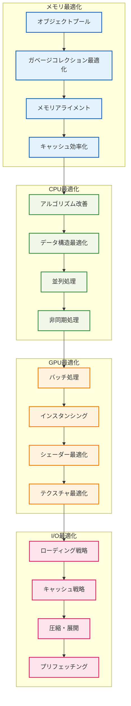

# ⚡ パフォーマンス最適化例

## 🧭 スマートナビゲーション

> **📍 現在位置**: ホーム → 実例集 → パフォーマンス最適化
> **🎯 学習目標**: 高性能システム設計と最適化技法の習得
> **⏱️ 所要時間**: 45-60分
> **👤 対象**: パフォーマンスエンジニア、システムアーキテクト

**ゲーム開発で最も重要な要素の一つ、パフォーマンス最適化の実践技法を学習しましょう！**

## 🎯 最適化実装例一覧

### 🧱 01. チャンク最適化
- **[チャンク最適化](./01-chunk-optimization.md)**
  - **学習目標**: 大規模ワールドデータの効率的管理と処理最適化
  - **実装内容**: チャンクローディング、メモリ管理、空間分割最適化
  - **技術要素**: Octree、LOD、バッチ処理、非同期I/O

### 🎨 02. レンダリング最適化
- **[レンダリング最適化](./02-rendering-optimization.md)**
  - **学習目標**: 60FPS維持のための描画処理最適化
  - **実装内容**: フラスタムカリング、インスタンシング、シェーダー最適化
  - **技術要素**: WebGL、Three.js最適化、GPU利用効率化

## 💡 最適化戦略アーキテクチャ



## 📊 パフォーマンス目標

### 🎯 フレームレート目標
- **デスクトップ**: 60FPS（16.67ms/frame）
- **モバイル**: 30FPS（33.33ms/frame）
- **VR**: 90FPS（11.11ms/frame）

### 💾 メモリ使用量目標
- **基本レベル**: < 256MB
- **大規模ワールド**: < 1GB
- **メモリリーク**: 0MB/hour

### ⚡ レスポンス時間目標
- **ブロック配置**: < 1ms
- **チャンクロード**: < 100ms
- **UI操作**: < 50ms

## 🔧 最適化技法一覧

### 🧠 1. メモリ最適化技法

```typescript
/**
 * オブジェクトプールパターン
 *
 * 🎯 目的：
 * - GCプレッシャーの削減
 * - メモリ断片化の防止
 * - オブジェクト作成コストの削減
 */
class OptimizedObjectPool<T> {
  private available: T[] = []
  private inUse = new Set<T>()

  constructor(
    private factory: () => T,
    private reset: (obj: T) => void,
    private initialSize: number = 100
  ) {
    // 事前にオブジェクトを生成
    for (let i = 0; i < initialSize; i++) {
      this.available.push(this.factory())
    }
  }

  acquire(): T {
    let obj = this.available.pop()
    if (!obj) {
      obj = this.factory()
    }
    this.inUse.add(obj)
    return obj
  }

  release(obj: T): void {
    if (this.inUse.delete(obj)) {
      this.reset(obj)
      this.available.push(obj)
    }
  }

  getStats() {
    return {
      available: this.available.length,
      inUse: this.inUse.size,
      total: this.available.length + this.inUse.size
    }
  }
}
```

### ⚡ 2. CPU最適化技法

```typescript
/**
 * 空間分割最適化（Octree）
 *
 * 🎯 目的：
 * - 衝突検出の高速化（O(n²) → O(log n)）
 * - 視界カリングの効率化
 * - 近接オブジェクト検索の最適化
 */
class OptimizedOctree<T extends { position: Vector3 }> {
  private static readonly MAX_OBJECTS = 10
  private static readonly MAX_DEPTH = 5

  private objects: T[] = []
  private children: OptimizedOctree<T>[] | null = null

  constructor(
    private bounds: BoundingBox,
    private depth: number = 0
  ) {}

  insert(obj: T): void {
    if (!this.bounds.contains(obj.position)) {
      return
    }

    if (this.objects.length < OptimizedOctree.MAX_OBJECTS ||
        this.depth >= OptimizedOctree.MAX_DEPTH) {
      this.objects.push(obj)
      return
    }

    if (!this.children) {
      this.subdivide()
    }

    for (const child of this.children!) {
      child.insert(obj)
    }
  }

  queryRange(range: BoundingBox): T[] {
    if (!this.bounds.intersects(range)) {
      return []
    }

    const result: T[] = []

    // 現在のノードのオブジェクトをチェック
    for (const obj of this.objects) {
      if (range.contains(obj.position)) {
        result.push(obj)
      }
    }

    // 子ノードを再帰的に検索
    if (this.children) {
      for (const child of this.children) {
        result.push(...child.queryRange(range))
      }
    }

    return result
  }

  private subdivide(): void {
    const { min, max } = this.bounds
    const center = min.add(max).multiply(0.5)

    this.children = [
      new OptimizedOctree(new BoundingBox(min, center), this.depth + 1),
      new OptimizedOctree(new BoundingBox(new Vector3(center.x, min.y, min.z),
                                         new Vector3(max.x, center.y, center.z)), this.depth + 1),
      // ... 他の6つの子ノード
    ]
  }
}
```

### 🎨 3. レンダリング最適化技法

```typescript
/**
 * インスタンシング最適化
 *
 * 🎯 目的：
 * - ドローコールの削減
 * - GPU利用効率の向上
 * - 大量オブジェクトの描画最適化
 */
class OptimizedInstancedRenderer {
  private instanceMatrices: Float32Array
  private instanceCount: number = 0
  private maxInstances: number

  constructor(maxInstances: number = 10000) {
    this.maxInstances = maxInstances
    // 各インスタンスの変換行列（4x4 = 16要素）
    this.instanceMatrices = new Float32Array(maxInstances * 16)
  }

  addInstance(position: Vector3, rotation: Vector3, scale: Vector3): void {
    if (this.instanceCount >= this.maxInstances) {
      console.warn('Max instances reached')
      return
    }

    const matrix = createTransformMatrix(position, rotation, scale)
    const offset = this.instanceCount * 16

    // 行列をFloat32Arrayに設定
    matrix.toArray(this.instanceMatrices, offset)
    this.instanceCount++
  }

  render(geometry: THREE.BufferGeometry, material: THREE.Material): void {
    if (this.instanceCount === 0) return

    // インスタンス化されたメッシュの作成
    const instancedMesh = new THREE.InstancedMesh(
      geometry,
      material,
      this.instanceCount
    )

    // インスタンス行列の設定
    const instanceMatrix = new THREE.InstancedBufferAttribute(
      this.instanceMatrices.subarray(0, this.instanceCount * 16),
      16
    )
    instancedMesh.instanceMatrix = instanceMatrix

    // 一度のドローコールで全インスタンスを描画
    renderer.render(scene, camera)
  }

  clear(): void {
    this.instanceCount = 0
  }
}
```

### 💾 4. データ構造最適化

```typescript
/**
 * Structure of Arrays (SoA) パターン
 *
 * 🎯 目的：
 * - キャッシュ効率の向上
 * - SIMD命令の活用
 * - メモリアクセスパターンの最適化
 */
class OptimizedEntityStorage {
  // Array of Structures (AoS) ❌
  // entities: { position: Vector3, health: number, velocity: Vector3 }[]

  // Structure of Arrays (SoA) ✅
  private positions: Float32Array
  private healths: Float32Array
  private velocities: Float32Array
  private count: number = 0

  constructor(maxEntities: number = 10000) {
    this.positions = new Float32Array(maxEntities * 3)  // x, y, z
    this.healths = new Float32Array(maxEntities)
    this.velocities = new Float32Array(maxEntities * 3) // vx, vy, vz
  }

  addEntity(position: Vector3, health: number, velocity: Vector3): number {
    const index = this.count++
    const posOffset = index * 3
    const velOffset = index * 3

    this.positions[posOffset] = position.x
    this.positions[posOffset + 1] = position.y
    this.positions[posOffset + 2] = position.z

    this.healths[index] = health

    this.velocities[velOffset] = velocity.x
    this.velocities[velOffset + 1] = velocity.y
    this.velocities[velOffset + 2] = velocity.z

    return index
  }

  // キャッシュ効率的な位置更新
  updatePositions(deltaTime: number): void {
    for (let i = 0; i < this.count; i++) {
      const posOffset = i * 3
      const velOffset = i * 3

      this.positions[posOffset] += this.velocities[velOffset] * deltaTime
      this.positions[posOffset + 1] += this.velocities[velOffset + 1] * deltaTime
      this.positions[posOffset + 2] += this.velocities[velOffset + 2] * deltaTime
    }
  }

  // 並列処理可能な健康状態更新
  updateHealths(damage: number): void {
    for (let i = 0; i < this.count; i++) {
      this.healths[i] = Math.max(0, this.healths[i] - damage)
    }
  }
}
```

## 📈 パフォーマンス測定

### 🔍 プロファイリング技法

```typescript
/**
 * 詳細なパフォーマンス測定システム
 *
 * 🎯 測定項目：
 * - フレーム時間分析
 * - メモリ使用量追跡
 * - GPU利用率監視
 * - ボトルネック特定
 */
class PerformanceProfiler {
  private frameTimings: number[] = []
  private memorySnapshots: number[] = []
  private gpuTimings: number[] = []

  startFrame(): void {
    this.frameStart = performance.now()
  }

  endFrame(): void {
    const frameTime = performance.now() - this.frameStart
    this.frameTimings.push(frameTime)

    // メモリ使用量記録
    if (performance.memory) {
      this.memorySnapshots.push(performance.memory.usedJSHeapSize)
    }

    // 統計の更新
    if (this.frameTimings.length > 1000) {
      this.generateReport()
      this.reset()
    }
  }

  measureOperation<T>(name: string, operation: () => T): T {
    const start = performance.now()
    const result = operation()
    const end = performance.now()

    this.recordTiming(name, end - start)
    return result
  }

  generateReport(): PerformanceReport {
    return {
      fps: {
        average: 1000 / this.getAverageFrameTime(),
        min: 1000 / Math.max(...this.frameTimings),
        max: 1000 / Math.min(...this.frameTimings),
        percentile99: 1000 / this.getPercentile(this.frameTimings, 99)
      },
      memory: {
        average: this.getAverage(this.memorySnapshots),
        peak: Math.max(...this.memorySnapshots),
        growth: this.memorySnapshots[this.memorySnapshots.length - 1] - this.memorySnapshots[0]
      },
      bottlenecks: this.identifyBottlenecks()
    }
  }

  private identifyBottlenecks(): Bottleneck[] {
    const bottlenecks: Bottleneck[] = []

    // フレーム時間の分析
    const avgFrameTime = this.getAverageFrameTime()
    if (avgFrameTime > 16.67) {
      bottlenecks.push({
        type: 'frame_time',
        severity: avgFrameTime > 33.33 ? 'critical' : 'warning',
        value: avgFrameTime,
        recommendation: 'フレーム時間が目標値を超過しています。CPU処理の最適化を検討してください。'
      })
    }

    // メモリ使用量の分析
    const memoryGrowth = this.memorySnapshots[this.memorySnapshots.length - 1] - this.memorySnapshots[0]
    if (memoryGrowth > 1024 * 1024) { // 1MB以上の増加
      bottlenecks.push({
        type: 'memory_leak',
        severity: 'warning',
        value: memoryGrowth,
        recommendation: 'メモリリークの可能性があります。オブジェクトの生成と解放を確認してください。'
      })
    }

    return bottlenecks
  }
}
```

### 📊 ベンチマーク実装

```typescript
/**
 * 自動化ベンチマークシステム
 */
class AutomatedBenchmark {
  async runFullBenchmark(): Promise<BenchmarkResult> {
    const results: BenchmarkResult = {
      timestamp: Date.now(),
      environment: this.getEnvironmentInfo(),
      tests: {}
    }

    // CPU集約的処理のベンチマーク
    results.tests.cpu = await this.benchmarkCPU()

    // メモリ処理のベンチマーク
    results.tests.memory = await this.benchmarkMemory()

    // レンダリング処理のベンチマーク
    results.tests.rendering = await this.benchmarkRendering()

    // I/O処理のベンチマーク
    results.tests.io = await this.benchmarkIO()

    return results
  }

  private async benchmarkCPU(): Promise<TestResult> {
    const tests = [
      () => this.testChunkGeneration(),
      () => this.testPhysicsCalculation(),
      () => this.testPathfinding(),
      () => this.testCollisionDetection()
    ]

    const results = []
    for (const test of tests) {
      const start = performance.now()
      await test()
      const end = performance.now()
      results.push(end - start)
    }

    return {
      average: results.reduce((a, b) => a + b) / results.length,
      min: Math.min(...results),
      max: Math.max(...results),
      samples: results
    }
  }

  private async benchmarkRendering(): Promise<TestResult> {
    const renderer = new OptimizedRenderer()
    const scene = this.createBenchmarkScene()

    const frameTimings = []
    const frameCount = 100

    for (let i = 0; i < frameCount; i++) {
      const start = performance.now()
      renderer.render(scene)
      const end = performance.now()
      frameTimings.push(end - start)
    }

    return {
      average: frameTimings.reduce((a, b) => a + b) / frameTimings.length,
      fps: 1000 / (frameTimings.reduce((a, b) => a + b) / frameTimings.length),
      samples: frameTimings
    }
  }
}
```

## 🎯 最適化チェックリスト

### ✅ メモリ最適化
- [ ] オブジェクトプールの実装
- [ ] ガベージコレクションの最適化
- [ ] メモリリークの検出と修正
- [ ] テクスチャサイズの最適化

### ✅ CPU最適化
- [ ] アルゴリズムの計算量改善
- [ ] 空間分割データ構造の導入
- [ ] 不要な計算の削除
- [ ] バッチ処理の実装

### ✅ GPU最適化
- [ ] ドローコールの削減
- [ ] インスタンシングの活用
- [ ] シェーダーの最適化
- [ ] フラスタムカリングの実装

### ✅ I/O最適化
- [ ] 非同期ローディング
- [ ] キャッシュ戦略の実装
- [ ] データ圧縮の適用
- [ ] プリフェッチングの実装

## 📚 参考資料と学習リソース

### 🔗 関連実装
- [基本実装例](../01-basic-usage/README.md)
- [高度なパターン](../02-advanced-patterns/README.md)
- [統合例](../03-integration-examples/README.md)

### 📖 理論的背景
- [アーキテクチャ設計](../../01-architecture/README.md)
- [パフォーマンス指標](../../03-guides/03-performance-optimization.md)

---

**⚡ パフォーマンス最適化は「技術」と「芸術」の融合です。**
**ユーザー体験を最大化する高性能システムを構築しましょう！**