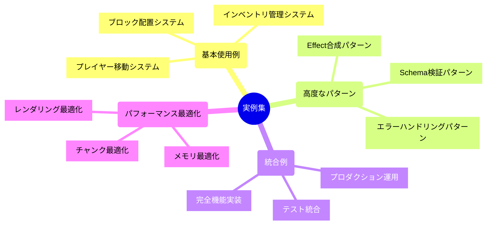

# 🔧 実例集（全レベル対応）

## 🧭 スマートナビゲーション

> **📍 現在位置**: ホーム → 実例集
> **🎯 学習目標**: 実際のコードを通じた実践的理解
> **⏱️ 所要時間**: 実例による（10-60分）
> **👤 対象**: 全レベル（実装重視の学習者）

**理論だけでなく、動作する実際のコードを通じて学習しましょう！**

## 🎯 実例マップ

## 📚 実装カテゴリ

### 🌱 **01. 基本的な使用例**（初心者向け - 必須）

完全に動作するコード例で、Effect-TSの基本パターンを学習：

- **[基本使用例 Hub](./01-basic-usage/README.md)** - 実装例の概要と学習パス
- **[シンプルなブロック配置](./01-basic-usage/01-simple-block-placement.md)** - Effect-TS基本パターン
  - **所要時間**: 20分
  - **技術要素**: Schema.Struct、Context.GenericTag、Effect.gen
  - **学習目標**: 型安全なサービス設計とエラーハンドリング

- **[プレイヤー移動実装](./01-basic-usage/02-player-movement.md)** - 3D物理演算とThree.js統合
  - **所要時間**: 30分
  - **技術要素**: Effect + Three.js、Ref、Schedule、Vector3演算
  - **学習目標**: リアルタイム処理とリソース管理

- **[インベントリ管理](./01-basic-usage/03-inventory-management.md)** - 複雑な状態管理とUI統合
  - **所要時間**: 40分
  - **技術要素**: イベント駆動、React統合、不変データ構造
  - **学習目標**: UI/ロジック分離とイベント処理

### 🏗️ **02. 高度なパターン**（中級者向け - 推奨）

Effect-TSの応用技法と高度な合成パターン：

- **[高度なパターン Hub](./02-advanced-patterns/README.md)** - 応用実装の概要
- **[Effect合成パターン](./02-advanced-patterns/01-effect-composition.md)** - 複雑なワークフロー実装
  - **所要時間**: 50分
  - **技術要素**: Effect.all、パイプライン処理、並列実行
  - **学習目標**: 高度なEffect合成とパフォーマンス最適化

- **Schema検証パターン** - 高度なデータ検証とトランスフォーメーション
  - **所要時間**: 30分
  - **技術要素**: Schema.extend、カスタムバリデーター、条件付き検証
  - **学習目標**: 堅牢なデータ検証システム

- **エラーハンドリングパターン** - 包括的エラー管理とリカバリー戦略
  - **所要時間**: 45分
  - **技術要素**: Cause、Schedule、自動リトライ、サーキットブレーカー
  - **学習目標**: プロダクションレベルのエラー処理

### 🔗 **03. 統合例**（上級者向け - 応用）

全機能を統合したフルスタックシステム実装：

- **[統合例 Hub](./03-integration-examples/README.md)** - 完全統合システムの概要
- **完全機能実装** - 全機能を統合したプロダクションレベルシステム
  - **所要時間**: 60-90分
  - **技術要素**: マイクロサービス、イベントソーシング、CQRS
  - **学習目標**: 大規模システム設計と実装

- **テスト統合** - 包括的テスト戦略と実装手法
  - **所要時間**: 45分
  - **技術要素**: E2Eテスト、パフォーマンステスト、モックサービス
  - **学習目標**: 品質保証とテスト自動化

### ⚡ **04. パフォーマンス最適化**（エキスパート向け - 専門）

高性能システム実装と最適化技法：

- **[パフォーマンス最適化 Hub](./04-performance-optimization/README.md)** - 最適化戦略の概要
- **チャンク最適化** - 大規模ワールドデータの効率的管理
  - **所要時間**: 45分
  - **技術要素**: Octree、メモリプール、非同期I/O
  - **学習目標**: 大規模データ処理とメモリ最適化

- **レンダリング最適化** - 60FPS維持のための描画処理最適化
  - **所要時間**: 50分
  - **技術要素**: フラスタムカリング、インスタンシング、GPU最適化
  - **学習目標**: リアルタイム3Dレンダリング最適化

## 🚀 実例の使い方

### 📚 学習方法

### 🎯 レベル別推奨順序
1. **Level 1**: Hello World → ブロック操作 → Effect-TS入門 → データ検証
2. **Level 2**: ワールド生成 → プレイヤー移動 → インベントリ → セーブ・ロード
3. **Level 3**: レッドストーン → マルチプレイヤー → チャンク最適化
4. **Level 4**: ドメイン境界 → ECSシステム → 包括的テスト

### ⚙️ 実行環境
各実例は以下の環境で動作確認済みです：
- **Node.js**: v18.0+
- **TypeScript**: v5.0+
- **Effect-TS**: v3.17+
- **Vite**: v7.1+

## 🔗 関連セクション

### 📖 理論学習
- [はじめに](../00-introduction/README.md) - 基本概念
- [アーキテクチャ](../01-architecture/README.md) - 設計思想
- [仕様](../02-specifications/README.md) - 機能詳細

### 🛠️ 実践ガイド
- [開発ガイド](../03-guides/README.md) - 開発手法
- [リファレンス](../05-reference/README.md) - API・設定詳細

### 🎮 体験
- [クイックスタート](../00-quickstart/README.md) - 5分体験

## 💡 カスタマイズ・応用

### 🔧 実例の拡張方法
1. **基本実例**: パラメータ変更・UI改善・エラーハンドリング追加
2. **中級実例**: アルゴリズム改良・機能追加・パフォーマンス向上
3. **上級実例**: 仕様拡張・他機能統合・独自最適化実装

### 🎨 独自プロジェクト化
- 実例をベースに独自のMinecraft機能を開発
- 異なるゲームジャンルへの応用
- 学習目的での機能拡張・改良

---

**🎯 実例は「読むもの」ではなく「実行するもの」です。**
**手を動かしながら学習し、理論と実践の両方を身につけましょう！**