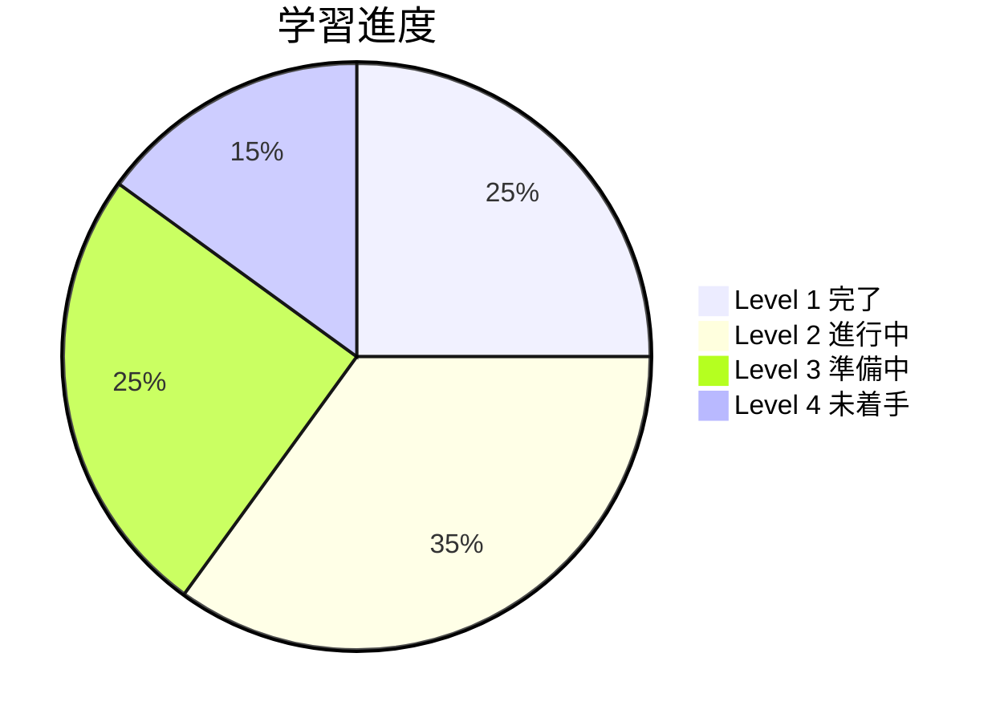

# TypeScript Minecraft ドキュメント

このドキュメントは、Effect-TS 3.17+の最新パターンを採用したTypeScript Minecraft Cloneプロジェクトの技術的な詳細、アーキテクチャ、開発ガイドラインを網羅した中央ハブです。プロジェクト全体でクラス不使用・完全関数型アプローチを採用し、Schema.Struct、Context.GenericTag、Match.value、早期リターンパターンを駆使して高品質なゲーム開発を実現しています。

## 📖 ドキュメント構成

プロジェクトのドキュメントは、以下の主要なセクションに分かれています。

---

### 🚀 00. はじめに
プロジェクトの全体像を理解し、開発を始めるための導入セクションです。

- **[プロジェクト概要](./00-introduction/00-project-overview.md)**: プロジェクトのビジョン、目標、そして中核となるコンセプトについて説明します。
- **[スタートガイド](./00-introduction/01-getting-started.md)**: 開発環境のセットアップ手順と、プロジェクトの実行方法を解説します。

---

### 🏗️ 01. アーキテクチャ
本プロジェクトの根幹をなす設計思想、原則、そしてシステム構造について詳述します。

- **[README.md](./01-architecture/README.md)**: アーキテクチャセクションの概要です。
- **[全体設計](./01-architecture/00-overall-design.md)**: DDD, ECS, Effect-TSを組み合わせた統合アーキテクチャの全体像を解説します。
- **[設計原則](./01-architecture/01-design-principles.md)**: コードの品質と一貫性を保つための基本原則を定義します。
- **[DDD戦略的設計](./01-architecture/02-ddd-strategic-design.md)**: ドメイン駆動設計の戦略的アプローチと境界づけられたコンテキストについて説明します。
- **[技術スタック](./01-architecture/03-technology-stack.md)**: 使用している主要なライブラリとツールセットの詳細です。
- **[レイヤードアーキテクチャ](./01-architecture/04-layered-architecture.md)**: システムを構成する各層の役割と責務を定義します。
- **[ECS統合](./01-architecture/05-ecs-integration.md)**: Entity Component Systemアーキテクチャの統合方法について解説します。
- **[Effect-TSパターン](./01-architecture/06-effect-ts-patterns.md)**: プロジェクト全体で採用しているEffect-TS 3.17+の最新パターン（Schema.Struct、Context.GenericTag、Match.value、早期リターン）とコーディングパターン集です。

---

### 📋 02. 仕様
ゲームを構成する各システムの機能仕様と技術的な実装詳細について説明します。

- **[README.md](./02-specifications/README.md)**: 仕様セクションの概要です。
- **コア機能**:
  - **[概要](./02-specifications/00-core-features/README.md)**
  - ワールド管理、プレイヤー、ブロック、レンダリング、物理、インベントリなど、ゲームの基本的な要素に関する仕様。
- **拡張機能**:
  - **[概要](./02-specifications/01-enhanced-features/README.md)**
  - レッドストーン回路、天候システム、Mob AI、マルチプレイヤーなど、より高度な機能に関する仕様。
- **API設計**:
  - **[概要](./02-specifications/02-api-design/README.md)**
  - ドメイン、アプリケーション、インフラストラクチャ間のAPIコントラクトとイベントバスの仕様。
- **データモデル**:
  - **[概要](./02-specifications/03-data-models/README.md)**
  - ワールドデータ、チャンクフォーマット、セーブファイル形式など、主要なデータ構造の定義。

---

### 📚 03. ガイド
開発プロセスを円滑に進めるための各種ガイドラインとベストプラクティス集です。

- **[README.md](./03-guides/README.md)**: ガイドセクションの概要です。
- **[開発規約](./03-guides/00-development-conventions.md)**: Effect-TS 3.17+準拠のコーディングスタイル、命名規則、Schema.TaggedErrorによるエラーハンドリングなど、遵守すべき最新規約をまとめています。
- **[エントリーポイント](./03-guides/01-entry-points.md)**: アプリケーションの起動シーケンスと主要な処理の流れを解説します。
- **[テストガイド](./03-guides/02-testing-guide.md)**: ユニットテスト、統合テストの作成方法とテスト戦略について説明します。
- **[パフォーマンス最適化](./03-guides/03-performance-optimization.md)**: プロファイリングとパフォーマンスチューニングのテクニック集です。
- **[エラー解決](./03-guides/04-error-resolution.md)**: TypeScriptとEffect-TSの一般的なエラーと解決方法をまとめています。
- **[包括的テスト戦略](./03-guides/05-comprehensive-testing-strategy.md)**: Flaky Test完全排除を含む網羅的なテスト設計戦略です。
- **[高度なテスト技法](./03-guides/06-advanced-testing-techniques.md)**: 契約テスト、ビジュアルリグレッションテスト等の高度な技法を解説します。
- **[Effect-TSテストパターン](./03-guides/07-effect-ts-testing-patterns.md)**: Effect-TS 3.17+完全準拠のテスト実装パターン専用ガイドです。
- **[CI/CD & デプロイメント](./03-guides/08-ci-cd-deployment.md)**: GitHub Actions による自動テスト・ビルド・GitHub Pages デプロイの完全ガイドです。
- **[デバッグガイド](./03-guides/09-debugging-guide.md)**: Effect-TS特有のデバッグ手法とパフォーマンス分析について解説します。
- **[並列開発ワークフロー](./03-guides/10-parallel-development-workflow.md)**: GitHub Issue依存関係を活用した効率的な並列開発の完全ガイドです。
- **[GitHub Issue管理](./03-guides/11-github-issue-management.md)**: 効率的なIssue作成・ラベル管理・マイルストーン活用の実践ガイドです。

---

### 📎 04. 付録
プロジェクトに関連する補足情報やリファレンス資料です。

- **[README.md](./04-appendix/README.md)**: 付録セクションの概要です。
- **[用語集](./04-appendix/00-glossary.md)**: プロジェクト固有の用語や技術用語の定義集です。
- **[アセットソース](./04-appendix/01-asset-sources.md)**: ゲーム内で使用しているテクスチャやサウンドなどのアセットの出所とライセンス情報です。
  - **使用場面**: アセット追加・ライセンス確認時
  - **関連項目**: [レンダリングシステム](./02-specifications/00-core-features/05-rendering-system.md)

---

## 🎯 クイックアクション

### 🚀 今すぐ始める
- **5分体験**: [クイックスタート](./00-quickstart/README.md) → 即座にゲーム体験
- **初回訪問**: [プロジェクト概要](./00-introduction/00-project-overview.md) → [スタートガイド](./00-introduction/01-getting-started.md)
- **開発準備**: [開発規約](./03-guides/00-development-conventions.md) → [エントリーポイント](./03-guides/01-entry-points.md)
- **実装参考**: [Effect-TSパターン](./01-architecture/06-effect-ts-patterns.md) → [コア機能仕様](./02-specifications/00-core-features/README.md)

### 🔍 検索・参照
- **API・設定辞書**: [リファレンス](./05-reference/README.md) → API・コード・設定完全集
- **実働コード**: [実例集](./06-examples/README.md) → 動作するコード・チュートリアル
- **用語確認**: [用語集](./04-appendix/00-glossary.md)
- **エラー解決**: [エラー解決ガイド](./03-guides/04-error-resolution.md)
- **アーキテクチャ概観**: [全体設計](./01-architecture/00-overall-design.md)

### 📈 学習進度管理

---

## 🤖 AI Agent最適化設計

このドキュメント群は以下の**AI Agent親和性原則**に基づいて設計されています：

### 📊 構造化データ設計
- **階層構造**: 明確なレベル分けとブレッドクラム
- **関連性マッピング**: 前提知識・次のステップ・関連項目の明示
- **進度トラッキング**: 学習フェーズと完了条件の可視化

### 🎯 コンテキスト最適化
- **所要時間**: 各セクションの学習・作業時間明示
- **難易度表示**: Level 1-4による段階的学習設計
- **目的明確化**: 各セクションの学習目標とアウトカム定義

### 🔄 相互参照強化
- **双方向リンク**: 関連ドキュメント間の相互参照
- **依存関係**: 学習・実装順序の明確化
- **コンテキスト継承**: 上位概念から詳細実装への段階移行

---

**🎉 準備完了！あなたの学習レベルに応じて最適なスタート地点を選択し、TypeScript Minecraft開発の旅を始めましょう。**