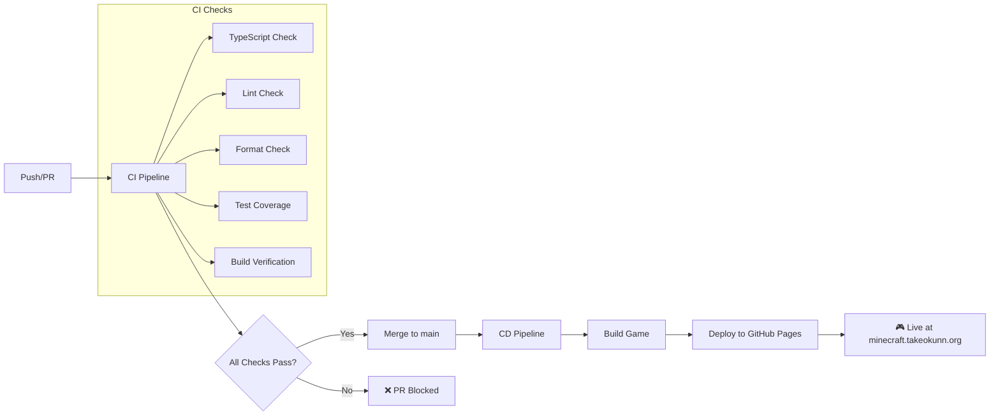

# TypeScript Minecraft Clone 開発ロードマップ

> **🎯 プロジェクトビジョン**: DDD×ECS×Effect-TSの統合アーキテクチャによる、型安全で高性能なMinecraftクローン実装

## 📋 プロジェクト概要

### 🎮 最終目標
- **完全な3D Minecraftクローン**: ブロック配置・破壊、インベントリ、クラフティング、モブ、レッドストーン等
- **教育プラットフォーム**: 関数型ゲーム開発のベストプラクティス実証
- **技術実験場**: 最新TypeScript・関数型技術の実用検証

### ⚡ 技術スタック確定版
```typescript
// コア技術
- TypeScript 5.9+
- Effect-TS 3.17+ (完全移行済み)
- Three.js (3D レンダリング)
- Vite 7.1+ (開発・ビルド)

// アーキテクチャパターン
- DDD (ドメイン駆動設計)
- ECS (Entity Component System)
- Clean Architecture (4層構造)

// 品質保証
- Vitest 3.2+ (テスト)
- oxlint (静的解析)
- Prettier (フォーマット)
```

### 📊 現在の状況
- ✅ **ドキュメント完成度**: 95% (74ファイル、4セクション構成)
- ✅ **アーキテクチャ設計**: 100% (DDD/ECS/Effect-TS統合完了)
- ⏳ **実装進捗**: 0% (これから開始)
- ⏳ **テスト準備**: 0% (テスト戦略は完成)

---

## 🗓️ 開発フェーズ

### 📅 **Phase 1: プロジェクト基盤構築** (週1-2)
**目標**: 開発環境とコア基盤を整備し、最初のブロックを表示する

#### 🛠️ **Sprint 1.1: プロジェクトセットアップ** (3-5日)
**成果物**: 開発可能な基本環境

| タスク | 説明 | 見積もり | GitHub Issue |
|--------|------|----------|--------------|
| **Package.json作成** | npm/pnpm設定、依存関係定義 | 0.5日 | `#001` |
| **TypeScript設定** | tsconfig.json、厳密な型チェック | 0.5日 | `#002` |
| **Vite設定** | 開発サーバー、HMR、ビルド最適化 | 0.5日 | `#003` |
| **Effect-TS導入** | 基本Layer構成、Context設定 | 1日 | `#004` |
| **Three.js基本統合** | Scene、Camera、Renderer初期化 | 1日 | `#005` |
| **品質ツール設定** | Vitest、oxlint、Prettier設定 | 0.5日 | `#006` |

**PR目標**: プロジェクト起動・ビルド・テスト実行が成功する状態

#### 🎯 **Sprint 1.2: コアアーキテクチャ実装** (4-6日)
**成果物**: DDD/ECS基盤とEffect-TSサービス層

| タスク | 説明 | 見積もり | GitHub Issue |
|--------|------|----------|--------------|
| **ドメイン層基盤** | Block、Player、World基本エンティティ | 1.5日 | `#007` |
| **ECS基盤実装** | Entity、Component、System抽象化 | 1.5日 | `#008` |
| **サービス層実装** | Context.GenericTag使用したサービス定義 | 1日 | `#009` |
| **エラーハンドリング** | Schema.TaggedError基盤 | 1日 | `#010` |
| **基本テストセットアップ** | Effect-TSテストパターン実装 | 1日 | `#011` |

**PR目標**: アーキテクチャの骨格が完成し、基本テストが通る状態

#### 🧱 **Sprint 1.3: 最初のブロック表示** (3-4日)
**成果物**: シンプルなブロックが3D空間に表示される

| タスク | 説明 | 見積もり | GitHub Issue |
|--------|------|----------|--------------|
| **基本ブロックエンティティ** | 石ブロック1種類の定義・実装 | 1日 | `#012` |
| **レンダリングサービス** | Three.jsとの統合、メッシュ生成 | 1.5日 | `#013` |
| **シーン管理** | カメラ、ライティング、基本操作 | 1日 | `#014` |
| **統合テスト** | E2Eテスト基盤、ブロック表示確認 | 0.5日 | `#015` |

**PR目標**: ブラウザで3Dブロックが表示され、カメラ移動が可能

---

### 🎮 **Phase 2: 基本ゲームプレイ実装** (週3-5)
**目標**: プレイヤー操作、ブロック配置・破壊、基本的なゲーム体験

#### 🏃 **Sprint 2.1: プレイヤーシステム** (4-5日)
**成果物**: プレイヤー移動・カメラ制御・衝突判定

| タスク | 説明 | 見積もり | GitHub Issue |
|--------|------|----------|--------------|
| **プレイヤーエンティティ** | 位置、回転、状態管理 | 1日 | `#016` |
| **入力システム** | キーボード・マウス入力処理 | 1.5日 | `#017` |
| **物理システム基盤** | 重力、衝突判定、AABB | 1.5日 | `#018` |
| **カメラコントローラー** | FPS視点、マウスルック | 1日 | `#019` |

**PR目標**: WASDで移動、マウスで視点変更、重力・衝突が動作

#### 🧱 **Sprint 2.2: ブロック操作システム** (5-6日)
**成果物**: ブロック配置・破壊・選択の完全実装

| タスク | 説明 | 見積もり | GitHub Issue |
|--------|------|----------|--------------|
| **ブロック配置システム** | レイキャスト、配置ロジック | 2日 | `#020` |
| **ブロック破壊システム** | 破壊アニメーション、ドロップ | 1.5日 | `#021` |
| **ブロック選択UI** | ホットバー、ブロック切り替え | 1.5日 | `#022` |
| **世界データ永続化** | チャンクデータ保存・読込 | 1日 | `#023` |

**PR目標**: ブロック配置・破壊・選択が完全に動作するMVP

#### 📦 **Sprint 2.3: インベントリシステム** (4-5日)
**成果物**: アイテム管理・インベントリUI

| タスク | 説明 | 見積もり | GitHub Issue |
|--------|------|----------|--------------|
| **インベントリエンティティ** | スロット管理、アイテムスタック | 2日 | `#024` |
| **インベントリUI** | グリッド表示、ドラッグ&ドロップ | 2日 | `#025` |
| **アイテムシステム** | アイテム定義、メタデータ | 1日 | `#026` |

**PR目標**: インベントリ操作が完全に動作し、アイテムが管理できる

---

### ⚙️ **Phase 3: ゲームシステム拡張** (週6-9)
**目標**: クラフティング、チャンク、ワールド生成システム

#### 🔨 **Sprint 3.1: クラフティングシステム** (5-6日)
**成果物**: レシピベースのアイテム制作

| タスク | 説明 | 見積もり | GitHub Issue |
|--------|------|----------|--------------|
| **レシピシステム** | JSON定義、レシピ検索・実行 | 2日 | `#027` |
| **クラフティングテーブル** | 3x3グリッド、UI実装 | 2日 | `#028` |
| **基本レシピ実装** | 木材→棒、石→ツール等 | 1.5日 | `#029` |

**PR目標**: 基本的なクラフティングが動作し、ツール作成が可能

#### 🌍 **Sprint 3.2: チャンクシステム** (6-7日)
**成果物**: 効率的なワールド管理

| タスク | 説明 | 見積もり | GitHub Issue |
|--------|------|----------|--------------|
| **チャンク基盤実装** | 16x16x256ブロック管理 | 2日 | `#030` |
| **チャンク読込・保存** | 非同期IO、圧縮・最適化 | 2日 | `#031` |
| **チャンク表示最適化** | LOD、フラスタムカリング | 2日 | `#032` |
| **メモリ管理** | チャンクアンロード、GC最適化 | 1日 | `#033` |

**PR目標**: 大きなワールドでもパフォーマンスが安定

#### 🏔️ **Sprint 3.3: ワールド生成** (4-5日)
**成果物**: プロシージャルワールド生成

| タスク | 説明 | 見積もり | GitHub Issue |
|--------|------|----------|--------------|
| **地形生成アルゴリズム** | Perlinノイズ、バイオーム | 2.5日 | `#034` |
| **構造物生成** | 木、洞窟、鉱石配置 | 1.5日 | `#035` |
| **バイオームシステム** | 草原、森、砂漠基本実装 | 1日 | `#036` |

**PR目標**: 自動生成される美しい3Dワールド

---

### 🎪 **Phase 4: ゲーム体験向上** (週10-13)
**目標**: モブ、戦闘、サウンド、高度なゲーム機能

#### 👾 **Sprint 4.1: モブシステム** (6-7日)
**成果物**: AI搭載の動くエンティティ

| タスク | 説明 | 見積もり | GitHub Issue |
|--------|------|----------|--------------|
| **モブECS基盤** | モブ専用コンポーネント・システム | 2日 | `#037` |
| **基本AIシステム** | 状態機械、パスファインディング | 2.5日 | `#038` |
| **モブ種類実装** | 牛、豚、ゾンビ、スケルトン | 2日 | `#039` |
| **スポーンシステム** | 条件ベースのモブ出現 | 1日 | `#040` |

**PR目標**: 複数種類のモブが自然にスポーン・行動

#### ⚔️ **Sprint 4.2: 戦闘システム** (4-5日)
**成果物**: プレイヤー・モブ間の戦闘

| タスク | 説明 | 見積もり | GitHub Issue |
|--------|------|----------|--------------|
| **体力システム** | HP、ダメージ計算 | 1.5日 | `#041` |
| **武器・防具システム** | 装備、攻撃力・防御力 | 2日 | `#042` |
| **戦闘UI** | HPバー、ダメージエフェクト | 1.5日 | `#043` |

**PR目標**: 完全な戦闘システムが動作

#### 🔊 **Sprint 4.3: サウンドシステム** (3-4日)
**成果物**: 効果音・BGM再生

| タスク | 説明 | 見積もり | GitHub Issue |
|--------|------|----------|--------------|
| **AudioContext統合** | Web Audio API、Effect-TS化 | 1.5日 | `#044` |
| **効果音実装** | ブロック配置・破壊、歩行音 | 1.5日 | `#045` |
| **BGMシステム** | バイオーム別、時間別 | 1日 | `#046` |

**PR目標**: リアルなゲームオーディオ体験

---

### 🚀 **Phase 5: 高度な機能実装** (週14-18)
**目標**: レッドストーン、マルチプレイヤー、パフォーマンス最適化

#### ⚡ **Sprint 5.1: レッドストーンシステム** (7-8日)
**成果物**: 電気回路シミュレーション

| タスク | 説明 | 見積もり | GitHub Issue |
|--------|------|----------|--------------|
| **回路基盤実装** | 信号伝播、遅延、論理ゲート | 3日 | `#047` |
| **基本回路素子** | レッドストーン、トーチ、リピーター | 2.5日 | `#048` |
| **機械ブロック** | ピストン、ディスペンサー | 2日 | `#049` |
| **複雑回路サポート** | クロック、フリップフロップ | 1.5日 | `#050` |

**PR目標**: 自動ドア、計算機等の複雑な回路が動作

#### 🌐 **Sprint 5.2: マルチプレイヤー基盤** (8-9日)
**成果物**: リアルタイム同期システム

| タスク | 説明 | 見積もり | GitHub Issue |
|--------|------|----------|--------------|
| **WebSocket統合** | Effect-TS WebSocket Layer | 2日 | `#051` |
| **状態同期システム** | Operational Transform、CRDT | 3日 | `#052` |
| **マルチプレイヤーUI** | プレイヤーリスト、チャット | 2日 | `#053` |
| **権限・認証システム** | 基本的なユーザー管理 | 2日 | `#054` |

**PR目標**: 複数プレイヤー同時プレイが可能

#### ⚡ **Sprint 5.3: パフォーマンス最適化** (5-6日)
**成果物**: 60fps安定動作

| タスク | 説明 | 見積もり | GitHub Issue |
|--------|------|----------|--------------|
| **レンダリング最適化** | インスタンシング、オクルージョンカリング | 2.5日 | `#055` |
| **ECS最適化** | SoA最適化、並列処理 | 2日 | `#056` |
| **メモリプロファイリング** | リーク検出・修正 | 1.5日 | `#057` |

**PR目標**: 大規模ワールドでも快適動作

---

## 📊 開発の優先順位とマイルストーン

### 🎯 **重要度マトリックス**

| フェーズ | 重要度 | 実装コスト | ユーザー体験インパクト | 技術的価値 |
|---------|-------|-----------|---------------------|----------|
| **Phase 1** | 🔴 必須 | 低 | 中 | 高 (基盤技術) |
| **Phase 2** | 🔴 必須 | 中 | 高 | 高 (コア機能) |
| **Phase 3** | 🟠 重要 | 高 | 高 | 中 (ゲーム完成度) |
| **Phase 4** | 🟡 拡張 | 中 | 中 | 中 (体験向上) |
| **Phase 5** | 🟢 高度 | 非常に高 | 中 | 非常に高 (技術実証) |

### 🏆 **マイルストーン定義**

#### 🥉 **Bronze (Phase 1-2完了)**
- **達成目標**: MVP (Minimum Viable Product)
- **ユーザー価値**: 基本的なMinecraft体験
- **機能**: ブロック配置・破壊、プレイヤー移動、インベントリ
- **予定**: 開発開始から5週間

#### 🥈 **Silver (Phase 3完了)**
- **達成目標**: 完全なゲーム体験
- **ユーザー価値**: 長時間楽しめるゲーム
- **機能**: クラフティング、無限ワールド、プロシージャル生成
- **予定**: 開発開始から9週間

#### 🥇 **Gold (Phase 4完了)**
- **達成目標**: 高品質ゲーム
- **ユーザー価値**: 本格的なMinecraft代替
- **機能**: モブ、戦闘、サウンド、没入感
- **予定**: 開発開始から13週間

#### 💎 **Platinum (Phase 5完了)**
- **達成目標**: 技術デモンストレーション
- **ユーザー価値**: 先進的ゲーム体験
- **機能**: レッドストーン、マルチプレイヤー、最適化
- **予定**: 開発開始から18週間

---

## 🧪 品質保証戦略

### ✅ **各フェーズでの完了基準**

#### 📋 **Phase完了チェックリスト**
```markdown
**コード品質（CI自動チェック）**:
- [ ] TypeScript型エラー 0件 (`npm run type-check`)
- [ ] oxlint警告 0件 (`npm run lint`)
- [ ] Prettier フォーマット準拠 (`npm run format:check`)
- [ ] テストカバレッジ ≥ 90% (`npm run test:coverage`)
- [ ] Effect-TS規約100%準拠

**機能品質**:
- [ ] 全機能の正常動作確認
- [ ] パフォーマンステスト合格 (≥30fps)
- [ ] クロスブラウザ動作確認 (Chrome, Firefox, Safari)
- [ ] 🌐 **GitHub Pages自動デプロイ成功**: https://minecraft.takeokunn.org

**CI/CD品質**:
- [ ] CI パイプライン全て成功 (✅ status check)
- [ ] main ブランチマージ後2-3分以内にライブ反映
- [ ] プレビューアドレスへのアクセス可能
- [ ] 自動テスト・ビルド・デプロイの流れ確認

**ドキュメント**:
- [ ] API仕様書更新
- [ ] 実装パターン記録
- [ ] トラブルシューティング情報追加
```

### 🔄 **継続的インテグレーション**

#### 🤖 **自動化されたCI/CDフロー**



#### ⚙️ **GitHub Actions設定**
- **CI**: `.github/workflows/ci.yml` - 品質チェック自動化
- **CD**: `.github/workflows/cd.yml` - GitHub Pages自動デプロイ
- **詳細設定**: [CI/CDガイド](./03-guides/08-ci-cd-deployment.md)

#### 🌐 **デプロイメント**
- **ライブURL**: https://minecraft.takeokunn.org
- **自動更新**: main ブランチマージから2-3分で反映
- **プレビュー**: 全PRで自動ビルドチェック

---

## 🎓 学習・教育価値

### 📚 **技術習得ロードマップ**

このプロジェクトを通じて習得できる技術:

| フェーズ | 習得技術 | 難易度 | 応用範囲 |
|---------|----------|-------|----------|
| **Phase 1** | Effect-TS基礎、Three.js基本 | 初級-中級 | Web開発一般 |
| **Phase 2** | 関数型ゲーム設計、ECS基本 | 中級 | リアルタイムアプリ |
| **Phase 3** | 高度なアルゴリズム、最適化 | 中級-上級 | 高性能アプリ |
| **Phase 4** | AI・物理シミュレーション | 上級 | ゲーム・シミュレーション |
| **Phase 5** | 分散システム、超最適化 | エキスパート | エンタープライズ |

### 🎯 **スキル開発フォーカス**

1. **関数型プログラミング**: Effect-TS完全活用
2. **型駆動開発**: Schema.Structによる設計
3. **ドメイン駆動設計**: 複雑ドメインの管理
4. **高性能プログラミング**: ゲームレベルの最適化
5. **テスト駆動開発**: Property-based Testing

---

## 🚨 リスクと対策

### ⚠️ **技術リスク**

| リスク | 影響度 | 対策 |
|--------|--------|------|
| **Effect-TS学習コスト** | 高 | 段階的導入、豊富なサンプル |
| **パフォーマンス問題** | 中 | 早期プロファイリング、段階的最適化 |
| **Three.js複雑性** | 中 | 薄いラッパー層、段階的実装 |
| **ブラウザ互換性** | 低 | モダンブラウザ対象、ポリフィル使用 |

### 📅 **スケジュールリスク**

- **楽観的**: 15週間 (各スプリント-20%)
- **現実的**: 18週間 (計画通り)
- **悲観的**: 24週間 (予期しない問題+33%)

### 🛡️ **品質リスク対策**

- **技術検証**: 各フェーズ開始前のプロトタイプ実装
- **継続的統合**: 自動テスト、品質ゲート
- **段階的リリース**: MVP→完全版の段階展開
- **コミュニティフィードバック**: GitHub Issue、ドキュメント改善

---

## 🔗 次のアクション

### 📝 **実装開始前の準備**

1. **Phase 1のGitHub Issues作成**
   - Sprint 1.1-1.3の全タスクをIssue化
   - 詳細なAcceptance Criteria定義
   - 見積もり時間とラベル設定

2. **開発環境の最終確認**
   - Node.js/pnpm最新版
   - VSCode Extensions (Effect-TS, TypeScript)
   - Git workflow設定

3. **開発チーム体制**
   - 実装担当者 (あなた)
   - レビュー体制
   - ドキュメント維持体制

### 🎯 **最初のPR目標**

**PR #1**: プロジェクト基盤セットアップ
- package.json + 全設定ファイル
- 基本的なプロジェクト構造
- CI/CD設定
- README更新

**期限**: 今週中

---

## 📞 サポート・質問

### 🔗 **関連ドキュメント**
- **[プロジェクト概要](./00-introduction/00-project-overview.md)** - 全体像の理解
- **[アーキテクチャ概要](./01-architecture/00-overall-design.md)** - 技術的詳細
- **[開発規約](./03-guides/00-development-conventions.md)** - コーディング規則

### 💬 **質問・フィードバック**
- GitHub Issues: 技術的質問・提案
- GitHub Discussions: 設計議論・アイデア
- PRレビュー: 実装フィードバック

---

**🎮 Ready to Build the Future of Functional Game Development!**

`★ Insight ─────────────────────────────────────`
- **段階的アプローチ**: MVPから完全版まで明確な段階を設定し、各フェーズで価値を提供
- **技術実証と教育価値**: 単なるゲーム実装ではなく、DDD×ECS×Effect-TSの統合パターンを実証するプラットフォーム
- **リスク管理**: 技術・スケジュール・品質の各リスクを事前に識別し、具体的な対策を準備
`─────────────────────────────────────────────────`

これで詳細なROADMAPが完成しました。18週間で段階的に実装を進める計画で、各フェーズでの具体的なタスク、GitHub Issue番号、完了基準まで含めた実行可能な開発計画になっています。

<function_calls>
<invoke name="TodoWrite">
<parameter name="todos">[{"content": "\u73fe\u5728\u306e\u30c9\u30ad\u30e5\u30e1\u30f3\u30c8\u69cb\u9020\u3068\u30a2\u30fc\u30ad\u30c6\u30af\u30c1\u30e3\u60c5\u5831\u3092\u8abf\u67fb\u3059\u308b", "status": "completed", "activeForm": "\u73fe\u5728\u306e\u30c9\u30ad\u30e5\u30e1\u30f3\u30c8\u69cb\u9020\u3068\u30a2\u30fc\u30ad\u30c6\u30af\u30c1\u30e3\u60c5\u5831\u3092\u8abf\u67fb\u4e2d"}, {"content": "\u65e2\u5b58\u306e\u5b9f\u88c5\u72b6\u6cc1\u3092\u78ba\u8a8d\u3059\u308b", "status": "completed", "activeForm": "\u65e2\u5b58\u306e\u5b9f\u88c5\u72b6\u6cc1\u3092\u78ba\u8a8d\u4e2d"}, {"content": "ROADMAP\u306e\u69cb\u9020\u3068\u512a\u5148\u9806\u4f4d\u3092\u8a2d\u8a08\u3059\u308b", "status": "completed", "activeForm": "ROADMAP\u306e\u69cb\u9020\u3068\u512a\u5148\u9806\u4f4d\u3092\u8a2d\u8a08\u4e2d"}, {"content": "docs/ROADMAP.md\u3092\u4f5c\u6210\u3059\u308b", "status": "completed", "activeForm": "docs/ROADMAP.md\u3092\u4f5c\u6210\u4e2d"}]