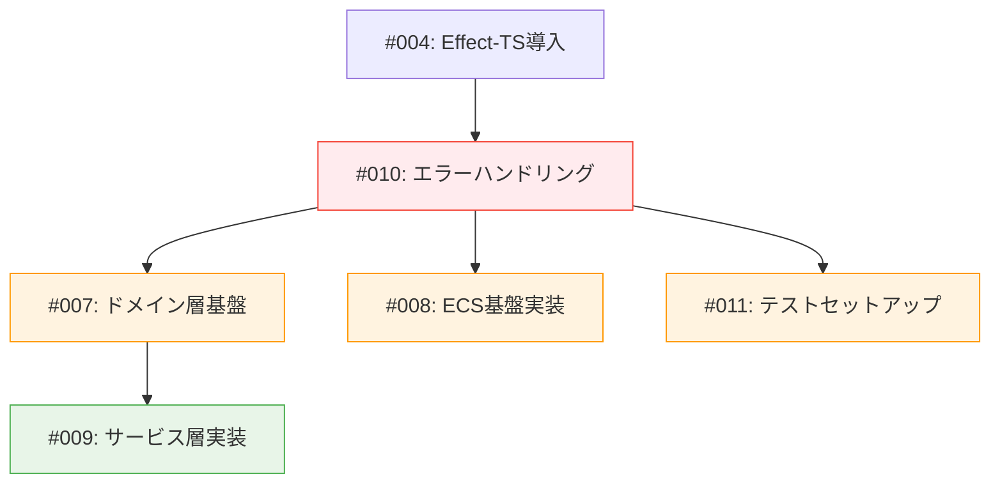
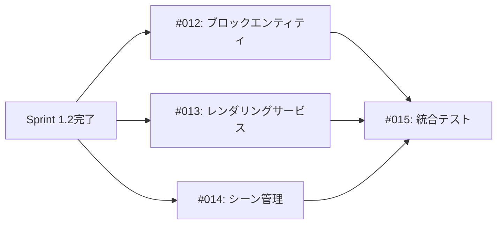
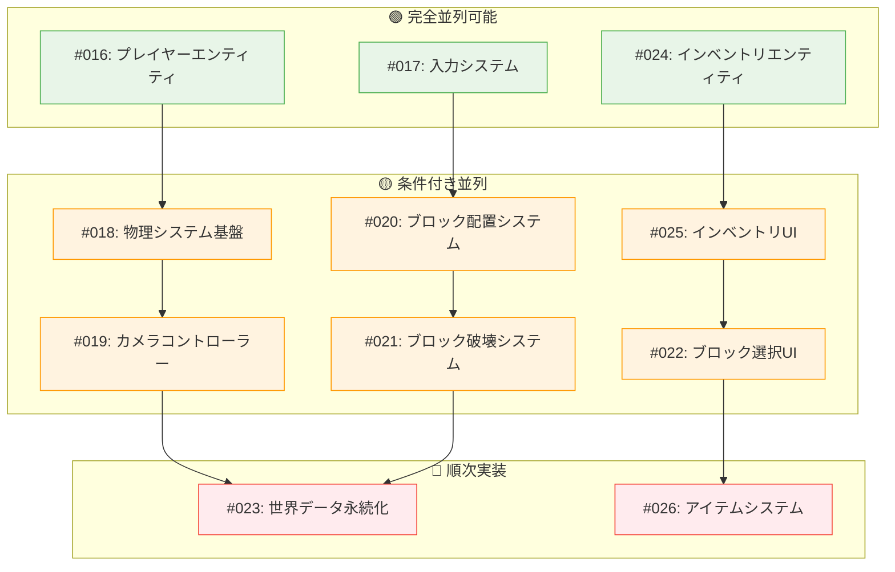
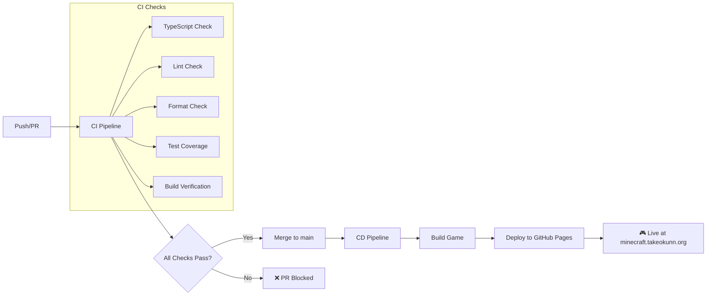
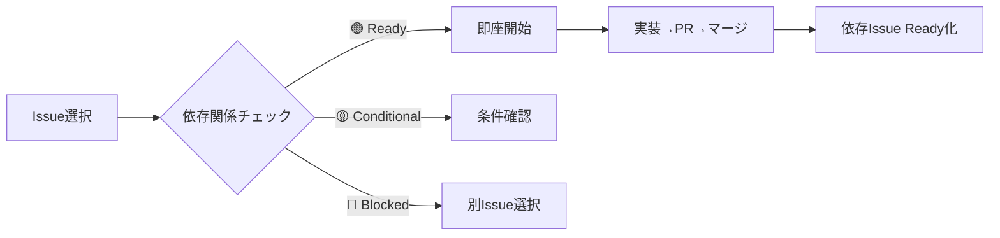

# TypeScript Minecraft Clone 開発ロードマップ

> **🎯 プロジェクトビジョン**: DDD×ECS×Effect-TSの統合アーキテクチャによる、型安全で高性能なMinecraftクローン実装

## ⚡ クイックアクション - 今すぐできること

### 🚀 **今日から始められるタスク**
<details>
<summary><strong>📋 Phase 1 - 即座開始可能なタスク（クリックで詳細表示）</strong></summary>

#### 🟢 **完全並列タスク** - 今すぐ開始可能
```bash
# 1. Package.json作成 (#001)
mkdir ts-minecraft && cd ts-minecraft
npm init -y
# ↓ 下記の依存関係をコピペ

# 2. TypeScript設定 (#002)
# ↓ tsconfig.jsonをコピペ

# 3. Vite設定 (#003)
# ↓ vite.config.tsをコピペ

# 4. 品質ツール設定 (#006)
# ↓ .prettierrc等をコピペ
```

#### 📋 **GitHub Issue作成用テンプレート**
```markdown
**Issue #001: Package.json作成**
- [ ] package.jsonの基本構造作成
- [ ] 依存関係定義（Effect-TS 3.17+, Three.js, Vite等）
- [ ] Scripts設定（dev, build, test, lint）
- [ ] Repository情報・ライセンス設定

見積もり: 0.5日 | 依存: なし | 並列: 🟢完全並列
```
</details>

### 📊 **進捗ダッシュボード**
```
Phase 1 進捗: ⬜⬜⬜⬜⬜⬜ 0/6 (0%)
├─ 🟢 並列可能: ⬜⬜⬜⬜ 0/4 (即座開始可)
└─ 🔴 ブロック待ち: ⬜⬜ 0/2 (package.json完了後)

今週の目標: Phase 1完了 (Sprint 1.1-1.3)
ブロッカー: なし ✅
```

### 🎯 **本日のアクションアイテム**
- [ ] **開発環境準備**: Node.js 20+, VSCode, Git設定
- [ ] **GitHub Issues作成**: Phase 1の6個Issues一括作成
- [ ] **並列作業開始**: #001-#003, #006 を同時進行
- [ ] **依存関係準備**: package.json完了後に #004, #005開始

### 🚨 **ブロッカー管理**
<details>
<summary><strong>🔍 現在のブロッカー・リスク（クリックで表示）</strong></summary>

#### 🚫 **アクティブブロッカー**
- **なし** ✅

#### ⚠️ **潜在的リスク**
- **Effect-TS学習コスト**: 初回実装時の学習時間 → 📚 [Effect-TS基礎ガイド](./01-architecture/06a-effect-ts-basics.md)で対策
- **Three.js統合複雑さ**: WebGL知識不足 → 🎮 段階的実装・シンプルな例から開始

#### 🔧 **リスク軽減策**
- **技術検証**: 各タスク開始前のプロトタイプ実装
- **ペアレビュー**: 複雑な実装は複数人でレビュー
- **段階的実装**: 大きなタスクを小さく分割
</details>

### 📅 **週次レビュー & 調整**
<details>
<summary><strong>📊 週次振り返りテンプレート（毎週金曜日実行）</strong></summary>

#### 📈 **今週の成果**
```markdown
## Week X レビュー (MM/DD - MM/DD)

### ✅ 完了したタスク
- #001: Package.json作成 ✅
- #002: TypeScript設定 ✅
- [実際の完了タスク]

### 📊 数値指標
- **完了タスク数**: X件
- **並列化率**: Y%
- **ブロッカー発生数**: Z件
- **見積もり精度**: ±N%

### 💡 学んだこと・改善点
- [技術的学習]
- [プロセス改善点]
- [次週への改善アクション]

### 📋 来週の計画調整
- [優先度変更]
- [見積もり再調整]
- [リスク対策]
```
</details>

### 💻 **今すぐ実行できるコマンド**
<details>
<summary><strong>⚡ Phase 1 実行コマンド集（コピペ実行可能）</strong></summary>

#### 🚀 **プロジェクト初期化（5分で完了）**
```bash
# 1. ディレクトリ作成・初期化
mkdir ts-minecraft && cd ts-minecraft
git init
npm init -y

# 2. 依存関係インストール
npm install effect@^3.17.0 @effect/platform@^0.67.0 @effect/schema@^0.77.0 three@^0.170.0 @types/three@^0.170.0

# 3. 開発依存関係インストール
npm install -D typescript@^5.6.3 @types/node@^22.7.9 vite@^5.4.8 vitest@^2.1.2 @vitest/ui@^2.1.2 @vitest/coverage-v8@^2.1.2 prettier@^3.3.3 oxlint@^0.9.10

# 4. ディレクトリ構造作成
mkdir -p src/{domain,application,infrastructure,presentation,test}
mkdir -p .github/workflows
mkdir -p public

# 5. 基本ファイル作成
touch src/main.ts
touch index.html
echo '<!DOCTYPE html><html><head><title>TS Minecraft</title></head><body><div id="app"></div><script type="module" src="/src/main.ts"></script></body></html>' > index.html
```

#### ⚙️ **設定ファイル配置（コピペ実行）**
```bash
# package.json更新（メタ情報追加）
cat > package.json << 'EOF'
[ROADMAP-TEMPLATES.mdのpackage.json内容をここにコピペ]
EOF

# TypeScript設定
cat > tsconfig.json << 'EOF'
[ROADMAP-TEMPLATES.mdのtsconfig.json内容をここにコピペ]
EOF

# Vite設定
cat > vite.config.ts << 'EOF'
[ROADMAP-TEMPLATES.mdのvite.config.ts内容をここにコピペ]
EOF

# Prettier設定
echo '{"semi":false,"singleQuote":true,"tabWidth":2,"trailingComma":"es5"}' > .prettierrc
echo 'node_modules\ndist\ncoverage' > .prettierignore
```

#### 🧪 **動作確認（必須実行）**
```bash
# 型チェック
npx tsc --noEmit

# 開発サーバー起動テスト
npm run dev &
sleep 3
curl -I http://localhost:3000
kill %1

# ビルドテスト
npm run build

# 基本テスト実行
npm test

echo "✅ 全て正常なら Phase 1.1 完了！"
```
</details>

### 🔗 **実行支援ツール**
- **📋 [コピペテンプレート集](./ROADMAP-TEMPLATES.md)** - 設定ファイル・コマンド・Issueテンプレート
- **🤖 [並列開発ワークフロー](./03-guides/10-parallel-development-workflow.md)** - 効率的な作業分担戦略
- **📝 [GitHub Issue管理](./03-guides/11-github-issue-management.md)** - Issue作成・管理の詳細手順

---

## 📋 プロジェクト概要

### 🎮 最終目標
- **完全な3D Minecraftクローン**: ブロック配置・破壊、インベントリ、クラフティング、モブ、レッドストーン等
- **教育プラットフォーム**: 関数型ゲーム開発のベストプラクティス実証
- **技術実験場**: 最新TypeScript・関数型技術の実用検証

### ⚡ 技術スタック確定版
```typescript
// コア技術
- TypeScript 5.9+
- Effect-TS 3.17+ (完全移行済み)
- Three.js (3D レンダリング)
- Vite 7.1+ (開発・ビルド)

// アーキテクチャパターン
- DDD (ドメイン駆動設計)
- ECS (Entity Component System)
- Clean Architecture (4層構造)

// 品質保証
- Vitest 3.2+ (テスト)
- oxlint (静的解析)
- Prettier (フォーマット)
```

### 📊 現在の状況
- ✅ **ドキュメント完成度**: 95% (74ファイル、4セクション構成)
- ✅ **アーキテクチャ設計**: 100% (DDD/ECS/Effect-TS統合完了)
- ⏳ **実装進捗**: 0% (これから開始)
- ⏳ **テスト準備**: 0% (テスト戦略は完成)

---

## 🗓️ 開発フェーズ

### 📅 **Phase 1: プロジェクト基盤構築** (週1-2)
**目標**: 開発環境とコア基盤を整備し、最初のブロックを表示する

#### 🛠️ **Sprint 1.1: プロジェクトセットアップ** (3-5日)
**成果物**: 開発可能な基本環境

##### 🟢 **並列グループA**: 完全並列実行可能（即座開始）

| タスク | 説明 | 見積もり | GitHub Issue | 依存関係 | 並列性 | 実行チェックリスト |
|--------|------|----------|--------------|----------|--------|-------------------|
| **Package.json作成** | npm/pnpm設定、依存関係定義 | 0.5日 | `#001` | なし | 🟢 完全並列 | [📋 詳細手順](./ROADMAP-TEMPLATES.md#-package.json-001) |
| **TypeScript設定** | tsconfig.json、厳密な型チェック | 0.5日 | `#002` | なし | 🟢 完全並列 | [⚙️ 設定コピペ](./ROADMAP-TEMPLATES.md#%EF%B8%8F-tsconfig.json-002) |
| **Vite設定** | 開発サーバー、HMR、ビルド最適化 | 0.5日 | `#003` | なし | 🟢 完全並列 | [🏗️ Vite設定](./ROADMAP-TEMPLATES.md#%EF%B8%8F-vite.config.ts-003) |
| **品質ツール設定** | Vitest、oxlint、Prettier設定 | 0.5日 | `#006` | なし | 🟢 完全並列 | [🎨 品質ツール](./ROADMAP-TEMPLATES.md#-prettierrc-006) |

##### 🟡 **並列グループB**: 順次開始（条件付き並列）

| タスク | 説明 | 見積もり | GitHub Issue | 依存関係 | 並列性 |
|--------|------|----------|--------------|----------|--------|
| **Effect-TS導入** | 基本Layer構成、Context設定 | 1日 | `#004` | `#001`完了後 | 🔴 ブロッキング |
| **Three.js基本統合** | Scene、Camera、Renderer初期化 | 1日 | `#005` | `#003`完了後 | 🟡 条件付き並列 |

##### 📊 **並列化戦略**

```mermaid
gantt
    title Sprint 1.1 並列実行計画
    dateFormat X
    axisFormat Day %d

    section 完全並列
    Package.json    :done, pkg, 0, 1d
    TypeScript設定  :done, ts, 0, 1d
    Vite設定       :done, vite, 0, 1d
    品質ツール設定  :done, tools, 0, 1d

    section 順次実行
    Effect-TS導入  :effect, after pkg, 1d
    Three.js統合   :three, after vite, 1d
```


**🎯 効率化ポイント**: 4タスクを**即座並列開始**、残り2タスクは**1日後並列開始**

**PR目標**: プロジェクト起動・ビルド・テスト実行が成功する状態

#### 🎯 **Sprint 1.2: コアアーキテクチャ実装** (4-6日)
**成果物**: DDD/ECS基盤とEffect-TSサービス層

##### 🔴 **ブロッキングタスク**: 全体の基盤（優先実装）

| タスク | 説明 | 見積もり | GitHub Issue | 依存関係 | 並列性 |
|--------|------|----------|--------------|----------|--------|
| **エラーハンドリング** | Schema.TaggedError基盤 | 1日 | `#010` | `#004`完了後 | 🔴 最優先 |

##### 🟡 **条件付き並列グループA**: エラーハンドリング完了後

| タスク | 説明 | 見積もり | GitHub Issue | 依存関係 | 並列性 |
|--------|------|----------|--------------|----------|--------|
| **ドメイン層基盤** | Block、Player、World基本エンティティ | 1.5日 | `#007` | `#010`完了後 | 🟡 並列可能 |
| **ECS基盤実装** | Entity、Component、System抽象化 | 1.5日 | `#008` | `#010`完了後 | 🟡 並列可能 |
| **基本テストセットアップ** | Effect-TSテストパターン実装 | 1日 | `#011` | `#010`完了後 | 🟡 並列可能 |

##### 🟢 **並列グループB**: さらなる並列化

| タスク | 説明 | 見積もり | GitHub Issue | 依存関係 | 並列性 |
|--------|------|----------|--------------|----------|--------|
| **サービス層実装** | Context.GenericTag使用したサービス定義 | 1日 | `#009` | `#007`完了後 | 🟢 最終並列 |

##### 📊 **依存関係図**


**🎯 効率化ポイント**: エラーハンドリング完了後に**3タスク並列開始**、最終段階で更なる並列化

**PR目標**: アーキテクチャの骨格が完成し、基本テストが通る状態

#### 🧱 **Sprint 1.3: 最初のブロック表示** (3-4日)
**成果物**: シンプルなブロックが3D空間に表示される

##### 🟡 **条件付き並列グループ**: アーキテクチャ基盤完了後

| タスク | 説明 | 見積もり | GitHub Issue | 依存関係 | 並列性 |
|--------|------|----------|--------------|----------|--------|
| **基本ブロックエンティティ** | 石ブロック1種類の定義・実装 | 1日 | `#012` | `#007`完了後 | 🟡 並列可能 |
| **レンダリングサービス** | Three.jsとの統合、メッシュ生成 | 1.5日 | `#013` | `#005`,`#009`完了後 | 🟡 並列可能 |
| **シーン管理** | カメラ、ライティング、基本操作 | 1日 | `#014` | `#005`完了後 | 🟡 並列可能 |

##### 🟢 **最終統合**: 全基盤完了後

| タスク | 説明 | 見積もり | GitHub Issue | 依存関係 | 並列性 |
|--------|------|----------|--------------|----------|--------|
| **統合テスト** | E2Eテスト基盤、ブロック表示確認 | 0.5日 | `#015` | `#012`,`#013`,`#014`完了後 | 🔴 統合必須 |

##### 📊 **並列化フロー**


**🎯 効率化ポイント**: 3つの基盤実装を**完全並列実行**、最後に統合テストで完成確認

**PR目標**: ブラウザで3Dブロックが表示され、カメラ移動が可能

---

### 🎮 **Phase 2: 基本ゲームプレイ実装** (週3-5)
**目標**: プレイヤー操作、ブロック配置・破壊、基本的なゲーム体験

#### 🎯 **Phase 2 並列戦略概要**


#### 🏃 **Sprint 2.1: プレイヤーシステム** (4-5日)
**成果物**: プレイヤー移動・カメラ制御・衝突判定

| タスク | 説明 | 見積もり | GitHub Issue |
|--------|------|----------|--------------|
| **プレイヤーエンティティ** | 位置、回転、状態管理 | 1日 | `#016` |
| **入力システム** | キーボード・マウス入力処理 | 1.5日 | `#017` |
| **物理システム基盤** | 重力、衝突判定、AABB | 1.5日 | `#018` |
| **カメラコントローラー** | FPS視点、マウスルック | 1日 | `#019` |

**PR目標**: WASDで移動、マウスで視点変更、重力・衝突が動作

#### 🧱 **Sprint 2.2: ブロック操作システム** (5-6日)
**成果物**: ブロック配置・破壊・選択の完全実装

| タスク | 説明 | 見積もり | GitHub Issue |
|--------|------|----------|--------------|
| **ブロック配置システム** | レイキャスト、配置ロジック | 2日 | `#020` |
| **ブロック破壊システム** | 破壊アニメーション、ドロップ | 1.5日 | `#021` |
| **ブロック選択UI** | ホットバー、ブロック切り替え | 1.5日 | `#022` |
| **世界データ永続化** | チャンクデータ保存・読込 | 1日 | `#023` |

**PR目標**: ブロック配置・破壊・選択が完全に動作するMVP

#### 📦 **Sprint 2.3: インベントリシステム** (4-5日)
**成果物**: アイテム管理・インベントリUI

| タスク | 説明 | 見積もり | GitHub Issue |
|--------|------|----------|--------------|
| **インベントリエンティティ** | スロット管理、アイテムスタック | 2日 | `#024` |
| **インベントリUI** | グリッド表示、ドラッグ&ドロップ | 2日 | `#025` |
| **アイテムシステム** | アイテム定義、メタデータ | 1日 | `#026` |

**PR目標**: インベントリ操作が完全に動作し、アイテムが管理できる

---

### ⚙️ **Phase 3: ゲームシステム拡張** (週6-9)
**目標**: クラフティング、チャンク、ワールド生成システム

#### 🔨 **Sprint 3.1: クラフティングシステム** (5-6日)
**成果物**: レシピベースのアイテム制作

| タスク | 説明 | 見積もり | GitHub Issue |
|--------|------|----------|--------------|
| **レシピシステム** | JSON定義、レシピ検索・実行 | 2日 | `#027` |
| **クラフティングテーブル** | 3x3グリッド、UI実装 | 2日 | `#028` |
| **基本レシピ実装** | 木材→棒、石→ツール等 | 1.5日 | `#029` |

**PR目標**: 基本的なクラフティングが動作し、ツール作成が可能

#### 🌍 **Sprint 3.2: チャンクシステム** (6-7日)
**成果物**: 効率的なワールド管理

| タスク | 説明 | 見積もり | GitHub Issue |
|--------|------|----------|--------------|
| **チャンク基盤実装** | 16x16x256ブロック管理 | 2日 | `#030` |
| **チャンク読込・保存** | 非同期IO、圧縮・最適化 | 2日 | `#031` |
| **チャンク表示最適化** | LOD、フラスタムカリング | 2日 | `#032` |
| **メモリ管理** | チャンクアンロード、GC最適化 | 1日 | `#033` |

**PR目標**: 大きなワールドでもパフォーマンスが安定

#### 🏔️ **Sprint 3.3: ワールド生成** (4-5日)
**成果物**: プロシージャルワールド生成

| タスク | 説明 | 見積もり | GitHub Issue |
|--------|------|----------|--------------|
| **地形生成アルゴリズム** | Perlinノイズ、バイオーム | 2.5日 | `#034` |
| **構造物生成** | 木、洞窟、鉱石配置 | 1.5日 | `#035` |
| **バイオームシステム** | 草原、森、砂漠基本実装 | 1日 | `#036` |

**PR目標**: 自動生成される美しい3Dワールド

---

### 🎪 **Phase 4: ゲーム体験向上** (週10-13)
**目標**: モブ、戦闘、サウンド、高度なゲーム機能

#### 👾 **Sprint 4.1: モブシステム** (6-7日)
**成果物**: AI搭載の動くエンティティ

| タスク | 説明 | 見積もり | GitHub Issue |
|--------|------|----------|--------------|
| **モブECS基盤** | モブ専用コンポーネント・システム | 2日 | `#037` |
| **基本AIシステム** | 状態機械、パスファインディング | 2.5日 | `#038` |
| **モブ種類実装** | 牛、豚、ゾンビ、スケルトン | 2日 | `#039` |
| **スポーンシステム** | 条件ベースのモブ出現 | 1日 | `#040` |

**PR目標**: 複数種類のモブが自然にスポーン・行動

#### ⚔️ **Sprint 4.2: 戦闘システム** (4-5日)
**成果物**: プレイヤー・モブ間の戦闘

| タスク | 説明 | 見積もり | GitHub Issue |
|--------|------|----------|--------------|
| **体力システム** | HP、ダメージ計算 | 1.5日 | `#041` |
| **武器・防具システム** | 装備、攻撃力・防御力 | 2日 | `#042` |
| **戦闘UI** | HPバー、ダメージエフェクト | 1.5日 | `#043` |

**PR目標**: 完全な戦闘システムが動作

#### 🔊 **Sprint 4.3: サウンドシステム** (3-4日)
**成果物**: 効果音・BGM再生

| タスク | 説明 | 見積もり | GitHub Issue |
|--------|------|----------|--------------|
| **AudioContext統合** | Web Audio API、Effect-TS化 | 1.5日 | `#044` |
| **効果音実装** | ブロック配置・破壊、歩行音 | 1.5日 | `#045` |
| **BGMシステム** | バイオーム別、時間別 | 1日 | `#046` |

**PR目標**: リアルなゲームオーディオ体験

---

### 🚀 **Phase 5: 高度な機能実装** (週14-18)
**目標**: レッドストーン、マルチプレイヤー、パフォーマンス最適化

#### ⚡ **Sprint 5.1: レッドストーンシステム** (7-8日)
**成果物**: 電気回路シミュレーション

| タスク | 説明 | 見積もり | GitHub Issue |
|--------|------|----------|--------------|
| **回路基盤実装** | 信号伝播、遅延、論理ゲート | 3日 | `#047` |
| **基本回路素子** | レッドストーン、トーチ、リピーター | 2.5日 | `#048` |
| **機械ブロック** | ピストン、ディスペンサー | 2日 | `#049` |
| **複雑回路サポート** | クロック、フリップフロップ | 1.5日 | `#050` |

**PR目標**: 自動ドア、計算機等の複雑な回路が動作

#### 🌐 **Sprint 5.2: マルチプレイヤー基盤** (8-9日)
**成果物**: リアルタイム同期システム

| タスク | 説明 | 見積もり | GitHub Issue |
|--------|------|----------|--------------|
| **WebSocket統合** | Effect-TS WebSocket Layer | 2日 | `#051` |
| **状態同期システム** | Operational Transform、CRDT | 3日 | `#052` |
| **マルチプレイヤーUI** | プレイヤーリスト、チャット | 2日 | `#053` |
| **権限・認証システム** | 基本的なユーザー管理 | 2日 | `#054` |

**PR目標**: 複数プレイヤー同時プレイが可能

#### ⚡ **Sprint 5.3: パフォーマンス最適化** (5-6日)
**成果物**: 60fps安定動作

| タスク | 説明 | 見積もり | GitHub Issue |
|--------|------|----------|--------------|
| **レンダリング最適化** | インスタンシング、オクルージョンカリング | 2.5日 | `#055` |
| **ECS最適化** | SoA最適化、並列処理 | 2日 | `#056` |
| **メモリプロファイリング** | リーク検出・修正 | 1.5日 | `#057` |

**PR目標**: 大規模ワールドでも快適動作

---

## 📊 開発の優先順位とマイルストーン

### 🎯 **重要度マトリックス**

| フェーズ | 重要度 | 実装コスト | ユーザー体験インパクト | 技術的価値 |
|---------|-------|-----------|---------------------|----------|
| **Phase 1** | 🔴 必須 | 低 | 中 | 高 (基盤技術) |
| **Phase 2** | 🔴 必須 | 中 | 高 | 高 (コア機能) |
| **Phase 3** | 🟠 重要 | 高 | 高 | 中 (ゲーム完成度) |
| **Phase 4** | 🟡 拡張 | 中 | 中 | 中 (体験向上) |
| **Phase 5** | 🟢 高度 | 非常に高 | 中 | 非常に高 (技術実証) |

### 🏆 **マイルストーン定義**

#### 🥉 **Bronze (Phase 1-2完了)**
- **達成目標**: MVP (Minimum Viable Product)
- **ユーザー価値**: 基本的なMinecraft体験
- **機能**: ブロック配置・破壊、プレイヤー移動、インベントリ
- **予定**: 開発開始から5週間

#### 🥈 **Silver (Phase 3完了)**
- **達成目標**: 完全なゲーム体験
- **ユーザー価値**: 長時間楽しめるゲーム
- **機能**: クラフティング、無限ワールド、プロシージャル生成
- **予定**: 開発開始から9週間

#### 🥇 **Gold (Phase 4完了)**
- **達成目標**: 高品質ゲーム
- **ユーザー価値**: 本格的なMinecraft代替
- **機能**: モブ、戦闘、サウンド、没入感
- **予定**: 開発開始から13週間

#### 💎 **Platinum (Phase 5完了)**
- **達成目標**: 技術デモンストレーション
- **ユーザー価値**: 先進的ゲーム体験
- **機能**: レッドストーン、マルチプレイヤー、最適化
- **予定**: 開発開始から18週間

---

## 🧪 品質保証戦略

### ✅ **各フェーズでの完了基準**

#### 📋 **Phase完了チェックリスト**
```markdown
**コード品質（CI自動チェック）**:
- [ ] TypeScript型エラー 0件 (`npm run type-check`)
- [ ] oxlint警告 0件 (`npm run lint`)
- [ ] Prettier フォーマット準拠 (`npm run format:check`)
- [ ] テストカバレッジ ≥ 90% (`npm run test:coverage`)
- [ ] Effect-TS規約100%準拠

**機能品質**:
- [ ] 全機能の正常動作確認
- [ ] パフォーマンステスト合格 (≥30fps)
- [ ] クロスブラウザ動作確認 (Chrome, Firefox, Safari)
- [ ] 🌐 **GitHub Pages自動デプロイ成功**: https://minecraft.takeokunn.org

**CI/CD品質**:
- [ ] CI パイプライン全て成功 (✅ status check)
- [ ] main ブランチマージ後2-3分以内にライブ反映
- [ ] プレビューアドレスへのアクセス可能
- [ ] 自動テスト・ビルド・デプロイの流れ確認

**ドキュメント**:
- [ ] API仕様書更新
- [ ] 実装パターン記録
- [ ] トラブルシューティング情報追加
```

### 🔄 **継続的インテグレーション**

#### 🤖 **自動化されたCI/CDフロー**



#### ⚙️ **GitHub Actions設定**
- **CI**: `.github/workflows/ci.yml` - 品質チェック自動化
- **CD**: `.github/workflows/cd.yml` - GitHub Pages自動デプロイ
- **詳細設定**: [CI/CDガイド](./03-guides/08-ci-cd-deployment.md)

#### 🌐 **デプロイメント**
- **ライブURL**: https://minecraft.takeokunn.org
- **自動更新**: main ブランチマージから2-3分で反映
- **プレビュー**: 全PRで自動ビルドチェック

---

## 🎓 学習・教育価値

### 📚 **技術習得ロードマップ**

このプロジェクトを通じて習得できる技術:

| フェーズ | 習得技術 | 難易度 | 応用範囲 |
|---------|----------|-------|----------|
| **Phase 1** | Effect-TS基礎、Three.js基本 | 初級-中級 | Web開発一般 |
| **Phase 2** | 関数型ゲーム設計、ECS基本 | 中級 | リアルタイムアプリ |
| **Phase 3** | 高度なアルゴリズム、最適化 | 中級-上級 | 高性能アプリ |
| **Phase 4** | AI・物理シミュレーション | 上級 | ゲーム・シミュレーション |
| **Phase 5** | 分散システム、超最適化 | エキスパート | エンタープライズ |

### 🎯 **スキル開発フォーカス**

1. **関数型プログラミング**: Effect-TS完全活用
2. **型駆動開発**: Schema.Structによる設計
3. **ドメイン駆動設計**: 複雑ドメインの管理
4. **高性能プログラミング**: ゲームレベルの最適化
5. **テスト駆動開発**: Property-based Testing

---

## 🚨 リスクと対策

### ⚠️ **技術リスク**

| リスク | 影響度 | 対策 |
|--------|--------|------|
| **Effect-TS学習コスト** | 高 | 段階的導入、豊富なサンプル |
| **パフォーマンス問題** | 中 | 早期プロファイリング、段階的最適化 |
| **Three.js複雑性** | 中 | 薄いラッパー層、段階的実装 |
| **ブラウザ互換性** | 低 | モダンブラウザ対象、ポリフィル使用 |

### 📅 **スケジュールリスク**

- **楽観的**: 15週間 (各スプリント-20%)
- **現実的**: 18週間 (計画通り)
- **悲観的**: 24週間 (予期しない問題+33%)

### 🛡️ **品質リスク対策**

- **技術検証**: 各フェーズ開始前のプロトタイプ実装
- **継続的統合**: 自動テスト、品質ゲート
- **段階的リリース**: MVP→完全版の段階展開
- **コミュニティフィードバック**: GitHub Issue、ドキュメント改善

---

## ⚡ 並列開発効率化ガイド

### 🎯 **並列作業の原則**

#### 📊 **効率性指標**
- **並列化率**: Phase 1-2で≥60%、Phase 3-5で≥40%
- **待機時間**: ≤20% of 総開発時間
- **スループット**: 週あたり完了Issue数最大化

#### 🏷️ **Issue管理ラベル**
```markdown
優先度: priority: critical/high/medium/low
タイプ: type: feature/bug/enhancement/config
状態: status: ready/in-progress/blocked/review
依存: depends-on: #XXX / blocks: #XXX / parallel-safe
並列: parallel-safe / parallel-conditional
```

#### 🔄 **開発フロー**


### 🧠 **チーム分担戦略**

**👤 フロントエンド担当**: UI・プレゼンテーション層
- 設定ファイル群 (#001-#003, #006)
- プレゼンテーション系実装 (#017, #022, #025)

**👤 バックエンド担当**: システム・インフラ層
- 基盤アーキテクチャ (#004, #010, #007-#009)
- データ・永続化系 (#023, #026)

**👤 統合・品質担当**: テスト・統合
- テスト基盤 (#011, #015)
- 品質保証・統合テスト

---

## 🔗 次のアクション

### 📝 **実装開始前の準備**

1. **Phase 1のGitHub Issues作成**
   - **並列グループ別**にIssue一括作成
   - **依存関係ラベル**設定 (depends-on/blocks/parallel-safe)
   - 詳細なAcceptance Criteria定義
   - 見積もり時間とラベル設定

2. **並列開発環境準備**
   - **ブランチ戦略**設定 (feature/グループ名)
   - **衝突回避**のためのファイル分担
   - 日次**進捗共有**ルール設定

3. **開発チーム体制**
   - **並列作業可能な開発者**3名体制
   - レビュー体制・衝突解決プロセス
   - **ブロッカー解決**24時間以内体制

### 🎯 **最初のPR目標**

**🟢 並列PR群**: 基盤設定 (同時進行可能)
- PR #1: Package.json + 依存関係
- PR #2: TypeScript設定
- PR #3: Vite設定
- PR #4: 品質ツール設定

**🔴 基盤PR**: Effect-TS導入 (ブロッキング)
- PR #5: Effect-TS基盤 + エラーハンドリング

**期限**: 1週目完了

---

## 📞 サポート・質問

### 🔗 **関連ドキュメント**
- **[プロジェクト概要](./00-introduction/00-project-overview.md)** - 全体像の理解
- **[アーキテクチャ概要](./01-architecture/00-overall-design.md)** - 技術的詳細
- **[開発規約](./03-guides/00-development-conventions.md)** - コーディング規則
- **[並列開発ワークフロー](./03-guides/10-parallel-development-workflow.md)** - 効率的な並列作業戦略
- **[GitHub Issue管理](./03-guides/11-github-issue-management.md)** - Issue作成・管理の詳細
- **[CI/CDガイド](./03-guides/08-ci-cd-deployment.md)** - 自動化されたデプロイメント

### 💬 **質問・フィードバック**
- GitHub Issues: 技術的質問・提案
- GitHub Discussions: 設計議論・アイデア
- PRレビュー: 実装フィードバック

---

**🎮 Ready to Build the Future of Functional Game Development!**

`★ Insight ─────────────────────────────────────`
- **段階的アプローチ**: MVPから完全版まで明確な段階を設定し、各フェーズで価値を提供
- **技術実証と教育価値**: 単なるゲーム実装ではなく、DDD×ECS×Effect-TSの統合パターンを実証するプラットフォーム
- **リスク管理**: 技術・スケジュール・品質の各リスクを事前に識別し、具体的な対策を準備
`─────────────────────────────────────────────────`

これで詳細なROADMAPが完成しました。18週間で段階的に実装を進める計画で、各フェーズでの具体的なタスク、GitHub Issue番号、完了基準まで含めた実行可能な開発計画になっています。

<function_calls>
<invoke name="TodoWrite">
<parameter name="todos">[{"content": "\u73fe\u5728\u306e\u30c9\u30ad\u30e5\u30e1\u30f3\u30c8\u69cb\u9020\u3068\u30a2\u30fc\u30ad\u30c6\u30af\u30c1\u30e3\u60c5\u5831\u3092\u8abf\u67fb\u3059\u308b", "status": "completed", "activeForm": "\u73fe\u5728\u306e\u30c9\u30ad\u30e5\u30e1\u30f3\u30c8\u69cb\u9020\u3068\u30a2\u30fc\u30ad\u30c6\u30af\u30c1\u30e3\u60c5\u5831\u3092\u8abf\u67fb\u4e2d"}, {"content": "\u65e2\u5b58\u306e\u5b9f\u88c5\u72b6\u6cc1\u3092\u78ba\u8a8d\u3059\u308b", "status": "completed", "activeForm": "\u65e2\u5b58\u306e\u5b9f\u88c5\u72b6\u6cc1\u3092\u78ba\u8a8d\u4e2d"}, {"content": "ROADMAP\u306e\u69cb\u9020\u3068\u512a\u5148\u9806\u4f4d\u3092\u8a2d\u8a08\u3059\u308b", "status": "completed", "activeForm": "ROADMAP\u306e\u69cb\u9020\u3068\u512a\u5148\u9806\u4f4d\u3092\u8a2d\u8a08\u4e2d"}, {"content": "docs/ROADMAP.md\u3092\u4f5c\u6210\u3059\u308b", "status": "completed", "activeForm": "docs/ROADMAP.md\u3092\u4f5c\u6210\u4e2d"}]