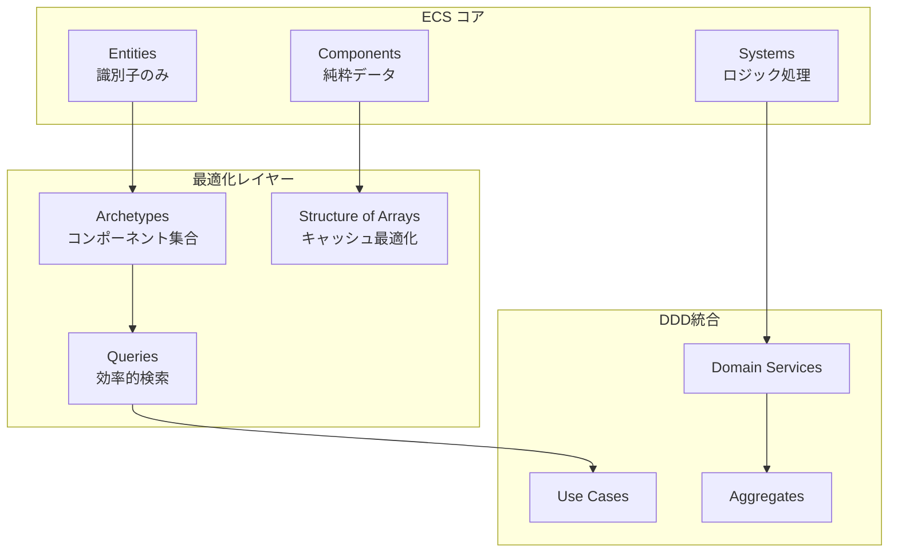

# ECS システム統合

TypeScript Minecraftプロジェクトでは、**Entity Component System (ECS)** アーキテクチャを **Domain-Driven Design** および **Effect-TS** と統合し、高性能で保守性の高いゲームエンジンを実現しています。このドキュメントでは、ECSの実装方式と統合パターンについて詳説します。

## ECS アーキテクチャ概要

### ECS の基本構成



### 設計原則

1. **データとロジックの分離**: コンポーネントは純粋データ、システムがロジック処理
2. **組み合わせによる柔軟性**: エンティティは異なるコンポーネント組み合わせで多様な振る舞い
3. **パフォーマンス重視**: Structure of Arrays (SoA)による最適化
4. **型安全性**: Effect-TSスキーマによる実行時バリデーション

## コンポーネント設計

### コンポーネントスキーマ定義

```typescript
// src/domain/entities/components/component-schemas.ts
export const ComponentSchemas = {
  // 物理コンポーネント
  position: PhysicsModule.PositionComponent,
  velocity: PhysicsModule.VelocityComponent,
  acceleration: PhysicsModule.AccelerationComponent,
  mass: PhysicsModule.MassComponent,
  collider: PhysicsModule.ColliderComponent,

  // レンダリングコンポーネント
  mesh: RenderingModule.MeshComponent,
  material: RenderingModule.MaterialComponent,
  light: RenderingModule.LightComponent,
  camera: RenderingModule.CameraComponent,
  renderable: RenderingModule.RenderableComponent,

  // ゲームプレイコンポーネント
  health: GameplayModule.HealthComponent,
  inventory: GameplayModule.InventoryComponent,
  playerControl: GameplayModule.PlayerControlComponent,
  ai: GameplayModule.AIComponent,
  target: GameplayModule.TargetComponent,
  player: GameplayModule.PlayerComponent,
  inputState: GameplayModule.InputStateComponent,
  cameraState: GameplayModule.CameraStateComponent,
  hotbar: GameplayModule.HotbarComponent,
  gravity: GameplayModule.GravityComponent,
  frozen: GameplayModule.FrozenComponent,
  disabled: GameplayModule.DisabledComponent,

  // ワールドコンポーネント
  chunk: WorldModule.ChunkComponent,
  chunkLoaderState: WorldModule.ChunkLoaderStateComponent,
  terrainBlock: WorldModule.TerrainBlockComponent,
  targetBlock: WorldModule.TargetBlockComponent,
} as const
```

### 物理コンポーネントの実装

```typescript
// src/domain/entities/components/physics/physics-components.ts
export const PositionComponent = S.Struct({
  _tag: S.Literal('PositionComponent'),
  x: S.Number.pipe(S.finite()),
  y: S.Number.pipe(S.finite()),
  z: S.Number.pipe(S.finite()),
})

export const VelocityComponent = S.Struct({
  _tag: S.Literal('VelocityComponent'),
  dx: S.Number.pipe(S.finite()),
  dy: S.Number.pipe(S.finite()),
  dz: S.Number.pipe(S.finite()),
})

export const ColliderComponent = S.Struct({
  _tag: S.Literal('ColliderComponent'),
  type: S.Union(
    S.Literal('box'),
    S.Literal('sphere'),
    S.Literal('capsule'),
    S.Literal('mesh')
  ),
  bounds: S.Struct({
    min: S.Struct({ x: S.Number, y: S.Number, z: S.Number }),
    max: S.Struct({ x: S.Number, y: S.Number, z: S.Number }),
  }),
  solid: S.Boolean,
  trigger: S.Boolean,
})

export const MassComponent = S.Struct({
  _tag: S.Literal('MassComponent'),
  value: S.Number.pipe(S.positive()),
  inverseMass: S.Number.pipe(S.finite()),
  static: S.Boolean,
})

// コンポーネントファクトリー
export const PhysicsComponentFactories = {
  position: (x: number, y: number, z: number) =>
    PositionComponent.make({ _tag: 'PositionComponent', x, y, z }),
    
  velocity: (dx: number, dy: number, dz: number) =>
    VelocityComponent.make({ _tag: 'VelocityComponent', dx, dy, dz }),
    
  staticCollider: (bounds: Bounds) =>
    ColliderComponent.make({
      _tag: 'ColliderComponent',
      type: 'box',
      bounds,
      solid: true,
      trigger: false,
    }),
    
  dynamicMass: (mass: number) =>
    MassComponent.make({
      _tag: 'MassComponent',
      value: mass,
      inverseMass: mass > 0 ? 1 / mass : 0,
      static: false,
    }),
}
```

### ゲームプレイコンポーネントの実装

```typescript
// src/domain/entities/components/gameplay/gameplay-components.ts
export const HealthComponent = S.Struct({
  _tag: S.Literal('HealthComponent'),
  current: S.Number.pipe(S.nonNegative()),
  maximum: S.Number.pipe(S.positive()),
  regenerationRate: S.Number.pipe(S.nonNegative()),
  lastDamageTime: S.Date,
})

export const InventoryComponent = S.Struct({
  _tag: S.Literal('InventoryComponent'),
  slots: S.Array(S.Struct({
    itemId: S.Union(ItemId, S.Null),
    quantity: S.Number.pipe(S.nonNegative()),
    metadata: S.Record(S.String, S.Unknown),
  })),
  maxSlots: S.Number.pipe(S.positive()),
  totalWeight: S.Number.pipe(S.nonNegative()),
  maxWeight: S.Number.pipe(S.positive()),
})

export const PlayerControlComponent = S.Struct({
  _tag: S.Literal('PlayerControlComponent'),
  controllerId: EntityId,
  inputMap: S.Record(S.String, S.Boolean),
  sensitivity: S.Struct({
    mouse: S.Number.pipe(S.positive()),
    keyboard: S.Number.pipe(S.positive()),
  }),
  invertY: S.Boolean,
})

export const AIComponent = S.Struct({
  _tag: S.Literal('AIComponent'),
  behaviorTree: S.String, // BehaviorTreeId
  currentState: S.String,
  targetEntity: S.Union(EntityId, S.Null),
  pathfindingData: S.Struct({
    path: S.Array(PositionComponent),
    pathIndex: S.Number.pipe(S.nonNegative()),
    destination: S.Union(PositionComponent, S.Null),
  }),
  aggroRange: S.Number.pipe(S.positive()),
  attackRange: S.Number.pipe(S.positive()),
})
```

## アーキタイプシステム

### アーキタイプの概念

アーキタイプは、同じコンポーネント組み合わせを持つエンティティのグループです。これにより、効率的なメモリレイアウトとクエリ最適化を実現します。

```typescript
// src/application/queries/archetype-query.ts
export interface ArchetypeSignature {
  readonly components: ReadonlySet<ComponentName>
  readonly hash: string
}

export interface ArchetypeState {
  readonly entities: ReadonlyArray<EntityId>
  readonly componentArrays: ComponentArrays
  readonly capacity: number
  readonly count: number
}

// ArchetypeQuery を純粋関数として実装
export const ArchetypeQueryFunctions = {
  addEntity: (entity: QueryEntity): Effect.Effect<void, ArchetypeError> =>
    addEntityToArchetype(entity),

  removeEntity: (entity: QueryEntity): Effect.Effect<void, ArchetypeError> =>
    removeEntityFromArchetype(entity),

  getArchetypeStats: (): Effect.Effect<ArchetypeStats, never> =>
    getArchetypeStats(),

  reset: (): Effect.Effect<void, never> =>
    Effect.sync(() => {
      // アーキタイプデータのクリア
      clearArchetypeData()
    })
}

// アーキタイプクエリビルダー関数
export const createArchetypeQuery = (signature: ArchetypeSignature) => ({
  signature,
  execute: (): Effect.Effect<ReadonlyArray<QueryResult>, QueryError> =>
    Effect.gen(function* () {
      const archetypeManager = yield* ArchetypeManagerService
      return yield* archetypeManager.queryArchetype(signature)
    })
})

// 複合クエリビルダー関数
export const buildComplexQuery = (config: {
  all?: ComponentName[]
  any?: ComponentName[]
  none?: ComponentName[]
  changed?: ComponentName[]
}): Effect.Effect<ArchetypeQuery, QueryBuildError> =>
  Effect.gen(function* () {
    const allComponents = new Set(config.all ?? [])
    const anyComponents = new Set(config.any ?? [])
    const noneComponents = new Set(config.none ?? [])
    const changedComponents = new Set(config.changed ?? [])

    // クエリ検証
    if (allComponents.size === 0 && anyComponents.size === 0) {
      return yield* Effect.fail(new QueryBuildError("Query must specify at least one component"))
    }

    const signature: ArchetypeSignature = {
      components: allComponents,
      hash: generateQueryHash(allComponents, anyComponents, noneComponents, changedComponents)
    }

    return createArchetypeQuery(signature)
  })

// アーキタイプマネージャーインターフェース
interface ArchetypeManagerInterface {
  readonly createArchetype: (signature: ArchetypeSignature) => Effect.Effect<string, ArchetypeError>
  readonly addEntityToArchetype: (entityId: EntityId, archetypeId: string, components: Components) => Effect.Effect<void, ArchetypeError>
  readonly removeEntity: (entityId: EntityId) => Effect.Effect<void, ArchetypeError>
  readonly queryArchetype: (signature: ArchetypeSignature) => Effect.Effect<ReadonlyArray<QueryResult>, QueryError>
  readonly findOrCreateArchetype: (signature: ArchetypeSignature) => Effect.Effect<string, ArchetypeError>
  readonly getStats: () => Effect.Effect<ArchetypeManagerStats, never>
}

// Context Tag
export const ArchetypeManagerService = Context.GenericTag<ArchetypeManagerInterface>("ArchetypeManagerService")

// アーキタイプ管理サービスの実装
const makeArchetypeManager = Effect.gen(function* () {
  const state = yield* Ref.make<ArchetypeManagerState>({
    archetypes: new Map(),
    entityToArchetype: new Map(),
    nextArchetypeId: 0,
  })

    return ArchetypeManagerService.of({
      createArchetype: (signature: ArchetypeSignature) =>
        Effect.gen(function* () {
          const currentState = yield* Ref.get(state)
          const archetypeId = `archetype_${currentState.nextArchetypeId}`

          const newArchetype: ArchetypeState = {
            entities: [],
            componentArrays: createComponentArrays(signature.components),
            capacity: INITIAL_ARCHETYPE_CAPACITY,
            count: 0,
          }

          yield* Ref.update(state, (s) => ({
            ...s,
            archetypes: new Map(s.archetypes).set(archetypeId, newArchetype),
            nextArchetypeId: s.nextArchetypeId + 1,
          }))

          return archetypeId
        }),

      addEntityToArchetype: (entityId: EntityId, archetypeId: string, components: Components) =>
        Effect.gen(function* () {
          yield* Ref.update(state, (s) => {
            const archetype = s.archetypes.get(archetypeId)
            if (!archetype) {
              return s
            }

            const updatedArchetype = addEntityToArchetypeState(archetype, entityId, components)
            return {
              ...s,
              archetypes: new Map(s.archetypes).set(archetypeId, updatedArchetype),
              entityToArchetype: new Map(s.entityToArchetype).set(entityId, archetypeId),
            }
          })
        }),

      removeEntity: (entityId: EntityId) =>
        Effect.gen(function* () {
          yield* Ref.update(state, (s) => {
            const archetypeId = s.entityToArchetype.get(entityId)
            if (!archetypeId) {
              return s
            }

            const archetype = s.archetypes.get(archetypeId)
            if (!archetype) {
              return s
            }

            const updatedArchetype = removeEntityFromArchetypeState(archetype, entityId)
            return {
              ...s,
              archetypes: new Map(s.archetypes).set(archetypeId, updatedArchetype),
              entityToArchetype: new Map(s.entityToArchetype).delete(entityId),
            }
          })
        }),

      queryArchetype: (signature: ArchetypeSignature) =>
        Effect.gen(function* () {
          const currentState = yield* Ref.get(state)
          const matchingArchetypes = Array.from(currentState.archetypes.entries())
            .filter(([_, archetype]) =>
              isSignatureMatching(archetype.componentArrays, signature)
            )

          return matchingArchetypes.map(([id, archetype]) => ({
            archetypeId: id,
            entities: archetype.entities,
            components: archetype.componentArrays,
          }))
        }),

      findOrCreateArchetype: (signature: ArchetypeSignature) =>
        Effect.gen(function* () {
          const currentState = yield* Ref.get(state)

          // 既存のアーキタイプを検索
          const existingArchetype = Array.from(currentState.archetypes.entries())
            .find(([_, archetype]) =>
              isExactSignatureMatch(archetype.componentArrays, signature)
            )

          if (existingArchetype) {
            return existingArchetype[0]
          }

          // 新規作成
          return yield* createArchetype(signature)
        }),

      getStats: () =>
        Effect.gen(function* () {
          const currentState = yield* Ref.get(state)
          const totalEntities = Array.from(currentState.archetypes.values())
            .reduce((sum, archetype) => sum + archetype.entities.length, 0)

          return {
            totalArchetypes: currentState.archetypes.size,
            totalEntities,
            averageEntitiesPerArchetype: totalEntities / Math.max(1, currentState.archetypes.size),
            memoryUsage: calculateArchetypeMemoryUsage(currentState.archetypes)
          }
        })
    })
  })

// Live Layer
export const ArchetypeManagerLive = Layer.effect(
  ArchetypeManagerService,
  makeArchetypeManager
)
```

### Structure of Arrays (SoA) 最適化

```typescript
// src/application/queries/soa-optimization.ts
export interface ComponentArrays {
  // 位置コンポーネント配列
  position?: {
    x: Float32Array
    y: Float32Array
    z: Float32Array
  }
  
  // 速度コンポーネント配列
  velocity?: {
    dx: Float32Array
    dy: Float32Array
    dz: Float32Array
  }
  
  // ヘルスコンポーネント配列
  health?: {
    current: Uint16Array
    maximum: Uint16Array
    regenerationRate: Float32Array
  }
  
  // レンダリングコンポーネント配列
  mesh?: {
    meshId: Uint32Array
    materialId: Uint32Array
    visible: Uint8Array // boolean配列
  }
}

export const createComponentArrays = (
  componentNames: ReadonlySet<ComponentName>,
  capacity: number = 1000
): ComponentArrays => {
  const arrays: ComponentArrays = {}
  
  if (componentNames.has('position')) {
    arrays.position = {
      x: new Float32Array(capacity),
      y: new Float32Array(capacity),
      z: new Float32Array(capacity),
    }
  }
  
  if (componentNames.has('velocity')) {
    arrays.velocity = {
      dx: new Float32Array(capacity),
      dy: new Float32Array(capacity),
      dz: new Float32Array(capacity),
    }
  }
  
  if (componentNames.has('health')) {
    arrays.health = {
      current: new Uint16Array(capacity),
      maximum: new Uint16Array(capacity),
      regenerationRate: new Float32Array(capacity),
    }
  }
  
  if (componentNames.has('mesh')) {
    arrays.mesh = {
      meshId: new Uint32Array(capacity),
      materialId: new Uint32Array(capacity),
      visible: new Uint8Array(capacity),
    }
  }
  
  return arrays
}

// SoA形式でのコンポーネント操作
export const SoAOperations = {
  // エンティティの一括移動処理
  updatePositions: (
    arrays: ComponentArrays,
    entityCount: number,
    deltaTime: number
  ): Effect.Effect<void, SystemError> => {
    return Effect.sync(() => {
      if (!arrays.position || !arrays.velocity) {
        return
      }
      
      // SIMD最適化が可能な連続処理
      for (let i = 0; i < entityCount; i++) {
        arrays.position.x[i] += arrays.velocity.dx[i] * deltaTime
        arrays.position.y[i] += arrays.velocity.dy[i] * deltaTime
        arrays.position.z[i] += arrays.velocity.dz[i] * deltaTime
      }
    })
  },
  
  // 一括健康状態更新
  updateHealth: (
    arrays: ComponentArrays,
    entityCount: number,
    deltaTime: number
  ): Effect.Effect<void, SystemError> => {
    return Effect.sync(() => {
      if (!arrays.health) {
        return
      }
      
      for (let i = 0; i < entityCount; i++) {
        const current = arrays.health.current[i]
        const maximum = arrays.health.maximum[i]
        const regen = arrays.health.regenerationRate[i]
        
        if (current < maximum) {
          arrays.health.current[i] = Math.min(
            maximum,
            current + regen * deltaTime
          )
        }
      }
    })
  },
}
```

## システム実装パターン

### 物理システム

```typescript
// src/application/use-cases/physics-system.usecase.ts
export const physicsSystemUseCase = Effect.gen(function* () {
  const archetypeManager = yield* ArchetypeManagerService
  const collisionDetector = yield* CollisionDetectorPort
  
  return {
    updateMovement: (deltaTime: number) =>
      Effect.gen(function* () {
        // 移動可能エンティティのクエリ
        const movableSignature: ArchetypeSignature = {
          components: new Set(['position', 'velocity']),
          hash: 'position+velocity',
        }
        
        const archetypes = yield* archetypeManager.queryArchetype(movableSignature)
        
        // アーキタイプごとに一括処理
        yield* Effect.forEach(
          archetypes,
          (archetype) => SoAOperations.updatePositions(
            archetype.components,
            archetype.entities.length,
            deltaTime
          ),
          { concurrency: 'unbounded' }
        )
      }),
      
    applyGravity: (deltaTime: number) =>
      Effect.gen(function* () {
        const gravitySignature: ArchetypeSignature = {
          components: new Set(['velocity', 'gravity']),
          hash: 'velocity+gravity',
        }
        
        const archetypes = yield* archetypeManager.queryArchetype(gravitySignature)
        
        yield* Effect.forEach(
          archetypes,
          (archetype) => Effect.sync(() => {
            const { velocity } = archetype.components
            if (!velocity) return
            
            for (let i = 0; i < archetype.entities.length; i++) {
              velocity.dy[i] -= GRAVITY_CONSTANT * deltaTime
            }
          }),
          { concurrency: 'unbounded' }
        )
      }),
      
    detectCollisions: () =>
      Effect.gen(function* () {
        const colliderSignature: ArchetypeSignature = {
          components: new Set(['position', 'collider']),
          hash: 'position+collider',
        }
        
        const archetypes = yield* archetypeManager.queryArchetype(colliderSignature)
        
        // 空間分割による効率的な衝突検出
        for (const archetype of archetypes) {
          const entities = archetype.entities
          const { position, collider } = archetype.components
          
          if (!position || !collider) continue
          
          // 総当たりではなく空間グリッドを使用
          yield* detectCollisionsInSpatialGrid(entities, position, collider)
        }
      }),
  }
})
```

### レンダリングシステム

```typescript
// src/application/use-cases/rendering-system.usecase.ts
export const renderingSystemUseCase = Effect.gen(function* () {
  const archetypeManager = yield* ArchetypeManagerService
  const renderer = yield* RenderPort
  
  return {
    updateRenderables: () =>
      Effect.gen(function* () {
        const renderableSignature: ArchetypeSignature = {
          components: new Set(['position', 'mesh', 'renderable']),
          hash: 'position+mesh+renderable',
        }
        
        const archetypes = yield* archetypeManager.queryArchetype(renderableSignature)
        
        yield* Effect.forEach(
          archetypes,
          (archetype) => Effect.gen(function* () {
            const { position, mesh, renderable } = archetype.components
            if (!position || !mesh || !renderable) return
            
            // バッチレンダリング用のデータ準備
            const renderBatch = prepareRenderBatch(
              archetype.entities,
              position,
              mesh,
              renderable
            )
            
            yield* renderer.renderBatch(renderBatch)
          }),
          { concurrency: 4 } // GPU並列度を考慮
        )
      }),
      
    updateLighting: () =>
      Effect.gen(function* () {
        const lightSignature: ArchetypeSignature = {
          components: new Set(['position', 'light']),
          hash: 'position+light',
        }
        
        const archetypes = yield* archetypeManager.queryArchetype(lightSignature)
        
        const allLights: LightData[] = []
        for (const archetype of archetypes) {
          const lights = extractLightData(archetype.components)
          allLights.push(...lights)
        }
        
        yield* renderer.updateLighting(allLights)
      }),
      
    culling: (cameraPosition: Position, frustum: Frustum) =>
      Effect.gen(function* () {
        const renderableSignature: ArchetypeSignature = {
          components: new Set(['position', 'mesh', 'renderable']),
          hash: 'position+mesh+renderable',
        }
        
        const archetypes = yield* archetypeManager.queryArchetype(renderableSignature)
        
        // フラスタムカリング
        for (const archetype of archetypes) {
          const { position, mesh, renderable } = archetype.components
          if (!position || !mesh || !renderable) continue
          
          yield* performFrustumCulling(
            archetype.entities,
            position,
            mesh,
            renderable,
            frustum
          )
        }
      }),
  }
})
```

## クエリシステム最適化

### 統一クエリシステム

```typescript
// src/application/queries/unified-query-system.ts
export const querySystem = {
  addEntity: (entity: QueryEntity) => Effect.succeed(void 0),
  removeEntity: (entity: QueryEntity) => Effect.succeed(void 0),
  updateEntity: (entity: QueryEntity) => Effect.succeed(void 0),
  
  getStats: () => Effect.succeed({
    totalEntities: 0,
    totalQueries: 0,
    cacheHitRate: 0,
    averageQueryTime: 0,
  }),
  
  reset: () => Effect.succeed(void 0),
  invalidateCache: (components?: string[]) => Effect.succeed(void 0),
  cleanupCache: () => Effect.succeed(void 0),
  
  getCacheStats: () => Effect.succeed({
    totalEntries: 0,
    hitRate: 0,
    memoryUsage: 0,
  }),
}

// 高度なクエリビルダー
export const QueryBuilder = {
  all: (...components: ComponentName[]) => ({
    type: 'all',
    components: new Set(components),
  }),
  
  any: (...components: ComponentName[]) => ({
    type: 'any',
    components: new Set(components),
  }),
  
  none: (...components: ComponentName[]) => ({
    type: 'none', 
    components: new Set(components),
  }),
  
  changed: (...components: ComponentName[]) => ({
    type: 'changed',
    components: new Set(components),
  }),
}

// 複合クエリの例
const movablePlayerQuery = {
  all: ['position', 'velocity', 'player'],
  none: ['frozen', 'disabled'],
  changed: ['inputState'],
}

const damagedEntitiesQuery = {
  all: ['health'],
  any: ['player', 'ai'],
  changed: ['health'],
}
```

### パフォーマンス最適化

```typescript
// src/application/queries/performance-optimization.ts
export const QueryOptimizations = {
  // プリフェッチによる最適化
  prefetchArchetypes: (queries: ReadonlyArray<QuerySignature>) =>
    Effect.gen(function* () {
      const archetypeManager = yield* ArchetypeManagerService
      
      // よく使用されるクエリのアーキタイプを事前ロード
      yield* Effect.forEach(
        queries,
        (query) => archetypeManager.queryArchetype(query),
        { concurrency: 'unbounded' }
      )
    }),
  
  // メモリプールによる最適化
  useMemoryPool: <T>(factory: () => T, reset: (item: T) => void) => {
    const pool: T[] = []
    
    return {
      acquire: (): T => {
        const item = pool.pop()
        return item ?? factory()
      },
      
      release: (item: T): void => {
        reset(item)
        pool.push(item)
      },
      
      clear: (): void => {
        pool.length = 0
      }
    }
  },
  
  // バッチ処理による最適化
  batchUpdates: <T>(
    updates: ReadonlyArray<T>,
    processor: (batch: ReadonlyArray<T>) => Effect.Effect<void, SystemError>,
    batchSize: number = 100
  ) =>
    Effect.gen(function* () {
      for (let i = 0; i < updates.length; i += batchSize) {
        const batch = updates.slice(i, i + batchSize)
        yield* processor(batch)
      }
    }),
}
```

## DDDとの統合パターン

### ドメインサービスでのECS利用

```typescript
// src/domain/services/world-management.domain-service.ts
export const WorldManagementDomainService = Layer.effect(
  WorldManagementDomainServiceTag,
  Effect.gen(function* () {
    const archetypeManager = yield* ArchetypeManagerService
    const querySystem = yield* QuerySystemService
    
    return WorldManagementDomainService.of({
      // ドメインロジックとECSの統合
      processWorldTick: (deltaTime: number) =>
        Effect.gen(function* () {
          // 1. 物理システム実行
          yield* physicsSystemUseCase.updateMovement(deltaTime)
          yield* physicsSystemUseCase.applyGravity(deltaTime)
          yield* physicsSystemUseCase.detectCollisions()
          
          // 2. ゲームロジックシステム実行
          yield* gameplaySystemUseCase.updateAI(deltaTime)
          yield* gameplaySystemUseCase.processPlayerInput()
          yield* gameplaySystemUseCase.updateHealth(deltaTime)
          
          // 3. レンダリングシステム実行
          yield* renderingSystemUseCase.updateRenderables()
          yield* renderingSystemUseCase.updateLighting()
          yield* renderingSystemUseCase.culling(cameraPosition, frustum)
        }),
        
      // エンティティライフサイクル管理
      createGameEntity: (entityData: EntityCreationData) =>
        Effect.gen(function* () {
          const entityId = yield* generateEntityId()
          const components = yield* validateAndCreateComponents(entityData)
          
          // アーキタイプシステムに追加
          const signature = createSignatureFromComponents(components)
          const archetypeId = yield* archetypeManager.findOrCreateArchetype(signature)
          yield* archetypeManager.addEntityToArchetype(entityId, archetypeId, components)
          
          // ドメインイベント発行
          const entityCreatedEvent = EntityCreatedEvent.make({
            entityId,
            worldId: entityData.worldId,
            position: components.position,
            timestamp: new Date(),
          })
          
          yield* publishDomainEvent(entityCreatedEvent)
          return entityId
        }),
        
      destroyGameEntity: (entityId: EntityId) =>
        Effect.gen(function* () {
          // アーキタイプシステムから削除
          yield* archetypeManager.removeEntity(entityId)
          
          // リソースクリーンアップ
          yield* cleanupEntityResources(entityId)
          
          // ドメインイベント発行
          const entityDestroyedEvent = EntityDestroyedEvent.make({
            entityId,
            timestamp: new Date(),
          })
          
          yield* publishDomainEvent(entityDestroyedEvent)
        }),
    })
  })
)
```

## まとめ

TypeScript MinecraftプロジェクトのECS統合は、以下の特徴を持ちます：

### 技術的優位性
- **パフォーマンス**: Structure of Arrays による最適化
- **スケーラビリティ**: アーキタイプシステムによる効率的なクエリ
- **型安全性**: Effect-TSスキーマによる実行時検証
- **保守性**: コンポーネントとシステムの明確な分離

### DDD統合の利点
- **ドメイン境界の尊重**: ECSがドメインロジックを侵食しない設計
- **ビジネスルールの表現**: ドメインサービス経由でのECS操作
- **イベント駆動**: ドメインイベントとECSライフサイクルの統合
- **テスト容易性**: 純粋関数による予測可能な動作

### 実装パターン
- **アーキタイプベース最適化**: 同種エンティティの効率的処理
- **SoA データレイアウト**: キャッシュフレンドリーなメモリアクセス
- **統一クエリシステム**: 複数の検索パターンを統合
- **Effect-TS統合**: 関数型プログラミングによる安全な副作用管理

この設計により、高性能なゲームエンジンでありながら、保守性と拡張性を両立したアーキテクチャを実現しています。