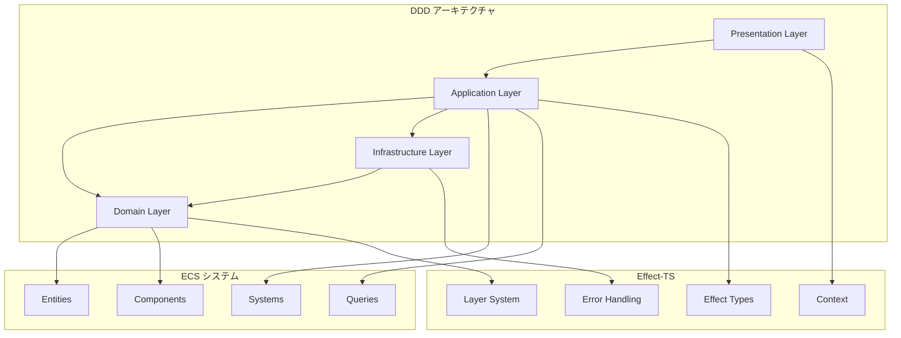
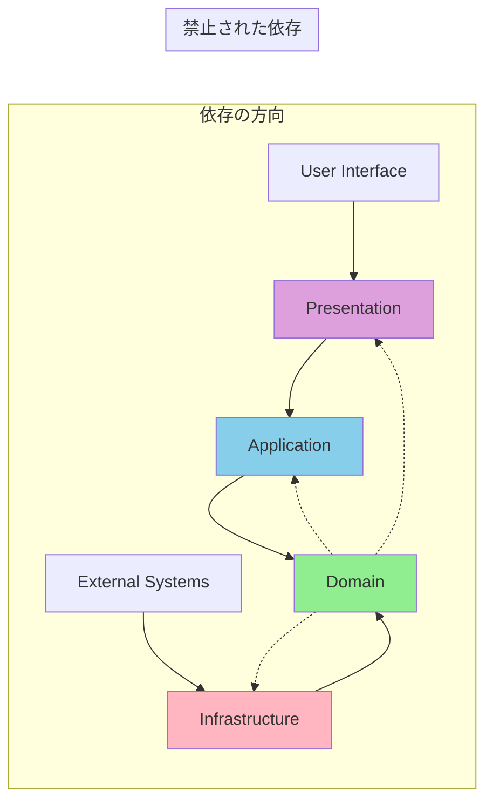

# アーキテクチャ概要

TypeScript Minecraftプロジェクトのアーキテクチャは、**Domain-Driven Design (DDD)**、**Entity Component System (ECS)**、**Effect-TS** を統合した革新的なアプローチを採用しています。この統合により、ゲーム開発における高いパフォーマンス、保守性、拡張性を同時に実現しています。

## 統合アーキテクチャモデル

### DDD + ECS + Effect-TS の統合



この統合により、以下の利点を獲得しています：

- **ビジネスロジックの明確化** (DDD)
- **高性能なデータ処理** (ECS)
- **型安全な副作用管理** (Effect-TS)

## 4層アーキテクチャの詳細

### 1. Domain Layer (ドメインレイヤー)

**責務**: ゲームの核となるビジネスロジックとルールを定義

```typescript
import { Schema, Effect, Match, Context } from "effect"

// エンティティの定義 - Schema.Structを使用
const Player = Schema.Struct({
  id: Schema.String.pipe(Schema.brand("EntityId")),
  name: Schema.String.pipe(Schema.nonEmptyString())
})

type Player = Schema.Schema.Type<typeof Player>

// 値オブジェクトの定義 - 不変で純粋な関数操作
const Position = Schema.Struct({
  x: Schema.Number,
  y: Schema.Number,
  z: Schema.Number
})

type Position = Schema.Schema.Type<typeof Position>

// 位置関連の純粋関数
const calculateDistance = (from: Position, to: Position): number =>
  Math.sqrt(
    Math.pow(to.x - from.x, 2) +
    Math.pow(to.y - from.y, 2) +
    Math.pow(to.z - from.z, 2)
  )

const movePosition = (position: Position, direction: Direction, distance: number): Position => ({
  x: position.x + (direction.x * distance),
  y: position.y + (direction.y * distance),
  z: position.z + (direction.z * distance)
})

// エラー型の定義 - Schema based（統一エラー型）
const TerrainGenerationError = Schema.Struct({
  _tag: Schema.Literal("TerrainGenerationError"),
  coordinate: Schema.String,
  seed: Schema.Number,
  message: Schema.String,
  timestamp: Schema.Number.pipe(Schema.default(() => Date.now()))
})

const ValidationError = Schema.Struct({
  _tag: Schema.Literal("ValidationError"),
  message: Schema.String,
  field: Schema.optional(Schema.String),
  position: Schema.optional(Position),
  timestamp: Schema.Number.pipe(Schema.default(() => Date.now()))
})

type TerrainGenerationError = Schema.Schema.Type<typeof TerrainGenerationError>
type ValidationError = Schema.Schema.Type<typeof ValidationError>

// ドメインサービスの定義 - interface + Context.GenericTag（最新パターン）
interface WorldDomainServiceInterface {
  readonly generateTerrain: (
    coordinate: ChunkCoordinate,
    seed: number
  ) => Effect.Effect<TerrainData, TerrainGenerationError>

  readonly validateBlockPlacement: (
    position: Position,
    blockType: BlockType
  ) => Effect.Effect<boolean, ValidationError>
}

const WorldDomainService = Context.GenericTag<WorldDomainServiceInterface>("@app/WorldDomainService")

// バリデーション関数の分離
const isValidPosition = (position: Position, worldBounds: WorldBounds): boolean =>
  position.x >= worldBounds.min.x && position.x <= worldBounds.max.x &&
  position.y >= worldBounds.min.y && position.y <= worldBounds.max.y &&
  position.z >= worldBounds.min.z && position.z <= worldBounds.max.z

// 純粋関数での早期リターンバリデーション
const validateTerrainGeneration = (coordinate: ChunkCoordinate, seed: number): Effect.Effect<void, TerrainGenerationError> =>
  Effect.gen(function* () {
    // 早期リターン: 負のシード値
    if (seed < 0) {
      return yield* Effect.fail(createTerrainGenerationError(
        `${coordinate.x},${coordinate.z}`,
        seed,
        "Seed must be non-negative"
      ))
    }

    // 早期リターン: 座標範囲チェック
    if (!isValidChunkCoordinate(coordinate)) {
      return yield* Effect.fail(createTerrainGenerationError(
        `${coordinate.x},${coordinate.z}`,
        seed,
        "Invalid chunk coordinate"
      ))
    }
  })

// 単一責務のエラー作成関数（PBTテスト対応）
const createTerrainGenerationError = (coordinate: string, seed: number, message: string): TerrainGenerationError => ({
  _tag: "TerrainGenerationError",
  coordinate,
  seed,
  message,
  timestamp: Date.now()
})

const isValidChunkCoordinate = (coordinate: ChunkCoordinate): boolean =>
  Number.isInteger(coordinate.x) && Number.isInteger(coordinate.z) &&
  coordinate.x >= -30000000 && coordinate.x <= 30000000 &&
  coordinate.z >= -30000000 && coordinate.z <= 30000000
```

**特徴**:
- **純粋なビジネスロジック**: 技術的詳細に依存しない
- **不変性**: すべてのデータが不変
- **型安全性**: Effect-TSスキーマによる厳密な型定義
- **エラーハンドリング**: ドメイン固有のエラー型

### 2. Application Layer (アプリケーションレイヤー)

**責務**: ユースケースの実装とドメインサービスの協調

```typescript
import { Schema, Effect, Match, Context, Layer } from "effect"

// プレイヤー移動のエラー型定義
const PlayerMoveError = Schema.Struct({
  _tag: Schema.Literal("PlayerMoveError"),
  playerId: Schema.String,
  reason: Schema.String
})

type PlayerMoveError = Schema.Schema.Type<typeof PlayerMoveError>

// サービスインターフェース定義
interface WorldServiceInterface {
  readonly getPlayer: (id: EntityId) => Effect.Effect<Player, PlayerMoveError>
  readonly validatePosition: (position: Position) => Effect.Effect<boolean, ValidationError>
  readonly updatePlayerPosition: (id: EntityId, position: Position) => Effect.Effect<void, PlayerMoveError>
  readonly notifyPlayerMoved: (id: EntityId, position: Position) => Effect.Effect<void, never>
  readonly querySoA: (query: Query) => Effect.Effect<QueryResult, QueryError>
}

interface PhysicsServiceInterface {
  readonly predictMovement: (position: Position, velocity: Velocity) => Effect.Effect<Position, PhysicsError>
}

const WorldService = Context.GenericTag<WorldServiceInterface>("@app/WorldService")
const PhysicsService = Context.GenericTag<PhysicsServiceInterface>("@app/PhysicsService")

// 純粋関数での速度計算（PBTテスト対応）
const calculateVelocity = (direction: Direction, speed: number = MOVEMENT_SPEED): Velocity => ({
  dx: direction.x * speed,
  dy: direction.y * speed,
  dz: direction.z * speed
})

// 純粋関数での方向正規化
const normalizeDirection = (direction: Direction): Direction => {
  const magnitude = Math.sqrt(direction.x ** 2 + direction.y ** 2 + direction.z ** 2)
  return magnitude === 0 ? direction : {
    x: direction.x / magnitude,
    y: direction.y / magnitude,
    z: direction.z / magnitude
  }
}

// 早期リターンを使用したユースケース実装
const playerMoveUseCase = (
  direction: Direction,
  playerId: EntityId
): Effect.Effect<void, PlayerMoveError, WorldService | PhysicsService> =>
  Effect.gen(function* () {
    const world = yield* WorldService
    const physics = yield* PhysicsService

    // 早期リターン: プレイヤー存在確認
    const player = yield* world.getPlayer(playerId)
    if (!player) {
      return yield* Effect.fail(createPlayerMoveError(
        playerId,
        "Player not found"
      ))
    }

    // 純粋関数での計算
    const velocity = calculateVelocity(direction)
    const predictedPosition = yield* physics.predictMovement(player.position, velocity)

    // 早期リターン: 位置検証
    const isValidMove = yield* world.validatePosition(predictedPosition)
    if (!isValidMove) {
      return yield* Effect.fail(createPlayerMoveError(
        playerId,
        "Invalid move position"
      ))
    }

// 単一責務のエラー作成関数
const createPlayerMoveError = (playerId: EntityId, reason: string): PlayerMoveError => ({
  _tag: "PlayerMoveError",
  playerId,
  reason,
  timestamp: Date.now()
})

    // メイン処理: 位置更新
    yield* world.updatePlayerPosition(playerId, predictedPosition)
    yield* world.notifyPlayerMoved(playerId, predictedPosition)
  })

// 高性能ECSクエリシステム - 単一責務に分割（PBTテスト対応）
const updateEntityPosition = (
  entityIndex: number,
  components: ComponentArrays,
  deltaTime: number
): void => {
  // 境界チェック付きの安全な更新
  if (entityIndex >= 0 && entityIndex < components.position.x.length) {
    components.position.x[entityIndex] += components.velocity.dx[entityIndex] * deltaTime
    components.position.y[entityIndex] += components.velocity.dy[entityIndex] * deltaTime
    components.position.z[entityIndex] += components.velocity.dz[entityIndex] * deltaTime
  }
}

// 純粋関数での位置計算
const calculateNewPosition = (current: Position, velocity: Velocity, deltaTime: number): Position => ({
  x: current.x + velocity.dx * deltaTime,
  y: current.y + velocity.dy * deltaTime,
  z: current.z + velocity.dz * deltaTime
})

const movementSystem = Effect.gen(function* () {
  const world = yield* WorldService
  const queryResult = yield* world.querySoA(movableEntitiesQuery)

  // Structure of Arrays形式で高性能処理
  for (let i = 0; i < queryResult.entities.length; i++) {
    updateEntityPosition(i, queryResult.components, DELTA_TIME)
  }
})

// コマンドパターンの関数型実装（Tagged Union Types）
const PlayerCommand = Schema.Union(
  Schema.Struct({
    _tag: Schema.Literal("Move"),
    direction: Direction,
    playerId: EntityId,
    speed: Schema.Number.pipe(Schema.positive(), Schema.default(() => MOVEMENT_SPEED))
  }),
  Schema.Struct({
    _tag: Schema.Literal("Jump"),
    playerId: EntityId,
    force: Schema.Number.pipe(Schema.between(0, MAX_JUMP_FORCE))
  }),
  Schema.Struct({
    _tag: Schema.Literal("Crouch"),
    playerId: EntityId,
    enabled: Schema.Boolean
  })
)

type PlayerCommand = Schema.Schema.Type<typeof PlayerCommand>

const executePlayerCommand = (command: PlayerCommand): Effect.Effect<void, PlayerMoveError, WorldService | PhysicsService> =>
  Match.value(command).pipe(
    Match.tag("Move", ({ direction, playerId, speed }) =>
      playerMoveUseCase(direction, playerId, speed)
    ),
    Match.tag("Jump", ({ playerId, force }) =>
      Effect.gen(function* () {
        const world = yield* WorldService
        const physics = yield* PhysicsService

        // 早期リターン: プレイヤー存在確認
        const player = yield* world.getPlayer(playerId)
        if (!player) {
          return yield* Effect.fail(createPlayerMoveError(playerId, "Player not found"))
        }

        // 早期リターン: 地上判定
        const isOnGround = yield* physics.isOnGround(player.position)
        if (!isOnGround) {
          return yield* Effect.fail(createPlayerMoveError(playerId, "Cannot jump while airborne"))
        }

        const jumpVelocity = createJumpVelocity(force)
        const newPosition = yield* physics.predictMovement(player.position, jumpVelocity)

        yield* world.updatePlayerPosition(playerId, newPosition)
      })
    ),
    Match.tag("Crouch", ({ playerId, enabled }) =>
      Effect.gen(function* () {
        const world = yield* WorldService

        // 早期リターン: プレイヤー存在確認
        const player = yield* world.getPlayer(playerId)
        if (!player) {
          return yield* Effect.fail(createPlayerMoveError(playerId, "Player not found"))
        }

        const updatedPlayer = updatePlayerCrouchState(player, enabled)
        yield* world.updatePlayer(playerId, updatedPlayer)
        yield* world.notifyPlayerStateChanged(playerId, "crouch", enabled)
      })
    ),
    Match.exhaustive
  )
```

**特徴**:
- **ユースケース駆動**: ビジネス要件を直接反映
- **協調的処理**: 複数のドメインサービスを組み合わせ
- **パフォーマンス最適化**: ECSとの統合による高速データ処理
- **ワークフロー管理**: 複雑な処理の段階的実行

### 3. Infrastructure Layer (インフラストラクチャレイヤー)

**責務**: 技術的実装とドメインポートの具象化

```typescript
import { Schema, Effect, Match, Context, Layer, Schedule } from "effect"

// レンダリングエラーの定義（統一エラー型）
const RenderError = Schema.Struct({
  _tag: Schema.Literal("RenderError"),
  operation: Schema.String,
  geometry: Schema.String,
  material: Schema.String,
  cause: Schema.Unknown,
  timestamp: Schema.Number.pipe(Schema.default(() => Date.now()))
})

type RenderError = Schema.Schema.Type<typeof RenderError>

// アダプターインターフェース
interface RenderPortInterface {
  readonly createMesh: (geometry: Geometry, material: Material) => Effect.Effect<MeshId, RenderError>
  readonly updateMesh: (id: MeshId, transform: Transform) => Effect.Effect<void, RenderError>
  readonly removeMesh: (id: MeshId) => Effect.Effect<void, RenderError>
}

const RenderPort = Context.GenericTag<RenderPortInterface>("@app/RenderPort")

// Three.js実装の純粋関数（早期リターン・単一責務）
const convertGeometry = (geometry: Geometry): Effect.Effect<THREE.Geometry, GeometryConversionError> =>
  Effect.gen(function* () {
    // 早期リターン: ジオメトリパラメータ検証
    const validationResult = validateGeometryParameters(geometry)
    if (!validationResult.isValid) {
      return yield* Effect.fail(createGeometryConversionError(
        geometry._tag,
        validationResult.error
      ))
    }

    return Match.value(geometry).pipe(
      Match.tag("Box", ({ width, height, depth }) =>
        Effect.succeed(new THREE.BoxGeometry(width, height, depth))
      ),
      Match.tag("Sphere", ({ radius, segments }) =>
        Effect.succeed(new THREE.SphereGeometry(radius, segments, segments))
      ),
      Match.tag("Plane", ({ width, height }) =>
        Effect.succeed(new THREE.PlaneGeometry(width, height))
      ),
      Match.orElse(() =>
        Effect.fail(createGeometryConversionError(
          geometry._tag,
          "Unsupported geometry type"
        ))
      )
    )
  })

// 単一責務の補助関数群（PBTテスト対応）
const validateGeometryParameters = (geometry: Geometry): { isValid: boolean; error?: string } =>
  Match.value(geometry).pipe(
    Match.tag("Box", ({ width, height, depth }) =>
      width > 0 && height > 0 && depth > 0
        ? { isValid: true }
        : { isValid: false, error: "Box dimensions must be positive" }
    ),
    Match.tag("Sphere", ({ radius, segments }) =>
      radius > 0 && segments >= 3
        ? { isValid: true }
        : { isValid: false, error: "Sphere radius must be positive and segments >= 3" }
    ),
    Match.tag("Plane", ({ width, height }) =>
      width > 0 && height > 0
        ? { isValid: true }
        : { isValid: false, error: "Plane dimensions must be positive" }
    ),
    Match.exhaustive
  )

const createGeometryConversionError = (geometryType: string, message: string): GeometryConversionError => ({
  _tag: "GeometryConversionError",
  geometryType,
  message,
  timestamp: Date.now()
})

const convertMaterial = (material: Material): Effect.Effect<THREE.Material, MaterialConversionError> =>
  Effect.gen(function* () {
    return Match.value(material).pipe(
      Match.tag("Basic", ({ color, opacity }) =>
        Effect.succeed(new THREE.MeshBasicMaterial({ color, opacity, transparent: opacity < 1 }))
      ),
      Match.tag("Standard", ({ color, roughness, metalness }) =>
        Effect.succeed(new THREE.MeshStandardMaterial({ color, roughness, metalness }))
      ),
      Match.orElse(() =>
        Effect.fail({
          _tag: "MaterialConversionError" as const,
          materialType: material._tag,
          message: "Unsupported material type"
        })
      )
    )
  })

// リトライ機能付きのアダプター実装
const makeThreeJsRenderAdapter = Effect.gen(function* () {
  const scene = yield* getThreeJsScene()
  const meshRegistry = yield* createMeshRegistry()

  const createMesh = (geometry: Geometry, material: Material): Effect.Effect<MeshId, RenderError> =>
    Effect.gen(function* () {
      const threeGeometry = yield* convertGeometry(geometry)
      const threeMaterial = yield* convertMaterial(material)

      // 早期リターン: リソース確認
      const memoryRequirement = estimateMemoryUsage(geometry, material)
      const availableMemory = yield* checkGPUMemory()
      if (availableMemory < memoryRequirement) {
        return yield* Effect.fail(createRenderError(
          "createMesh",
          geometry._tag,
          material._tag,
          `Insufficient GPU memory: required ${memoryRequirement}MB, available ${availableMemory}MB`
        ))
      }

      const mesh = new THREE.Mesh(threeGeometry, threeMaterial)
      const id = yield* generateMeshId()

      // アトミックな操作として実行
      yield* addToScene(mesh)
      yield* meshRegistry.store(id, mesh)

      return id
    }).pipe(
      Effect.retry(
        Schedule.exponential("100 millis").pipe(
          Schedule.intersect(Schedule.recurs(3))
        )
      ),
      Effect.catchAll((error) =>
        Effect.fail(createRenderError(
          "createMesh",
          geometry._tag,
          material._tag,
          error
        ))
      )
    )

  return RenderPort.of({
    createMesh,
    updateMesh: (id, transform) =>
      Effect.gen(function* () {
        const mesh = yield* meshRegistry.get(id)
        applyTransform(mesh, transform)
      }),
    removeMesh: (id) =>
      Effect.gen(function* () {
        const mesh = yield* meshRegistry.get(id)
        scene.remove(mesh)
        yield* meshRegistry.remove(id)
      })
  })
})

// WebWorker統合 - エラーハンドリング強化
const TerrainGenerationRequest = Schema.Struct({
  coordinate: ChunkCoordinate,
  seed: Schema.Number,
  biome: Schema.optional(Schema.String)
})

const TerrainGenerationResponse = Schema.Struct({
  terrainData: TerrainData,
  generationTime: Schema.Number,
  memoryUsage: Schema.Number
})

interface TerrainWorkerInterface {
  readonly generateChunk: (coordinate: ChunkCoordinate, seed: number) => Effect.Effect<TerrainData, WorkerError>
  readonly preloadChunk: (coordinate: ChunkCoordinate, priority: number) => Effect.Effect<void, WorkerError>
}

const TerrainWorker = Context.GenericTag<TerrainWorkerInterface>("@app/TerrainWorker")

const makeTerrainWorker = Effect.gen(function* () {
  const worker = yield* createWorker("terrain-generation.worker.js")
  const messageQueue = yield* createMessageQueue()

  const generateChunk = (coordinate: ChunkCoordinate, seed: number): Effect.Effect<TerrainData, WorkerError> =>
    Effect.gen(function* () {
      const request = {
        coordinate,
        seed,
        biome: yield* inferBiome(coordinate)
      }

      const validRequest = yield* Schema.decodeUnknownEither(TerrainGenerationRequest)(request).pipe(
        Effect.mapError(error => createWorkerError(
          "generateChunk",
          "Invalid request format",
          error
        ))
      )

      const response = yield* sendWorkerMessage(worker, validRequest).pipe(
        Effect.timeout("30 seconds"),
        Effect.retry(Schedule.recurs(2))
      )

      const result = yield* Schema.decodeUnknownEither(TerrainGenerationResponse)(response).pipe(
        Effect.mapError(error => createWorkerError(
          "generateChunk",
          "Invalid response format",
          error
        ))
      )

// 単一責務のエラー作成関数群
const createRenderError = (operation: string, geometry: string, material: string, cause: unknown): RenderError => ({
  _tag: "RenderError",
  operation,
  geometry,
  material,
  cause,
  timestamp: Date.now()
})

const createWorkerError = (operation: string, message: string, cause: unknown): WorkerError => ({
  _tag: "WorkerError",
  operation,
  message,
  cause,
  timestamp: Date.now()
})

      return result.terrainData
    })

  return TerrainWorker.of({
    generateChunk,
    preloadChunk: (coordinate, priority) =>
      messageQueue.enqueue({ type: "preload", coordinate, priority })
  })
})

const TerrainWorkerLive = Layer.effect(TerrainWorker, makeTerrainWorker)
```

**特徴**:
- **ポート実装**: ドメインポートの具体的な技術実装
- **外部システム統合**: Three.js、WebWorkers、WebGPUとの連携
- **パフォーマンス最適化**: 技術的な最適化の実装
- **エラー変換**: 技術エラーをドメインエラーに変換

### 4. Presentation Layer (プレゼンテーションレイヤー)

**責務**: ユーザーインターフェースとユーザー入力の処理

```typescript
import { Schema, Effect, Match, Context, Layer } from "effect"

// 入力イベントの型定義
type KeyCode = "W" | "A" | "S" | "D" | "Space" | "Shift" | "Tab"

const InputEvent = Schema.Struct({
  type: Schema.Union(
    Schema.Literal("KeyPress"),
    Schema.Literal("KeyRelease"),
    Schema.Literal("MouseClick"),
    Schema.Literal("MouseMove")
  ),
  key: Schema.optional(Schema.String),
  mousePosition: Schema.optional(Schema.Struct({ x: Schema.Number, y: Schema.Number })),
  timestamp: Schema.Number
})

type InputEvent = Schema.Schema.Type<typeof InputEvent>

// サービスインターフェース
interface PlayerMoveUseCaseInterface {
  readonly execute: (direction: Direction, playerId: EntityId) => Effect.Effect<void, PlayerMoveError>
}

interface BlockPlaceUseCaseInterface {
  readonly execute: (position: Position, blockType: BlockType) => Effect.Effect<void, BlockPlaceError>
}

interface WorldGenerateUseCaseInterface {
  readonly regenerateChunk: (coordinate: ChunkCoordinate) => Effect.Effect<void, WorldGenerationError>
}

const PlayerMoveUseCase = Context.GenericTag<PlayerMoveUseCaseInterface>("@app/PlayerMoveUseCase")
const BlockPlaceUseCase = Context.GenericTag<BlockPlaceUseCaseInterface>("@app/BlockPlaceUseCase")
const WorldGenerateUseCase = Context.GenericTag<WorldGenerateUseCaseInterface>("@app/WorldGenerateUseCase")

// 純粋関数での変換処理（PBTテスト対応）
const screenToWorldPosition = (screenX: number, screenY: number, camera: Camera): Position => {
  // 早期リターン: 入力検証
  if (!isValidScreenCoordinates(screenX, screenY)) {
    return { x: 0, y: 0, z: 0 }
  }

  const ndcX = (screenX / window.innerWidth) * 2 - 1
  const ndcY = -(screenY / window.innerHeight) * 2 + 1

  // レイキャスティングによる3D座標変換
  const raycaster = new THREE.Raycaster()
  raycaster.setFromCamera({ x: ndcX, y: ndcY }, camera)

  // 地面との交差点を計算
  const groundPlane = new THREE.Plane(new THREE.Vector3(0, 1, 0), 0)
  const intersectionPoint = raycaster.ray.intersectPlane(groundPlane, new THREE.Vector3())

  return {
    x: intersectionPoint?.x ?? 0,
    y: intersectionPoint?.y ?? 0,
    z: intersectionPoint?.z ?? 0
  }
}

// 単一責務の補助関数群（PBTテスト対応）
const isValidScreenCoordinates = (x: number, y: number): boolean =>
  Number.isFinite(x) && Number.isFinite(y) &&
  x >= 0 && x <= window.innerWidth &&
  y >= 0 && y <= window.innerHeight

const worldToBlockPosition = (worldPos: Position): Position => ({
  x: Math.floor(worldPos.x),
  y: Math.floor(worldPos.y),
  z: Math.floor(worldPos.z)
})

// ゲームコントローラー - 関数型アプローチ
interface GameControllerInterface {
  readonly handleInput: (event: InputEvent) => Effect.Effect<void, InputError>
  readonly getCurrentPlayer: () => Effect.Effect<EntityId, PlayerError>
}

const GameController = Context.GenericTag<GameControllerInterface>("@app/GameController")

const makeGameController = Effect.gen(function* () {
  const playerMoveUseCase = yield* PlayerMoveUseCase
  const blockPlaceUseCase = yield* BlockPlaceUseCase
  const worldGenerateUseCase = yield* WorldGenerateUseCase
  const currentPlayerId = yield* getCurrentPlayerId()

  const handleKeyPress = (key: KeyCode): Effect.Effect<void, InputError> =>
    Match.value(key).pipe(
      Match.when("W", () =>
        playerMoveUseCase.execute({ x: 0, y: 0, z: -1 }, currentPlayerId)
      ),
      Match.when("S", () =>
        playerMoveUseCase.execute({ x: 0, y: 0, z: 1 }, currentPlayerId)
      ),
      Match.when("A", () =>
        playerMoveUseCase.execute({ x: -1, y: 0, z: 0 }, currentPlayerId)
      ),
      Match.when("D", () =>
        playerMoveUseCase.execute({ x: 1, y: 0, z: 0 }, currentPlayerId)
      ),
      Match.when("Space", () =>
        Effect.gen(function* () {
          const camera = yield* getCurrentCamera()
          const playerPos = yield* getPlayerPosition(currentPlayerId)

          // 早期リターン: カメラ・プレイヤー情報有効性
          if (!camera || !playerPos) {
            return yield* Effect.logWarning("Invalid camera or player position")
          }

          const targetPos = calculateTargetPosition(playerPos, camera)

          // 早期リターン: ターゲット位置有効性
          if (!isValidBlockPosition(targetPos)) {
            return yield* Effect.logWarning("Invalid target position for block placement")
          }

          yield* blockPlaceUseCase.execute(targetPos, BlockType.Stone)
        })
      ),
      Match.orElse(() => Effect.unit)
    ).pipe(
      Effect.catchAll(error =>
        Effect.logWarning(`Input handling failed: ${error.message}`)
      )
    )

  const handleMouseClick = (event: MouseEvent): Effect.Effect<void, InputError> =>
    Effect.gen(function* () {
      const camera = yield* getCurrentCamera()
      const worldPos = screenToWorldPosition(event.clientX, event.clientY, camera)
      const blockPos = worldToBlockPosition(worldPos)

      // 早期リターン: 有効範囲チェック
      const isValidRange = yield* checkBuildRange(blockPos, currentPlayerId)
      if (!isValidRange) {
        return yield* Effect.logInfo("Block placement out of range")
      }

      yield* blockPlaceUseCase.execute(blockPos, BlockType.Stone)
    })

  const handleInput = (event: InputEvent): Effect.Effect<void, InputError> =>
    Match.value(event).pipe(
      Match.tag("KeyPress", ({ key }) =>
        key ? handleKeyPress(key as KeyCode) : Effect.unit
      ),
      Match.tag("MouseClick", ({ mousePosition }) =>
        mousePosition ?
          handleMouseClick({ clientX: mousePosition.x, clientY: mousePosition.y } as MouseEvent) :
          Effect.unit
      ),
      Match.orElse(() => Effect.unit)
    )

  return GameController.of({
    handleInput,
    getCurrentPlayer: () => Effect.succeed(currentPlayerId)
  })
})

// 開発者ツール - デバッグとプロファイリング
interface DebuggerServiceInterface {
  readonly inspectEntity: (entityId: EntityId) => Effect.Effect<EntityComponents, DebugError>
  readonly logPerformance: (metrics: PerformanceMetrics) => Effect.Effect<void, never>
  readonly toggleWireframe: () => Effect.Effect<void, never>
}

interface ProfilerServiceInterface {
  readonly startProfiling: () => Effect.Effect<void, never>
  readonly stopProfiling: () => Effect.Effect<PerformanceReport, ProfilingError>
  readonly measureFrameTime: () => Effect.Effect<number, never>
}

const DebuggerService = Context.GenericTag<DebuggerServiceInterface>("@app/DebuggerService")
const ProfilerService = Context.GenericTag<ProfilerServiceInterface>("@app/ProfilerService")

interface DevToolsControllerInterface {
  readonly inspectEntity: (entityId: EntityId) => Effect.Effect<EntityComponents, DebugError>
  readonly profilePerformance: () => Effect.Effect<PerformanceReport, ProfilingError>
  readonly reloadChunk: (coordinate: ChunkCoordinate) => Effect.Effect<void, WorldGenerationError>
  readonly toggleDebugMode: () => Effect.Effect<void, never>
}

const DevToolsController = Context.GenericTag<DevToolsControllerInterface>("@app/DevToolsController")

const makeDevToolsController = Effect.gen(function* () {
  const debugger = yield* DebuggerService
  const profiler = yield* ProfilerService
  const worldGenerate = yield* WorldGenerateUseCase

  return DevToolsController.of({
    inspectEntity: (entityId) => debugger.inspectEntity(entityId),

    profilePerformance: () =>
      Effect.gen(function* () {
        // 早期リターン: プロファイラ状態チェック
        const isProfilingRunning = yield* profiler.isRunning()
        if (isProfilingRunning) {
          return yield* Effect.fail(createProfilingError("Profiling already running"))
        }

        yield* profiler.startProfiling()
        yield* Effect.sleep("5 seconds")
        const report = yield* profiler.stopProfiling()
        yield* debugger.logPerformance(report.metrics)
        return report
      }),

    reloadChunk: (coordinate) =>
      worldGenerate.regenerateChunk(coordinate).pipe(
        Effect.tap(() => Effect.logInfo(`Chunk ${coordinate.x},${coordinate.z} reloaded`))
      ),

    toggleDebugMode: () =>
      Effect.gen(function* () {
        yield* debugger.toggleWireframe()
        yield* Effect.logInfo("Debug mode toggled")
      })
  })
})

const GameControllerLive = Layer.effect(GameController, makeGameController)
const DevToolsControllerLive = Layer.effect(DevToolsController, makeDevToolsController)
```

**特徴**:
- **入力処理**: ユーザー入力の適切なユースケースへのマッピング
- **状態表示**: ゲーム状態の可視化
- **開発者ツール**: デバッグとプロファイリング機能
- **レスポンシブ設計**: 異なる入力デバイスへの対応

## 依存性の方向と規則

### 依存関係図



### 依存性原則

1. **内向きの依存**: すべての依存はドメインレイヤーに向かう
2. **抽象化への依存**: 具象ではなくポート（インターフェース）に依存
3. **レイヤー分離**: 隣接しないレイヤーへの直接依存を禁止
4. **循環依存の回避**: 任意のレイヤー間で循環依存を作らない

## 設計原則

### 1. 関数型プログラミング原則

- **純粋関数**: 副作用のない、予測可能な関数
- **不変性**: データの変更ではなく、新しいデータの生成
- **合成**: 小さな関数を組み合わせて複雑な処理を構築
- **型安全性**: コンパイル時での型チェックによるバグ防止

### 2. Domain-Driven Design原則

- **ユビキタス言語**: ドメインエキスパートと開発者の共通言語
- **境界付きコンテキスト**: 明確なドメイン境界の定義
- **エンティティ識別**: ライフサイクルを持つオブジェクトの適切な管理
- **値オブジェクト**: 不変で等価性に基づくオブジェクト

### 3. Entity Component System原則

- **コンポーネント**: 純粋なデータ、ロジックを含まない
- **システム**: コンポーネントを操作するロジック
- **エンティティ**: コンポーネントの集合を表すID
- **クエリ**: 効率的なコンポーネント検索システム

### 4. Effect-TS統合原則

- **Effect型**: すべての副作用をEffect型でラップ
- **レイヤーシステム**: 依存性注入と構成管理
- **エラーハンドリング**: 型安全で表現的なエラー処理
- **リソース管理**: スコープ付きリソースの自動管理

## パフォーマンス最適化

### Structure of Arrays (SoA)

```typescript
import { Schema, Effect, Context } from "effect"

// Array of Structures (非効率) - 避けるべきパターン
// 非推奨: キャッシュ効率が悪い
interface EntityAoS {
  position: Position
  velocity: Velocity
  health: Health
}
const entitiesAoS: EntityAoS[] = [] // 非推奨

// Structure of Arrays (効率的) - 推奨パターン
const ComponentArrays = Schema.Struct({
  position: Schema.Struct({
    x: Schema.Array(Schema.Number),
    y: Schema.Array(Schema.Number),
    z: Schema.Array(Schema.Number)
  }),
  velocity: Schema.Struct({
    dx: Schema.Array(Schema.Number),
    dy: Schema.Array(Schema.Number),
    dz: Schema.Array(Schema.Number)
  }),
  health: Schema.Struct({
    current: Schema.Array(Schema.Number),
    maximum: Schema.Array(Schema.Number)
  }),
  // 新しいコンポーネントも簡単に追加可能
  isActive: Schema.Array(Schema.Boolean),
  entityType: Schema.Array(Schema.Number.pipe(Schema.int()))
})

type ComponentArrays = Schema.Schema.Type<typeof ComponentArrays>

// 型付きArrayBuffer管理
interface TypedComponentArrays {
  position: {
    x: Float32Array
    y: Float32Array
    z: Float32Array
  }
  velocity: {
    dx: Float32Array
    dy: Float32Array
    dz: Float32Array
  }
  health: {
    current: Uint16Array
    maximum: Uint16Array
  }
}

// 純粋関数でのコンポーネント操作（PBTテスト対応）
const updatePositionComponent = (
  components: TypedComponentArrays,
  entityIndex: number,
  deltaTime: number
): void => {
  // 早期リターン: 境界チェック
  if (entityIndex < 0 || entityIndex >= components.position.x.length) {
    return
  }

  // 早期リターン: 非アクティブエンティティ
  if (!components.isActive[entityIndex]) {
    return
  }

  components.position.x[entityIndex] += components.velocity.dx[entityIndex] * deltaTime
  components.position.y[entityIndex] += components.velocity.dy[entityIndex] * deltaTime
  components.position.z[entityIndex] += components.velocity.dz[entityIndex] * deltaTime
}

const updateHealthComponent = (
  components: TypedComponentArrays,
  entityIndex: number,
  damage: number
): boolean => {
  const currentHealth = components.health.current[entityIndex]
  const newHealth = Math.max(0, currentHealth - damage)
  components.health.current[entityIndex] = newHealth
  return newHealth > 0
}

// SIMD最適化対応のバッチ処理（早期リターン強化）
const batchUpdatePositions = (
  components: TypedComponentArrays,
  entityIndices: Uint32Array,
  deltaTime: number
): void => {
  // 早期リターン: 空のインデックス配列
  if (entityIndices.length === 0) {
    return
  }

  // 早期リターン: 無効なデルタタイム
  if (deltaTime <= 0) {
    return
  }

  // バッチサイズでチャンク化してSIMD最適化
  const BATCH_SIZE = 8
  const totalEntities = entityIndices.length

  for (let i = 0; i < totalEntities; i += BATCH_SIZE) {
    const endIndex = Math.min(i + BATCH_SIZE, totalEntities)

    // バッチ内でベクトル化処理
    for (let j = i; j < endIndex; j++) {
      const entityIndex = entityIndices[j]
      updatePositionComponent(components, entityIndex, deltaTime)
    }
  }
}

// パフォーマンスメトリクス収集関数
const measureBatchPerformance = (
  batchFunction: () => void,
  entityCount: number
): PerformanceMetrics => {
  const startTime = performance.now()
  batchFunction()
  const endTime = performance.now()

  return {
    executionTimeMs: endTime - startTime,
    entitiesPerSecond: entityCount / ((endTime - startTime) / 1000),
    memoryUsageMB: (performance as any).memory?.usedJSHeapSize / 1024 / 1024 || 0
  }
}
```

**利点**:
- **キャッシュ効率**: 連続したメモリアクセスパターン
- **SIMD最適化**: ベクトル命令による並列処理
- **メモリ使用量削減**: パディングの最小化

### クエリ最適化

```typescript
import { Schema, Effect, Context, Match } from "effect"

// アーキタイプ定義 - Schema based
const ArchetypeId = Schema.String.pipe(Schema.brand("ArchetypeId"))
type ArchetypeId = Schema.Schema.Type<typeof ArchetypeId>

const ComponentType = Schema.Union(
  Schema.Literal("Position"),
  Schema.Literal("Velocity"),
  Schema.Literal("Health"),
  Schema.Literal("Render"),
  Schema.Literal("StaticTag")
)

type ComponentType = Schema.Schema.Type<typeof ComponentType>

const Archetype = Schema.Struct({
  id: ArchetypeId,
  components: Schema.Array(ComponentType),
  entityCount: Schema.Number
})

type Archetype = Schema.Schema.Type<typeof Archetype>

// クエリインターフェース
interface WorldQueryInterface {
  readonly createArchetype: (components: ComponentType[]) => Effect.Effect<ArchetypeId, ArchetypeError>
  readonly queryArchetype: (archetypeId: ArchetypeId) => Effect.Effect<QueryResult, QueryError>
  readonly queryComponents: (componentTypes: ComponentType[]) => Effect.Effect<QueryResult, QueryError>
  readonly getArchetypeStats: () => Effect.Effect<ArchetypeStats[], never>
}

const WorldQuery = Context.GenericTag<WorldQueryInterface>("@app/WorldQuery")

// 純粋関数でのアーキタイプ操作
const createArchetypeSignature = (components: ComponentType[]): string =>
  components.sort().join("|")

const matchesArchetype = (entityComponents: ComponentType[], archetypeComponents: ComponentType[]): boolean =>
  archetypeComponents.every(component =>
    entityComponents.includes(component)
  )

const calculateArchetypeCompatibility = (
  requiredComponents: ComponentType[],
  availableComponents: ComponentType[]
): number => {
  const matches = requiredComponents.filter(comp => availableComponents.includes(comp))
  return matches.length / requiredComponents.length
}

// 高性能クエリ実装
const makeWorldQuery = Effect.gen(function* () {
  const archetypeRegistry = yield* createArchetypeRegistry()
  const componentStorage = yield* getComponentStorage()

  const createArchetype = (components: ComponentType[]): Effect.Effect<ArchetypeId, ArchetypeError> =>
    Effect.gen(function* () {
      const signature = createArchetypeSignature(components)
      const existingId = yield* archetypeRegistry.findBySignature(signature)

      // 早期リターン: 既存アーキタイプの確認
      if (existingId) {
        return existingId
      }

      const newId = yield* generateArchetypeId(signature)
      const archetype: Archetype = {
        id: newId,
        components,
        entityCount: 0
      }

      yield* archetypeRegistry.store(archetype)
      return newId
    })

  const queryArchetype = (archetypeId: ArchetypeId): Effect.Effect<QueryResult, QueryError> =>
    Effect.gen(function* () {
      const archetype = yield* archetypeRegistry.get(archetypeId)
      const entities = yield* componentStorage.getEntitiesByArchetype(archetypeId)

      return {
        entities: entities.map(e => e.id),
        components: yield* componentStorage.getComponentArraysByArchetype(archetypeId),
        count: entities.length
      }
    }).pipe(
      Effect.catchAll(error =>
        Effect.fail({
          _tag: "QueryError" as const,
          archetypeId,
          message: `Query failed: ${error.message}`,
          cause: error
        })
      )
    )

  const queryComponents = (componentTypes: ComponentType[]): Effect.Effect<QueryResult, QueryError> =>
    Effect.gen(function* () {
      // 複数のアーキタイプから該当エンティティを収集
      const compatibleArchetypes = yield* archetypeRegistry.findCompatible(componentTypes)
      const results = yield* Effect.all(
        compatibleArchetypes.map(archetype => queryArchetype(archetype.id))
      )

      // 結果をマージ
      return mergeQueryResults(results)
    })

  return WorldQuery.of({
    createArchetype,
    queryArchetype,
    queryComponents,
    getArchetypeStats: () =>
      archetypeRegistry.getAllStats()
  })
})

// クエリ結果の型安全なマージ
const mergeQueryResults = (results: QueryResult[]): QueryResult => ({
  entities: results.flatMap(r => r.entities),
  components: mergeComponentArrays(results.map(r => r.components)),
  count: results.reduce((sum, r) => sum + r.count, 0)
})

// 使用例 - 高速アーキタイプクエリ
const setupGameQueries = Effect.gen(function* () {
  const worldQuery = yield* WorldQuery

  // 事前定義されたアーキタイプ
  const movableArchetype = yield* worldQuery.createArchetype(["Position", "Velocity"])
  const staticArchetype = yield* worldQuery.createArchetype(["Position", "StaticTag"])
  const renderableArchetype = yield* worldQuery.createArchetype(["Position", "Render"])

  return {
    movableArchetype,
    staticArchetype,
    renderableArchetype
  }
})

// 高速クエリ実行システム
const executeMovementSystem = Effect.gen(function* () {
  const worldQuery = yield* WorldQuery
  const { movableArchetype } = yield* setupGameQueries

  const movableEntities = yield* worldQuery.queryArchetype(movableArchetype)

  // Structure of Arrays形式で高速処理
  for (let i = 0; i < movableEntities.count; i++) {
    updatePositionComponent(movableEntities.components, i, DELTA_TIME)
  }
})
```

**利点**:
- **O(1)アーキタイプ検索**: 事前計算されたエンティティグループ
- **キャッシュ最適化**: 同じコンポーネント構成のエンティティをグループ化
- **分岐予測**: 予測可能なアクセスパターン

## テスト戦略

### 単体テスト

```typescript
import { Effect, Layer, Context, Schema } from "effect"
import { describe, it, expect } from "vitest"
import * as fc from "fast-check"

// テスト用のモックサービス定義
const TestWorldDomainService = Layer.succeed(
  WorldDomainService,
  WorldDomainService.of({
    generateTerrain: (coordinate, seed) =>
      Effect.gen(function* () {
        // 早期リターン: 入力バリデーション
        if (seed < 0) {
          return yield* Effect.fail({
            _tag: "TerrainGenerationError" as const,
            coordinate: `${coordinate.x},${coordinate.z}`,
            seed,
            message: "Invalid seed value"
          })
        }

        // 決定的なテスト用地形生成
        const blocks = new Array(CHUNK_SIZE ** 3).fill(BlockType.Stone)
        const heightMap = new Array(CHUNK_SIZE * CHUNK_SIZE).fill(64)

        return {
          blocks,
          heightMap,
          biome: "plains",
          generationTime: 100
        }
      }),

    validateBlockPlacement: (position, blockType) =>
      Effect.gen(function* () {
        const isValid = isValidPosition(position, TEST_WORLD_BOUNDS)
        return isValid
      })
  })
)

describe("WorldDomainService", () => {
  it.effect("地形生成が正常に動作する", () =>
    Effect.gen(function* () {
      const service = yield* WorldDomainService
      const coordinate = { x: 0, z: 0 }
      const seed = 12345

      const terrain = yield* service.generateTerrain(coordinate, seed)

      expect(terrain.blocks.length).toBe(CHUNK_SIZE ** 3)
      expect(terrain.heightMap.length).toBe(CHUNK_SIZE * CHUNK_SIZE)
      expect(terrain.heightMap.every(h => h >= 0 && h <= 255)).toBe(true)
      expect(terrain.biome).toBe("plains")
    }).pipe(Effect.provide(TestWorldDomainService))
  )

  it.effect("無効なseedでエラーが発生する", () =>
    Effect.gen(function* () {
      const service = yield* WorldDomainService
      const coordinate = { x: 0, z: 0 }
      const invalidSeed = -1

      const result = yield* Effect.either(service.generateTerrain(coordinate, invalidSeed))

      expect(result._tag).toBe("Left")
      if (result._tag === "Left") {
        expect(result.left._tag).toBe("TerrainGenerationError")
        expect(result.left.seed).toBe(invalidSeed)
      }
    }).pipe(Effect.provide(TestWorldDomainService))
  )
})
```

### 統合テスト

```typescript
describe("Player Movement Integration", () => {
  const createTestEnvironment = Layer.mergeAll(
    TestWorldService,
    TestPlayerMoveUseCase,
    TestGameController
  )

  it.effect("プレイヤー移動の完全なフロー", () =>
    Effect.gen(function* () {
      const controller = yield* GameController
      const world = yield* WorldService
      const playerId = "test-player-1"

      const initialPosition = yield* world.getPlayerPosition(playerId)

      // Wキーを押す動作をシミュレート
      const inputEvent: InputEvent = {
        type: "KeyPress",
        key: "W",
        timestamp: Date.now()
      }

      yield* controller.handleInput(inputEvent)

      const newPosition = yield* world.getPlayerPosition(playerId)

      expect(newPosition.z).toBeLessThan(initialPosition.z)
      expect(newPosition.x).toBe(initialPosition.x)
      expect(newPosition.y).toBe(initialPosition.y)
    }).pipe(Effect.provide(createTestEnvironment))
  )

  it.effect("無効な移動は拒否される", () =>
    Effect.gen(function* () {
      const controller = yield* GameController
      const world = yield* WorldService
      const playerId = "test-player-1"

      // プレイヤーを境界近くに配置
      yield* world.setPlayerPosition(playerId, { x: WORLD_BOUNDARY.max.x - 0.5, y: 0, z: 0 })

      const inputEvent: InputEvent = {
        type: "KeyPress",
        key: "D", // 右に移動（境界外）
        timestamp: Date.now()
      }

      const result = yield* Effect.either(controller.handleInput(inputEvent))

      // 移動が拒否されることを確認
      const finalPosition = yield* world.getPlayerPosition(playerId)
      expect(finalPosition.x).toBeLessThan(WORLD_BOUNDARY.max.x)
    }).pipe(Effect.provide(createTestEnvironment))
  )
})
```

### プロパティベーステスト (PBT)

```typescript
describe("Position Value Object Properties", () => {
  // 純粋関数のプロパティテスト
  it.effect("位置の正規化が数学的に正しい", () =>
    Effect.gen(function* () {
      yield* Effect.promise(() =>
        fc.assert(
          fc.property(
            fc.float({ min: -1000, max: 1000 }),
            fc.float({ min: -1000, max: 1000 }),
            fc.float({ min: -1000, max: 1000 }),
            (x, y, z) => {
              // ゼロベクトルを除外
              if (x === 0 && y === 0 && z === 0) return true

              const position: Position = { x, y, z }
              const normalized = normalizePosition(position)
              const magnitude = calculateMagnitude(normalized)

              return Math.abs(magnitude - 1.0) < 0.0001
            }
          ),
          { numRuns: 1000, seed: 12345 }
        )
      )
    })
  )

  it.effect("距離計算が対称性を満たす", () =>
    Effect.gen(function* () {
      yield* Effect.promise(() =>
        fc.assert(
          fc.property(
            fc.record({
              x: fc.float({ min: -100, max: 100 }),
              y: fc.float({ min: -100, max: 100 }),
              z: fc.float({ min: -100, max: 100 })
            }),
            fc.record({
              x: fc.float({ min: -100, max: 100 }),
              y: fc.float({ min: -100, max: 100 }),
              z: fc.float({ min: -100, max: 100 })
            }),
            (pos1, pos2) => {
              const distance1to2 = calculateDistance(pos1, pos2)
              const distance2to1 = calculateDistance(pos2, pos1)

              return Math.abs(distance1to2 - distance2to1) < 0.0001
            }
          ),
          { numRuns: 500 }
        )
      )
    })
  )

  it.effect("移動関数が正しい位置を計算する", () =>
    Effect.gen(function* () {
      yield* Effect.promise(() =>
        fc.assert(
          fc.property(
            fc.record({
              x: fc.float({ min: -50, max: 50 }),
              y: fc.float({ min: -50, max: 50 }),
              z: fc.float({ min: -50, max: 50 })
            }),
            fc.record({
              x: fc.float({ min: -1, max: 1 }),
              y: fc.float({ min: -1, max: 1 }),
              z: fc.float({ min: -1, max: 1 })
            }),
            fc.float({ min: 0, max: 10 }),
            (position, direction, distance) => {
              const newPosition = movePosition(position, direction, distance)
              const actualDistance = calculateDistance(position, newPosition)
              const expectedDistance = calculateMagnitude(direction) * distance

              return Math.abs(actualDistance - expectedDistance) < 0.001
            }
          ),
          { numRuns: 1000 }
        )
      )
    })
  )
})

// パフォーマンステスト
describe("Performance Properties", () => {
  it.effect("大量エンティティの処理が線形時間で実行される", () =>
    Effect.gen(function* () {
      const entityCounts = [1000, 2000, 4000, 8000]
      const processingTimes: number[] = []

      for (const count of entityCounts) {
        const components = createTestComponentArrays(count)
        const startTime = performance.now()

        // 全エンティティの位置更新
        for (let i = 0; i < count; i++) {
          updatePositionComponent(components, i, 0.016)
        }

        const endTime = performance.now()
        processingTimes.push(endTime - startTime)
      }

      // 線形時間複雑度の確認（おおよその線形関係）
      const timeRatio = processingTimes[3] / processingTimes[0]
      const entityRatio = entityCounts[3] / entityCounts[0]

      expect(timeRatio).toBeLessThan(entityRatio * 1.5) // 許容範囲内
      expect(timeRatio).toBeGreaterThan(entityRatio * 0.5)
    })
  )
})
```

## まとめ

このアーキテクチャは、関数型プログラミング、ドメイン駆動設計、高性能ゲーム開発の最良の部分を統合し、保守性、拡張性、パフォーマンスを同時に実現する革新的なアプローチです。Effect-TSの強力な型システムとエラーハンドリング機能により、大規模なゲーム開発プロジェクトでも信頼性の高いコードベースを維持できます。