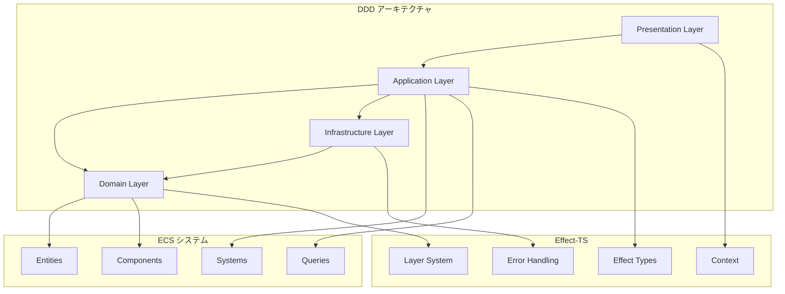
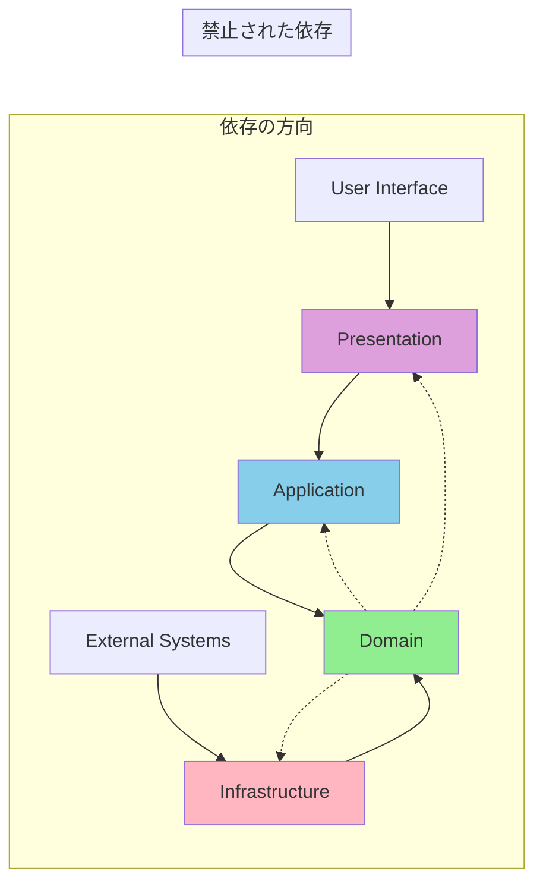

# アーキテクチャ概要

TypeScript Minecraftプロジェクトのアーキテクチャは、**Domain-Driven Design (DDD)**、**Entity Component System (ECS)**、**Effect-TS** を統合した革新的なアプローチを採用しています。この統合により、ゲーム開発における高いパフォーマンス、保守性、拡張性を同時に実現しています。

## 統合アーキテクチャモデル

### DDD + ECS + Effect-TS の統合



この統合により、以下の利点を獲得しています：

- **ビジネスロジックの明確化** (DDD)
- **高性能なデータ処理** (ECS)
- **型安全な副作用管理** (Effect-TS)

## 4層アーキテクチャの詳細

### 1. Domain Layer (ドメインレイヤー)

**責務**: ゲームの核となるビジネスロジックとルールを定義

```typescript
// エンティティの定義
export class Player extends Data.Class<{
  readonly id: EntityId
  readonly name: string
}> {}

// 値オブジェクトの定義
export class Position extends Data.Class<{
  readonly x: number
  readonly y: number
  readonly z: number
}> {
  static readonly schema = S.Struct({
    x: S.Number,
    y: S.Number,
    z: S.Number,
  })
}

// ドメインサービスの定義
export interface WorldDomainService {
  readonly generateTerrain: (
    coordinate: ChunkCoordinate,
    seed: number
  ) => Effect.Effect<TerrainData, TerrainGenerationError>
  
  readonly validateBlockPlacement: (
    position: Position,
    blockType: BlockType
  ) => Effect.Effect<boolean, ValidationError>
}
```

**特徴**:
- **純粋なビジネスロジック**: 技術的詳細に依存しない
- **不変性**: すべてのデータが不変
- **型安全性**: Effect-TSスキーマによる厳密な型定義
- **エラーハンドリング**: ドメイン固有のエラー型

### 2. Application Layer (アプリケーションレイヤー)

**責務**: ユースケースの実装とドメインサービスの協調

```typescript
// ユースケースの実装
export const playerMoveUseCase = (
  direction: Direction,
  playerId: EntityId
): Effect.Effect<void, PlayerMoveError, WorldService | PhysicsService> =>
  Effect.gen(function* () {
    const world = yield* WorldService
    const physics = yield* PhysicsService
    
    const player = yield* world.getPlayer(playerId)
    const velocity = yield* calculateVelocity(direction)
    const newPosition = yield* physics.predictMovement(player.position, velocity)
    
    const isValidMove = yield* world.validatePosition(newPosition)
    if (isValidMove) {
      yield* world.updatePlayerPosition(playerId, newPosition)
      yield* world.notifyPlayerMoved(playerId, newPosition)
    }
  })

// ECSクエリシステムとの統合
export const movementSystem = Effect.gen(function* () {
  const world = yield* WorldService
  const { entities, components } = yield* world.querySoA(movableEntitiesQuery)
  
  // Structure of Arrays形式で高性能処理
  for (let i = 0; i < entities.length; i++) {
    components.position.x[i] += components.velocity.dx[i] * deltaTime
    components.position.y[i] += components.velocity.dy[i] * deltaTime  
    components.position.z[i] += components.velocity.dz[i] * deltaTime
  }
})
```

**特徴**:
- **ユースケース駆動**: ビジネス要件を直接反映
- **協調的処理**: 複数のドメインサービスを組み合わせ
- **パフォーマンス最適化**: ECSとの統合による高速データ処理
- **ワークフロー管理**: 複雑な処理の段階的実行

### 3. Infrastructure Layer (インフラストラクチャレイヤー)

**責務**: 技術的実装とドメインポートの具象化

```typescript
// アダプターの実装
export const threeJsRenderAdapter: RenderPort = {
  createMesh: (geometry, material) =>
    Effect.gen(function* () {
      const threeGeometry = yield* convertGeometry(geometry)
      const threeMaterial = yield* convertMaterial(material)
      const mesh = new THREE.Mesh(threeGeometry, threeMaterial)
      
      const id = yield* generateMeshId()
      yield* addToScene(mesh)
      yield* storeMeshReference(id, mesh)
      
      return id
    }).pipe(
      Effect.catchAll((error) =>
        Effect.fail(
          new RenderError({
            operation: 'createMesh',
            cause: error,
            geometry: geometry.type,
            material: material.type,
          })
        )
      )
    ),
}

// WebWorkerとの統合
export const terrainGenerationWorker = Effect.gen(function* () {
  const worker = yield* createWorker('terrain-generation.worker.js')
  
  return {
    generateChunk: (coordinate: ChunkCoordinate, seed: number) =>
      Effect.gen(function* () {
        const request = TerrainGenerationRequest.make({ coordinate, seed })
        const response = yield* sendWorkerMessage(worker, request)
        const result = yield* TerrainGenerationResponse.decode(response)
        return result.terrainData
      })
  }
})
```

**特徴**:
- **ポート実装**: ドメインポートの具体的な技術実装
- **外部システム統合**: Three.js、WebWorkers、WebGPUとの連携
- **パフォーマンス最適化**: 技術的な最適化の実装
- **エラー変換**: 技術エラーをドメインエラーに変換

### 4. Presentation Layer (プレゼンテーションレイヤー)

**責務**: ユーザーインターフェースとユーザー入力の処理

```typescript
// ゲームコントローラー
export const gameController = Effect.gen(function* () {
  const playerMove = yield* PlayerMoveUseCase
  const blockPlace = yield* BlockPlaceUseCase
  const worldGenerate = yield* WorldGenerateUseCase
  
  return {
    handleKeyPress: (key: KeyCode) =>
      Match.value(key).pipe(
        Match.when('W', () => playerMove(Direction.Forward)),
        Match.when('S', () => playerMove(Direction.Backward)),
        Match.when('A', () => playerMove(Direction.Left)),
        Match.when('D', () => playerMove(Direction.Right)),
        Match.when('Space', () => blockPlace()),
        Match.orElse(() => Effect.unit)
      ),
      
    handleMouseClick: (event: MouseEvent) =>
      Effect.gen(function* () {
        const worldPos = yield* screenToWorldPosition(event.clientX, event.clientY)
        const blockPos = yield* worldToBlockPosition(worldPos)
        yield* blockPlace(blockPos)
      })
  }
})

// 開発者ツール
export const devToolsController = Effect.gen(function* () {
  const debugger = yield* DebuggerService
  const profiler = yield* ProfilerService
  
  return {
    inspectEntity: (entityId: EntityId) =>
      debugger.getEntityComponents(entityId),
      
    profilePerformance: () =>
      profiler.measureFrameTime(),
      
    reloadChunk: (coordinate: ChunkCoordinate) =>
      worldGenerate.regenerateChunk(coordinate)
  }
})
```

**特徴**:
- **入力処理**: ユーザー入力の適切なユースケースへのマッピング
- **状態表示**: ゲーム状態の可視化
- **開発者ツール**: デバッグとプロファイリング機能
- **レスポンシブ設計**: 異なる入力デバイスへの対応

## 依存性の方向と規則

### 依存関係図



### 依存性原則

1. **内向きの依存**: すべての依存はドメインレイヤーに向かう
2. **抽象化への依存**: 具象ではなくポート（インターフェース）に依存
3. **レイヤー分離**: 隣接しないレイヤーへの直接依存を禁止
4. **循環依存の回避**: 任意のレイヤー間で循環依存を作らない

## 設計原則

### 1. 関数型プログラミング原則

- **純粋関数**: 副作用のない、予測可能な関数
- **不変性**: データの変更ではなく、新しいデータの生成
- **合成**: 小さな関数を組み合わせて複雑な処理を構築
- **型安全性**: コンパイル時での型チェックによるバグ防止

### 2. Domain-Driven Design原則

- **ユビキタス言語**: ドメインエキスパートと開発者の共通言語
- **境界付きコンテキスト**: 明確なドメイン境界の定義
- **エンティティ識別**: ライフサイクルを持つオブジェクトの適切な管理
- **値オブジェクト**: 不変で等価性に基づくオブジェクト

### 3. Entity Component System原則

- **コンポーネント**: 純粋なデータ、ロジックを含まない
- **システム**: コンポーネントを操作するロジック
- **エンティティ**: コンポーネントの集合を表すID
- **クエリ**: 効率的なコンポーネント検索システム

### 4. Effect-TS統合原則

- **Effect型**: すべての副作用をEffect型でラップ
- **レイヤーシステム**: 依存性注入と構成管理
- **エラーハンドリング**: 型安全で表現的なエラー処理
- **リソース管理**: スコープ付きリソースの自動管理

## パフォーマンス最適化

### Structure of Arrays (SoA)

```typescript
// Array of Structures (非効率)
interface Entity {
  position: Position
  velocity: Velocity
  health: Health
}
const entities: Entity[] = []

// Structure of Arrays (効率的)
interface ComponentArrays {
  position: {
    x: Float32Array
    y: Float32Array  
    z: Float32Array
  }
  velocity: {
    dx: Float32Array
    dy: Float32Array
    dz: Float32Array
  }
  health: {
    current: Uint16Array
    maximum: Uint16Array
  }
}
```

**利点**:
- **キャッシュ効率**: 連続したメモリアクセスパターン
- **SIMD最適化**: ベクトル命令による並列処理
- **メモリ使用量削減**: パディングの最小化

### クエリ最適化

```typescript
// アーキタイプベースの最適化
const movableArchetype = world.createArchetype([Position, Velocity])
const staticArchetype = world.createArchetype([Position, StaticTag])

// 高速クエリ実行
const movableEntities = world.queryArchetype(movableArchetype)
```

**利点**:
- **O(1)アーキタイプ検索**: 事前計算されたエンティティグループ
- **キャッシュ最適化**: 同じコンポーネント構成のエンティティをグループ化
- **分岐予測**: 予測可能なアクセスパターン

## テスト戦略

### 単体テスト

```typescript
describe('WorldDomainService', () => {
  it.effect('地形生成が正常に動作する', () =>
    Effect.gen(function* () {
      const service = yield* WorldDomainService
      const terrain = yield* service.generateTerrain(
        ChunkCoordinate.make(0, 0),
        12345
      )
      
      expect(terrain.blocks.length).toBe(CHUNK_SIZE ** 3)
      expect(terrain.heightMap.every(h => h >= 0 && h <= 255)).toBe(true)
    }).pipe(Effect.provide(TestWorldDomainServiceLive))
  )
})
```

### 統合テスト

```typescript
describe('Player Movement Integration', () => {
  it.effect('プレイヤー移動の完全なフロー', () =>
    Effect.gen(function* () {
      const controller = yield* GameController
      const world = yield* WorldService
      
      const initialPosition = yield* world.getPlayerPosition()
      yield* controller.handleKeyPress('W')
      const newPosition = yield* world.getPlayerPosition()
      
      expect(newPosition.z).toBeLessThan(initialPosition.z)
    }).pipe(Effect.provide(TestAppLayer))
  )
})
```

### プロパティベーステスト

```typescript
describe('Position Value Object', () => {
  it.effect('位置の正規化が数学的に正しい', () =>
    Effect.gen(function* () {
      yield* fc.assert(
        fc.property(
          fc.float(),
          fc.float(), 
          fc.float(),
          (x, y, z) => {
            const position = Position.make({ x, y, z })
            const normalized = Position.normalize(position)
            const length = Position.magnitude(normalized)
            
            return Math.abs(length - 1.0) < 0.0001
          }
        )
      )
    })
  )
})
```

## まとめ

このアーキテクチャは、関数型プログラミング、ドメイン駆動設計、高性能ゲーム開発の最良の部分を統合し、保守性、拡張性、パフォーマンスを同時に実現する革新的なアプローチです。Effect-TSの強力な型システムとエラーハンドリング機能により、大規模なゲーム開発プロジェクトでも信頼性の高いコードベースを維持できます。