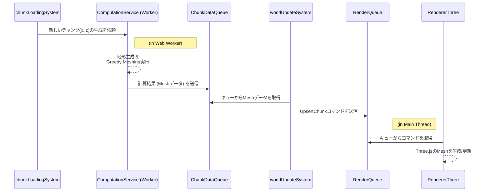

# レンダリングアーキテクチャ

このドキュメントでは、本プロジェクトのレンダリングパイプラインの全体像と、ゲームロジックとレンダリングエンジンを分離するための設計について解説します。具体的な最適化手法については、[レンダリングの最適化](./../features/rendering.md)を参照してください。

## 1. 設計思想: 関心の分離

レンダリングパイプラインは、**ゲームロジック**（何を描画すべきか）と**レンダリングエンジン**（どのように描画するか）の責務を明確に分離するように設計されています。これにより、一方の変更が他方に影響を与えにくくなり、コードの保守性とテスト容易性が向上します。

この分離を実現するため、両者の間には **`RenderQueue`** と **`ChunkDataQueue`** という2つの非同期キューが介在します。

## 2. データフロー

プレイヤーが新しい領域に移動した際の、チャンク生成から描画までのデータフローは以下のようになります。

### 各ステップの解説

1.  **`chunkLoadingSystem`**: プレイヤーの移動を検知し、新しく必要になったチャンクの座標を `ComputationService` に渡して、地形生成タスクを依頼します。
2.  **`ComputationService` (Web Worker)**: メインスレッドをブロックしないように、バックグラウンドで重い計算処理（地形生成、Greedy Meshing）を実行し、結果のメッシュデータを `ChunkDataQueue` にエンキューします。
3.  **`worldUpdateSystem`**: メインスレッドで `ChunkDataQueue` を監視します。データを受け取ると、それをレンダリング可能なコマンド（`UpsertChunk`）に変換し、`RenderQueue` にエンキューします。
4.  **`RendererThree`**: `RenderQueue` を監視し、コマンドを受け取って初めてThree.jsのAPIを呼び出し、シーンにメッシュを実際に生成・更新・削除します。

この非同期で段階的なパイプラインにより、重い処理がフレームレートに与える影響を最小限に抑え、スムーズなゲーム体験を実現しています。

## 3. 動的オブジェクトのレンダリング

プレイヤーやMOBのような動的なエンティティは、チャンクの地形とは異なる方法でレンダリングされます。

-   **`InstancedMesh` の活用**: プレイヤーモデルなど、同じ形状で複数存在する可能性があるオブジェクトは、Three.jsの `InstancedMesh` を用いて効率的に描画されます。
-   **`worldUpdateSystem`**: これらの動的エンティティの `Position` や `Rotation` が更新されると、`worldUpdateSystem` は `UpsertEntity` のようなコマンドを `RenderQueue` に送信し、`RendererThree` がインスタンスの行列を更新します。

詳細は[レンダリングの最適化 (InstancedMesh)](./../features/rendering.md#instancedmesh-による最適化)で解説します。
