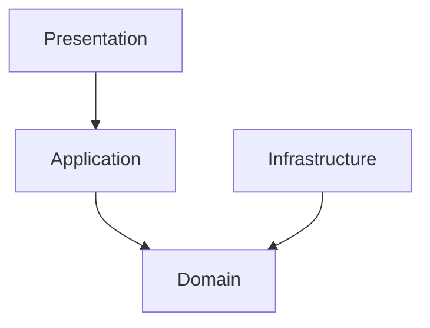

# プロジェクト規約 (Project Conventions)

このドキュメントでは、プロジェクト全体で一貫性、可読性、保守性を維持するために遵守すべきコーディングスタイル、規約、設計パターンについて詳述します。

---

## 1. 基本設計思想

本プロジェクトは、堅牢かつスケール可能なアプリケーションを構築するため、以下の設計思想を根幹に据えています。

- **関数型プログラミング**: 副作用を厳密に管理し、コードの予測可能性を高めるため、[**Effect-TS**](https://effect.website/) の全面的採用を基本方針とします。すべての処理は `Effect` データ型でラップされ、合成可能なプログラムとして構築されることを目指します。
- **Immutability (不変性)**: すべてのデータ構造は原則として不変（Immutable）に扱います。これにより、状態の意図しない変更を防ぎ、アプリケーションの健全性を保ちます。
- **クラス不使用**: `class` 構文と `this` キーワードは一切使用しません。状態とロジックを分離し、純粋な関数とデータ型でアプリケーションを構成します。
- **宣言的なコーディング**: `if/else` や `switch` による命令的な分岐よりも、[**@effect/match**](https://www.effect.website/docs/essentials/match) を用いた宣言的なパターンマッチングを推奨します。

---

## 2. コードフォーマット & 静的解析

コードの品質とスタイルは、**Oxlint** (リンター) と **BiomeJS** (フォーマッタ) によって自動的に維持されます。開発中は、常に以下のコマンドでコードを検証・整形してください。

```bash
# Oxlintによる静的解析・自動修正
pnpm run lint

# BiomeJSによる自動フォーマット
pnpm run format

# TypeScriptによる型チェック
pnpm exec tsc
```

これらのチェックはCIでも強制されます。

### リンター: Oxlint

- **役割**: コードの潜在的なバグ、パフォーマンスの問題、一貫性のないパターンを検出します。

### フォーマッタ: BiomeJS

- **役割**: コードの見た目を統一します。
- **設定ファイル**: `biome.json`

---

## 3. TypeScriptの厳格なルール

コードの堅牢性を最大限に高めるため、`tsconfig.json` でTypeScriptの最も厳格な設定を有効にしています。これに加え、以下のルールを徹底します。

- **`any`, `unknown`, `as` の撲滅**:
  - `any` の使用は固く禁じられています。
  - 型が不明な場合は `unknown` を使用しますが、`as` を用いた安易な型キャストは避け、型ガードや `effect/Schema` を用いて安全に型を絞り込みます。
  - `Effect.fromEither` や `Effect.fromOption` を活用し、失敗する可能性を型で表現することで、型アサーションが必要な場面を減らします。
- **`effect/Schema` による型定義とバリデーション**: すべてのドメインデータ、APIレスポンス、外部データは `Schema` を用いて定義します。これにより、パースと型ガードが自動的に提供され、ランタイムエラーを防ぎます。
  - **基本**: `S.Struct` (オブジェクト), `S.Array` (配列), `S.Literal` (リテラル), `S.Number`, `S.String`, `S.Boolean` などを組み合わせて定義します。
    ```typescript
    // src/domain/components.ts
    export const Position = S.Struct({
      x: Float,
      y: Float,
      z: Float,
    })
    ```
  - **カスタム型とTypedArray**: `Float32Array` のようにエンコード/デコードロジックが必要な型や、Arbitrary（テスト用のランダムな値）を自動生成できない型は、`S.transform` と `S.arbitrary` アノテーションを組み合わせて定義します。

    ```typescript
    // src/domain/types.ts
    import * as fc from 'effect/FastCheck'

    const Float32ArraySchema = S.transform(S.Array(S.Number), S.instanceOf(Float32Array), {
      decode: (arr) => new Float32Array(arr),
      encode: (f32arr) => Array.from(f32arr),
    }).pipe(S.arbitrary(() => fc.float32Array()))
    ```

---

## 4. 命名規則とimportパス

### 命名規則

| 対象                             | 規則                  | 例                                           |
| :------------------------------- | :-------------------- | :------------------------------------------- |
| **ファイル**                     | `kebab-case`          | `block-interaction.ts`, `player-movement.ts` |
| **変数・関数**                   | `camelCase`           | `playerMovementSystem`, `calculateVelocity`  |
| **型・インターフェース・Schema** | `PascalCase`          | `Position`, `EntityId`, `RenderService`      |
| **定数**                         | `UPPER_SNAKE_CASE`    | `MAX_CHUNK_HEIGHT`, `PLAYER_SPEED`           |
| **Effect Layer**                 | `PascalCase` + `Live` | `RendererLive`, `WorldLive`                  |

### importパスの統一

モジュールのimportパスは、可読性と一貫性のため、以下のいずれかに統一します。

- **`@/`**: `src` ディレクトリの絶対パスエイリアス。ネストが深いファイルからのimportに推奨されます。
  - 例: `import { movableQuery } from '@/application/queries';`
- **`./` または `../`**: 同じディレクトリ、または親ディレクトリからの相対パス。
  - 例: `import { createPlayer } from './archetypes';`

---

## 5. DDD アーキテクチャ原則

プロジェクトは、**Domain-Driven Design (DDD)** 原則に基づき、**Effect-TS** を全面的に採用した **Entity Component System (ECS)** アーキテクチャで構築されています。

### レイヤー分離の厳守

- **Domain Layer**: 外部依存なしの純粋なビジネスロジック
- **Application Layer**: ドメインロジックの組み合わせによるユースケース実装
- **Infrastructure Layer**: 技術的実装とドメインポートの具象化
- **Presentation Layer**: ユーザーインターフェースとコントローラー

### 依存関係の方向



- **上位レイヤーは下位レイヤーに依存可能**
- **下位レイヤーは上位レイヤーに依存禁止**
- **インフラストラクチャはドメインポートを実装**

### Effect-TS パターンの標準化

#### サービス定義パターン
```typescript
// 1. インターフェース定義
export interface MyService {
  readonly operation: (input: Input) => Effect.Effect<Output, MyError>
}

// 2. Context.Tag作成
export const MyService = Context.GenericTag<MyService>('MyService')

// 3. Layer実装
export const myServiceLive = Layer.effect(
  MyService,
  Effect.gen(function* () {
    const dependency = yield* DependencyService
    return MyService.of({
      operation: (input) => pipe(
        validateInput(input),
        Effect.flatMap(processInput)
      )
    })
  })
)
```

#### エラーハンドリングパターン
```typescript
// Tagged Errorの定義
export class ValidationError extends Data.TaggedError('ValidationError')<{
  readonly field: string
  readonly value: unknown
}> {}

// 使用例
const operation = pipe(
  validateInput(input),
  Effect.catchTag('ValidationError', handleValidationError),
  Effect.catchAll(handleUnexpectedError)
)
```

### パフォーマンス

- **高速な動作**: システム、特にゲームループ内で実行される処理は、常にパフォーマンスを意識して実装します。不要なメモリアロケーションを避け、GC（ガベージコレクション）の負荷を最小限に抑える設計を心がけます。
- **`querySoA` の原則**: `World` サービスからエンティティを取得する際は、パフォーマンス上の理由から `world.querySoA()` に一本化します。これは中間オブジェクトの生成を完全に排除し、GC負荷を最小化します。
- **不変性**: すべてのデータ構造は不変であり、変更時は新しいインスタンスを作成します。

### テスト容易性

- **純粋な関数**: システムやロジックは、可能な限り純粋な関数として実装します。これにより、副作用から隔離され、テストが容易になります。
- **Effect-TS テスト**: `@effect/vitest` を使用し、すべてのテストは Effect プログラムとして記述します。
- **PBT（Property-Based Testing）**: 純粋な関数で構成されたロジックは、Property-Based Testingとの相性が非常に良いです。テストの記述は必須ではありませんが、将来的なテスト導入を容易にするため、この設計を推奨します。

#### テストパターン例
```typescript
import { describe, it, expect } from '@effect/vitest'

describe('MyService', () => {
  it.effect('should process data correctly', () =>
    Effect.gen(function* () {
      const service = yield* MyService
      const result = yield* service.operation(testInput)
      expect(result).toEqual(expectedOutput)
    }).pipe(
      Effect.provide(TestMyServiceLayer)
    )
  )
})
```

### DDD 固有の原則

- **Aggregate の整合性**: Aggregate Root を通じてのみ内部エンティティを変更
- **Value Object の不変性**: 値オブジェクトは `Data.Class` で定義し、変更時は新しいインスタンスを作成
- **Domain Service**: 複数の Entity にまたがる複雑なビジネスロジックを担当
- **Repository as Port**: ドメイン層でインターフェースを定義し、インフラ層で実装

#### Entity 定義例
```typescript
export class Player extends Data.Class<{
  readonly id: EntityId
  readonly name: string
  readonly position: Position
}> {
  static readonly schema = S.Struct({
    id: EntityIdSchema,
    name: S.String.pipe(S.minLength(1)),
    position: PositionSchema
  })
  
  // ビジネスロジックメソッド
  moveTo(newPosition: Position): Player {
    return new Player({
      ...this,
      position: newPosition
    })
  }
}
```

### ECS 統合

- **コンポーネントは純粋なデータ**: `domain/entities/components/` で定義されるコンポーネントは、`@effect/schema` を用いた純粋なデータコンテナです。
- **システムは Application Layer**: ECS システムは Application Layer のワークフローとして実装します。
- **クエリは最適化**: `application/queries/` でクエリを一元管理し、パフォーマンス最適化を行います。
- **エンティティ生成は Use Case**: エンティティの生成は Application Layer の Use Case を通じて行います。
- **依存性の注入 (DI)**: 依存関係はすべてEffectの `Context` と `Layer` によって管理されます。

#### ECS システム例
```typescript
export const playerMovementSystem = Effect.gen(function* () {
  const world = yield* WorldService
  const physics = yield* PhysicsService
  
  const { entities, components } = yield* world.querySoA(movableQuery)
  
  for (let i = 0; i < entities.length; i++) {
    const velocity = yield* physics.calculateVelocity(components.input[i])
    components.position.x[i] += velocity.dx
    components.position.y[i] += velocity.dy
    components.position.z[i] += velocity.dz
  }
})

---

## 6. コミットメッセージ

本プロジェクトは、[**Conventional Commits**](https://www.conventionalcommits.org/) 仕様に厳密に従います。

- **`feat`**: 新機能
- **`fix`**: バグ修正
- **`docs`**: ドキュメント
- **`style`**: コードスタイル
- **`refactor`**: リファクタリング
- **`test`**: テスト
- **`chore`**: ビルドプロセスや補助ツール

---

## 7. 継続的インテグレーション (CI)

品質を維持するため、すべてのプルリクエストに対してCIパイプラインが実行されます。

- **設定ファイル**: `.github/workflows/ci.yml`
- **チェック項目**:
  1.  依存関係のインストール (`pnpm i`)
  2.  静的解析 (`pnpm lint`)
  3.  型チェック (`pnpm exec tsc`)
  4.  単体テスト (`pnpm test`)

すべてのチェックが成功しなければ、マージは許可されません。
