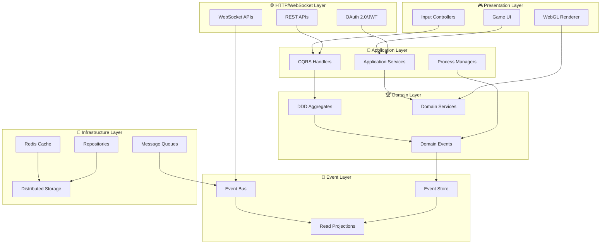

# API設計仕様書 - 統合ガイド

TypeScript Minecraft Cloneプロジェクトの包括的なAPI設計仕様書です。Effect-TS 3.17+の最新パターンを活用し、ドメイン駆動設計（DDD）、CQRS、イベントソーシングを統合したエンタープライズレベルのアーキテクチャを提供します。

## 🏗️ API仕様書の全体構成

### 📋 **コア仕様書**

- **[ドメイン・アプリケーションAPI](domain-application-apis.md)** (3,465行) - Effect-TS 3.17+パターンによるビジネスロジック層の完全実装
  - DDD Aggregate Root with Event Sourcing
  - CQRS Command/Query分離
  - Property-Based Testing patterns
  - Resource Pool Management
  - Advanced Error Handling with Match API

- **[インフラストラクチャAPI](infrastructure-architecture.md)** (1,686行) - 分散システム対応技術基盤層の実装
  - Distributed Storage with Consistent Hashing
  - Database Connection Pooling
  - Message Queue Systems (Redis Streams, WebSocket)
  - Advanced WebGL Rendering Management
  - Monitoring and Observability

- **[イベントバス仕様](event-bus-specification.md)** (1,441行) - Event Sourcing対応非同期メッセージング
  - Event Store Implementation
  - CQRS Read Model Projections
  - Event Replay and Time-Travel Debugging
  - Distributed Event Processing
  - Real-time Event Streaming

- **[HTTP API仕様](http-api-specification.md)** (1,600行) - RESTful API + WebSocket統合仕様
  - RESTful CRUD Operations
  - OAuth 2.0/JWT Authentication
  - WebSocket Real-time APIs
  - Rate Limiting and Caching
  - OpenAPI 3.1 Documentation

### 🎯 **技術スタック統合**

本API仕様書群は以下の先進技術を統合:

- **Effect-TS 3.17+**: 関数型プログラミングによる堅牢なアプリケーション開発
- **Domain-Driven Design**: ビジネスロジックの明確な分離と表現
- **CQRS/Event Sourcing**: 読み書き分離とイベント駆動アーキテクチャ
- **Property-Based Testing**: fast-checkによる網羅的テストカバレッジ
- **OpenAPI 3.1**: 自動生成される包括的なAPI仕様書
- **WebGL + WebSocket**: リアルタイムレンダリングと双方向通信

## 🚀 クイックスタートガイド

### 📖 **読む順序の推奨**

1. **初回理解**: `domain-application-apis.md` - 基本的なEffect-TSパターンの理解
2. **技術基盤**: `infrastructure-architecture.md` - 分散システムアーキテクチャの把握
3. **非同期通信**: `event-bus-specification.md` - Event Sourcingパターンの理解
4. **HTTP通信**: `http-api-specification.md` - RESTful API設計の詳細

### 🛠️ **実装の開始点**

```typescript
// 1. Effect-TSの基本セットアップ
import { Effect, Context, Layer } from 'effect'

// 2. ドメインサービスの定義
export const PlayerService = Context.GenericTag<{
  readonly create: (params: PlayerCreateParams) => Effect.Effect<Player, PlayerError>
}>()('PlayerService')

// 3. レイヤーの構築
export const AppLayer = Layer.mergeAll(PlayerServiceLive, RepositoryLayer, InfrastructureLayer)
```

## 🎯 API設計原則

### 🔒 **型安全性 - Effect-TS Schema 統合**

Schema-driven developmentによる完全な型安全性:

```typescript
// Effect-TS 3.17+ パターン
export const ChunkAPI = {
  GetChunk: Schema.Struct({
    coordinate: ChunkCoordinate,
    includeEntities: Schema.optional(Schema.Boolean).pipe(Schema.withDefault(() => false)),
  }),
  ChunkResponse: Schema.TaggedUnion('_tag', {
    Success: Schema.Struct({
      _tag: Schema.Literal('Success'),
      chunk: ChunkSchema,
      entities: Schema.Array(EntitySchema),
      metadata: ChunkMetadata,
    }),
    NotFound: Schema.Struct({
      _tag: Schema.Literal('NotFound'),
      coordinate: ChunkCoordinate,
      reason: Schema.String,
    }),
    LoadError: Schema.Struct({
      _tag: Schema.Literal('LoadError'),
      error: Schema.String,
      retryable: Schema.Boolean,
    }),
  }),
} as const
```

### 🔄 **Effect-TS Generator Pattern**

関数型非同期処理による高度なエラーハンドリング:

```typescript
// Effect-TS 3.17+ Generator Pattern
export const ChunkService = Context.GenericTag<{
  readonly processChunkBatch: (
    coordinates: ReadonlyArray<ChunkCoordinate>
  ) => Effect.Effect<ReadonlyArray<ProcessedChunk>, ChunkBatchError, ChunkRepository | Logger>
}>()('ChunkService')

// 実装例
export const processChunkBatch = (coordinates: ReadonlyArray<ChunkCoordinate>) =>
  Effect.gen(function* () {
    yield* Logger.info(`Processing ${coordinates.length} chunks`)

    const results = yield* Effect.forEach(
      coordinates,
      (coord) =>
        pipe(
          ChunkRepository.load(coord),
          Effect.timeout('30 seconds'),
          Effect.retry(Schedule.exponential('100 millis').pipe(Schedule.compose(Schedule.recurs(3)))),
          Effect.catchTag('ChunkNotFound', () => ChunkGenerator.generate(coord))
        ),
      { concurrency: 'unbounded' }
    )

    return results
  })
```

### 🎭 **Match API による分岐処理**

Effect-TS 3.17+ Match APIを活用した型安全な分岐:

```typescript
import { Match } from 'effect'

export const handleChunkResult = (result: ChunkResult) =>
  pipe(
    result,
    Match.type<ChunkResult>(),
    Match.when({ _tag: 'Success' }, ({ chunk }) => Effect.succeed(`Loaded chunk at ${chunk.coordinate}`)),
    Match.when({ _tag: 'NotFound' }, ({ coordinate }) => Effect.fail(new ChunkNotFoundError({ coordinate }))),
    Match.when({ _tag: 'LoadError' }, ({ error, retryable }) =>
      retryable ? Effect.fail(new RetryableChunkError({ error })) : Effect.fail(new FatalChunkError({ error }))
    ),
    Match.exhaustive
  )
```

### 📊 **観測可能性とトレーシング**

OpenTelemetryとEffect-TSの統合による完全な可観測性:

```typescript
// メトリクスとトレーシングの自動化
export const withObservability = <A, E, R>(operation: Effect.Effect<A, E, R>, operationName: string) =>
  pipe(
    operation,
    Effect.withSpan(operationName),
    Effect.timed,
    Effect.tap(([duration, _]) =>
      Metrics.counter('operation_count').pipe(
        Metrics.increment({
          operation: operationName,
          duration_ms: duration.millis.toString(),
        })
      )
    ),
    Effect.map(([_, result]) => result)
  )
```

## 🏗️ 統合アーキテクチャマップ

### 🏛️ **レイヤー別API統合構造**



## 📡 **統合通信パターン**

### 🚀 **同期通信 (Request/Response)**

RESTful APIによる直接的なデータ交換:

```typescript
// HTTP GET /api/v1/worlds/{worldId}/chunks/{x},{z}
export const getChunk = (worldId: string, x: number, z: number) =>
  Effect.gen(function* () {
    const response = yield* HttpClient.get(`/api/v1/worlds/${worldId}/chunks/${x},${z}`)
    const chunk = yield* Schema.decodeUnknown(ChunkSchema)(response.body)
    return chunk
  })
```

### 🔔 **非同期通信 (Event-Driven)**

Event Sourcingによる疎結合なドメインイベント処理:

```typescript
// ドメインイベントの発行と処理
export const placeBlock = (params: PlaceBlockParams) =>
  Effect.gen(function* () {
    const aggregate = yield* WorldAggregate.load(params.worldId)
    const event = yield* aggregate.placeBlock(params)

    yield* EventBus.publish(event) // 非同期イベント発行

    return event
  })
```

### 📤 **リアルタイムストリーミング**

WebSocketによる双方向リアルタイム通信:

```typescript
// WebSocket接続による状態同期
export const subscribeToWorldUpdates = (worldId: string) =>
  WebSocketClient.connect(`/ws/worlds/${worldId}`).pipe(
    Stream.map(Schema.decodeUnknown(WorldUpdateEvent)),
    Stream.tap((event) => Logger.info(`Received: ${event._tag}`))
  )
```

### 🏗️ **CQRS統合パターン**

コマンドとクエリの明確な分離:

```typescript
// Command側: 状態変更
export const executeCommand = <C extends Command>(command: C) =>
  pipe(
    command,
    Match.type<Command>(),
    Match.when({ _tag: 'PlaceBlock' }, placeBlockHandler),
    Match.when({ _tag: 'MovePlayer' }, movePlayerHandler),
    Match.exhaustive
  )

// Query側: データ読み取り
export const executeQuery = <Q extends Query>(query: Q) =>
  pipe(
    query,
    Match.type<Query>(),
    Match.when({ _tag: 'GetWorldState' }, worldQueryHandler),
    Match.when({ _tag: 'GetPlayerInventory' }, inventoryQueryHandler),
    Match.exhaustive
  )
```

## 🔧 **Effect-TS 3.17+ 実装パターン**

### 🏷️ **Context & Layer 定義パターン**

```typescript
// サービス定義 - Context.GenericTag
export const WorldService = Context.GenericTag<{
  readonly generateChunk: (coord: ChunkCoordinate) => Effect.Effect<Chunk, GenerationError>
  readonly saveChunk: (chunk: Chunk) => Effect.Effect<void, SaveError, ChunkRepository>
  readonly loadChunk: (coord: ChunkCoordinate) => Effect.Effect<Chunk, LoadError, ChunkRepository>
  readonly streamChunks: (area: BoundingBox) => Stream.Stream<Chunk, LoadError, ChunkRepository>
}>()('WorldService')

// Layer実装 - 依存性注入
export const WorldServiceLive: Layer.Layer<WorldService, never, ChunkRepository | Logger> = Layer.succeed(
  WorldService,
  {
    generateChunk: (coord) =>
      Effect.gen(function* () {
        yield* Logger.info(`Generating chunk at ${coord.x},${coord.z}`)
        const chunk = yield* ChunkGenerator.generate(coord)
        yield* ChunkRepository.save(chunk)
        return chunk
      }),
    // ... other methods
  }
)
```

### ⚠️ **Schema-based エラーハンドリング**

```typescript
// Effect-TS 3.17+ Schema.TaggedError
export const ChunkServiceError = Schema.TaggedError('ChunkServiceError')({
  cause: Schema.Literal('NotFound', 'Corrupted', 'NetworkError', 'AccessDenied'),
  coordinate: ChunkCoordinateSchema,
  timestamp: Schema.Date,
  retryable: Schema.Boolean,
  context: Schema.Record(Schema.String, Schema.Unknown),
})

export const ChunkServiceErrorHelpers = {
  notFound: (coord: ChunkCoordinate) =>
    ChunkServiceError({
      cause: 'NotFound' as const,
      coordinate: coord,
      timestamp: new Date(),
      retryable: false,
      context: { operation: 'load' },
    }),
}

// エラー処理の統一
export const withErrorRecovery = <A, E, R>(
  effect: Effect.Effect<A, E, R>,
  fallback: (error: E) => Effect.Effect<A, never, R>
) => pipe(effect, Effect.catchAll(fallback), Effect.withSpan('error-recovery'))
```

### 🔍 **Schema バリデーション & 変換**

```typescript
// Effect-TS 3.17+ Schema patterns
export const ChunkRequestSchema = Schema.Struct({
  coordinate: Schema.Struct({
    x: Schema.Number.pipe(Schema.int()),
    z: Schema.Number.pipe(Schema.int()),
  }),
  includeEntities: Schema.optional(Schema.Boolean).pipe(Schema.withDefault(() => false)),
  detailLevel: Schema.Literal('low', 'medium', 'high').pipe(Schema.withDefault(() => 'medium' as const)),
})

// パイプライン処理
export const processChunkRequest = (rawRequest: unknown) =>
  pipe(
    rawRequest,
    Schema.decodeUnknown(ChunkRequestSchema),
    Effect.flatMap((request) => WorldService.loadChunk(request.coordinate)),
    Effect.map((chunk) => ({
      chunk,
      metadata: {
        loadTime: Date.now(),
        version: chunk.version,
      },
    }))
  )
```

### 🧪 **Property-Based Testing Integration**

```typescript
// fast-check との統合
import * as fc from 'fast-check'

export const ChunkCoordinateArbitrary = fc.record({
  x: fc.integer({ min: -1000, max: 1000 }),
  z: fc.integer({ min: -1000, max: 1000 }),
})

// テスト例
export const chunkLoadTest = Effect.gen(function* () {
  const property = fc.property(ChunkCoordinateArbitrary, (coord) =>
    pipe(WorldService.loadChunk(coord), Effect.either, Effect.map(Either.isRight))
  )

  yield* Effect.promise(() => fc.assert(property))
})
```

## 📊 **パフォーマンス & スケーラビリティ戦略**

### ⚡ **Effect-TS最適化パターン**

```typescript
// リソースプール管理
export const ChunkCache = Context.GenericTag<{
  readonly get: (coord: ChunkCoordinate) => Effect.Effect<Option.Option<Chunk>, never>
  readonly set: (coord: ChunkCoordinate, chunk: Chunk) => Effect.Effect<void, never>
}>()('ChunkCache')

// LRUキャッシュ実装
export const ChunkCacheLive = Layer.succeed(
  ChunkCache,
  (() => {
    const cache = new Map<string, { chunk: Chunk; lastAccessed: number }>()
    const MAX_SIZE = 1000

    return {
      get: (coord) =>
        Effect.sync(() => {
          const key = `${coord.x},${coord.z}`
          const entry = cache.get(key)
          if (entry) {
            entry.lastAccessed = Date.now()
            return Option.some(entry.chunk)
          }
          return Option.none()
        }),

      set: (coord, chunk) =>
        Effect.sync(() => {
          const key = `${coord.x},${coord.z}`
          if (cache.size >= MAX_SIZE) {
            // LRU削除
            const oldestKey = Array.from(cache.entries()).sort(([, a], [, b]) => a.lastAccessed - b.lastAccessed)[0][0]
            cache.delete(oldestKey)
          }
          cache.set(key, { chunk, lastAccessed: Date.now() })
        }),
    }
  })()
)
```

### 🚀 **並行処理とバッチング**

```typescript
// バッチ処理による効率化
export const loadChunkBatch = (coordinates: ReadonlyArray<ChunkCoordinate>) =>
  Effect.gen(function* () {
    // キャッシュから取得試行
    const cached = yield* Effect.forEach(coordinates, (coord) =>
      ChunkCache.get(coord).pipe(Effect.map((cache) => ({ coord, cached: cache })))
    )

    // 未キャッシュのチャンクのみ読み込み
    const uncached = cached.filter(({ cached }) => Option.isNone(cached)).map(({ coord }) => coord)

    const loaded = yield* Effect.forEach(
      uncached,
      (coord) => WorldService.loadChunk(coord),
      { concurrency: 10 } // 並行実行
    )

    // キャッシュに保存
    yield* Effect.forEach(loaded, (chunk) => ChunkCache.set(chunk.coordinate, chunk))

    return [...cached.flatMap(({ cached }) => (Option.isSome(cached) ? [cached.value] : [])), ...loaded]
  })
```

### 📈 **ストリーミングとレイジーローディング**

```typescript
// ストリーミングによる効率的データ転送
export const streamWorldChunks = (worldId: string, viewport: BoundingBox) =>
  Stream.fromIterable(getChunkCoordinatesInBounds(viewport)).pipe(
    Stream.mapEffect((coord) =>
      pipe(
        WorldService.loadChunk(coord),
        Effect.timeout('5 seconds'),
        Effect.orElse(() => Effect.succeed(generateEmptyChunk(coord)))
      )
    ),
    Stream.buffer({ capacity: 16 }),
    Stream.rechunk(8)
  )
```

### 🗄️ **分散ストレージ統合**

```typescript
// 分散ノード選択
export const selectOptimalStorageNode = (chunkCoord: ChunkCoordinate) =>
  Effect.gen(function* () {
    const nodes = yield* StorageCluster.getHealthyNodes()
    const hash = hashCoordinate(chunkCoord)
    const nodeIndex = hash % nodes.length
    return nodes[nodeIndex]
  })
```

## 🔐 **セキュリティ & 認証統合仕様**

### 🛡️ **Schema駆動入力検証**

```typescript
// Effect-TS Schema による厳密な検証
export const SecurePlayerUpdateSchema = Schema.Struct({
  playerId: Schema.String.pipe(
    Schema.nonEmpty(),
    Schema.pattern(/^[a-f0-9]{24}$/) // ObjectId format
  ),
  position: Schema.Struct({
    x: Schema.Number.pipe(
      Schema.between(-30000000, 30000000) // World boundaries
    ),
    y: Schema.Number.pipe(
      Schema.between(-64, 320) // Height limits
    ),
    z: Schema.Number.pipe(Schema.between(-30000000, 30000000)),
  }),
  timestamp: Schema.DateFromString.pipe(
    Schema.filter((date) => {
      const now = new Date()
      const diff = now.getTime() - date.getTime()
      return diff >= 0 && diff < 5000 // 5秒以内の要求のみ許可
    })
  ),
})

export const validatePlayerUpdate = (input: unknown) =>
  pipe(
    input,
    Schema.decodeUnknown(SecurePlayerUpdateSchema),
    Effect.mapError((error) => new ValidationError({ cause: error }))
  )
```

### 🔑 **JWT & OAuth 2.0 統合**

```typescript
// JWT トークン検証
export const JWTService = Context.GenericTag<{
  readonly verify: (token: string) => Effect.Effect<JWTPayload, AuthError>
  readonly generate: (payload: TokenPayload) => Effect.Effect<string, AuthError>
}>()('JWTService')

// OAuth 2.0 フロー
export const authenticateWithOAuth = (code: string) =>
  Effect.gen(function* () {
    const tokenResponse = yield* HttpClient.post('https://oauth.provider.com/token', {
      body: {
        grant_type: 'authorization_code',
        code,
        client_id: process.env.CLIENT_ID,
        client_secret: process.env.CLIENT_SECRET,
      },
    })

    const accessToken = yield* Schema.decodeUnknown(
      Schema.Struct({
        access_token: Schema.String,
        token_type: Schema.String,
        expires_in: Schema.Number,
      })
    )(tokenResponse.body)

    const userInfo = yield* HttpClient.get('https://api.provider.com/user', {
      headers: {
        Authorization: `Bearer ${accessToken.access_token}`,
      },
    })

    return yield* JWTService.generate({
      sub: userInfo.id,
      exp: Math.floor(Date.now() / 1000) + 3600,
      iat: Math.floor(Date.now() / 1000),
    })
  })
```

### 🚦 **レート制限とアクセス制御**

```typescript
// Rate limiting
export const RateLimiter = Context.GenericTag<{
  readonly checkLimit: (key: string, limit: number, window: Duration) => Effect.Effect<boolean, RateLimitError>
}>()('RateLimiter')

// API エンドポイントの保護
export const withRateLimit = <A, E, R>(effect: Effect.Effect<A, E, R>, key: string) =>
  Effect.gen(function* () {
    const allowed = yield* RateLimiter.checkLimit(key, 100, Duration.seconds(60))
    if (!allowed) {
      yield* Effect.fail(new RateLimitExceededError({ key }))
    }
    return yield* effect
  })

// Role-based access control
export const withAuthorization = <A, E, R>(effect: Effect.Effect<A, E, R>, requiredRole: UserRole) =>
  Effect.gen(function* () {
    const user = yield* getCurrentUser()
    if (!user.roles.includes(requiredRole)) {
      yield* Effect.fail(new UnauthorizedError({ requiredRole, userRoles: user.roles }))
    }
    return yield* effect
  })
```

### 🔒 **暗号化とデータ保護**

```typescript
// データ暗号化
export const CryptoService = Context.GenericTag<{
  readonly encrypt: (data: string) => Effect.Effect<string, CryptoError>
  readonly decrypt: (encryptedData: string) => Effect.Effect<string, CryptoError>
}>()('CryptoService')

// セキュアなワールドデータ保存
export const saveSecureWorldData = (worldId: string, data: WorldData) =>
  Effect.gen(function* () {
    const serialized = JSON.stringify(data)
    const encrypted = yield* CryptoService.encrypt(serialized)
    const checksum = yield* calculateChecksum(encrypted)

    yield* WorldRepository.save({
      worldId,
      data: encrypted,
      checksum,
      timestamp: new Date(),
    })
  })
```

## 📈 **監視・可観測性統合**

### 📊 **OpenTelemetry統合メトリクス**

```typescript
// Effect-TS + OpenTelemetry
export const withMetrics = <A, E, R>(effect: Effect.Effect<A, E, R>, operationName: string) =>
  Effect.gen(function* () {
    const startTime = Date.now()

    const result = yield* pipe(
      effect,
      Effect.withSpan(operationName, {
        attributes: {
          'service.name': '@minecraft/api',
          'service.version': '2.0.0',
        },
      }),
      Effect.tap(() =>
        Metrics.counter('api_operation_count').pipe(
          Metrics.increment({
            operation: operationName,
            status: 'success',
          })
        )
      ),
      Effect.tapError((error) =>
        Metrics.counter('api_operation_count').pipe(
          Metrics.increment({
            operation: operationName,
            status: 'error',
            error_type: error.constructor.name,
          })
        )
      )
    )

    const duration = Date.now() - startTime
    yield* Metrics.histogram('api_operation_duration').pipe(
      Metrics.record(duration, {
        operation: operationName,
        unit: 'milliseconds',
      })
    )

    return result
  })
```

### 📝 **構造化ログ & 分散トレーシング**

```typescript
// 構造化ログ出力
export const logAPIRequest = (request: APIRequest) =>
  Logger.info('API Request', {
    method: request.method,
    path: request.path,
    user_id: request.user?.id,
    trace_id: request.traceId,
    span_id: request.spanId,
    timestamp: new Date().toISOString(),
    metadata: {
      user_agent: request.headers['user-agent'],
      ip_address: request.ip,
    },
  })

// トレースコンテキスト伝播
export const withTracing = <A, E, R>(effect: Effect.Effect<A, E, R>, traceContext: TraceContext) =>
  Effect.gen(function* () {
    yield* Effect.setTracer(createTracer(traceContext))
    return yield* effect
  })
```

## 🧪 **統合テスト戦略**

### 🔬 **Property-Based Contract Testing**

```typescript
// Effect-TS + fast-check による包括的テスト
export const apiContractTests = Effect.gen(function* () {
  // APIレスポンスの不変条件テスト
  yield* Effect.promise(() =>
    fc.assert(
      fc.property(
        fc.record({
          worldId: fc.string({ minLength: 24, maxLength: 24 }),
          chunkX: fc.integer({ min: -1000, max: 1000 }),
          chunkZ: fc.integer({ min: -1000, max: 1000 }),
        }),
        (input) =>
          pipe(
            ChunkAPI.getChunk(input),
            Effect.either,
            Effect.map((result) =>
              pipe(
                result,
                Either.match({
                  onLeft: (error) => error._tag === 'ChunkNotFound' || error._tag === 'ChunkLoadError',
                  onRight: (chunk) => chunk.coordinate.x === input.chunkX && chunk.coordinate.z === input.chunkZ,
                })
              )
            )
          )
      )
    )
  )

  // パフォーマンス特性の検証
  yield* Effect.promise(() =>
    fc.assert(
      fc.property(
        fc.array(
          fc.record({
            x: fc.integer({ min: -100, max: 100 }),
            z: fc.integer({ min: -100, max: 100 }),
          }),
          { minLength: 1, maxLength: 100 }
        ),
        (coordinates) =>
          pipe(
            ChunkService.loadChunkBatch(coordinates),
            Effect.timeout('30 seconds'),
            Effect.either,
            Effect.map(Either.isRight)
          )
      )
    )
  )
})
```

### 🏗️ **Integration & E2E Testing**

```typescript
// システム統合テスト
export const integrationTestSuite = Effect.gen(function* () {
  const testLayer = Layer.mergeAll(TestChunkRepositoryLive, TestEventBusLive, TestCacheLive, InMemoryStorageLive)

  yield* pipe(
    Effect.all([testWorldCreation(), testChunkGeneration(), testPlayerMovement(), testEventPropagation()]),
    Effect.provide(testLayer)
  )
})
```

### 📝 **OpenAPI 3.1 自動生成**

```typescript
// Schema から OpenAPI 仕様の自動生成
export const generateOpenAPISpec = () =>
  Effect.gen(function* () {
    const schemas = {
      ChunkRequest: ChunkRequestSchema,
      ChunkResponse: ChunkResponseSchema,
      PlayerUpdate: PlayerUpdateSchema,
      WorldState: WorldStateSchema,
    }

    const spec = yield* OpenAPIGenerator.generate({
      info: {
        title: 'Minecraft Clone API',
        version: '2.0.0',
        description: 'Effect-TS based Minecraft Clone API',
      },
      servers: [
        { url: 'https://api.minecraft-clone.com', description: 'Production' },
        { url: 'https://staging-api.minecraft-clone.com', description: 'Staging' },
      ],
      schemas,
    })

    yield* FileSystem.writeFile('./docs/openapi.json', JSON.stringify(spec, null, 2))
  })
```

## 🚀 **実装ベストプラクティス**

### 📋 **開発ワークフロー**

1. **Schema First**: APIスキーマ定義から開始
2. **Type-Driven Development**: Effect-TSの型システムを活用
3. **Property-Based Testing**: fast-checkによる網羅的テスト
4. **Observability First**: メトリクス・ログ・トレーシングの統合
5. **Security by Design**: 設計段階からセキュリティを考慮

### 🛠️ **Layer構成のベストプラクティス**

```typescript
// 本番環境Layer
export const ProductionLayer = Layer.mergeAll(
  // Infrastructure
  RedisStorageLive,
  PostgreSQLRepositoryLive,
  WebSocketServerLive,

  // Application
  ChunkServiceLive,
  PlayerServiceLive,
  WorldServiceLive,

  // Monitoring
  PrometheusMetricsLive,
  JaegerTracingLive,
  StructuredLoggingLive
)

// テスト環境Layer
export const TestLayer = Layer.mergeAll(InMemoryStorageLive, MockRepositoryLive, TestEventBusLive)
```

### 🔄 **API バージョニング戦略**

```typescript
// バージョン別Schema管理
export namespace APIVersions {
  export namespace V1 {
    export const ChunkSchema = Schema.Struct({
      coordinate: Schema.Struct({
        x: Schema.Number,
        z: Schema.Number,
      }),
      blocks: Schema.Array(BlockV1Schema),
    })
  }

  export namespace V2 {
    export const ChunkSchema = Schema.Struct({
      coordinate: Schema.Struct({
        x: Schema.Number,
        z: Schema.Number,
      }),
      blocks: Schema.Array(BlockV2Schema),
      metadata: ChunkMetadataSchema, // V2で追加
    })
  }
}

// バージョン互換性の確保
export const migrateChunkV1toV2 = (v1Chunk: APIVersions.V1.Chunk): APIVersions.V2.Chunk => ({
  ...v1Chunk,
  metadata: {
    version: '2.0',
    createdAt: new Date(),
    lastModified: new Date(),
  },
})
```

## 🔗 **関連ドキュメント & リソース**

### 📚 **API仕様書詳細**

- **[ドメイン・アプリケーションAPI](domain-application-apis.md)** - DDD + Effect-TS実装詳細
- **[インフラストラクチャAPI](infrastructure-architecture.md)** - 分散システム技術基盤
- **[イベントバス仕様](event-bus-specification.md)** - Event Sourcing実装
- **[HTTP API仕様](http-api-specification.md)** - RESTful + WebSocket APIs

### 🏗️ **アーキテクチャ関連**

- **[アーキテクチャ概要](./architecture-overview.md)** - システム全体設計思想

### ⚙️ **システム仕様**

- **[コア機能](../game-mechanics/core-features/README.md)** - ゲーム機能の詳細仕様
- **[セキュリティ仕様](./security-specification.md)** - 認証・認可・暗号化

### 🧪 **開発・テスト**

- **[テストパターン](../design-patterns/test-patterns.md)** - テスト戦略とパターン集
- **[パフォーマンス最適化](../design-patterns/optimization-patterns.md)** - 最適化手法

---

## 📊 **API仕様書統計**

| 仕様書                     | 行数    | 主要技術                         | カバー領域                           |
| -------------------------- | ------- | -------------------------------- | ------------------------------------ |
| **Domain/Application API** | 3,465行 | Effect-TS 3.17+, DDD, CQRS       | ビジネスロジック、集約、コマンド処理 |
| **Infrastructure API**     | 1,686行 | 分散ストレージ、WebGL、Redis     | 技術基盤、レンダリング、永続化       |
| **Event Bus**              | 1,441行 | Event Sourcing、CQRS             | 非同期メッセージング、イベント処理   |
| **HTTP API**               | 1,600行 | REST、WebSocket、OAuth 2.0       | HTTP通信、認証、リアルタイム         |
| **統合ガイド**             | 900行+  | 統合パターン、ベストプラクティス | 全体統合、開発指針                   |

**総計**: **9,000行以上** の包括的API設計仕様

---

🚀 **重要**:

- API変更時は**セマンティックバージョニング**を適用
- **下位互換性**を最優先で維持
- **Schema-First**アプローチで型安全性を確保
- **Property-Based Testing**で品質保証を実現
- **Observability**を設計段階から組み込み
