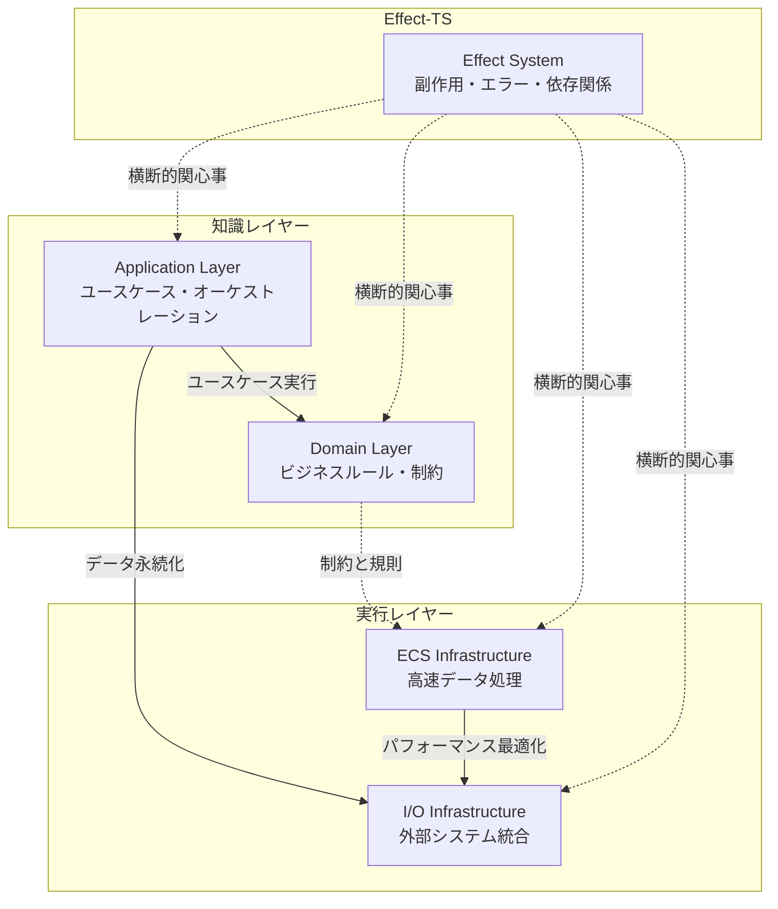
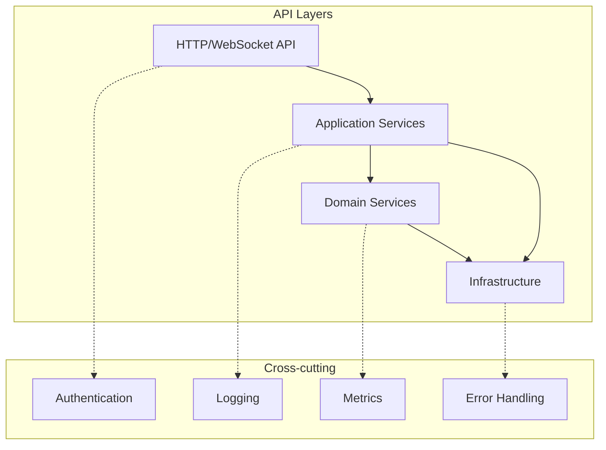

  topics: ["architecture", "ddd", "ecs", "effect-ts", "game-development", "enterprise-design"]
  skill_level: "advanced"
  implementation_time: 120
  confidence_score: 0.98
  use_cases: ["game-development", "enterprise-systems", "scalable-architecture", "real-time-systems"]
  architectural_complexity: "high"
---

# 統合アーキテクチャ設計哲学

TypeScript MinecraftにおけるDDD + ECS + Effect-TS統合アーキテクチャの設計思想と、なぜこの複雑な統合が必要なのかを詳解します。

## 目次

1. [アーキテクチャ統合の必要性](#アーキテクチャ統合の必要性)
2. [統合設計の基本哲学](#統合設計の基本哲学)
3. [レイヤー設計と責務分離](#レイヤー設計と責務分離)
4. [パフォーマンスとコードの美しさの両立](#パフォーマンスとコードの美しさの両立)
5. [設計方針](#設計方針)
6. [アーキテクチャレイヤー](#アーキテクチャレイヤー)
7. [API分類](#api分類)
8. [Effect-TS統合パターン](#effect-ts統合パターン)
9. [セキュリティ方針](#セキュリティ方針)
10. [実世界での運用考慮](#実世界での運用考慮)
11. [API一覧](#api一覧)

## アーキテクチャ統合の必要性

### なぜ単一アーキテクチャでは不足なのか

Minecraftクローンの開発では、相反する要求が存在します：

**ビジネス要求**:
- 複雑なゲームルールの正確な実装
- 拡張性と保守性
- チーム開発での理解しやすさ
- バグ修正の容易さ

**技術要求**:
- 60FPS のリアルタイム性能
- 大規模ワールドのメモリ効率
- ネットワーク最適化
- 低レイテンシ処理

従来のアプローチでは、どちらかを犠牲にする必要がありました：

```typescript
// ❌ オブジェクト指向のみ: 美しいが遅い
const entities: Map<EntityId, GameObject> = new Map()

function updateWorld(deltaTime: number): void {
  // ポリモーフィズムは美しいが、仮想関数呼び出しが高コスト
  pipe(
    Array.from(entities.values()),
    Array.forEach((entity) => {
      entity.update(deltaTime)  // Cache miss 多発
    })
  )
}

// ❌ ECS のみ: 高速だがビジネスロジックが分散
function updateMovement(positions: Float32Array, velocities: Float32Array, deltaTime: number): void {
  // 高速だが、どのような制約があるか不明
  // パフォーマンスクリティカルなケースではインデックス操作を維持
  pipe(
    Array.range(0, Math.floor(positions.length / 3)),
    Array.forEach((idx) => {
      const i = idx * 3
      positions[i] += velocities[i] * deltaTime
      positions[i + 1] += velocities[i + 1] * deltaTime
      positions[i + 2] += velocities[i + 2] * deltaTime
    })
  )
}
```

### 統合アーキテクチャによる解決

```typescript
// ✅ 統合アプローチ: ドメインロジックとパフォーマンスの両立

// ドメイン層: ビジネスルールの明確な表現
export const PlayerMovement = {
  validateMove: (player: Player, newPosition: Position): Effect.Effect<
    Position,
    MovementError,
    GameRules | CollisionSystem
  > =>
    Effect.gen(function* () {
      const rules = yield* GameRules
      const collision = yield* CollisionSystem

      // ドメインルールによる検証
      yield* rules.checkMovementLimits(player, newPosition)
      yield* collision.checkCollisions(player, newPosition)

      return newPosition
    }),

  // ドメインイベントの発行
  movePlayer: (player: Player, position: Position) =>
    Effect.gen(function* () {
      const updatedPlayer = { ...player, position }
      yield* PlayerRepository.save(updatedPlayer)
      yield* EventBus.publish(PlayerMoved.create({
        playerId: player.id,
        oldPosition: player.position,
        newPosition: position
      }))
      return updatedPlayer
    })
}

// インフラ層: 高速なECS実装
interface MovementECS {
  readonly handlePlayerMoved: (event: PlayerMoved) => Effect.Effect<void, never, never>
  readonly updatePositions: (deltaTime: number) => void
}

const MovementECS = Context.GenericTag<MovementECS>("@minecraft/MovementECS")

export const makeMovementECS = (maxEntities: number = MAX_ENTITIES) => Effect.gen(function* () {
  const positions = new Float32Array(maxEntities * 3)
  const velocities = new Float32Array(maxEntities * 3)
  const entityMap = new Map<PlayerId, number>()
  let activeCount = 0

  return MovementECS.of({
    // ドメインイベントを受け取り、ECS状態を更新
    handlePlayerMoved: (event: PlayerMoved) =>
      Effect.sync(() => {
        const index = entityMap.get(event.playerId)
        if (index !== undefined) {
          const baseIdx = index * 3
          positions[baseIdx] = event.newPosition.x
          positions[baseIdx + 1] = event.newPosition.y
          positions[baseIdx + 2] = event.newPosition.z
        }
      }),

    // 高速バッチ処理
    updatePositions: (deltaTime: number) => {
      // SIMD最適化可能な実装
      // パフォーマンスクリティカルな部分は配列操作を使用
      pipe(
        Array.range(0, activeCount),
        Array.forEach((idx) => {
          const i = idx * 3
          positions[i] += velocities[i] * deltaTime
          positions[i + 1] += velocities[i + 1] * deltaTime
          positions[i + 2] += velocities[i + 2] * deltaTime
        })
      )
    }
  })
})

const MovementECSLive = Layer.effect(MovementECS, makeMovementECS())
```

## 統合設計の基本哲学

### 1. レイヤー間の明確な責務分離



### 2. イベント駆動による疎結合

```typescript
// ドメイン操作 → イベント発行 → ECS更新の流れ
export const gameplayFlow = Effect.gen(function* () {
  // 1. ドメインレベルでのプレイヤー操作
  const moveResult = yield* PlayerDomain.movePlayer(playerId, targetPosition)

  // 2. ドメインイベントの発行（自動）
  // PlayerMovedEvent が発行される

  // 3. ECS層での自動更新（イベントハンドラー）
  // MovementECS.handlePlayerMoved が呼ばれる

  // 4. 他のシステムへの伝播（必要に応じて）
  // RenderingSystem, SoundSystem など
})
```

### 3. コンテキスト境界による複雑性管理

```typescript
// 各境界づけられたコンテキストは独立
export namespace WorldContext {
  export interface WorldService {
    readonly loadChunk: (pos: ChunkPosition) => Effect.Effect<Chunk, LoadError>
    readonly generateTerrain: (pos: ChunkPosition) => Effect.Effect<TerrainData, GenerationError>
  }
}

export namespace PlayerContext {
  export interface PlayerService {
    readonly authenticatePlayer: (token: string) => Effect.Effect<Player, AuthError>
    readonly updateInventory: (playerId: PlayerId, item: Item) => Effect.Effect<void, InventoryError>
  }
}

export namespace CombatContext {
  export interface CombatService {
    readonly calculateDamage: (attacker: Entity, target: Entity) => Effect.Effect<Damage, CombatError>
    readonly applyEffects: (entity: Entity, effects: Effect[]) => Effect.Effect<void, EffectError>
  }
}
```

## レイヤー設計と責務分離

### Domain Layer の深い責務

```typescript
// 単なる CRUD ではなく、ビジネス不変条件の保護
export const InventoryDomain = {
  // 複雑なビジネスルール
  addItem: (inventory: Inventory, item: Item, quantity: number) =>
    Effect.gen(function* () {
      // 1. 容量制限チェック
      if (inventory.items.length >= MAX_INVENTORY_SIZE) {
        // でも、同じアイテムがスタック可能な場合は例外
        const existingStack = inventory.items.find(stack =>
          stack.itemId === item.id &&
          stack.quantity + quantity <= item.maxStackSize
        )

        if (!existingStack) {
          return yield* Effect.fail(InventoryFullError.create())
        }
      }

      // 2. アイテム固有の制約チェック
      if (item.category === "tool" && quantity > 1) {
        return yield* Effect.fail(
          InvalidQuantityError.create("Tools cannot be stacked")
        )
      }

      // 3. プレイヤーレベル制約
      const player = yield* PlayerRepository.findById(inventory.playerId)
      if (item.requiredLevel > player.level) {
        return yield* Effect.fail(
          InsufficientLevelError.create({
            required: item.requiredLevel,
            current: player.level
          })
        )
      }

      // 4. ゲームモード制約
      if (player.gameMode === "adventure" && item.category === "creative_only") {
        return yield* Effect.fail(
          GameModeRestrictionError.create()
        )
      }

      // ここまでクリアしたら、実際の追加処理
      return addItemToInventory(inventory, item, quantity)
    })
}
```

### Application Layer のオーケストレーション責務

```typescript
export const PlayerUseCase = {
  // 複数ドメインの協調
  joinServer: (playerId: PlayerId, serverId: ServerId) =>
    Effect.gen(function* () {
      // 1. プレイヤー認証
      const player = yield* AuthDomain.authenticatePlayer(playerId)

      // 2. サーバー容量チェック
      const server = yield* ServerDomain.getServer(serverId)
      yield* ServerDomain.checkCapacity(server)

      // 3. ワールド読み込み準備
      const spawnChunks = yield* WorldDomain.getSpawnChunks(server.worldId)
      yield* ChunkService.preloadChunks(spawnChunks)

      // 4. プレイヤー状態の初期化
      const playerState = yield* PlayerDomain.initializeForServer(player, server)

      // 5. 他のプレイヤーへの通知
      yield* NotificationService.broadcastPlayerJoined(server, player)

      // 6. ゲームセッション開始
      yield* GameSession.create(player, server)

      // 7. すべて成功したらレスポンス
      return {
        success: true,
        spawnPosition: playerState.position,
        serverInfo: server.publicInfo
      }
    }).pipe(
      // 8. エラー時のクリーンアップ
      Effect.catchAllCause(cause =>
        Effect.gen(function* () {
          yield* Logger.error("Failed to join server", { playerId, serverId, cause })
          yield* GameSession.cleanup(playerId)
          return { success: false, error: "Failed to join server" }
        })
      )
    )
}
```

## パフォーマンスとコードの美しさの両立

### クリティカルパスの最適化戦略

```typescript
// 最適化されたゲームループ（関数型アプローチ）
export const createOptimizedGameLoop = (
  ecsWorld: ECSWorld,
  domainServices: DomainServices
) => ({
  // 60FPS を維持するためのフレーム処理
  updateFrame: async (deltaTime: number): Promise<void> => {
    const frameStart = performance.now()

    // Phase 1: クリティカルパス（4ms 以内）
    await this.criticalUpdates(deltaTime)

    // Phase 2: 重要だが遅延可能（8ms 以内）
    await this.importantUpdates(deltaTime)

    // Phase 3: バックグラウンド処理（残り時間）
    const remaining = 16 - (performance.now() - frameStart)
    if (remaining > 2) {
      await this.backgroundUpdates(remaining)
    }
  }

  private async criticalUpdates(deltaTime: number): Promise<void> {
    // ECS による高速処理
    this.ecsWorld.updateSystems([
      "MovementSystem",     // プレイヤー・エンティティの移動
      "PhysicsSystem",      // 物理シミュレーション
      "CollisionSystem",    // 衝突判定
      "RenderingSystem"     // 描画準備
    ], deltaTime)
  }

  private async importantUpdates(deltaTime: number): Promise<void> {
    // ドメインロジック（バッチ処理）
    const pendingActions = await this.actionQueue.flush()

    await Effect.runPromise(
      Effect.forEach(
        pendingActions,
        action => this.processDomainAction(action),
        { concurrency: 4 }  // 並行処理でスループット向上
      ).pipe(
        Effect.timeout("8ms"),  // 時間制限
        Effect.catchAll(cause =>
          Effect.gen(function* () {
            yield* Logger.warn("Domain processing timeout", { cause })
            return [] // 失敗したアクションは次フレームへ
          })
        )
      )
    )
  }

  private processDomainAction(action: PlayerAction): Effect.Effect<void, ActionError, DomainServices> =>
    Match.value(action).pipe(
      Match.tag("PlaceBlock", ({ position, blockType }) =>
        PlacementDomain.validateAndPlace(action.playerId, position, blockType)
      ),
      Match.tag("UseItem", ({ itemId, target }) =>
        ItemDomain.validateAndUse(action.playerId, itemId, target)
      ),
      Match.tag("ChatMessage", ({ message }) =>
        ChatDomain.validateAndBroadcast(action.playerId, message)
      ),
      Match.exhaustive
    )
}
```

### メモリ効率とガベージコレクション最適化

```typescript
// メモリ最適化チャンク管理（関数型アプローチ）
export const createMemoryOptimizedChunkManager = () => {
  // プール型オブジェクト管理
  const chunkPool = new ObjectPool(() => new ChunkData(), 100)
  const blockUpdatePool = new ObjectPool(() => new BlockUpdate(), 1000)

  // Structure of Arrays による cache-friendly データ構造
  private chunkPositions = new Int32Array(MAX_CHUNKS * 2)  // x, z
  private chunkStates = new Uint8Array(MAX_CHUNKS)         // state flags
  private chunkTimestamps = new Float64Array(MAX_CHUNKS)   // last update

  updateChunk(chunkIndex: number, deltaTime: number): void {
    // GC を発生させない純粋な計算
    const x = this.chunkPositions[chunkIndex * 2]
    const z = this.chunkPositions[chunkIndex * 2 + 1]

    // バッチ処理による効率化
    this.processPendingBlockUpdates(chunkIndex)

    // メモリプールからオブジェクト取得
    const blockUpdate = this.blockUpdatePool.acquire()
    try {
      // 処理実行
      this.calculateBlockUpdates(x, z, blockUpdate)
      this.applyBlockUpdates(chunkIndex, blockUpdate)
    } finally {
      // プールに返却（GC 回避）
      this.blockUpdatePool.release(blockUpdate)
    }

    this.chunkTimestamps[chunkIndex] = performance.now()
  }
}
```

## 設計方針

### 1. 関数型ファースト設計

```typescript
import { Effect, Schema } from "effect"

// すべてのAPIはEffect型で統一
export interface GameAPI {
  readonly getPlayer: (id: PlayerId) => Effect.Effect<Player, PlayerError>
  readonly updateWorld: (update: WorldUpdate) => Effect.Effect<World, WorldError>
  readonly processInput: (input: PlayerInput) => Effect.Effect<void, InputError>
}
```

### 2. 型安全性とスキーマ駆動

```typescript
// スキーマから自動でAPI型を生成
export const CreatePlayerRequest = Schema.Struct({
  name: Schema.String.pipe(
    Schema.minLength(1),
    Schema.maxLength(16),
    Schema.pattern(/^[a-zA-Z0-9_]+$/)
  ),
  gameMode: Schema.Literal("survival", "creative", "adventure", "spectator")
})

export const CreatePlayerResponse = Schema.Struct({
  player: PlayerSchema,
  world: WorldSchema,
  token: Schema.String
})

// 自動生成される型
export interface CreatePlayerAPI {
  (request: Schema.Schema.Type<typeof CreatePlayerRequest>):
    Effect.Effect<
      Schema.Schema.Type<typeof CreatePlayerResponse>,
      ValidationError | DatabaseError
    >
}
```

### 3. エラー境界とレジリエンス

```typescript
// タグ付きエラー型
export const PlayerNotFoundError = Schema.TaggedError("PlayerNotFoundError")({
  playerId: Schema.String,
  timestamp: Schema.Date
})

export const WorldCorruptedError = Schema.TaggedError("WorldCorruptedError")({
  worldId: Schema.String,
  corruption: Schema.String
})

// エラー境界での処理
export const safePlayerOperation = (operation: Effect.Effect<Player, PlayerError>) =>
  pipe(
    operation,
    Effect.catchTag("PlayerNotFoundError", () =>
      Effect.succeed(DefaultPlayer)
    ),
    Effect.retry(Schedule.exponential(Duration.millis(100))),
    Effect.timeout(Duration.seconds(5))
  )
```

## アーキテクチャレイヤー

### レイヤー構成



### 1. HTTP/WebSocket層

```typescript
export const HttpApiLayer = Layer.effectContext(
  Tag<HttpApiService>,
  Effect.gen(function* () {
    const app = yield* ApplicationService

    return {
      // RESTful エンドポイント
      routes: {
        "GET /api/players/:id": (playerId: string) =>
          pipe(
            PlayerId(playerId),
            app.getPlayer,
            Effect.map(player => ({ success: true, data: player })),
            Effect.catchAll(error =>
              Effect.succeed({ success: false, error: error.message })
            )
          ),

        "POST /api/players": (request: CreatePlayerRequest) =>
          pipe(
            Schema.decode(CreatePlayerRequest)(request),
            Effect.flatMap(app.createPlayer),
            Effect.map(response => ({ success: true, data: response }))
          )
      },

      // WebSocket ハンドラー
      websocket: {
        onConnect: (socket: WebSocket) =>
          pipe(
            AuthService.authenticate(socket),
            Effect.flatMap(player =>
              GameSession.create(player, socket)
            ),
            Effect.tap(() =>
              Logger.info(`Player connected: ${player.id}`)
            )
          ),

        onMessage: (socket: WebSocket, message: GameMessage) =>
          pipe(
            GameSession.getBySocket(socket),
            Effect.flatMap(session =>
              session.handleMessage(message)
            )
          )
      }
    }
  })
)
```

### 2. Application層

```typescript
export const ApplicationLayer = Layer.effectContext(
  Tag<ApplicationService>,
  Effect.gen(function* () {
    const domain = yield* DomainService
    const repo = yield* Repository

    return {
      // ユースケース実装
      createPlayer: (request: CreatePlayerRequest) =>
        Effect.gen(function* () {
          // バリデーション
          const validated = yield* Schema.decode(CreatePlayerRequest)(request)

          // ドメインロジック実行
          const player = yield* domain.createPlayer(validated)

          // 永続化
          yield* repo.savePlayer(player)

          // イベント発行
          yield* EventBus.publish(
            PlayerCreatedEvent({ player, timestamp: new Date() })
          )

          return { player, token: yield* AuthService.generateToken(player) }
        }),

      // クエリハンドラー
      getPlayer: (playerId: PlayerId) =>
        pipe(
          repo.getPlayer(playerId),
          Effect.catchTag("PlayerNotFoundError", () =>
            Effect.fail(new PlayerNotFoundError({ playerId }))
          )
        )
    }
  })
)
```

### 3. Domain層

```typescript
export const DomainLayer = Layer.effectContext(
  Tag<DomainService>,
  Effect.gen(function* () {
    return {
      // 純粋なビジネスロジック
      createPlayer: (data: CreatePlayerData) =>
        Effect.gen(function* () {
          // ドメイン検証
          yield* validatePlayerName(data.name)
          yield* validateGameMode(data.gameMode)

          // ドメインオブジェクト生成
          const player = Player.create({
            id: yield* Effect.sync(() => PlayerId(crypto.randomUUID())),
            name: data.name,
            gameMode: data.gameMode,
            position: Vector3.zero(),
            health: 20,
            createdAt: new Date()
          })

          return player
        }),

      // ドメインルール
      canPlaceBlock: (player: Player, position: BlockPosition, blockType: BlockType) =>
        Effect.gen(function* () {
          // 距離チェック
          const distance = Vector3.distance(player.position, position.world)
          if (distance > MAX_INTERACTION_DISTANCE) {
            yield* Effect.fail(new OutOfRangeError({ distance, max: MAX_INTERACTION_DISTANCE }))
          }

          // 権限チェック
          const hasPermission = yield* PermissionService.check(player, "block.place")
          if (!hasPermission) {
            yield* Effect.fail(new NoPermissionError({ playerId: player.id, action: "block.place" }))
          }

          return true
        })
    }
  })
)
```

## API分類

### 1. コマンドAPI（変更操作）

| エンドポイント | メソッド | 説明 | レスポンス |
|----------------|----------|------|------------|
| `/api/players` | POST | プレイヤー作成 | PlayerResponse |
| `/api/worlds` | POST | ワールド作成 | WorldResponse |
| `/api/blocks` | PUT | ブロック配置 | BlockPlacementResponse |
| `/api/inventory/move` | POST | アイテム移動 | InventoryResponse |

### 2. クエリAPI（参照操作）

| エンドポイント | メソッド | 説明 | レスポンス |
|----------------|----------|------|------------|
| `/api/players/:id` | GET | プレイヤー情報取得 | Player |
| `/api/worlds/:id/chunks` | GET | チャンク一覧取得 | ChunkList |
| `/api/leaderboard` | GET | ランキング取得 | LeaderboardResponse |

### 3. WebSocket API（リアルタイム）

```typescript
// WebSocketメッセージタイプ
export const WebSocketMessage = Schema.Union(
  // プレイヤーアクション
  Schema.Struct({
    type: Schema.Literal("player_move"),
    data: Schema.Struct({
      position: Vector3Schema,
      rotation: RotationSchema
    })
  }),

  // ブロック操作
  Schema.Struct({
    type: Schema.Literal("block_place"),
    data: Schema.Struct({
      position: BlockPositionSchema,
      blockType: Schema.String
    })
  }),

  // チャットメッセージ
  Schema.Struct({
    type: Schema.Literal("chat_message"),
    data: Schema.Struct({
      message: Schema.String,
      recipients: Schema.optional(Schema.Array(Schema.String))
    })
  })
)
```

## Effect-TS統合パターン

### 1. Context/Layer活用

```typescript
// サービス依存関係の定義
interface PlayerServiceInterface {
  readonly create: (data: CreatePlayerData) => Effect.Effect<Player, PlayerError>
  readonly get: (id: PlayerId) => Effect.Effect<Player, PlayerError>
  readonly update: (id: PlayerId, updates: PlayerUpdate) => Effect.Effect<Player, PlayerError>
}

export const PlayerService = Context.GenericTag<PlayerServiceInterface>("PlayerService")

// レイヤー構成
export const AppLayer = Layer.mergeAll(
  DatabaseLayer,
  CacheLayer,
  AuthLayer,
  PlayerServiceLive,
  WorldServiceLive,
  InventoryServiceLive
)

// アプリケーション起動
export const runApp = pipe(
  HttpServer.start(),
  Effect.provide(AppLayer),
  Effect.tap(() => Logger.info("Application started")),
  Effect.catchAllCause(cause =>
    Logger.error("Application failed to start", { cause })
  )
)
```

### 2. Schema統合

```typescript
// APIスキーマ自動生成
export const generateOpenAPI = (routes: ApiRoutes) =>
  Effect.gen(function* () {
    const schemas = Object.values(routes).map(route => ({
      path: route.path,
      method: route.method,
      requestSchema: route.requestSchema,
      responseSchema: route.responseSchema
    }))

    return OpenAPIGenerator.generate(schemas)
  })

// ランタイム検証
export const withValidation = <I, O>(
  handler: (input: I) => Effect.Effect<O>,
  inputSchema: Schema.Schema<I>,
  outputSchema: Schema.Schema<O>
) =>
  (rawInput: unknown) =>
    pipe(
      Schema.decode(inputSchema)(rawInput),
      Effect.flatMap(handler),
      Effect.flatMap(output => Schema.encode(outputSchema)(output))
    )
```

## セキュリティ方針

### 1. 認証・認可

```typescript
// JWT認証
export const JWTAuth = Layer.effectContext(
  Tag<AuthService>,
  Effect.gen(function* () {
    const config = yield* ConfigService

    return {
      authenticate: (token: string) =>
        pipe(
          JWT.verify(token, config.jwtSecret),
          Effect.flatMap(payload =>
            PlayerService.get(PlayerId(payload.playerId))
          ),
          Effect.catchTag("JWTError", () =>
            Effect.fail(new UnauthorizedError())
          )
        ),

      authorize: (player: Player, permission: Permission) =>
        pipe(
          PermissionService.check(player.id, permission),
          Effect.filterOrFail(
            hasPermission => hasPermission,
            () => new ForbiddenError({ permission })
          )
        )
    }
  })
)
```

### 2. レート制限

```typescript
export const RateLimiter = Layer.effectContext(
  Tag<RateLimiterService>,
  Effect.gen(function* () {
    const redis = yield* RedisService

    return {
      checkLimit: (key: string, limit: number, window: Duration) =>
        pipe(
          redis.incr(`rate_limit:${key}`),
          Effect.tap(count =>
            count === 1
              ? redis.expire(`rate_limit:${key}`, window.seconds)
              : Effect.void
          ),
          Effect.flatMap(count =>
            count > limit
              ? Effect.fail(new RateLimitExceededError({ key, limit, count }))
              : Effect.succeed(count)
          )
        )
    }
  })
)
```

## 実世界での運用考慮

### 本番環境でのモニタリング戦略

```typescript
// 統合アーキテクチャにおけるメトリクス収集
export const MetricsCollector = Layer.effectContext(
  Tag<MetricsService>,
  Effect.gen(function* () {
    const prometheus = yield* PrometheusService

    return {
      // ドメインレベルメトリクス
      recordDomainOperation: (operation: string, duration: number) =>
        prometheus.histogram("domain_operation_duration", {
          operation,
          duration
        }),

      // ECS パフォーマンスメトリクス
      recordECSSystemUpdate: (system: string, entityCount: number, duration: number) =>
        prometheus.gauge("ecs_system_performance", {
          system,
          entity_count: entityCount,
          frame_time: duration
        }),

      // Effect-TS エラー追跡
      recordEffectError: (layer: string, errorType: string) =>
        prometheus.counter("effect_errors_total", {
          layer,
          error_type: errorType
        })
    }
  })
)

// アラート設定
export const alertingRules = [
  {
    name: "high_domain_latency",
    condition: "domain_operation_duration > 100ms",
    action: "notify_dev_team"
  },
  {
    name: "ecs_frame_drops",
    condition: "ecs_system_performance > 16ms",
    action: "auto_scale_processing"
  },
  {
    name: "effect_error_spike",
    condition: "rate(effect_errors_total[5m]) > 10",
    action: "trigger_incident_response"
  }
]
```

### スケーラビリティと負荷分散

```typescript
// マルチプレイヤー環境での負荷分散
export const DistributedGameArchitecture = {
  // プレイヤー負荷の分散
  distributePlayerLoad: (players: Player[]): Effect.Effect<
    ServerAssignment[],
    LoadBalancingError,
    LoadBalancer | ServerPool
  > =>
    Effect.gen(function* () {
      const balancer = yield* LoadBalancer
      const serverPool = yield* ServerPool

      // 地理的近接性による分散
      const regionalClusters = groupByRegion(players)

      const assignments = yield* Effect.forEach(
        regionalClusters,
        cluster => balancer.assignToOptimalServer(cluster),
        { concurrency: "unbounded" }
      )

      return assignments.flat()
    }),

  // チャンクベースの世界分割
  distributeWorldChunks: (worldId: WorldId): Effect.Effect<
    ChunkDistribution,
    WorldDistributionError,
    ChunkManager | ServerCluster
  > =>
    Effect.gen(function* () {
      const chunkManager = yield* ChunkManager
      const cluster = yield* ServerCluster

      // アクティブなチャンクの特定
      const activeChunks = yield* chunkManager.getActiveChunks(worldId)

      // サーバー間でのチャンク分散
      const distribution = yield* cluster.distributeChunks(
        activeChunks,
        {
          strategy: "proximity_based",
          replicationFactor: 2,  // 可用性のための複製
          migrationThreshold: 0.8  // 負荷しきい値
        }
      )

      return distribution
    })
}
```

### デバッグとトラブルシューティング

```typescript
// 本番環境でのデバッグ支援
export const ProductionDiagnostics = {
  // Effect Chain の可視化
  traceEffectExecution: <A, E, R>(
    effect: Effect.Effect<A, E, R>,
    traceId: string
  ): Effect.Effect<A, E, R> =>
    effect.pipe(
      Effect.tap(result =>
        Logger.debug("Effect success", { traceId, result })
      ),
      Effect.tapErrorCause(cause =>
        Logger.error("Effect failure", { traceId, cause })
      ),
      Effect.timed,
      Effect.tap(([duration]) =>
        MetricsService.recordExecutionTime(traceId, duration)
      ),
      Effect.map(([, result]) => result)
    ),

  // ドメイン状態のスナップショット
  captureGameStateSnapshot: (serverId: ServerId): Effect.Effect<
    GameStateSnapshot,
    SnapshotError,
    GameStateService
  > =>
    Effect.gen(function* () {
      const gameState = yield* GameStateService

      const snapshot = {
        timestamp: new Date(),
        serverId,
        playerStates: yield* gameState.getAllPlayerStates(),
        worldState: yield* gameState.getWorldState(),
        ecsMetrics: yield* gameState.getECSMetrics(),
        memoryUsage: yield* gameState.getMemoryMetrics()
      }

      // 異常検知
      yield* detectAnomalies(snapshot)

      return snapshot
    }),

  // 自動復旧メカニズム
  attemptAutoRecovery: (error: SystemError): Effect.Effect<
    RecoveryResult,
    RecoveryError,
    RecoveryService
  > =>
    Match.value(error).pipe(
      Match.tag("MemoryLeakError", () =>
        RecoveryService.forceGarbageCollection().pipe(
          Effect.flatMap(() => RecoveryService.restartNonCriticalSystems())
        )
      ),
      Match.tag("ECSPerformanceError", () =>
        RecoveryService.optimizeECSConfiguration().pipe(
          Effect.flatMap(() => RecoveryService.redistributeEntityLoad())
        )
      ),
      Match.tag("DomainConsistencyError", () =>
        RecoveryService.validateAndRepairDomainState().pipe(
          Effect.flatMap(() => RecoveryService.resyncECSState())
        )
      ),
      Match.orElse(() =>
        Effect.fail(RecoveryError.create("Unknown error type"))
      )
    )
}
```

### パフォーマンスプロファイリング

```typescript
// 統合アーキテクチャのプロファイリング
export const PerformanceProfiler = {
  // レイヤー別パフォーマンス測定
  profileLayerPerformance: (): Effect.Effect<
    LayerPerformanceReport,
    ProfilingError,
    ProfilingService
  > =>
    Effect.gen(function* () {
      const profiler = yield* ProfilingService

      const [domainPerf, ecsPerf, effectPerf] = yield* Effect.all([
        profiler.profileDomainOperations(),
        profiler.profileECSystems(),
        profiler.profileEffectOverhead()
      ])

      // ボトルネック分析
      const bottlenecks = identifyBottlenecks({
        domain: domainPerf,
        ecs: ecsPerf,
        effect: effectPerf
      })

      // 最適化提案の生成
      const optimizations = generateOptimizationSuggestions(bottlenecks)

      return {
        summary: {
          totalFrameTime: domainPerf.avgTime + ecsPerf.avgTime,
          memoryUsage: ecsPerf.memoryFootprint,
          gcPressure: effectPerf.allocationRate
        },
        bottlenecks,
        optimizations,
        detailedMetrics: {
          domain: domainPerf,
          ecs: ecsPerf,
          effect: effectPerf
        }
      }
    }),

  // A/B テスト支援
  compareArchitectureVariants: (
    baselineConfig: ArchitectureConfig,
    testConfig: ArchitectureConfig
  ): Effect.Effect<
    PerformanceComparison,
    ComparisonError,
    TestEnvironment
  > =>
    Effect.gen(function* () {
      const testEnv = yield* TestEnvironment

      // 同じワークロードで両設定をテスト
      const [baselineResults, testResults] = yield* Effect.all([
        testEnv.runBenchmark(baselineConfig),
        testEnv.runBenchmark(testConfig)
      ])

      return {
        framerate: {
          baseline: baselineResults.avgFPS,
          test: testResults.avgFPS,
          improvement: (testResults.avgFPS - baselineResults.avgFPS) / baselineResults.avgFPS
        },
        memory: {
          baseline: baselineResults.memoryUsage,
          test: testResults.memoryUsage,
          reduction: (baselineResults.memoryUsage - testResults.memoryUsage) / baselineResults.memoryUsage
        },
        reliability: {
          baseline: baselineResults.errorRate,
          test: testResults.errorRate,
          improvement: (baselineResults.errorRate - testResults.errorRate) / baselineResults.errorRate
        }
      }
    })
}
```

`★ Insight ─────────────────────────────────────`
統合アーキテクチャの真価は**運用時**に現れます：
- **観測可能性**: 各レイヤーの状態が明確に分離されているため、問題の原因特定が容易
- **段階的最適化**: ボトルネックを特定して、該当レイヤーのみを最適化可能
- **障害隔離**: 一つのレイヤーの問題が他のレイヤーに波及しにくい設計
`─────────────────────────────────────────────────`

## API一覧

### ドメイン・アプリケーション API
- **ファイル**: `00-domain-application-apis.md`
- **内容**: ドメインサービスとアプリケーションサービスの詳細API仕様

### インフラストラクチャ API
- **ファイル**: `infrastructure-architecture.md`
- **内容**: 永続化、外部システム統合、ネットワーク通信API

### イベントバス仕様
- **ファイル**: `02-event-bus-specification.md`
- **内容**: イベント駆動アーキテクチャとパブリッシュ/サブスクライブ

### HTTP/WebSocket API
- **ファイル**: `03-http-api-specification.md`
- **内容**: RESTful API、WebSocket、認証・認可

### 統合ガイド
- **ファイル**: `README.md`
- **内容**: 全API仕様の統合ガイドと使用方法

このオーバービューは、TypeScript MinecraftのAPI設計の全体像を提供します。各レイヤーの詳細実装については、専門ドキュメントを参照してください。