# データフロー図

## 概要

TypeScript Minecraftにおけるデータの流れを視覚的に表現した仕様書です。DDD層構造に基づいたデータフローと、Effect-TSによる関数型データ変換パイプラインを定義します。

## レイヤー間データフロー

DDD（Domain-Driven Design）の4層アーキテクチャに基づくデータフローを可視化しています。各層は明確な責務を持ち、依存関係の方向が適切に制御されています。

```mermaid
%%{init: {"theme": "neutral", "themeVariables": {"primaryColor": "#4285f4", "primaryTextColor": "#ffffff", "primaryBorderColor": "#ffffff", "lineColor": "#4285f4", "sectionBkgColor": "#f5f7fa", "tertiaryColor": "#f5f7fa"}}}%%
graph TB
    subgraph PresentationLayer ["プレゼンテーション層 (Presentation Layer)"]
        UI["UI Components<br/>🖥️ React Components<br/>表示・ユーザーインターフェース"]
        INPUT["Input Handler<br/>⌨️ 入力処理<br/>キーボード・マウス・タッチ"]
        RENDER["Renderer<br/>🎨 レンダリング<br/>Three.js・WebGL"]
    end

    subgraph ApplicationLayer ["アプリケーション層 (Application Layer)"]
        UC["Use Cases<br/>📋 ユースケース<br/>Effect.gen + ビジネスフロー"]
        CMD["Commands<br/>📝 コマンド<br/>CQRS・状態変更"]
        QRY["Queries<br/>🔍 クエリ<br/>データ取得・検索"]
        EVT["Event Handlers<br/>📡 イベントハンドラー<br/>ドメインイベント処理"]
    end

    subgraph DomainLayer ["ドメイン層 (Domain Layer)"]
        ENT["Entities<br/>🎯 エンティティ<br/>Schema.Struct + ID"]
        VO["Value Objects<br/>💎 値オブジェクト<br/>Brand型 + 不変"]
        DS["Domain Services<br/>🔧 ドメインサービス<br/>Context.GenericTag"]
        DR["Domain Rules<br/>📏 ドメインルール<br/>純粋関数・制約"]
    end

    subgraph InfrastructureLayer ["インフラストラクチャ層 (Infrastructure Layer)"]
        DB["Storage<br/>💾 ストレージ<br/>永続化・キャッシュ"]
        NET["Network<br/>🌐 ネットワーク<br/>WebSocket・HTTP"]
        GPU["WebGL<br/>🎮 GPU処理<br/>シェーダー・レンダリング"]
        AUDIO["Audio System<br/>🔊 音響システム<br/>Web Audio API"]
    end

    %% Presentation to Application
    UI --> CMD
    INPUT --> CMD

    %% Application orchestration
    CMD --> UC
    UC --> DS
    UC --> QRY
    QRY --> DB
    EVT --> UC
    UC --> EVT

    %% Domain relationships
    DS --> ENT
    ENT --> VO
    DS --> DR

    %% Infrastructure connections
    RENDER --> GPU
    UC --> NET
    AUDIO --> UI

    classDef presentationStyle fill:#e3f2fd,stroke:#1976d2,stroke-width:2px,color:#0d47a1
    classDef applicationStyle fill:#e8f5e8,stroke:#388e3c,stroke-width:2px,color:#1b5e20
    classDef domainStyle fill:#fff3e0,stroke:#f57c00,stroke-width:2px,color:#e65100
    classDef infrastructureStyle fill:#fce4ec,stroke:#c2185b,stroke-width:2px,color:#880e4f

    class UI,INPUT,RENDER presentationStyle
    class UC,CMD,QRY,EVT applicationStyle
    class ENT,VO,DS,DR domainStyle
    class DB,NET,GPU,AUDIO infrastructureStyle
```



## コアゲームループのデータフロー

ゲームエンジンの心臓部である60FPS固定フレームレートのメインループにおける、各システム間のデータ協調を詳細に示しています。


## プレイヤーアクションフロー

### ブロック配置フロー

```typescript
// データフロー定義
export const BlockPlacementFlow = {
  // 1. Input Layer
  input: (event: MouseEvent) => ({
    button: event.button,
    position: { x: event.clientX, y: event.clientY },
    timestamp: Date.now(),
  }),

  // 2. Presentation to Application
  toCommand: (input: Input): PlaceBlockCommand => ({
    _tag: 'PlaceBlock',
    playerId: getCurrentPlayerId(),
    screenPosition: input.position,
    timestamp: input.timestamp,
  }),

  // 3. Application Processing
  processCommand: (cmd: PlaceBlockCommand) =>
    Effect.gen(function* () {
      // 座標変換
      const worldPos = yield* screenToWorld(cmd.screenPosition)

      // バリデーション
      yield* validatePlacement(worldPos)

      // ドメインロジック実行
      const block = yield* BlockService.pipe(
        Effect.flatMap((service) =>
          service.place({
            blockType: getSelectedBlock(),
            position: worldPos,
          })
        )
      )

      // イベント発行
      yield* EventBusService.pipe(
        Effect.flatMap((bus) =>
          bus.publish({
            _tag: 'BlockPlaced',
            position: worldPos,
            blockType: block.type,
            placedBy: cmd.playerId,
          })
        )
      )

      return block
    }),

  // 4. Domain to Infrastructure
  persistBlock: (block: Block) =>
    Effect.gen(function* () {
      const storage = yield* ChunkStorageAdapter
      const chunk = toChunkPosition(block.position)

      yield* storage.updateChunk({
        position: chunk,
        updates: [block],
      })
    }),

  // 5. Rendering Update
  updateVisuals: (block: Block) =>
    Effect.gen(function* () {
      const renderer = yield* WebGLRendererAdapter

      yield* renderer.updateMesh({
        meshId: getMeshId(block.position),
        updates: {
          geometry: createBlockGeometry(block.type),
          material: getBlockMaterial(block.type),
        },
      })
    }),
}
```

## チャンクロードフロー

プレイヤーの移動に応じて動的にワールドチャンクをロード・アンロードする高度なストリーミングシステムのデータフローを示しています。

```mermaid
%%{init: {"theme": "neutral", "themeVariables": {"primaryColor": "#4285f4", "primaryTextColor": "#ffffff", "primaryBorderColor": "#ffffff", "lineColor": "#4285f4", "sectionBkgColor": "#f5f7fa", "tertiaryColor": "#f5f7fa"}}}%%
graph LR
    subgraph Trigger ["🎯 トリガー検出"]
        PM["Player Movement<br/>🚶‍♂️ プレイヤー移動<br/>位置変化・視線方向"]
        WL["World Load<br/>🌍 ワールドロード<br/>初期読み込み・復帰"]
    end

    subgraph Detection ["🔍 距離判定・キュー管理"]
        CD["Chunk Distance Check<br/>📏 チャンク距離計算<br/>render distance 基準"]
        CQ["Load Queue<br/>📋 ロードキュー<br/>優先度順・並列制御"]
    end

    subgraph Loading ["💾 データロード処理"]
        CS["Check Storage<br/>🗂️ ストレージ確認<br/>既存データ検索"]
        CG["Generate New<br/>⚡ 新規生成<br/>地形・構造物・バイオーム"]
        CL["Load Existing<br/>📂 既存ロード<br/>保存データ復元"]
    end

    subgraph Processing ["🔧 データ処理・構築"]
        CP["Parse Data<br/>📊 データ解析<br/>バリデーション・変換"]
        CB["Build Meshes<br/>🎨 メッシュ構築<br/>グリーディメッシング"]
        CE["Create Entities<br/>🤖 エンティティ生成<br/>ECS統合・配置"]
    end

    subgraph Integration ["🔗 システム統合"]
        WU["World Update<br/>🌍 ワールド更新<br/>状態反映・イベント"]
        RU["Renderer Update<br/>🎭 レンダラー更新<br/>描画リスト・バッチング"]
        EU["ECS Update<br/>⚙️ ECSシステム更新<br/>エンティティ登録・有効化"]
    end

    PM --> CD
    WL --> CD
    CD --> CQ
    CQ --> CS
    CS -->|"❌ Not Found<br/>新規生成要"| CG
    CS -->|"✅ Found<br/>既存データ"| CL
    CG --> CP
    CL --> CP
    CP --> CB
    CP --> CE
    CB --> RU
    CE --> EU
    RU --> WU
    EU --> WU

    classDef triggerStyle fill:#e3f2fd,stroke:#1976d2,stroke-width:2px,color:#0d47a1
    classDef detectionStyle fill:#e8f5e8,stroke:#388e3c,stroke-width:2px,color:#1b5e20
    classDef loadingStyle fill:#fff3e0,stroke:#f57c00,stroke-width:2px,color:#e65100
    classDef processingStyle fill:#f3e5f5,stroke:#7b1fa2,stroke-width:2px,color:#4a148c
    classDef integrationStyle fill:#fce4ec,stroke:#c2185b,stroke-width:2px,color:#880e4f

    class PM,WL triggerStyle
    class CD,CQ detectionStyle
    class CS,CG,CL loadingStyle
    class CP,CB,CE processingStyle
    class WU,RU,EU integrationStyle
```



### チャンクロード実装

```typescript
export const ChunkLoadingFlow = {
  // トリガー検出
  detectRequiredChunks: (playerPos: Position, renderDistance: number) =>
    Effect.gen(function* () {
      const centerChunk = toChunkPosition(playerPos)
      const required = getChunksInRadius(centerChunk, renderDistance)
      const loaded = yield* getLoadedChunks()

      return Array.differenceWith(required, loaded, (a, b) => a.x === b.x && a.z === b.z)
    }),

  // ロードパイプライン
  loadChunkPipeline: (position: ChunkPosition) =>
    pipe(
      // ストレージチェック
      ChunkStorageAdapter.pipe(
        Effect.flatMap((storage) =>
          storage.loadChunk({
            worldId: getCurrentWorldId(),
            position,
          })
        )
      ),

      // 存在しない場合は生成
      Effect.catchTag('NotFoundError', () =>
        ChunkService.pipe(
          Effect.flatMap((service) =>
            service.generate({
              x: position.x,
              z: position.z,
              seed: getWorldSeed(),
            })
          )
        )
      ),

      // メッシュ構築
      Effect.flatMap((chunk) =>
        Effect.all({
          chunk: Effect.succeed(chunk),
          mesh: buildChunkMesh(chunk),
          entities: extractEntities(chunk),
        })
      ),

      // レンダラー更新
      Effect.tap(({ mesh }) =>
        WebGLRendererAdapter.pipe(
          Effect.flatMap((renderer) =>
            renderer.createMesh({
              geometry: mesh.geometry,
              material: mesh.material,
            })
          )
        )
      ),

      // ECS更新
      Effect.tap(({ entities }) =>
        Effect.all(entities.map((entity) => EntityService.pipe(Effect.flatMap((service) => service.spawn(entity)))))
      ),

      // イベント発行
      Effect.tap(() =>
        EventBusService.pipe(
          Effect.flatMap((bus) =>
            bus.publish({
              _tag: 'ChunkLoaded',
              chunkPosition: position,
              entities: 0,
            })
          )
        )
      )
    ),

  // バッチロード最適化
  batchLoadChunks: (positions: ReadonlyArray<ChunkPosition>) =>
    Effect.all(positions.map(loadChunkPipeline), { concurrency: 4, batching: true }),
}
```

## インベントリ操作フロー

```typescript
export const InventoryDataFlow = {
  // アイテム移動フロー
  moveItem: (from: SlotRef, to: SlotRef) =>
    pipe(
      // 1. 入力検証
      validateSlotRefs(from, to),

      // 2. 現在の状態取得
      Effect.flatMap(() =>
        Effect.all({
          fromSlot: getSlotContent(from),
          toSlot: getSlotContent(to),
        })
      ),

      // 3. ビジネスルール適用
      Effect.flatMap(({ fromSlot, toSlot }) => applyStackingRules(fromSlot, toSlot)),

      // 4. 状態更新
      Effect.flatMap((transaction) =>
        InventoryService.pipe(
          Effect.flatMap((service) =>
            service.moveItem({
              from,
              to,
              amount: transaction.amount,
            })
          )
        )
      ),

      // 5. UI更新
      Effect.tap((result) => updateInventoryUI(result)),

      // 6. イベント通知
      Effect.tap((result) =>
        EventBusService.pipe(
          Effect.flatMap((bus) =>
            bus.publish({
              _tag: 'ItemMoved',
              from,
              to,
              item: result.item,
            })
          )
        )
      )
    ),

  // クラフティングフロー
  craftItem: (recipe: Recipe) =>
    pipe(
      // 材料チェック
      checkIngredients(recipe),

      // 材料消費
      Effect.flatMap((ingredients) => consumeIngredients(ingredients)),

      // アイテム生成
      Effect.flatMap(() => createCraftedItem(recipe.output)),

      // インベントリ追加
      Effect.flatMap((item) => addToInventory(item)),

      // 実績チェック
      Effect.tap((item) => checkCraftingAchievements(item, recipe))
    ),
}
```

## レンダリングパイプライン

高性能なWebGL/Three.jsベースの3Dレンダリングパイプラインの詳細なデータフローを示しています。フラスタムカリング、バッチング、マルチパスレンダリングによる最適化を実現しています。

```mermaid
%%{init: {"theme": "neutral", "themeVariables": {"primaryColor": "#4285f4", "primaryTextColor": "#ffffff", "primaryBorderColor": "#ffffff", "lineColor": "#4285f4", "sectionBkgColor": "#f5f7fa", "tertiaryColor": "#f5f7fa"}}}%%
graph TD
    subgraph DataCollection ["📊 データ収集フェーズ"]
        WS["World State<br/>🌍 ワールド状態<br/>チャンク・ブロック・光源"]
        PS["Player State<br/>👤 プレイヤー状態<br/>カメラ・視点・位置"]
        ES["Entity State<br/>🤖 エンティティ状態<br/>位置・モデル・アニメーション"]
    end

    subgraph Culling ["✂️ カリング最適化"]
        FC["Frustum Culling<br/>📐 視錐台カリング<br/>視野外オブジェクト除外"]
        OC["Occlusion Culling<br/>🚫 遮蔽カリング<br/>隠れたオブジェクト除外"]
        LOD["LOD Selection<br/>📏 詳細度選択<br/>距離ベース品質調整"]
    end

    subgraph Batching ["📦 バッチング最適化"]
        MB["Mesh Batching<br/>🎨 メッシュバッチング<br/>同材質オブジェクト結合"]
        IB["Instance Batching<br/>🔄 インスタンスバッチング<br/>同一メッシュ大量描画"]
        TB["Texture Batching<br/>🖼️ テクスチャバッチング<br/>テクスチャアトラス活用"]
    end

    subgraph Rendering ["🎭 レンダリングパス"]
        OP["Opaque Pass<br/>⚫ 不透明パス<br/>Z-buffer + シャドウマップ"]
        TP["Transparent Pass<br/>💎 透明パス<br/>アルファブレンディング"]
        PP["Post Processing<br/>✨ ポストプロセス<br/>トーンマップ・アンチエイリアス"]
    end

    subgraph Output ["🖥️ 出力"]
        FB["Frame Buffer<br/>🖼️ フレームバッファ<br/>RGBA + 深度バッファ"]
        SC["Screen<br/>📺 画面出力<br/>Canvas・ディスプレイ"]
    end

    WS --> FC
    PS --> FC
    ES --> FC
    FC --> OC
    OC --> LOD
    LOD --> MB
    MB --> IB
    IB --> TB
    TB --> OP
    OP --> TP
    TP --> PP
    PP --> FB
    FB --> SC

    classDef dataStyle fill:#e3f2fd,stroke:#1976d2,stroke-width:2px,color:#0d47a1
    classDef cullingStyle fill:#e8f5e8,stroke:#388e3c,stroke-width:2px,color:#1b5e20
    classDef batchingStyle fill:#fff3e0,stroke:#f57c00,stroke-width:2px,color:#e65100
    classDef renderingStyle fill:#f3e5f5,stroke:#7b1fa2,stroke-width:2px,color:#4a148c
    classDef outputStyle fill:#fce4ec,stroke:#c2185b,stroke-width:2px,color:#880e4f

    class WS,PS,ES dataStyle
    class FC,OC,LOD cullingStyle
    class MB,IB,TB batchingStyle
    class OP,TP,PP renderingStyle
    class FB,SC outputStyle
```



### レンダリング実装

```typescript
export const RenderingPipeline = {
  // フレーム描画フロー
  renderFrame: (deltaTime: number) =>
    Effect.gen(function* () {
      // ビューデータ収集
      const viewData = yield* collectViewData()

      // カリング
      const visible = yield* pipe(
        viewData,
        frustumCulling,
        Effect.flatMap(occlusionCulling),
        Effect.flatMap(selectLODs)
      )

      // バッチング
      const batches = yield* pipe(
        visible,
        createMeshBatches,
        Effect.flatMap(createInstanceBatches),
        Effect.flatMap(optimizeTextureBatches)
      )

      // レンダリングパス
      yield* pipe(
        batches,
        renderOpaquePass,
        Effect.flatMap(renderTransparentPass),
        Effect.flatMap(applyPostProcessing),
        Effect.flatMap(presentFrame)
      )

      // メトリクス更新
      yield* updateRenderMetrics(deltaTime)
    }),

  // ビューデータ収集
  collectViewData: () =>
    Effect.all({
      camera: getCameraData(),
      chunks: getVisibleChunks(),
      entities: getVisibleEntities(),
      particles: getActiveParticles(),
      lighting: getLightingData(),
    }),

  // フラスタムカリング
  frustumCulling: (data: ViewData) =>
    Effect.gen(function* () {
      const frustum = createFrustum(data.camera)

      return {
        chunks: data.chunks.filter((chunk) => frustum.intersectsBox(getChunkBounds(chunk))),
        entities: data.entities.filter((entity) => frustum.containsPoint(entity.position)),
        particles: data.particles, // パーティクルは常に表示
      }
    }),
}
```

## ネットワーク同期フロー

```typescript
export const NetworkSyncFlow = {
  // 状態同期フロー
  syncState: () =>
    Stream.gen(function* () {
      const ws = yield* WebSocketAdapter

      // 受信ストリーム
      const incoming = ws.receive('game-connection').pipe(
        Stream.map((msg) => parseNetworkMessage(msg)),
        Stream.filter(isValidMessage)
      )

      // 送信ストリーム
      const outgoing = yield* EventBusService.pipe(
        Effect.map((bus) =>
          bus
            .subscribe({
              filter: isNetworkRelevant,
            })
            .pipe(
              Stream.map(serializeEvent),
              Stream.tap((data) =>
                ws.send({
                  connectionId: 'game-connection',
                  data,
                })
              )
            )
        )
      )

      // 双方向同期
      return Stream.merge(incoming.pipe(Stream.map(applyRemoteState)), outgoing.pipe(Stream.map(confirmLocalState)))
    }),

  // 予測と調整
  clientPrediction: (input: PlayerInput) =>
    Effect.gen(function* () {
      // ローカル予測
      const predicted = yield* predictMovement(input)
      yield* applyLocalState(predicted)

      // サーバー送信
      yield* sendToServer(input)

      // サーバー応答待機
      const confirmed = yield* waitForConfirmation(input.id)

      // 調整
      if (!statesMatch(predicted, confirmed)) {
        yield* reconcileState(predicted, confirmed)
      }
    }),
}
```

## パフォーマンス最適化フロー

```typescript
export const OptimizationFlow = {
  // メモリ管理フロー
  memoryManagement: Stream.gen(function* () {
    const metrics = yield* MetricsAdapter

    return Stream.periodic(Duration.seconds(1)).pipe(
      Stream.mapEffect(() =>
        Effect.gen(function* () {
          const usage = yield* metrics.getMemoryUsage()

          if (usage.percent > 80) {
            // アンロード優先度計算
            const chunks = yield* getLoadedChunks()
            const sorted = sortByDistance(chunks, getPlayerPosition())
            const toUnload = sorted.slice(Math.floor(sorted.length * 0.3))

            // アンロード実行
            yield* Effect.all(toUnload.map(unloadChunk), { concurrency: 2 })

            // ガベージコレクション強制
            yield* forceGC()
          }
        })
      )
    )
  }),

  // バッチ処理最適化
  batchOptimization: <T>(items: ReadonlyArray<T>, process: (item: T) => Effect.Effect<void, Error>) =>
    pipe(
      Chunk.fromIterable(items),
      Chunk.chunksOf(100),
      Stream.fromIterable,
      Stream.mapEffect((batch) => Effect.all(Array.from(batch).map(process), { concurrency: 4 }), { concurrency: 2 }),
      Stream.runDrain
    ),
}
```
