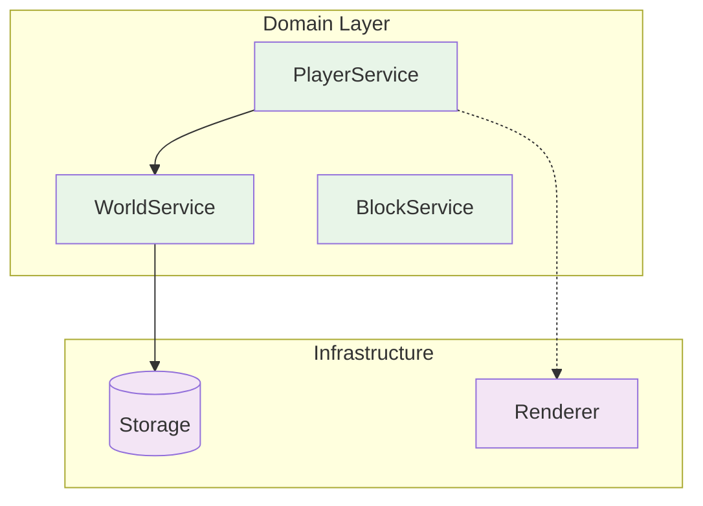

# Domain Layer Design Principles

## 🧭 ナビゲーション

> **📍 現在位置**: Explanations → Architecture → **Domain Layer Design Principles**
> **🎯 目標**: ドメイン層のアーキテクチャ設計思想の理解
> **🔗 API仕様**: [Domain APIs Reference](../../reference/api/domain-apis.md)

## 🏗️ 設計哲学とアプローチ

### アーキテクチャ決定記録 (ADR)

#### ADR-001: Effect-TS採用による関数型アプローチ

**決定**: ドメインサービスにEffect-TSパターンを全面採用

**理由**:

- 副作用の明示的管理により予測可能なコード
- 型安全なエラーハンドリング
- 依存性注入によるテスタビリティ向上
- 並行処理の安全な制御

**影響**:

```typescript
// ✅ 採用パターン - Effect-TS統合
const worldService = yield * WorldService
const result = yield * worldService.loadChunk(coordinate)

// ❌ 非採用パターン - 従来のPromise/async
const result = await worldService.loadChunk(coordinate)
```

#### ADR-002: Schema駆動開発による型安全性

**決定**: 全てのAPI境界でSchemaバリデーションを実装

**理由**:

- 実行時型安全性の保証
- API契約の明確化
- 自動的なデータ変換
- デバッグ効率の向上

**影響**:

```typescript
// API境界での必須パターン
export const CreatePlayerParams = Schema.Struct({
  name: Schema.String.pipe(Schema.minLength(1), Schema.maxLength(16)),
  position: PositionSchema,
})
```

#### ADR-003: Brand型による意味論的型安全性

**決定**: IDやドメイン概念にBrand型を活用

**理由**:

- 異なる種類のIDの誤用防止
- ドメイン概念の明確化
- リファクタリング時の安全性

```typescript
export type PlayerId = string & Brand.Brand<"PlayerId">
export type ChunkId = string & Brand.Brand<"ChunkId">

// ✅ 型安全 - 異なるIDの誤用を防止
const movePlayer = (playerId: PlayerId, chunkId: ChunkId) => { ... }
```

## 🎮 ドメインサービス設計パターン

### サービス責任分離の原則

#### WorldService責任境界

- **含む**: チャンク管理、ワールド生成、ブロック操作
- **含まない**: プレイヤー操作、UI表示、ネットワーク通信

#### PlayerService責任境界

- **含む**: プレイヤー状態、移動、インベントリ
- **含まない**: ワールド変更、レンダリング、入力処理

### 依存関係設計パターン



**設計原則**:

- ドメインサービス同士は疎結合
- インフラストラクチャへの依存は最小限
- サービス間通信は明示的なインターフェース経由

## 🔄 エラーハンドリング戦略

### エラー型設計アプローチ

**階層化エラー設計**:

```typescript
// ドメイン固有エラー
export class PlayerError extends Schema.TaggedError<PlayerError>()('PlayerError', {
  cause: Schema.Literal('NotFound', 'InvalidMovement', 'InsufficientHealth'),
  playerId: PlayerId,
  context: Schema.optional(Schema.Unknown),
}) {}

// システムエラー
export class SystemError extends Schema.TaggedError<SystemError>()('SystemError', {
  cause: Schema.Literal('NetworkFailure', 'StorageError', 'MemoryExhausted'),
  originalError: Schema.Unknown,
}) {}
```

### 回復可能性による分類

1. **回復可能エラー**: リトライ、代替手段提供
2. **ユーザーエラー**: 明確なメッセージで対処方法提示
3. **システムエラー**: ログ記録、グレースフルデグラデーション

## 🎯 パフォーマンス設計思想

### 頻度別API設計戦略

#### 高頻度API (60FPS)

- **最小割り当て**: オブジェクト生成の最小化
- **キャッシュ活用**: 計算結果の再利用
- **非同期最適化**: Effect.genによる効率的な制御フロー

#### 中頻度API (1-10Hz)

- **バッチ処理**: 複数操作の一括実行
- **レイジーローディング**: 必要時読み込み

#### 低頻度API (イベント駆動)

- **完全性重視**: データ整合性の確保
- **詳細ログ**: デバッグ情報の充実

### メモリ管理戦略

```typescript
// リソース自動管理パターン
const processChunk = Effect.acquireUseRelease(
  // 取得
  Effect.sync(() => acquireChunkBuffer()),
  // 使用
  (buffer) => processChunkData(buffer),
  // 解放
  (buffer) => Effect.sync(() => releaseChunkBuffer(buffer))
)
```

## 🧪 テスタビリティ設計

### モック化戦略

**Layer-based依存性注入**:

```typescript
// 本番環境
export const WorldServiceLive = Layer.effect(WorldService, makeWorldService)

// テスト環境
export const WorldServiceTest = Layer.succeed(WorldService, mockWorldService)

// 使用時
const program = Effect.provide(gameLogic, WorldServiceLive) // or WorldServiceTest
```

### 契約テストパターン

各サービスインターフェースに対する契約テスト実装:

- 正常系の動作確認
- エラーケースの適切な処理
- パフォーマンス特性の検証

## 📊 進化性とスケーラビリティ

### 拡張ポイント設計

1. **サービス分割**: 責任が複雑化した際の分割戦略
2. **プロトコル拡張**: APIバージョニング戦略
3. **データモデル進化**: Schemaを活用したマイグレーション

### マルチプレイヤー対応設計

- **状態同期**: プレイヤー間の状態一貫性
- **競合解決**: 同時操作の調停機能
- **ネットワーク最適化**: 帯域幅効率的な通信

## 🔗 関連リソース

### API仕様参照

- **[Domain APIs Complete Reference](../../reference/api/domain-apis.md)** - 完全API仕様
- **[Core APIs](../../reference/api/core-apis.md)** - Effect-TS基盤API
- **[Game Systems](../../reference/game-systems/README.md)** - ゲームシステム仕様

### 実装ガイド

- **[Service Implementation Tutorial](../../tutorials/basic-game-development/application-services.md)** - 実装チュートリアル
- **[Testing Patterns](../../how-to/testing/effect-ts-testing-patterns.md)** - テスト実装パターン

---

_このドキュメントは設計思想と判断基準を説明します。具体的なAPI仕様は[Domain APIs Reference](../../reference/api/domain-apis.md)をご参照ください。_
