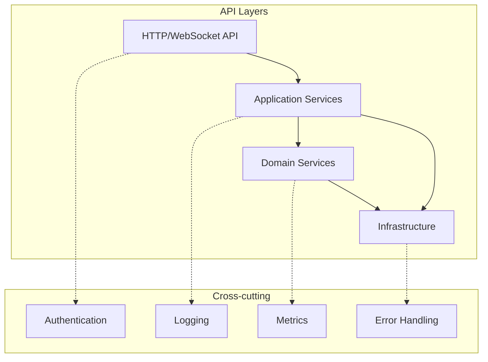

  topics: ["architecture", "ddd", "ecs", "effect-ts", "game-development", "enterprise-design"]
  skill_level: "advanced"
  implementation_time: 120
  confidence_score: 0.98
  use_cases: ["game-development", "enterprise-systems", "scalable-architecture", "real-time-systems"]
  architectural_complexity: "high"
---

# API設計概要

TypeScript MinecraftにおけるAPI設計の全体像と設計方針。

## 目次

1. [設計方針](#設計方針)
2. [アーキテクチャレイヤー](#アーキテクチャレイヤー)
3. [API分類](#api分類)
4. [Effect-TS統合パターン](#effect-ts統合パターン)
5. [セキュリティ方針](#セキュリティ方針)
6. [API一覧](#api一覧)

## 設計方針

### 1. 関数型ファースト設計

```typescript
import { Effect, Schema } from "effect"

// すべてのAPIはEffect型で統一
export interface GameAPI {
  readonly getPlayer: (id: PlayerId) => Effect.Effect<Player, PlayerError>
  readonly updateWorld: (update: WorldUpdate) => Effect.Effect<World, WorldError>
  readonly processInput: (input: PlayerInput) => Effect.Effect<void, InputError>
}
```

### 2. 型安全性とスキーマ駆動

```typescript
// スキーマから自動でAPI型を生成
export const CreatePlayerRequest = Schema.Struct({
  name: Schema.String.pipe(
    Schema.minLength(1),
    Schema.maxLength(16),
    Schema.pattern(/^[a-zA-Z0-9_]+$/)
  ),
  gameMode: Schema.Literal("survival", "creative", "adventure", "spectator")
})

export const CreatePlayerResponse = Schema.Struct({
  player: PlayerSchema,
  world: WorldSchema,
  token: Schema.String
})

// 自動生成される型
export interface CreatePlayerAPI {
  (request: Schema.Schema.Type<typeof CreatePlayerRequest>):
    Effect.Effect<
      Schema.Schema.Type<typeof CreatePlayerResponse>,
      ValidationError | DatabaseError
    >
}
```

### 3. エラー境界とレジリエンス

```typescript
// タグ付きエラー型
export const PlayerNotFoundError = Schema.TaggedError("PlayerNotFoundError")({
  playerId: Schema.String,
  timestamp: Schema.Date
})

export const WorldCorruptedError = Schema.TaggedError("WorldCorruptedError")({
  worldId: Schema.String,
  corruption: Schema.String
})

// エラー境界での処理
export const safePlayerOperation = (operation: Effect.Effect<Player, PlayerError>) =>
  pipe(
    operation,
    Effect.catchTag("PlayerNotFoundError", () =>
      Effect.succeed(DefaultPlayer)
    ),
    Effect.retry(Schedule.exponential(Duration.millis(100))),
    Effect.timeout(Duration.seconds(5))
  )
```

## アーキテクチャレイヤー

### レイヤー構成



### 1. HTTP/WebSocket層

```typescript
export const HttpApiLayer = Layer.effectContext(
  Tag<HttpApiService>,
  Effect.gen(function* () {
    const app = yield* ApplicationService

    return {
      // RESTful エンドポイント
      routes: {
        "GET /api/players/:id": (playerId: string) =>
          pipe(
            PlayerId(playerId),
            app.getPlayer,
            Effect.map(player => ({ success: true, data: player })),
            Effect.catchAll(error =>
              Effect.succeed({ success: false, error: error.message })
            )
          ),

        "POST /api/players": (request: CreatePlayerRequest) =>
          pipe(
            Schema.decode(CreatePlayerRequest)(request),
            Effect.flatMap(app.createPlayer),
            Effect.map(response => ({ success: true, data: response }))
          )
      },

      // WebSocket ハンドラー
      websocket: {
        onConnect: (socket: WebSocket) =>
          pipe(
            AuthService.authenticate(socket),
            Effect.flatMap(player =>
              GameSession.create(player, socket)
            ),
            Effect.tap(() =>
              Logger.info(`Player connected: ${player.id}`)
            )
          ),

        onMessage: (socket: WebSocket, message: GameMessage) =>
          pipe(
            GameSession.getBySocket(socket),
            Effect.flatMap(session =>
              session.handleMessage(message)
            )
          )
      }
    }
  })
)
```

### 2. Application層

```typescript
export const ApplicationLayer = Layer.effectContext(
  Tag<ApplicationService>,
  Effect.gen(function* () {
    const domain = yield* DomainService
    const repo = yield* Repository

    return {
      // ユースケース実装
      createPlayer: (request: CreatePlayerRequest) =>
        Effect.gen(function* () {
          // バリデーション
          const validated = yield* Schema.decode(CreatePlayerRequest)(request)

          // ドメインロジック実行
          const player = yield* domain.createPlayer(validated)

          // 永続化
          yield* repo.savePlayer(player)

          // イベント発行
          yield* EventBus.publish(
            PlayerCreatedEvent({ player, timestamp: new Date() })
          )

          return { player, token: yield* AuthService.generateToken(player) }
        }),

      // クエリハンドラー
      getPlayer: (playerId: PlayerId) =>
        pipe(
          repo.getPlayer(playerId),
          Effect.catchTag("PlayerNotFoundError", () =>
            Effect.fail(new PlayerNotFoundError({ playerId }))
          )
        )
    }
  })
)
```

### 3. Domain層

```typescript
export const DomainLayer = Layer.effectContext(
  Tag<DomainService>,
  Effect.gen(function* () {
    return {
      // 純粋なビジネスロジック
      createPlayer: (data: CreatePlayerData) =>
        Effect.gen(function* () {
          // ドメイン検証
          yield* validatePlayerName(data.name)
          yield* validateGameMode(data.gameMode)

          // ドメインオブジェクト生成
          const player = Player.create({
            id: yield* Effect.sync(() => PlayerId(crypto.randomUUID())),
            name: data.name,
            gameMode: data.gameMode,
            position: Vector3.zero(),
            health: 20,
            createdAt: new Date()
          })

          return player
        }),

      // ドメインルール
      canPlaceBlock: (player: Player, position: BlockPosition, blockType: BlockType) =>
        Effect.gen(function* () {
          // 距離チェック
          const distance = Vector3.distance(player.position, position.world)
          if (distance > MAX_INTERACTION_DISTANCE) {
            yield* Effect.fail(new OutOfRangeError({ distance, max: MAX_INTERACTION_DISTANCE }))
          }

          // 権限チェック
          const hasPermission = yield* PermissionService.check(player, "block.place")
          if (!hasPermission) {
            yield* Effect.fail(new NoPermissionError({ playerId: player.id, action: "block.place" }))
          }

          return true
        })
    }
  })
)
```

## API分類

### 1. コマンドAPI（変更操作）

| エンドポイント | メソッド | 説明 | レスポンス |
|----------------|----------|------|------------|
| `/api/players` | POST | プレイヤー作成 | PlayerResponse |
| `/api/worlds` | POST | ワールド作成 | WorldResponse |
| `/api/blocks` | PUT | ブロック配置 | BlockPlacementResponse |
| `/api/inventory/move` | POST | アイテム移動 | InventoryResponse |

### 2. クエリAPI（参照操作）

| エンドポイント | メソッド | 説明 | レスポンス |
|----------------|----------|------|------------|
| `/api/players/:id` | GET | プレイヤー情報取得 | Player |
| `/api/worlds/:id/chunks` | GET | チャンク一覧取得 | ChunkList |
| `/api/leaderboard` | GET | ランキング取得 | LeaderboardResponse |

### 3. WebSocket API（リアルタイム）

```typescript
// WebSocketメッセージタイプ
export const WebSocketMessage = Schema.Union(
  // プレイヤーアクション
  Schema.Struct({
    type: Schema.Literal("player_move"),
    data: Schema.Struct({
      position: Vector3Schema,
      rotation: RotationSchema
    })
  }),

  // ブロック操作
  Schema.Struct({
    type: Schema.Literal("block_place"),
    data: Schema.Struct({
      position: BlockPositionSchema,
      blockType: Schema.String
    })
  }),

  // チャットメッセージ
  Schema.Struct({
    type: Schema.Literal("chat_message"),
    data: Schema.Struct({
      message: Schema.String,
      recipients: Schema.optional(Schema.Array(Schema.String))
    })
  })
)
```

## Effect-TS統合パターン

### 1. Context/Layer活用

```typescript
// サービス依存関係の定義
interface PlayerServiceInterface {
  readonly create: (data: CreatePlayerData) => Effect.Effect<Player, PlayerError>
  readonly get: (id: PlayerId) => Effect.Effect<Player, PlayerError>
  readonly update: (id: PlayerId, updates: PlayerUpdate) => Effect.Effect<Player, PlayerError>
}

export const PlayerService = Context.GenericTag<PlayerServiceInterface>("PlayerService")

// レイヤー構成
export const AppLayer = Layer.mergeAll(
  DatabaseLayer,
  CacheLayer,
  AuthLayer,
  PlayerServiceLive,
  WorldServiceLive,
  InventoryServiceLive
)

// アプリケーション起動
export const runApp = pipe(
  HttpServer.start(),
  Effect.provide(AppLayer),
  Effect.tap(() => Logger.info("Application started")),
  Effect.catchAllCause(cause =>
    Logger.error("Application failed to start", { cause })
  )
)
```

### 2. Schema統合

```typescript
// APIスキーマ自動生成
export const generateOpenAPI = (routes: ApiRoutes) =>
  Effect.gen(function* () {
    const schemas = Object.values(routes).map(route => ({
      path: route.path,
      method: route.method,
      requestSchema: route.requestSchema,
      responseSchema: route.responseSchema
    }))

    return OpenAPIGenerator.generate(schemas)
  })

// ランタイム検証
export const withValidation = <I, O>(
  handler: (input: I) => Effect.Effect<O>,
  inputSchema: Schema.Schema<I>,
  outputSchema: Schema.Schema<O>
) =>
  (rawInput: unknown) =>
    pipe(
      Schema.decode(inputSchema)(rawInput),
      Effect.flatMap(handler),
      Effect.flatMap(output => Schema.encode(outputSchema)(output))
    )
```

## セキュリティ方針

### 1. 認証・認可

```typescript
// JWT認証
export const JWTAuth = Layer.effectContext(
  Tag<AuthService>,
  Effect.gen(function* () {
    const config = yield* ConfigService

    return {
      authenticate: (token: string) =>
        pipe(
          JWT.verify(token, config.jwtSecret),
          Effect.flatMap(payload =>
            PlayerService.get(PlayerId(payload.playerId))
          ),
          Effect.catchTag("JWTError", () =>
            Effect.fail(new UnauthorizedError())
          )
        ),

      authorize: (player: Player, permission: Permission) =>
        pipe(
          PermissionService.check(player.id, permission),
          Effect.filterOrFail(
            hasPermission => hasPermission,
            () => new ForbiddenError({ permission })
          )
        )
    }
  })
)
```

### 2. レート制限

```typescript
export const RateLimiter = Layer.effectContext(
  Tag<RateLimiterService>,
  Effect.gen(function* () {
    const redis = yield* RedisService

    return {
      checkLimit: (key: string, limit: number, window: Duration) =>
        pipe(
          redis.incr(`rate_limit:${key}`),
          Effect.tap(count =>
            count === 1
              ? redis.expire(`rate_limit:${key}`, window.seconds)
              : Effect.void
          ),
          Effect.flatMap(count =>
            count > limit
              ? Effect.fail(new RateLimitExceededError({ key, limit, count }))
              : Effect.succeed(count)
          )
        )
    }
  })
)
```

## API一覧

### ドメイン・アプリケーション API
- **ファイル**: `00-domain-application-apis.md`
- **内容**: ドメインサービスとアプリケーションサービスの詳細API仕様

### インフラストラクチャ API
- **ファイル**: `01-infrastructure-apis.md`
- **内容**: 永続化、外部システム統合、ネットワーク通信API

### イベントバス仕様
- **ファイル**: `02-event-bus-specification.md`
- **内容**: イベント駆動アーキテクチャとパブリッシュ/サブスクライブ

### HTTP/WebSocket API
- **ファイル**: `03-http-api-specification.md`
- **内容**: RESTful API、WebSocket、認証・認可

### 統合ガイド
- **ファイル**: `README.md`
- **内容**: 全API仕様の統合ガイドと使用方法

このオーバービューは、TypeScript MinecraftのAPI設計の全体像を提供します。各レイヤーの詳細実装については、専門ドキュメントを参照してください。