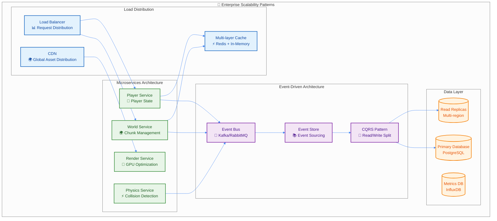
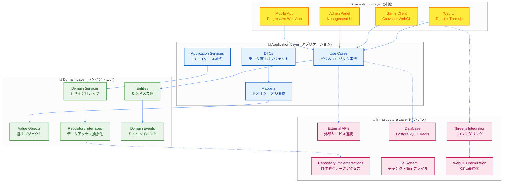

# 🏗️ スケーラブルアーキテクチャ設計

## 🎯 設計哲学

### Netflix・Spotify級スケーラビリティの実現

このドキュメントでは、数億ユーザーを支える現代的なWebサービスと同等の設計原則を、TypeScript Minecraft Clone開発に適用する方法を解説します。



### 設計原則の階層化

```typescript
// 企業レベルの設計原則をEffect-TSで実装
interface EnterpriseArchitecturePrinciples {
  // 1. 単一責任原則 (Single Responsibility)
  readonly singleResponsibility: "各サービスは一つの明確な責務のみを持つ"

  // 2. 開放閉鎖原則 (Open/Closed)
  readonly openClosed: "拡張に対して開いており、変更に対して閉じている"

  // 3. 依存性逆転原則 (Dependency Inversion)
  readonly dependencyInversion: "抽象に依存し、具象に依存しない"

  // 4. 界面分離原則 (Interface Segregation)
  readonly interfaceSegregation: "クライアントが使用しないインターフェースに依存しない"

  // 5. 関心の分離 (Separation of Concerns)
  readonly separationOfConcerns: "異なる関心事は異なるモジュールで処理"

  // 6. 無故障設計 (Fault Tolerance)
  readonly faultTolerance: "部分的な障害が全体に影響しない設計"

  // 7. 可観測性 (Observability)
  readonly observability: "システムの状態が常に監視・デバッグ可能"
}
```

---

## 🏛️ レイヤードアーキテクチャ

### Clean Architecture + Hexagonal Architecture



### ドメインドリブン設計 (DDD) の実装

```typescript
// Domain Layer: 純粋なビジネスロジック
export namespace Domain {
  // Entity: アイデンティティを持つオブジェクト
  export const Player = Schema.Struct({
    id: Schema.String.pipe(Schema.brand("PlayerId")),
    name: Schema.String.pipe(Schema.minLength(1), Schema.maxLength(16)),
    position: Position,
    health: Schema.Number.pipe(Schema.between(0, 20), Schema.brand("Health")),
    gameMode: Schema.Literal("survival", "creative", "adventure", "spectator"),
    experience: Schema.Number.pipe(Schema.nonNegative(), Schema.brand("Experience")),
    // ビジネスルール: プレイヤーは常に有効な状態を保つ
    lastActivity: Schema.Date
  })

  // Value Object: アイデンティティを持たないオブジェクト
  export const Position = Schema.Struct({
    x: Schema.Number.pipe(Schema.between(-30_000_000, 30_000_000)),
    y: Schema.Number.pipe(Schema.between(-64, 320)),
    z: Schema.Number.pipe(Schema.between(-30_000_000, 30_000_000))
  })

  // Domain Service: 複数のEntityにまたがるビジネスロジック
  export interface PlayerDomainService {
    readonly canPlayerPlaceBlock: (
      player: Player,
      position: Position,
      blockType: BlockType
    ) => Effect.Effect<boolean, ValidationError, WorldRepository>

    readonly calculatePlayerReachDistance: (
      player: Player
    ) => Effect.Effect<number, never, never>

    readonly validatePlayerMovement: (
      from: Position,
      to: Position,
      playerMode: GameMode
    ) => Effect.Effect<boolean, MovementValidationError, never>
  }

  // Domain Events: ビジネス上の重要な出来事
  export const PlayerCreatedEvent = Schema.Struct({
    _tag: Schema.Literal("PlayerCreatedEvent"),
    playerId: Schema.String.pipe(Schema.brand("PlayerId")),
    timestamp: Schema.Date,
    initialPosition: Position,
    gameMode: Schema.Literal("survival", "creative", "adventure", "spectator")
  })

  export const BlockPlacedEvent = Schema.Struct({
    _tag: Schema.Literal("BlockPlacedEvent"),
    playerId: Schema.String.pipe(Schema.brand("PlayerId")),
    position: Position,
    blockType: BlockType,
    timestamp: Schema.Date
  })

  // Repository Interface: データアクセス抽象化
  export interface PlayerRepository {
    readonly save: (player: Player) => Effect.Effect<void, SaveError, never>
    readonly findById: (id: PlayerId) => Effect.Effect<Player, PlayerNotFoundError, never>
    readonly findByName: (name: string) => Effect.Effect<Player, PlayerNotFoundError, never>
    readonly delete: (id: PlayerId) => Effect.Effect<void, DeleteError, never>
  }
}

// Application Layer: ユースケースの実行
export namespace Application {
  // Use Case: 具体的なビジネス要求の実現
  export interface CreatePlayerUseCase {
    readonly execute: (command: CreatePlayerCommand) => Effect.Effect<Player, CreatePlayerError, PlayerService | WorldService>
  }

  export const makeCreatePlayerUseCase = (
    playerRepo: Domain.PlayerRepository,
    eventPublisher: EventPublisher,
    worldService: WorldService
  ): CreatePlayerUseCase => ({
    execute: (command: CreatePlayerCommand) =>
      Effect.gen(function* () {
        // 1. ビジネスルール検証
        const existingPlayer = yield* playerRepo.findByName(command.name).pipe(
          Effect.catchTag("PlayerNotFoundError", () => Effect.succeed(null))
        )

        if (existingPlayer) {
          return yield* Effect.fail({
            _tag: "PlayerAlreadyExistsError" as const,
            name: command.name
          })
        }

        // 2. ドメインオブジェクト作成
        const spawnPosition = yield* worldService.findSafeSpawnPosition()
        const player = Schema.make(Domain.Player)({
          id: crypto.randomUUID() as PlayerId,
          name: command.name,
          position: spawnPosition,
          health: 20 as Health,
          gameMode: command.gameMode ?? "survival",
          experience: 0 as Experience,
          lastActivity: new Date()
        })

        // 3. 永続化
        yield* playerRepo.save(player)

        // 4. イベント発行
        yield* eventPublisher.publish(
          Schema.make(Domain.PlayerCreatedEvent)({
            _tag: "PlayerCreatedEvent",
            playerId: player.id,
            timestamp: new Date(),
            initialPosition: player.position,
            gameMode: player.gameMode
          })
        )

        return player
      })
  })

  // Application Service: 複数ユースケースの調整
  export interface PlayerApplicationService {
    readonly createPlayer: (command: CreatePlayerCommand) => Effect.Effect<PlayerDTO, CreatePlayerError, Dependencies>
    readonly movePlayer: (command: MovePlayerCommand) => Effect.Effect<PlayerDTO, MovePlayerError, Dependencies>
    readonly updatePlayerHealth: (command: UpdateHealthCommand) => Effect.Effect<PlayerDTO, UpdateHealthError, Dependencies>
  }
}
```

---

## 🚀 マイクロサービス設計パターン

### サービス分割戦略

```typescript
// サービス境界の明確な定義
export namespace Services {
  // World Service: ワールド状態管理に特化
  export interface WorldService {
    readonly name: "WorldService"
    readonly responsibilities: [
      "チャンク生成・管理",
      "ブロック配置・破壊",
      "地形生成",
      "ワールド永続化"
    ]
    readonly dependencies: ["FileSystemService", "CacheService"]
    readonly apis: {
      readonly getChunk: (coord: ChunkCoordinate) => Effect.Effect<Chunk, ChunkError, ChunkRepository>
      readonly generateTerrain: (coord: ChunkCoordinate) => Effect.Effect<Chunk, GenerationError, TerrainGenerator>
      readonly saveWorld: () => Effect.Effect<void, SaveError, FileSystemService>
    }
    readonly events: ["ChunkLoaded", "ChunkUnloaded", "BlockChanged", "TerrainGenerated"]
    readonly metrics: ["chunksLoaded", "blocksPlaced", "generationTime", "memoryUsage"]
  }

  // Player Service: プレイヤー状態管理に特化
  export interface PlayerService {
    readonly name: "PlayerService"
    readonly responsibilities: [
      "プレイヤー状態管理",
      "移動・物理計算",
      "インベントリ管理",
      "権限管理"
    ]
    readonly dependencies: ["WorldService", "PhysicsService", "AuthenticationService"]
    readonly apis: {
      readonly createPlayer: (id: PlayerId) => Effect.Effect<Player, PlayerCreationError, PlayerRepository>
      readonly movePlayer: (id: PlayerId, movement: Movement) => Effect.Effect<Player, MovementError, PhysicsService>
      readonly updateInventory: (id: PlayerId, changes: InventoryChanges) => Effect.Effect<Inventory, InventoryError, InventoryService>
    }
    readonly events: ["PlayerJoined", "PlayerLeft", "PlayerMoved", "PlayerInventoryChanged"]
    readonly metrics: ["activePlayers", "movementsPerSecond", "inventoryOperations"]
  }

  // Physics Service: 物理計算に特化
  export interface PhysicsService {
    readonly name: "PhysicsService"
    readonly responsibilities: [
      "衝突検出",
      "物理シミュレーション",
      "レイキャスト",
      "パフォーマンス最適化"
    ]
    readonly dependencies: ["WorldService"]
    readonly apis: {
      readonly stepSimulation: (deltaTime: number) => Effect.Effect<void, PhysicsError, never>
      readonly checkCollision: (body: PhysicsBody, movement: Vector3) => Effect.Effect<CollisionResult, CollisionError, never>
      readonly raycast: (origin: Vector3, direction: Vector3, maxDistance: number) => Effect.Effect<RaycastResult[], RaycastError, never>
    }
    readonly events: ["CollisionDetected", "ObjectMoved", "ForceApplied"]
    readonly metrics: ["collisionChecks", "simulationTime", "objectCount"]
  }

  // Rendering Service: レンダリングに特化
  export interface RenderingService {
    readonly name: "RenderingService"
    readonly responsibilities: [
      "3Dレンダリング",
      "メッシュ管理",
      "テクスチャ管理",
      "GPU最適化"
    ]
    readonly dependencies: ["WorldService", "PlayerService"]
    readonly apis: {
      readonly render: (scene: Scene) => Effect.Effect<void, RenderError, never>
      readonly createMesh: (chunk: Chunk) => Effect.Effect<Mesh, MeshCreationError, never>
      readonly updateCamera: (player: Player) => Effect.Effect<void, CameraError, never>
    }
    readonly events: ["FrameRendered", "MeshCreated", "MeshDestroyed", "TextureLoaded"]
    readonly metrics: ["fps", "drawCalls", "triangles", "textureMemory"]
  }
}

// Service Communication Patterns
export namespace Communication {
  // Event-Driven Communication: 非同期・疎結合
  export interface EventBus {
    readonly publish: <E extends DomainEvent>(event: E) => Effect.Effect<void, PublishError, never>
    readonly subscribe: <E extends DomainEvent>(
      eventType: E["_tag"],
      handler: (event: E) => Effect.Effect<void, HandlerError, never>
    ) => Effect.Effect<Subscription, SubscriptionError, never>
  }

  // Request-Response Pattern: 同期・強結合
  export interface ServiceMesh {
    readonly call: <Req, Res>(
      service: ServiceName,
      method: string,
      request: Req
    ) => Effect.Effect<Res, ServiceCallError, never>
  }

  // Saga Pattern: 分散トランザクション
  export interface SagaOrchestrator {
    readonly executeTransaction: <T>(
      saga: SagaDefinition<T>
    ) => Effect.Effect<T, SagaError, never>

    readonly compensate: <T>(
      sagaId: SagaId,
      compensationActions: CompensationAction[]
    ) => Effect.Effect<void, CompensationError, never>
  }
}
```

### サービス間通信の実装

```typescript
// Circuit Breaker Pattern: 障害時の自動復旧
export interface CircuitBreakerConfig {
  readonly failureThreshold: number
  readonly recoveryTimeout: Duration
  readonly requestTimeout: Duration
}

export interface CircuitBreaker<A, E> {
  readonly execute: <R>(
    operation: Effect.Effect<A, E, R>
  ) => Effect.Effect<A, E | CircuitBreakerError, R>
}

export const makeCircuitBreaker = <A, E>(
  config: CircuitBreakerConfig
): Effect.Effect<CircuitBreaker<A, E>, never, never> =>
  Effect.gen(function* () {
    const state = yield* Ref.make<CircuitBreakerState>("Closed")
    const failureCount = yield* Ref.make(0)
    const lastFailureTime = yield* Ref.make<Option.Option<Date>>(Option.none())

    const recordFailure = Ref.update(failureCount, (n) => n + 1).pipe(
      Effect.zipLeft(Ref.set(lastFailureTime, Option.some(new Date()))),
      Effect.flatMap(() =>
        Ref.get(failureCount).pipe(
          Effect.flatMap((count) =>
            count >= config.failureThreshold
              ? Ref.set(state, "Open")
              : Effect.void
          )
        )
      )
    )

    const recordSuccess = Effect.all([
      Ref.set(failureCount, 0),
      Ref.set(state, "Closed")
    ])

    const executeInClosedState = <R>(
      operation: Effect.Effect<A, E, R>
    ): Effect.Effect<A, E | CircuitBreakerError, R> =>
      operation.pipe(
        Effect.timeout(config.requestTimeout),
        Effect.tapError(() => recordFailure),
        Effect.tapSuccess(() => recordSuccess)
      )

    const execute = <R>(
      operation: Effect.Effect<A, E, R>
    ): Effect.Effect<A, E | CircuitBreakerError, R> =>
      Effect.gen(function* () {
        const currentState = yield* Ref.get(state)

        return yield* Match.value(currentState).pipe(
          Match.tag("Closed", () => executeInClosedState(operation)),
          Match.tag("Open", () => Effect.fail({ _tag: "CircuitBreakerOpenError" as const })),
          Match.tag("HalfOpen", () => executeInClosedState(operation)),
          Match.exhaustive
        )
      })

    return { execute }
  })

// Retry with Exponential Backoff
export const retryWithBackoff = <A, E, R>(
  operation: Effect.Effect<A, E, R>,
  config: {
    readonly maxRetries: number
    readonly initialDelay: Duration
    readonly maxDelay: Duration
    readonly backoffFactor: number
  }
): Effect.Effect<A, E, R> =>
  operation.pipe(
    Effect.retry(
      Schedule.exponential(config.initialDelay, config.backoffFactor).pipe(
        Schedule.either(Schedule.recurs(config.maxRetries)),
        Schedule.whileOutput(delay => delay <= config.maxDelay)
      )
    )
  )

// Service Discovery Pattern
export interface ServiceRegistry {
  readonly register: (
    service: ServiceDefinition
  ) => Effect.Effect<void, RegistrationError, never>

  readonly discover: (
    serviceName: string
  ) => Effect.Effect<ServiceInstance[], DiscoveryError, never>

  readonly healthCheck: (
    instance: ServiceInstance
  ) => Effect.Effect<HealthStatus, HealthCheckError, never>
}
```

---

## 📊 可観測性・モニタリング

### 包括的な監視システム

```typescript
// Observability Stack
export namespace Observability {
  // Metrics: 定量的なシステム指標
  export interface MetricsCollector {
    readonly recordCounter: (name: string, value: number, tags?: Record<string, string>) => Effect.Effect<void, never, never>
    readonly recordGauge: (name: string, value: number, tags?: Record<string, string>) => Effect.Effect<void, never, never>
    readonly recordHistogram: (name: string, value: number, tags?: Record<string, string>) => Effect.Effect<void, never, never>
    readonly recordTimer: <A, E, R>(name: string, operation: Effect.Effect<A, E, R>) => Effect.Effect<A, E, R>
  }

  // Tracing: リクエストの流れを追跡
  export interface DistributedTracing {
    readonly startSpan: (name: string, parent?: SpanContext) => Effect.Effect<Span, never, never>
    readonly finishSpan: (span: Span) => Effect.Effect<void, never, never>
    readonly addAnnotation: (span: Span, key: string, value: unknown) => Effect.Effect<void, never, never>
    readonly withSpan: <A, E, R>(name: string, operation: Effect.Effect<A, E, R>) => Effect.Effect<A, E, R>
  }

  // Logging: 構造化されたログ出力
  export interface StructuredLogger {
    readonly info: (message: string, context?: LogContext) => Effect.Effect<void, never, never>
    readonly warn: (message: string, context?: LogContext) => Effect.Effect<void, never, never>
    readonly error: (message: string, error?: unknown, context?: LogContext) => Effect.Effect<void, never, never>
    readonly debug: (message: string, context?: LogContext) => Effect.Effect<void, never, never>
  }

  // Health Checks: サービスの健全性監視
  export interface HealthCheckSystem {
    readonly registerCheck: (name: string, check: HealthCheck) => Effect.Effect<void, never, never>
    readonly runChecks: () => Effect.Effect<HealthCheckResults, never, never>
    readonly getOverallHealth: () => Effect.Effect<HealthStatus, never, never>
  }
}

// 実装例: 包括的な監視付きサービス
export interface ObservableWorldService extends WorldService {
  readonly getChunk: (coord: ChunkCoordinate) => Effect.Effect<Chunk, ChunkError, ChunkRepository>
  readonly healthCheck: () => Effect.Effect<HealthStatus, never, never>
}

export const makeObservableWorldService = (
  worldRepo: WorldRepository,
  metrics: MetricsCollector,
  tracer: DistributedTracing,
  logger: StructuredLogger
): ObservableWorldService => ({
  getChunk: (coord: ChunkCoordinate) =>
    Effect.gen(function* () {
      // トレーシング開始
      return yield* tracer.withSpan(`world.getChunk`,
        Effect.gen(function* () {
          const startTime = Date.now()

          // ログ記録
          yield* logger.info("Getting chunk", {
            chunkX: coord.x,
            chunkZ: coord.z
          })

          try {
            // 実際の処理
            const chunk = yield* worldRepo.findByCoordinate(coord)

            // メトリクス記録（成功）
            yield* metrics.recordCounter("world.chunk_loads.success", 1, {
              chunkType: chunk.generated ? "generated" : "loaded"
            })

            yield* metrics.recordTimer("world.chunk_load_time",
              Effect.sync(() => Date.now() - startTime)
            )

            yield* logger.info("Chunk loaded successfully", {
              chunkX: coord.x,
              chunkZ: coord.z,
              loadTimeMs: Date.now() - startTime
            })

            return chunk

          } catch (error) {
            // メトリクス記録（失敗）
            yield* metrics.recordCounter("world.chunk_loads.failure", 1, {
              errorType: error._tag
            })

            yield* logger.error("Failed to load chunk", error, {
              chunkX: coord.x,
              chunkZ: coord.z
            })

            return yield* Effect.fail(error)
          }
        })
      )
    }),

  // ヘルスチェック実装
  healthCheck: () =>
    Effect.gen(function* () {
      const memoryUsage = yield* getMemoryUsage()
      const activeChunks = yield* getActiveChunkCount()
      const dbConnection = yield* this.checkDatabaseConnection()

      const isHealthy =
        memoryUsage < MEMORY_THRESHOLD &&
        activeChunks < MAX_CHUNKS &&
        dbConnection.status === "connected"

      return {
        status: isHealthy ? "healthy" : "unhealthy",
        checks: {
          memory: { value: memoryUsage, threshold: MEMORY_THRESHOLD },
          chunks: { value: activeChunks, threshold: MAX_CHUNKS },
          database: dbConnection
        },
        timestamp: new Date()
      }
    })
}

// アラート・通知システム
export interface AlertingSystem {
  readonly defineAlert: (alert: AlertDefinition) => Effect.Effect<void, never, never>
  readonly triggerAlert: (alertName: string, severity: AlertSeverity, context: AlertContext) => Effect.Effect<void, never, never>
  readonly resolveAlert: (alertName: string) => Effect.Effect<void, never, never>
}

// SLI/SLO 監視
export interface SLOMonitoring {
  readonly defineSLO: (slo: SLODefinition) => Effect.Effect<void, never, never>
  readonly recordSLI: (sloName: string, success: boolean, latency?: number) => Effect.Effect<void, never, never>
  readonly getSLOStatus: (sloName: string) => Effect.Effect<SLOStatus, never, never>
  readonly generateSLOReport: (timeRange: TimeRange) => Effect.Effect<SLOReport, never, never>
}
```

---

## 🔒 セキュリティ・アーキテクチャ

### ゼロトラスト・セキュリティモデル

```typescript
export namespace Security {
  // Authentication: 認証システム
  export interface AuthenticationService {
    readonly authenticate: (credentials: Credentials) => Effect.Effect<AuthToken, AuthError, never>
    readonly validateToken: (token: AuthToken) => Effect.Effect<UserPrincipal, TokenValidationError, never>
    readonly refreshToken: (refreshToken: RefreshToken) => Effect.Effect<AuthToken, RefreshError, never>
    readonly revokeToken: (token: AuthToken) => Effect.Effect<void, never, never>
  }

  // Authorization: 認可システム
  export interface AuthorizationService {
    readonly authorize: (
      principal: UserPrincipal,
      resource: Resource,
      action: Action
    ) => Effect.Effect<boolean, AuthorizationError, never>

    readonly checkPermission: (
      principal: UserPrincipal,
      permission: Permission
    ) => Effect.Effect<boolean, never, never>
  }

  // Rate Limiting: レート制限
  export interface RateLimitService {
    readonly checkLimit: (
      key: string,
      limit: RateLimit
    ) => Effect.Effect<RateLimitResult, never, never>

    readonly incrementCounter: (key: string) => Effect.Effect<void, never, never>
  }

  // Input Validation: 入力検証
  export interface ValidationService {
    readonly validateInput: <T>(
      input: unknown,
      schema: Schema.Schema<T, unknown>
    ) => Effect.Effect<T, ValidationError, never>

    readonly sanitizeInput: (input: string) => Effect.Effect<string, never, never>
  }
}

// セキュアなサービス実装パターン
export interface SecurePlayerService extends PlayerService {
  readonly movePlayer: (
    authToken: AuthToken,
    playerId: PlayerId,
    movement: MovementInput
  ) => Effect.Effect<Player, PlayerMoveError, never>
}

export const makeSecurePlayerService = (
  playerRepo: PlayerRepository,
  auth: AuthenticationService,
  authz: AuthorizationService,
  rateLimit: RateLimitService,
  validator: ValidationService,
  executePlayerMovement: (playerId: PlayerId, movement: MovementInput) => Effect.Effect<Player, PlayerMoveError, never>
): SecurePlayerService => ({
  movePlayer: (
    authToken: AuthToken,
    playerId: PlayerId,
    movement: MovementInput
  ) =>
    Effect.gen(function* () {
      // 1. 認証
      const principal = yield* auth.validateToken(authToken)

      // 2. レート制限
      const rateLimitResult = yield* rateLimit.checkLimit(
        `player_move:${principal.id}`,
        { requests: 60, window: "1minute" }
      )

      if (rateLimitResult.exceeded) {
        return yield* Effect.fail({
          _tag: "RateLimitExceededError" as const,
          limit: rateLimitResult.limit
        })
      }

      // 3. 認可
      const canMove = yield* authz.authorize(
        principal,
        { type: "player", id: playerId },
        "move"
      )

      if (!canMove) {
        return yield* Effect.fail({
          _tag: "UnauthorizedError" as const,
          action: "move",
          resource: playerId
        })
      }

      // 4. 入力検証
      const validMovement = yield* validator.validateInput(
        movement,
        MovementInputSchema
      )

      // 5. ビジネスロジック実行
      yield* rateLimit.incrementCounter(`player_move:${principal.id}`)
      return yield* executePlayerMovement(playerId, validMovement)
    })
})
```

---

## 🚀 パフォーマンス最適化戦略

### マルチレベル最適化

```typescript
export namespace Performance {
  // CPU最適化
  export interface CPUOptimization {
    readonly enableMultithreading: () => Effect.Effect<void, never, never>
    readonly optimizeAlgorithms: () => Effect.Effect<void, never, never>
    readonly implementCaching: () => Effect.Effect<void, never, never>
    readonly profileHotPaths: () => Effect.Effect<ProfileResult[], never, never>
  }

  // メモリ最適化
  export interface MemoryOptimization {
    readonly implementObjectPooling: () => Effect.Effect<void, never, never>
    readonly optimizeGarbageCollection: () => Effect.Effect<void, never, never>
    readonly reduceMemoryFootprint: () => Effect.Effect<void, never, never>
    readonly monitorMemoryLeaks: () => Effect.Effect<MemoryReport, never, never>
  }

  // GPU最適化
  export interface GPUOptimization {
    readonly optimizeMeshes: () => Effect.Effect<void, never, never>
    readonly implementInstancing: () => Effect.Effect<void, never, never>
    readonly optimizeTextures: () => Effect.Effect<void, never, never>
    readonly implementLevelOfDetail: () => Effect.Effect<void, never, never>
  }

  // ネットワーク最適化
  export interface NetworkOptimization {
    readonly implementCompression: () => Effect.Effect<void, never, never>
    readonly optimizeProtocols: () => Effect.Effect<void, never, never>
    readonly implementCDN: () => Effect.Effect<void, never, never>
    readonly minimizeLatency: () => Effect.Effect<void, never, never>
  }
}

// 自動パフォーマンス最適化システム
export interface AdaptivePerformanceManager {
  readonly optimizeSystem: () => Effect.Effect<OptimizationResult, never, never>
}

export const makeAdaptivePerformanceManager = (
  metrics: MetricsCollector,
  cpuOpt: CPUOptimization,
  memOpt: MemoryOptimization,
  gpuOpt: GPUOptimization,
  netOpt: NetworkOptimization,
  collectMetrics: () => Effect.Effect<PerformanceMetrics, never, never>,
  determineOptimizationStrategy: (metrics: PerformanceMetrics) => OptimizationStrategy,
  optimizeCPU: (strategy: CPUStrategy) => Effect.Effect<void, never, never>,
  optimizeMemory: (strategy: MemoryStrategy) => Effect.Effect<void, never, never>,
  optimizeGPU: (strategy: GPUStrategy) => Effect.Effect<void, never, never>,
  optimizeNetwork: (strategy: NetworkStrategy) => Effect.Effect<void, never, never>,
  calculateImprovements: (before: PerformanceMetrics, after: PerformanceMetrics) => Improvements
): AdaptivePerformanceManager => ({
  optimizeSystem: () =>
    Effect.gen(function* () {
      // パフォーマンス指標収集
      const currentMetrics = yield* collectMetrics()

      // 最適化戦略決定
      const strategy = determineOptimizationStrategy(currentMetrics)

      // 並列最適化実行
      const results = yield* Effect.all([
        optimizeCPU(strategy.cpu),
        optimizeMemory(strategy.memory),
        optimizeGPU(strategy.gpu),
        optimizeNetwork(strategy.network)
      ], { concurrency: 4 })

      // 結果測定
      const improvedMetrics = yield* collectMetrics()

      return {
        before: currentMetrics,
        after: improvedMetrics,
        improvements: calculateImprovements(currentMetrics, improvedMetrics)
      }
    })
})
```

---

## 🎯 まとめ: エンタープライズグレードアーキテクチャ

### 達成される品質特性

```typescript
interface ArchitectureQualityAttributes {
  readonly scalability: {
    readonly horizontalScaling: "マイクロサービスによる水平スケーリング対応"
    readonly verticalScaling: "リソース効率的な垂直スケーリング"
    readonly elasticScaling: "負荷に応じた自動スケーリング"
  }

  readonly reliability: {
    readonly faultTolerance: "部分的障害への耐性"
    readonly gracefulDegradation: "段階的な機能低下"
    readonly automaticRecovery: "自動復旧機能"
  }

  readonly maintainability: {
    readonly modularity: "明確に分離されたモジュール"
    readonly testability: "包括的なテスト可能性"
    readonly evolvability: "将来の拡張・変更への対応"
  }

  readonly security: {
    readonly authentication: "堅牢な認証システム"
    readonly authorization: "細粒度の認可制御"
    readonly dataProtection: "データ保護・暗号化"
  }

  readonly performance: {
    readonly responsiveness: "低レイテンシ・高レスポンス"
    readonly throughput: "高スループット処理"
    readonly resourceEfficiency: "効率的なリソース利用"
  }

  readonly observability: {
    readonly monitoring: "包括的な監視"
    readonly debugging: "効率的なデバッグ支援"
    readonly analytics: "詳細な分析・洞察"
  }
}
```

### 次のステップ

1. **[実装パターン詳細](../design-patterns/service-patterns.md)** - 具体的な実装パターン
2. **[マイクロサービス設計](./microservices-architecture.md)** - サービス分割の詳細
3. **[セキュリティ設計](./security-specification.md)** - セキュリティアーキテクチャ
4. **[パフォーマンス最適化](./performance-guidelines.md)** - 最適化戦略

---

**🚀 企業レベルのスケーラブルアーキテクチャにより、数百万ユーザーに対応可能なMinecraft Cloneの実現が可能になります。**