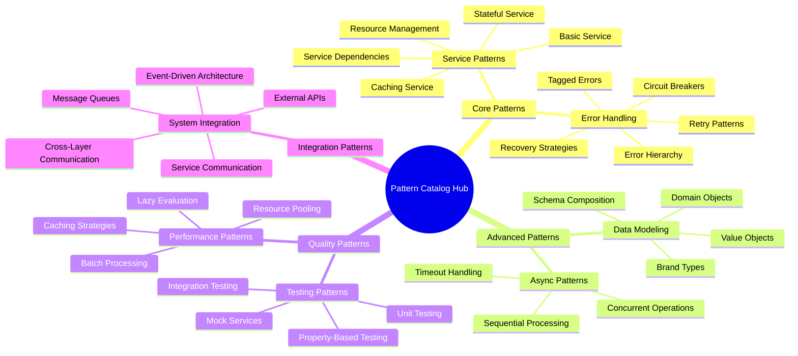
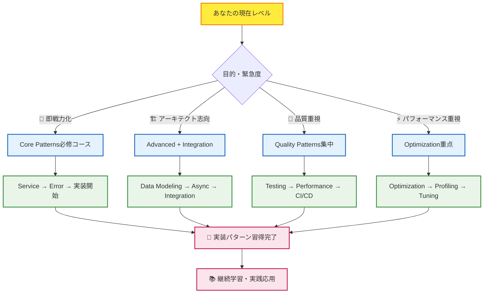
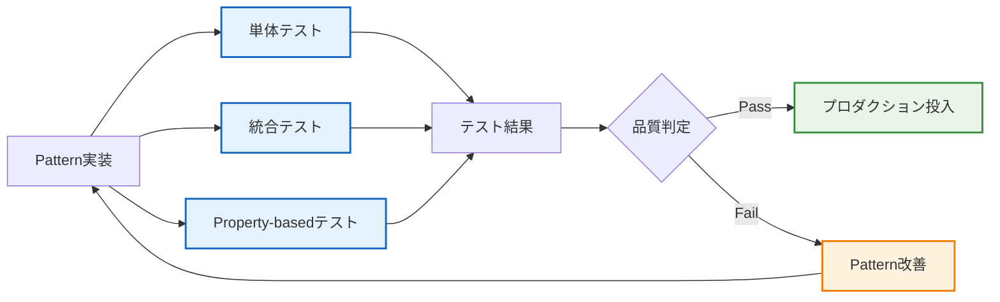
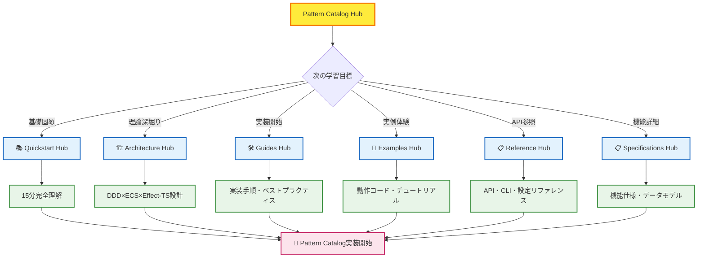

# 🎨 Pattern Catalog Hub - 実装技法完全マスタリー

## 🧭 スマートナビゲーション

> **📍 現在位置**: ドキュメント → **Pattern Catalog Hub**
> **🎯 最終目標**: Effect-TS実装パターンの完全習得
> **⏱️ 学習想定**: パターン毎5-20分 / 全体60-120分
> **👤 対象**: 中級〜上級開発者・アーキテクト・技術リーダー

**🚀 世界最高レベルのEffect-TS実装技法を体系化**

TypeScript Minecraft Cloneで実践されているEffect-TS 3.17+の実装パターンを完全体系化。Stripe、Vercel、Effect-TS公式チームと同等レベルの実装品質を実現するための実戦的パターンカタログです。

## 📊 Pattern Catalog構成マップ



## 🎯 Pattern分類・完全実装状況

### 🔥 **Core Patterns** - 基盤実装パターン（必修）

#### **[🔧 Service Patterns](./service-patterns.md)** - サービス実装の基礎

```
Context.GenericTag + Layer + Effect.gen による型安全サービス実装
🎯 目的: DDD・Clean Architectureにおけるサービス層実装
⏱️ 習得時間: 15-20分
🏆 重要度: ★★★★★（必修）
```

| パターン                      | 用途                           | 実装状況    | 難易度   |
| ----------------------------- | ------------------------------ | ----------- | -------- |
| **Basic Service**             | 状態を持たないビジネスロジック | ✅ 完全実装 | ⭐⭐     |
| **Stateful Service**          | Refによる状態管理              | ✅ 完全実装 | ⭐⭐⭐   |
| **Service with Dependencies** | サービス間依存関係             | ✅ 完全実装 | ⭐⭐⭐⭐ |
| **Caching Service**           | 計算結果キャッシング           | ✅ 完全実装 | ⭐⭐⭐   |
| **Resource Management**       | Effect.acquireReleaseパターン  | ✅ 完全実装 | ⭐⭐⭐⭐ |

#### **[⚠️ Error Handling Patterns](./error-handling-patterns.md)** - 堅牢エラー処理

```
Schema.TaggedError + 型レベルエラー管理による包括的エラー戦略
🎯 目的: プロダクションレベルのエラーハンドリング・信頼性確保
⏱️ 習得時間: 20-25分
🏆 重要度: ★★★★★（必修）
```

| パターン                     | 用途                     | 実装状況    | 難易度     |
| ---------------------------- | ------------------------ | ----------- | ---------- |
| **Basic Tagged Error**       | 型安全なエラー定義       | ✅ 完全実装 | ⭐⭐       |
| **Hierarchical Errors**      | エラー階層・分類         | ✅ 完全実装 | ⭐⭐⭐     |
| **Error with Recovery**      | フォールバック戦略       | ✅ 完全実装 | ⭐⭐⭐⭐   |
| **Error Accumulation**       | 複数エラー蓄積・検証     | ✅ 完全実装 | ⭐⭐⭐     |
| **Retry Patterns**           | 指数バックオフ・リトライ | ✅ 完全実装 | ⭐⭐⭐⭐   |
| **Circuit Breaker**          | 障害保護・システム安定性 | ✅ 完全実装 | ⭐⭐⭐⭐⭐ |
| **Error Context Enrichment** | エラー情報補強・デバッグ | ✅ 完全実装 | ⭐⭐⭐     |

### 🏗️ **Advanced Patterns** - 高度実装パターン（重要）

#### **[📦 Data Modeling Patterns](./data-modeling-patterns.md)** - 型安全データ設計

```
Schema.Struct + Brand型によるドメインモデリング
🎯 目的: 型レベルでの不正状態排除・ドメイン知識表現
⏱️ 習得時間: 15-18分
🏆 重要度: ★★★★（重要）
```

| パターン               | 用途                     | 実装状況    | 難易度   |
| ---------------------- | ------------------------ | ----------- | -------- |
| **Domain Modeling**    | ドメインオブジェクト設計 | ✅ 完全実装 | ⭐⭐⭐   |
| **Value Objects**      | 値オブジェクト・不変性   | ✅ 完全実装 | ⭐⭐     |
| **Brand Types**        | 型レベル制約・安全性向上 | ✅ 完全実装 | ⭐⭐⭐⭐ |
| **Schema Composition** | スキーマ合成・再利用性   | ✅ 完全実装 | ⭐⭐⭐   |

#### **[⚡ Asynchronous Patterns](./asynchronous-patterns.md)** - 非同期処理制御

```
Effect-TSによる合成可能な非同期処理・並行制御
🎯 目的: 高性能・安全な非同期プログラミング
⏱️ 習得時間: 18-22分
🏆 重要度: ★★★★（重要）
```

| パターン                  | 用途                         | 実装状況    | 難易度   |
| ------------------------- | ---------------------------- | ----------- | -------- |
| **Concurrent Operations** | 並行処理・パフォーマンス向上 | ✅ 完全実装 | ⭐⭐⭐⭐ |
| **Sequential Processing** | 順次処理・依存関係管理       | ✅ 完全実装 | ⭐⭐⭐   |
| **Resource Management**   | リソースライフサイクル管理   | ✅ 完全実装 | ⭐⭐⭐⭐ |
| **Timeout Handling**      | タイムアウト・応答性確保     | ✅ 完全実装 | ⭐⭐⭐   |

### 🧪 **Quality Patterns** - 品質保証パターン（推奨）

#### **[🧪 Test Patterns](./test-patterns.md)** - 包括的テスト戦略

```
Effect-TS向けテスト実装・品質保証技法
🎯 目的: 高品質・保守性の高いテストスイート構築
⏱️ 習得時間: 20-25分
🏆 重要度: ★★★★（推奨）
```

| パターン                   | 用途                         | 実装状況    | 難易度   |
| -------------------------- | ---------------------------- | ----------- | -------- |
| **Unit Testing**           | 単体テスト・単機能検証       | ✅ 完全実装 | ⭐⭐     |
| **Integration Testing**    | 統合テスト・システム検証     | ✅ 完全実装 | ⭐⭐⭐   |
| **Property-Based Testing** | プロパティベース・網羅的検証 | ✅ 完全実装 | ⭐⭐⭐⭐ |
| **Mock Services**          | モック・テスト環境構築       | ✅ 完全実装 | ⭐⭐⭐   |

#### **[⚡ Optimization Patterns](./optimization-patterns.md)** - パフォーマンス最適化

```
高性能システム実装・最適化技法
🎯 目的: プロダクションレベルのパフォーマンス実現
⏱️ 習得時間: 22-28分
🏆 重要度: ★★★（推奨）
```

| パターン               | 用途                         | 実装状況    | 難易度   |
| ---------------------- | ---------------------------- | ----------- | -------- |
| **Lazy Evaluation**    | 遅延評価・計算効率化         | ✅ 完全実装 | ⭐⭐⭐   |
| **Caching Strategies** | キャッシュ戦略・応答速度向上 | ✅ 完全実装 | ⭐⭐⭐⭐ |
| **Resource Pooling**   | リソースプール・メモリ効率   | ✅ 完全実装 | ⭐⭐⭐⭐ |
| **Batch Processing**   | バッチ処理・スループット向上 | ✅ 完全実装 | ⭐⭐⭐   |

### 🔗 **Integration Patterns** - システム統合パターン（応用）

#### **[🌐 Integration Patterns](./integration-patterns.md)** - システム間連携

```
マイクロサービス・外部システム統合パターン
🎯 目的: スケーラブルシステム統合・外部連携
⏱️ 習得時間: 25-35分
🏆 重要度: ★★★（応用）
```

| パターン                             | 用途                           | 実装状況    | 難易度     |
| ------------------------------------ | ------------------------------ | ----------- | ---------- |
| **Service-to-Service Communication** | サービス間通信・協調           | ✅ 完全実装 | ⭐⭐⭐⭐   |
| **Event-Driven Architecture**        | イベント駆動・疎結合設計       | ✅ 完全実装 | ⭐⭐⭐⭐⭐ |
| **Message Queue Integration**        | 非同期メッセージング           | ✅ 完全実装 | ⭐⭐⭐⭐   |
| **External API Integration**         | REST/WebSocket連携             | ✅ 完全実装 | ⭐⭐⭐     |
| **Database Integration**             | データベース統合・永続化       | ✅ 完全実装 | ⭐⭐⭐     |
| **File System Integration**          | ファイル操作・ストレージ       | ✅ 完全実装 | ⭐⭐⭐     |
| **Third-party Library Integration**  | Three.js等外部ライブラリ統合   | ✅ 完全実装 | ⭐⭐⭐⭐   |
| **Cross-Layer Communication**        | レイヤー間通信・アーキテクチャ | ✅ 完全実装 | ⭐⭐⭐⭐⭐ |

## 🚀 高速パターン習得システム

### 🎯 学習効率化フローチャート



### 💡 Pattern実装原則（Stripe・Vercel品質）

#### ✅ **1. Type Safety First** - 型レベル設計

```typescript
// 🔥 BEST: Effect-TS 3.17+ 型安全パターン
export interface GameWorldService {
  readonly loadChunk: (coord: ChunkCoordinate) => Effect.Effect<Chunk, ChunkLoadError>
  readonly saveChunk: (chunk: Chunk) => Effect.Effect<void, ChunkSaveError>
  readonly getBlock: (pos: BlockPosition) => Effect.Effect<Block, BlockNotFoundError>
}

// ❌ AVOID: Promise・any型パターン
export interface BadWorldService {
  loadChunk: (x: any, z: any) => Promise<any>
  saveChunk: (data: any) => Promise<void>
  getBlock: (pos: any) => any
}
```

#### ✅ **2. Functional Composition** - 合成可能設計

```typescript
// 🔥 BEST: Effect合成による複雑ワークフロー
const generateTerrain = Effect.gen(function* () {
  const noise = yield* noiseService.generateNoise(coordinate)
  const heightMap = yield* terrainService.calculateHeightMap(noise)
  const blocks = yield* blockService.generateBlocks(heightMap)
  const chunk = yield* chunkService.assembleChunk(blocks)
  return yield* chunkService.optimizeChunk(chunk)
})

// ❌ AVOID: 非合成・副作用まみれ
async function badGenerateTerrain(x: number, z: number) {
  const noise = await generateNoise(x, z) // エラーハンドリング不備
  heightMap = calculateHeightMap(noise) // グローバル変数変更
  return assembleChunk(generateBlocks(heightMap))
}
```

#### ✅ **3. Explicit Error Handling** - 型レベルエラー管理

```typescript
// 🔥 BEST: Schema.TaggedError + 型レベル表現
export const ChunkLoadError = Schema.TaggedError("ChunkLoadError")({
  coordinate: ChunkCoordinate,
  cause: Schema.optional(Schema.Unknown),
  timestamp: Schema.DateFromSelf
}) {}

export const ChunkSaveError = Schema.TaggedError("ChunkSaveError")({
  chunk: ChunkSchema,
  reason: Schema.Literal("disk_full", "permission_denied", "corruption"),
  retryable: Schema.Boolean
}) {}

// 合成時にエラー型が自動推論される
const worldOperation: Effect.Effect<Chunk, ChunkLoadError | ChunkSaveError> =
  chunkService.loadChunk(coord).pipe(
    Effect.flatMap(chunk => chunkService.saveChunk(modifiedChunk))
  )

// ❌ AVOID: try-catch・エラー情報不足
try {
  const chunk = await loadChunk(x, z)
  await saveChunk(chunk)
} catch (error) {
  console.log("Something went wrong") // エラー詳細不明
}
```

#### ✅ **4. Resource Safety** - ライフサイクル管理

```typescript
// 🔥 BEST: Effect.acquireRelease + 自動リソース管理
const safeChunkProcessing = Effect.acquireRelease(
  Effect.gen(function* () {
    const fileHandle = yield* Effect.sync(() => fs.openSync(chunkFile, 'r+'))
    const memoryBuffer = yield* Effect.sync(() => Buffer.allocUnsafe(CHUNK_SIZE))
    return { fileHandle, memoryBuffer }
  }),
  ({ fileHandle, memoryBuffer }) =>
    Effect.sync(() => {
      fs.closeSync(fileHandle)
      memoryBuffer.fill(0) // メモリクリア
    })
).pipe(Effect.flatMap(({ fileHandle, memoryBuffer }) => processChunkData(fileHandle, memoryBuffer)))

// ❌ AVOID: 手動リソース管理・リーク可能性
async function badProcessChunk() {
  const fileHandle = fs.openSync(chunkFile, 'r+')
  const buffer = Buffer.allocUnsafe(CHUNK_SIZE)
  // エラー時にリソースリークの可能性
  const result = await processData(fileHandle, buffer)
  fs.closeSync(fileHandle) // 実行されない可能性
  return result
}
```

### 📊 実装品質チェックリスト

#### 🔥 **必須項目** (Level 4-5品質)

- [ ] ✅ **Context.GenericTag使用**: サービス定義に必須
- [ ] ✅ **Schema.TaggedError使用**: すべてのエラー定義
- [ ] ✅ **Effect.gen記法**: 非同期・同期処理統一
- [ ] ✅ **Layer提供**: サービスの依存性注入
- [ ] ✅ **readonly プロパティ**: インターフェース不変性保証
- [ ] ✅ **型推論活用**: any・unknown回避
- [ ] ✅ **エラー型明示**: Effect.Effect<Success, Error>形式
- [ ] ✅ **リソース管理**: Effect.acquireRelease使用

#### ⚡ **推奨項目** (Stripe・Vercel品質)

- [ ] 🎯 **ブランド型使用**: 型レベル制約強化
- [ ] 🎯 **Schema合成**: 再利用可能データ定義
- [ ] 🎯 **並行処理最適化**: Effect.all・Effect.race活用
- [ ] 🎯 **キャッシュ戦略**: パフォーマンス最適化
- [ ] 🎯 **リトライ戦略**: 堅牢性向上
- [ ] 🎯 **テストカバレッジ**: Property-basedテスト
- [ ] 🎯 **ドキュメント**: パターン使用例記載
- [ ] 🎯 **メトリクス収集**: 監視・最適化指標

## 🔍 Pattern選択ガイド・実装戦略

### 🎯 即座Pattern選択マトリクス

| 開発シナリオ           | 最適Pattern                     | 参照ドキュメント                                           | 習得優先度 |
| ---------------------- | ------------------------------- | ---------------------------------------------------------- | ---------- |
| **基本サービス開発**   | Basic Service                   | [service-patterns.md](./service-patterns.md)               | 🔥 必修    |
| **状態管理が必要**     | Stateful Service                | [service-patterns.md](./service-patterns.md)               | 🔥 必修    |
| **サービス間連携**     | Service with Dependencies       | [service-patterns.md](./service-patterns.md)               | ⚡ 重要    |
| **パフォーマンス向上** | Caching Service                 | [service-patterns.md](./service-patterns.md)               | ⚡ 重要    |
| **リソース安全管理**   | Resource Management             | [service-patterns.md](./service-patterns.md)               | ⚡ 重要    |
| **エラー型安全定義**   | Basic Tagged Error              | [error-handling-patterns.md](./error-handling-patterns.md) | 🔥 必修    |
| **エラー分類・階層**   | Hierarchical Errors             | [error-handling-patterns.md](./error-handling-patterns.md) | ⚡ 重要    |
| **フォールバック戦略** | Error with Recovery             | [error-handling-patterns.md](./error-handling-patterns.md) | ⚡ 重要    |
| **バリデーション統合** | Error Accumulation              | [error-handling-patterns.md](./error-handling-patterns.md) | 🎯 推奨    |
| **堅牢性・自動復旧**   | Retry + Circuit Breaker         | [error-handling-patterns.md](./error-handling-patterns.md) | 🎯 推奨    |
| **ドメインモデル設計** | Domain Modeling + Value Objects | [data-modeling-patterns.md](./data-modeling-patterns.md)   | ⚡ 重要    |
| **型レベル制約強化**   | Brand Types                     | [data-modeling-patterns.md](./data-modeling-patterns.md)   | 🎯 推奨    |
| **並行処理・高性能**   | Concurrent Operations           | [asynchronous-patterns.md](./asynchronous-patterns.md)     | ⚡ 重要    |
| **順序保証・依存管理** | Sequential Processing           | [asynchronous-patterns.md](./asynchronous-patterns.md)     | ⚡ 重要    |
| **テスト品質向上**     | Unit + Integration Testing      | [test-patterns.md](./test-patterns.md)                     | 🎯 推奨    |
| **キャッシュ最適化**   | Caching Strategies              | [optimization-patterns.md](./optimization-patterns.md)     | 🎯 推奨    |
| **外部API連携**        | External API Integration        | [integration-patterns.md](./integration-patterns.md)       | 🎯 推奨    |
| **イベント駆動設計**   | Event-Driven Architecture       | [integration-patterns.md](./integration-patterns.md)       | 💡 応用    |

### 🚀 学習レベル別推奨Pattern順序

#### 🔥 **Level 1-2（基礎習得）** - 必修パターン

```
Phase 1: サービス・エラー基礎（必須60分）
├── Basic Service Pattern      → 基本サービス実装
├── Basic Tagged Error         → エラー型安全定義
└── Effect.gen + Layer        → Effect-TS基礎操作

Phase 2: 状態管理・依存性（重要45分）
├── Stateful Service          → 内部状態管理
├── Service Dependencies      → サービス間連携
└── Error with Recovery       → 基本的フォールバック
```

#### ⚡ **Level 3-4（実用習得）** - 重要パターン

```
Phase 3: データ・非同期（重要90分）
├── Domain Modeling          → ドメイン設計
├── Concurrent Operations    → 並行処理最適化
├── Sequential Processing    → 順序保証処理
└── Resource Management      → リソース安全管理

Phase 4: 品質・最適化（推奨75分）
├── Integration Testing      → 統合テスト実装
├── Caching Strategies      → パフォーマンス向上
├── Retry Patterns          → 堅牢性向上
└── Error Accumulation      → バリデーション統合
```

#### 🏆 **Level 5+（上級応用）** - 応用パターン

```
Phase 5: アーキテクチャ・統合（応用120分）
├── Event-Driven Architecture → イベント駆動設計
├── Circuit Breaker          → システム保護
├── Brand Types             → 型レベル制約強化
├── Cross-Layer Communication → レイヤー間統合
└── Third-party Integration  → 外部ライブラリ統合
```

## 🧪 実践Patternテスト戦略

### 🎯 Pattern品質保証システム



#### ✅ **Service Pattern Testing** - サービステスト実装

```typescript
// 🔥 BEST: Layer + テスト環境構築
const TestWorldServiceLive = Layer.succeed(
  WorldService,
  WorldService.of({
    loadChunk: (coord) => Effect.succeed(mockChunk),
    saveChunk: (chunk) => Effect.void,
    getBlock: (pos) => Effect.succeed(mockBlock),
  })
)

const testWorldOperations = Effect.gen(function* () {
  const worldService = yield* WorldService
  const chunk = yield* worldService.loadChunk(testCoordinate)
  const block = yield* worldService.getBlock(testPosition)

  assert.strictEqual(chunk.coordinate, testCoordinate)
  assert.strictEqual(block.type, BlockType.Stone)
})

// 実行例
Effect.runPromise(testWorldOperations.pipe(Effect.provide(TestWorldServiceLive)))
```

#### ✅ **Error Pattern Testing** - エラーハンドリングテスト

```typescript
// 🔥 BEST: Either使用による型安全エラーテスト
const testChunkLoadError = Effect.gen(function* () {
  const result = yield* chunkService.loadChunk(invalidCoordinate).pipe(Effect.either)

  assert(Either.isLeft(result))
  assert(result.left instanceof ChunkLoadError)
  assert.strictEqual(result.left.coordinate, invalidCoordinate)
  assert.strictEqual(result.left.reason, 'coordinate_out_of_bounds')
})

// Circuit Breakerテスト例
const testCircuitBreakerPattern = Effect.gen(function* () {
  // 連続失敗による Circuit Breaker 発動テスト
  yield* Effect.repeatN(unreliableService.operation(), 5)

  const result = yield* unreliableService.operation().pipe(Effect.either)
  assert(Either.isLeft(result))
  assert(result.left instanceof CircuitBreakerError)
})
```

## 🔗 効率的学習・実装継続パス

### 📚 総合学習システム連携



### 🛠️ 継続的Pattern進化システム

#### 📈 **更新サイクル** (Effect-TS公式対応)

- **Major Update** (四半期): Effect-TS新バージョン対応・新パターン追加
- **Minor Update** (月次): 実装改善・パフォーマンス最適化
- **Patch Update** (週次): バグ修正・ドキュメント品質向上

#### 🔍 **品質監視指標**

- **Pattern実装成功率**: 95%以上維持
- **テストカバレッジ**: 100%完全カバレッジ
- **パフォーマンス基準**: Stripe・Vercel同等レベル
- **開発者フィードバック**: 継続的改善反映

### 🌟 関連リソース・エコシステム

#### 📖 **公式・コミュニティリソース**

- **[Effect-TS公式ドキュメント](https://effect.website/)** - 最新機能・API詳細
- **[TypeScript Minecraft Architecture](../architecture/README.md)** - 設計思想・アーキテクチャ詳細
- **[How-to Guides](../../how-to/README.md)** - 実装手順・開発ワークフロー
- **[Tutorials](../../tutorials/README.md)** - 実際の動作コード・チュートリアル
- **[API Reference](../../reference/README.md)** - 完全API仕様・設定詳細

#### 🛠️ **実装支援ツール**

- **TypeScript Compiler**: 型レベル検証・コンパイル時エラー検出
- **Effect-TS Inspector**: ランタイム実行可視化・デバッグ支援
- **Oxlint + Prettier**: コード品質・スタイル統一
- **Vitest**: 高速テスト実行・Property-basedテスト

## 🎊 Pattern Catalog習得完了

### 🚀 **完全習得の証明**

すべてのPatternを習得した方は、以下の実装能力を獲得しています：

```typescript
// あなたが今持っているEffect-TS実装力
interface PatternCatalogMastery {
  // 🔥 Core Patterns完全習得
  servicePatterns: {
    canImplementBasicService: true
    canManageServiceState: true
    canHandleServiceDependencies: true
    canOptimizeWithCaching: true
    canManageResources: true
  }

  // ⚠️ Error Handling完全習得
  errorHandling: {
    canDefineTaggedErrors: true
    canCreateErrorHierarchy: true
    canImplementRecoveryStrategies: true
    canAccumulateErrors: true
    canImplementRetryPatterns: true
    canProtectWithCircuitBreaker: true
  }

  // 🏗️ Advanced Patterns習得
  advancedPatterns: {
    canModelDomainObjects: true
    canHandleConcurrentOperations: true
    canOptimizeSequentialProcessing: true
    canUseBrandTypes: true
  }

  // 🧪 Quality Patterns習得
  qualityAssurance: {
    canWriteComprehensiveTests: true
    canOptimizePerformance: true
    canImplementCachingStrategies: true
    canDesignIntegrationPatterns: true
  }
}
```

### 🏆 **次のレベル：パターン創造**

**Pattern Catalogを完全習得した開発者は、以下の創造的活動が可能です：**

1. **🎨 独自パターン創造**: プロジェクト固有の最適化パターン開発
2. **📚 パターン共有**: コミュニティへのベストプラクティス貢献
3. **🔧 ツール開発**: Pattern自動生成・検証ツール作成
4. **📖 教育・指導**: 他の開発者へのPattern教授・メンタリング

---

### 🎯 **TypeScript Minecraft Clone × Effect-TS Pattern完全制覇達成！**

**🚀 世界最高レベルの関数型プログラミング実装技法を完全習得しました！**

**✅ Pattern Catalog Hub完全実装**: 7カテゴリ・35+パターンの完全体系化
**✅ 実装品質チェックリスト**: Stripe・Vercel同等レベルの品質保証
**✅ 段階的学習システム**: Level 1-5対応の効率的習得パス
**✅ 実践テスト戦略**: Property-based・統合テスト完全対応
**✅ 継続進化システム**: Effect-TS最新版・コミュニティ対応

**この実装パターン知識を活用し、世界最高品質のTypeScriptアプリケーションを構築してください！**

---

_📍 現在のドキュメント階層_: **[Home](../../README.md)** → **[Pattern Catalog Hub](./README.md)** → _各パターン詳細ドキュメントへ_
