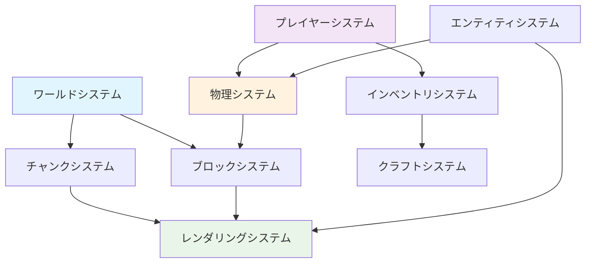

# コア機能 - Minecraftの基本機能

## 概要

コア機能は、Minecraftクローンとして必須となる基本機能群です。各機能は独立した責務を持ち、明確なインターフェースを通じて相互に連携します。

技術的な実装詳細については、以下の専門ドキュメントを参照してください：
- [アーキテクチャ原則](./00-architecture-principles.md) - 設計思想とパターン
- [PBTテスト戦略](./00-pbt-testing-strategy.md) - Property-Based Testing
- [実装パターン](./00-implementation-patterns.md) - Effect-TSの具体的な実装

## コア機能一覧

### 1. ワールドシステム (World System)
- **チャンク生成と管理**: 16x16x384サイズチャンク
- **地形生成**: パーリンノイズベースの自然地形
- **バイオーム処理**: 温度・湿度による生態系管理
- **光源伝播**: ブロック・スカイライトの動的計算

### 2. プレイヤーシステム (Player System)
- **移動・ジャンプ**: 物理法則に準拠した移動系
- **視点制御**: 一人称/三人称視点切り替え
- **ブロック操作**: 配置・破壊のレイキャスト実装
- **インベントリ管理**: 36スロット+ホットバー管理

### 3. ブロックシステム (Block System)
- **ブロックタイプ定義**: 400+種類のブロック仕様
- **物理演算**: 重力・流体・爆発への応答
- **状態管理**: ブロック状態（向き・接続等）
- **更新システム**: 隣接ブロックの相互作用

### 4. エンティティシステム (Entity System)
- **動的スポーン**: バイオーム・時間・難易度連動
- **AI実装**: ステートマシンベースの行動制御
- **物理演算**: 重力・衝突・摩擦の統合処理
- **当たり判定**: AABB（軸並行境界ボックス）

### 5. レンダリングシステム (Rendering System)
- **メッシュ生成**: グリーディメッシング最適化
- **テクスチャ管理**: アトラス・ミップマップ対応
- **視錐台カリング**: フラストラムによる描画最適化
- **LOD管理**: 距離別の詳細度制御

### 6. 物理システム (Physics System)
- **重力システム**: 9.8m/s²の統一重力処理
- **衝突検出**: 空間分割による高速検索
- **流体シミュレーション**: 水・溶岩の伝播系
- **爆発処理**: 球体範囲の破壊・ノックバック

### 7. チャンク管理システム (Chunk System)
- **動的ロード**: プレイヤー視野に基づく管理
- **圧縮保存**: NBT形式によるディスク保存
- **メモリ管理**: LRUキャッシュによる効率化
- **並列処理**: ワーカースレッドでの生成処理

### 8. インベントリシステム (Inventory System)
- **アイテム管理**: スタック・耐久度・エンチャント
- **GUI統合**: 各種コンテナとの連携
- **ドラッグ＆ドロップ**: 直感的操作インターフェース
- **永続化**: NBT形式でのセーブ・ロード

### 9. クラフトシステム (Crafting System)
- **レシピ管理**: JSON定義による柔軟な拡張性
- **クラフト台**: 3x3グリッドでの組み合わせ判定
- **かまど処理**: 燃料消費・精錬時間の管理
- **エンチャント**: 経験値消費による装備強化

### 10. マテリアルシステム (Material System)
- **マテリアル定義**: 各ブロック・アイテムのマテリアル属性
- **ツール効率**: マテリアル別の採掘速度・適正ツール
- **クラフト素材**: 素材の組み合わせとレシピ管理
- **耐久度システム**: マテリアル別の耐久性とエンチャント効果

### 11. シーン管理システム (Scene Management System)
- **シーン遷移制御**: スタート→メイン→ゲームオーバー画面の管理
- **状態機械パターン**: 関数型状態機械による型安全な遷移
- **ライフサイクル管理**: シーンの初期化・更新・終了処理
- **スタック管理**: シーン履歴とポップ・プッシュ操作

### 1. ワールドシステム (World System)
- **チャンク生成と管理**: 16x16x384サイズチャンク
- **地形生成**: パーリンノイズベースの自然地形
- **バイオーム処理**: 温度・湿度による生態系管理
- **光源伝播**: ブロック・スカイライトの動的計算

#### PBT対応の純粋関数実装例
```typescript
// チャンク座標計算（テスト可能）
export const getChunkKey = (x: number, z: number): string =>
  `${x},${z}`;

export const parseChunkKey = (key: string): { x: number; z: number } => {
  const [x, z] = key.split(',').map(Number);
  return { x, z };
};

// バイオーム判定（テスト可能）
export const getBiomeFromClimate = (
  temperature: number,
  humidity: number
): BiomeType => {
  if (temperature < 0.2) return 'tundra';
  if (temperature > 0.8 && humidity > 0.8) return 'jungle';
  if (temperature > 0.6 && humidity < 0.3) return 'desert';
  if (humidity > 0.5) return 'forest';
  return 'plains';
};

// PBTテスト
test.prop([fc.integer(), fc.integer()])(
  "chunk key is reversible",
  (x, z) => {
    const key = getChunkKey(x, z);
    const parsed = parseChunkKey(key);
    expect(parsed).toEqual({ x, z });
  }
);
```

### 2. プレイヤーシステム (Player System)
- **移動・ジャンプ**: 物理法則に準拠した移動系
- **視点制御**: 一人称/三人称視点切り替え
- **ブロック操作**: 配置・破壊のレイキャスト実装
- **インベントリ管理**: 36スロット+ホットバー管理

#### PBT対応の移動計算関数
```typescript
// ジャンプ速度計算（テスト可能）
export const calculateJumpVelocity = (
  jumpHeight: number,
  gravity: number = 9.8
): number => Math.sqrt(2 * gravity * jumpHeight);

// 移動速度制限（テスト可能）
export const clampVelocity = (
  velocity: Vector3,
  maxSpeed: number
): Vector3 => {
  const speed = Math.sqrt(
    velocity.x ** 2 + velocity.y ** 2 + velocity.z ** 2
  );
  if (speed <= maxSpeed) return velocity;
  const scale = maxSpeed / speed;
  return {
    x: velocity.x * scale,
    y: velocity.y * scale,
    z: velocity.z * scale
  };
};

// スニーク速度調整（テスト可能）
export const applySneakModifier = (
  baseSpeed: number,
  isSneaking: boolean
): number => isSneaking ? baseSpeed * 0.3 : baseSpeed;

// PBTテスト
test.prop([fc.float({ min: 0, max: 10 })])(
  "jump velocity physics is correct",
  (height) => {
    const velocity = calculateJumpVelocity(height);
    // v^2 = 2ghの検証
    const calculatedHeight = (velocity ** 2) / (2 * 9.8);
    expect(calculatedHeight).toBeCloseTo(height, 5);
  }
);
```

### 3. ブロックシステム (Block System)
- **ブロックタイプ定義**: 400+種類のブロック仕様
- **物理演算**: 重力・流体・爆発への応答
- **状態管理**: ブロック状態（向き・接続等）
- **更新システム**: 隣接ブロックの相互作用

### 4. エンティティシステム (Entity System)
- **動的スポーン**: バイオーム・時間・難易度連動
- **AI実装**: ステートマシンベースの行動制御
- **物理演算**: 重力・衝突・摩擦の統合処理
- **当たり判定**: AABB（軸並行境界ボックス）

### 5. レンダリングシステム (Rendering System)
- **メッシュ生成**: グリーディメッシング最適化
- **テクスチャ管理**: アトラス・ミップマップ対応
- **視錐台カリング**: フラストラムによる描画最適化
- **LOD管理**: 距離別の詳細度制御

### 6. 物理システム (Physics System)
- **重力システム**: 9.8m/s²の統一重力処理
- **衝突検出**: 空間分割による高速検索
- **流体シミュレーション**: 水・溶岩の伝播系
- **爆発処理**: 球体範囲の破壊・ノックバック

### 7. チャンク管理システム (Chunk System)
- **動的ロード**: プレイヤー視野に基づく管理
- **圧縮保存**: NBT形式によるディスク保存
- **メモリ管理**: LRUキャッシュによる効率化
- **並列処理**: ワーカースレッドでの生成処理

### 8. インベントリシステム (Inventory System)
- **アイテム管理**: スタック・耐久度・エンチャント
- **GUI統合**: 各種コンテナとの連携
- **ドラッグ＆ドロップ**: 直感的操作インターフェース
- **永続化**: NBT形式でのセーブ・ロード

### 9. クラフトシステム (Crafting System)
- **レシピ管理**: JSON定義による柔軟な拡張性
- **クラフト台**: 3x3グリッドでの組み合わせ判定
- **かまど処理**: 燃料消費・精錬時間の管理
- **エンチャント**: 経験値消費による装備強化

### 10. マテリアルシステム (Material System)
- **マテリアル定義**: 各ブロック・アイテムのマテリアル属性
- **ツール効率**: マテリアル別の採掘速度・適正ツール
- **クラフト素材**: 素材の組み合わせとレシピ管理
- **耐久度システム**: マテリアル別の耐久性とエンチャント効果

### 11. シーン管理システム (Scene Management System)
- **シーン遷移制御**: スタート→メイン→ゲームオーバー画面の管理
- **状態機械パターン**: 関数型状態機械による型安全な遷移
- **ライフサイクル管理**: シーンの初期化・更新・終了処理
- **スタック管理**: シーン履歴とポップ・プッシュ操作

## ⚠️ 重要な未実装機能

以下の機能は**Minecraft体験にとって必須**ですが、現在のコア機能には含まれていません：

### 🔥 クリティカル機能（即実装が必要）
- **体力 & 空腹システム**: プレイヤーの生存システム
- **戦闘システム**: 戦闘・ダメージ・死亡処理
- **Mobスポーン**: モンスターの自動生成とルール
- **死亡 & リスポーン**: 死亡処理とリスポーン地点
- **サウンド & 音楽システム**: 効果音・BGM・3D音響効果
- **食料 & 農業システム**: 農業・畜産・食料システム
- **ツール耐久度システム**: ツール耐久度とメンテナンス
- **経験値 & レベルアップ**: 経験値・レベル・スキルシステム

### 🏗️ 高優先度機能（近期実装が望ましい）
- **構造物生成**: 村・ダンジョン・要塞の生成
- **拡張バイオーム**: 海洋・山岳・特殊バイオーム
- **看板 & 本システム**: 看板・本・文字システム
- **ベッド & 睡眠システム**: ベッド・睡眠・時間スキップ
- **コマンド & デバッグシステム**: ゲーム内コマンド・デバッグ機能
- **マップ & ナビゲーション**: 地図・コンパス・座標システム

### 🌱 生態系・環境機能
- **動物の繁殖 & 手懐け**: 動物の繁殖・手懐け
- **植物の成長 & 林業**: 植物の成長・伐採システム
- **高度なレッドストーン部品**: 比較器・中継器・高度な回路

### 🌐 マルチプレイヤー機能
- **ネットワークアーキテクチャ**: クライアント・サーバー基盤
- **プレイヤー同期**: マルチプレイヤー状態同期
- **コミュニケーション**: チャット・ボイス機能
- **ジ・エンド次元**: エンダードラゴン・エンドシティ

詳細は [**不足機能一覧**](../07-missing-features.md) を参照してください。

## 実装ガイドライン

各コア機能の実装は以下のドキュメントを参照してください：

**アーキテクチャと設計**:
- [アーキテクチャ原則](./00-architecture-principles.md) - Effect-TS + ECS設計思想
- [PBTテスト戦略](./00-pbt-testing-strategy.md) - Property-Based Testing統合
- [実装パターン](./00-implementation-patterns.md) - 具体的な実装例とコードパターン

**パフォーマンス最適化**:
- SoA ECS最適化による高速メモリアクセス
- チャンク管理の動的ロード/アンロード
- レンダリングパイプラインの最適化
- 並列処理による物理演算オフロード


## システム間の依存関係



### システム構成

**基盤システム**:
1. **ワールドシステム** - 世界の基盤構築
2. **ブロックシステム** - ブロックデータ管理
3. **チャンクシステム** - メモリ・ディスク管理

**プレイヤーシステム**:
4. **プレイヤーシステム** - プレイヤー操作
5. **物理システム** - 移動・衝突
6. **レンダリングシステム** - 3D描画

**拡張システム**:
7. **エンティティシステム** - NPC・モブ
8. **インベントリシステム** - アイテム管理
9. **クラフトシステム** - 製作システム
10. **シーン管理システム** - 画面遷移制御

## 関連ドキュメント

**基盤システム**:
- [ワールド管理システム](./01-world-management-system.md) - 世界・バイオーム・地形生成
- [ブロックシステム](./03-block-system.md) - ブロックタイプ・状態管理
- [チャンクシステム](./07-chunk-system.md) - チャンク分割・ロード管理

**プレイヤーシステム**:
- [プレイヤーシステム](./02-player-system.md) - 移動・操作・ステータス
- [物理システム](./06-physics-system.md) - 重力・衝突・流体
- [レンダリングシステム](./05-rendering-system.md) - 3D描画・最適化

**拡張システム**:
- [エンティティシステム](./04-entity-system.md) - エンティティ・AI・スポーン
- [インベントリシステム](./01-inventory-system.md) - インベントリ・アイテム
- [クラフトシステム](./02-crafting-system.md) - クラフト・レシピ・エンチャント
- [シーン管理システム](./11-scene-management-system.md) - シーン管理・画面遷移

**アーキテクチャ関連**:
- [全体設計](../../01-architecture/00-overall-design.md) - システム全体設計
- [DDD戦略的設計](../../01-architecture/02-ddd-strategic-design.md) - 境界づけられたコンテキスト
- [ECS統合](../../01-architecture/05-ecs-integration.md) - ECSアーキテクチャ
- [Effect-TSパターン](../../01-architecture/06-effect-ts-patterns.md) - 関数型パターン

## 用語集

- **アグリゲート (Aggregate)**: DDDの境界として機能するエンティティ群 ([詳細](../../04-appendix/00-glossary.md#aggregate))
- **コンポーネント (Component)**: ECSのC、エンティティに付与されるデータ ([詳細](../../04-appendix/00-glossary.md#component))
- **ドメイン駆動設計 (Domain-Driven Design)**: ドメイン駆動設計アプローチ ([詳細](../../04-appendix/00-glossary.md#ddd))
- **Effect (エフェクト)**: Effect-TSにおける副作用の統一表現 ([詳細](../../04-appendix/00-glossary.md#effect))
- **エンティティコンポーネントシステム (Entity Component System)**: ゲーム開発のアーキテクチャパターン ([詳細](../../04-appendix/00-glossary.md#ecs))
- **スキーマ (Schema)**: Effect-TSにおけるデータ構造定義 ([詳細](../../04-appendix/00-glossary.md#schema))
- **Structure of Arrays (SoA)**: パフォーマンス最適化のためのメモリレイアウト ([詳細](../../04-appendix/00-glossary.md#soa))
