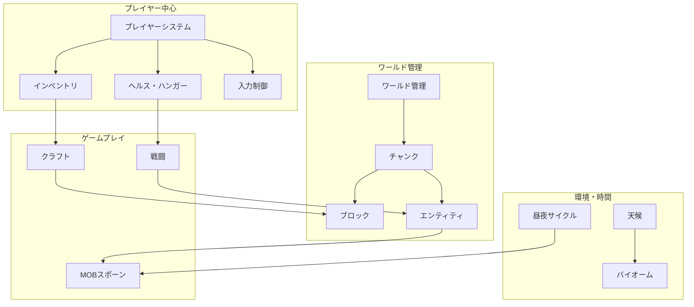

# 🎮 ゲームメカニクス - 設計思想と実装解説

このセクションでは、TypeScript Minecraftにおけるゲームメカニクスの**設計思想**と**実装における判断**を解説します。単なる機能説明ではなく、「なぜその設計にしたのか」「どのような配慮があるのか」を深く理解できます。

## 🎯 このセクションの目的

- **Minecraftらしさ**の本質的理解と再現戦略
- **ゲームバランス**設計における判断基準
- **技術的制約**と**プレイヤー体験**の最適なバランス
- **拡張性**を考慮した機能設計パターン

## 🧠 設計哲学とアプローチ

### [設計哲学](./design-philosophy.md)
**Minecraft体験の再現と革新**

なぜMinecraft特有のゲームメカニクスが重要なのか、その設計思想と実装における配慮事項：

- **創造性の自由度** - 無限の可能性を支える技術基盤
- **探索と発見の喜び** - 予期しない体験の設計手法
- **サバイバル要素** - 緊張感と達成感のバランス
- **学習曲線の最適化** - 段階的な複雑性の導入
- **フィードバックシステム** - プレイヤーアクションへの適切な反応

## 🏗 システム別解説

### 📦 [コア機能](./core-features/README.md)
**ゲームの基盤となる必須システム群**

Minecraftの基本体験を支える中核的なシステム：

#### 基礎システム
- **[アーキテクチャ原則](./core-features/architecture-principles.md)** - システム設計の基本方針
- **[実装パターン](./core-features/implementation-patterns.md)** - 共通実装パターンの解説
- **[PBTテスト戦略](./core-features/pbt-testing-strategy.md)** - Property-Based Testing による品質保証

#### プレイヤー中心システム
- **[プレイヤーシステム](./core-features/player-system.md)** - プレイヤー状態管理と能力システム
- **[インベントリシステム](./core-features/inventory-system.md)** - アイテム管理とUI設計
- **[ヘルス・ハンガーシステム](./core-features/health-hunger-system.md)** - 生存要素のバランス設計
- **[入力制御](./core-features/input-controls.md)** - 直感的な操作体系

#### ワールドシステム
- **[ワールド管理システム](./core-features/world-management-system.md)** - 大規模世界の効率的管理
- **[チャンクシステム](./core-features/chunk-system.md)** - 動的ローディングと最適化
- **[ブロックシステム](./core-features/block-system.md)** - ブロック配置と物理法則
- **[エンティティシステム](./core-features/entity-system.md)** - 動的オブジェクト管理

#### ゲームプレイシステム
- **[クラフトシステム](./core-features/crafting-system.md)** - レシピ管理と作成メカニクス
- **[戦闘システム](./core-features/combat-system.md)** - ダメージ計算と戦闘バランス
- **[MOBスポーンシステム](./core-features/mob-spawning-system.md)** - 敵キャラクター生成ロジック

#### インフラシステム
- **[ゲームループシステム](./core-features/game-loop-system.md)** - 60FPS維持のための設計
- **[シーン管理システム](./core-features/scene-management-system.md)** - 画面遷移とステート管理
- **[レンダリングシステム](./core-features/rendering-system.md)** - 効率的な描画パイプライン
- **[物理システム](./core-features/physics-system.md)** - リアルタイム物理シミュレーション
- **[サウンド・音楽システム](./core-features/sound-music-system.md)** - 没入感を高める音響設計

#### 生活・環境システム
- **[食料・農業システム](./core-features/food-agriculture-system.md)** - 持続可能な生存戦略
- **[ベッド・睡眠システム](./core-features/bed-sleep-system.md)** - 時間管理と安全地帯
- **[看板・本システム](./core-features/sign-book-system.md)** - 情報共有とストーリーテリング
- **[マテリアルシステム](./core-features/material-system.md)** - ブロック・アイテムの特性管理

### ⚡ [拡張機能](./enhanced-features/README.md)
**ゲーム体験を豊かにする高度なシステム群**

Minecraftの魅力を拡張する追加機能：

#### 環境・世界システム
- **[概要](./enhanced-features/overview.md)** - 拡張機能の全体設計
- **[天候システム](./enhanced-features/weather-system.md)** - 動的気象変化とゲーム影響
- **[昼夜サイクル](./enhanced-features/day-night-cycle.md)** - 時間経過とゲームプレイの変化
- **[拡張バイオームシステム](./enhanced-features/extended-biome-system.md)** - 多様な環境の実現

#### 次元・構造システム
- **[ネザーポータル](./enhanced-features/nether-portals.md)** - 次元間移動メカニクス
- **[エンドディメンション](./enhanced-features/the-end-dimension.md)** - 最終目標となる世界
- **[構造生成](./enhanced-features/structure-generation.md)** - 自然・人工構造物の配置
- **[海洋・水中システム](./enhanced-features/ocean-underwater-system.md)** - 水中探索の魅力

#### ゲームプレイ拡張
- **[レッドストーンシステム](./enhanced-features/redstone-system.md)** - 自動化と回路設計
- **[エンチャントシステム](./enhanced-features/enchantment-system.md)** - アイテム強化メカニクス
- **[ポーション効果](./enhanced-features/potion-effects.md)** - 一時的能力変化システム
- **[村人取引](./enhanced-features/villager-trading.md)** - NPCとの経済活動

#### AI・知能システム
- **[MOB AIシステム](./enhanced-features/mob-ai-system.md)** - 高度な敵キャラクター行動
- **[パーティクルシステム](./enhanced-features/particle-system.md)** - 視覚効果による没入感向上

#### マルチプレイヤー
- **[マルチプレイヤーアーキテクチャ](./enhanced-features/multiplayer-architecture.md)** - 協力・競争プレイの実現

## 🎨 横断的システム

### [高度なゲームシステム](./advanced-game-systems.md)
**複数機能にまたがる統合システム**

個別機能を超えた、包括的なゲーム体験の設計：

- **システム間連携** - 機能同士の相互作用設計
- **パフォーマンス最適化** - 大規模システムの効率化
- **データ整合性** - 複雑な状態管理の確実性
- **拡張性担保** - 新機能追加時の影響最小化

### [アセット・リソース管理](./asset-sources.md)
**ゲーム素材の管理と最適化**

テクスチャ、サウンド、モデルなどの効率的管理：

- **アセットパイプライン** - 制作から実装までの流れ
- **最適化戦略** - ファイルサイズと品質のバランス
- **動的ローディング** - 必要に応じたリソース読み込み
- **キャッシュ戦略** - メモリ効率とアクセス速度の両立

## 🔄 システム統合と相互作用

### 統合設計パターン

### パフォーマンス考慮事項

- **フレームバジェット管理** - 16ms以内での処理完了
- **メモリ効率化** - ガベージコレクション圧迫の回避
- **バッチ処理** - 類似処理の効率的実行
- **階層化された詳細度** - 距離に応じた処理精度調整

### 拡張性の確保

- **プラグインアーキテクチャ** - 機能追加の標準化
- **設定駆動** - コード変更なしでのバランス調整
- **イベント駆動** - 疎結合による変更耐性
- **段階的移行** - 既存機能への影響最小化

## 🎓 学習パス

### 初学者向け
1. [設計哲学](./design-philosophy.md) - 全体的な考え方を理解
2. [プレイヤーシステム](./core-features/player-system.md) - 中心となる概念
3. [ブロックシステム](./core-features/block-system.md) - Minecraftの基本要素

### 中級者向け
1. [チャンクシステム](./core-features/chunk-system.md) - パフォーマンス最適化の理解
2. [レンダリングシステム](./core-features/rendering-system.md) - 技術的深度の学習
3. [高度なゲームシステム](./advanced-game-systems.md) - 統合的視点の獲得

### 上級者向け
1. [マルチプレイヤーアーキテクチャ](./enhanced-features/multiplayer-architecture.md) - 分散システム設計
2. [MOB AIシステム](./enhanced-features/mob-ai-system.md) - 高度なアルゴリズム実装
3. 全システムの相互作用理解 - 包括的アーキテクチャ把握

## 🔗 関連セクション

- **[Architecture](../architecture/README.md)**: システム全体の設計思想
- **[Design Patterns](../design-patterns/README.md)**: 実装パターンの詳細
- **[Tutorials](../../tutorials/README.md)**: 実践的な学習ガイド
- **[How-to Guides](../../how-to/README.md)**: 具体的な実装手順
- **[Reference](../../reference/README.md)**: 技術仕様とAPI情報

---

**🎮 ゲーム開発の醍醐味**: このセクションを通じて、「技術的な実装」と「プレイヤー体験」を同時に追求する、ゲーム開発特有の面白さと難しさを理解できるでしょう。