# 🎮 高度なゲームシステム設計

## 🌟 MMORPGレベルのゲーム設計哲学

### 企業レベル・大規模ゲーム開発の実現

World of Warcraft、Final Fantasy XIV、Minecraftなど、数千万プレイヤーを支える現代的MMORPGと同等のシステム設計をTypeScript環境で実現します。

```mermaid
%%{init: {"theme": "neutral", "themeVariables": {"primaryColor": "#4285f4", "primaryTextColor": "#ffffff", "primaryBorderColor": "#ffffff", "lineColor": "#4285f4", "sectionBkgColor": "#f5f7fa", "tertiaryColor": "#f5f7fa"}}}%%
graph TB
    subgraph "🌍 Massive Multiplayer Systems"
        subgraph "Player Management"
            AuthSystem[Authentication System<br/>🔐 OAuth2 + JWT]
            PlayerDB[Player Database<br/>👤 PostgreSQL Cluster]
            SessionMgmt[Session Management<br/>📱 Redis Cluster]
        end

        subgraph "World Persistence"
            WorldDB[World Database<br/>🌍 Distributed Storage]
            ChunkCache[Chunk Cache<br/>⚡ Redis + Memory]
            RealtimeSync[Realtime Sync<br/>🔄 WebSocket + EventBus]
        end

        subgraph "Game Logic Distribution"
            GameServer1[Game Server 1<br/>🖥️ EU-West]
            GameServer2[Game Server 2<br/>🖥️ US-East]
            GameServer3[Game Server 3<br/>🖥️ Asia-Pacific]
            LoadBalancer[Load Balancer<br/>⚖️ Geographic Distribution]
        end
    end

    subgraph "🤖 Advanced AI Systems"
        subgraph "NPC Intelligence"
            BehaviorTrees[Behavior Trees<br/>🌳 Complex AI Logic]
            PathfindingAI[Advanced Pathfinding<br/>🗺️ A* + Flow Fields]
            EmotionalAI[Emotional AI<br/>💭 Mood & Personality]
        end

        subgraph "Procedural Systems"
            WorldGenAI[World Generation AI<br/>🏞️ ML-Powered Terrain]
            QuestGenAI[Quest Generation AI<br/>📜 Dynamic Storylines]
            EconomyAI[Economy AI<br/>💰 Market Simulation]
        end
    end

    subgraph "💰 Economic Systems"
        subgraph "Market Infrastructure"
            AuctionHouse[Auction House<br/>🏪 Global Marketplace]
            TradingSystem[Trading System<br/>🤝 P2P + Escrow]
            CurrencySystem[Currency System<br/>💎 Multi-Token Economy]
        end

        subgraph "Economic Balance"
            InflationControl[Inflation Control<br/>📈 Algorithmic Balancing]
            ResourceSinks[Resource Sinks<br/>🕳️ Economy Stabilization]
            ProductionChains[Production Chains<br/>🏭 Complex Crafting]
        end
    end

    AuthSystem --> PlayerDB
    PlayerDB --> SessionMgmt
    SessionMgmt --> RealtimeSync

    WorldDB --> ChunkCache
    ChunkCache --> GameServer1
    ChunkCache --> GameServer2
    ChunkCache --> GameServer3

    LoadBalancer --> GameServer1
    LoadBalancer --> GameServer2
    LoadBalancer --> GameServer3

    BehaviorTrees --> PathfindingAI
    PathfindingAI --> EmotionalAI

    WorldGenAI --> QuestGenAI
    QuestGenAI --> EconomyAI

    AuctionHouse --> TradingSystem
    TradingSystem --> CurrencySystem

    InflationControl --> ResourceSinks
    ResourceSinks --> ProductionChains

    classDef multiplayer fill:#e3f2fd,stroke:#1565c0,stroke-width:2px,color:#0d47a1
    classDef ai fill:#e8f5e8,stroke:#388e3c,stroke-width:2px,color:#1b5e20
    classDef economy fill:#fff3e0,stroke:#f57c00,stroke-width:2px,color:#e65100
    classDef infrastructure fill:#f3e5f5,stroke:#7b1fa2,stroke-width:2px,color:#4a148c

    class AuthSystem,PlayerDB,SessionMgmt,WorldDB,ChunkCache,RealtimeSync multiplayer
    class GameServer1,GameServer2,GameServer3,LoadBalancer infrastructure
    class BehaviorTrees,PathfindingAI,EmotionalAI,WorldGenAI,QuestGenAI,EconomyAI ai
    class AuctionHouse,TradingSystem,CurrencySystem,InflationControl,ResourceSinks,ProductionChains economy
```



---

## 🌐 マルチプレイヤーアーキテクチャ

### 大規模同時接続の実現

```typescript
// Multiplayer Core Systems
export namespace Multiplayer {
  // Player Session Management
  export const PlayerSession = Schema.Struct({
    sessionId: Schema.String.pipe(Schema.uuid(), Schema.brand("SessionId")),
    playerId: Schema.String.pipe(Schema.uuid(), Schema.brand("PlayerId")),
    serverRegion: Schema.Literal("us-east", "us-west", "eu-west", "eu-east", "asia-pacific"),
    connectionType: Schema.Literal("websocket", "webrtc", "tcp"),
    latency: Schema.Number.pipe(Schema.nonNegative()),
    bandwidth: Schema.Number.pipe(Schema.positive()),
    authenticated: Schema.Boolean,
    permissions: PlayerPermissionSet,
    lastHeartbeat: Schema.Date,
    connectionQuality: Schema.Literal("excellent", "good", "fair", "poor")
  })

  // Real-time Synchronization Protocol
  export interface RealtimeSyncProtocol {
    // State Synchronization
    readonly syncPlayerState: (
      playerId: PlayerId,
      state: PlayerState,
      timestamp: Timestamp
    ) => Effect.Effect<void, SyncError, NetworkService>

    readonly syncWorldState: (
      chunkCoord: ChunkCoordinate,
      changes: WorldStateChanges,
      timestamp: Timestamp
    ) => Effect.Effect<void, SyncError, NetworkService>

    // Conflict Resolution
    readonly resolveConflict: (
      conflicts: StateConflict[]
    ) => Effect.Effect<ConflictResolution[], ConflictError, ConflictResolver>

    // Network Optimization
    readonly compressStateUpdate: (
      update: StateUpdate
    ) => Effect.Effect<CompressedUpdate, CompressionError, never>

    readonly deltaCompression: (
      previousState: GameState,
      currentState: GameState
    ) => Effect.Effect<StateDelta, DeltaError, never>
  }

  // Distributed Game World Management
  export interface WorldShardingService {
    readonly getShardForChunk: (
      coord: ChunkCoordinate
    ) => Effect.Effect<ShardId, ShardError, never>

    readonly migrateChunk: (
      coord: ChunkCoordinate,
      fromShard: ShardId,
      toShard: ShardId
    ) => Effect.Effect<void, MigrationError, ShardService>

    readonly balanceLoad: () => Effect.Effect<LoadBalanceResult, BalanceError, ShardService>

    readonly replicateChunk: (
      coord: ChunkCoordinate,
      replicas: number
    ) => Effect.Effect<ReplicationResult, ReplicationError, ShardService>
  }

  export const WorldShardingService = Context.GenericTag<WorldShardingService>("@minecraft/WorldShardingService")
}

// Advanced Networking Implementation - Functional Approach
export namespace AdvancedNetworking {
  // Dependencies as Context services
  export interface AdvancedNetworkManager {
    readonly assessNetworkConditions: (session: PlayerSession) => Effect.Effect<NetworkConditions, NetworkError, never>
    readonly getHistoricalWorldState: (timestamp: number) => Effect.Effect<WorldState, HistoryError, never>
    readonly validatePlayerInput: (input: PlayerInput, state: WorldState) => Effect.Effect<boolean, ValidationError, never>
    readonly extrapolatePosition: (position: Position, velocity: Vector3, latency: number) => Position
  }

  export const AdvancedNetworkManager = Context.GenericTag<AdvancedNetworkManager>("@minecraft/AdvancedNetworkManager")

  // Adaptive Network Protocol Selection - Pure Function
  export const selectOptimalProtocol = (
    session: PlayerSession
  ): Effect.Effect<NetworkProtocol, NetworkError, AdvancedNetworkManager> =>
    Effect.gen(function* () {
      const networkManager = yield* AdvancedNetworkManager
      const networkConditions = yield* networkManager.assessNetworkConditions(session)

      return Match.value(networkConditions).pipe(
        Match.when(
          (conditions) => conditions.latency < 50 && conditions.bandwidth > 1000,
          () => ({ type: "webrtc" as const, config: { lowLatency: true } })
        ),
        Match.when(
          (conditions) => conditions.latency < 100 && conditions.reliability > 0.95,
          () => ({ type: "websocket" as const, config: { compression: true } })
        ),
        Match.when(
          (conditions) => conditions.reliability > 0.90,
          () => ({ type: "tcp" as const, config: { reliable: true } })
        ),
        Match.orElse(() => ({ type: "udp" as const, config: { unreliable: true } }))
      )
    })

  // Lag Compensation System - Functional Implementation
  export const compensateForLatency = (
    playerInput: PlayerInput,
    serverTimestamp: Timestamp,
    playerLatency: number
  ): Effect.Effect<CompensatedInput, CompensationError, AdvancedNetworkManager> =>
    Effect.gen(function* () {
      const networkManager = yield* AdvancedNetworkManager

      // サーバーサイド巻き戻し
      const historicalState = yield* networkManager.getHistoricalWorldState(
        serverTimestamp - playerLatency
      )

      // 入力の妥当性検証（過去の状態で）
      const isValidInput = yield* networkManager.validatePlayerInput(
        playerInput,
        historicalState
      )

      return Match.value(isValidInput).pipe(
        Match.when(false, () =>
          Effect.fail({
            _tag: "InvalidInputError" as const,
            input: playerInput,
            reason: "Input not valid for historical state"
          } as CompensationError)
        ),
        Match.when(true, () =>
          Effect.succeed({
            ...playerInput,
            timestamp: serverTimestamp,
            compensatedPosition: networkManager.extrapolatePosition(
              playerInput.position,
              playerInput.velocity,
              playerLatency
            ),
            validated: true
          } as CompensatedInput)
        ),
        Match.exhaustive
      ).pipe(Effect.flatten)
    })
}

// Client-Side Prediction & Server Reconciliation - Functional Design
export namespace ClientSidePrediction {
  // Service definitions using Context.GenericTag
  export interface LocalGameStateService {
    readonly getCurrent: () => Effect.Effect<LocalGameState, never, never>
    readonly setCurrent: (state: LocalGameState) => Effect.Effect<void, never, never>
  }

  export interface ServerGameStateService {
    readonly getCurrent: () => Effect.Effect<ServerGameState, never, never>
  }

  export interface InputBufferService {
    readonly store: (sequenceId: SequenceId, data: InputBufferEntry) => Effect.Effect<void, never, never>
    readonly getInputsAfter: (sequenceId: SequenceId) => Effect.Effect<InputBufferEntry[], never, never>
  }

  export interface MovementSimulationService {
    readonly simulate: (state: GameState, input: PlayerInput) => Effect.Effect<PredictedState, SimulationError, never>
  }

  export const LocalGameStateService = Context.GenericTag<LocalGameStateService>("@minecraft/LocalGameStateService")
  export const ServerGameStateService = Context.GenericTag<ServerGameStateService>("@minecraft/ServerGameStateService")
  export const InputBufferService = Context.GenericTag<InputBufferService>("@minecraft/InputBufferService")
  export const MovementSimulationService = Context.GenericTag<MovementSimulationService>("@minecraft/MovementSimulationService")

  // クライアントサイド予測 - Functional approach
  export const predictMovement = (
    input: PlayerInput
  ): Effect.Effect<PredictedState, PredictionError, LocalGameStateService | InputBufferService | MovementSimulationService> =>
    Effect.gen(function* () {
      const localStateService = yield* LocalGameStateService
      const inputBufferService = yield* InputBufferService
      const simulationService = yield* MovementSimulationService

      // ローカル状態で即座に予測実行
      const currentState = yield* localStateService.getCurrent()
      const predictedState = yield* simulationService.simulate(
        currentState,
        input
      )

      // 予測をバッファに記録（後で検証用）
      yield* inputBufferService.store(input.sequenceId, {
        input,
        predictedState,
        timestamp: Date.now()
      })

      return predictedState
    })

  // サーバー和解（Reconciliation）
  reconcileWithServer = (
    authorativeState: ServerGameState,
    lastProcessedInput: SequenceId
  ): Effect.Effect<ReconciledState, ReconciliationError, never> =>
    Effect.gen(function* () {
      // 未処理の入力を取得
      const unprocessedInputs = yield* this.inputBuffer.getInputsAfter(lastProcessedInput)

      // サーバー状態から再シミュレーション
      const reconciledState = yield* Effect.reduce(
        unprocessedInputs,
        authorativeState,
        (currentState, bufferedInput) =>
          simulateMovement(currentState, bufferedInput.input)
      )

      // 予測誤差の計算と補正
      const predictionError = this.calculatePredictionError(
        this.localState.current,
        reconciledState
      )

      yield* Match.value(predictionError.magnitude).pipe(
        Match.when(
          (magnitude) => magnitude > CORRECTION_THRESHOLD,
          () => applySmoothCorrection(predictionError)
        ),
        Match.orElse(() => Effect.succeed(undefined)),
        Match.exhaustive
      ).pipe(Effect.flatten)

      return reconciledState
    })
}
```

### 分散データベース設計

```typescript
// Distributed Data Architecture
export namespace DistributedData {
  // Sharding Strategy
  export interface DataShardingService {
    readonly shardKey: (playerId: PlayerId) => Effect.Effect<ShardKey, never, never>
    readonly routeQuery: <T>(query: DatabaseQuery<T>) => Effect.Effect<ShardRoute[], RoutingError, never>
    readonly aggregateResults: <T>(results: ShardResult<T>[]) => Effect.Effect<T, AggregationError, never>
  }

  export const DataShardingService = Context.GenericTag<DataShardingService>("@minecraft/DataShardingService")

  // Consistent Hashing for Load Distribution - Functional Implementation
  export namespace ConsistentHashRing {
    // Configuration Schema
    export const ConsistentHashRingConfig = Schema.Struct({
      virtualNodes: Schema.Number.pipe(Schema.positive(), Schema.int()),
      hashFunction: Schema.Function
    })
    export type ConsistentHashRingConfig = Schema.Schema.Type<typeof ConsistentHashRingConfig>

    // Ring State Management
    export interface ConsistentHashRingService {
      readonly addNode: (node: DatabaseNode) => Effect.Effect<void, never, never>
      readonly getNode: (key: string) => Effect.Effect<DatabaseNode, NodeNotFoundError, never>
      readonly getRing: () => Effect.Effect<Map<number, DatabaseNode>, never, never>
    }

    export const ConsistentHashRingService = Context.GenericTag<ConsistentHashRingService>("@minecraft/ConsistentHashRingService")

    // Pure functions for hash ring operations
    export const addNode = (
      node: DatabaseNode,
      config: ConsistentHashRingConfig
    ): Effect.Effect<void, never, ConsistentHashRingService> =>
      Effect.gen(function* () {
        const ringService = yield* ConsistentHashRingService

        // 仮想ノードを配置してホットスポットを回避
        yield* Effect.forEach(
          Array.from({ length: config.virtualNodes }, (_, i) => i),
          (i) => Effect.gen(function* () {
            const virtualNodeKey = `${node.id}:${i}`
            const hashValue = yield* Effect.promise(() => config.hashFunction(virtualNodeKey))
            const ring = yield* ringService.getRing()
            ring.set(hashValue, node)
          })
        )
      })

    export const getNode = (
      key: string,
      config: ConsistentHashRingConfig
    ): Effect.Effect<DatabaseNode, NodeNotFoundError, ConsistentHashRingService> =>
      Effect.gen(function* () {
        const ringService = yield* ConsistentHashRingService
        const hashValue = yield* Effect.promise(() => config.hashFunction(key))
        const ring = yield* ringService.getRing()

        // リング上で最初に見つかるノードを返す
        const sortedHashes = Array.from(ring.keys()).sort()
        const targetNode = sortedHashes.find(hash => hash >= hashValue) ??
                          sortedHashes[0]

        const node = ring.get(targetNode)

        return Match.value(node).pipe(
          Match.when(Option.isNone, () =>
            Effect.fail({
              _tag: "NodeNotFoundError" as const,
              key
            } as NodeNotFoundError)
          ),
          Match.when(Option.isSome, (someNode) =>
            Effect.succeed(someNode.value)
          ),
          Match.exhaustive
        ).pipe(Effect.flatten)
      })
  }

  // CQRS with Event Sourcing
  export interface EventSourcingSystem {
    readonly appendEvent: (
      streamId: StreamId,
      events: DomainEvent[]
    ) => Effect.Effect<void, AppendError, EventStore>

    readonly replayEvents: (
      streamId: StreamId,
      fromVersion?: number
    ) => Effect.Effect<DomainEvent[], ReplayError, EventStore>

    readonly createSnapshot: (
      streamId: StreamId,
      state: AggregateState
    ) => Effect.Effect<void, SnapshotError, SnapshotStore>

    readonly rebuildFromSnapshot: (
      streamId: StreamId
    ) => Effect.Effect<AggregateState, RebuildError, SnapshotStore | EventStore>
  }

  // Multi-Master Replication
  export interface ReplicationManager {
    readonly replicateWrite: (
      operation: WriteOperation
    ) => Effect.Effect<ReplicationResult, ReplicationError, DatabaseCluster>

    readonly resolveConflicts: (
      conflicts: DataConflict[]
    ) => Effect.Effect<ConflictResolution[], ConflictError, ConflictResolver>

    readonly syncReplicas: () => Effect.Effect<SyncResult, SyncError, DatabaseCluster>

    readonly handlePartition: (
      partition: NetworkPartition
    ) => Effect.Effect<PartitionStrategy, PartitionError, never>
  }
}

// Advanced Data Consistency Patterns - Functional Design
export namespace EventualConsistency {
  // Service Interfaces
  export interface EventualConsistencyManager {
    readonly executeDistributedTransaction: <T>(sagaDefinition: SagaDefinition<T>) => Effect.Effect<T, SagaError, SagaOrchestrator>
    readonly updateVectorClock: (currentClock: VectorClock, nodeId: NodeId, event: DistributedEvent) => Effect.Effect<VectorClock, never, never>
  }

  export const EventualConsistencyManager = Context.GenericTag<EventualConsistencyManager>("@minecraft/EventualConsistencyManager")

  // Saga Pattern for Distributed Transactions - Functional Implementation
  export const executeDistributedTransaction = <T>(
    sagaDefinition: SagaDefinition<T>
  ): Effect.Effect<T, SagaError, SagaOrchestrator | CompensationService | SagaIdGenerator> =>
    Effect.gen(function* () {
      const sagaIdGenerator = yield* SagaIdGenerator
      const compensationService = yield* CompensationService

      const sagaId = yield* sagaIdGenerator.generate()

      const executionResult = yield* Effect.tryPromise({
        try: () => executeSagaSteps(sagaDefinition, sagaId, compensationService),
        catch: (error) => ({ _tag: "SagaExecutionError" as const, sagaId, cause: error } as SagaError)
      })

      return yield* Match.value(executionResult).pipe(
        Match.tag("Left", ({ left: error }) =>
          Effect.gen(function* () {
            // 失敗時は補償アクションを実行
            yield* compensationService.executeCompensations(sagaId)
            return yield* Effect.fail(error)
          })
        ),
        Match.tag("Right", ({ right: result }) =>
          Effect.gen(function* () {
            // 成功時は補償アクションをクリア
            yield* compensationService.clearCompensations(sagaId)
            return result
          })
        ),
        Match.exhaustive
      ).pipe(Effect.flatten)
    })

  const executeSagaSteps = async <T>(
    sagaDefinition: SagaDefinition<T>,
    sagaId: SagaId,
    compensationService: CompensationService
  ): Promise<T> => {
    // 各ステップを順次実行
    const result = await Effect.runPromise(
      Effect.reduce(
        sagaDefinition.steps,
        sagaDefinition.initialState,
        (currentResult, step) => Effect.gen(function* () {
          const stepResult = yield* step.execute(currentResult)

          // 補償アクションを記録
          yield* compensationService.recordCompensation(sagaId, step.compensationAction)

          return stepResult
        })
      )
    )

    return result
  }

  // Vector Clock for Causality Tracking - Pure Function
  export const updateVectorClock = (
    currentClock: VectorClock,
    nodeId: NodeId,
    event: DistributedEvent
  ): Effect.Effect<VectorClock, never, never> =>
    Effect.sync(() => {
      const newClock = { ...currentClock }

      // 自ノードのクロックをインクリメント
      newClock[nodeId] = (newClock[nodeId] || 0) + 1

      // イベントのベクタークロックとマージ
      return Match.value(event.vectorClock).pipe(
        Match.when(Option.isSome, (eventClock) => {
          Object.entries(eventClock.value).forEach(([otherNodeId, timestamp]) => {
            newClock[otherNodeId] = Math.max(
              newClock[otherNodeId] || 0,
              timestamp
            )
          })
          return newClock
        }),
        Match.when(Option.isNone, () => newClock),
        Match.exhaustive
      )
    })

  // Service Dependencies
  export interface SagaOrchestrator {
    readonly executeSaga: <T>(definition: SagaDefinition<T>) => Effect.Effect<T, SagaError, never>
  }

  export interface CompensationService {
    readonly recordCompensation: (sagaId: SagaId, action: CompensationAction) => Effect.Effect<void, never, never>
    readonly executeCompensations: (sagaId: SagaId) => Effect.Effect<void, CompensationError, never>
    readonly clearCompensations: (sagaId: SagaId) => Effect.Effect<void, never, never>
  }

  export interface SagaIdGenerator {
    readonly generate: () => Effect.Effect<SagaId, never, never>
  }

  export const SagaOrchestrator = Context.GenericTag<SagaOrchestrator>("@minecraft/SagaOrchestrator")
  export const CompensationService = Context.GenericTag<CompensationService>("@minecraft/CompensationService")
  export const SagaIdGenerator = Context.GenericTag<SagaIdGenerator>("@minecraft/SagaIdGenerator")
}
}
```

---

## 🤖 高度なAIシステム

### 知的NPCとBehavior Tree

```typescript
export namespace AdvancedAI {
  // Behavior Tree Implementation - Functional Approach using Tagged Unions
  export const BehaviorNodeType = Schema.Literal("sequence", "selector", "condition", "action")
  export type BehaviorNodeType = Schema.Schema.Type<typeof BehaviorNodeType>

  export const NodeResult = Schema.Literal("SUCCESS", "FAILURE", "RUNNING")
  export type NodeResult = Schema.Schema.Type<typeof NodeResult>

  // Behavior Node as Data Structure
  export const BehaviorNode = Schema.Struct({
    _tag: Schema.Literal("BehaviorNode"),
    nodeType: BehaviorNodeType,
    children: Schema.optional(Schema.Array(Schema.suspend(() => BehaviorNode))),
    condition: Schema.optional(Schema.Function),
    action: Schema.optional(Schema.Function)
  })
  export type BehaviorNode = Schema.Schema.Type<typeof BehaviorNode>

  // Behavior Tree Service
  export interface BehaviorTreeService {
    readonly executeNode: (node: BehaviorNode, context: AIContext) => Effect.Effect<NodeResult, AIError, AIServices>
  }
  export const BehaviorTreeService = Context.GenericTag<BehaviorTreeService>("@minecraft/BehaviorTreeService")

  // Pure function for sequence node execution
  export const executeSequenceNode = (
    children: BehaviorNode[],
    context: AIContext
  ): Effect.Effect<NodeResult, AIError, BehaviorTreeService> =>
    Effect.gen(function* () {
      const treeService = yield* BehaviorTreeService

      return yield* Effect.forEach(children, (child) =>
        Effect.gen(function* () {
          const result = yield* treeService.executeNode(child, context)
          return yield* Match.value(result).pipe(
            Match.when("FAILURE", () => Effect.fail({ type: "EARLY_EXIT", result })),
            Match.when("RUNNING", () => Effect.fail({ type: "EARLY_EXIT", result })),
            Match.when("SUCCESS", () => Effect.succeed(result)),
            Match.exhaustive
          )
        })
      ).pipe(
        Effect.andThen(() => "SUCCESS" as NodeResult),
        Effect.catchTag("EARLY_EXIT", ({ result }) => Effect.succeed(result))
      )
    })

  // Pure function for selector node execution
  export const executeSelectorNode = (
    children: BehaviorNode[],
    context: AIContext
  ): Effect.Effect<NodeResult, AIError, BehaviorTreeService> =>
    Effect.gen(function* () {
      const treeService = yield* BehaviorTreeService

      return yield* Effect.forEach(children, (child) =>
        Effect.gen(function* () {
          const result = yield* treeService.executeNode(child, context)
          return yield* Match.value(result).pipe(
            Match.when("SUCCESS", () => Effect.fail({ type: "EARLY_EXIT", result })),
            Match.when("RUNNING", () => Effect.fail({ type: "EARLY_EXIT", result })),
            Match.when("FAILURE", () => Effect.succeed(result)),
            Match.exhaustive
          )
        })
      ).pipe(
        Effect.andThen(() => "FAILURE" as NodeResult),
        Effect.catchTag("EARLY_EXIT", ({ result }) => Effect.succeed(result))
      )
    })

  // Main execution function using pattern matching
  export const executeBehaviorNode = (
    node: BehaviorNode,
    context: AIContext
  ): Effect.Effect<NodeResult, AIError, BehaviorTreeService> =>
    Match.value(node.nodeType).pipe(
      Match.when("sequence", () =>
        executeSequenceNode(node.children || [], context)
      ),
      Match.when("selector", () =>
        executeSelectorNode(node.children || [], context)
      ),
      Match.when("condition", () =>
        node.condition ?
          Effect.try({
            try: () => node.condition!(context) ? "SUCCESS" : "FAILURE" as NodeResult,
            catch: (error) => ({ _tag: "AIError" as const, error } as AIError)
          }) :
          Effect.succeed("FAILURE" as NodeResult)
      ),
      Match.when("action", () =>
        node.action ?
          Effect.try({
            try: () => { node.action!(context); return "SUCCESS" as NodeResult },
            catch: (error) => ({ _tag: "AIError" as const, error } as AIError)
          }) :
          Effect.succeed("FAILURE" as NodeResult)
      ),
      Match.exhaustive
    )

  // Advanced Pathfinding with Flow Fields
  export interface AdvancedPathfinding {
    readonly findPath: (
      from: Position,
      to: Position,
      constraints: PathfindingConstraints
    ) => Effect.Effect<Path, PathfindingError, PathfindingService>

    readonly generateFlowField: (
      goal: Position,
      area: BoundingBox
    ) => Effect.Effect<FlowField, FlowFieldError, PathfindingService>

    readonly findDynamicPath: (
      agent: MovingAgent,
      goal: Position,
      avoidanceRadius: number
    ) => Effect.Effect<DynamicPath, PathfindingError, PathfindingService>

    readonly optimizeGroupMovement: (
      agents: MovingAgent[],
      formations: Formation[]
    ) => Effect.Effect<GroupMovementPlan, GroupMovementError, PathfindingService>
  }

  // Emotional AI System
  export const EmotionalState = Schema.Struct({
    happiness: Schema.Number.pipe(Schema.between(0, 1)),
    fear: Schema.Number.pipe(Schema.between(0, 1)),
    anger: Schema.Number.pipe(Schema.between(0, 1)),
    sadness: Schema.Number.pipe(Schema.between(0, 1)),
    surprise: Schema.Number.pipe(Schema.between(0, 1)),
    disgust: Schema.Number.pipe(Schema.between(0, 1)),
    trust: Schema.Number.pipe(Schema.between(0, 1)),
    anticipation: Schema.Number.pipe(Schema.between(0, 1))
  })

  export const NPCPersonality = Schema.Struct({
    id: Schema.String.pipe(Schema.uuid(), Schema.brand("NPCId")),
    name: Schema.String,
    type: Schema.Literal("villager", "trader", "guard", "quest_giver", "monster"),
    basePersonality: Schema.Struct({
      openness: Schema.Number.pipe(Schema.between(0, 1)),
      conscientiousness: Schema.Number.pipe(Schema.between(0, 1)),
      extraversion: Schema.Number.pipe(Schema.between(0, 1)),
      agreeableness: Schema.Number.pipe(Schema.between(0, 1)),
      neuroticism: Schema.Number.pipe(Schema.between(0, 1))
    }),
    currentEmotion: EmotionalState,
    relationships: Schema.Map({
      key: Schema.String.pipe(Schema.brand("PlayerId")),
      value: Schema.Struct({
        reputation: Schema.Number.pipe(Schema.between(-1, 1)),
        trustLevel: Schema.Number.pipe(Schema.between(0, 1)),
        interactionHistory: Schema.Array(InteractionRecord)
      })
    }),
    memories: Schema.Array(NPCMemory),
    goals: Schema.Array(NPCGoal),
    currentActivity: Schema.String
  })

  // Complex NPC Behavior Implementation
  export class IntelligentNPC {
    constructor(
      private readonly personality: NPCPersonality,
      private readonly behaviorTree: BehaviorNode,
      private readonly pathfinding: AdvancedPathfinding,
      private readonly worldKnowledge: WorldKnowledgeService
    ) {}

    // Dynamic Decision Making
    makeDecision = (situation: Situation): Effect.Effect<Decision, DecisionError, AIServices> =>
      Effect.gen(function* () {
        // 状況の評価
        const situationAssessment = yield* this.assessSituation(situation)

        // 感情的な反応の計算
        const emotionalResponse = yield* this.calculateEmotionalResponse(
          situation,
          this.personality.currentEmotion
        )

        // 記憶からの学習
        const relevantMemories = yield* this.retrieveRelevantMemories(situation)

        // パーソナリティに基づく判断
        const personalityInfluence = this.calculatePersonalityInfluence(
          this.personality.basePersonality,
          situationAssessment
        )

        // 総合的な決定
        const decision = yield* Match.value(situation.type).pipe(
          Match.when("threat", () => this.handleThreat(situation, emotionalResponse)),
          Match.when("opportunity", () => this.handleOpportunity(situation, personalityInfluence)),
          Match.when("social", () => this.handleSocialInteraction(situation, relevantMemories)),
          Match.when("routine", () => this.handleRoutineActivity(situation)),
          Match.exhaustive
        )

        // 記憶への記録
        yield* this.recordMemory({
          situation,
          decision,
          outcome: null, // 後で更新
          timestamp: new Date()
        })

        return decision
      })

    // Advanced Social Interaction
    interactWithPlayer = (
      playerId: PlayerId,
      interactionType: InteractionType
    ): Effect.Effect<InteractionResult, InteractionError, PlayerService | DialogueService> =>
      Effect.gen(function* () {
        const player = yield* PlayerService.getPlayer(playerId)
        const relationship = this.personality.relationships.get(playerId)

        // 関係性に基づく対応の調整
        const responseModifier = this.calculateResponseModifier(
          relationship?.reputation ?? 0,
          relationship?.trustLevel ?? 0.5
        )

        // コンテキスト適応型対話生成
        const dialogue = yield* this.generateContextualDialogue(
          player,
          interactionType,
          responseModifier
        )

        // 感情の更新
        const emotionalImpact = this.calculateEmotionalImpact(interactionType, player)
        const newEmotionalState = this.updateEmotionalState(
          this.personality.currentEmotion,
          emotionalImpact
        )

        // 関係性の更新
        yield* this.updateRelationship(playerId, interactionType, responseModifier)

        return {
          dialogue,
          emotionalState: newEmotionalState,
          relationshipChange: this.calculateRelationshipChange(interactionType, responseModifier),
          rewards: this.calculateRewards(player, relationship),
          questOffers: yield* this.generateQuestOffers(player, relationship)
        }
      })
  }

  // Machine Learning Integration
  export interface MLGameplayOptimizer {
    readonly optimizeDifficulty: (
      playerSkill: SkillMetrics,
      currentDifficulty: DifficultyLevel
    ) => Effect.Effect<DifficultyLevel, OptimizationError, MLService>

    readonly predictPlayerBehavior: (
      playerHistory: PlayerActionHistory
    ) => Effect.Effect<BehaviorPrediction, PredictionError, MLService>

    readonly generatePersonalizedContent: (
      playerPreferences: PlayerPreferences
    ) => Effect.Effect<PersonalizedContent, ContentGenerationError, MLService>

    readonly optimizeResourceGeneration: (
      economicState: EconomicState
    ) => Effect.Effect<ResourceGenerationParameters, OptimizationError, MLService>
  }
}

// Procedural Content Generation with AI
export class ProceduralContentGenerator {
  constructor(
    private readonly noiseGenerator: NoiseGenerator,
    private readonly mlOptimizer: MLGameplayOptimizer,
    private readonly contentValidator: ContentValidator
  ) {}

  // AI-Powered World Generation
  generateIntelligentTerrain = (
    coord: ChunkCoordinate,
    playerHistory: PlayerActionHistory
  ): Effect.Effect<GeneratedChunk, GenerationError, TerrainService> =>
    Effect.gen(function* () {
      // プレイヤーの好みを分析
      const playerPreferences = yield* this.mlOptimizer.predictPlayerBehavior(playerHistory)

      // 基本地形生成
      const baseTerrain = yield* this.generateBaseTerrain(coord)

      // AI による地形の最適化
      const optimizedTerrain = yield* this.optimizeTerrainForPlayer(
        baseTerrain,
        playerPreferences
      )

      // 構造物の配置
      const structures = yield* this.placeIntelligentStructures(
        optimizedTerrain,
        playerPreferences
      )

      // リソース分布の最適化
      const resources = yield* this.optimizeResourceDistribution(
        optimizedTerrain,
        playerHistory
      )

      return {
        terrain: optimizedTerrain,
        structures,
        resources,
        metadata: {
          generationMethod: "ai-optimized",
          playerPreferences,
          generationTime: Date.now()
        }
      }
    })

  // Dynamic Quest Generation
  generateDynamicQuest = (
    player: Player,
    worldState: WorldState
  ): Effect.Effect<GeneratedQuest, QuestGenerationError, QuestService> =>
    Effect.gen(function* () {
      // プレイヤーのスキルレベル分析
      const skillAnalysis = yield* this.analyzePlayerSkills(player)

      // ワールドの状況分析
      const worldAnalysis = yield* this.analyzeWorldState(worldState)

      // 適切な難易度の決定
      const targetDifficulty = yield* this.mlOptimizer.optimizeDifficulty(
        skillAnalysis,
        player.currentDifficultyPreference
      )

      // クエストテンプレートの選択
      const questTemplate = yield* this.selectQuestTemplate(
        skillAnalysis,
        worldAnalysis,
        targetDifficulty
      )

      // パラメータの生成
      const questParameters = yield* this.generateQuestParameters(
        questTemplate,
        player,
        worldState
      )

      // 報酬の計算
      const rewards = yield* this.calculateDynamicRewards(
        questParameters,
        targetDifficulty,
        player.economicState
      )

      return {
        id: crypto.randomUUID() as QuestId,
        title: questParameters.title,
        description: questParameters.description,
        objectives: questParameters.objectives,
        rewards,
        difficulty: targetDifficulty,
        timeLimit: questParameters.timeLimit,
        requirements: questParameters.requirements,
        generatedForPlayer: player.id,
        worldContext: worldAnalysis
      }
    })
}
```

---

## 💰 高度な経済システム

### 複雑な市場メカニズム

```typescript
export namespace EconomicSystems {
  // Multi-Token Economy
  export const CurrencyType = Schema.Literal(
    "gold", "silver", "copper", "gems", "tokens", "reputation", "energy"
  )

  export const EconomicState = Schema.Struct({
    totalSupply: Schema.Map({
      key: CurrencyType,
      value: Schema.Number.pipe(Schema.nonNegative())
    }),
    circulation: Schema.Map({
      key: CurrencyType,
      value: Schema.Number.pipe(Schema.nonNegative())
    }),
    inflationRate: Schema.Number,
    exchangeRates: Schema.Map({
      key: Schema.String, // currency pair like "gold:silver"
      value: Schema.Number.pipe(Schema.positive())
    }),
    marketVolume: Schema.Number.pipe(Schema.nonNegative()),
    economicHealth: Schema.Number.pipe(Schema.between(0, 1))
  })

  // Advanced Trading System
  export interface TradingSystem {
    readonly createOrder: (order: TradingOrder) => Effect.Effect<OrderId, TradingError, TradingService>
    readonly cancelOrder: (orderId: OrderId) => Effect.Effect<void, CancelError, TradingService>
    readonly executeOrder: (orderId: OrderId) => Effect.Effect<ExecutionResult, ExecutionError, TradingService>
    readonly getOrderBook: (market: TradingPair) => Effect.Effect<OrderBook, never, TradingService>
    readonly calculateMarketPrice: (item: ItemType) => Effect.Effect<MarketPrice, PriceError, TradingService>
  }

  export const TradingOrder = Schema.Struct({
    id: Schema.String.pipe(Schema.uuid(), Schema.brand("OrderId")),
    playerId: Schema.String.pipe(Schema.brand("PlayerId")),
    orderType: Schema.Literal("buy", "sell", "limit", "market", "stop"),
    item: ItemStack,
    price: Schema.Number.pipe(Schema.positive()),
    quantity: Schema.Number.pipe(Schema.positive()),
    currency: CurrencyType,
    expiresAt: Schema.optional(Schema.Date),
    conditions: Schema.optional(TradingConditions),
    status: Schema.Literal("pending", "partial", "filled", "cancelled", "expired")
  })

  // Auction House Implementation
  export class GlobalAuctionHouse {
    constructor(
      private readonly tradingSystem: TradingSystem,
      private readonly priceOracle: PriceOracle,
      private readonly antiManipulation: AntiManipulationService,
      private readonly escrowService: EscrowService
    ) {}

    // Dynamic Pricing Algorithm
    calculateDynamicPrice = (
      item: ItemType,
      marketData: MarketData
    ): Effect.Effect<DynamicPrice, PriceCalculationError, PriceOracle> =>
      Effect.gen(function* () {
        // 基本価格の取得
        const basePrice = yield* this.priceOracle.getBasePrice(item)

        // 需要と供給の分析
        const supplyDemand = yield* this.analyzeSupplyDemand(item, marketData)

        // 季節・イベント要因
        const seasonalFactor = yield* this.calculateSeasonalFactor(item)

        // 市場操作の検出と補正
        const manipulationFactor = yield* this.antiManipulation.detectManipulation(
          item,
          marketData
        )

        // 最終価格の計算
        const finalPrice = basePrice *
                          supplyDemand.factor *
                          seasonalFactor *
                          (1 - manipulationFactor.adjustment)

        return {
          price: Math.max(finalPrice, basePrice * 0.1), // 最低価格保護
          confidence: supplyDemand.confidence,
          factors: {
            base: basePrice,
            supplyDemand: supplyDemand.factor,
            seasonal: seasonalFactor,
            manipulation: manipulationFactor
          },
          timestamp: new Date()
        }
      })

    // Escrow-Based Secure Trading
    executeSecureTrade = (
      buyOrder: TradingOrder,
      sellOrder: TradingOrder
    ): Effect.Effect<TradeResult, TradeExecutionError, EscrowService | TradingService> =>
      Effect.gen(function* () {
        // エスクロー開始
        const escrowId = yield* this.escrowService.createEscrow({
          buyer: buyOrder.playerId,
          seller: sellOrder.playerId,
          item: sellOrder.item,
          price: buyOrder.price,
          currency: buyOrder.currency
        })

        try {
          // 買い手の資金確認・ロック
          yield* this.escrowService.lockBuyerFunds(escrowId, {
            amount: buyOrder.price * buyOrder.quantity,
            currency: buyOrder.currency
          })

          // 売り手のアイテム確認・ロック
          yield* this.escrowService.lockSellerItems(escrowId, sellOrder.item)

          // 取引実行
          const tradeResult = yield* this.executeTrade(buyOrder, sellOrder)

          // エスクロー完了
          yield* this.escrowService.completeEscrow(escrowId)

          // 取引手数料の徴収
          yield* this.collectTradingFees(tradeResult)

          return tradeResult

        } catch (error) {
          // エスクロー失敗時の資金・アイテム返却
          yield* this.escrowService.revertEscrow(escrowId)
          return yield* Effect.fail({
            _tag: "TradeExecutionError" as const,
            escrowId,
            cause: error
          })
        }
      })
  }

  // Economic Simulation & Balancing
  export class EconomicSimulator {
    constructor(
      private readonly economicModel: EconomicModel,
      private readonly inflationController: InflationController,
      private readonly marketMaker: MarketMakerService
    ) {}

    // Inflation Control Algorithm
    controlInflation = (
      currentState: EconomicState
    ): Effect.Effect<InflationControlActions, EconomicError, EconomicService> =>
      Effect.gen(function* () {
        const targetInflationRate = 0.02 // 2% per year
        const currentInflationRate = currentState.inflationRate

        return yield* Match.value(currentInflationRate).pipe(
          Match.when(
            (rate) => rate > targetInflationRate * 1.5,
            () => implementDeflationaryMeasures(currentState)
          ),
          Match.when(
            (rate) => rate < targetInflationRate * 0.5,
            () => implementInflationaryMeasures(currentState)
          ),
          Match.orElse(() => Effect.succeed({ actions: [], reason: "inflation_within_target_range" })),
          Match.exhaustive
        ).pipe(Effect.flatten)
      })

    // Resource Sink Implementation
    createResourceSinks = (
      economicState: EconomicState
    ): Effect.Effect<ResourceSink[], SinkCreationError, EconomicService> =>
      Effect.gen(function* () {
        const excessResources = yield* this.identifyExcessResources(economicState)

        return yield* Effect.forEach(excessResources, resource =>
          Match.value(resource.type).pipe(
            Match.when("currency", () => this.createCurrencySink(resource)),
            Match.when("item", () => this.createItemSink(resource)),
            Match.when("service", () => this.createServiceSink(resource)),
            Match.exhaustive
          )
        )
      })

    // Market Making for Liquidity
    provideMarketLiquidity = (
      market: TradingPair
    ): Effect.Effect<LiquidityResult, LiquidityError, MarketMakerService> =>
      Effect.gen(function* () {
        const marketDepth = yield* this.marketMaker.analyzeMarketDepth(market)

        return yield* Match.value(marketDepth.bidAskSpread).pipe(
          Match.when(
            (spread) => spread > MAX_SPREAD,
            () => Effect.gen(function* () {
              // スプレッドが広すぎる場合：マーケットメイキング
              const liquidityOrders = yield* marketMaker.generateLiquidityOrders(
                market,
                marketDepth
              )

              yield* Effect.forEach(liquidityOrders, order =>
                tradingSystem.createOrder(order)
              )

              return {
                ordersPlaced: liquidityOrders.length,
                newSpread: yield* marketMaker.calculateNewSpread(market),
                liquidityAdded: liquidityOrders.reduce((sum, order) => sum + order.quantity, 0)
              }
            })
          ),
          Match.orElse(() => Effect.succeed({ ordersPlaced: 0, newSpread: marketDepth.bidAskSpread, liquidityAdded: 0 })),
          Match.exhaustive
        ).pipe(Effect.flatten)
      })
  }

  // Complex Production Chains
  export interface ProductionChainSystem {
    readonly createProductionChain: (
      chain: ProductionChainDefinition
    ) => Effect.Effect<ProductionChainId, CreationError, ProductionService>

    readonly optimizeProduction: (
      chainId: ProductionChainId
    ) => Effect.Effect<OptimizationResult, OptimizationError, ProductionService>

    readonly simulateProduction: (
      chain: ProductionChainDefinition,
      timeframe: Duration
    ) => Effect.Effect<ProductionSimulation, SimulationError, ProductionService>

    readonly calculateEfficiency: (
      chainId: ProductionChainId
    ) => Effect.Effect<EfficiencyMetrics, CalculationError, ProductionService>
  }

  export const ProductionChainDefinition = Schema.Struct({
    id: Schema.String.pipe(Schema.brand("ProductionChainId")),
    name: Schema.String,
    stages: Schema.Array(ProductionStage),
    inputs: Schema.Array(ResourceRequirement),
    outputs: Schema.Array(ResourceOutput),
    efficiency: Schema.Number.pipe(Schema.between(0, 1)),
    automation: Schema.Number.pipe(Schema.between(0, 1)),
    operationalCosts: Schema.Map({
      key: CurrencyType,
      value: Schema.Number.pipe(Schema.nonNegative())
    }),
    throughput: Schema.Number.pipe(Schema.positive()),
    qualityLevel: Schema.Number.pipe(Schema.between(0, 1))
  })
}
```

---

## 🎯 統合ゲームシステム

### エンドツーエンドゲームプレイ

```typescript
// Complete Game Session Management
export class MasterGameOrchestrator {
  constructor(
    private readonly playerSystem: PlayerSystemAPI,
    private readonly worldSystem: WorldSystemAPI,
    private readonly aiSystem: AdvancedAI.IntelligentNPC[],
    private readonly economicSystem: EconomicSystems.TradingSystem,
    private readonly multiplayerSystem: Multiplayer.RealtimeSyncProtocol
  ) {}

  // Complete Game Loop with All Systems
  executeGameTick = (deltaTime: number): Effect.Effect<GameTickResult, GameTickError, AllGameServices> =>
    Effect.gen(function* () {
      // 並列システム更新
      const systemUpdates = yield* Effect.all([
        // Physics & Player Updates
        this.updatePlayerPhysics(deltaTime),

        // World System Updates
        this.updateWorldSystems(deltaTime),

        // AI System Updates
        this.updateAISystems(deltaTime),

        // Economic System Updates
        this.updateEconomicSystems(deltaTime),

        // Multiplayer Synchronization
        this.synchronizeMultiplayerState(deltaTime)
      ], { concurrency: 5 })

      // Cross-System Interactions
      const interactions = yield* this.processCrossSystemInteractions(systemUpdates)

      // Event Processing
      const events = yield* this.processGameEvents(interactions)

      // Performance Monitoring
      const performance = yield* this.monitorPerformance(systemUpdates)

      return {
        systemUpdates,
        interactions,
        events,
        performance,
        deltaTime,
        timestamp: Date.now()
      }
    })

  // Advanced Player Experience Management
  managePlayerExperience = (playerId: PlayerId): Effect.Effect<ExperienceUpdate, ExperienceError, AllGameServices> =>
    Effect.gen(function* () {
      const player = yield* this.playerSystem.getPlayer(playerId)

      // Dynamic Difficulty Adjustment
      const difficultyAdjustment = yield* this.adjustDifficultyForPlayer(player)

      // Personalized Content Generation
      const personalizedContent = yield* this.generatePersonalizedContent(player)

      // Social Features
      const socialUpdates = yield* this.updateSocialFeatures(player)

      // Achievement Progress
      const achievements = yield* this.updateAchievements(player)

      // Economic Integration
      const economicUpdates = yield* this.updatePlayerEconomy(player)

      return {
        difficultyAdjustment,
        personalizedContent,
        socialUpdates,
        achievements,
        economicUpdates,
        overallSatisfaction: yield* this.calculatePlayerSatisfaction(player)
      }
    })
}

// Complete Integration Example
const completeGameSystem = Effect.gen(function* () {
  // Initialize all systems
  const gameOrchestrator = yield* MasterGameOrchestrator

  // Start game session
  const gameSession = yield* gameOrchestrator.startNewSession({
    maxPlayers: 1000,
    worldSize: { width: 10000, height: 10000 },
    economicComplexity: "advanced",
    aiComplexity: "intelligent",
    multiplayerFeatures: "full"
  })

  // Main game loop
  let running = true
  let lastTime = 0

  while (running) {
    const currentTime = Date.now()
    const deltaTime = Math.min((currentTime - lastTime) / 1000, 1/30)
    lastTime = currentTime

    // Execute complete game tick
    const tickResult = yield* gameOrchestrator.executeGameTick(deltaTime)

    // Handle any critical errors
    yield* Match.value(tickResult.performance.criticalErrors.length).pipe(
      Match.when(
        (errorCount) => errorCount > 0,
        () => gameOrchestrator.handleCriticalErrors(tickResult.performance.criticalErrors)
      ),
      Match.orElse(() => Effect.succeed(undefined)),
      Match.exhaustive
    ).pipe(Effect.flatten)

    // Performance optimization
    yield* Match.value(tickResult.performance.averageFrameTime).pipe(
      Match.when(
        (frameTime) => frameTime > TARGET_FRAME_TIME,
        () => gameOrchestrator.optimizePerformance(tickResult.performance)
      ),
      Match.orElse(() => Effect.succeed(undefined)),
      Match.exhaustive
    ).pipe(Effect.flatten)

    // Schedule next tick
    yield* Effect.sleep(Math.max(0, TARGET_FRAME_TIME - tickResult.performance.frameTime))
  }

  return gameSession
})
```

---

## 🚀 次世代ゲーム機能

### 未来のゲーム開発技術

```typescript
export namespace FutureGameFeatures {
  // Virtual Reality Integration
  export interface VRGameSystem {
    readonly initializeVR: () => Effect.Effect<VRSession, VRError, VRService>
    readonly updateVRTracking: (tracking: VRTracking) => Effect.Effect<void, VRTrackingError, VRService>
    readonly renderVRFrame: (eye: VREye) => Effect.Effect<void, VRRenderError, VRService>
  }

  // Blockchain Integration
  export interface BlockchainGameAssets {
    readonly mintNFT: (asset: GameAsset) => Effect.Effect<NFTId, MintError, BlockchainService>
    readonly transferAsset: (from: PlayerId, to: PlayerId, assetId: NFTId) => Effect.Effect<void, TransferError, BlockchainService>
    readonly verifyOwnership: (playerId: PlayerId, assetId: NFTId) => Effect.Effect<boolean, VerificationError, BlockchainService>
  }

  // Machine Learning Gameplay
  export interface MLEnhancedGameplay {
    readonly predictPlayerActions: (history: ActionHistory) => Effect.Effect<ActionPredictions, PredictionError, MLService>
    readonly generateProceduralMusic: (mood: GameMood) => Effect.Effect<GeneratedMusic, AudioGenerationError, MLService>
    readonly createDynamicNarratives: (player: Player) => Effect.Effect<DynamicStory, NarrativeError, MLService>
  }

  // Cloud Gaming Integration
  export interface CloudGamingSystem {
    readonly streamGameplay: (session: GameSession) => Effect.Effect<Stream, StreamError, CloudService>
    readonly syncCloudSave: (saveData: SaveData) => Effect.Effect<void, SyncError, CloudService>
    readonly scaleResources: (demand: ResourceDemand) => Effect.Effect<ScalingResult, ScalingError, CloudService>
  }
}
```

---

## 📊 まとめ: 次世代ゲーム開発の実現

### 達成される技術水準

```typescript
interface NextGenerationGameQualities {
  readonly technicalExcellence: {
    readonly scalability: "数百万プレイヤー同時対応"
    readonly performance: "60FPS安定・低レイテンシ"
    readonly reliability: "99.9%可用性・自動復旧"
  }

  readonly gameplayInnovation: {
    readonly aiIntelligence: "人間レベルのNPC知性"
    readonly proceduralGeneration: "無限の多様なコンテンツ"
    readonly economicComplexity: "現実的な市場経済シミュレーション"
  }

  readonly playerExperience: {
    readonly personalization: "個人最適化されたゲーム体験"
    readonly socialIntegration: "深い社会的つながり"
    readonly accessibilitySupport: "包括的なアクセシビリティ"
  }

  readonly businessValue: {
    readonly monetization: "持続可能な収益モデル"
    readonly retention: "長期的なプレイヤー維持"
    readonly scalingEfficiency: "効率的な事業拡大"
  }
}
```

### 関連ドキュメント

- **[スケーラブルアーキテクチャ](../architecture/scalable-architecture-design.md)** - システム設計基盤
- **[コアゲーム機能](./00-core-features/overview.md)** - 基本システム実装
- **[Game Engine API](../../reference/api/game-engine-api.md)** - API仕様詳細

---

**🎮 MMORPGレベルの高度なゲームシステムにより、業界最高水準のMinecraft Clone開発が実現されます。**