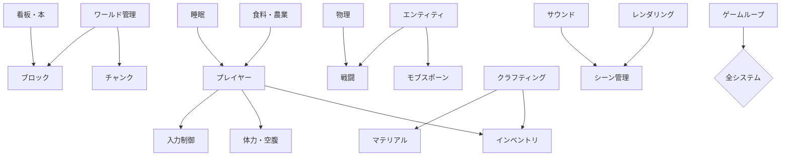

# コア機能仕様書

Minecraft Cloneの基本的なゲーム機能に関する仕様書です。これらは最小限の実行可能な製品としてのMinecraft体験を提供するために必要な機能群です。

## 🌟 主要システム

### 🌍 **ワールド管理**
- **[概要](00-overview.md)** - コア機能の全体概要とシステム間関係
- **[ワールド管理システム](01-world-management-system.md)** - ワールド生成、チャンク管理、プロシージャル生成
- **[チャンクシステム](07-chunk-system.md)** - 16x16x256ブロック単位での世界管理

### 👤 **プレイヤー関連**
- **[プレイヤーシステム](02-player-system.md)** - プレイヤーエンティティ、状態管理、能力
- **[インベントリシステム](01-inventory-system.md)** - アイテム管理、クラフティング、ストレージ
- **[入力制御](18-input-controls.md)** - キーボード・マウス操作の設定とレスポンス

### 🧱 **ワールド構成要素**
- **[ブロックシステム](03-block-system.md)** - ブロックの種類、特性、相互作用
- **[エンティティシステム](04-entity-system.md)** - モブ、アイテム、プロジェクタイルの管理
- **[マテリアルシステム](10-material-system.md)** - ブロックとアイテムの素材定義

### ⚙️ **ゲームプレイシステム**
- **[クラフティングシステム](02-crafting-system.md)** - レシピ管理、アイテム合成
- **[物理システム](06-physics-system.md)** - 重力、衝突検知、物理シミュレーション
- **[体力・空腹システム](12-health-hunger-system.md)** - プレイヤーの生命値と空腹度管理
- **[戦闘システム](13-combat-system.md)** - ダメージ、攻撃、防御メカニズム

### 🎨 **表現システム**
- **[レンダリングシステム](05-rendering-system.md)** - 3D描画、Three.js統合、WebGPU移行
- **[サウンド・音楽システム](15-sound-music-system.md)** - 効果音、BGM、空間オーディオ
- **[シーン管理システム](11-scene-management-system.md)** - ゲームシーンの切り替えと管理

### 🎮 **ゲーム管理**
- **[ゲームループシステム](22-game-loop-system.md)** - フレーム制御、更新順序、パフォーマンス管理
- **[モブスポーンシステム](16-mob-spawning-system.md)** - エンティティの生成と配置

### 🌾 **生活システム**
- **[食料・農業システム](19-food-agriculture-system.md)** - 食料生産、農作物、動物飼育
- **[看板・本システム](20-sign-book-system.md)** - テキスト表示、情報記録
- **[ベッド・睡眠システム](21-bed-sleep-system.md)** - 睡眠、スポーンポイント設定

### 📋 **レガシー文書**
- **[プレイヤー制御](player-controls.md)** - ※入力制御と統合予定

## 🔗 システム関係図

## 📊 実装優先度

### 🚀 **Tier 1 (最重要)**
基本的なMinecraft体験に必須:
1. **ワールド管理** + **チャンク** + **ブロック**
2. **プレイヤー** + **入力制御**
3. **レンダリング** + **物理**
4. **ゲームループ**

### ⭐ **Tier 2 (重要)**
基本ゲームプレイを充実させる:
5. **インベントリ** + **マテリアル**
6. **エンティティ** + **モブスポーン**
7. **クラフティング**
8. **体力・空腹**

### 🎨 **Tier 3 (拡張)**
体験を豊かにする:
9. **戦闘** + **サウンド** + **シーン管理**
10. **食料・農業** + **睡眠** + **看板・本**

## 🔧 技術的特徴

### 📐 **アーキテクチャパターン**
- **DDD**: ドメイン駆動設計による明確な責任分離
- **ECS**: Entity-Component-System による高性能なゲーム処理
- **Effect-TS**: 関数型プログラミングによる安全な副作用管理

### ⚡ **パフォーマンス最適化**
- **チャンクベース**: 効率的なメモリ使用とロード制御
- **LOD**: 距離ベースの詳細度調整
- **フラスタムカリング**: 視界外オブジェクトの描画除外
- **グリーディメッシング**: ボクセル描画の最適化

### 🔄 **拡張性**
各システムは疎結合に設計されており、新機能の追加や既存機能の拡張が容易です。

## 🔗 関連ドキュメント

- **[拡張機能](../enhanced-features/)** - 高度なゲーム機能
- **[API設計](../02-api-design/)** - システム間通信
- **[データモデル](../03-data-models/)** - データ構造設計
- **[アーキテクチャ](../../01-architecture/)** - システム設計思想

---

💡 **ヒント**: 新規機能開発時は、まず該当システムの仕様書を読み、関連システムとの相互作用を理解してから実装を開始してください。
