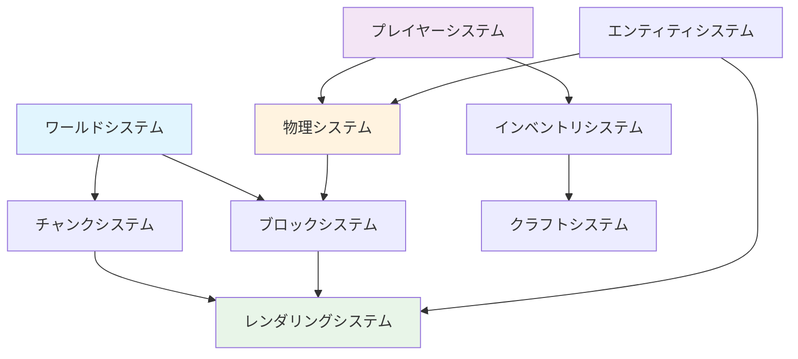

# コア機能 - Minecraftの基本機能

## 概要

コア機能は、Minecraftクローンとして必須となる基本機能群です。各機能は独立した責務を持ち、明確なインターフェースを通じて相互に連携します。

技術的な実装詳細については、以下の専門ドキュメントを参照してください：
- [アーキテクチャ原則](./architecture-principles.md) - 設計思想とパターン
- [PBTテスト戦略](./pbt-testing-strategy.md) - Property-Based Testing
- [実装パターン](./implementation-patterns.md) - Effect-TSの具体的な実装

## コア機能一覧

### 1. ワールドシステム (World System)
- **チャンク生成と管理**: 16x16x384サイズチャンク
- **地形生成**: パーリンノイズベースの自然地形
- **バイオーム処理**: 温度・湿度による生態系管理
- **光源伝播**: ブロック・スカイライトの動的計算

### 2. プレイヤーシステム (Player System)
- **移動・ジャンプ**: 物理法則に準拠した移動系
- **視点制御**: 一人称/三人称視点切り替え
- **ブロック操作**: 配置・破壊のレイキャスト実装
- **インベントリ管理**: 36スロット+ホットバー管理

### 3. ブロックシステム (Block System)
- **ブロックタイプ定義**: 400+種類のブロック仕様
- **物理演算**: 重力・流体・爆発への応答
- **状態管理**: ブロック状態（向き・接続等）
- **更新システム**: 隣接ブロックの相互作用

### 4. エンティティシステム (Entity System)
- **動的スポーン**: バイオーム・時間・難易度連動
- **AI実装**: ステートマシンベースの行動制御
- **物理演算**: 重力・衝突・摩擦の統合処理
- **当たり判定**: AABB（軸並行境界ボックス）

### 5. レンダリングシステム (Rendering System)
- **メッシュ生成**: グリーディメッシング最適化
- **テクスチャ管理**: アトラス・ミップマップ対応
- **視錐台カリング**: フラストラムによる描画最適化
- **LOD管理**: 距離別の詳細度制御

### 6. 物理システム (Physics System)
- **重力システム**: 9.8m/s²の統一重力処理
- **衝突検出**: 空間分割による高速検索
- **流体シミュレーション**: 水・溶岩の伝播系
- **爆発処理**: 球体範囲の破壊・ノックバック

### 7. チャンク管理システム (Chunk System)
- **動的ロード**: プレイヤー視野に基づく管理
- **圧縮保存**: NBT形式によるディスク保存
- **メモリ管理**: LRUキャッシュによる効率化
- **並列処理**: ワーカースレッドでの生成処理

### 8. インベントリシステム (Inventory System)
- **アイテム管理**: スタック・耐久度・エンチャント
- **GUI統合**: 各種コンテナとの連携
- **ドラッグ＆ドロップ**: 直感的操作インターフェース
- **永続化**: NBT形式でのセーブ・ロード

### 9. クラフトシステム (Crafting System)
- **レシピ管理**: JSON定義による柔軟な拡張性
- **クラフト台**: 3x3グリッドでの組み合わせ判定
- **かまど処理**: 燃料消費・精錬時間の管理
- **エンチャント**: 経験値消費による装備強化

### 10. マテリアルシステム (Material System)
- **マテリアル定義**: 各ブロック・アイテムのマテリアル属性
- **ツール効率**: マテリアル別の採掘速度・適正ツール
- **クラフト素材**: 素材の組み合わせとレシピ管理
- **耐久度システム**: マテリアル別の耐久性とエンチャント効果

### 11. シーン管理システム (Scene Management System)
- **シーン遷移制御**: スタート→メイン→ゲームオーバー画面の管理
- **状態機械パターン**: 関数型状態機械による型安全な遷移
- **ライフサイクル管理**: シーンの初期化・更新・終了処理
- **スタック管理**: シーン履歴とポップ・プッシュ操作

## 詳細ドキュメント

各システムの技術詳細と実装方法については、以下を参照してください：

**設計理論**: 個別システムドキュメント（下記関連ドキュメント参照）
**実装手法**: [コア機能実装ガイド](../../how-to/development/core-features-implementation.md)
**テストパターン**: [PBT実装例](../../how-to/testing/pbt-implementation-examples.md)

## システム間の依存関係

### システム構成

**基盤システム**:
1. **ワールドシステム** - 世界の基盤構築
2. **ブロックシステム** - ブロックデータ管理
3. **チャンクシステム** - メモリ・ディスク管理

**プレイヤーシステム**:
4. **プレイヤーシステム** - プレイヤー操作
5. **物理システム** - 移動・衝突
6. **レンダリングシステム** - 3D描画

**拡張システム**:
7. **エンティティシステム** - NPC・モブ
8. **インベントリシステム** - アイテム管理
9. **クラフトシステム** - 製作システム
10. **シーン管理システム** - 画面遷移制御

## ⚠️ 重要な未実装機能

以下の機能は**Minecraft体験にとって必須**ですが、現在のコア機能には含まれていません：

### 🔥 クリティカル機能（即実装が必要）

#### 体力 & 空腹システム
- **設計アプローチ**: ✅ [実装済み](./health-hunger-system.md) - プレイヤーStats ECSコンポーネント
- **実装パターン**: Schema.Structベースの型安全な状態管理
- **技術的考慮**: Effect-TS Refによる状態同期と体力回復ロジック

#### 戦闘システム
- **設計アプローチ**: ✅ [実装済み](./combat-system.md) - ダメージ計算・攻撃判定・効果適用
- **実装パターン**: Entity-Component-System + 物理判定
- **技術的考慮**: 攻撃アニメーション・クールダウン・クリティカル判定

#### Mobスポーン
- **設計アプローチ**: ✅ [実装済み](./mob-spawning-system.md) - バイオーム別スポーン・確率制御
- **実装パターン**: Context.GenericTag + 確率分布・距離制御
- **技術的考慮**: プレイヤー距離・光レベル・バイオーム適合性

#### 死亡 & リスポーン
- **設計アプローチ**: プレイヤーステート管理拡張が必要
- **実装パターン**: Match.value による状態遷移・リスポーン座標管理
- **技術的考慮**: アイテムドロップ・経験値ロスト・ベッドスポーン連携

#### サウンド & 音楽システム
- **設計アプローチ**: ✅ [実装済み](./sound-music-system.md) - 3D音響・BGM・効果音
- **実装パターン**: Web Audio API + Effect-TSリソース管理
- **技術的考慮**: ストリーミング・空間音響・動的音量調整

#### 食料 & 農業システム
- **設計アプローチ**: ✅ [実装済み](./food-agriculture-system.md) - 作物成長・畜産・調理
- **実装パターン**: ECS成長システム + Effect-TSタスクスケジューリング
- **技術的考慮**: バイオーム適合性・季節変化・収穫効率

#### ツール耐久度システム
- **設計アプローチ**: ItemStack拡張が必要
- **実装パターン**: Schema.Structメタデータ + 使用回数追跡
- **技術的考慮**: 修理システム・エンチャント効果・破損アニメーション

#### 経験値 & レベルアップ
- **設計アプローチ**: プレイヤーStats拡張が必要
- **実装パターン**: 累積経験値計算 + レベル式・スキルツリー
- **技術的考慮**: 経験値源泉・レベル上限・能力値ボーナス

### 🏗️ 高優先度機能（近期実装が望ましい）

#### 構造物生成
- **設計アプローチ**: ✅ [実装済み](../enhanced-features/structure-generation.md) - プロシージャル生成
- **実装パターン**: Effect-TS + ノイズベース生成・バイオーム適合性
- **技術的考慮**: 村生成・ダンジョン・要塞・テンプレートシステム

#### 拡張バイオーム
- **設計アプローチ**: ✅ [実装済み](../enhanced-features/extended-biome-system.md) - 海洋・山岳・特殊バイオーム
- **実装パターン**: ノイズ関数 + 高度・温度・湿度パラメータ
- **技術的考慮**: バイオーム遷移・気候システム・独自生成ルール

#### 看板 & 本システム
- **設計アプローチ**: ✅ [実装済み](./sign-book-system.md) - テキスト管理・表示システム
- **実装パターン**: Schema.Struct + Unicode対応・ページネーション
- **技術的考慮**: フォントレンダリング・多言語対応・検索機能

#### ベッド & 睡眠システム
- **設計アプローチ**: ✅ [実装済み](./bed-sleep-system.md) - 睡眠・時間スキップ・スポーン設定
- **実装パターン**: 時間管理システム + プレイヤー状態遷移
- **技術的考慮**: 夜間スキップ・モンスター非活性化・マルチプレイ同期

#### コマンド & デバッグシステム
- **設計アプローチ**: REPLベースコマンドシステム拡張が必要
- **実装パターン**: パーサー + Effect-TS commands + 権限システム
- **技術的考慮**: コマンド補完・履歴・セキュリティ・デバッグUI

#### マップ & ナビゲーション
- **設計アプローチ**: 地図データ構造・レンダリングシステム拡張が必要
- **実装パターン**: チャンクベース地図 + プレイヤー座標追跡
- **技術的考慮**: ミニマップ・ワールドマップ・ウェイポイント・座標HUD

### 🌱 生態系・環境機能
- **動物の繁殖 & 手懐け**: 動物の繁殖・手懐け
- **植物の成長 & 林業**: 植物の成長・伐採システム
- **高度なレッドストーン部品**: 比較器・中継器・高度な回路

### 🌐 マルチプレイヤー機能
- **ネットワークアーキテクチャ**: クライアント・サーバー基盤
- **プレイヤー同期**: マルチプレイヤー状態同期
- **コミュニケーション**: チャット・ボイス機能
- **ジ・エンド次元**: エンダードラゴン・エンドシティ

これらの機能の詳細な実装計画については、個別のシステムドキュメントを参照してください。

## 実装について

コア機能の設計思想とアーキテクチャ原則は以下で説明されています：

**設計アプローチ**:
- [アーキテクチャ原則](./architecture-principles.md) - Effect-TS + ECS設計思想
- [実装パターン](./implementation-patterns.md) - 関数型プログラミングパターン
- [PBTテスト戦略](./pbt-testing-strategy.md) - Property-Based Testing理論

**具体的な実装方法**:
- [コア機能実装ガイド](../../how-to/development/core-features-implementation.md) - 実践的実装手法
- [PBT実装例](../../how-to/testing/pbt-implementation-examples.md) - テストコード例

## システム間の依存関係

### システム構成

**基盤システム**:
1. **ワールドシステム** - 世界の基盤構築
2. **ブロックシステム** - ブロックデータ管理
3. **チャンクシステム** - メモリ・ディスク管理

**プレイヤーシステム**:
4. **プレイヤーシステム** - プレイヤー操作
5. **物理システム** - 移動・衝突
6. **レンダリングシステム** - 3D描画

**拡張システム**:
7. **エンティティシステム** - NPC・モブ
8. **インベントリシステム** - アイテム管理
9. **クラフトシステム** - 製作システム
10. **シーン管理システム** - 画面遷移制御

## 関連ドキュメント

**基盤システム**:
- [ワールド管理システム](./world-management-system.md) - 世界・バイオーム・地形生成
- [ブロックシステム](./block-system.md) - ブロックタイプ・状態管理
- [チャンクシステム](./chunk-system.md) - チャンク分割・ロード管理

**プレイヤーシステム**:
- [プレイヤーシステム](./player-system.md) - 移動・操作・ステータス
- [物理システム](./physics-system.md) - 重力・衝突・流体
- [レンダリングシステム](./rendering-system.md) - 3D描画・最適化

**拡張システム**:
- [エンティティシステム](./entity-system.md) - エンティティ・AI・スポーン
- [インベントリシステム](./inventory-system.md) - インベントリ・アイテム
- [クラフトシステム](./crafting-system.md) - クラフト・レシピ・エンチャント
- [シーン管理システム](./scene-management-system.md) - シーン管理・画面遷移

**アーキテクチャ関連**:
- [システム全体設計](../../architecture/architecture-overview.md) - アーキテクチャ概要
- [ドメイン・アプリケーションAPI](../../architecture/domain-application-apis.md) - DDD境界づけられたコンテキスト
- [インフラストラクチャAPI](../../architecture/infrastructure-architecture.md) - ECSアーキテクチャ統合
- [データフロー図](../../architecture/data-flow-diagram.md) - システム間データフロー

## 関連用語

主要な技術用語については以下を参照してください：
- [用語集](../../reference/glossary.md) - プロジェクト全体の技術用語辞典
