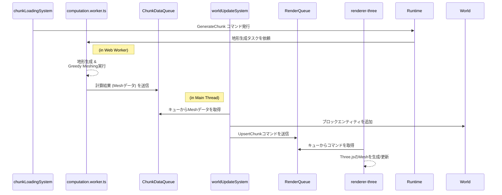

# レンダリング

-   **関連ソース**:
    -   [`src/infrastructure/renderer-three/`](../../src/infrastructure/renderer-three/)
    -   [`src/systems/world-update.ts`](../../src/systems/world-update.ts)
    -   [`src/workers/computation.worker.ts`](../../src/workers/computation.worker.ts)

---

## 1. 設計思想: 関心の分離

レンダリングパイプラインは、**ゲームロジック**（何を描画すべきか）と**レンダリングエンジン**（どのように描画するか）の責務を明確に分離するように設計されています。これにより、一方の変更が他方に影響を与えにくくなり、コードの保守性とテスト容易性が向上します。

この分離を実現するため、両者の間には **`ChunkDataQueue`** と **`RenderQueue`** という2つの非同期キューが介在します。ゲームロジック（System）は直接Three.jsのAPIを呼び出すのではなく、描画したい内容をコマンドとして`RenderQueue`に送信し、それ以降の処理を`Renderer`に委任します。

## 2. レンダリングパイプライン (地形データフロー)

プレイヤーが新しい領域に移動した際の、チャンク生成から描画までの非同期データフローは以下のようになります。

### 各ステップの解説

1.  **`chunkLoadingSystem`**: プレイヤーの移動を検知し、新しく必要になったチャンクの `GenerateChunk` コマンドを発行します。
2.  **`computation.worker.ts` (Web Worker)**: メインスレッドをブロックしないよう、バックグラウンドで重い計算処理（地形生成、Greedy Meshing）を実行し、結果のメッシュデータを `ChunkDataQueue` に送信します。
3.  **`worldUpdateSystem`**:
    -   メインスレッドで `ChunkDataQueue` を監視し、データがあれば1フレームに1つだけ取り出します（負荷分散）。
    -   取り出したデータに基づき、ブロックのエンティティを `World` に追加します。
    -   メッシュデータをレンダリング可能なコマンド（`UpsertChunk`）に変換し、`RenderQueue` に送信します。
    -   **注**: このシステムはキューを直接操作するため、副作用を持ちます。
4.  **`renderer-three`**: `RenderQueue` を監視し、コマンドを受け取って初めてThree.jsのAPIを呼び出し、シーンにメッシュを実際に生成・更新・削除します。

## 3. `renderer-three` の内部アーキテクチャ

Three.jsを用いた具体的なレンダリング処理は `src/infrastructure/renderer-three/` にカプセル化されており、責務に応じてさらにモジュール分割されています。

-   **`context.ts`**: Three.jsの `WebGLRenderer`, `Scene`, `PerspectiveCamera` といった、アプリケーション全体で単一のインスタンスを持つべきコアオブジェクトを管理する `ThreeContext` を提供します。
-   **`updates.ts`**: `RenderQueue` を監視し、`UpsertChunk` のようなコマンドを受け取って処理する責務を持ちます。コマンドに応じて、Three.jsの `BufferGeometry` や `Mesh` を生成・更新します。
-   **`render.ts`**: 毎フレームのレンダリング処理そのものを担当します。`requestAnimationFrame` ループの中で、シーンのクリア、カメラとWorldの状態の同期、ハイライト用オブジェクトの更新、`InstancedMesh` の更新、そして最終的なシーンの描画を行います。
-   **`index.ts`**: 上記のモジュールを統合し、アプリケーションの他レイヤーに対して統一された `Renderer` インターフェースを提供します。

## 4. 最適化手法

広大なボクセルワールドをリアルタイムで描画するため、以下の最適化手法を適用しています。

### Greedy Meshing (地形)

地形は何百万ものブロックで構成されるため、そのまま描画するとパフォーマンスが破綻します。この問題を解決するのが **Greedy Meshing** アルゴリズムです。隣接する同じ種類のブロックを検出し、それらを一つの大きな面（ポリゴン）に統合することで、頂点数とドローコールを劇的に削減します。この計算は非常に負荷が高いため、`computation.worker.ts` 内のWeb Workerで完全に非同期に実行されます。

### Instanced Rendering (動的オブジェクト)

プレイヤーやMOBなど、ワールド内を移動するオブジェクトには **Instanced Rendering** という手法を用います。Three.jsの `InstancedMesh` を使用し、同じ形状と材質を持つ多数のオブジェクトを**一度のドローコール**でまとめてレンダリングします。`render.ts` 内の `updateInstancedMeshes` 関数が、毎フレーム、動的オブジェクトの `Position` コンポーネントなどから最新の状態を行列として `InstancedMesh` に反映させています。