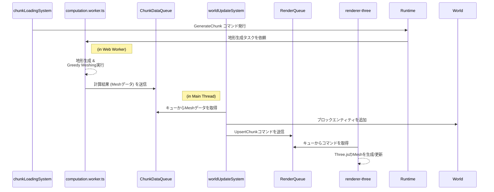

# レンダリング

- **関連ソース**:
  - [`src/infrastructure/renderer-three/`](../../src/infrastructure/renderer-three/)
  - [`src/systems/world-update.ts`](../../src/systems/world-update.ts)
  - [`src/workers/computation.worker.ts`](../../src/workers/computation.worker.ts)

---

## 1. 設計思想: 関心の分離

レンダリングパイプラインは、**ゲームロジック**（何を描画すべきか）と**レンダリングエンジン**（どのように描画するか）の責務を明確に分離するように設計されています。これにより、一方の変更が他方に影響を与えにくくなり、コードの保守性とテスト容易性が向上します。

この分離を実現するため、両者の間には **`ChunkDataQueue`** と **`RenderQueue`** という2つの非同期キューが介在します。ゲームロジック（System）は直接Three.jsのAPIを呼び出すのではなく、描画したい内容をコマンドとして`RenderQueue`に送信し、それ以降の処理を`Renderer`に委任します。

## 2. レンダリングパイプライン (地形データフロー)

プレイヤーが新しい領域に移動した際の、チャンク生成から描画までの非同期データフローは以下のようになります。

### 各ステップの解説

1.  **`chunkLoadingSystem`**: プレイヤーの移動を検知し、新しく必要になったチャンクの `GenerateChunk` コマンドを発行します。
2.  **`computation.worker.ts` (Web Worker)**: メインスレッドをブロックしないよう、バックグラウンドで重い計算処理（地形生成、Greedy Meshing）を実行し、結果のメッシュデータを `ChunkDataQueue` に送信します。
3.  **`worldUpdateSystem`**:
    - メインスレッドで `ChunkDataQueue` を監視し、データがあれば1フレームに1つだけ取り出します（負荷分散）。
    - 取り出したデータに基づき、ブロックのエンティティを `World` に追加します。
    - メッシュデータをレンダリング可能なコマンド（`UpsertChunk`）に変換し、`RenderQueue` に送信します。
    - **注**: このシステムはキューを直接操作するため、副作用を持ちます。
4.  **`renderer-three`**: `RenderQueue` を監視し、コマンドを受け取って初めてThree.jsのAPIを呼び出し、シーンにメッシュを実際に生成・更新・削除します。

## 3. `renderer-three` の内部アーキテクチャ

Three.jsを用いた具体的なレンダリング処理は `src/infrastructure/renderer-three/` にカプセル化されており、責務に応じてさらにモジュール分割されています。

- **`context.ts`**: Three.jsの `WebGLRenderer`, `Scene`, `PerspectiveCamera` といった、アプリケーション全体で単一のインスタンスを持つべきコアオブジェクトを管理する `ThreeContext` を提供します。
- **`updates.ts`**: `RenderQueue` を監視し、`UpsertChunk` のようなコマンドを受け取って処理する責務を持ちます。コマンドに応じて、Three.jsの `BufferGeometry` や `Mesh` を生成・更新します。
- **`render.ts`**: 毎フレームのレンダリング処理そのものを担当します。`requestAnimationFrame` ループの中で、シーンのクリア、カメラとWorldの状態の同期、ハイライト用オブジェクトの更新、`InstancedMesh` の更新、そして最終的なシーンの描画を行います。
- **`index.ts`**: 上記のモジュールを統合し、アプリケーションの他レイヤーに対して統一された `Renderer` インターフェースを提供します。

## 4. 最適化手法

広大なボクセルワールドをリアルタイムで描画するため、以下の最適化手法を適用しています。

### Greedy Meshing (地形)

地形は何百万ものブロックで構成されるため、そのまま描画するとパフォーマンスが破綻します。この問題を解決するのが **Greedy Meshing** アルゴリズムです。隣接する同じ種類のブロックを検出し、それらを一つの大きな面（ポリゴン）に統合することで、頂点数とドローコールを劇的に削減します。この計算は非常に負荷が高いため、`computation.worker.ts` 内のWeb Workerで完全に非同期に実行されます。

### Instanced Rendering (動的オブジェクト)

プレイヤーやMOBなど、ワールド内を移動するオブジェクトには **Instanced Rendering** という手法を用います。Three.jsの `InstancedMesh` を使用し、同じ形状と材質を持つ多数のオブジェクトを**一度のドローコール**でまとめてレンダリングします。`render.ts` 内の `updateInstancedMeshes` 関数が、毎フレーム、動的オブジェクトの `Position` コンポーネントなどから最新の状態を行列として `InstancedMesh` に反映させています。

---

## 5. ターゲット更新システム (Update Target System)

このシステムは、プレイヤーの視線にあるオブジェクトを特定し、その情報を`Target`コンポーネントに記録する責務を持ちます。

### 設計思想: 関心の分離

この機能は、**関心の分離**を強く重視して設計されています。

- **`RaycastService` (インフラストラクチャ層)**: Three.jsのような特定のレンダリングエンジンを使用して、シーンに対してレイキャストを実行する*方法*を知っています。レンダラーの低レベルな詳細を抽象化します。
- **`updateTargetSystem` (システム層)**: レイキャストが*なぜ*必要なのかを知っています。`RaycastService`を呼び出して結果を取得し、プレイヤーの`Target`コンポーネントを更新します。
- **`blockInteractionSystem` (システム層)**: `Target`コンポーネントを読み取り、ブロックの設置や破壊などの*アクション*を実行します。

この設計により、ゲームロジック(`updateTargetSystem`)がレンダリングエンジンの詳細から完全に分離されることが保証されます。

### `updateTargetSystem`の責務

`updateTargetSystem`の責務は、ワールドの状態をクエリし、その結果を別の状態として記録することに限定されています。

1.  **レイキャストの実行**: カメラの中心から発せられるレイキャストの結果を取得するために`RaycastService`を呼び出します。
2.  **ターゲットが見つかった場合**:
    - `RaycastService`は、ヒットしたメッシュの`instanceId`を含む交差情報を返します。`RenderContext`に保存されているマップを使用して、この`instanceId`を特定の`EntityId`に変換します。
    - システムは、プレイヤーエンティティに`Target`コンポーネントをアタッチ（または更新）します。このコンポーネントには、ターゲットブロックの`EntityId`、その`Position`、およびレイがヒットした面の法線ベクトルが含まれます。
    - また、`RenderContext`内の`TargetHighlight`状態を更新します。これは、`renderer`がターゲットブロックの周りに視覚的なハイライト（例：アウトライン）を描画するために使用します。
3.  **ターゲットが見つからない場合**:
    - プレイヤーエンティティから`Target`コンポーネントを削除します。
    - `RenderContext`の`TargetHighlight`状態をクリアし、シーンから視覚的なハイライトを削除します。

### データフロー

`Input` -> `cameraControlSystem` -> `CameraState` -> `RaycastService` -> **`updateTargetSystem`** -> `Target`

1.  `cameraControlSystem`は`CameraState`コンポーネントのカメラの向きを更新します。
2.  `RaycastService`は、呼び出されると、内部的に現在のカメラ状態（Three.jsコンテキスト経由）を使用してレイキャストを実行します。
3.  `updateTargetSystem`は`RaycastService`を呼び出します。
4.  `updateTargetSystem`は返された結果を受け取り、プレイヤーエンティティに`Target`コンポーネントをアタッチします。
5.  `blockInteractionSystem`のような後続のシステムは、この`Target`コンポーネントを読み取って、プレイヤーが見ているものに基づいてアクションを実行できます。

---

## 6. UIシステム (UI System)

UIシステムは、ホットバー、クロスヘア、ゲームメニューなど、ゲームの情報をプレイヤーに表示する責務を担います。ECSの `World` の状態や、より高レベルな `GameState` サービスと、ユーザーが目にするHTML/DOM要素との間の橋渡しをします。

### UIの状態管理

UIシステムは、エンティティのコンポーネントを直接クエリするのではなく、主に `GameState` サービスを集約された状態のソースとして利用します。

- **`GameState` サービス**: ゲームの全体的な状態（例: `Title`, `InGame`, `Paused`）や、UIに表示する必要のある状態を保持します。
  - **`hotbar`**: `GameState` 内に保持されるオブジェクトで、プレイヤーのホットバーの状態を含みます。
    - `slots`: ホットバー内のアイテムを表す `BlockType` の配列。
    - `selectedSlot`: 現在選択されているスロットのインデックス。

### `uiSystem` の責務

- **ソース**: `src/systems/ui.ts`

UIのレンダリングロジックは `uiSystem` が担当します。このシステムは毎フレーム実行され、`GameState` サービスから最新の状態を読み取り、DOMを直接操作してUIを更新します。

#### 処理フロー

1.  **`GameState` の取得**: `GameState` サービスにアクセスし、現在のゲーム状態（特にホットバーの状態）を取得します。
2.  **DOM要素の更新**: 取得した状態に基づいて、対応するDOM要素を更新します。
    - **ホットバーのレンダリング**: 9つのホットバースロット（`slot1` から `slot9` のIDを持つHTML要素）をループ処理します。
    - **テクスチャの表示**: 各スロットに対応する `BlockType` が存在する場合、そのブロックのテクスチャ画像（例: `/assets/grass/side.jpeg`）をスロット要素の `backgroundImage` として設定します。
    - **選択スロットのハイライト**: 現在選択されているスロットのインデックスとループのインデックスが一致する場合、そのDOM要素に `selected` CSSクラスを追加して視覚的にハイライトします。それ以外のスロットからは `selected` クラスを削除します。

### UIイベントと状態遷移

UIの見た目を更新するのは `uiSystem` の役割ですが、ユーザーからの入力（クリックなど）を処理するのは `infrastructure` 層の役割です。

- **イベントリスナー**: メニューボタンのクリックや、ゲームのロード/セーブといったUI操作のイベントリスナーは `src/infrastructure/ui.ts` に実装されています。
- **状態遷移**: ユーザーが「New Game」ボタンをクリックすると、`infrastructure/ui.ts` のイベントリスナーが `GameState` サービスのメソッドを呼び出し、ゲームの状態を `Title` から `InGame` に遷移させます。
- **分離**: このように、UIの「書き込み」（DOM更新）を `uiSystem` が、「読み取り」（イベント処理）を `infrastructure` 層が担当することで、関心の分離が図られています。

`uiSystem` は `GameState` のシーン（`Title`, `InGame`, `Paused`）を監視し、現在のシーンに応じて表示するUI（例: メインメニュー、HUD）を切り替える役割も担うことができます。
