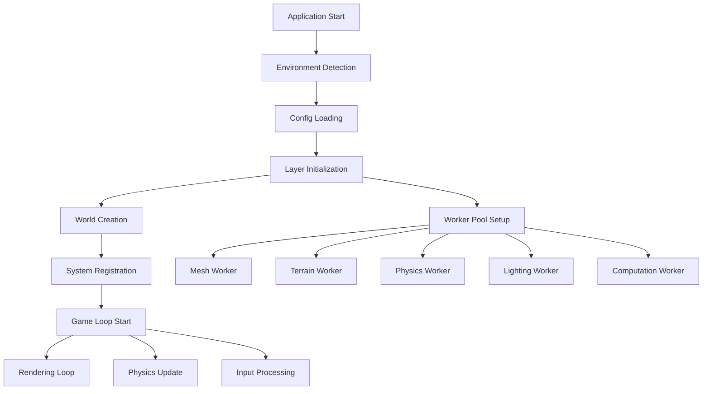

# エントリーポイント解説

このドキュメントでは、ts-minecraftプロジェクトの各エントリーポイントと起動フローについて詳しく解説します。

## 主要エントリーポイント

### 1. メインエントリーポイント (`src/main.ts`)

アプリケーション全体の中核となるエントリーポイントです。ゲームエンジンの初期化とゲームループの管理を行います。

```typescript
// メイン関数の構造
const main = (player: Archetype): Effect.Effect<void, AppInitError | GameLoopError, World> =>
  pipe(
    World,
    Effect.tap(() => Effect.log(`Application starting with player: ${JSON.stringify(player)}`)),
    Effect.flatMap((world) =>
      pipe(
        world.initialize(),
        Effect.catchAll((error) =>
          new AppInitError({
            message: 'World initialization failed',
            timestamp: Date.now(),
            cause: error,
            stage: 'world_initialization',
          })
        ),
        Effect.flatMap(() => gameLoop(gameSystems)),
      ),
    ),
  )
```

**主な責任**:
- ワールドの初期化
- ゲームシステムの起動
- ゲームループの実行
- エラーハンドリング

**起動フロー**:
1. プレイヤーアーキタイプの受け取り
2. ワールドサービスの取得
3. ワールドの初期化
4. ゲームループの開始

### 2. Webアプリエントリーポイント (`src/presentation/web/main.ts`)

Webブラウザ向けのユーザーインターフェースとレンダリングを担当するエントリーポイントです。

```typescript
// Webアプリケーションの開始
const startWebApplication = () => {
  return Effect.runFork(WebApp)
}
```

**主な責任**:
- DOM操作とイベントハンドリング
- Three.jsによる3Dレンダリング
- ユーザー入力の処理
- プレゼンテーションレイヤーの管理

**起動フロー**:
1. DOMの初期化
2. Three.jsレンダラーのセットアップ
3. イベントリスナーの登録
4. レンダリングループの開始

## Workerエントリーポイント

重い処理をメインスレッドから分離するために、複数のWeb Workerを使用しています。

### 1. メッシュ生成Worker (`mesh-generation.worker.ts`)

```typescript
// メッシュ生成の主要処理
const generateMeshData = (chunkData: ChunkData) => 
  Effect.gen(function* () {
    const neighbors = yield* createNeighborLookup(chunkData)
    const faces = yield* generateBlockFaces(chunkData, neighbors)
    const optimized = yield* applyOptimizations(faces)
    return createTransferableVertexData(optimized)
  })
```

**責任**:
- チャンクデータからメッシュを生成
- 面の最適化（Greedy Meshing）
- 転送可能なバッファの作成

### 2. 地形生成Worker (`terrain-generation.worker.ts`)

**責任**:
- ノイズベースの地形生成
- バイオーム生成
- 鉱物配置

### 3. 物理演算Worker (`physics.worker.ts`)

**責任**:
- 衝突判定
- 剛体シミュレーション
- パーティクルシステム

### 4. ライティングWorker (`lighting.worker.ts`)

**責任**:
- ライトの伝播計算
- 影の生成
- アンビエントオクルージョン

### 5. 計算Worker (`computation.worker.ts`)

**責任**:
- 汎用的な数値計算
- データ変換処理
- バックグラウンド処理

## テストエントリーポイント

### Vitestテスト設定

```typescript
// vitest.config.ts での設定
export default defineConfig({
  test: {
    environment: 'jsdom', // DOM APIが必要なテスト用
    globals: true,        // グローバルテスト関数の有効化
  },
})
```

**レイヤー別テスト構成**:

- `vitest.shared.config.ts` - 共通ライブラリのテスト
- `vitest.infrastructure.config.ts` - インフラレイヤーのテスト  
- `vitest.presentation.config.ts` - プレゼンテーションレイヤーのテスト

## 起動フローの詳細

### 完全な起動シーケンス



### 1. 環境検出フェーズ

```typescript
const environment = Effect.gen(function* () {
  const capabilities = yield* detectCapabilities
  const config = yield* loadConfig(capabilities)
  return { capabilities, config }
})
```

- WebGPU/WebGL対応の確認
- デバイス性能の評価
- 最適な設定の決定

### 2. 設定読み込みフェーズ

```typescript
const appConfig = Effect.gen(function* () {
  const userConfig = yield* loadUserConfig
  const gameConfig = yield* loadGameConfig  
  const infraConfig = yield* loadInfrastructureConfig
  return mergeConfigs(userConfig, gameConfig, infraConfig)
})
```

### 3. レイヤー初期化フェーズ

依存性注入とサービスの初期化：

```typescript
const AppLive = Layer.mergeAll(
  ConfigServiceLive,
  RendererLive,
  InputServiceLive,
  PhysicsEngineLive,
  TerrainGeneratorLive,
)
```

### 4. ワールド作成とシステム登録

```typescript
const initialize = Effect.gen(function* () {
  const world = yield* World.create
  yield* registerCoreSystems(world)
  yield* registerGameSystems(world)
  yield* registerRenderingSystems(world)
  return world
})
```

### 5. ゲームループ開始

```typescript
const gameLoop = (systems: GameSystemFunction[]) =>
  Effect.gen(function* () {
    while (true) {
      const deltaTime = yield* getDeltaTime
      yield* Effect.allPar(systems.map(system => system(deltaTime)))
      yield* Effect.sleep(16) // ~60 FPS
    }
  })
```

## エラーハンドリング

各エントリーポイントでの適切なエラーハンドリング：

### メインエントリー

```typescript
const handleMainErrors = (error: AppInitError | GameLoopError) =>
  match(error, {
    AppInitError: (err) => 
      Effect.log(`Initialization failed: ${err.message}`) *>
      Effect.fail(err),
    GameLoopError: (err) =>
      Effect.log(`Game loop error: ${err.message}`) *>
      restartGameLoop,
  })
```

### Workerエラー

```typescript
const workerErrorHandler = (error: WorkerError) =>
  Effect.gen(function* () {
    yield* Effect.log(`Worker error: ${error.message}`)
    yield* reportErrorToMain(error)
    
    // 重要でないWorkerは再起動
    if (error.severity === "recoverable") {
      yield* restartWorker
    }
  })
```

## デバッグとプロファイリング

### 開発時の起動オプション

```typescript
// 開発環境での追加初期化
if (process.env.NODE_ENV === 'development') {
  yield* initializeDevTools
  yield* startPerformanceMonitoring
  yield* enableHotReload
}
```

### プロファイリング有効化

```typescript
const profilingConfig = {
  enableFPSCounter: true,
  enableMemoryMonitor: true,
  enableWorkerProfiling: true,
  logSystemTiming: true,
}
```

## パフォーマンス最適化

### 遅延初期化

重要でない機能は必要な時まで初期化を遅延：

```typescript
const lazyServices = {
  audioEngine: lazy(() => createAudioEngine()),
  particleSystem: lazy(() => createParticleSystem()),
  networkManager: lazy(() => createNetworkManager()),
}
```

### Worker Pool の最適化

```typescript
const workerPoolConfig = {
  meshWorkers: Math.min(navigator.hardwareConcurrency, 4),
  computeWorkers: Math.max(1, navigator.hardwareConcurrency - 2),
  dedicatedPhysicsWorker: true,
}
```

このエントリーポイントの理解により、アプリケーションの全体的な構造と起動プロセスを把握できます。