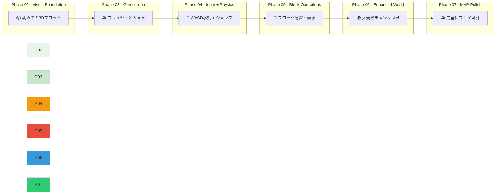
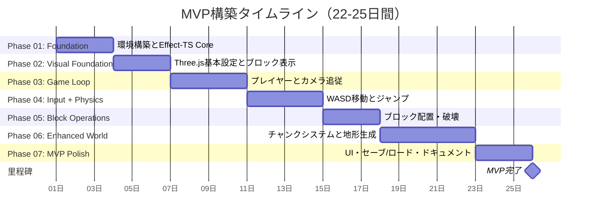

# 高速開発アプローチ - フェーズベースMVP完結

## 概要

本プロジェクトは**従来の20週間開発スケジュールを7フェーズ（約22-25日間）に圧縮**する高速開発アプローチを採用しています。**視覚的進捗重視**と**Effect-TSパターンの活用**により、早期にプレイ可能なMVPを構築します。

> **現在の状態**: Phase 07でMVPを達成後、Phase 08-10でEffect-TSアライメント・型安全性・テストカバレッジの継続的改善を実施。

### 開発期間の比較

| アプローチ | 期間 | マイルストーン数 | 視覚的フィードバック |
|---------|------|--------------|----------------------|
| 従来方式 | 20週間 | 20フェーズ | 後半（10週目以降） |
| 高速アプローチ | **22-25日間** | 7フェーズ | **早期（Phase 02開始時）** |

**主なメリット**:
- ✅ **早期視覚化**: Day 6で最初の3Dブロック表示
- ✅ **プレイ可能なMVP**: 22-25日間で完全なゲームループ
- ✅ **継続的フィードバック**: 各フェーズで検証可能な成果物
- ✅ **リスク低減**: 早期に技術的課題を発見・対処
- ✅ **モチベーション維持**: 短期的な達成感によるチームの継続性

---

## 視覚的進捗の階層

各フェーズは前のフェーズに積み重なるように構築され、徐々に機能が増えていきます。



### 各フェーズの視覚的成果

| フェーズ | 期間 | 視覚的成果 | ブラウザで確認 |
|---------|------|------------|----------------|
| **Phase 02** | Day 4-6 | 📦 **最初の3Dブロック表示** | 単一立方体のレンダリング |
| **Phase 03** | Day 7-10 | 🎮 プレイヤーキャラクター + カメラ追従 | アニメーションするシーン |
| **Phase 04** | Day 11-14 | 🚶 WASD移動 + ジャンプ | 自由に動けるプレイヤー |
| **Phase 05** | Day 15-17 | 🔨 ブロック配置・破壊 | **コアゲームプレイ実装** |
| **Phase 06** | Day 18-22 | 🌍 大規模チャンク世界 | 地形を探索可能 |
| **Phase 07** | Day 23-25 | 🎮 **完全にプレイ可能なMVP** | セーブ/ロード付き完全ゲーム |

---

## Effect-TSパターンの活用

Effect-TSパターンを一貫して使用することで、**副作用のないコード**と**明確なデータフロー**を実現します。

### 主要パターンと使用場面

#### 1. Effect.Service（サービス層）

各ドメインサービスは`Effect.Service`クラスで定義し、副作用をカプセル化します。

```typescript
// src/application/block/block-service.ts
export class BlockService extends Effect.Service<BlockService>()(
  '@minecraft/application/BlockService',
  {
    effect: Effect.gen(function* () {
      const commandQueue = yield* Queue.dropping<BlockCommand>(100)

      return {
        placeBlock: (pos: Position, type: BlockType): Effect.Effect<void> =>
          Queue.offer(commandQueue, { _tag: 'PlaceBlock', position: pos, blockType: type }),

        breakBlock: (pos: Position): Effect.Effect<void> =>
          Queue.offer(commandQueue, { _tag: 'BreakBlock', position: pos }),
      }
    }),
  }
) {}
```

**使用場面**:
- 🔨 ブロック配置・破壊の非同期処理
- 🌍 チャンクのロード・アンロード
- 🎮 プレイヤーの移動処理

#### 2. Effect.gen（ジェネレーターベースのEffect）

コマンドパターンとゲームループで使用します。

```typescript
// Effect.gen でサービスを取得して操作を実行
export const placeBlock = (pos: Position, type: BlockType): Effect.Effect<void, never, BlockService> =>
  Effect.gen(function* () {
    const blockService = yield* BlockService
    yield* blockService.placeBlock(pos, type)
  })
```

**使用場面**:
- 🎮 ユーザー入力への応答
- 🌍 チャンク管理の連鎖処理
- 🔄 ゲームループの各フレーム処理

#### 3. Ref（不変参照）

共有状態を安全に管理します。

```typescript
// Effect.Service 内で Ref.make を使用して状態を管理
export class WorldService extends Effect.Service<WorldService>()(
  '@minecraft/application/WorldService',
  {
    effect: Effect.gen(function* () {
      const positionRef = yield* Ref.make<Position>({ x: 0, y: 64, z: 0 })

      return {
        getPosition: (): Effect.Effect<Position> =>
          Ref.get(positionRef),

        updatePosition: (pos: Position): Effect.Effect<void> =>
          Ref.set(positionRef, pos),
      }
    }),
  }
) {}
```

**使用場面**:
- 🌍 ワールド状態の一元管理
- 📦 ブロックデータの共有
- 🎮 プレイヤー状態の追跡

#### 4. Queue（非同期処理キュー）

ゲームループとサービス間の非同期通信に使用します。

```typescript
// src/application/game-loop/index.ts
export class GameLoopService extends Effect.Service<GameLoopService>()(
  '@minecraft/application/GameLoopService',
  {
    effect: Effect.gen(function* () {
      const frameQueue = yield* Queue.unbounded<FrameMessage>()

      return {
        start: (handler: (dt: DeltaTimeSecs) => Effect.Effect<void>): Effect.Effect<void, never, Scope> =>
          Effect.forkScoped(
            Effect.gen(function* () {
              yield* Effect.repeat(
                Queue.take(frameQueue).pipe(Effect.flatMap(msg => handler(msg.deltaTime))),
                Schedule.forever
              )
            })
          ).pipe(Effect.asVoid),
      }
    }),
  }
) {}

**使用場面**:
- 🎮 ゲームループのコマンド処理
- 🌍 チャンクの遅延ロード
- 🔄 物理シミュレーション

#### 5. Effect.acquireRelease（スコープ管理）

スコープ終了時のリソース解放を保証します。`Effect.scoped` と組み合わせてリソースを安全に管理します。

```typescript
// Effect.acquireRelease でイベントリスナーのライフサイクルを管理
yield* Effect.acquireRelease(
  Effect.sync(() => {
    canvas.addEventListener('click', handleClick)
    document.addEventListener('visibilitychange', handleVisibility)
  }),
  () => Effect.sync(() => {
    canvas.removeEventListener('click', handleClick)
    document.removeEventListener('visibilitychange', handleVisibility)
  })
)
```

**使用場面**:
- 🎮 ゲームセッションのライフサイクル管理
- 🔄 テストの一時環境構築
- 🧪 クリーンアップ処理の保証

---

## アーキテクチャ上の決定事項

### 1. DDD + ECSハイブリッド設計

**設計思想**: ドメイン駆動設計の明確な境界と、ECSの高性能データ構造を融合。

```typescript
// ドメイン: ビジネスルールを定義
export interface Block {
  readonly id: string
  readonly position: Position
  readonly type: BlockType
}

// ECS: 高性能データ構造
export interface BlockComponent {
  readonly position: Float64Array // TypedArray for performance
  readonly type: Uint8Array       // Compact storage
}
```

**メリット**:
- ✅ **明確なドメイン境界**: ビジネスロールがドメインに局所化
- ✅ **高い型安全性**: Schemaによるコンパイル時チェック
- ✅ **パフォーマンス最適化**: ECS配列による高速アクセス
- ✅ **スケーラビリティ**: ドメイン拡張がシステム追加のみで可能

### 2. ボクセル物理と動的コライダー

**設計思想**: Minecraftのボクセル世界特性に最適化された物理シミュレーション。

```typescript
// AABB（Axis-Aligned Bounding Box）コリジョン
export interface AABB {
  readonly min: Vector3
  readonly max: Vector3
}

export const checkCollision = (
  position: Vector3,
  chunk: ChunkData
): boolean => {
  // 動的コライダー生成
  const playerBox: AABB = {
    min: { x: position.x - 0.3, y: position.y, z: position.z - 0.3 },
    max: { x: position.x + 0.3, y: position.y + 1.8, z: position.z + 0.3 }
  }

  // チャンク内のブロックと交差検出
  for (const block of chunk.blocks) {
    if (intersect(playerBox, block.boundingBox)) {
      return true
    }
  }
  return false
}
```

**特徴**:
- ✅ **動的コライダー生成**: プレイヤー位置に応じて即時生成
- ✅ **高速交差検出**: AABBボリュームによるO(1)判定
- ✅ **効率な空間分割**: チャンクベースのロード管理
- ✅ **スムーズな移動**: 物理シミュレーションとレンダリングの分離

### 3. ゲームループ：RAFブリッジ + Effectキュー

**設計思想**: `requestAnimationFrame`とEffectの非同期処理をブリッジ。

```typescript
// src/application/game-loop/index.ts
// RAFブリッジ: requestAnimationFrame と Effect Queue を橋渡し
// IMPORTANT: rAFコールバック内では Effect.runSync は禁止 (hot path)
// 代わりに closure boolean (_isRunning) を使用

export class GameLoopService extends Effect.Service<GameLoopService>()(
  '@minecraft/application/GameLoopService',
  {
    effect: Effect.gen(function* () {
      const frameQueue = yield* Queue.unbounded<DeltaTimeSecs>()
      let _isRunning = false // INTENTIONAL: plain boolean for rAF hot path

      const bridgeLoop = (prevTime: number) => {
        if (!_isRunning) return
        const now = performance.now()
        const deltaTime = (now - prevTime) / 1000 as DeltaTimeSecs
        Effect.runFork(Queue.offer(frameQueue, deltaTime).pipe(Effect.catchAllCause(() => Effect.void)))
        requestAnimationFrame(() => bridgeLoop(now))
      }

      return {
        start: (handler: (dt: DeltaTimeSecs) => Effect.Effect<void>): Effect.Effect<void, never, Scope> =>
          Effect.gen(function* () {
            _isRunning = true
            requestAnimationFrame((t) => bridgeLoop(t))
            yield* Effect.forkScoped(
              Effect.repeat(
                Queue.take(frameQueue).pipe(Effect.flatMap(handler)),
                Schedule.forever
              )
            )
          }),

        stop: (): Effect.Effect<void> =>
          Effect.sync(() => { _isRunning = false }),
      }
    }),
  }
) {}
```

**特徴**:
- ✅ **60FPS保証**: RAFとスリープによる精確なフレーム制御
- ✅ **非同期コマンド処理**: UIスレッドとゲームループの分離
- ✅ **Efficient Resource Management**: 副作用をキューで管理
- ✅ **スケーラビリティ**: コマンドタイプの拡張が容易

---

## フェーズタイムラインとマイルストーン

### MVP達成までの7フェーズ



### 詳細なマイルストーン

#### Phase 01: Foundation + Effect-TS Core（3日間）
- **期間**: Day 1-3
- **目的**: 開発環境とEffect-TSパターンの確立
- **成果物**:
  - ✅ `package.json`と依存関係設定
  - ✅ Effect-TS共通カーネル（Layer, Tag, Context）
  - ✅ TypeScriptコンパイル環境
  - ✅ 基本的なLayer定義
- **検証**: `pnpm build`が成功すること

#### Phase 02: Visual Foundation - Three.js（3日間）
- **期間**: Day 4-6
- **目的**: Three.jsによる3Dレンダリングの基盤構築
- **成果物**:
  - ✅ **📦 最初の3Dブロック表示**
  - ✅ RendererService実装
  - ✅ シーンとカメラ初期化
  - ✅ 光源設定
- **検証**: ブラウザで3Dブロックが確認できること

#### Phase 03: Game Loop + Simple World（4日間）
- **期間**: Day 7-10
- **目的**: ゲームループとプレイヤー表示
- **成果物**:
  - ✅ **🎮 プレイヤーキャラクター表示**
  - ✅ GameLoopService（RAFブリッジ）
  - ✅ Refベースのステート管理
  - ✅ 平坦な地形生成
  - ✅ カメラ追従
- **検証**: プレイヤーとカメラがアニメーションすること

#### Phase 04: Input + Physics Lite（4日間）
- **期間**: Day 11-14
- **目的**: プレイヤー操作と基本物理
- **成果物**:
  - ✅ **🚶 WASD移動とジャンプ**
  - ✅ InputService（キーボード/マウス）
  - ✅ 重力シミュレーション
  - ✅ AABBコリジョン検出
  - ✅ レイキャスティング
- **検証**: WASDで自由に移動・ジャンプできること

#### Phase 05: Block Operations（3日間）
- **期間**: Day 15-17
- **目的**: ブロック操作機能
- **成果物**:
  - ✅ **🔨 ブロック配置・破壊**
  - ✅ **🎮 コアゲームプレイ実装**
  - ✅ BlockService（配置/破壊コマンド）
  - ✅ ホットバーUI
  - ✅ マウスハンドラー
- **検証**: ブロックを配置・破壊できること

#### Phase 06: Enhanced World（5日間）
- **期間**: Day 18-22
- **目的**: 大規模チャンク世界
- **成果物**:
  - ✅ **🌍 大規模探索可能な世界**
  - ✅ チャンクシステム（16x16x384）
  - ✅ ChunkManager with LRUキャッシュ
  - ✅ シンプルな地形生成（Perlinノイズ）
  - ✅ 貪欲メッシュ化
  - ✅ フラスタムカリング
- **検証**: 地形を探索でき、30FPS以上で動作すること

#### Phase 07: MVP Polish（3日間）
- **期間**: Day 23-25
- **目的**: 完全にプレイ可能なMVP
- **成果物**:
  - ✅ **🎮 完全にプレイ可能なMVP**
  - ✅ セーブ/ロード（localStorage）
  - ✅ 設定管理（音量、コントロール）
  - ✅ 完全なUI（ホットバー、HUD）
  - ✅ 完全なドキュメント
- **検証**: ゲームを開始・プレイ・セーブ・ロードできること

---

## 開発の原則とベストプラクティス

### 高速開発の5原則

1. **視覚的進捗優先（Visual Progress First）**
   - 最初にThree.jsを導入し、Day 6で3Dブロック表示
   - 各フェーズでブラウザで確認できる成果物を作成
   - テキストファイルベースのドキュメントではなく、動くコード重視

2. **Effect-TSパターンの早期確立**
   - Phase 01からContext.GenericTagとRefを使用
   - 後でリファクタリング不要
   - 副作用を明確に分離

3. **MVPスコープの維持**
   - 必要最小限の機能に集中
   - 「高度な地形生成」はPhase 08へ延期
   - まず「遊べる」状態を目標

4. **漸進的な複雑性（Incremental Complexity）**
   - シンプルな実装から始めて、必要に応じて最適化
   - 例: ナイブメッシュ化 → 貪欲メッシュ化（Phase 06）
   - 早期過剰最適化を避ける

5. **フェーズ間の依存関係の明確化**
   - 各フェーズは前のフェーズの成果物に依存
   - マイルストーン完了を明確な基準で定義
   - 並列作業を可能なフェーズで実施

### コード品質を保つための実践

- ✅ **TypeScriptのstrictモード**: コンパイル時エラー検出
- ✅ **Schema駆動開発**: 型安全なデータ構造定義
- ✅ **ユニットテスト**: 各サービスの動作保証
- ✅ **CI/CDパイプライン**: 自動化された品質チェック
- ✅ **コードレビュー**: チームの品質向上

---

## 成功の測定指標

### 各フェーズの完了基準

| フェーズ | 完了基準 | 検証方法 |
|---------|----------|-----------|
| Phase 01 | `pnpm build`成功 | コンソールでエラーなし |
| Phase 02 | 3Dブロック表示 | ブラウザで立方体が見える |
| Phase 03 | プレイヤーとカメラ | キャラクターが追従される |
| Phase 04 | WASD移動とジャンプ | 自由に動ける |
| Phase 05 | ブロック配置・破壊 | ホットバーで操作可能 |
| Phase 06 | チャンク世界探索 | 地形を歩ける |
| Phase 07 | 完全なゲームループ | セーブ/ロード可能 |

### 全体進捗のトラッキング

```typescript
// src/application/progress/progress-service.ts
export class ProgressService extends Effect.Service<ProgressService>()(
  '@minecraft/application/ProgressService',
  {
    effect: Effect.gen(function* () {
      const currentPhaseRef = yield* Ref.make<Phase>('Phase01')

      return {
        completePhase: (phase: Phase): Effect.Effect<void> =>
          Effect.all([
            Ref.set(currentPhaseRef, phase),
            Effect.log(`Phase ${phase} 完了`),
          ], { discard: true }),

        getCurrentPhase: (): Effect.Effect<Phase> =>
          Ref.get(currentPhaseRef),
      }
    }),
  }
) {}
```

---

## トラブルシューティング

### よくある問題と解決策

#### 問題: ゲームループが60FPSで動かない

**原因**: RAFブリッジの実装ミスまたはEffect.sleepの精度問題

**解決策**:
```typescript
// RAFタイムスタンプの使用
const frameStart = performance.now()
// ...処理...
const frameEnd = performance.now()
const delay = Math.max(0, 1000/60 - (frameEnd - frameStart))
yield* Effect.sleep(delay)
```

#### 問題: コリジョン判定が不正確

**原因**: AABBボリュームのサイズ設定ミス

**解決策**:
```typescript
// 正確なプレイヤーボックスサイズ
const playerBox: AABB = {
  min: { x: position.x - 0.3, y: position.y, z: position.z - 0.3 },
  max: { x: position.x + 0.3, y: position.y + 1.8, z: position.z + 0.3 }
}
```

#### 問題: チャンクロードが遅延する

**原因**: 非同期ロードの実装漏れ

**解決策**:
```typescript
// 非同期チャンクロード
const loadChunk = Effect.gen(function* (key: string) {
  const chunkData = yield* Effect.promise(
    () => fetch(`/api/chunks/${key}`).then(res => res.json())
  )
  yield* chunkCache.set(key, chunkData)
})
```

---

## 関連リソース

- [Phaseスケジュール詳細](../../phase/README.md)
- [Effect-TSパターン詳細](../explanations/design-patterns/effect-ts-patterns.md)
- [アーキテクチャ設計](../explanations/architecture/README.md)
- [開発環境セットアップ](../tutorials/getting-started/environment-setup.md)

---

**🚀 準備完了！高速開発アプローチで効率的にMinecraft Cloneを構築しましょう。**
