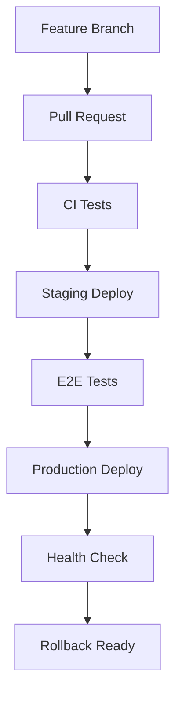

# 🚀 Deployment - CI/CD実践ガイド

**🌐 デプロイメントとCI/CDの実践的設定**

TypeScript Minecraft Clone のプロダクション環境へのデプロイメント、継続的インテグレーション/継続的デプロイメント(CI/CD)の構築、運用監視の実装を包括的に支援します。

## 🎯 このセクションの目的

安全で効率的なデプロイメントプロセスの構築：

- 自動化されたCI/CDパイプラインの構築
- 本番環境への安全なデプロイメント戦略
- パフォーマンス最適化と運用監視
- スケーラブルなインフラストラクチャ設計

## 📋 デプロイメントガイド一覧

### 🏗 CI/CD基盤

- **[CI/CDデプロイメント](./ci-cd-deployment.md)** - GitHub Actions基盤CI/CDパイプライン構築

### ⚡ パフォーマンス・最適化

- **[パフォーマンス最適化](./performance-optimization.md)** - 本番環境パフォーマンス最適化

### 🔍 監視・トラブルシューティング

- **[トラブルシューティング監視](./troubleshooting-monitoring.md)** - 本番環境監視とアラート設定

## 🎯 デプロイメント戦略

### 🚀 基本デプロイメント

### 🔄 高度デプロイメント

## 🌍 環境別設定

### 🧪 Staging環境

- **目的**: 本番環境の完全模倣とテスト実行
- **リソース**: 本番環境の50%スペック
- **データ**: サニタイズされたプロダクションデータ

### 🚀 Production環境

- **目的**: エンドユーザー向け本番サービス
- **可用性**: 99.9%稼働率目標
- **スケーリング**: 負荷に応じた自動スケール

## 📊 品質ゲート

### デプロイ前チェック

- ✅ すべてのテスト合格(Unit/Integration/E2E)
- ✅ コードカバレッジ85%以上
- ✅ セキュリティスキャン合格
- ✅ パフォーマンステスト合格

### デプロイ後検証

- ✅ ヘルスチェック正常
- ✅ 主要機能動作確認
- ✅ パフォーマンスメトリクス正常
- ✅ エラーレート < 0.1%

## 🔧 効果的な活用方法

1. **初回セットアップ**: CI/CDデプロイメントから開始
2. **パフォーマンス最適化**: 本番環境のパフォーマンスチューニング
3. **運用安定化**: 監視・トラブルシューティング設定

## 🔗 関連セクション

- **[Development](../development/README.md)**: 開発環境での事前準備
- **[Testing](../testing/README.md)**: デプロイ前テスト実行
- **[Troubleshooting](../troubleshooting/README.md)**: デプロイメント問題解決
- **[Reference](../../reference/README.md)**: 設定値・環境変数仕様

---

**🚀 プロダクション準備完了**: このセクションで本番環境への安全で効率的なデプロイメントを実現しましょう。
