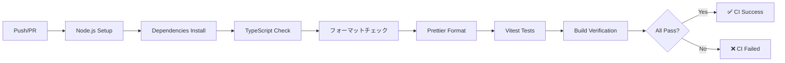
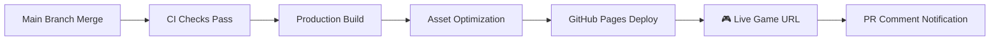

# CI/CD & GitHub Pages デプロイメント

> **🎯 このガイドの目標**: main ブランチへのマージ時に自動的にMinecraft Cloneゲームがビルド・テスト・デプロイされる仕組みを構築

## 📋 CI/CD パイプライン概要

### 🔄 **CI (Continuous Integration) - 品質保証**



### 🚀 **CD (Continuous Deployment) - 自動デプロイ**



---

## ⚙️ GitHub Actions 設定ファイル

### 📁 **ファイル構成**

```
.github/
└── workflows/
    ├── ci.yml          # CI パイプライン
    └── cd.yml          # CD パイプライン
```

### 🧪 **CI パイプライン設定 (ci.yml)**

```yaml
name: CI - Code Quality

on:
  push:
    branches: ['main', 'develop']
  pull_request:
    branches: ['main']

jobs:
  ci:
    runs-on: ubuntu-latest
    strategy:
      matrix:
        node-version: [18.x, 20.x]

    steps:
      - name: Checkout repository
        uses: actions/checkout@v4

      - name: Setup Node.js ${{ matrix.node-version }}
        uses: actions/setup-node@v4
        with:
          node-version: ${{ matrix.node-version }}
          cache: 'pnpm'

      - name: Install dependencies
        run: pnpm install --frozen-lockfile

      - name: TypeScript type check
        run: pnpm typecheck

      - name: Lint check
        run: pnpm lint

      - name: Format check
        run: pnpm format:check

      - name: Run tests
        run: pnpm test:coverage

      - name: Build application
        run: pnpm build

      - name: Upload build artifacts (debugging)
        uses: actions/upload-artifact@v4
        if: failure()
        with:
          name: build-artifacts-${{ matrix.node-version }}
          path: |
            dist/
            coverage/
          retention-days: 1
```

### 🚀 **CD パイプライン設定 (cd.yml)**

```yaml
name: CD - Deploy to GitHub Pages

on:
  push:
    branches: ['main']

permissions:
  contents: read
  pages: write
  id-token: write

concurrency:
  group: 'pages'
  cancel-in-progress: false

jobs:
  build:
    runs-on: ubuntu-latest
    steps:
      - name: Checkout repository
        uses: actions/checkout@v4

      - name: Setup Node.js
        uses: actions/setup-node@v4
        with:
          node-version: '20.x'
          cache: 'pnpm'

      - name: Install dependencies
        run: pnpm install --frozen-lockfile

      - name: Run CI checks
        run: |
          npm run type-check
          npm run test

      - name: Build Minecraft Clone
        run: pnpm build
        env:
          NODE_ENV: production

      - name: Setup Pages
        uses: actions/configure-pages@v4

      - name: Upload build artifacts
        uses: actions/upload-pages-artifact@v3
        with:
          path: './dist'

  deploy:
    environment:
      name: github-pages
      url: ${{ steps.deployment.outputs.page_url }}
    runs-on: ubuntu-latest
    needs: build
    steps:
      - name: Deploy to GitHub Pages
        id: deployment
        uses: actions/deploy-pages@v4

      - name: Comment deployment URL on PR
        if: github.event_name == 'push' && github.ref == 'refs/heads/main'
        uses: actions/github-script@v7
        with:
          script: |
            const deployUrl = 'https://minecraft.takeokunn.org';
            console.log(`🎮 Minecraft Clone deployed: ${deployUrl}`);
```

---

## 📦 Package.json Scripts 設定

### 🛠️ **必要なスクリプト**

```json
{
  "scripts": {
    "dev": "vite",
    "build": "tsc && vite build",
    "preview": "vite preview",
    "type-check": "tsc --noEmit",
    "lint": "oxlint",
    "lint:fix": "oxlint --fix",
    "format": "oxlint --fix src test",
    "format:check": "oxlint src test",
    "test": "vitest",
    "test:coverage": "vitest --coverage",
    "clean": "rm -rf dist node_modules/.vite"
  }
}
```

### 📍 **GitHub Pages 対応設定**

```json
{
  "homepage": "https://minecraft.takeokunn.org"
}
```

---

## ⚡ Vite 設定 (GitHub Pages 対応)

### 🔧 **vite.config.ts**

```typescript
import { defineConfig } from 'vite'
import { resolve } from 'path'

export default defineConfig({
  // GitHub Pages用のベースパス
  base: process.env.NODE_ENV === 'production' ? '/ts-minecraft/' : '/',

  // ビルド設定
  build: {
    outDir: 'dist',
    assetsDir: 'assets',
    sourcemap: true,
    minify: 'esbuild',
    target: 'esnext',
    rollupOptions: {
      input: {
        main: resolve(__dirname, 'index.html'),
      },
    },
  },

  // パス解決設定
  resolve: {
    alias: {
      '@': resolve(__dirname, './src'),
      '@/domain': resolve(__dirname, './src/domain'),
      '@/application': resolve(__dirname, './src/application'),
      '@/infrastructure': resolve(__dirname, './src/infrastructure'),
      '@/presentation': resolve(__dirname, './src/presentation'),
    },
  },

  // Three.js最適化
  optimizeDeps: {
    include: ['three', 'effect', '@effect/platform', '@effect/schema'],
  },
})
```

---

## 🏗️ プロジェクト構造 (CI/CD対応)

```
ts-minecraft/
├── .github/
│   └── workflows/
│       ├── ci.yml              # CI パイプライン
│       └── cd.yml              # CD パイプライン
├── docs/                       # ドキュメント (GitHub Pages対象外)
├── public/                     # 静的アセット
├── src/                        # ソースコード
│   ├── domain/                 # ドメイン層
│   ├── application/            # アプリケーション層
│   ├── infrastructure/         # インフラ層
│   └── presentation/           # プレゼンテーション層
├── dist/                       # ビルド成果物 (GitHub Pagesデプロイ対象)
├── index.html                  # エントリーポイント
├── package.json                # 依存関係・スクリプト
├── vite.config.ts              # Vite設定
├── tsconfig.json               # TypeScript設定
└── README.md                   # プロジェクト説明
```

---

## 🎯 デプロイメントワークフロー

### 📝 **開発フロー**

1. **フィーチャーブランチ作成**

   ```bash
   git checkout -b feature/new-block-system
   ```

2. **開発・コミット**

   ```bash
   # コード変更
   git add .
   git commit -m "feat: add new block placement system"
   ```

3. **PR作成**
   - CI パイプラインが自動実行
   - 型チェック・lint・テスト・ビルドの検証

4. **main ブランチマージ**
   - CD パイプラインが自動実行
   - GitHub Pages に自動デプロイ
   - 🎮 **ゲームが即座にプレイ可能！**

### 🌐 **デプロイ後のアクセス**

- **ライブゲームURL**: `https://minecraft.takeokunn.org`
- **自動更新**: main ブランチマージから約2-3分で反映

---

## 🔧 GitHub Repository 設定

### ⚙️ **GitHub Pages 設定**

1. **Repository Settings** → **Pages**
2. **Source**: `GitHub Actions` を選択
3. **Custom domain** (オプション): 独自ドメイン設定可能

### 🔐 **Permissions 設定**

```yaml
permissions:
  contents: read # コードの読み取り
  pages: write # GitHub Pages デプロイ
  id-token: write # OIDC認証
```

### 🏷️ **Environment 設定**

- **Environment名**: `github-pages`
- **Protection rules**: main ブランチのみデプロイ許可

---

## 📊 品質ゲートと監視

### ✅ **CI 品質基準**

- **TypeScript**: 型エラー 0件
- **TypeScriptコンパイラ**: 型エラー・警告 0件
- **Prettier**: フォーマット準拠
- **Vitest**: テストカバレッジ ≥90%
- **Build**: 成功必須

### 📈 **監視・メトリクス**

- **Build時間**: ~2-3分目標
- **Bundle サイズ**: 監視・最適化
- **デプロイ成功率**: 99%+維持

### 🚨 **障害時の対応**

```yaml
# CI失敗時
- 型エラー → TypeScript修正
- テスト失敗 → テストコード・実装修正
- ビルド失敗 → 設定・依存関係確認

# CD失敗時
- GitHub Pages エラー → repository設定確認
- 権限エラー → permissions設定確認
```

---

## 🎮 ゲーム固有の最適化

### 🖼️ **アセット最適化**

- **テクスチャ圧縮**: WebP変換
- **3Dモデル圧縮**: GLTF/GLB最適化
- **音声圧縮**: OGG/WebM使用

### ⚡ **パフォーマンス最適化**

- **Tree shaking**: 未使用コード除去
- **Code splitting**: 動的インポート
- **CDN活用**: 静的アセット配信

### 🔄 **Three.js 特殊設定**

```typescript
// vite.config.ts でThree.js最適化
optimizeDeps: {
  include: ['three', 'three/examples/jsm/loaders/GLTFLoader', 'three/examples/jsm/controls/OrbitControls']
}
```

---

## 🚀 次のステップ

1. **[Phase 1実装](../ROADMAP.md#phase-1)**: プロジェクト基盤構築
2. **CI/CD設定**: 上記設定ファイルの実装
3. **初回デプロイ**: MVP版の公開
4. **継続改善**: パフォーマンス・品質向上

---

## 📞 トラブルシューティング

### ❓ **よくある問題**

| 問題                   | 原因               | 解決方法                       |
| ---------------------- | ------------------ | ------------------------------ |
| GitHub Pages 404エラー | ベースパス設定ミス | `vite.config.ts`のbase設定確認 |
| ビルド失敗             | 型エラー・依存関係 | `npm run type-check`で確認     |
| デプロイ権限エラー     | Repository設定不備 | Settings→Pages→Actions有効化   |
| アセット読み込みエラー | パス解決問題       | 相対パス→絶対パス変更          |

### 🔗 **関連ドキュメント**

- **[開発規約](../development/development-conventions.md)** - コード品質基準
- **[テストガイド](../testing/testing-guide.md)** - テスト戦略
- **[ドキュメント](../../README.md)** - プロジェクト概要

---

**🎮 Ready to Deploy! Let's Build and Ship Minecraft Clone to the World!**
