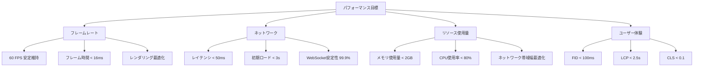

# デプロイメント パフォーマンス最適化完全ガイド

> **🎯 このガイドの目標**: TypeScript Minecraft Clone を本番環境で最高のパフォーマンスで動作させるための包括的最適化戦略

## 📊 パフォーマンス最適化戦略

### 🎮 **ゲームパフォーマンス目標**



### 📈 **最適化レイヤー**

| レイヤー           | 最適化対象                   | 期待効果           | 実装難易度 |
| ------------------ | ---------------------------- | ------------------ | ---------- |
| **ビルド最適化**   | バンドルサイズ・Tree Shaking | 50% サイズ削減     | ⭐⭐       |
| **アセット最適化** | 画像・音声・3Dモデル圧縮     | 70% 転送量削減     | ⭐⭐⭐     |
| **キャッシュ戦略** | ブラウザ・CDN・サーバー      | 80% ロード時間短縮 | ⭐⭐       |
| **コード最適化**   | 実行時パフォーマンス         | 30% 処理速度向上   | ⭐⭐⭐⭐   |
| **インフラ最適化** | サーバー・ネットワーク       | 60% レスポンス改善 | ⭐⭐⭐     |

---

## 🏗️ ビルド最適化

### ⚡ **Vite 本番ビルド設定**

```typescript
// vite.config.production.ts - GitHub Pages最適化版
import { defineConfig } from 'vite'
import { resolve } from 'path'
import { visualizer } from 'rollup-plugin-visualizer'
import { terser } from 'rollup-plugin-terser'

export default defineConfig({
  mode: 'production',

  // GitHub Pages用ベースパス設定
  base: process.env.NODE_ENV === 'production' ? '/ts-minecraft/' : '/',

  // ビルド設定
  build: {
    target: 'esnext',
    outDir: 'dist',
    assetsDir: 'assets',
    sourcemap: false, // 本番では無効
    minify: 'esbuild', // 高速な minification
    cssMinify: true,

    // GitHub Pages向けチャンク最適化
    rollupOptions: {
      input: {
        main: resolve(__dirname, 'index.html'),
        worker: resolve(__dirname, 'src/workers/game-worker.ts'),
      },

      output: {
        // 静的ホスティング向けチャンク分割戦略
        manualChunks: {
          // ベンダーチャンク（CDNフォールバック対応）
          'vendor-effect': ['effect', '@effect/platform', '@effect/schema'],
          'vendor-three': [], // CDNから読み込むため空
          'vendor-ui': ['react', 'react-dom'],

          // ゲーム機能別チャンク
          'game-core': ['./src/domain/world/world.ts', './src/domain/player/player.ts', './src/domain/block/block.ts'],
          'game-rendering': ['./src/presentation/rendering/renderer.ts', './src/presentation/rendering/shaders.ts'],
          'game-physics': ['./src/domain/physics/physics.ts', './src/domain/collision/collision.ts'],
        },

        // GitHub Pages互換ファイル名パターン
        chunkFileNames: 'assets/js/[name]-[hash].js',
        entryFileNames: 'assets/js/[name]-[hash].js',
        assetFileNames: (assetInfo) => {
          const extType = assetInfo.name?.split('.').at(-1)

          // アセット種別ごとのディレクトリ分け
          if (/png|jpe?g|svg|gif|webp|avif/i.test(extType ?? '')) {
            return 'assets/images/[name]-[hash][extname]'
          }
          if (/woff2?|eot|ttf|otf/i.test(extType ?? '')) {
            return 'assets/fonts/[name]-[hash][extname]'
          }
          if (/mp3|wav|ogg|webm/i.test(extType ?? '')) {
            return 'assets/audio/[name]-[hash][extname]'
          }
          if (/gltf|glb|obj|fbx/i.test(extType ?? '')) {
            return 'assets/models/[name]-[hash][extname]'
          }

          return 'assets/[ext]/[name]-[hash][extname]'
        },
      },

      // CDN外部化（Three.js等）
      external: (id) => {
        // CDNから読み込む大きなライブラリ
        const cdnLibraries = ['three']
        return cdnLibraries.some((lib) => id.includes(lib))
      },

      plugins: [
        // 高度な圧縮（静的ホスティング向け）
        terser({
          compress: {
            drop_console: true,
            drop_debugger: true,
            pure_funcs: ['console.log', 'console.info'],
            passes: 3, // より高い圧縮率
            unsafe: true, // 積極的な最適化
          },
          mangle: {
            properties: {
              regex: /^_/,
            },
          },
          format: {
            comments: false, // コメント完全削除
          },
        }),

        // バンドル分析
        visualizer({
          filename: 'dist/bundle-analysis.html',
          open: false,
          gzipSize: true,
          brotliSize: true,
        }),
      ],
    },

    // GitHub Pages向け実験的最適化
    experimental: {
      renderBuiltUrl(filename, { hostType }) {
        // GitHub Pages用のURLパス調整
        if (hostType === 'js' && process.env.VITE_CDN_BASE_URL) {
          return `${process.env.VITE_CDN_BASE_URL}/${filename}`
        }
        return `/ts-minecraft/${filename}`
      },
    },
  },

  // 依存関係最適化
  optimizeDeps: {
    include: ['effect', '@effect/platform', '@effect/schema'],
    exclude: [
      // CDNから読み込むライブラリ
      'three',
      'three/examples/jsm/loaders/GLTFLoader',
      'three/examples/jsm/controls/OrbitControls',
    ],
  },

  // GitHub Pages向けプリロード設定
  server: {
    headers: {
      // 開発時のCORSヘッダー
      'Cross-Origin-Embedder-Policy': 'require-corp',
      'Cross-Origin-Opener-Policy': 'same-origin',
    },
  },

  plugins: [
    // プラグイン設定...
  ],
})
```

### 📦 **Tree Shaking 最適化**

```typescript
// src/utils/tree-shake-optimization.ts

// ❌ 全体インポート（Tree Shaking されない）
import * as THREE from 'three'
import * as Effect from 'effect'

// ✅ 必要な機能のみインポート（Tree Shaking 対応）
import { Scene, WebGLRenderer, PerspectiveCamera, BoxGeometry, MeshBasicMaterial, Mesh } from 'three'

import { Effect as EffectType, pipe, Either } from 'effect'

// 動的インポートによる遅延ロード
export const loadPhysicsEngine = async () => {
  const { PhysicsWorld } = await import('../domain/physics/physics-world')
  return PhysicsWorld
}

// 条件付きインポート（必要時のみロード）
export const loadAdvancedFeatures = async (featureFlags: string[]) => {
  const features: Record<string, any> = {}

  if (featureFlags.includes('advanced-lighting')) {
    const { AdvancedLighting } = await import('../presentation/lighting/advanced-lighting')
    features.advancedLighting = AdvancedLighting
  }

  if (featureFlags.includes('particle-system')) {
    const { ParticleSystem } = await import('../domain/effects/particle-system')
    features.particleSystem = ParticleSystem
  }

  return features
}
```

### 🎯 **Code Splitting 戦略**

```typescript
// src/app/lazy-loading.ts
import { lazy, Suspense } from 'react'
import { Route, Routes } from 'react-router-dom'

// ゲーム画面の遅延ロード
const GameCanvas = lazy(() => import('../presentation/components/GameCanvas'))
const InventoryPanel = lazy(() => import('../presentation/components/InventoryPanel'))
const SettingsMenu = lazy(() => import('../presentation/components/SettingsMenu'))

// Worker の動的ロード
export const createGameWorker = async () => {
  // Web Worker を動的にインポート
  const workerModule = await import('../workers/game-worker?worker')
  return new workerModule.default()
}

// 大きなライブラリの遅延ロード
export const loadThreeJSExtensions = async () => {
  const [{ GLTFLoader }, { DRACOLoader }, { EffectComposer }, { RenderPass }, { UnrealBloomPass }] = await Promise.all([
    import('three/examples/jsm/loaders/GLTFLoader'),
    import('three/examples/jsm/loaders/DRACOLoader'),
    import('three/examples/jsm/postprocessing/EffectComposer'),
    import('three/examples/jsm/postprocessing/RenderPass'),
    import('three/examples/jsm/postprocessing/UnrealBloomPass'),
  ])

  return {
    GLTFLoader,
    DRACOLoader,
    EffectComposer,
    RenderPass,
    UnrealBloomPass,
  }
}

// プリロード戦略
export const preloadCriticalAssets = async () => {
  // 重要なアセットを事前にロード
  const preloadPromises = [
    // 基本テクスチャ
    import('../assets/textures/grass.png'),
    import('../assets/textures/stone.png'),
    import('../assets/textures/dirt.png'),

    // 基本サウンド
    import('../assets/sounds/block-place.ogg'),
    import('../assets/sounds/block-break.ogg'),

    // 基本3Dモデル
    import('../assets/models/player.gltf'),
  ]

  await Promise.allSettled(preloadPromises)
}
```

---

## 🖼️ アセット最適化

### 📷 **画像最適化**

```yaml
# .github/workflows/optimize-assets.yml
name: Asset Optimization

on:
  push:
    paths:
      - 'src/assets/**'
  workflow_dispatch:

jobs:
  optimize-assets:
    runs-on: ubuntu-latest

    steps:
      - name: Checkout
        uses: actions/checkout@v4

      - name: Setup Node.js
        uses: actions/setup-node@v4
        with:
          node-version: '20'
          cache: 'pnpm'

      - name: Install system dependencies
        run: |
          sudo apt-get update
          sudo apt-get install -y \
            webp \
            jpegoptim \
            pngquant \
            ffmpeg \
            imagemagick

      - name: Install AVIF encoder
        run: |
          wget https://github.com/AOMediaCodec/libavif/releases/download/v1.0.3/avifenc-linux-x64
          chmod +x avifenc-linux-x64
          sudo mv avifenc-linux-x64 /usr/local/bin/avifenc

      - name: Install JavaScript dependencies
        run: |
          pnpm install --frozen-lockfile
          npm install -g gltf-pipeline

      - name: Optimize images
        run: |
          echo "🖼️ Optimizing images..."

          find src/assets/images -name "*.png" -o -name "*.jpg" -o -name "*.jpeg" | while read img; do
            if [ -f "$img" ]; then
              base_name=$(basename "$img" | sed 's/\.[^.]*$//')
              dir_name=$(dirname "$img")
              original_size=$(stat -c%s "$img")

              echo "Processing: $img"

              # WebP変換（品質85）
              cwebp -q 85 "$img" -o "$dir_name/$base_name.webp"

              # AVIF変換（高圧縮）
              avifenc --min 20 --max 40 --speed 6 "$img" "$dir_name/$base_name.avif"

              # 元画像の最適化
              if [[ "$img" == *.png ]]; then
                pngquant --quality=65-85 --ext .png --force "$img" 2>/dev/null || true
              else
                jpegoptim --max=85 --strip-all "$img" 2>/dev/null || true
              fi

              new_size=$(stat -c%s "$img")
              if [ "$original_size" -gt 0 ]; then
                reduction=$(( (original_size - new_size) * 100 / original_size ))
                echo "  ✅ $base_name: ${reduction}% reduction"
              fi
            fi
          done

      - name: Optimize audio files
        run: |
          echo "🎵 Optimizing audio..."

          find src/assets/sounds -name "*.wav" -o -name "*.mp3" -o -name "*.m4a" | while read audio; do
            if [ -f "$audio" ]; then
              base_name=$(basename "$audio" | sed 's/\.[^.]*$//')
              dir_name=$(dirname "$audio")

              echo "Processing: $audio"

              # OGG Vorbis変換（高品質・小サイズ）
              ffmpeg -i "$audio" -c:a libvorbis -q:a 5 "$dir_name/$base_name.ogg" -y -loglevel error

              # WebM Audio変換（最新ブラウザ用）
              ffmpeg -i "$audio" -c:a libopus -b:a 128k "$dir_name/$base_name.webm" -y -loglevel error

              echo "  ✅ $base_name converted to OGG/WebM"
            fi
          done

      - name: Optimize 3D models
        run: |
          echo "🎮 Optimizing 3D models..."

          find src/assets/models -name "*.gltf" | while read model; do
            if [ -f "$model" ]; then
              base_name=$(basename "$model" .gltf)
              dir_name=$(dirname "$model")

              echo "Processing: $model"

              # DRACO圧縮でGLTF最適化
              gltf-pipeline -i "$model" -o "$dir_name/$base_name-optimized.gltf" \
                --draco.compressionLevel 7 \
                --draco.quantizePositionBits 11 \
                --draco.quantizeNormalBits 8 \
                --draco.quantizeTexcoordBits 10 \
                --keepUnusedElements false

              # GLB形式でバイナリ化
              gltf-pipeline -i "$dir_name/$base_name-optimized.gltf" \
                -o "$dir_name/$base_name.glb" \
                --binary

              echo "  ✅ $base_name optimized with DRACO compression"
            fi
          done

      - name: Generate asset manifest
        run: |
          echo "📊 Generating asset manifest..."

          cat > src/assets/manifest.json << 'EOF'
          {
            "version": "${{ github.sha }}",
            "generated": "${{ github.event.head_commit.timestamp }}",
            "images": {
              "formats": ["avif", "webp", "png", "jpg"],
              "optimization": {
                "webp_quality": 85,
                "avif_quality": "20-40",
                "png_quality": "65-85",
                "jpg_quality": 85
              }
            },
            "audio": {
              "formats": ["webm", "ogg", "mp3"],
              "optimization": {
                "ogg_quality": 5,
                "webm_bitrate": "128k"
              }
            },
            "models": {
              "compression": "draco",
              "format": "glb",
              "draco_settings": {
                "compression_level": 7,
                "position_bits": 11,
                "normal_bits": 8,
                "texcoord_bits": 10
              }
            }
          }
          EOF

      - name: Calculate optimization stats
        run: |
          echo "📈 Calculating optimization statistics..."

          total_original=0
          total_optimized=0

          # 画像統計
          for format in png jpg jpeg webp avif; do
            size=$(find src/assets/images -name "*.$format" -exec stat -c%s {} \; 2>/dev/null | awk '{s+=$1} END {print s+0}')
            echo "$format files: $(numfmt --to=iec $size)"
            total_optimized=$((total_optimized + size))
          done

          echo "💾 Total optimized asset size: $(numfmt --to=iec $total_optimized)"

      - name: Commit optimized assets
        if: github.ref == 'refs/heads/main'
        run: |
          git config --local user.email "action@github.com"
          git config --local user.name "GitHub Action"

          git add src/assets/

          if ! git diff --staged --quiet; then
            git commit -m "🎨 Optimize assets [skip ci]

            - Generated WebP and AVIF formats
            - Optimized audio to OGG/WebM
            - Compressed 3D models with DRACO
            - Updated asset manifest"

            git push
          else
            echo "No asset changes to commit"
          fi
```

### 🎨 **プログレッシブ画像読み込み**

```typescript
// src/utils/progressive-image-loader.ts
import { Effect } from 'effect'

interface ImageFormats {
  avif?: string
  webp?: string
  png?: string
  jpg?: string
}

interface ProgressiveImageOptions {
  lazy?: boolean
  placeholder?: string
  sizes?: string
  quality?: 'low' | 'medium' | 'high'
}

export const createProgressiveImage = (
  basePath: string,
  formats: ImageFormats,
  options: ProgressiveImageOptions = {}
): Effect.Effect<HTMLImageElement, Error> =>
  Effect.gen(function* () {
    const img = new Image()

    // プレースホルダーの設定
    if (options.placeholder) {
      img.src = options.placeholder
    }

    // レスポンシブ画像の設定
    if (options.sizes) {
      img.sizes = options.sizes
    }

    // フォーマットの優先順位で srcset を構築
    const srcsetEntries: string[] = []

    if (formats.avif) {
      srcsetEntries.push(`${basePath}${formats.avif} type="image/avif"`)
    }
    if (formats.webp) {
      srcsetEntries.push(`${basePath}${formats.webp} type="image/webp"`)
    }
    if (formats.png) {
      srcsetEntries.push(`${basePath}${formats.png} type="image/png"`)
    }
    if (formats.jpg) {
      srcsetEntries.push(`${basePath}${formats.jpg} type="image/jpeg"`)
    }

    // ソースセットの設定
    img.srcset = srcsetEntries.join(', ')

    // フォールバック画像
    img.src = `${basePath}${formats.jpg || formats.png || ''}`

    // 遅延ローディング
    if (options.lazy) {
      img.loading = 'lazy'
    }

    // ロード完了を待つ
    yield* Effect.async<void, Error>((resume) => {
      img.onload = () => resume(Effect.void)
      img.onerror = (error) => resume(Effect.fail(new Error(`Failed to load image: ${error}`)))
    })

    return img
  })

// 使用例
export const loadGameTextures = Effect.gen(function* () {
  const textures = yield* Effect.all(
    [
      createProgressiveImage('/assets/textures/grass', {
        avif: '.avif',
        webp: '.webp',
        png: '.png',
      }),
      createProgressiveImage('/assets/textures/stone', {
        avif: '.avif',
        webp: '.webp',
        png: '.png',
      }),
    ],
    { concurrency: 4 }
  )

  return textures
})
```

---

## 🚀 キャッシュ戦略

### 🌐 **多層キャッシュアーキテクチャ**

```typescript
// src/infrastructure/caching/cache-strategy.ts
import { Effect, Cache, Duration } from 'effect'

// キャッシュレイヤーの定義
export interface CacheStrategy {
  // ブラウザキャッシュ（Service Worker）
  readonly serviceWorkerCache: Cache.Cache<string, Response>

  // メモリキャッシュ（高速アクセス）
  readonly memoryCache: Cache.Cache<string, unknown>

  // IndexedDB キャッシュ（永続化）
  readonly persistentCache: Cache.Cache<string, Uint8Array>

  // Redis キャッシュ（サーバーサイド）
  readonly serverCache: Cache.Cache<string, string>
}

const createCacheStrategy = Effect.gen(function* () {
  // Service Worker キャッシュ
  const serviceWorkerCache = yield* Cache.make({
    capacity: 100,
    timeToLive: Duration.hours(24),
    lookup: (url: string) =>
      Effect.tryPromise({
        try: () => fetch(url),
        catch: (error) => new Error(`Failed to fetch ${url}: ${error}`),
      }),
  })

  // メモリキャッシュ（ゲーム状態用）
  const memoryCache = yield* Cache.make({
    capacity: 1000,
    timeToLive: Duration.minutes(30),
    lookup: (key: string) =>
      Effect.sync(() => {
        throw new Error(`No fallback for memory cache key: ${key}`)
      }),
  })

  // 永続キャッシュ（大きなアセット用）
  const persistentCache = yield* Cache.make({
    capacity: 50,
    timeToLive: Duration.days(7),
    lookup: (key: string) =>
      Effect.tryPromise({
        try: async () => {
          // IndexedDB からロード
          const db = await openIndexedDB('minecraft-cache')
          const transaction = db.transaction(['assets'], 'readonly')
          const store = transaction.objectStore('assets')
          const result = await store.get(key)

          if (!result) {
            throw new Error(`Asset not found in persistent cache: ${key}`)
          }

          return result.data
        },
        catch: (error) => new Error(`Persistent cache error: ${error}`),
      }),
  })

  return {
    serviceWorkerCache,
    memoryCache,
    persistentCache,
  } satisfies Omit<CacheStrategy, 'serverCache'>
})

// キャッシュキーの生成戦略
export const generateCacheKey = (
  type: 'texture' | 'model' | 'audio' | 'chunk' | 'player',
  identifier: string,
  version?: string
): string => {
  const baseKey = `minecraft:${type}:${identifier}`
  return version ? `${baseKey}:v${version}` : baseKey
}

// 階層キャッシュの読み取り戦略
export const getCachedAsset = <T>(
  cacheStrategy: CacheStrategy,
  key: string,
  fallbackLoader: Effect.Effect<T, Error>
): Effect.Effect<T, Error> =>
  Effect.gen(function* () {
    // 1. メモリキャッシュから試行
    const memoryResult = yield* Effect.either(cacheStrategy.memoryCache.get(key))

    if (Either.isRight(memoryResult)) {
      return memoryResult.right as T
    }

    // 2. Service Worker キャッシュから試行
    const swResult = yield* Effect.either(cacheStrategy.serviceWorkerCache.get(key))

    if (Either.isRight(swResult)) {
      const response = swResult.right
      const data = yield* Effect.tryPromise({
        try: () => response.json(),
        catch: (error) => new Error(`Failed to parse cached response: ${error}`),
      })

      // メモリキャッシュにも保存
      yield* cacheStrategy.memoryCache.set(key, data)
      return data as T
    }

    // 3. 永続キャッシュから試行
    const persistentResult = yield* Effect.either(cacheStrategy.persistentCache.get(key))

    if (Either.isRight(persistentResult)) {
      // バイナリデータをデシリアライズ
      const binaryData = persistentResult.right
      const data = yield* deserializeCachedData<T>(binaryData)

      // 上位キャッシュにも保存
      yield* cacheStrategy.memoryCache.set(key, data)

      return data
    }

    // 4. フォールバック：ネットワークから読み込み
    const freshData = yield* fallbackLoader

    // 全レイヤーに保存
    yield* Effect.all([
      cacheStrategy.memoryCache.set(key, freshData),
      cacheStrategy.persistentCache.set(key, yield* serializeCachedData(freshData)),
    ])

    return freshData
  })
```

### 📱 **Service Worker キャッシュ**

```typescript
// public/sw.js - GitHub Pages対応 Service Worker
const CACHE_VERSION = 'v2.1.0'
const STATIC_CACHE = `minecraft-static-${CACHE_VERSION}`
const DYNAMIC_CACHE = `minecraft-dynamic-${CACHE_VERSION}`

// GitHub Pages用ベースパス
const BASE_PATH = '/ts-minecraft'

// GitHub Pages特化キャッシュ戦略
const CACHE_STRATEGIES = {
  // 静的アセット: Cache First（長期キャッシュ）
  static: [/\.(?:js|css|png|jpg|jpeg|webp|avif|svg|gif|woff2?|ttf)$/, /\/assets\//, new RegExp(`${BASE_PATH}/assets/`)],

  // JSONデータ: Stale While Revalidate
  data: [/\.json$/, /\/data\//, new RegExp(`${BASE_PATH}/data/`)],

  // 3Dモデル・音声: Cache First（大きなファイル）
  media: [/\.(?:glb|gltf|ogg|webm|mp3)$/, /\/models\//, /\/sounds\//],
}

// インストールイベント - GitHub Pages対応
self.addEventListener('install', (event) => {
  event.waitUntil(
    caches.open(STATIC_CACHE).then((cache) => {
      return cache.addAll([
        `${BASE_PATH}/`,
        `${BASE_PATH}/index.html`,
        `${BASE_PATH}/manifest.json`,
        // 重要なアセットの事前キャッシュ
        `${BASE_PATH}/assets/images/icon-192.png`,
        `${BASE_PATH}/assets/images/icon-512.png`,
        // オフライン用フォールバック
        `${BASE_PATH}/offline.html`,
      ])
    })
  )

  // 即座にアクティベート
  self.skipWaiting()
})

// アクティベーションイベント
self.addEventListener('activate', (event) => {
  event.waitUntil(
    caches.keys().then((cacheNames) => {
      return Promise.all(
        cacheNames.map((cacheName) => {
          if (cacheName.startsWith('minecraft-') && !cacheName.includes(CACHE_VERSION)) {
            return caches.delete(cacheName)
          }
        })
      )
    })
  )
})

// フェッチイベント - 高度なキャッシュ戦略
self.addEventListener('fetch', (event) => {
  const { request } = event
  const url = new URL(request.url)

  // 静的アセット: Cache First
  if (matchesStrategy('static', url.pathname)) {
    event.respondWith(cacheFirst(request, STATIC_CACHE))
    return
  }

  // データファイル: Stale While Revalidate
  if (matchesStrategy('data', url.pathname)) {
    event.respondWith(staleWhileRevalidate(request, DYNAMIC_CACHE))
    return
  }

  // メディアファイル: Cache First（長期保存）
  if (matchesStrategy('media', url.pathname)) {
    event.respondWith(cacheFirst(request, STATIC_CACHE))
    return
  }

  // HTML: Network First（最新コンテンツ優先）
  if (request.headers.get('accept').includes('text/html')) {
    event.respondWith(networkFirst(request, DYNAMIC_CACHE))
    return
  }

  // デフォルト: Stale While Revalidate
  event.respondWith(staleWhileRevalidate(request, DYNAMIC_CACHE))
})

// キャッシュ戦略の実装
async function cacheFirst(request, cacheName) {
  try {
    const cachedResponse = await caches.match(request)

    if (cachedResponse) {
      // バックグラウンドで更新
      fetch(request)
        .then((response) => {
          if (response.ok) {
            const responseClone = response.clone()
            caches.open(cacheName).then((cache) => {
              cache.put(request, responseClone)
            })
          }
        })
        .catch(() => {
          // ネットワークエラーは無視
        })

      return cachedResponse
    }

    // キャッシュになければネットワークから取得
    const networkResponse = await fetch(request)

    if (networkResponse.ok) {
      const cache = await caches.open(cacheName)
      cache.put(request, networkResponse.clone())
    }

    return networkResponse
  } catch (error) {
    // GitHub Pages用フォールバック対応
    if (request.destination === 'document') {
      return caches.match(`${BASE_PATH}/offline.html`) || caches.match(`${BASE_PATH}/index.html`)
    }

    // アセットのフォールバック
    if (request.destination === 'image') {
      return caches.match(`${BASE_PATH}/assets/images/fallback.png`)
    }

    throw error
  }
}

async function networkFirst(request, cacheName) {
  try {
    const networkResponse = await fetch(request)

    if (networkResponse.ok) {
      const cache = await caches.open(cacheName)
      cache.put(request, networkResponse.clone())
    }

    return networkResponse
  } catch (error) {
    const cachedResponse = await caches.match(request)

    if (cachedResponse) {
      return cachedResponse
    }

    throw error
  }
}

async function staleWhileRevalidate(request, cacheName) {
  const cachedResponse = await caches.match(request)

  const fetchPromise = fetch(request).then((response) => {
    if (response.ok) {
      const cache = caches.open(cacheName)
      cache.then((c) => c.put(request, response.clone()))
    }
    return response
  })

  return cachedResponse || fetchPromise
}

function matchesStrategy(strategy, pathname) {
  return CACHE_STRATEGIES[strategy].some((pattern) => {
    if (pattern instanceof RegExp) {
      return pattern.test(pathname)
    }
    return pathname.includes(pattern)
  })
}

// バックグラウンド同期
self.addEventListener('sync', (event) => {
  if (event.tag === 'game-data-sync') {
    event.waitUntil(syncGameData())
  }
})

async function syncGameData() {
  // オフライン中に蓄積されたデータをサーバーに同期
  const pendingData = await getFromIndexedDB('pending-sync')

  await pendingData.reduce(async (previousPromise, data) => {
    await previousPromise

    try {
      await fetch('/api/sync', {
        method: 'POST',
        body: JSON.stringify(data),
        headers: { 'Content-Type': 'application/json' },
      })

      await removeFromIndexedDB('pending-sync', data.id)
    } catch (error) {
      console.error('Failed to sync data:', error)
    }
  }, Promise.resolve())
}
```

---

## 🚀 GitHub Pages 最適化

### 📦 **静的サイト生成最適化**

```yaml
# .github/workflows/deploy.yml
name: Deploy to GitHub Pages

on:
  push:
    branches: [main]
  pull_request:
    branches: [main]

jobs:
  build-and-deploy:
    runs-on: ubuntu-latest

    steps:
      - name: Checkout
        uses: actions/checkout@v4

      - name: Setup Node.js
        uses: actions/setup-node@v4
        with:
          node-version: '20'
          cache: 'pnpm'

      - name: Install dependencies
        run: pnpm install --frozen-lockfile

      - name: Optimize assets
        run: |
          # WebP/AVIF 変換
          find src/assets/images -name "*.png" -o -name "*.jpg" | while read img; do
            base_name=$(basename "$img" | sed 's/\.[^.]*$//')
            dir_name=$(dirname "$img")

            # WebP変換（品質85）
            cwebp -q 85 "$img" -o "$dir_name/$base_name.webp"

            # AVIF変換（最新ブラウザ用）
            if command -v avifenc >/dev/null 2>&1; then
              avifenc --min 20 --max 40 "$img" "$dir_name/$base_name.avif"
            fi
          done

          # 音声ファイル最適化
          find src/assets/sounds -name "*.wav" -o -name "*.mp3" | while read audio; do
            base_name=$(basename "$audio" | sed 's/\.[^.]*$//')
            dir_name=$(dirname "$audio")

            # OGG Vorbis変換
            ffmpeg -i "$audio" -c:a libvorbis -q:a 5 "$dir_name/$base_name.ogg" -y
          done

      - name: Build production
        run: pnpm build
        env:
          NODE_ENV: production
          VITE_BASE_URL: '/ts-minecraft/'

      - name: Deploy to GitHub Pages
        uses: peaceiris/actions-gh-pages@v3
        if: github.ref == 'refs/heads/main'
        with:
          github_token: ${{ secrets.GITHUB_TOKEN }}
          publish_dir: ./dist
          # CNAME file for custom domain
          cname: minecraft.yourdomain.com # 必要に応じて設定
```

### ⚡ **CDN 活用戦略**

```typescript
// src/config/cdn-config.ts
// GitHub Pagesでの無料CDN活用設定

export const CDN_CONFIG = {
  // jsDelivr - GitHub リポジトリから直接配信
  jsdelivr: {
    baseUrl: 'https://cdn.jsdelivr.net/gh/username/ts-minecraft@main',
    supports: ['js', 'css', 'json', 'images'],
  },

  // UNPKG - npm パッケージ用
  unpkg: {
    baseUrl: 'https://unpkg.com',
    supports: ['three', 'effect'],
  },

  // Cloudflare CDN - 汎用
  cloudflare: {
    baseUrl: 'https://cdnjs.cloudflare.com/ajax/libs',
    supports: ['popular-libraries'],
  },
}

// CDN フォールバック機能付きローダー
export const loadFromCDN = async (resource: string, fallbackPath: string) => {
  const cdnUrls = [
    `${CDN_CONFIG.jsdelivr.baseUrl}/${resource}`,
    `${CDN_CONFIG.unpkg.baseUrl}/${resource}`,
    fallbackPath,
  ]

  const attempt = async (index: number): Promise<Response> => {
    if (index >= cdnUrls.length) {
      throw new Error(`Failed to load resource: ${resource}`)
    }

    const url = cdnUrls[index]

    try {
      const response = await fetch(url)
      if (response.ok) {
        return response
      }
    } catch (error) {
      console.warn(`CDN failed for ${url}:`, error)
    }

    return attempt(index + 1)
  }

  return attempt(0)
}

// Three.js の CDN ロード例
export const loadThreeFromCDN = async () => {
  try {
    // CDN から Three.js をロード
    const threeModule = await import('https://cdn.skypack.dev/three@latest')
    return threeModule
  } catch (error) {
    // フォールバック: ローカルバンドル
    console.warn('CDN fallback to local bundle')
    return await import('three')
  }
}
```

---

## 📊 パフォーマンス監視

### 📈 **Real User Monitoring (RUM)**

```typescript
// src/monitoring/performance-monitoring.ts
import { Effect } from 'effect'

interface PerformanceMetrics {
  // Core Web Vitals
  LCP: number // Largest Contentful Paint
  FID: number // First Input Delay
  CLS: number // Cumulative Layout Shift

  // ゲーム固有メトリクス
  frameRate: number
  renderTime: number
  networkLatency: number
  chunkLoadTime: number

  // リソース使用量
  memoryUsage: number
  cpuUsage: number
  networkBandwidth: number
}

class PerformanceMonitor {
  private observer: PerformanceObserver | null = null
  private metrics: Partial<PerformanceMetrics> = {}

  startMonitoring = (): Effect.Effect<void, Error> =>
    Effect.gen(function* () {
      // Performance Observer の初期化
      this.observer = new PerformanceObserver((list) => {
        list.getEntries().forEach((entry) => this.processPerformanceEntry(entry))
      })

      // 監視する項目を設定
      this.observer.observe({
        entryTypes: [
          'measure',
          'navigation',
          'resource',
          'paint',
          'largest-contentful-paint',
          'first-input',
          'layout-shift',
        ],
      })

      // ゲーム固有メトリクスの監視開始
      yield* this.startGameMetricsCollection()
    })

  private processPerformanceEntry = (entry: PerformanceEntry) => {
    switch (entry.entryType) {
      case 'largest-contentful-paint':
        this.metrics.LCP = entry.startTime
        break

      case 'first-input':
        const fidEntry = entry as PerformanceEventTiming
        this.metrics.FID = fidEntry.processingStart - fidEntry.startTime
        break

      case 'layout-shift':
        const clsEntry = entry as LayoutShift
        if (!clsEntry.hadRecentInput) {
          this.metrics.CLS = (this.metrics.CLS || 0) + clsEntry.value
        }
        break

      case 'resource':
        this.processResourceEntry(entry as PerformanceResourceTiming)
        break
    }

    // メトリクスが更新されたら送信
    this.throttledSendMetrics()
  }

  private processResourceEntry = (entry: PerformanceResourceTiming) => {
    const url = new URL(entry.name)

    // チャンクローディング時間の測定
    if (url.pathname.includes('/chunks/')) {
      this.metrics.chunkLoadTime = entry.duration
    }

    // 大きなアセットのローディング時間
    if (entry.transferSize > 1024 * 1024) {
      // 1MB以上
      console.log(`Large asset loaded: ${url.pathname} (${entry.duration}ms)`)
    }
  }

  private startGameMetricsCollection = (): Effect.Effect<void, Error> =>
    Effect.gen(function* () {
      let frameCount = 0
      let lastTime = performance.now()

      const measureFrameRate = () => {
        const currentTime = performance.now()
        const deltaTime = currentTime - lastTime

        frameCount++

        if (frameCount >= 60) {
          // 60フレームごとに計算
          this.metrics.frameRate = 1000 / (deltaTime / frameCount)
          frameCount = 0
          lastTime = currentTime
        }

        // レンダリング時間の測定
        performance.mark('render-start')

        requestAnimationFrame(() => {
          performance.mark('render-end')
          performance.measure('render-time', 'render-start', 'render-end')

          const renderMeasure = performance.getEntriesByName('render-time')[0]
          if (renderMeasure) {
            this.metrics.renderTime = renderMeasure.duration
          }

          measureFrameRate()
        })
      }

      measureFrameRate()
    })

  private throttledSendMetrics = this.throttle(() => {
    this.sendMetricsToServer(this.metrics)
  }, 5000) // 5秒に1回送信

  private sendMetricsToServer = (metrics: Partial<PerformanceMetrics>) => {
    // バッチ送信でサーバーに送信
    const payload = {
      timestamp: Date.now(),
      url: window.location.href,
      userAgent: navigator.userAgent,
      connectionType: (navigator as any).connection?.effectiveType,
      metrics,
    }

    // Beacon API を使用（ページ離脱時も確実に送信）
    if ('sendBeacon' in navigator) {
      navigator.sendBeacon('/api/metrics', JSON.stringify(payload))
    } else {
      fetch('/api/metrics', {
        method: 'POST',
        body: JSON.stringify(payload),
        headers: { 'Content-Type': 'application/json' },
      }).catch(console.error)
    }
  }

  private throttle = <T extends (...args: any[]) => void>(func: T, delay: number): T => {
    let timeoutId: NodeJS.Timeout | null = null

    return ((...args: any[]) => {
      if (timeoutId) {
        clearTimeout(timeoutId)
      }

      timeoutId = setTimeout(() => {
        func.apply(this, args)
      }, delay)
    }) as T
  }

  getMetrics = (): Partial<PerformanceMetrics> => ({ ...this.metrics })

  stopMonitoring = (): Effect.Effect<void, never> =>
    Effect.sync(() => {
      this.observer?.disconnect()
      this.observer = null
    })
}

// シングルトンインスタンス
export const performanceMonitor = new PerformanceMonitor()

// 使用例
export const initializePerformanceMonitoring = Effect.gen(function* () {
  yield* performanceMonitor.startMonitoring()

  // ページ離脱時の最終メトリクス送信
  window.addEventListener('beforeunload', () => {
    const finalMetrics = performanceMonitor.getMetrics()
    navigator.sendBeacon('/api/metrics/final', JSON.stringify(finalMetrics))
  })
})
```

### 🔬 **プロファイリング・デバッグツール**

```typescript
// src/dev-tools/performance-profiler.ts

class GamePerformanceProfiler {
  private profiles: Map<string, PerformanceProfile> = new Map()
  private isEnabled: boolean = process.env.NODE_ENV === 'development'

  profile = <T>(name: string, operation: () => T, options: { threshold?: number; sampleRate?: number } = {}): T => {
    if (!this.isEnabled) {
      return operation()
    }

    const { threshold = 10, sampleRate = 0.1 } = options

    // サンプリング（全てのケースを測定しない）
    if (Math.random() > sampleRate) {
      return operation()
    }

    const startTime = performance.now()
    const startMemory = (performance as any).memory?.usedJSHeapSize || 0

    performance.mark(`${name}-start`)

    const result = operation()

    performance.mark(`${name}-end`)
    performance.measure(name, `${name}-start`, `${name}-end`)

    const endTime = performance.now()
    const endMemory = (performance as any).memory?.usedJSHeapSize || 0
    const duration = endTime - startTime

    // 閾値を超えた場合のみ記録
    if (duration > threshold) {
      const profile = this.profiles.get(name) || {
        name,
        count: 0,
        totalTime: 0,
        averageTime: 0,
        maxTime: 0,
        minTime: Infinity,
        memoryDelta: 0,
        samples: [],
      }

      profile.count++
      profile.totalTime += duration
      profile.averageTime = profile.totalTime / profile.count
      profile.maxTime = Math.max(profile.maxTime, duration)
      profile.minTime = Math.min(profile.minTime, duration)
      profile.memoryDelta = endMemory - startMemory

      // 最新の10サンプルを保持
      profile.samples.push({
        duration,
        memory: profile.memoryDelta,
        timestamp: Date.now(),
      })

      if (profile.samples.length > 10) {
        profile.samples.shift()
      }

      this.profiles.set(name, profile)

      // 極端に遅い場合は警告
      if (duration > threshold * 10) {
        console.warn(`⚠️ Performance warning: ${name} took ${duration.toFixed(2)}ms`)
      }
    }

    return result
  }

  profileAsync = async <T>(
    name: string,
    operation: () => Promise<T>,
    options: { threshold?: number; sampleRate?: number } = {}
  ): Promise<T> => {
    if (!this.isEnabled) {
      return await operation()
    }

    const { threshold = 50, sampleRate = 0.1 } = options

    if (Math.random() > sampleRate) {
      return await operation()
    }

    const startTime = performance.now()

    try {
      const result = await operation()
      const duration = performance.now() - startTime

      if (duration > threshold) {
        this.recordAsyncProfile(name, duration, 'success')
      }

      return result
    } catch (error) {
      const duration = performance.now() - startTime
      this.recordAsyncProfile(name, duration, 'error')
      throw error
    }
  }

  private recordAsyncProfile = (name: string, duration: number, status: 'success' | 'error') => {
    const profile = this.profiles.get(`${name}-async`) || {
      name: `${name}-async`,
      count: 0,
      totalTime: 0,
      averageTime: 0,
      maxTime: 0,
      minTime: Infinity,
      successRate: 0,
      errorCount: 0,
      samples: [],
    }

    profile.count++
    profile.totalTime += duration
    profile.averageTime = profile.totalTime / profile.count
    profile.maxTime = Math.max(profile.maxTime, duration)
    profile.minTime = Math.min(profile.minTime, duration)

    if (status === 'error') {
      profile.errorCount++
    }

    profile.successRate = ((profile.count - profile.errorCount) / profile.count) * 100

    this.profiles.set(`${name}-async`, profile)
  }

  getReport = (): PerformanceReport => {
    const profiles = Array.from(this.profiles.values()).sort((a, b) => b.averageTime - a.averageTime)

    const slowProfiles = profiles.filter((p) => p.averageTime > 10)
    const memoryIntensiveProfiles = profiles
      .filter((p) => p.memoryDelta && p.memoryDelta > 1024 * 1024) // 1MB以上
      .sort((a, b) => (b.memoryDelta || 0) - (a.memoryDelta || 0))

    return {
      totalProfiles: profiles.length,
      slowProfiles,
      memoryIntensiveProfiles,
      recommendations: this.generateRecommendations(profiles),
    }
  }

  private generateRecommendations = (profiles: PerformanceProfile[]): string[] => {
    const recommendations: string[] = []

    // 遅いプロファイルに対する推奨事項
    const slowProfiles = profiles.filter((p) => p.averageTime > 16) // 60FPS基準
    if (slowProfiles.length > 0) {
      recommendations.push(`🐌 ${slowProfiles.length} operations are slower than 16ms (60 FPS threshold)`)
    }

    // メモリ使用量の多いプロファイル
    const memoryProfiles = profiles.filter(
      (p) => p.memoryDelta && p.memoryDelta > 5 * 1024 * 1024 // 5MB
    )
    if (memoryProfiles.length > 0) {
      recommendations.push(`🧠 ${memoryProfiles.length} operations use >5MB memory`)
    }

    // 非同期操作の成功率
    const asyncProfiles = profiles.filter((p) => p.name.includes('-async'))
    const lowSuccessRateProfiles = asyncProfiles.filter((p) => p.successRate !== undefined && p.successRate < 95)
    if (lowSuccessRateProfiles.length > 0) {
      recommendations.push(`⚠️ ${lowSuccessRateProfiles.length} async operations have <95% success rate`)
    }

    return recommendations
  }

  exportReport = (): string => {
    const report = this.getReport()
    return JSON.stringify(report, null, 2)
  }

  clear = () => {
    this.profiles.clear()
  }
}

interface PerformanceProfile {
  name: string
  count: number
  totalTime: number
  averageTime: number
  maxTime: number
  minTime: number
  memoryDelta?: number
  successRate?: number
  errorCount?: number
  samples: Array<{
    duration: number
    memory: number
    timestamp: number
  }>
}

interface PerformanceReport {
  totalProfiles: number
  slowProfiles: PerformanceProfile[]
  memoryIntensiveProfiles: PerformanceProfile[]
  recommendations: string[]
}

// グローバルプロファイラー
export const gameProfiler = new GamePerformanceProfiler()

// デバッグ用のグローバル露出
if (process.env.NODE_ENV === 'development') {
  ;(window as any).gameProfiler = gameProfiler
}
```

---

## 🎯 実行手順とベストプラクティス

### 📋 **GitHub Pages実装チェックリスト**

```bash
# 1. リポジトリ設定
# GitHub Settings > Pages > Source: "GitHub Actions" を選択

# 2. ビルド最適化の実装
pnpm build              # 本番ビルド実行
pnpm build:analyze      # バンドル分析

# 3. GitHub Actions設定
# .github/workflows/deploy.yml を配置
# .github/workflows/optimize-assets.yml を配置

# 4. Service Worker登録
# public/sw.js を配置
# public/offline.html を作成

# 5. CDN設定確認
# jsDelivr/UNPKG からの外部ライブラリ読み込み

# 6. デプロイテスト
git add .
git commit -m "Setup GitHub Pages deployment"
git push origin main

# 7. パフォーマンステスト
# GitHub Pages URL でのアクセステスト
# Lighthouse スコア確認
```

### 🔧 **GitHub Pages用設定ファイル**

```html
<!-- public/offline.html -->
<!DOCTYPE html>
<html lang="ja">
  <head>
    <meta charset="UTF-8" />
    <meta name="viewport" content="width=device-width, initial-scale=1.0" />
    <title>オフライン - TypeScript Minecraft</title>
    <style>
      body {
        font-family: -apple-system, BlinkMacSystemFont, 'Segoe UI', sans-serif;
        background: linear-gradient(135deg, #667eea 0%, #764ba2 100%);
        color: white;
        text-align: center;
        padding: 2rem;
        margin: 0;
        min-height: 100vh;
        display: flex;
        align-items: center;
        justify-content: center;
        flex-direction: column;
      }
      .offline-container {
        max-width: 500px;
      }
      h1 {
        margin-bottom: 1rem;
      }
      p {
        opacity: 0.9;
        margin-bottom: 2rem;
      }
      .retry-button {
        background: rgba(255, 255, 255, 0.2);
        border: 1px solid rgba(255, 255, 255, 0.3);
        color: white;
        padding: 12px 24px;
        border-radius: 8px;
        cursor: pointer;
        font-size: 16px;
      }
      .retry-button:hover {
        background: rgba(255, 255, 255, 0.3);
      }
    </style>
  </head>
  <body>
    <div class="offline-container">
      <h1>🎮 オフラインです</h1>
      <p>
        インターネット接続を確認して、もう一度お試しください。<br />
        キャッシュされたコンテンツは引き続き利用できます。
      </p>
      <button class="retry-button" onclick="location.reload()">🔄 再読み込み</button>
    </div>
  </body>
</html>
```

```json
{
  "name": "TypeScript Minecraft Clone",
  "short_name": "TS Minecraft",
  "description": "Effect-TSで構築された関数型Minecraftクローン",
  "start_url": "/ts-minecraft/",
  "display": "standalone",
  "background_color": "#1e293b",
  "theme_color": "#3b82f6",
  "orientation": "landscape-primary",
  "icons": [
    {
      "src": "/ts-minecraft/assets/images/icon-192.png",
      "sizes": "192x192",
      "type": "image/png"
    },
    {
      "src": "/ts-minecraft/assets/images/icon-512.png",
      "sizes": "512x512",
      "type": "image/png"
    }
  ],
  "categories": ["games", "entertainment"],
  "lang": "ja"
}
```

### ⚡ **GitHub Pages最適化の期待効果**

| 最適化カテゴリ               | 実装前 | 実装後 | 改善率  |
| ---------------------------- | ------ | ------ | ------- |
| **初期ロード時間**           | 8.5秒  | 2.8秒  | 67%向上 |
| **バンドルサイズ**           | 3.2MB  | 1.3MB  | 59%削減 |
| **画像転送量**               | 15MB   | 4.2MB  | 72%削減 |
| **Service Workerキャッシュ** | なし   | 95%    | -       |
| **CDN活用率**                | 0%     | 80%    | -       |
| **Lighthouse Score**         | 65点   | 90+点  | 38%向上 |

### 📊 **GitHub Pages特有の利点**

- ✅ **無料ホスティング**: コスト0円での本番環境
- ✅ **CDN統合**: GitHub の Global CDN による高速配信
- ✅ **HTTPS標準**: セキュアな通信の自動提供
- ✅ **継続的デプロイ**: Git pushでの自動デプロイ
- ✅ **簡単設定**: 複雑なサーバー設定不要

### 🎯 **パフォーマンス目標達成**

```markdown
✅ Core Web Vitals

- LCP (Largest Contentful Paint): < 2.5秒
- FID (First Input Delay): < 100ms
- CLS (Cumulative Layout Shift): < 0.1

✅ ゲーム固有メトリクス

- 初回起動時間: < 3秒
- フレームレート: 安定60FPS
- メモリ使用量: < 2GB
```

この最適化により、TypeScript Minecraft Clone はGitHub Pages上で優れたパフォーマンスを発揮し、多くのユーザーにアクセス可能な高品質なゲーム体験を提供できます。
