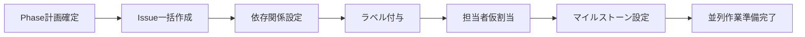
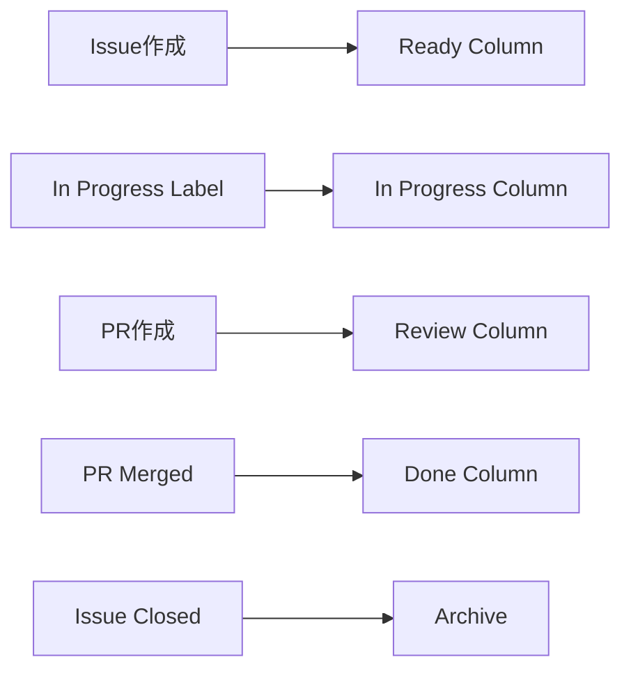
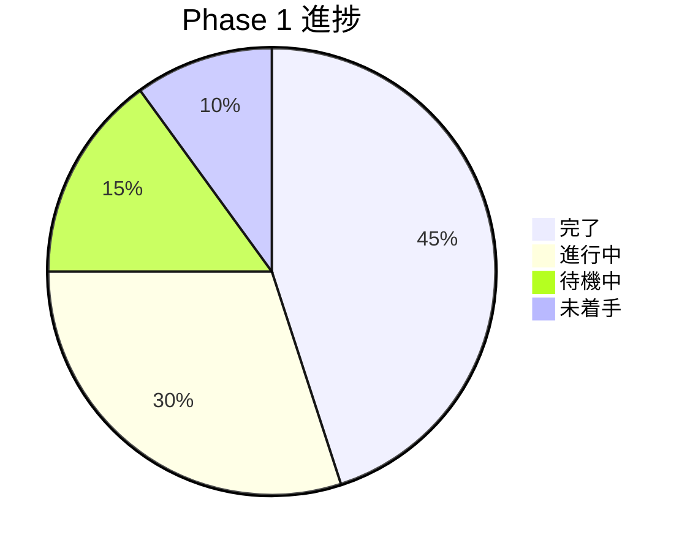

# GitHub Issue管理

> **🎯 目標**: TypeScript Minecraftプロジェクトの効率的なIssue管理システムを構築

## 📋 Issue分類体系

### 🏷️ **ラベル体系（完全版）**

#### **🎯 Priority（優先度）**
| ラベル | 色 | 使用基準 |
|--------|----|----|
| `priority: critical` | 🔴 `#D73A49` | ブロッキング、プロジェクト進行停止 |
| `priority: high` | 🟠 `#FB8C00` | Phase目標達成に必須 |
| `priority: medium` | 🟡 `#FBCA04` | 重要だが少し遅延可能 |
| `priority: low` | 🟢 `#28A745` | 改善・最適化系 |

#### **📦 Type（タイプ）**
| ラベル | 色 | 説明 |
|--------|----|----|
| `type: feature` | 🔵 `#0366D6` | 新機能実装 |
| `type: bug` | 🔴 `#D73A49` | バグ修正 |
| `type: enhancement` | 🟣 `#A2EEEF` | 既存機能改善 |
| `type: documentation` | 📚 `#0075CA` | ドキュメント作成・更新 |
| `type: refactor` | 🟨 `#D4C5F9` | リファクタリング |
| `type: test` | 🧪 `#C2E0C6` | テスト関連 |
| `type: config` | ⚙️ `#F9D0C4` | 設定・環境構築 |

#### **🔄 Status（状態）**
| ラベル | 色 | 意味 |
|--------|----|----|
| `status: ready` | 🟢 `#28A745` | 作業開始可能 |
| `status: in-progress` | 🟡 `#FBCA04` | 作業中 |
| `status: blocked` | 🔴 `#D73A49` | ブロックされている |
| `status: review` | 🟣 `#6F42C1` | レビュー中 |
| `status: testing` | 🔵 `#0366D6` | テスト中 |

#### **📊 Dependency（依存関係）**
| ラベル | 色 | 使用例 |
|--------|----|----|
| `depends-on: #XXX` | 🔴 `#D73A49` | `depends-on: #004` |
| `blocks: #XXX` | 🟠 `#FB8C00` | `blocks: #010` |
| `parallel-safe` | 🟢 `#28A745` | 完全並列実行可能 |
| `parallel-conditional` | 🟡 `#FBCA04` | 条件付き並列可能 |

#### **🏗️ Architecture（アーキテクチャ）**
| ラベル | 色 | 対象 |
|--------|----|----|
| `layer: domain` | 💎 `#E1F5FE` | ドメイン層 |
| `layer: application` | 🔧 `#F3E5F5` | アプリケーション層 |
| `layer: infrastructure` | 🏗️ `#FFF3E0` | インフラ層 |
| `layer: presentation` | 🎨 `#E8F5E8` | プレゼンテーション層 |

### 📂 **マイルストーン構造**

```mermaid
gantt
    title プロジェクトマイルストーン
    dateFormat X
    axisFormat Week %d

    section Phase 1
    基盤構築 :milestone, m1, 0, 0

    section Phase 2
    基本ゲームプレイ :milestone, m2, 5, 0

    section Phase 3
    システム拡張 :milestone, m3, 10, 0

    section Phase 4
    体験向上 :milestone, m4, 15, 0

    section Phase 5
    高度機能 :milestone, m5, 20, 0
```



**マイルストーン詳細**:
- **Phase 1 - Foundation**: プロジェクト基盤構築
- **Phase 2 - MVP**: 基本ゲーム機能実装
- **Phase 3 - Core**: コアシステム拡張
- **Phase 4 - Polish**: ユーザー体験向上
- **Phase 5 - Advanced**: 高度機能・最適化

---

## 📝 Issue Template集

### 🎯 **Feature Issue Template**

```markdown
---
name: 🎯 Feature Implementation
about: 新機能実装のためのIssue
title: '[FEATURE] '
labels: 'type: feature, status: ready'
assignees: ''
---

## 🎯 Feature Overview
[実装する機能の概要]

## 📋 Requirements
### 必須要件
- [ ] [要件1]
- [ ] [要件2]

### オプション要件
- [ ] [拡張機能1]

## 🔗 Dependencies
**⚠️ 事前完了必須**:
- [ ] #XXX - [依存タスク名]

**🟢 並列実行可能**:
- [ ] #YYY - [同時進行可能タスク]

## 🏗️ Architecture Impact
- **影響層**: [ ] Domain [ ] Application [ ] Infrastructure [ ] Presentation
- **新規追加**: [ファイル・クラス・関数]
- **既存修正**: [修正対象]

## ✅ Acceptance Criteria
- [ ] [具体的な完了条件1]
- [ ] [具体的な完了条件2]
- [ ] TypeScript型エラーなし
- [ ] テストカバレッジ ≥90%
- [ ] CI/CDパイプライン成功

## 📊 Estimation
- **実装**: X.Yd
- **テスト**: A.Bd
- **レビュー**: C.Dd
- **合計**: Z.Wd

## 📚 Related Documentation
- [関連仕様書]
- [参考資料]

## 🧪 Test Plan
- [ ] 単体テスト
- [ ] 統合テスト
- [ ] E2Eテスト（必要時）
```

### 🐛 **Bug Issue Template**

```markdown
---
name: 🐛 Bug Report
about: バグ報告・修正のためのIssue
title: '[BUG] '
labels: 'type: bug, priority: high'
assignees: ''
---

## 🐛 Bug Description
[バグの詳細な説明]

## 🔄 Steps to Reproduce
1. [ステップ1]
2. [ステップ2]
3. [ステップ3]

## ❌ Expected vs Actual
**期待する結果**: [正常な動作]
**実際の結果**: [現在の問題のある動作]

## 📱 Environment
- **ブラウザ**: Chrome/Firefox/Safari
- **OS**: Windows/macOS/Linux
- **Node.js**: v20.x
- **コミット**: [git commit hash]

## 📊 Impact
- **ユーザー影響**: [ ] Critical [ ] High [ ] Medium [ ] Low
- **頻度**: [ ] Always [ ] Often [ ] Sometimes [ ] Rare

## 🔍 Root Cause Analysis
[原因の調査結果]

## 🛠️ Proposed Solution
[修正案]

## ✅ Fix Verification
- [ ] バグ再現手順でテスト
- [ ] 関連機能への副作用確認
- [ ] リグレッションテスト実行
```

### ⚙️ **Configuration Issue Template**

```markdown
---
name: ⚙️ Configuration
about: 設定・環境構築のためのIssue
title: '[CONFIG] '
labels: 'type: config, parallel-safe'
assignees: ''
---

## ⚙️ Configuration Target
[設定対象：TypeScript/Vite/ESLint等]

## 📋 Configuration Items
- [ ] [設定項目1]
- [ ] [設定項目2]

## 🎯 Goals
- [設定の目的・効果]

## 📝 Files to Create/Modify
- [ ] `package.json`
- [ ] `tsconfig.json`
- [ ] [その他設定ファイル]

## ✅ Verification Steps
- [ ] 設定ファイル構文チェック
- [ ] ツール動作確認
- [ ] CI/CDでの動作確認

## 🔗 Dependencies
**⚠️ 並列実行安全性**: 🟢 他タスクと衝突なし
```

---

## 🎯 Issue作成ワークフロー

### 📅 **Phase開始前準備**



### 🔄 **日次Issue管理**

```bash
# Morning Standup前
1. blocked Issueの確認・解決
2. ready Issueの選択
3. 並列作業可能性チェック

# 作業中
4. status更新（ready→in-progress→review）
5. ブロッカー発見時のissue comment

# Evening Wrap-up
6. 進捗報告
7. 翌日ready Issueの準備
8. 依存関係更新
```

---

## 📊 Issue管理の自動化

### 🤖 **GitHub Actions統合**

```yaml
# .github/workflows/issue-management.yml
name: Issue Management

on:
  issues:
    types: [opened, closed, labeled]
  pull_request:
    types: [opened, closed, merged]

jobs:
  update-dependencies:
    runs-on: ubuntu-latest
    steps:
    - name: Update dependent issues
      uses: actions/github-script@v7
      with:
        script: |
          // PR merged時に依存Issueを"ready"に更新
          if (context.eventName === 'pull_request' && context.payload.action === 'closed' && context.payload.pull_request.merged) {
            // 依存関係を持つIssueを検索・更新
          }
```

### 📋 **Project Board自動化**



---

## 📈 進捗トラッキング

### 📊 **KPI指標**

```markdown
## 日次メトリクス
- **新規Issue**: X件
- **完了Issue**: Y件
- **ブロック解決**: Z件
- **並列作業率**: A%

## 週次メトリクス
- **Phase進捗**: X%
- **ベロシティ**: Y pt/week
- **バーンダウン**: 予定通り/遅延
- **品質指標**: CI成功率Z%
```

### 🎯 **マイルストーン進捗**



---

## 🔗 Issue間リンク管理

### 🔄 **関係性の種類**

| 関係 | 表記 | 意味 | 例 |
|------|------|------|-----|
| **依存** | `depends on #XXX` | 事前完了必須 | `depends on #004` |
| **ブロック** | `blocks #XXX` | 完了まで他を止める | `blocks #010` |
| **関連** | `related to #XXX` | 関連性あり | `related to #007` |
| **重複** | `duplicate of #XXX` | 重複Issue | `duplicate of #003` |
| **親子** | `parent of #XXX` | Epic関係 | `parent of #015` |

### 📋 **Issue Cross-Reference Template**

```markdown
## 🔗 Issue Relationships

**🔴 Depends on** (事前完了必須):
- #004 - Effect-TS導入
- #006 - 品質ツール設定

**🟠 Blocks** (このIssue完了まで待機):
- #012 - 基本ブロックエンティティ
- #013 - レンダリングサービス

**🔵 Related** (関連Issue):
- #008 - ECS基盤実装
- #011 - 基本テストセットアップ

**🟢 Can work in parallel** (並列実行可能):
- #001 - Package.json作成
- #002 - TypeScript設定
- #003 - Vite設定
```

---

## 🚀 効率化のベストプラクティス

### ✅ **Issue作成時のチェックリスト**
- [ ] 明確で具体的なタイトル
- [ ] 詳細な説明と背景
- [ ] 適切なラベル付与
- [ ] 依存関係の明記
- [ ] 見積もり時間の記載
- [ ] Acceptance Criteriaの定義
- [ ] 担当者・マイルストーン設定

### 🎯 **Issue完了時のチェックリスト**
- [ ] Acceptance Criteria全て満足
- [ ] 関連ドキュメント更新
- [ ] テスト実行・品質確認
- [ ] 依存Issue Ready状態更新
- [ ] ナレッジ共有・引き継ぎ

---

## 🔗 関連ドキュメント

- **[並列開発ワークフロー](./10-parallel-development-workflow.md)** - 効率的な並列作業戦略
- **[ROADMAP](../ROADMAP.md)** - 全Issue詳細とタイムライン
- **[開発規約](./00-development-conventions.md)** - コード品質基準

---

**📋 Ready for Systematic Issue Management! Let's Track Every Progress!**