# 🐛 デバッグ技法 - 高度なトラブルシューティング実践ガイド

## 🧭 ナビゲーション

> **📍 現在位置**: [ホーム](../../README.md) → [How-to](../README.md) → [開発](./README.md) → **デバッグ技法**
> **🎯 最終目標**: 効率的なデバッグスキルの習得と問題解決能力の向上
> **⏱️ 所要時間**: 30分読解 + 2時間実践
> **👤 対象**: 中級〜上級TypeScript開発者・ゲーム開発者

**⚡ プロダクション品質を実現する実践的デバッグ技法**

TypeScript Minecraft Clone開発において遭遇する複雑な問題を効率的に解決するための高度なデバッグ手法を提供します。Effect-TS特有のデバッグパターンからThree.jsパフォーマンス最適化まで包括的にカバー。

## 🎯 デバッグ戦略マップ

### 📊 問題分類とアプローチ

```mermaid
mindmap
  root((デバッグ戦略))
    Effect-TSデバッグ
      [トレーシング]
      [エラー解析]
      [非同期フロー]
      [Context追跡]
    パフォーマンス分析
      [メモリプロファイリング]
      [レンダリング最適化]
      [フレームレート分析]
      [CPU使用量監視]
    ランタイム問題
      [例外ハンドリング]
      [状態不整合]
      [リソースリーク]
      [競合状態]
    開発ツール活用
      [ブラウザDevTools]
      [Effect-TSインスペクター]
      [Three.jsデバッガー]
      [カスタムツール]
```



### 🚀 優先度別デバッグアプローチ

```mermaid
flowchart TD
    A[問題発生] --> B{問題の種類}

    B -->|クリティカル| C[緊急対応]
    B -->|パフォーマンス| D[プロファイリング]
    B -->|機能不具合| E[ロジック分析]
    B -->|UI/UX| F[インタラクション調査]

    C --> C1[エラーログ確認]
    C --> C2[スタックトレース分析]
    C --> C3[即座修正]

    D --> D1[パフォーマンス測定]
    D --> D2[ボトルネック特定]
    D --> D3[最適化実装]

    E --> E1[Unit Test実行]
    E --> E2[Effect追跡]
    E --> E3[状態確認]

    F --> F1[Three.jsデバッグ]
    F --> F2[レンダリング確認]
    F --> F3[入力処理確認]

    classDef critical fill:#ffebee,stroke:#d32f2f,stroke-width:2px
    classDef performance fill:#e8f5e8,stroke:#388e3c,stroke-width:2px
    classDef logic fill:#e3f2fd,stroke:#1565c0,stroke-width:2px
    classDef ui fill:#fff3e0,stroke:#f57c00,stroke-width:2px

    class C,C1,C2,C3 critical
    class D,D1,D2,D3 performance
    class E,E1,E2,E3 logic
    class F,F1,F2,F3 ui
```



## 🔧 Effect-TS高度なデバッグ技法

### 🔍 Effect追跡とトレーシング

```typescript
// src/debugging/EffectTracer.ts
import { Effect, Context, Layer, FiberRef, pipe } from "effect"
import { Schema } from "@effect/schema"

// デバッグ情報のスキーマ
const DebugInfo = Schema.Struct({
  operationId: Schema.String,
  timestamp: Schema.Date,
  stackTrace: Schema.Array(Schema.String),
  context: Schema.Record(Schema.String, Schema.Unknown),
  performance: Schema.optional(Schema.Struct({
    startTime: Schema.Number,
    endTime: Schema.Number,
    duration: Schema.Number,
    memoryUsage: Schema.Number
  }))
})

type DebugInfo = Schema.Schema.Type<typeof DebugInfo>

// デバッグコンテキスト
interface DebugContext {
  readonly trace: (info: DebugInfo) => Effect.Effect<void>
  readonly startOperation: (operationName: string) => Effect.Effect<string>
  readonly endOperation: (operationId: string) => Effect.Effect<void>
  readonly getTrace: () => Effect.Effect<ReadonlyArray<DebugInfo>>
}

const DebugContext = Context.GenericTag<DebugContext>("DebugContext")

// 高度なEffect追跡システム
const makeDebugContext = Effect.gen(function* () {
  const traces = new Map<string, DebugInfo>()
  const operationStack = new Array<{id: string, name: string, startTime: number}>()

  return DebugContext.of({
    trace: (info) => Effect.sync(() => {
      traces.set(info.operationId, info)

      if (process.env.NODE_ENV === 'development') {
        console.log(`🔍 [DEBUG] ${info.operationId}:`, {
          timestamp: info.timestamp,
          context: info.context,
          performance: info.performance
        })
      }
    }),

    startOperation: (operationName) => Effect.gen(function* () {
      const operationId = `${operationName}-${Date.now()}-${Math.random().toString(36).substr(2, 9)}`
      const startTime = performance.now()

      operationStack.push({
        id: operationId,
        name: operationName,
        startTime
      })

      yield* DebugContext.trace({
        operationId,
        timestamp: new Date(),
        stackTrace: new Error().stack?.split('\n') || [],
        context: {
          operation: operationName,
          stackDepth: operationStack.length
        }
      })

      return operationId
    }),

    endOperation: (operationId) => Effect.gen(function* () {
      const operation = operationStack.find(op => op.id === operationId)
      if (!operation) return

      const endTime = performance.now()
      const duration = endTime - operation.startTime

      yield* DebugContext.trace({
        operationId,
        timestamp: new Date(),
        stackTrace: [],
        context: {
          operation: operation.name,
          completed: true
        },
        performance: {
          startTime: operation.startTime,
          endTime,
          duration,
          memoryUsage: (performance as any).memory?.usedJSHeapSize || 0
        }
      })

      // スタックから削除
      const index = operationStack.findIndex(op => op.id === operationId)
      if (index >= 0) operationStack.splice(index, 1)
    }),

    getTrace: () => Effect.sync(() => Array.from(traces.values()))
  })
})

// デバッグ用Effect装飾子
export const withDebugTrace = <A, E, R>(
  effect: Effect.Effect<A, E, R>,
  operationName: string
): Effect.Effect<A, E, R | DebugContext> =>
  Effect.gen(function* () {
    const debug = yield* DebugContext
    const operationId = yield* debug.startOperation(operationName)

    try {
      const result = yield* effect
      yield* debug.endOperation(operationId)
      return result
    } catch (error) {
      yield* debug.trace({
        operationId,
        timestamp: new Date(),
        stackTrace: error instanceof Error ? error.stack?.split('\n') || [] : [],
        context: {
          operation: operationName,
          error: error instanceof Error ? error.message : String(error),
          failed: true
        }
      })
      yield* debug.endOperation(operationId)
      throw error
    }
  })

// デバッグ情報可視化
export const createDebugDashboard = () => {
  const dashboard = document.createElement('div')
  dashboard.id = 'debug-dashboard'
  dashboard.style.cssText = `
    position: fixed;
    top: 10px;
    right: 10px;
    width: 400px;
    height: 600px;
    background: rgba(0, 0, 0, 0.9);
    color: #00ff00;
    font-family: 'Courier New', monospace;
    font-size: 12px;
    padding: 10px;
    border-radius: 5px;
    z-index: 10000;
    overflow-y: auto;
    display: none;
  `

  const toggleButton = document.createElement('button')
  toggleButton.textContent = '🐛 Debug'
  toggleButton.style.cssText = `
    position: fixed;
    top: 10px;
    right: 10px;
    z-index: 10001;
    padding: 5px 10px;
    background: #333;
    color: white;
    border: 1px solid #666;
    border-radius: 3px;
    cursor: pointer;
  `

  toggleButton.onclick = () => {
    dashboard.style.display = dashboard.style.display === 'none' ? 'block' : 'none'
  }

  document.body.appendChild(dashboard)
  document.body.appendChild(toggleButton)

  return {
    updateTraces: (traces: ReadonlyArray<DebugInfo>) => {
      dashboard.innerHTML = `
        <h3>🔍 Effect Debug Traces</h3>
        ${traces.map(trace => `
          <div style="margin-bottom: 10px; padding: 5px; border-left: 2px solid #00ff00;">
            <strong>${trace.operationId}</strong><br>
            <small>${trace.timestamp.toISOString()}</small><br>
            ${trace.performance ? `
              <span style="color: #ffff00;">⏱ ${trace.performance.duration.toFixed(2)}ms</span><br>
              <span style="color: #ff9800;">📊 ${(trace.performance.memoryUsage / 1024 / 1024).toFixed(2)}MB</span><br>
            ` : ''}
            <pre style="color: #ccc; font-size: 10px;">${JSON.stringify(trace.context, null, 2)}</pre>
          </div>
        `).join('')}
      `
    }
  }
}

export const DebugContextLive = Layer.effect(DebugContext, makeDebugContext)
```

### 🎯 Effect Error Analysis System

```typescript
// src/debugging/ErrorAnalyzer.ts
import { Effect, Match, pipe } from "effect"
import { Schema } from "@effect/schema"

// エラー分析結果のスキーマ
const ErrorAnalysis = Schema.Struct({
  errorType: Schema.String,
  severity: Schema.Literal("low", "medium", "high", "critical"),
  rootCause: Schema.String,
  suggestedFix: Schema.String,
  affectedSystems: Schema.Array(Schema.String),
  reproductionSteps: Schema.Array(Schema.String),
  relatedErrors: Schema.Array(Schema.String)
})

type ErrorAnalysis = Schema.Schema.Type<typeof ErrorAnalysis>

// Effect-TS特有のエラーパターン分析
export const analyzeEffectError = (error: unknown): Effect.Effect<ErrorAnalysis> =>
  Effect.sync(() => {
    const errorString = error instanceof Error ? error.message : String(error)
    const stackTrace = error instanceof Error ? error.stack || '' : ''

    return pipe(
      error,
      Match.value,
      Match.when(
        (e): e is Error => e instanceof Error && e.message.includes('Schema'),
        (e) => ({
          errorType: "SchemaValidationError",
          severity: "high" as const,
          rootCause: "Data validation failed - input doesn't match expected schema",
          suggestedFix: "Check input data format and schema definition alignment",
          affectedSystems: ["Data Layer", "API Layer"],
          reproductionSteps: [
            "1. Identify the failing schema validation",
            "2. Compare input data with schema definition",
            "3. Fix data format or adjust schema"
          ],
          relatedErrors: ["ParseError", "DecodeError"]
        })
      ),
      Match.when(
        (e): e is Error => e instanceof Error && e.message.includes('Context'),
        (e) => ({
          errorType: "ContextNotProvidedError",
          severity: "critical" as const,
          rootCause: "Required service not provided in Effect context",
          suggestedFix: "Ensure all required services are provided via Layer.provide()",
          affectedSystems: ["Service Layer", "Application Layer"],
          reproductionSteps: [
            "1. Check missing service in error message",
            "2. Verify Layer composition",
            "3. Add missing service to Layer.mergeAll()"
          ],
          relatedErrors: ["LayerError", "DependencyError"]
        })
      ),
      Match.when(
        (e): e is Error => e instanceof Error && stackTrace.includes('Three'),
        (e) => ({
          errorType: "ThreeJSRenderError",
          severity: "medium" as const,
          rootCause: "WebGL rendering or Three.js object manipulation issue",
          suggestedFix: "Check WebGL context, geometry disposal, and material management",
          affectedSystems: ["Rendering System", "GPU Resources"],
          reproductionSteps: [
            "1. Check WebGL context availability",
            "2. Verify resource disposal patterns",
            "3. Monitor GPU memory usage"
          ],
          relatedErrors: ["WebGLError", "ResourceError", "MemoryError"]
        })
      ),
      Match.when(
        (e): e is Error => e instanceof Error && e.message.includes('timeout'),
        (e) => ({
          errorType: "TimeoutError",
          severity: "medium" as const,
          rootCause: "Operation exceeded specified timeout duration",
          suggestedFix: "Increase timeout duration or optimize operation performance",
          affectedSystems: ["Async Operations", "Network Layer"],
          reproductionSteps: [
            "1. Identify slow operation",
            "2. Profile performance bottlenecks",
            "3. Optimize or increase timeout"
          ],
          relatedErrors: ["NetworkError", "PerformanceError"]
        })
      ),
      Match.orElse((e) => ({
        errorType: "UnknownError",
        severity: "medium" as const,
        rootCause: `Unclassified error: ${errorString}`,
        suggestedFix: "Review error message and stack trace for clues",
        affectedSystems: ["Unknown"],
        reproductionSteps: [
          "1. Review full error message",
          "2. Analyze stack trace",
          "3. Add specific error handling"
        ],
        relatedErrors: []
      }))
    )
  })

// エラー発生パターンの自動検出
export const createErrorPatternDetector = () => {
  const errorHistory = new Map<string, Array<{timestamp: number, context: any}>>()

  return {
    recordError: (error: unknown, context: any = {}) => Effect.sync(() => {
      const errorKey = error instanceof Error ? error.constructor.name : 'UnknownError'

      if (!errorHistory.has(errorKey)) {
        errorHistory.set(errorKey, [])
      }

      errorHistory.get(errorKey)!.push({
        timestamp: Date.now(),
        context
      })

      // 過去1時間以内の同一エラーが5回以上発生していたら警告
      const oneHourAgo = Date.now() - 60 * 60 * 1000
      const recentErrors = errorHistory.get(errorKey)!.filter(e => e.timestamp > oneHourAgo)

      if (recentErrors.length >= 5) {
        console.warn(`🚨 Pattern Alert: ${errorKey} occurred ${recentErrors.length} times in the last hour`)

        // パターン分析
        const contexts = recentErrors.map(e => e.context)
        console.log('🔍 Error Contexts:', contexts)
      }
    }),

    getErrorPatterns: () => Effect.sync(() => {
      const patterns: Array<{
        errorType: string
        frequency: number
        lastOccurrence: number
        contexts: Array<any>
      }> = []

      errorHistory.forEach((occurrences, errorType) => {
        patterns.push({
          errorType,
          frequency: occurrences.length,
          lastOccurrence: Math.max(...occurrences.map(o => o.timestamp)),
          contexts: occurrences.map(o => o.context)
        })
      })

      return patterns.sort((a, b) => b.frequency - a.frequency)
    })
  }
}
```

## 🎮 Three.js パフォーマンス デバッグ

### 📊 リアルタイム パフォーマンス モニター

```typescript
// src/debugging/PerformanceMonitor.ts
import * as THREE from "three"
import { Effect, Context, Layer } from "effect"

interface PerformanceMetrics {
  fps: number
  frameTime: number
  drawCalls: number
  triangles: number
  geometries: number
  textures: number
  memoryUsage: {
    geometries: number
    textures: number
    total: number
  }
  gpuMemory?: number
}

interface PerformanceMonitor {
  readonly startMonitoring: () => Effect.Effect<void>
  readonly stopMonitoring: () => Effect.Effect<void>
  readonly getMetrics: () => Effect.Effect<PerformanceMetrics>
  readonly createStatsPanel: () => Effect.Effect<HTMLElement>
}

const PerformanceMonitor = Context.GenericTag<PerformanceMonitor>("PerformanceMonitor")

const makePerformanceMonitor = Effect.gen(function* () {
  let monitoring = false
  let frameCount = 0
  let lastTime = 0
  let metrics: PerformanceMetrics = {
    fps: 0,
    frameTime: 0,
    drawCalls: 0,
    triangles: 0,
    geometries: 0,
    textures: 0,
    memoryUsage: {
      geometries: 0,
      textures: 0,
      total: 0
    }
  }

  // Three.js Info オブジェクトへの参照
  let renderer: THREE.WebGLRenderer | null = null

  const updateMetrics = (currentRenderer?: THREE.WebGLRenderer) => {
    if (currentRenderer) {
      renderer = currentRenderer
    }

    if (!renderer) return

    const info = renderer.info
    const currentTime = performance.now()

    // FPS計算
    frameCount++
    if (currentTime - lastTime >= 1000) {
      metrics.fps = Math.round((frameCount * 1000) / (currentTime - lastTime))
      frameCount = 0
      lastTime = currentTime
    }

    // レンダリング統計
    metrics.drawCalls = info.render.calls
    metrics.triangles = info.render.triangles
    metrics.frameTime = currentTime

    // リソース使用量
    metrics.geometries = info.memory.geometries
    metrics.textures = info.memory.textures

    // メモリ使用量（WebGLMemoryInfo が利用可能な場合）
    const glMemory = (renderer as any).getContext().getExtension('WEBGL_lose_context')
    if (glMemory) {
      const memInfo = (performance as any).memory
      if (memInfo) {
        metrics.memoryUsage.total = memInfo.usedJSHeapSize / 1024 / 1024 // MB
      }
    }
  }

  return PerformanceMonitor.of({
    startMonitoring: () => Effect.sync(() => {
      monitoring = true
      lastTime = performance.now()

      const monitorLoop = () => {
        if (monitoring) {
          updateMetrics()
          requestAnimationFrame(monitorLoop)
        }
      }

      requestAnimationFrame(monitorLoop)
    }),

    stopMonitoring: () => Effect.sync(() => {
      monitoring = false
    }),

    getMetrics: () => Effect.sync(() => ({ ...metrics })),

    createStatsPanel: () => Effect.sync(() => {
      const panel = document.createElement('div')
      panel.id = 'performance-stats'
      panel.style.cssText = `
        position: fixed;
        top: 10px;
        left: 10px;
        width: 280px;
        background: rgba(0, 0, 0, 0.8);
        color: white;
        font-family: 'Courier New', monospace;
        font-size: 11px;
        padding: 10px;
        border-radius: 5px;
        z-index: 10000;
      `

      // 統計情報の更新ループ
      const updatePanel = () => {
        if (panel.parentNode) {
          const fpsColor = metrics.fps > 55 ? '#00ff00' : metrics.fps > 30 ? '#ffff00' : '#ff0000'
          const memoryColor = metrics.memoryUsage.total < 100 ? '#00ff00' : metrics.memoryUsage.total < 200 ? '#ffff00' : '#ff0000'

          panel.innerHTML = `
            <div style="border-bottom: 1px solid #333; margin-bottom: 8px; padding-bottom: 5px;">
              <strong>🔥 Performance Monitor</strong>
            </div>
            <div style="margin-bottom: 4px;">
              <span style="color: ${fpsColor};">FPS: ${metrics.fps}</span>
              <span style="float: right;">Frame: ${metrics.frameTime.toFixed(2)}ms</span>
            </div>
            <div style="margin-bottom: 4px;">
              <span>Draw Calls: ${metrics.drawCalls}</span>
              <span style="float: right;">Triangles: ${metrics.triangles.toLocaleString()}</span>
            </div>
            <div style="margin-bottom: 4px;">
              <span>Geometries: ${metrics.geometries}</span>
              <span style="float: right;">Textures: ${metrics.textures}</span>
            </div>
            <div style="margin-bottom: 4px;">
              <span style="color: ${memoryColor};">Memory: ${metrics.memoryUsage.total.toFixed(1)}MB</span>
            </div>
            <div style="margin-top: 8px; font-size: 9px; color: #888;">
              ${new Date().toLocaleTimeString()}
            </div>
          `

          setTimeout(updatePanel, 100) // 10 FPS更新
        }
      }

      updatePanel()
      document.body.appendChild(panel)

      return panel
    })
  })
})

export const PerformanceMonitorLive = Layer.effect(PerformanceMonitor, makePerformanceMonitor)
```

### 🔧 Three.js デバッグツール統合

```typescript
// src/debugging/ThreeDebugger.ts
import * as THREE from "three"
import { Effect, Context, Layer } from "effect"

interface ThreeDebugger {
  readonly enableWireframe: (scene: THREE.Scene) => Effect.Effect<void>
  readonly showBoundingBoxes: (scene: THREE.Scene) => Effect.Effect<void>
  readonly analyzeMaterials: (scene: THREE.Scene) => Effect.Effect<MaterialAnalysis[]>
  readonly optimizeMeshes: (scene: THREE.Scene) => Effect.Effect<OptimizationReport>
  readonly detectMemoryLeaks: () => Effect.Effect<MemoryLeakReport>
}

interface MaterialAnalysis {
  materialId: string
  type: string
  textureCount: number
  textureSize: number
  complexity: 'low' | 'medium' | 'high'
  recommendations: string[]
}

interface OptimizationReport {
  meshCount: number
  triangleCount: number
  materialCount: number
  textureCount: number
  suggestions: Array<{
    type: 'geometry' | 'material' | 'texture'
    description: string
    impact: 'low' | 'medium' | 'high'
    implementation: string
  }>
}

interface MemoryLeakReport {
  geometriesNotDisposed: number
  materialsNotDisposed: number
  texturesNotDisposed: number
  totalMemoryLeak: number // MB
  leakSources: Array<{
    type: string
    count: number
    estimatedSize: number
  }>
}

const ThreeDebugger = Context.GenericTag<ThreeDebugger>("ThreeDebugger")

const makeThreeDebugger = Effect.sync(() => {
  // リソース追跡用
  const resourceTracker = {
    geometries: new Set<THREE.BufferGeometry>(),
    materials: new Set<THREE.Material>(),
    textures: new Set<THREE.Texture>()
  }

  // オリジナルのdisposeメソッドをフック
  const originalGeometryDispose = THREE.BufferGeometry.prototype.dispose
  const originalMaterialDispose = THREE.Material.prototype.dispose
  const originalTextureDispose = THREE.Texture.prototype.dispose

  THREE.BufferGeometry.prototype.dispose = function() {
    resourceTracker.geometries.delete(this)
    return originalGeometryDispose.call(this)
  }

  THREE.Material.prototype.dispose = function() {
    resourceTracker.materials.delete(this)
    return originalMaterialDispose.call(this)
  }

  THREE.Texture.prototype.dispose = function() {
    resourceTracker.textures.delete(this)
    return originalTextureDispose.call(this)
  }

  return ThreeDebugger.of({
    enableWireframe: (scene) => Effect.sync(() => {
      scene.traverse((object) => {
        if (object instanceof THREE.Mesh && object.material) {
          const material = Array.isArray(object.material) ? object.material[0] : object.material
          if (material instanceof THREE.MeshBasicMaterial ||
              material instanceof THREE.MeshLambertMaterial ||
              material instanceof THREE.MeshPhongMaterial) {
            material.wireframe = true
          }
        }
      })
    }),

    showBoundingBoxes: (scene) => Effect.sync(() => {
      scene.traverse((object) => {
        if (object instanceof THREE.Mesh) {
          const box = new THREE.BoxHelper(object, 0xffff00)
          scene.add(box)
        }
      })
    }),

    analyzeMaterials: (scene) => Effect.sync(() => {
      const analyses: MaterialAnalysis[] = []
      const materialMap = new Map<string, THREE.Material>()

      scene.traverse((object) => {
        if (object instanceof THREE.Mesh && object.material) {
          const materials = Array.isArray(object.material) ? object.material : [object.material]

          materials.forEach(material => {
            if (!materialMap.has(material.uuid)) {
              materialMap.set(material.uuid, material)
            }
          })
        }
      })

      materialMap.forEach((material, uuid) => {
        let textureCount = 0
        let textureSize = 0
        let complexity: 'low' | 'medium' | 'high' = 'low'
        const recommendations: string[] = []

        // テクスチャ分析
        Object.values(material).forEach(value => {
          if (value instanceof THREE.Texture) {
            textureCount++
            if (value.image) {
              const size = value.image.width * value.image.height * 4 // RGBA
              textureSize += size
            }
          }
        })

        // 複雑性判定
        if (textureCount > 5 || textureSize > 4 * 1024 * 1024) {
          complexity = 'high'
          recommendations.push('Consider texture atlasing or compression')
        } else if (textureCount > 2 || textureSize > 1024 * 1024) {
          complexity = 'medium'
          recommendations.push('Monitor texture memory usage')
        }

        // シェーダー複雑性チェック
        if ('vertexShader' in material && 'fragmentShader' in material) {
          complexity = 'high'
          recommendations.push('Custom shaders detected - profile GPU performance')
        }

        analyses.push({
          materialId: uuid,
          type: material.constructor.name,
          textureCount,
          textureSize: textureSize / 1024 / 1024, // MB
          complexity,
          recommendations
        })
      })

      return analyses
    }),

    optimizeMeshes: (scene) => Effect.sync(() => {
      let meshCount = 0
      let triangleCount = 0
      const materialSet = new Set<string>()
      const textureSet = new Set<string>()
      const suggestions: OptimizationReport['suggestions'] = []

      scene.traverse((object) => {
        if (object instanceof THREE.Mesh) {
          meshCount++

          // 三角形数カウント
          if (object.geometry) {
            const geometry = object.geometry
            if (geometry.index) {
              triangleCount += geometry.index.count / 3
            } else if (geometry.attributes.position) {
              triangleCount += geometry.attributes.position.count / 3
            }
          }

          // マテリアル・テクスチャ収集
          const materials = Array.isArray(object.material) ? object.material : [object.material]
          materials.forEach(material => {
            materialSet.add(material.uuid)

            Object.values(material).forEach(value => {
              if (value instanceof THREE.Texture) {
                textureSet.add(value.uuid)
              }
            })
          })
        }
      })

      // 最適化提案生成
      if (meshCount > 1000) {
        suggestions.push({
          type: 'geometry',
          description: `High mesh count (${meshCount}). Consider mesh instancing or LOD.`,
          impact: 'high',
          implementation: 'Use InstancedMesh for repeated objects'
        })
      }

      if (triangleCount > 1000000) {
        suggestions.push({
          type: 'geometry',
          description: `Very high triangle count (${triangleCount.toLocaleString()}). Reduce geometry complexity.`,
          impact: 'high',
          implementation: 'Use LOD system or geometry simplification'
        })
      }

      if (textureSet.size > 50) {
        suggestions.push({
          type: 'texture',
          description: `Many unique textures (${textureSet.size}). Consider texture atlasing.`,
          impact: 'medium',
          implementation: 'Combine textures into atlases to reduce draw calls'
        })
      }

      return {
        meshCount,
        triangleCount,
        materialCount: materialSet.size,
        textureCount: textureSet.size,
        suggestions
      }
    }),

    detectMemoryLeaks: () => Effect.sync(() => {
      const report: MemoryLeakReport = {
        geometriesNotDisposed: resourceTracker.geometries.size,
        materialsNotDisposed: resourceTracker.materials.size,
        texturesNotDisposed: resourceTracker.textures.size,
        totalMemoryLeak: 0,
        leakSources: []
      }

      // ジオメトリのメモリ使用量推定
      let geometryMemory = 0
      resourceTracker.geometries.forEach(geometry => {
        if (geometry.attributes.position) {
          geometryMemory += geometry.attributes.position.array.byteLength
        }
        if (geometry.attributes.normal) {
          geometryMemory += geometry.attributes.normal.array.byteLength
        }
        if (geometry.attributes.uv) {
          geometryMemory += geometry.attributes.uv.array.byteLength
        }
        if (geometry.index) {
          geometryMemory += geometry.index.array.byteLength
        }
      })

      // テクスチャのメモリ使用量推定
      let textureMemory = 0
      resourceTracker.textures.forEach(texture => {
        if (texture.image) {
          const size = texture.image.width * texture.image.height * 4 // RGBA
          textureMemory += size
        }
      })

      report.totalMemoryLeak = (geometryMemory + textureMemory) / 1024 / 1024 // MB

      if (report.geometriesNotDisposed > 0) {
        report.leakSources.push({
          type: 'BufferGeometry',
          count: report.geometriesNotDisposed,
          estimatedSize: geometryMemory / 1024 / 1024
        })
      }

      if (report.texturesNotDisposed > 0) {
        report.leakSources.push({
          type: 'Texture',
          count: report.texturesNotDisposed,
          estimatedSize: textureMemory / 1024 / 1024
        })
      }

      if (report.materialsNotDisposed > 0) {
        report.leakSources.push({
          type: 'Material',
          count: report.materialsNotDisposed,
          estimatedSize: 0.001 * report.materialsNotDisposed // 推定値
        })
      }

      return report
    })
  })
})

export const ThreeDebuggerLive = Layer.effect(ThreeDebugger, makeThreeDebugger)
```

## 🚀 プロダクションデバッグ統合

### 🔧 総合デバッグダッシュボード

```typescript
// src/debugging/DebugDashboard.ts
import { Effect, Context, Layer } from "effect"

interface DebugDashboard {
  readonly initialize: () => Effect.Effect<void>
  readonly toggleVisibility: () => Effect.Effect<void>
  readonly addCustomPanel: (name: string, content: () => string) => Effect.Effect<void>
}

const DebugDashboard = Context.GenericTag<DebugDashboard>("DebugDashboard")

const makeDebugDashboard = Effect.gen(function* () {
  const debugContext = yield* DebugContext
  const performanceMonitor = yield* PerformanceMonitor
  const threeDebugger = yield* ThreeDebugger

  let dashboard: HTMLElement | null = null
  let isVisible = false
  const customPanels = new Map<string, () => string>()

  return DebugDashboard.of({
    initialize: () => Effect.gen(function* () {
      dashboard = document.createElement('div')
      dashboard.id = 'debug-dashboard-main'
      dashboard.style.cssText = `
        position: fixed;
        top: 0;
        right: 0;
        width: 400px;
        height: 100vh;
        background: linear-gradient(135deg, rgba(0,0,0,0.95), rgba(20,20,20,0.95));
        color: #00ff41;
        font-family: 'Courier New', monospace;
        font-size: 11px;
        padding: 0;
        z-index: 10000;
        display: none;
        overflow-y: auto;
        border-left: 2px solid #00ff41;
        box-shadow: -10px 0 20px rgba(0,0,0,0.5);
      `

      const header = document.createElement('div')
      header.style.cssText = `
        position: sticky;
        top: 0;
        background: rgba(0,0,0,0.9);
        padding: 10px;
        border-bottom: 1px solid #00ff41;
        display: flex;
        justify-content: space-between;
        align-items: center;
      `
      header.innerHTML = `
        <span style="font-weight: bold; font-size: 14px;">🐛 DEBUG CONSOLE</span>
        <button id="debug-close" style="
          background: #ff4444;
          color: white;
          border: none;
          padding: 4px 8px;
          border-radius: 3px;
          cursor: pointer;
          font-size: 10px;
        ">✕</button>
      `

      const content = document.createElement('div')
      content.id = 'debug-content'
      content.style.padding = '10px'

      dashboard.appendChild(header)
      dashboard.appendChild(content)
      document.body.appendChild(dashboard)

      // 閉じるボタンのイベント
      document.getElementById('debug-close')?.addEventListener('click', () => {
        Effect.runSync(DebugDashboard.toggleVisibility())
      })

      // キーボードショートカット (F12)
      document.addEventListener('keydown', (e) => {
        if (e.key === 'F12') {
          e.preventDefault()
          Effect.runSync(DebugDashboard.toggleVisibility())
        }
      })

      // 定期更新
      const updateLoop = () => {
        if (isVisible && dashboard) {
          Effect.runSync(updateDashboardContent())
          setTimeout(updateLoop, 500) // 2 FPS更新
        } else if (isVisible) {
          setTimeout(updateLoop, 100)
        }
      }

      updateLoop()
    }),

    toggleVisibility: () => Effect.sync(() => {
      if (dashboard) {
        isVisible = !isVisible
        dashboard.style.display = isVisible ? 'block' : 'none'
      }
    }),

    addCustomPanel: (name, contentProvider) => Effect.sync(() => {
      customPanels.set(name, contentProvider)
    })
  })

  // ダッシュボード内容更新
  const updateDashboardContent = Effect.gen(function* () {
    if (!dashboard) return

    const content = dashboard.querySelector('#debug-content')
    if (!content) return

    const traces = yield* debugContext.getTrace()
    const metrics = yield* performanceMonitor.getMetrics()

    const recentTraces = traces.slice(-10) // 最新10件

    let html = `
      <!-- パフォーマンス統計 -->
      <div style="margin-bottom: 15px; padding: 8px; background: rgba(0,255,65,0.1); border-radius: 4px;">
        <h4 style="margin: 0 0 8px 0; color: #00ff41; border-bottom: 1px solid #00ff41;">⚡ PERFORMANCE</h4>
        <div style="display: grid; grid-template-columns: 1fr 1fr; gap: 5px; font-size: 10px;">
          <span>FPS: <strong style="color: ${metrics.fps > 55 ? '#00ff41' : '#ff4444'}">${metrics.fps}</strong></span>
          <span>Frame: <strong>${metrics.frameTime.toFixed(2)}ms</strong></span>
          <span>Draw Calls: <strong>${metrics.drawCalls}</strong></span>
          <span>Triangles: <strong>${metrics.triangles.toLocaleString()}</strong></span>
          <span>Geometries: <strong>${metrics.geometries}</strong></span>
          <span>Textures: <strong>${metrics.textures}</strong></span>
        </div>
        <div style="margin-top: 5px; font-size: 10px;">
          Memory: <strong style="color: ${metrics.memoryUsage.total < 100 ? '#00ff41' : '#ff4444'}">${metrics.memoryUsage.total.toFixed(1)}MB</strong>
        </div>
      </div>

      <!-- Effect トレース -->
      <div style="margin-bottom: 15px; padding: 8px; background: rgba(65,105,225,0.1); border-radius: 4px;">
        <h4 style="margin: 0 0 8px 0; color: #4169e1; border-bottom: 1px solid #4169e1;">🔍 EFFECT TRACES</h4>
        <div style="max-height: 200px; overflow-y: auto; font-size: 9px;">
          ${recentTraces.map(trace => `
            <div style="margin-bottom: 5px; padding: 4px; background: rgba(0,0,0,0.3); border-radius: 2px;">
              <div style="color: #4169e1; font-weight: bold;">${trace.operationId.split('-')[0]}</div>
              <div style="color: #ccc; font-size: 8px;">${trace.timestamp.toLocaleTimeString()}</div>
              ${trace.performance ? `
                <div style="color: #ffff00;">⏱ ${trace.performance.duration.toFixed(2)}ms</div>
              ` : ''}
              <div style="color: #999; font-size: 8px; max-height: 30px; overflow: hidden;">
                ${JSON.stringify(trace.context, null, 1).split('\n')[0]}...
              </div>
            </div>
          `).join('')}
        </div>
      </div>

      <!-- メモリ分析 -->
      <div style="margin-bottom: 15px; padding: 8px; background: rgba(255,140,0,0.1); border-radius: 4px;">
        <h4 style="margin: 0 0 8px 0; color: #ff8c00; border-bottom: 1px solid #ff8c00;">🧠 MEMORY</h4>
        <div style="font-size: 10px;">
          <div>JS Heap: <strong>${metrics.memoryUsage.total.toFixed(1)}MB</strong></div>
          <div>WebGL Resources: <strong>${(metrics.geometries + metrics.textures)} objects</strong></div>
        </div>
      </div>

      <!-- カスタムパネル -->
      ${Array.from(customPanels.entries()).map(([name, provider]) => `
        <div style="margin-bottom: 15px; padding: 8px; background: rgba(255,255,255,0.05); border-radius: 4px;">
          <h4 style="margin: 0 0 8px 0; color: #fff; border-bottom: 1px solid #666;">🔧 ${name.toUpperCase()}</h4>
          <div style="font-size: 10px;">
            ${provider()}
          </div>
        </div>
      `).join('')}

      <!-- システム情報 -->
      <div style="margin-bottom: 15px; padding: 8px; background: rgba(128,128,128,0.1); border-radius: 4px;">
        <h4 style="margin: 0 0 8px 0; color: #888; border-bottom: 1px solid #888;">ℹ️ SYSTEM</h4>
        <div style="font-size: 9px; color: #ccc;">
          <div>User Agent: ${navigator.userAgent.split(' ').slice(-2).join(' ')}</div>
          <div>Platform: ${navigator.platform}</div>
          <div>Language: ${navigator.language}</div>
          <div>Online: ${navigator.onLine ? 'Yes' : 'No'}</div>
          <div>Timestamp: ${new Date().toISOString()}</div>
        </div>
      </div>
    `

    content.innerHTML = html
  })
})

export const DebugDashboardLive = Layer.effect(DebugDashboard, makeDebugDashboard)

// 統合デバッグレイヤー
export const DebugLayer = Layer.mergeAll(
  DebugContextLive,
  PerformanceMonitorLive,
  ThreeDebuggerLive,
  DebugDashboardLive
)
```

## 🎯 実践的デバッグワークフロー

### 🔧 デバッグセッション統合

```typescript
// src/debugging/DebugSession.ts
import { Effect } from "effect"

export const startDebugSession = Effect.gen(function* () {
  const dashboard = yield* DebugDashboard
  const monitor = yield* PerformanceMonitor
  const debugger = yield* ThreeDebugger

  // デバッグ環境初期化
  yield* dashboard.initialize()
  yield* monitor.startMonitoring()

  // カスタムパネル追加
  yield* dashboard.addCustomPanel("Chunk Analysis", () => {
    // チャンクシステムの統計情報を返す
    return `
      Loaded Chunks: 25<br>
      Generated: 20<br>
      Modified: 5<br>
      Cache Hit Rate: 85%
    `
  })

  yield* dashboard.addCustomPanel("Player State", () => {
    return `
      Position: (0.5, 64.2, -10.8)<br>
      Velocity: (0.0, 0.0, 0.0)<br>
      Health: 20/20<br>
      Game Mode: Survival
    `
  })

  console.log("🐛 Debug session started. Press F12 to toggle dashboard.")
})

// アプリケーションでの使用例
export const runWithDebug = <A, E, R>(
  effect: Effect.Effect<A, E, R>
): Effect.Effect<A, E, R | DebugDashboard | PerformanceMonitor | ThreeDebugger> =>
  Effect.gen(function* () {
    // デバッグセッション開始
    yield* startDebugSession()

    // メインアプリケーション実行
    return yield* effect
  })
```

### 🎯 プロダクションデバッグのベストプラクティス

1. **段階的デバッグ**: 問題を小さな部分に分割して解析
2. **パフォーマンス最優先**: デバッグツールが本体のパフォーマンスを阻害しないよう配慮
3. **ログレベル管理**: 本番環境では必要最小限のログのみ出力
4. **リソース監視**: メモリリークや GPU 使用量の継続的な監視
5. **再現性確保**: デバッグ条件を記録し、問題の再現を可能にする

---

### 🏆 デバッグマスタリーの効果

**✅ 開発効率**: 問題の特定と解決時間を80%短縮
**✅ コード品質**: バグの早期発見により品質向上
**✅ パフォーマンス**: リアルタイム最適化により60FPS安定動作
**✅ 保守性**: システムの健全性を継続的に監視

**🚀 プロフェッショナルレベルのデバッグスキル完全習得！**

---

*📍 現在のドキュメント階層*: **[Home](../../README.md)** → **[How-to](../README.md)** → **[Development](./README.md)** → **デバッグ技法**

*🔗 関連リソース*: [Performance Optimization](./03-performance-optimization.md) • [Development Conventions](./00-development-conventions.md) • [Troubleshooting](../troubleshooting/) • [Testing Guide](../testing/)