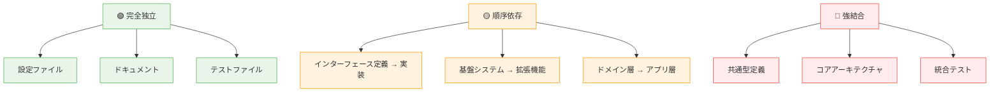
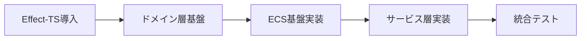
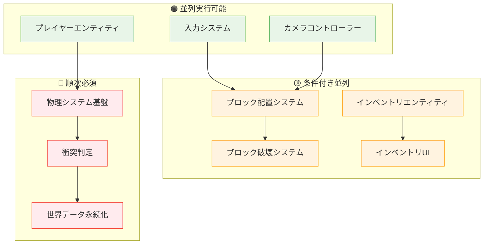
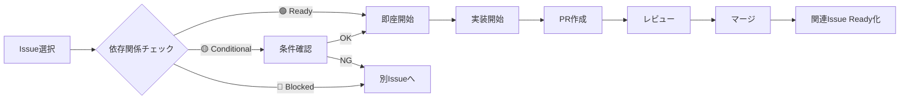
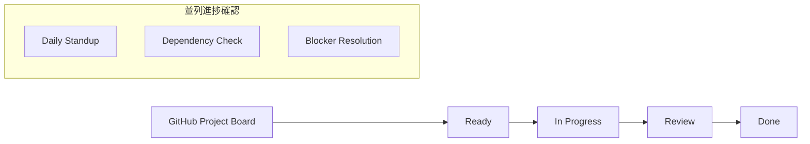
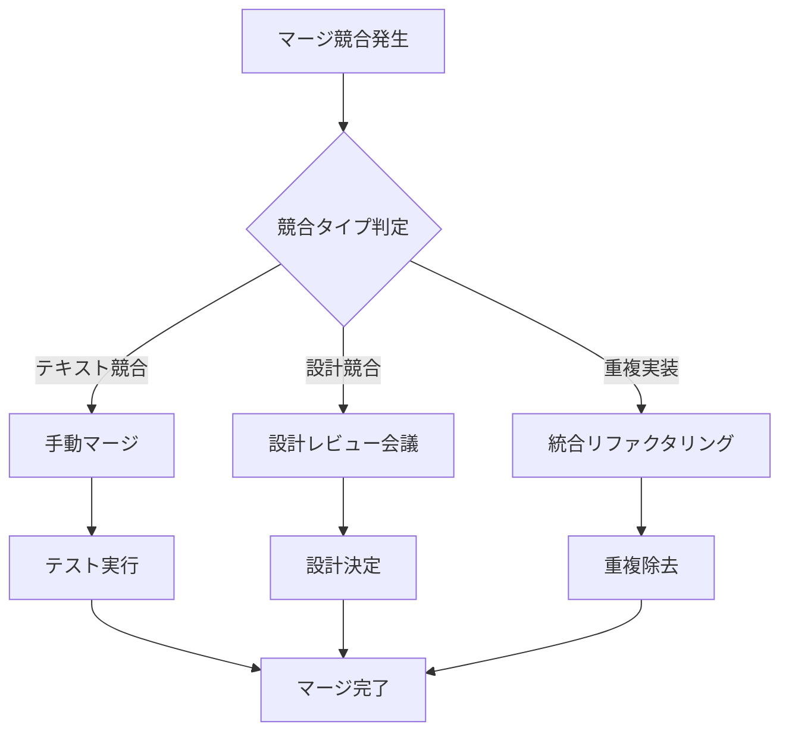

# 並列開発ワークフロー

> **🎯 目標**: GitHub Issueの依存関係を明確にし、複数開発者が効率的に並列作業できるワークフローを構築

## 📋 並列作業の基本原則

### 🔄 **依存関係の分類**



### ⚡ **並列作業パターン**

| パターン | 説明 | 例 | 効率度 |
|---------|-----|-----|--------|
| **🟢 完全並列** | 依存なし、同時進行可能 | 設定ファイル群の作成 | 100% |
| **🟡 段階並列** | 段階的に並列化可能 | Layer実装（Domain→App→Infrastructure） | 70% |
| **🔴 順次実装** | 厳密な順序が必要 | 共通型→各システム実装 | 30% |

---

## 🎯 Phase別並列戦略

### 📦 **Phase 1: プロジェクト基盤構築**

#### 🟢 **完全並列グループ A**（同時開始可能）

```mermaid
gantt
    title Phase 1 - 並列作業スケジュール
    dateFormat X
    axisFormat %d

    section 設定系
    Package.json作成    :done, pkg, 0, 1d
    TypeScript設定      :done, ts, 0, 1d
    Vite設定           :done, vite, 0, 1d
    品質ツール設定      :done, tools, 0, 1d

    section 独立実装
    Three.js基本統合   :active, three, 0, 2d
    エラーハンドリング  :active, error, 0, 2d
    基本テストセットアップ :active, test, 0, 2d
```


#### 🟡 **順序依存グループ B**（段階的開始）


**並列化ポイント**:
- グループAの全タスクは**即座に並列開始**
- グループBは**Effect-TS導入完了後**に3つ並列開始可能

---

### 🎮 **Phase 2: 基本ゲームプレイ実装**

#### 🔄 **依存関係マップ**


#### 📊 **効率的タスク割り当て**

**チーム構成例**: 3人並列開発
```markdown
👤 **開発者A**: フロントエンド・UI専門
- #016: プレイヤーエンティティ
- #017: 入力システム
- #022: ブロック選択UI
- #025: インベントリUI

👤 **開発者B**: バックエンド・システム専門
- #018: 物理システム基盤
- #019: カメラコントローラー
- #020: ブロック配置システム
- #023: 世界データ永続化

👤 **開発者C**: 統合・テスト専門
- #021: ブロック破壊システム
- #024: インベントリエンティティ
- #026: アイテムシステム
- 統合テスト・品質保証
```

---

## 🛠️ GitHub Issue管理戦略

### 🏷️ **依存関係ラベル体系**

| ラベル | 色 | 意味 | 使用例 |
|--------|----|----|-------|
| `depends-on: #XXX` | 🔴 Red | 他Issue完了が必須 | `depends-on: #004` |
| `parallel-safe` | 🟢 Green | 完全並列実行可能 | TypeScript設定等 |
| `conditional-parallel` | 🟡 Yellow | 条件付き並列可能 | Layer実装等 |
| `blocking` | 🔴 Red | 他の作業をブロック | 共通型定義等 |
| `ready-for-parallel` | 🔵 Blue | 並列作業準備完了 | 依存Issue完了済み |

### 📋 **Issue Template例**

```markdown
## 📋 Task: [タスク名]

### 🎯 Goal
[このタスクの目的と成果物]

### 📦 Dependencies
**⚠️ 事前完了必須**:
- [ ] #XXX - [依存するタスク名]
- [ ] #YYY - [依存するタスク名]

**🟢 並列実行可能**:
- [ ] #ZZZ - [同時進行可能なタスク]

### 🚀 Acceptance Criteria
- [ ] [具体的な完了条件1]
- [ ] [具体的な完了条件2]
- [ ] CI/CDパイプライン成功

### 📊 Estimated Effort
- **単独実装**: Xd
- **レビュー・統合**: Y.Zd
- **テスト・品質保証**: A.Bd

### 🔄 Related Issues
- **Blocks**: #ABC（このIssueが完了しないとブロックされる）
- **Blocked by**: #DEF（このIssueに依存している）
- **Parallel with**: #GHI（同時進行可能）
```

### 🎯 **Issue作成戦略**

#### 1️⃣ **Phase開始前の準備**
```bash
# 1. 全Issueを一括作成
# 2. 依存関係ラベルを設定
# 3. マイルストーンに割り当て
# 4. 担当者の仮割り当て
```

#### 2️⃣ **作業開始時のワークフロー**


---

## ⚡ 並列開発の効率化テクニック

### 🔧 **ブランチ戦略**
```
main
├── feature/setup-pipeline      # 🟢 完全独立
├── feature/typescript-config   # 🟢 完全独立
├── feature/vite-config         # 🟢 完全独立
├── feature/effect-ts-foundation # 🔴 ブロッキング
└── feature/domain-layer        # ⏳ effect-ts待機
```

### 🧪 **テスト戦略**
- **単体テスト**: 各Issue独立で作成・実行
- **統合テスト**: マイルストーン完了後に実行
- **E2Eテスト**: Phase完了後に集中実行

### 📊 **進捗管理**


---

## 🚨 衝突回避と解決策

### ⚠️ **よくある衝突パターン**

| 衝突タイプ | 原因 | 予防策 | 解決策 |
|-----------|------|--------|--------|
| **共通型定義** | 複数人が同じ型を定義 | 型定義担当者明確化 | 先勝ち＋調整会議 |
| **設定ファイル** | 同じファイルを同時編集 | ファイル別担当制 | 手動マージ |
| **コアインターフェース** | APIが重複・競合 | 事前設計レビュー | リファクタリング |

### 🔄 **競合解決プロセス**



---

## 📈 並列開発のメトリクス

### 📊 **効率性指標**
- **並列化率**: 同時実行中のIssue数 / 総Issue数
- **待機時間**: 依存関係による待機時間の合計
- **スループット**: 週あたり完了Issue数
- **ブロッカー解決時間**: ブロック発生から解決までの時間

### 🎯 **目標値**
- **並列化率**: ≥60%（Phase 1-2）、≥40%（Phase 3-5）
- **待機時間**: ≤20% of 総開発時間
- **ブロッカー解決**: ≤24時間

---

## 🔗 関連ドキュメント

- **[ROADMAP](../ROADMAP.md)** - 全Issue詳細とフェーズ構成
- **[CI/CDガイド](./08-ci-cd-deployment.md)** - 自動化されたマージフロー
- **[開発規約](./00-development-conventions.md)** - コード品質基準
- **[GitHub Issue管理](./11-github-issue-management.md)** - Issue作成・管理の詳細

---

**⚡ Ready for Parallel Development! Let's Scale with Efficiency!**