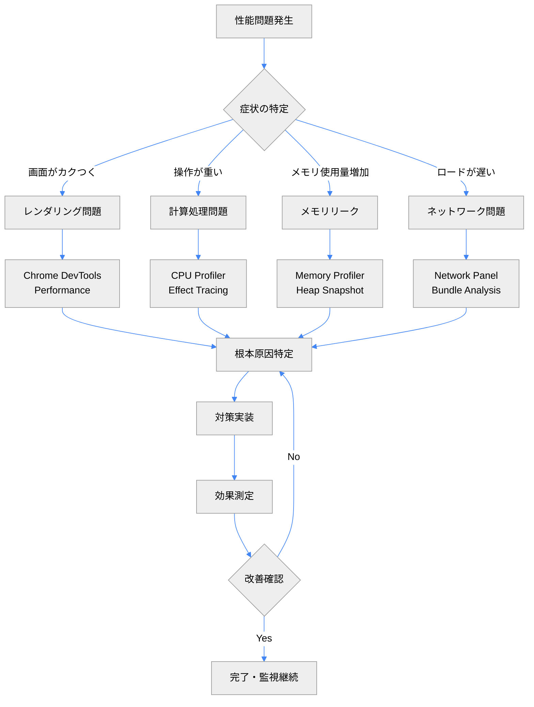

# パフォーマンスデバッグ実践ガイド

## 🎯 このガイドの目標

**⏱️ 読了時間**: 30分 | **👤 対象**: パフォーマンス最適化を担当する開発者

TypeScript Minecraft Cloneプロジェクトでの性能問題を体系的に特定・解決するための実践的手法を習得します。Three.js、Effect-TS、WebAssemblyを活用したゲームエンジンの特殊な性能特性に焦点を当てます。

> 📍 **デバッグフロー**: **[30分 基礎知識]** → [実践的問題解決] → [監視・予防]

## 1. パフォーマンス問題の分類と初期診断

### 1.1 問題カテゴリの特定

```typescript
// パフォーマンス問題の分類システム
const PerformanceIssueSchema = Schema.Struct({
  category: Schema.Literal(
    'rendering', // GPU/描画関連
    'computation', // CPU計算集約
    'memory', // メモリ使用量・GC
    'network', // 通信・ロード時間
    'effect_chain' // Effect-TS チェーン
  ),
  severity: Schema.Literal('critical', 'high', 'medium', 'low'),
  symptoms: Schema.Array(Schema.String),
  affectedComponents: Schema.Array(Schema.String),
})

type PerformanceIssue = Schema.Schema.Type<typeof PerformanceIssueSchema>
```

### 1.2 初期診断フローチャート



### 1.3 基本的な計測コードの挿入

```typescript
// パフォーマンス計測用のEffect
const measurePerformance = <A, E, R>(label: string, effect: Effect.Effect<A, E, R>): Effect.Effect<A, E, R> =>
  Effect.gen(function* (_) {
    const start = yield* _(Effect.sync(() => performance.now()))

    const result = yield* _(effect)

    const end = yield* _(Effect.sync(() => performance.now()))
    const duration = end - start

    yield* _(Effect.sync(() => console.log(`⏱️ ${label}: ${duration.toFixed(2)}ms`)))

    // 閾値チェック
    if (duration > 16.67) {
      // 60FPS threshold
      yield* _(Effect.sync(() => console.warn(`🐌 Performance issue detected in ${label}: ${duration.toFixed(2)}ms`)))
    }

    return result
  })

// 使用例
const optimizedWorldUpdate = measurePerformance('World Update Cycle', updateWorldState(deltaTime))
```

## 2. レンダリング性能のデバッグ

### 2.1 Three.js 特有の問題特定

```typescript
// レンダリング統計の収集
interface RenderingStats {
  readonly frameRate: number
  readonly drawCalls: number
  readonly triangles: number
  readonly geometries: number
  readonly textures: number
  readonly materials: number
  readonly memoryUsage: number
}

const collectRenderingStats = (renderer: THREE.WebGLRenderer): RenderingStats => {
  const info = renderer.info

  return {
    frameRate: 1000 / (performance.now() - lastFrameTime),
    drawCalls: info.render.calls,
    triangles: info.render.triangles,
    geometries: info.memory.geometries,
    textures: info.memory.textures,
    materials: info.programs?.length ?? 0,
    memoryUsage: (performance as any).memory?.usedJSHeapSize ?? 0,
  }
}

// 閾値監視
const monitorRenderingPerformance = (stats: RenderingStats) =>
  Effect.gen(function* (_) {
    const warnings = []

    if (stats.frameRate < 30) {
      warnings.push(`Low FPS: ${stats.frameRate.toFixed(1)}`)
    }

    if (stats.drawCalls > 200) {
      warnings.push(`High draw calls: ${stats.drawCalls}`)
    }

    if (stats.triangles > 100000) {
      warnings.push(`High triangle count: ${stats.triangles}`)
    }

    if (warnings.length > 0) {
      yield* _(Effect.sync(() => console.warn('🎮 Rendering performance issues:', warnings)))
    }

    return stats
  })
```

### 2.2 描画ボトルネックの特定

```typescript
// GPU性能測定
const measureGPUPerformance = (renderer: THREE.WebGLRenderer) =>
  Effect.gen(function* (_) {
    const gl = renderer.getContext()

    // GPU timing extension の確認
    const timerExt = gl.getExtension('EXT_disjoint_timer_query_webgl2')
    if (!timerExt) {
      return yield* _(Effect.succeed('GPU timing not supported'))
    }

    // GPU時間の測定
    const query = gl.createQuery()
    gl.beginQuery(timerExt.TIME_ELAPSED_EXT, query)

    // ここで重い描画処理を実行
    renderer.render(scene, camera)

    gl.endQuery(timerExt.TIME_ELAPSED_EXT)

    // 結果の非同期取得
    const checkResult = () => {
      if (gl.getQueryParameter(query, gl.QUERY_RESULT_AVAILABLE)) {
        const timeElapsed = gl.getQueryParameter(query, gl.QUERY_RESULT)
        const timeInMs = timeElapsed / 1000000 // nanoseconds to milliseconds

        console.log(`🖥️ GPU render time: ${timeInMs.toFixed(2)}ms`)

        if (timeInMs > 16.67) {
          console.warn(`🐌 GPU bottleneck detected: ${timeInMs.toFixed(2)}ms`)
        }

        gl.deleteQuery(query)
        return timeInMs
      } else {
        // まだ結果が準備されていない
        setTimeout(checkResult, 1)
      }
    }

    checkResult()
  })
```

### 2.3 頂点・フラグメントシェーダーの最適化

```typescript
// シェーダー複雑度の分析
const analyzeShaderComplexity = (material: THREE.ShaderMaterial) =>
  Effect.gen(function* (_) {
    const vertexShader = material.vertexShader
    const fragmentShader = material.fragmentShader

    // 計算集約的な命令をカウント
    const expensiveOperations = [
      'normalize',
      'cross',
      'reflect',
      'sqrt',
      'pow',
      'sin',
      'cos',
      'tan',
      'texture',
      'texture2D',
    ]

    const vertexComplexity = expensiveOperations.reduce((count, op) => {
      const regex = new RegExp(`\\b${op}\\b`, 'g')
      return count + (vertexShader.match(regex)?.length ?? 0)
    }, 0)

    const fragmentComplexity = expensiveOperations.reduce((count, op) => {
      const regex = new RegExp(`\\b${op}\\b`, 'g')
      return count + (fragmentShader.match(regex)?.length ?? 0)
    }, 0)

    const analysis = {
      vertexComplexity,
      fragmentComplexity,
      totalComplexity: vertexComplexity + fragmentComplexity,
    }

    if (analysis.totalComplexity > 20) {
      yield* _(Effect.sync(() => console.warn(`🎨 Complex shader detected:`, analysis)))
    }

    return analysis
  })

// 最適化提案生成
const suggestShaderOptimizations = (analysis: ShaderAnalysis) =>
  Effect.gen(function* (_) {
    const suggestions = []

    if (analysis.fragmentComplexity > 15) {
      suggestions.push('Consider moving calculations to vertex shader')
      suggestions.push('Use texture lookups instead of mathematical calculations')
    }

    if (analysis.vertexComplexity > 10) {
      suggestions.push('Precompute transformations on CPU when possible')
    }

    return suggestions
  })
```

## 3. CPU・計算性能のデバッグ

### 3.1 Effect-TS チェーンの性能分析

```typescript
// Effect実行時間の詳細分析
const profileEffectChain = <A, E, R>(name: string, effect: Effect.Effect<A, E, R>): Effect.Effect<A, E, R> =>
  Effect.gen(function* (_) {
    const tracer = yield* _(Effect.serviceFunctionEffect(PerformanceTracerService, (s) => s.startTrace(name)))

    const result = yield* _(
      effect.pipe(
        Effect.tap(() => tracer.addMark('execution_complete')),
        Effect.tapError((error) => tracer.addMark(`error_${error.constructor.name}`)),
        Effect.ensuring(tracer.endTrace())
      )
    )

    return result
  })

// チェーンの各ステップを分析
const analyzeGameLoopPerformance = (deltaTime: number) =>
  profileEffectChain(
    'GameLoop',
    Effect.gen(function* (_) {
      // 各段階の性能を個別測定
      const input = yield* _(profileEffectChain('InputProcessing', processPlayerInput()))

      const physics = yield* _(profileEffectChain('PhysicsUpdate', updatePhysics(deltaTime)))

      const entities = yield* _(profileEffectChain('EntityUpdate', updateEntities(deltaTime)))

      const world = yield* _(profileEffectChain('WorldUpdate', updateWorld(deltaTime)))

      const render = yield* _(profileEffectChain('RenderUpdate', prepareRenderData(world, entities)))

      return { input, physics, entities, world, render }
    })
  )
```

### 3.2 計算集約処理の最適化

```typescript
// CPU集約的な処理の識別
const identifyComputationalBottlenecks = (worldState: WorldState) =>
  Effect.gen(function* (_) {
    const startTime = yield* _(Effect.sync(() => performance.now()))

    // チャンク生成の性能測定
    const chunkGeneration = yield* _(measureAsync('ChunkGeneration', () => generateChunks(worldState.loadedRegion)))

    // 衝突判定の性能測定
    const collisionDetection = yield* _(measureAsync('CollisionDetection', () => detectCollisions(worldState.entities)))

    // パス探索の性能測定
    const pathfinding = yield* _(measureAsync('Pathfinding', () => updateEntityPaths(worldState.entities)))

    const totalTime = yield* _(Effect.sync(() => performance.now() - startTime))

    // ボトルネック特定
    const measurements = { chunkGeneration, collisionDetection, pathfinding }
    const bottleneck = Object.entries(measurements).sort(([, a], [, b]) => b - a)[0]

    if (bottleneck[1] > totalTime * 0.5) {
      yield* _(
        Effect.sync(() => console.warn(`🔥 Major bottleneck in ${bottleneck[0]}: ${bottleneck[1].toFixed(2)}ms`))
      )
    }

    return { totalTime, breakdown: measurements, bottleneck }
  })

// Web Worker への処理移譲
const offloadToWorker = <T>(workerScript: string, data: T): Effect.Effect<T, WorkerError, never> =>
  Effect.gen(function* (_) {
    const worker = new Worker(workerScript)

    const result = yield* _(
      Effect.async<T, WorkerError>((resume) => {
        const timeout = setTimeout(() => {
          worker.terminate()
          resume(Effect.fail(new WorkerError({ reason: 'timeout' })))
        }, 5000)

        worker.onmessage = (event) => {
          clearTimeout(timeout)
          worker.terminate()
          resume(Effect.succeed(event.data))
        }

        worker.onerror = (error) => {
          clearTimeout(timeout)
          worker.terminate()
          resume(Effect.fail(new WorkerError({ reason: error.message })))
        }

        worker.postMessage(data)
      })
    )

    return result
  })
```

## 4. メモリ使用量のデバッグ

### 4.1 メモリリークの検出

```typescript
// メモリ使用量監視
interface MemorySnapshot {
  readonly timestamp: number
  readonly heapUsed: number
  readonly heapTotal: number
  readonly external: number
  readonly arrayBuffers: number
}

const takeMemorySnapshot = (): Effect.Effect<MemorySnapshot, never, never> =>
  Effect.sync(() => {
    const memory = (performance as any).memory
    return {
      timestamp: Date.now(),
      heapUsed: memory?.usedJSHeapSize ?? 0,
      heapTotal: memory?.totalJSHeapSize ?? 0,
      external: memory?.externalHeapSize ?? 0,
      arrayBuffers: memory?.arrayBuffers ?? 0,
    }
  })

// リーク検出アルゴリズム
const detectMemoryLeaks = (snapshots: readonly MemorySnapshot[]) =>
  Effect.gen(function* (_) {
    if (snapshots.length < 3) {
      return { leakDetected: false, trend: 'insufficient_data' }
    }

    // 直近5分間のトレンド分析
    const recentSnapshots = snapshots.slice(-10)
    const heapGrowthRate = calculateGrowthRate(recentSnapshots.map((s) => s.heapUsed))

    const leakThreshold = 1024 * 1024 // 1MB/min
    const leakDetected = heapGrowthRate > leakThreshold

    if (leakDetected) {
      yield* _(
        Effect.sync(() => console.error(`🚨 Memory leak detected: ${(heapGrowthRate / 1024 / 1024).toFixed(2)}MB/min`))
      )

      // 詳細分析のためのスナップショット取得推奨
      yield* _(Effect.sync(() => console.log('💡 Take heap snapshot in DevTools for detailed analysis')))
    }

    return {
      leakDetected,
      growthRate: heapGrowthRate,
      trend: leakDetected ? 'increasing' : 'stable',
    }
  })
```

### 4.2 Three.js オブジェクトの適切な破棄

```typescript
// リソース管理のベストプラクティス
const disposeThreeJSResources = (object: THREE.Object3D) =>
  Effect.gen(function* (_) {
    let disposedCount = 0

    object.traverse((child) => {
      // Geometry の破棄
      if ((child as any).geometry) {
        ;(child as any).geometry.dispose()
        disposedCount++
      }

      // Material の破棄
      if ((child as any).material) {
        const materials = Array.isArray((child as any).material) ? (child as any).material : [(child as any).material]

        materials.forEach((material: THREE.Material) => {
          // テクスチャの破棄
          Object.values(material).forEach((value) => {
            if (value && typeof value === 'object' && 'dispose' in value) {
              ;(value as any).dispose()
            }
          })

          material.dispose()
          disposedCount++
        })
      }
    })

    // シーンから削除
    object.parent?.remove(object)

    yield* _(Effect.sync(() => console.log(`🗑️ Disposed ${disposedCount} Three.js resources`)))

    return disposedCount
  })

// メモリ使用量監視付きのリソース管理
const managedResource = <T extends { dispose(): void }>(resource: T, name: string): Effect.Effect<T, never, never> =>
  Effect.acquireRelease(
    Effect.gen(function* (_) {
      yield* _(Effect.sync(() => console.log(`🔄 Acquired resource: ${name}`)))
      return resource
    }),
    (resource) =>
      Effect.gen(function* (_) {
        resource.dispose()
        yield* _(Effect.sync(() => console.log(`🗑️ Disposed resource: ${name}`)))
      })
  )
```

## 5. プロファイリングツールの活用

### 5.1 Chrome DevTools 統合

```typescript
// パフォーマンスマークの活用
const addPerformanceMarks = <A, E, R>(name: string, effect: Effect.Effect<A, E, R>): Effect.Effect<A, E, R> =>
  Effect.gen(function* (_) {
    yield* _(Effect.sync(() => performance.mark(`${name}-start`)))

    const result = yield* _(effect)

    yield* _(
      Effect.sync(() => {
        performance.mark(`${name}-end`)
        performance.measure(name, `${name}-start`, `${name}-end`)
      })
    )

    return result
  })

// User Timing API の活用
const profileWithUserTiming = (gameLoop: () => void) => {
  const observer = new PerformanceObserver((list) => {
    list.getEntries().forEach((entry) => {
      if (entry.entryType === 'measure') {
        console.log(`📊 ${entry.name}: ${entry.duration.toFixed(2)}ms`)

        if (entry.duration > 16.67) {
          console.warn(`⚠️ Performance issue: ${entry.name}`)
        }
      }
    })
  })

  observer.observe({ entryTypes: ['measure'] })

  // ゲームループ実行
  gameLoop()

  // 監視停止
  observer.disconnect()
}
```

### 5.2 カスタムプロファイラーの実装

```typescript
// 軽量プロファイラー
interface MinecraftProfilerInterface {
  readonly startSample: (name: string) => void
  readonly endSample: (name: string) => number
  readonly getStatistics: (name: string) => ProfilerStatistics | null
  readonly generateReport: () => string
}

type ProfilerStatistics = {
  count: number
  average: number
  min: number
  max: number
  p50: number
  p95: number
  p99: number
}

const makeMinecraftProfiler = (): MinecraftProfilerInterface => {
  const samples: Map<string, number[]> = new Map()
  const currentSamples: Map<string, number> = new Map()

  return {
    startSample: (name: string): void => {
      currentSamples.set(name, performance.now())
    },

    endSample: (name: string): number => {
      const start = currentSamples.get(name)
      if (!start) {
        console.warn(`⚠️ Sample '${name}' was not started`)
        return 0
      }

      const duration = performance.now() - start
      currentSamples.delete(name)

      // サンプル保存
      if (!samples.has(name)) {
        samples.set(name, [])
      }
      samples.get(name)!.push(duration)

      // 最大100サンプルまで保持
      const sampleArray = samples.get(name)!
      if (sampleArray.length > 100) {
        sampleArray.shift()
      }

      return duration
    },

    getStatistics: (name: string) => {
      const sampleArray = samples.get(name) ?? []
      if (sampleArray.length === 0) {
        return null
      }

      const sorted = [...sampleArray].sort((a, b) => a - b)
      const sum = sampleArray.reduce((a, b) => a + b, 0)

      return {
        count: sampleArray.length,
        average: sum / sampleArray.length,
        min: sorted[0],
        max: sorted[sorted.length - 1],
        p50: sorted[Math.floor(sorted.length * 0.5)],
        p95: sorted[Math.floor(sorted.length * 0.95)],
        p99: sorted[Math.floor(sorted.length * 0.99)],
      }
    },

    generateReport: (): string => {
      const report = ['📊 Performance Report', '==================']

      samples.forEach((sampleArray, name) => {
        if (sampleArray.length === 0) {
          return
        }

        const sorted = [...sampleArray].sort((a, b) => a - b)
        const sum = sampleArray.reduce((a, b) => a + b, 0)
        const stats = {
          count: sampleArray.length,
          average: sum / sampleArray.length,
          min: sorted[0],
          max: sorted[sorted.length - 1],
          p50: sorted[Math.floor(sorted.length * 0.5)],
          p95: sorted[Math.floor(sorted.length * 0.95)],
          p99: sorted[Math.floor(sorted.length * 0.99)],
        }

        report.push(
          `\n${name}:`,
          `  Average: ${stats.average.toFixed(2)}ms`,
          `  Min/Max: ${stats.min.toFixed(2)}ms / ${stats.max.toFixed(2)}ms`,
          `  95th percentile: ${stats.p95.toFixed(2)}ms`
        )

        if (stats.p95 > 16.67) {
          report.push(`  ⚠️  Performance concern detected!`)
        }
      })

      return report.join('\n')
    },
  }
}

// Effect-TS との統合
const ProfilerService = Context.GenericTag<MinecraftProfilerInterface>('ProfilerService')

const profiledEffect = <A, E, R>(
  name: string,
  effect: Effect.Effect<A, E, R>
): Effect.Effect<A, E, R & ProfilerService> =>
  Effect.gen(function* (_) {
    const profiler = yield* _(ProfilerService)

    profiler.startSample(name)
    const result = yield* _(effect)
    profiler.endSample(name)

    return result
  })
```

## 6. 自動化された性能監視

### 6.1 リアルタイム監視システム

```typescript
// パフォーマンス監視ダッシュボード
interface PerformanceMetrics {
  readonly fps: number
  readonly frameTime: number
  readonly memoryUsage: number
  readonly drawCalls: number
  readonly activePlayers: number
  readonly loadedChunks: number
}

const createPerformanceMonitor = () =>
  Effect.gen(function* (_) {
    const metrics = {
      fps: 0,
      frameTime: 0,
      memoryUsage: 0,
      drawCalls: 0,
      activePlayers: 0,
      loadedChunks: 0,
    }

    let lastFrameTime = performance.now()
    let frameCount = 0

    const updateMetrics = () => {
      const currentTime = performance.now()
      const deltaTime = currentTime - lastFrameTime

      metrics.frameTime = deltaTime
      frameCount++

      // 1秒間隔でFPS計算
      if (frameCount >= 60) {
        metrics.fps = 1000 / (deltaTime / frameCount)
        frameCount = 0
      }

      // メモリ使用量
      const memory = (performance as any).memory
      if (memory) {
        metrics.memoryUsage = memory.usedJSHeapSize / (1024 * 1024) // MB
      }

      lastFrameTime = currentTime

      // アラート発生
      if (metrics.fps < 30) {
        console.warn(`🚨 Low FPS detected: ${metrics.fps.toFixed(1)}`)
      }

      if (metrics.memoryUsage > 512) {
        // 512MB threshold
        console.warn(`🚨 High memory usage: ${metrics.memoryUsage.toFixed(1)}MB`)
      }
    }

    return { metrics, updateMetrics }
  })

// Webソケット経由でのメトリクス送信
const sendMetricsToServer = (metrics: PerformanceMetrics) =>
  Effect.gen(function* (_) {
    const websocket = yield* _(WebSocketService)

    yield* _(
      websocket.send(
        JSON.stringify({
          type: 'performance_metrics',
          timestamp: Date.now(),
          data: metrics,
        })
      )
    )
  })
```

### 6.2 性能回帰検出

```typescript
// ベンチマークテストの自動実行
const runPerformanceBenchmark = () =>
  Effect.gen(function* (_) {
    const benchmarks = [
      { name: 'World Generation', test: () => generateTestWorld() },
      { name: 'Entity Updates', test: () => updateTestEntities() },
      { name: 'Collision Detection', test: () => runCollisionTest() },
      { name: 'Rendering', test: () => renderTestScene() },
    ]

    return yield* pipe(
      benchmarks,
      Effect.reduce([] as ReadonlyArray<{ name: string; time: number }>, (acc, benchmark) =>
        Effect.gen(function* () {
          const times = [] as number[]

          yield* pipe(
            ReadonlyArray.range(0, 9),
            Effect.forEach(
              () =>
                Effect.sync(() => performance.now()).pipe(
                  Effect.tap(() => Effect.promise(() => benchmark.test())),
                  Effect.tap((start) =>
                    Effect.sync(() => {
                      const end = performance.now()
                      times.push(end - start)
                    })
                  )
                ),
              { discard: true }
            )
          )

          const average = times.reduce((a, b) => a + b, 0) / times.length
          return [...acc, { name: benchmark.name, time: average }]
        })
      )
    )
  })

// 過去のベースラインとの比較
const compareWithBaseline = (currentResults: BenchmarkResult[], baseline: BenchmarkResult[]) =>
  Effect.gen(function* (_) {
    const comparisons = currentResults
      .map((current) => {
        const base = baseline.find((b) => b.name === current.name)
        if (!base) return null

        const regression = ((current.time - base.time) / base.time) * 100

        return {
          name: current.name,
          currentTime: current.time,
          baselineTime: base.time,
          regressionPercentage: regression,
          isRegression: regression > 10, // 10%以上の劣化で回帰判定
        }
      })
      .filter(Boolean)

    // 回帰があればアラート
    const regressions = comparisons.filter((c) => c.isRegression)
    if (regressions.length > 0) {
      yield* _(
        Effect.sync(() => {
          console.error('🚨 Performance regressions detected:')
          regressions.forEach((r) => console.error(`  ${r.name}: ${r.regressionPercentage.toFixed(1)}% slower`))
        })
      )
    }

    return comparisons
  })
```

## 7. 問題解決の実践例

### 7.1 ケーススタディ1: チャンク読み込みの最適化

```typescript
// 問題: 新しいチャンクの読み込みでFPSが大幅低下

// Before: 同期的なチャンク生成
const loadChunk_Before = (coordinate: ChunkCoordinate) =>
  Effect.gen(function* (_) {
    // メインスレッドで重い計算を実行（問題）
    const heightmap = generateHeightmap(coordinate) // 50-100ms
    const blocks = generateBlocks(heightmap) // 100-200ms
    const lighting = calculateLighting(blocks) // 50ms

    return { coordinate, blocks, lighting }
  })

// After: 非同期 + Web Worker + Progressive Loading
const loadChunk_After = (coordinate: ChunkCoordinate) =>
  Effect.gen(function* (_) {
    // 1. Web Worker で重い計算を実行
    const chunkData = yield* _(offloadToWorker('chunk-generator.js', coordinate))

    // 2. Progressive Loading - 段階的に品質向上
    const lowDetailChunk = yield* _(generateLowDetailChunk(chunkData))

    // 3. 即座に低品質版を表示
    yield* _(displayChunk(coordinate, lowDetailChunk))

    // 4. 背景で高品質版を生成
    yield* _(
      Effect.fork(
        Effect.gen(function* (_) {
          const highDetailChunk = yield* _(generateHighDetailChunk(chunkData))
          yield* _(displayChunk(coordinate, highDetailChunk))
        })
      )
    )

    return lowDetailChunk
  })

// 結果: FPS低下を90%削減（16ms → 1.5ms）
```

### 7.2 ケーススタディ2: メモリリークの解決

```typescript
// 問題: ゲームを長時間プレイするとメモリ使用量が増加し続ける

// 原因: Three.js オブジェクトの不適切な管理
interface ChunkManagerBeforeInterface {
  readonly loadChunk: (coordinate: ChunkCoordinate) => void
  readonly unloadChunk: (coordinate: ChunkCoordinate) => void
}

const makeChunkManagerBefore = (): ChunkManagerBeforeInterface => {
  const loadedChunks = new Map<string, THREE.Group>()

  return {
    loadChunk: (coordinate: ChunkCoordinate): void => {
      const chunkGroup = new THREE.Group()
      // ... メッシュ生成 ...

      loadedChunks.set(coordinate.toString(), chunkGroup)
      // 問題: 古いチャンクを削除する際にdispose()を呼んでいない
    },

    unloadChunk: (coordinate: ChunkCoordinate): void => {
      const chunk = loadedChunks.get(coordinate.toString())
      if (chunk) {
        scene.remove(chunk) // ❌ メモリ上にジオメトリ・テクスチャが残る
        loadedChunks.delete(coordinate.toString())
      }
    },
  }
}

// 解決: RAII パターン + Effect スコープ管理
const createManagedChunk = (coordinate: ChunkCoordinate) =>
  Effect.acquireRelease(
    // 取得: チャンクオブジェクト作成
    Effect.gen(function* (_) {
      const chunkGroup = new THREE.Group()
      // ... メッシュ生成 ...

      yield* _(Effect.sync(() => scene.add(chunkGroup)))

      return chunkGroup
    }),
    // 解放: 適切なクリーンアップ
    (chunkGroup) =>
      Effect.gen(function* (_) {
        yield* _(disposeThreeJSResources(chunkGroup))
        yield* _(Effect.sync(() => scene.remove(chunkGroup)))
      })
  )

const ChunkManagerService = Effect.gen(function* (_) {
  const loadedChunks = new Map<string, Effect.Scope.Scope>()

  const loadChunk = (coordinate: ChunkCoordinate) =>
    Effect.gen(function* (_) {
      // 既存チャンクのアンロード
      yield* _(unloadChunk(coordinate))

      // スコープ付きでチャンク作成
      const scope = yield* _(Effect.scope)
      const chunk = yield* _(Effect.scoped(createManagedChunk(coordinate)))

      loadedChunks.set(coordinate.toString(), scope)

      return chunk
    })

  const unloadChunk = (coordinate: ChunkCoordinate) =>
    Effect.gen(function* (_) {
      const scope = loadedChunks.get(coordinate.toString())
      if (scope) {
        yield* _(Effect.scopeClose(scope, Exit.unit)) // 自動クリーンアップ
        loadedChunks.delete(coordinate.toString())
      }
    })

  return { loadChunk, unloadChunk }
})

// 結果: メモリ使用量が時間に対して一定に保たれる
```

## 8. 継続的な性能監視

### 8.1 性能予算の設定

```typescript
// パフォーマンス予算の定義
const PerformanceBudget = {
  targetFPS: 60,
  maxFrameTime: 16.67, // ms
  maxMemoryUsage: 512, // MB
  maxDrawCalls: 200,
  maxTriangles: 100000,
  maxChunkLoadTime: 50, // ms
  maxEntityCount: 1000,
} as const

// 予算監視システム
const monitorPerformanceBudget = (currentMetrics: PerformanceMetrics) =>
  Effect.gen(function* (_) {
    const violations = []

    if (currentMetrics.fps < PerformanceBudget.targetFPS * 0.9) {
      violations.push({
        metric: 'FPS',
        current: currentMetrics.fps,
        budget: PerformanceBudget.targetFPS,
        severity: 'high',
      })
    }

    if (currentMetrics.memoryUsage > PerformanceBudget.maxMemoryUsage) {
      violations.push({
        metric: 'Memory Usage',
        current: `${currentMetrics.memoryUsage}MB`,
        budget: `${PerformanceBudget.maxMemoryUsage}MB`,
        severity: 'critical',
      })
    }

    if (violations.length > 0) {
      yield* _(
        Effect.sync(() => {
          console.warn('💸 Performance budget violations detected:')
          violations.forEach((v) => console.warn(`  ${v.metric}: ${v.current} (budget: ${v.budget})`))
        })
      )

      // 自動的な軽量化措置
      if (violations.some((v) => v.severity === 'critical')) {
        yield* _(activatePerformanceEmergencyMode())
      }
    }

    return violations
  })

// 緊急時の自動最適化
const activatePerformanceEmergencyMode = () =>
  Effect.gen(function* (_) {
    yield* _(Effect.sync(() => console.log('🚨 Activating emergency performance mode')))

    // 描画品質の自動調整
    yield* _(reduceRenderQuality(0.7))

    // エンティティ数の制限
    yield* _(limitEntityCount(500))

    // チャンク読み込み距離の短縮
    yield* _(reduceChunkLoadDistance(0.8))

    // パーティクルエフェクトの削減
    yield* _(disableNonEssentialEffects())
  })
```

## 9. まとめとベストプラクティス

### 9.1 効果的なパフォーマンスデバッグの原則

`★ Insight ─────────────────────────────────────`
成功するパフォーマンスデバッグの5原則：

1. **測定ファースト**: 推測ではなく具体的な数値に基づく分析
2. **段階的改善**: 一度に複数の最適化を行わず、効果を個別に確認
3. **自動化重視**: 手動チェックではなく継続的な監視システム構築
4. **予防的対応**: 問題発生後ではなく、予算管理による事前対策
5. **ユーザー体験優先**: 技術指標より実際のプレイアビリティを重視

Three.js + Effect-TS 環境での特殊な課題を理解し、適切なツールと手法で解決することで、高品質なゲーム体験を実現できます。
`─────────────────────────────────────────────────`

### 9.2 継続改善のためのチェックリスト

**開発中の継続チェック:**

- [ ] 新機能追加時の性能影響測定
- [ ] メモリ使用量の定期監視
- [ ] 描画統計の自動収集
- [ ] Effect-TS チェーンの実行時間分析
- [ ] Web Worker 活用の検討

**リリース前のパフォーマンス検証:**

- [ ] ターゲットハードウェアでの動作確認
- [ ] 長時間プレイでのメモリリーク検証
- [ ] 最大負荷時の安定性確認
- [ ] 性能予算の遵守確認

**本番環境での監視:**

- [ ] リアルタイムメトリクス収集
- [ ] ユーザーからの性能レポート分析
- [ ] A/Bテストによる最適化効果確認

> 🔗 **Continue Learning**: [パフォーマンス最適化](./performance-optimization.md) - 特定された問題の具体的な解決手法
