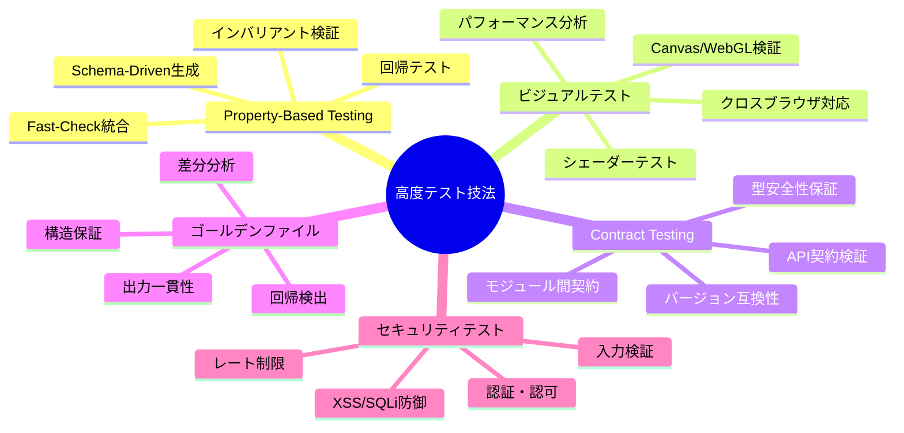
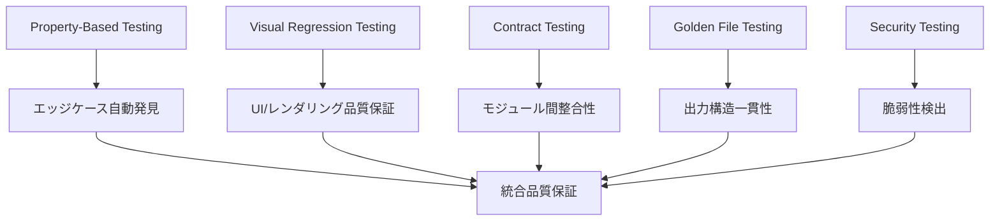

# 高度なテスト技法ガイド - Property-Based Testing、ビジュアルテスト、契約テストの実践

## 🎯 Quick Guide（10分で高度テスト技法理解）

### 高度テスト技法マップ



### 緊急対応チェックリスト

- [ ] **Property-Based実行**: `it.prop(it.prop(...))`でエッジケース網羅
- [ ] **ビジュアル検証**: `toMatchImageSnapshot()`で視覚的回帰確認
- [ ] **契約テスト**: Schema検証でAPI/モジュール間整合性確認
- [ ] **ゴールデンファイル**: 出力構造の一貫性確認
- [ ] **セキュリティ検証**: 入力検証・認可チェック実行

---

## 📋 Problem Statement

Effect-TS 3.17+とDDDアーキテクチャを使用したTypeScript Minecraftプロジェクトでは、従来の単体・結合テストだけでは以下の課題をカバーできません。

### 主要課題

1. **エッジケース網羅**: 手動テストケースでは発見困難な境界値・異常系
2. **視覚的品質保証**: 3Dレンダリング・UI・エフェクトの視覚的回帰
3. **モジュール間契約**: 複雑な依存関係での型安全性とバージョン互換性
4. **出力一貫性**: 複雑な処理の出力構造変更検出
5. **セキュリティ脆弱性**: 入力検証・認証認可・攻撃耐性

---

## 🔧 Solution Approach

### 1. 多層防御テスト戦略



### 2. 技法別適用領域

| テスト技法             | 適用領域            | 検出内容                       | 実行頻度      |
| ---------------------- | ------------------- | ------------------------------ | ------------- |
| **Property-Based**     | ドメインロジック    | 不変条件違反・エッジケース     | 🔄 継続的     |
| **ビジュアルテスト**   | UI・レンダリング    | 視覚的回帰・レイアウト崩れ     | 📅 リリース前 |
| **Contract Testing**   | API・モジュール境界 | インターフェース変更・型不整合 | 🔄 継続的     |
| **ゴールデンファイル** | 構造出力            | データ形式変更・処理結果変化   | 📅 機能変更時 |
| **セキュリティテスト** | 入力・認証          | 脆弱性・権限昇格・攻撃耐性     | 🔒 定期的     |

---

## 📖 Detailed Implementation Guide

### Phase 1: Property-Based Testing Mastery

#### 1.1 Advanced Schema-Driven Generation

```typescript
import * as fc from '@effect/vitest'
import { Schema } from '@effect/schema'
import { Effect, pipe } from 'effect'

// Schema-basedテストデータ生成
const WorldCoordinateSchema = Schema.Struct({
  x: Schema.Number.pipe(Schema.int(), Schema.between(-30000000, 30000000)),
  y: Schema.Number.pipe(Schema.int(), Schema.between(-64, 320)),
  z: Schema.Number.pipe(Schema.int(), Schema.between(-30000000, 30000000)),
})

const PlayerActionSchema = Schema.Union(
  Schema.Struct({
    _tag: Schema.Literal('Move'),
    playerId: Schema.String.pipe(Schema.uuid()),
    from: WorldCoordinateSchema,
    to: WorldCoordinateSchema,
    timestamp: Schema.Number.pipe(Schema.positive()),
  }),
  Schema.Struct({
    _tag: Schema.Literal('PlaceBlock'),
    playerId: Schema.String.pipe(Schema.uuid()),
    position: WorldCoordinateSchema,
    blockType: Schema.Union(
      Schema.Literal('Stone'),
      Schema.Literal('Wood'),
      Schema.Literal('Iron'),
      Schema.Literal('Diamond')
    ),
    timestamp: Schema.Number.pipe(Schema.positive()),
  }),
  Schema.Struct({
    _tag: Schema.Literal('BreakBlock'),
    playerId: Schema.String.pipe(Schema.uuid()),
    position: WorldCoordinateSchema,
    tool: Schema.optional(Schema.String),
    timestamp: Schema.Number.pipe(Schema.positive()),
  })
)

// カスタムArbitraryの構築
const worldCoordinateArbitrary = fc.record({
  x: fc.integer({ min: -30000000, max: 30000000 }),
  y: fc.integer({ min: -64, max: 320 }),
  z: fc.integer({ min: -30000000, max: 30000000 }),
})

const playerActionArbitrary = fc.oneof(
  fc.record({
    _tag: fc.constant('Move' as const),
    playerId: fc.uuid(),
    from: worldCoordinateArbitrary,
    to: worldCoordinateArbitrary,
    timestamp: fc.integer({ min: 1, max: Date.now() }),
  }),
  fc.record({
    _tag: fc.constant('PlaceBlock' as const),
    playerId: fc.uuid(),
    position: worldCoordinateArbitrary,
    blockType: fc.constantFrom('Stone', 'Wood', 'Iron', 'Diamond'),
    timestamp: fc.integer({ min: 1, max: Date.now() }),
  }),
  fc.record({
    _tag: fc.constant('BreakBlock' as const),
    playerId: fc.uuid(),
    position: worldCoordinateArbitrary,
    tool: fc.option(Schema.String),
    timestamp: fc.integer({ min: 1, max: Date.now() }),
  })
)

describe('Advanced Property-Based World System Tests', () => {
  describe('World State Invariants', () => {
    it('任意のアクション実行後もワールドの整合性が保たれる', () => {
      it.prop(
        it.prop(Schema.Array(playerActionArbitrary, { minLength: 1, maxLength: 100 }), (actions) => {
          const world = new WorldState()

          // 各アクションが有効であることを事前確認
          actions.forEach((action) => {
            const validationResult = Schema.decodeUnknownSync(PlayerActionSchema)(action)
            expect(validationResult).toBeDefined()
          })

          // アクション実行
          actions.forEach((action) => world.processAction(action))

          // 不変条件の検証

          // 1. チャンク境界の一貫性
          const loadedChunks = world.getLoadedChunks()
          loadedChunks.forEach((chunk) => {
            expect(chunk.coordinate.x).toBeGreaterThanOrEqual(-1875000) // -30M / 16
            expect(chunk.coordinate.x).toBeLessThanOrEqual(1875000) // 30M / 16
            expect(chunk.coordinate.z).toBeGreaterThanOrEqual(-1875000)
            expect(chunk.coordinate.z).toBeLessThanOrEqual(1875000)
          })

          // 2. ブロック配置の整合性
          const allBlocks = world.getAllBlocks()
          allBlocks.forEach((block) => {
            const chunkCoord = world.getChunkCoordinateFor(block.position)
            expect(world.isChunkLoaded(chunkCoord)).toBe(true)
          })

          // 3. プレイヤー位置の妥当性
          const players = world.getAllPlayers()
          players.forEach((player) => {
            expect(player.position.y).toBeGreaterThanOrEqual(-64)
            expect(player.position.y).toBeLessThanOrEqual(320)
          })

          // 4. エンティティIDの一意性
          const entities = world.getAllEntities()
          const entityIds = entities.map((e) => e.id)
          expect(new Set(entityIds).size).toBe(entityIds.length)
        }),
        {
          numRuns: 500,
          verbose: true,
          endOnFailure: true,
        }
      )
    })

    it('ブロック配置・破壊の可逆性テスト', () => {
      it.prop(
        it.prop(
          worldCoordinateArbitrary,
          fc.constantFrom('Stone', 'Wood', 'Iron', 'Diamond'),
          (position, blockType) => {
            const world = new WorldState()
            const originalBlock = world.getBlock(position)

            // ブロック配置
            world.setBlock(position, blockType)
            expect(world.getBlock(position).type).toBe(blockType)

            // ブロック破壊（元に戻す）
            world.removeBlock(position)
            const finalBlock = world.getBlock(position)

            // 元の状態に戻ることを確認
            expect(finalBlock.type).toBe(originalBlock.type)
            expect(finalBlock.metadata).toEqual(originalBlock.metadata)
          }
        ),
        { numRuns: 1000 }
      )
    })
  })

  describe('Physics Simulation Properties', () => {
    const physicsEntityArbitrary = fc.record({
      position: worldCoordinateArbitrary.map((pos) => ({ ...pos, y: Math.max(pos.y, 0) })),
      velocity: fc.record({
        x: fc.float({ min: -100, max: 100, noNaN: true }),
        y: fc.float({ min: -100, max: 100, noNaN: true }),
        z: fc.float({ min: -100, max: 100, noNaN: true }),
      }),
      mass: fc.float({ min: 0.1, max: 1000, noNaN: true }),
      friction: fc.float({ min: 0, max: 1, noNaN: true }),
      bounciness: fc.float({ min: 0, max: 1, noNaN: true }),
    })

    it('物理法則の保存則検証', () => {
      it.prop(
        it.prop(
          Schema.Array(physicsEntityArbitrary, { minLength: 2, maxLength: 10 }),
          fc.float({ min: 0.001, max: 0.1, noNaN: true }), // deltaTime
          (entities, deltaTime) => {
            const physicsWorld = new PhysicsWorld()
            entities.forEach((e) => physicsWorld.addEntity(e))

            // 初期運動量の計算
            const initialMomentum = entities.reduce(
              (total, entity) => ({
                x: total.x + entity.mass * entity.velocity.x,
                y: total.y + entity.mass * entity.velocity.y,
                z: total.z + entity.mass * entity.velocity.z,
              }),
              { x: 0, y: 0, z: 0 }
            )

            const initialKineticEnergy = entities.reduce(
              (total, entity) =>
                total + 0.5 * entity.mass * (entity.velocity.x ** 2 + entity.velocity.y ** 2 + entity.velocity.z ** 2),
              0
            )

            // 物理シミュレーション実行
            physicsWorld.simulate(deltaTime)

            // シミュレーション後の運動量
            const finalEntities = physicsWorld.getAllEntities()
            const finalMomentum = finalEntities.reduce(
              (total, entity) => ({
                x: total.x + entity.mass * entity.velocity.x,
                y: total.y + entity.mass * entity.velocity.y,
                z: total.z + entity.mass * entity.velocity.z,
              }),
              { x: 0, y: 0, z: 0 }
            )

            // 運動量保存の確認（重力を除くX, Z成分）
            expect(finalMomentum.x).toBeCloseTo(initialMomentum.x, 3)
            expect(finalMomentum.z).toBeCloseTo(initialMomentum.z, 3)

            // エネルギー散逸の確認（摩擦により減少するはず）
            const finalKineticEnergy = finalEntities.reduce(
              (total, entity) =>
                total + 0.5 * entity.mass * (entity.velocity.x ** 2 + entity.velocity.y ** 2 + entity.velocity.z ** 2),
              0
            )

            expect(finalKineticEnergy).toBeLessThanOrEqual(initialKineticEnergy + 0.001)

            // 位置の妥当性確認
            finalEntities.forEach((entity) => {
              expect(entity.position.y).toBeGreaterThanOrEqual(-64)
              expect(Number.isFinite(entity.position.x)).toBe(true)
              expect(Number.isFinite(entity.position.y)).toBe(true)
              expect(Number.isFinite(entity.position.z)).toBe(true)
            })
          }
        ),
        { numRuns: 200 }
      )
    })
  })

  describe('Complex System Integration Properties', () => {
    it('マルチプレイヤー同期の一貫性', () => {
      it.prop(
        it.prop(
          Schema.Array(
            fc.record({
              playerId: fc.uuid(),
              actions: Schema.Array(playerActionArbitrary, { maxLength: 20 }),
            }),
            { minLength: 2, maxLength: 5 }
          ),
          (playerScenarios) => {
            // 各プレイヤーの視点でワールド状態をシミュレート
            const masterWorld = new WorldState()
            const playerWorlds = new Map<string, WorldState>()

            playerScenarios.forEach((scenario) => {
              playerWorlds.set(scenario.playerId, new WorldState())
            })

            // 全アクションを時系列順にソート
            const allActions = playerScenarios
              .flatMap((s) => s.actions.map((a) => ({ ...a, playerId: s.playerId })))
              .sort((a, b) => a.timestamp - b.timestamp)

            // マスターワールドで全アクションを実行
            allActions.forEach((action) => {
              masterWorld.processAction(action)
            })

            // 各プレイヤーワールドでも同じアクションを実行
            allActions.forEach((action) => {
              playerWorlds.forEach((world) => {
                world.processAction(action)
              })
            })

            // 全プレイヤーワールドがマスターワールドと一致することを確認
            playerWorlds.forEach((playerWorld, playerId) => {
              const masterBlocks = masterWorld.getAllBlocks()
              const playerBlocks = playerWorld.getAllBlocks()

              expect(playerBlocks.length).toBe(masterBlocks.length)

              masterBlocks.forEach((masterBlock) => {
                const playerBlock = playerWorld.getBlock(masterBlock.position)
                expect(playerBlock.type).toBe(masterBlock.type)
                expect(playerBlock.metadata).toEqual(masterBlock.metadata)
              })
            })
          }
        ),
        { numRuns: 50 } // 複雑なテストなので実行回数を制限
      )
    })
  })
})
```

#### 1.2 Property-Based Performance Testing

```typescript
describe('Property-Based Performance Tests', () => {
  it('チャンクロード性能のスケーラビリティ特性', () => {
    it.prop(
      it.prop(
        fc.integer({ min: 1, max: 100 }), // チャンク数
        fc.integer({ min: 1, max: 4 }), // 並行度
        async (chunkCount, concurrency) => {
          const world = new WorldState()
          const chunkCoords = Array.from({ length: chunkCount }, (_, i) => ({
            x: Math.floor(i / 10),
            z: i % 10,
          }))

          const startTime = performance.now()

          // 並行でチャンクロード
          const chunks = await Promise.all(chunkCoords.map((coord) => world.loadChunk(coord, { concurrency })))

          const endTime = performance.now()
          const duration = endTime - startTime

          // 性能特性の検証

          // 1. 線形スケーラビリティ（理想的には）
          const expectedMaxTime = (chunkCount * 50) / concurrency // 50ms per chunk base
          expect(duration).toBeLessThan(expectedMaxTime * 2) // 2倍以内の許容

          // 2. 全チャンクが正常にロードされた
          expect(chunks).toHaveLength(chunkCount)
          chunks.forEach((chunk) => {
            expect(chunk.isLoaded()).toBe(true)
            expect(chunk.blocks.length).toBeGreaterThan(0)
          })

          // 3. メモリ使用量の妥当性
          const memoryUsage = process.memoryUsage().heapUsed
          const expectedMaxMemory = chunkCount * 1024 * 1024 // 1MB per chunk
          expect(memoryUsage).toBeLessThan(expectedMaxMemory * 5) // 5倍以内の許容

          return true
        }
      ),
      {
        numRuns: 20,
        timeout: 30000, // 30秒タイムアウト
      }
    )
  })

  it('エンティティ処理の計算量特性', () => {
    it.prop(
      it.prop(
        fc.integer({ min: 10, max: 1000 }), // エンティティ数
        (entityCount) => {
          const world = new WorldState()

          // ランダム分布でエンティティ配置
          const entities = Array.from(
            { length: entityCount },
            (_, i) =>
              new Entity({
                id: `entity-${i}`,
                position: {
                  x: Math.random() * 1000,
                  y: Math.random() * 100,
                  z: Math.random() * 1000,
                },
                type: 'mob',
              })
          )

          entities.forEach((e) => world.addEntity(e))

          const startTime = performance.now()

          // 1フレームの処理時間を測定
          world.updateEntities(16) // 16ms tick

          const endTime = performance.now()
          const duration = endTime - startTime

          // 計算量の妥当性検証

          // 1. O(n)またはO(n log n)程度に収まる
          const expectedMaxTime = entityCount * 0.1 + Math.log(entityCount) * 2
          expect(duration).toBeLessThan(expectedMaxTime)

          // 2. フレームレート要件（16ms以内）の確認
          if (entityCount <= 100) {
            expect(duration).toBeLessThan(16)
          }

          // 3. 大量エンティティでも極端な劣化はない
          if (entityCount >= 500) {
            expect(duration).toBeLessThan(100) // 100ms以内
          }

          return true
        }
      ),
      { numRuns: 30 }
    )
  })
})
```

### Phase 2: Visual Regression Testing

#### 2.1 3D Rendering Visual Tests

```typescript
import { test, expect } from '@playwright/test'
import { compareImages } from './test-utils/image-comparison'

describe('3D Rendering Visual Tests', () => {
  test.beforeEach(async ({ page }) => {
    // テスト用の決定論的環境設定
    await page.goto('/game')
    await page.evaluate(() => {
      // WebGLコンテキストの決定論的設定
      window.game.renderer.setPixelRatio(1) // 固定解像度
      window.game.renderer.setSize(1024, 768) // 固定サイズ

      // 乱数シードの固定
      Math.seedrandom('visual-test-seed')

      // アニメーションの停止
      window.game.pauseAnimations()
    })
  })

  test('基本地形レンダリングの視覚的整合性', async ({ page }) => {
    // 決定論的シーンの構築
    await page.evaluate(() => {
      window.game.loadTestScene({
        terrain: 'flat-plains',
        timeOfDay: 'noon',
        weather: 'clear',
        cameraPosition: { x: 0, y: 100, z: 0 },
        cameraTarget: { x: 0, y: 0, z: 0 },
      })
    })

    // レンダリング完了を待機
    await page.waitForFunction(() => window.game.isRenderComplete())

    // スクリーンショット取得
    const canvas = page.locator('canvas#game-viewport')
    const screenshot = await canvas.screenshot({
      type: 'png',
      animations: 'disabled', // アニメーション無効化
    })

    // ベースライン画像との比較
    expect(screenshot).toMatchSnapshot('terrain-flat-plains-noon.png', {
      threshold: 0.05, // 5%の差異まで許容
      maxDiffPixels: 1000, // 最大1000ピクセルの差異
    })
  })

  test('複雑構造物レンダリングの精度', async ({ page }) => {
    await page.evaluate(() => {
      window.game.loadTestScene({
        structures: [
          {
            type: 'castle',
            position: { x: 0, y: 0, z: 0 },
            rotation: 0,
            materials: ['stone', 'wood', 'iron'],
          },
        ],
        lighting: {
          sun: { intensity: 1.0, position: [100, 100, 100] },
          ambient: { intensity: 0.3 },
        },
        cameraPosition: { x: 50, y: 30, z: 50 },
      })
    })

    await page.waitForFunction(() => window.game.isRenderComplete())

    // 複数角度からの視覚検証
    const angles = [
      { x: 50, y: 30, z: 50, name: 'front-view' },
      { x: -50, y: 30, z: 50, name: 'side-view' },
      { x: 0, y: 60, z: 0, name: 'top-view' },
    ]

    await angles.reduce(async (previous, angle) => {
      await previous

      await page.evaluate((pos) => {
        window.game.setCameraPosition(pos.x, pos.y, pos.z)
        window.game.setCameraTarget(0, 0, 0)
      }, angle)

      await page.waitForFunction(() => window.game.isRenderComplete())

      const screenshot = await page.locator('canvas#game-viewport').screenshot()
      expect(screenshot).toMatchSnapshot(`castle-${angle.name}.png`, {
        threshold: 0.08,
      })

      return Promise.resolve()
    }, Promise.resolve())
  })

  test('パーティクルエフェクトのフレーム一貫性', async ({ page }) => {
    await page.evaluate(() => {
      // 決定論的パーティクルシステム
      window.game.spawnParticleSystem({
        type: 'explosion',
        position: { x: 0, y: 10, z: 0 },
        particleCount: 100,
        seed: 42, // 固定シード
      })
    })

    const frameTimes = [0, 0.5, 1.0, 1.5, 2.0]

    const frames = await frameTimes.reduce(
      async (accPromise, time) => {
        const acc = await accPromise

        await page.evaluate((t) => {
          window.game.setAnimationTime(t)
          window.game.updateParticles()
        }, time)

        await page.waitForFunction(() => window.game.isRenderComplete())

        const screenshot = await page.locator('canvas#game-viewport').screenshot()
        expect(screenshot).toMatchSnapshot(`explosion-frame-${time}s.png`)

        return [...acc, screenshot as unknown as Uint8Array]
      },
      Promise.resolve([] as Uint8Array[])
    )

    await Promise.all(
      frames.slice(1).map((frame, index) =>
        compareImages(frames[index], frame).then((diff) => {
          expect(diff.differencePercentage).toBeGreaterThan(5)
          expect(diff.differencePercentage).toBeLessThan(50)
        })
      )
    )
  })
})
```

#### 2.2 Shader Visual Validation

```typescript
describe('Shader Visual Validation Tests', () => {
  let renderer: THREE.WebGLRenderer
  let scene: THREE.Scene
  let camera: THREE.PerspectiveCamera

  beforeEach(() => {
    // オフスクリーンレンダリング環境
    const canvas = new OffscreenCanvas(512, 512)
    renderer = new THREE.WebGLRenderer({
      canvas,
      antialias: false, // 一貫性のためアンチエイリアス無効
      preserveDrawingBuffer: true,
    })

    scene = new THREE.Scene()
    camera = new THREE.PerspectiveCamera(75, 1, 0.1, 1000)
    camera.position.set(0, 0, 5)
  })

  test('水面シェーダーの波動効果検証', async () => {
    const waterGeometry = new THREE.PlaneGeometry(10, 10, 64, 64)
    const waterShader = new WaterShader({
      time: 0,
      waveAmplitude: 0.5,
      waveFrequency: 2.0,
      waveSpeed: 1.0,
    })

    const waterMesh = new THREE.Mesh(waterGeometry, waterShader.material)
    scene.add(waterMesh)

    // 時間経過による波の変化を検証
    const timeSteps = [0, 0.5, 1.0, 1.5, 2.0]

    const renderedFrames = await timeSteps.reduce(
      async (accPromise, time) => {
        const acc = await accPromise

        waterShader.uniforms.time.value = time
        renderer.render(scene, camera)

        const imageData = await getImageDataFromRenderer(renderer)

        expect(imageData).toMatchImageSnapshot(`water-shader-t${time}.png`, {
          customSnapshotIdentifier: `water-shader-time-${time}`,
          failureThresholdType: 'percent',
          failureThreshold: 0.1,
        })

        return [...acc, imageData]
      },
      Promise.resolve([] as Uint8Array[])
    )

    const zeroIndex = timeSteps.indexOf(0)
    const cycleIndex = timeSteps.indexOf(2 * Math.PI)

    if (zeroIndex !== -1 && cycleIndex !== -1) {
      const diff = compareImageData(renderedFrames[zeroIndex]!, renderedFrames[cycleIndex]!)
      expect(diff.percentage).toBeLessThan(5)
    }
  })

  test('ライティングシェーダーの方向性検証', async () => {
    const cubeGeometry = new THREE.BoxGeometry(2, 2, 2)
    const lightingShader = new CustomLightingShader()
    const cube = new THREE.Mesh(cubeGeometry, lightingShader.material)
    scene.add(cube)

    // 異なる光源方向でのレンダリング
    const lightDirections = [
      { x: 1, y: 1, z: 1, name: 'top-right' },
      { x: -1, y: 1, z: 1, name: 'top-left' },
      { x: 0, y: -1, z: 1, name: 'bottom' },
      { x: 0, y: 0, z: -1, name: 'back' },
    ]

    await lightDirections.reduce(async (previous, lightDir) => {
      await previous

      lightingShader.uniforms.lightDirection.value = new THREE.Vector3(lightDir.x, lightDir.y, lightDir.z).normalize()

      renderer.render(scene, camera)
      const imageData = await getImageDataFromRenderer(renderer)

      expect(imageData).toMatchImageSnapshot(`lighting-${lightDir.name}.png`, { threshold: 0.05 })

      const brightness = analyzeBrightnessByRegion(imageData)
      if (lightDir.name === 'top-right') {
        expect(brightness.topRight).toBeGreaterThan(brightness.bottomLeft)
      }

      return Promise.resolve()
    }, Promise.resolve())
  })

  test('影生成シェーダーの精度検証', async () => {
    // シャドウマッピング用のセットアップ
    renderer.shadowMap.enabled = true
    renderer.shadowMap.type = THREE.PCFSoftShadowMap

    const light = new THREE.DirectionalLight(0xffffff, 1)
    light.position.set(5, 10, 5)
    light.castShadow = true
    light.shadow.mapSize.width = 1024
    light.shadow.mapSize.height = 1024
    scene.add(light)

    // 影を投げるオブジェクト
    const castingCube = new THREE.Mesh(
      new THREE.BoxGeometry(2, 4, 2),
      new THREE.MeshLambertMaterial({ color: 0xff0000 })
    )
    castingCube.position.y = 2
    castingCube.castShadow = true
    scene.add(castingCube)

    // 影を受けるオブジェクト
    const receivingPlane = new THREE.Mesh(
      new THREE.PlaneGeometry(20, 20),
      new THREE.MeshLambertMaterial({ color: 0x808080 })
    )
    receivingPlane.rotation.x = -Math.PI / 2
    receivingPlane.receiveShadow = true
    scene.add(receivingPlane)

    renderer.render(scene, camera)
    const imageData = await getImageDataFromRenderer(renderer)

    expect(imageData).toMatchImageSnapshot('shadow-casting.png')

    // 影の存在確認（地面に暗い部分があるはず）
    const shadowAnalysis = analyzeShadowRegions(imageData)
    expect(shadowAnalysis.hasShadow).toBe(true)
    expect(shadowAnalysis.shadowIntensity).toBeGreaterThan(0.3)
    expect(shadowAnalysis.shadowArea).toBeGreaterThan(100) // 最小影面積
  })
})

// ヘルパー関数
async function getImageDataFromRenderer(renderer: THREE.WebGLRenderer): Promise<ImageData> {
  const canvas = renderer.domElement
  const context = canvas.getContext('2d')
  return context.getImageData(0, 0, canvas.width, canvas.height)
}

const compareImageData = (imageData1: ImageData, imageData2: ImageData): { percentage: number } => {
  const totalPixels = imageData1.width * imageData1.height

  const diffPixels = ReadonlyArray.range(0, imageData1.data.length / 4 - 1).reduce((count, index) => {
    const offset = index * 4
    const r1 = imageData1.data[offset]
    const g1 = imageData1.data[offset + 1]
    const b1 = imageData1.data[offset + 2]
    const a1 = imageData1.data[offset + 3]

    const r2 = imageData2.data[offset]
    const g2 = imageData2.data[offset + 1]
    const b2 = imageData2.data[offset + 2]
    const a2 = imageData2.data[offset + 3]

    const colorDistance = Math.sqrt((r1 - r2) ** 2 + (g1 - g2) ** 2 + (b1 - b2) ** 2 + (a1 - a2) ** 2)

    return colorDistance > 30 ? count + 1 : count
  }, 0)

  return { percentage: (diffPixels / totalPixels) * 100 }
}
```

### Phase 3: Contract Testing Excellence

#### 3.1 API Contract Verification

```typescript
import { Schema } from '@effect/schema'
import { Effect, Context, Layer } from 'effect'

// API契約の包括的定義
const GameAPIContract = {
  player: {
    create: {
      request: Schema.Struct({
        name: Schema.String.pipe(Schema.minLength(3), Schema.maxLength(20), Schema.pattern(/^[a-zA-Z0-9_]+$/)),
        initialPosition: Schema.optional(WorldCoordinateSchema),
      }),
      response: Schema.Struct({
        id: Schema.String.pipe(Schema.uuid()),
        name: Schema.String,
        position: WorldCoordinateSchema,
        health: Schema.Number.pipe(Schema.between(0, 100)),
        level: Schema.Number.pipe(Schema.int(), Schema.positive()),
        createdAt: Schema.String.pipe(Schema.datetime()),
      }),
      errors: Schema.Union(
        Schema.Struct({
          _tag: Schema.Literal('ValidationError'),
          field: Schema.String,
          message: Schema.String,
        }),
        Schema.Struct({
          _tag: Schema.Literal('PlayerNameTakenError'),
          name: Schema.String,
        })
      ),
    },

    update: {
      request: Schema.Struct({
        playerId: Schema.String.pipe(Schema.uuid()),
        updates: Schema.Struct({
          position: Schema.optional(WorldCoordinateSchema),
          health: Schema.optional(Schema.Number.pipe(Schema.between(0, 100))),
        }),
      }),
      response: Schema.Struct({
        id: Schema.String.pipe(Schema.uuid()),
        name: Schema.String,
        position: WorldCoordinateSchema,
        health: Schema.Number.pipe(Schema.between(0, 100)),
        updatedAt: Schema.String.pipe(Schema.datetime()),
      }),
      errors: Schema.Union(
        Schema.Struct({
          _tag: Schema.Literal('PlayerNotFoundError'),
          playerId: Schema.String,
        }),
        Schema.Struct({
          _tag: Schema.Literal('InvalidPositionError'),
          position: WorldCoordinateSchema,
          reason: Schema.String,
        })
      ),
    },
  },

  world: {
    getChunk: {
      request: Schema.Struct({
        coordinate: Schema.Struct({
          x: Schema.Number.pipe(Schema.int()),
          z: Schema.Number.pipe(Schema.int()),
        }),
      }),
      response: Schema.Struct({
        coordinate: Schema.Struct({
          x: Schema.Number.pipe(Schema.int()),
          z: Schema.Number.pipe(Schema.int()),
        }),
        blocks: Schema.Array(
          Schema.Struct({
            position: WorldCoordinateSchema,
            type: BlockTypeSchema,
            metadata: Schema.optional(Schema.Record(Schema.String, Schema.Unknown)),
          })
        ),
        entities: Schema.Array(EntitySchema),
        lastModified: Schema.String.pipe(Schema.datetime()),
      }),
    },
  },
}

describe('API Contract Tests', () => {
  describe('Player API Contract Compliance', () => {
    it('プレイヤー作成APIの完全契約検証', async () => {
      // モックサーバー実装（契約準拠）
      const mockPlayerService: PlayerAPIService = {
        create: (request) =>
          Effect.gen(function* () {
            // リクエスト検証
            const validatedRequest = yield* Schema.decodeUnknownEither(GameAPIContract.player.create.request)(
              request
            ).pipe(
              Effect.mapError((error) => ({
                _tag: 'ValidationError' as const,
                field: error.path?.toString() || 'unknown',
                message: error.message,
              }))
            )

            // ビジネスロジック
            const existingPlayer = yield* checkPlayerNameExists(validatedRequest.name)
            if (existingPlayer) {
              return yield* Effect.fail({
                _tag: 'PlayerNameTakenError' as const,
                name: validatedRequest.name,
              })
            }

            const newPlayer = {
              id: generateUUID(),
              name: validatedRequest.name,
              position: validatedRequest.initialPosition || { x: 0, y: 64, z: 0 },
              health: 100,
              level: 1,
              createdAt: new Date().toISOString(),
            }

            // レスポンス検証
            return yield* Schema.decodeUnknownEither(GameAPIContract.player.create.response)(newPlayer).pipe(
              Effect.mapError(() => new InternalServerError('Response validation failed'))
            )
          }),
      }

      // クライアント実装（契約準拠）
      const clientPlayerService = {
        create: async (playerData: { name: string; initialPosition?: Position }) => {
          // リクエスト準拠性確認
          const validatedRequest = Schema.decodeUnknownSync(GameAPIContract.player.create.request)(playerData)

          const result = await Effect.runPromise(mockPlayerService.create(validatedRequest).pipe(Effect.either))

          if (Either.isLeft(result)) {
            // エラーレスポンス検証
            const validatedError = Schema.decodeUnknownSync(GameAPIContract.player.create.errors)(result.left)
            throw validatedError
          }

          // 成功レスポンス検証
          return Schema.decodeUnknownSync(GameAPIContract.player.create.response)(result.right)
        },
      }

      // 契約テスト実行
      const testScenarios = [
        {
          name: 'valid player creation',
          input: { name: 'TestPlayer' },
          expectSuccess: true,
        },
        {
          name: 'invalid name (too short)',
          input: { name: 'ab' },
          expectSuccess: false,
          expectedError: 'ValidationError',
        },
        {
          name: 'invalid name (special chars)',
          input: { name: 'test@player!' },
          expectSuccess: false,
          expectedError: 'ValidationError',
        },
      ]

      await testScenarios.reduce(async (previous, scenario) => {
        await previous

        if (scenario.expectSuccess) {
          const player = await clientPlayerService.create(scenario.input)
          expect(player.name).toBe(scenario.input.name)
          expect(player.health).toBe(100)
          expect(player.level).toBe(1)
        } else {
          await expect(clientPlayerService.create(scenario.input)).rejects.toMatchObject({
            _tag: scenario.expectedError,
          })
        }

        return Promise.resolve()
      }, Promise.resolve())
    })

    it('APIバージョン互換性の検証', async () => {
      // バージョン1.0 API
      const v1Contract = {
        response: Schema.Struct({
          id: Schema.String,
          name: Schema.String,
          position: WorldCoordinateSchema,
          health: Schema.Number,
        }),
      }

      // バージョン2.0 API（後方互換性あり）
      const v2Contract = {
        response: Schema.Struct({
          id: Schema.String,
          name: Schema.String,
          position: WorldCoordinateSchema,
          health: Schema.Number,
          level: Schema.Number, // 新フィールド
          experience: Schema.optional(Schema.Number), // オプションフィールド
        }),
      }

      const v2Response = {
        id: '123e4567-e89b-12d3-a456-426614174000',
        name: 'TestPlayer',
        position: { x: 0, y: 64, z: 0 },
        health: 100,
        level: 5,
        experience: 1500,
      }

      // v2レスポンスがv1契約も満たすことを確認
      const v1Validation = Schema.decodeUnknownSync(v1Contract.response)(v2Response)
      expect(v1Validation).toBeDefined()

      // v2レスポンスがv2契約を満たすことを確認
      const v2Validation = Schema.decodeUnknownSync(v2Contract.response)(v2Response)
      expect(v2Validation).toBeDefined()
      expect(v2Validation.level).toBe(5)
      expect(v2Validation.experience).toBe(1500)
    })
  })

  describe('Cross-Service Contract Tests', () => {
    it('プレイヤーサービスとワールドサービス間の契約', async () => {
      // プレイヤーサービスが期待するワールドサービスの契約
      interface WorldServiceContract {
        isPositionValid: (position: Position) => Effect.Effect<boolean, never>
        isPositionSafe: (position: Position) => Effect.Effect<boolean, PositionCheckError>
        getBlockAt: (position: Position) => Effect.Effect<Block, BlockNotFoundError>
      }

      const WorldService = Context.GenericTag<WorldServiceContract>('@app/WorldService')

      // ワールドサービスの実装
      const worldServiceImpl: WorldServiceContract = {
        isPositionValid: (position) =>
          Effect.succeed(
            position.y >= -64 &&
              position.y <= 320 &&
              Math.abs(position.x) <= 30000000 &&
              Math.abs(position.z) <= 30000000
          ),

        isPositionSafe: (position) =>
          Effect.gen(function* () {
            const block = yield* worldServiceImpl.getBlockAt(position)
            return block.type !== 'lava' && block.type !== 'void'
          }),

        getBlockAt: (position) =>
          Effect.gen(function* () {
            const isValid = yield* worldServiceImpl.isPositionValid(position)
            if (!isValid) {
              return yield* Effect.fail(new BlockNotFoundError(position))
            }
            return new Block('air', position) // 簡単な実装
          }),
      }

      const WorldServiceLive = Layer.succeed(WorldService, worldServiceImpl)

      // プレイヤーサービスによる契約使用
      const movePlayerSafely = (playerId: string, newPosition: Position) =>
        Effect.gen(function* () {
          const worldService = yield* WorldService

          const isValid = yield* worldService.isPositionValid(newPosition)
          if (!isValid) {
            return yield* Effect.fail(new InvalidPositionError(newPosition, 'Out of bounds'))
          }

          const isSafe = yield* worldService.isPositionSafe(newPosition)
          if (!isSafe) {
            return yield* Effect.fail(new UnsafePositionError(newPosition, 'Dangerous location'))
          }

          // プレイヤー移動処理...
          return { success: true, newPosition }
        })

      // 契約テスト実行
      const testCases = [
        {
          position: { x: 0, y: 64, z: 0 },
          expectedSuccess: true,
        },
        {
          position: { x: 0, y: -100, z: 0 }, // 範囲外
          expectedSuccess: false,
          expectedError: 'InvalidPositionError',
        },
        {
          position: { x: 50000000, y: 64, z: 0 }, // 範囲外
          expectedSuccess: false,
          expectedError: 'InvalidPositionError',
        },
      ]

      await testCases.reduce(async (previous, testCase) => {
        await previous

        const result = await Effect.runPromise(
          movePlayerSafely('test-player', testCase.position).pipe(Effect.either, Effect.provide(WorldServiceLive))
        )

        if (testCase.expectedSuccess) {
          expect(Either.isRight(result)).toBe(true)
        } else {
          expect(Either.isLeft(result)).toBe(true)
          if (Either.isLeft(result)) {
            expect(result.left.constructor.name).toBe(testCase.expectedError)
          }
        }

        return Promise.resolve()
      }, Promise.resolve())
    })
  })
})
```

### Phase 4: Golden File Testing

#### 4.1 Comprehensive Output Verification

```typescript
describe('Golden File Tests', () => {
  const GOLDEN_DIR = path.join(__dirname, '../golden')

  beforeAll(async () => {
    await fs.mkdir(GOLDEN_DIR, { recursive: true })
  })

  describe('World Generation Golden Files', () => {
    it('地形生成アルゴリズムの出力一貫性', async () => {
      const worldConfig = {
        seed: 'golden-test-seed-123',
        size: { width: 64, height: 64 },
        biomes: ['plains', 'forest', 'mountains'],
        structures: ['village', 'dungeon'],
        generateOres: true,
      }

      const world = await generateWorld(worldConfig)

      // 重要な構造データのみを抽出
      const goldenData = {
        // メタデータ
        metadata: {
          seed: world.seed,
          size: world.size,
          generationAlgorithmVersion: world.algorithmVersion,
          biomes: world.biomes.map((b) => b.type).sort(),
        },

        // 地形の高さマップ（サンプリング）
        heightMap: sampleHeightMap(world, 8, 8), // 8x8グリッドでサンプル

        // バイオーム分布
        biomeDistribution: analyzeBiomeDistribution(world),

        // 構造物の配置
        structures: world.structures
          .map((s) => ({
            type: s.type,
            position: s.position,
            size: s.boundingBox,
            orientation: s.rotation,
          }))
          .sort((a, b) => a.position.x - b.position.x || a.position.z - b.position.z),

        // 鉱石の分布（統計）
        oreDistribution: analyzeOreDistribution(world),

        // 統計情報
        statistics: {
          totalBlocks: world.getTotalBlockCount(),
          blockTypeDistribution: world.getBlockTypeDistribution(),
          averageElevation: world.getAverageElevation(),
          waterCoverage: world.getWaterCoveragePercentage(),
        },
      }

      await compareWithGolden('world-generation-comprehensive.json', goldenData)
    })

    it('村生成アルゴリズムの構造一貫性', async () => {
      const villageConfig = {
        seed: 'village-golden-456',
        size: 'medium',
        biome: 'plains',
        population: 'normal',
        specialBuildings: ['blacksmith', 'library'],
      }

      const village = await generateVillage(villageConfig)

      const goldenVillageData = {
        layout: {
          centerPosition: village.center,
          radius: village.radius,
          roadNetwork: village.roads
            .map((road) => ({
              start: road.start,
              end: road.end,
              width: road.width,
              material: road.material,
            }))
            .sort((a, b) => a.start.x + a.start.z - (b.start.x + b.start.z)),
        },

        buildings: village.buildings
          .map((building) => ({
            type: building.type,
            position: building.position,
            size: building.size,
            orientation: building.orientation,
            materials: building.materials.sort(),
            features: building.features.sort(),
          }))
          .sort((a, b) => a.position.x - b.position.x || a.position.z - b.position.z),

        population: {
          totalVillagers: village.villagers.length,
          professions: village.villagers
            .map((v) => v.profession)
            .sort()
            .reduce(
              (acc, prof) => {
                acc[prof] = (acc[prof] || 0) + 1
                return acc
              },
              {} as Record<string, number>
            ),
        },

        resources: {
          farmland: village.getFarmlandArea(),
          storage: village.getStorageCapacity(),
          defense: village.getDefenseRating(),
        },

        connectivity: {
          entranceCount: village.entrances.length,
          roadConnectionCount: village.externalConnections.length,
          internalConnectivity: calculateConnectivityScore(village),
        },
      }

      await compareWithGolden('village-generation-structure.json', goldenVillageData)
    })
  })

  describe('Game Logic Golden Files', () => {
    it('複雑なクラフティングレシピ計算', async () => {
      const craftingScenario = {
        recipes: [
          {
            id: 'iron_sword',
            ingredients: [
              { item: 'iron_ingot', quantity: 2 },
              { item: 'stick', quantity: 1 },
            ],
            output: { item: 'iron_sword', quantity: 1 },
            craftingTime: 5,
          },
          {
            id: 'iron_armor_set',
            ingredients: [{ item: 'iron_ingot', quantity: 24 }],
            output: [
              { item: 'iron_helmet', quantity: 1 },
              { item: 'iron_chestplate', quantity: 1 },
              { item: 'iron_leggings', quantity: 1 },
              { item: 'iron_boots', quantity: 1 },
            ],
            craftingTime: 30,
          },
        ],
        inventory: [
          { item: 'iron_ingot', quantity: 50 },
          { item: 'stick', quantity: 10 },
          { item: 'coal', quantity: 20 },
        ],
      }

      const craftingSystem = new CraftingSystem()
      craftingSystem.loadRecipes(craftingScenario.recipes)

      const player = new Player()
      craftingScenario.inventory.forEach((item) => {
        player.inventory.addItem(item.item, item.quantity)
      })

      // 最適化されたクラフティング計画の計算
      const craftingPlan = await craftingSystem.calculateOptimalCraftingPlan(player.inventory, [
        'iron_sword',
        'iron_armor_set',
      ])

      const goldenCraftingData = {
        originalInventory: craftingScenario.inventory,
        craftingPlan: {
          steps: craftingPlan.steps.map((step) => ({
            recipeId: step.recipeId,
            quantity: step.quantity,
            requiredTime: step.totalTime,
            materialCost: step.materialCost,
          })),
          totalTime: craftingPlan.totalTime,
          totalMaterialUsage: craftingPlan.materialUsage,
          remainingInventory: craftingPlan.remainingInventory,
        },
        optimizationResults: {
          efficiency: craftingPlan.efficiency,
          wastedMaterials: craftingPlan.wastedMaterials,
          alternativeRecipes: craftingPlan.alternatives,
        },
      }

      await compareWithGolden('crafting-optimization.json', goldenCraftingData)
    })

    it('物理シミュレーション結果の一貫性', async () => {
      const physicsScenario = {
        entities: [
          {
            type: 'falling_block',
            position: { x: 0, y: 100, z: 0 },
            velocity: { x: 0, y: 0, z: 0 },
            mass: 1.0,
          },
          {
            type: 'bouncing_ball',
            position: { x: 5, y: 50, z: 0 },
            velocity: { x: 2, y: -5, z: 1 },
            mass: 0.5,
            bounciness: 0.8,
          },
        ],
        environment: {
          gravity: -9.81,
          airResistance: 0.01,
          groundFriction: 0.3,
        },
        simulationTime: 10.0, // 10秒
        timeStep: 0.016, // 60FPS
      }

      const physics = new PhysicsEngine(physicsScenario.environment)

      physicsScenario.entities.forEach((entityData) => {
        const entity = new PhysicsEntity(entityData)
        physics.addEntity(entity)
      })

      // シミュレーション実行
      const simulationSteps = Math.floor(physicsScenario.simulationTime / physicsScenario.timeStep)
      const snapshots = await ReadonlyArray.range(0, simulationSteps - 1).reduce(
        async (accPromise, step) => {
          const acc = await accPromise
          physics.update(physicsScenario.timeStep)

          if (step % 60 === 0) {
            return [
              ...acc,
              {
                time: step * physicsScenario.timeStep,
                entities: physics.getAllEntities().map((e) => ({
                  type: e.type,
                  position: { x: e.position.x, y: e.position.y, z: e.position.z },
                  velocity: { x: e.velocity.x, y: e.velocity.y, z: e.velocity.z },
                  energy: e.getKineticEnergy(),
                })),
              },
            ]
          }

          return acc
        },
        Promise.resolve(
          [] as Array<{ time: number; entities: Array<{ type: string; position: any; velocity: any; energy: number }> }>
        )
      )

      const goldenPhysicsData = {
        scenario: physicsScenario,
        snapshots,
        finalState: {
          entities: physics.getAllEntities().map((e) => ({
            type: e.type,
            finalPosition: { x: e.position.x, y: e.position.y, z: e.position.z },
            finalVelocity: { x: e.velocity.x, y: e.velocity.y, z: e.velocity.z },
            hasSettled: e.velocity.magnitude() < 0.01,
          })),
          totalEnergyLoss: calculateEnergyLoss(snapshots[0], snapshots[snapshots.length - 1]),
          simulationStability: checkSimulationStability(snapshots),
        },
      }

      await compareWithGolden('physics-simulation.json', goldenPhysicsData)
    })
  })
})

// ヘルパー関数
async function compareWithGolden(fileName: string, actual: any): Promise<void> {
  const goldenPath = path.join(GOLDEN_DIR, fileName)

  if (process.env.UPDATE_GOLDEN === 'true') {
    const formattedData = JSON.stringify(actual, null, 2)
    await fs.writeFile(goldenPath, formattedData)
    console.log(`✅ Updated golden file: ${fileName}`)
    return
  }

  try {
    const goldenContent = await fs.readFile(goldenPath, 'utf-8')
    const expected = JSON.parse(goldenContent)

    expect(actual).toEqual(expected)
  } catch (error: any) {
    if (error.code === 'ENOENT') {
      throw new Error(
        `Golden file not found: ${fileName}\n` +
          `Run with UPDATE_GOLDEN=true to create it.\n` +
          `Example: UPDATE_GOLDEN=true npm test`
      )
    }
    throw error
  }
}

const sampleHeightMap = (world: World, gridWidth: number, gridHeight: number): number[][] => {
  const stepX = world.size.width / gridWidth
  const stepZ = world.size.height / gridHeight

  return ReadonlyArray.range(0, gridHeight - 1).map((z) =>
    ReadonlyArray.range(0, gridWidth - 1).map((x) => {
      const worldX = Math.floor(x * stepX)
      const worldZ = Math.floor(z * stepZ)
      const height = world.getHeightAt(worldX, worldZ)
      return Math.round(height * 100) / 100
    })
  )
}

function analyzeBiomeDistribution(world: World): Record<string, number> {
  const distribution: Record<string, number> = {}
  const totalArea = world.size.width * world.size.height

  world.biomes.forEach((biome) => {
    const percentage = Math.round((biome.area / totalArea) * 10000) / 100 // 小数点2桁
    distribution[biome.type] = percentage
  })

  return distribution
}
```

### Phase 5: Security Testing Integration

#### 5.1 Input Validation & Attack Prevention

```typescript
describe('Security Testing Suite', () => {
  describe('Input Validation Security', () => {
    const maliciousInputs = [
      // XSS攻撃パターン
      '<script>alert("XSS")</script>',
      '',
      'javascript:alert("XSS")',

      // SQLインジェクション攻撃パターン
      "'; DROP TABLE players; --",
      "' OR '1'='1",
      "UNION SELECT * FROM sensitive_data",

      // パストラバーサル攻撃
      '../../../etc/passwd',
      '..\\..\\..\\windows\\system32\\config\\sam',

      // NoSQLインジェクション
      '{"$gt": ""}',
      '{"$where": "function() { return true; }"}',

      // コマンドインジェクション
      '; rm -rf / #',
      '| cat /etc/passwd',
      '$(whoami)',

      // 巨大入力（DoS攻撃）
      'A'.repeat(1000000),

      // 不正なUnicode/エンコーディング
      '\u0000\u0001\u0002',
      '%00%01%02',
      '\x00\x01\x02'
    ]

    it('プレイヤー名の入力検証', async () => {
      await maliciousInputs.reduce(async (previous, maliciousInput) => {
        await previous

        const result = await Effect.runPromise(
          validatePlayerName(maliciousInput).pipe(Effect.either)
        )

        expect(Either.isLeft(result)).toBe(true)

        if (Either.isLeft(result)) {
          expect(result.left).toBeInstanceOf(ValidationError)
          expect(result.left.message).toContain('Invalid player name')

          expect(securityLogger.getLastEvent()).toMatchObject({
            type: 'MALICIOUS_INPUT_DETECTED',
            input: maliciousInput,
            validation: 'PLAYER_NAME'
          })
        }

        return Promise.resolve()
      }, Promise.resolve())
    })

    it('チャットメッセージのサニタイゼーション', async () => {
      const testCases = [
        {
          input: '<script>alert("hack")</script>Hello',
          expected: '&lt;script&gt;alert(&quot;hack&quot;)&lt;/script&gt;Hello'
        },
        {
          input: 'Normal message',
          expected: 'Normal message'
        },
        {
          input: '<b>Bold</b> text',
          expected: '&lt;b&gt;Bold&lt;/b&gt; text'
        }
      ]

      await testCases.reduce(async (previous, testCase) => {
        await previous

        const sanitized = await sanitizeChatMessage(testCase.input)
        expect(sanitized).toBe(testCase.expected)
        expect(sanitized).not.toMatch(/<script|javascript:|on\w+=/i)

        return Promise.resolve()
      }, Promise.resolve())
    })

    it('ファイルパスの検証（パストラバーサル防止）', async () => {
      const maliciousPaths = [
        '../../../etc/passwd',
        '..\\..\\..\\windows\\system32',
        '/etc/shadow',
        '\\windows\\system32\\config\\sam',
        './../../sensitive_data.txt',
        'C:\\sensitive\\file.txt',
        '/root/.ssh/id_rsa'
      ]

      await maliciousPaths.reduce(async (previous, maliciousPath) => {
        await previous

        await expect(loadWorldFile(maliciousPath)).rejects.toThrow(SecurityError)

        expect(securityLogger.getLastEvent()).toMatchObject({
          type: 'PATH_TRAVERSAL_ATTEMPT',
          path: maliciousPath
        })

        return Promise.resolve()
      }, Promise.resolve())
    })
  })

  describe('Authentication & Authorization Security', () => {
    it('権限昇格攻撃の防止', async () => {
      const normalPlayer = await createPlayer({
        role: 'player',
        permissions: ['move', 'chat', 'build']
      })

      // 管理者専用コマンドの実行を試行
      const adminCommands = [
        { type: 'server_stop' },
        { type: 'player_ban', target: 'other_player' },
        { type: 'world_reset' },
        { type: 'give_item', item: 'admin_tool', quantity: 1 },
        { type: 'set_permission', target: 'self', permission: 'admin' }
      ]

      await adminCommands.reduce(async (previous, command) => {
        await previous

        const result = await Effect.runPromise(
          executeCommand(normalPlayer, command).pipe(Effect.either)
        )

        expect(Either.isLeft(result)).toBe(true)

        if (Either.isLeft(result)) {
          expect(result.left).toBeInstanceOf(UnauthorizedError)

          expect(securityLogger.getLastEvent()).toMatchObject({
            type: 'PRIVILEGE_ESCALATION_ATTEMPT',
            playerId: normalPlayer.id,
            command: command.type
          })
        }

        return Promise.resolve()
      }, Promise.resolve())
    })

    it('セッションハイジャック防止', async () => {
      const player1 = await createPlayerSession('player1')
      const player2 = await createPlayerSession('player2')

      // player1のセッショントークンでplayer2の操作を試行
      const result = await Effect.runPromise(
        performActionAsUser(player2.id, { type: 'move' }, player1.sessionToken).pipe(
          Effect.either
        )
      )

      expect(Either.isLeft(result)).toBe(true)

      if (Either.isLeft(result)) {
        expect(result.left).toBeInstanceOf(SessionValidationError)

        expect(securityLogger.getLastEvent()).toMatchObject({
          type: 'SESSION_HIJACK_ATTEMPT',
          victimUserId: player2.id,
          attackerSessionToken: player1.sessionToken
        })
      }
    })

    it('レート制限の実装', async () => {
      const player = await createPlayer()
      const actions = Array.from({ length: 1000 }, (_, i) => ({
        type: 'place_block',
        position: { x: i, y: 64, z: 0 }
      }))

      const results = []
      const startTime = Date.now()

      // 大量のアクションを短時間で実行
      const results = await actions.reduce(async (accPromise, action) => {
        const acc = await accPromise

        const result = await Effect.runPromise(
          performAction(player, action).pipe(Effect.either)
        )

        await new Promise((resolve) => setTimeout(resolve, 1))

        return [...acc, result]
      }, Promise.resolve([] as Array<Either.Either<unknown, unknown>>))

      const endTime = Date.now()
      const duration = endTime - startTime

      // レート制限が機能していることを確認
      const failures = results.filter(Either.isLeft)
      const rateLimitFailures = failures.filter(result =>
        Either.isLeft(result) && result.left instanceof RateLimitError
      )

      expect(rateLimitFailures.length).toBeGreaterThan(900) // 大部分が制限される
      expect(duration).toBeLessThan(60000)

      // レート制限イベントがログに記録されることを確認
      expect(securityLogger.getEvents().filter(e =>
        e.type === 'RATE_LIMIT_EXCEEDED'
      ).length).toBeGreaterThan(0)
    })
  })

  describe('Data Protection & Privacy Security', () => {
    it('機密データの漏洩防止', async () => {
      const adminPlayer = await createPlayer({ role: 'admin' })
      const normalPlayer = await createPlayer({ role: 'player' })

      // プレイヤー情報取得API
      const playerInfo = await getPlayerInfo(adminPlayer.id, normalPlayer.id)

      // 機密データが含まれていないことを確認
      expect(playerInfo).not.toHaveProperty('password')
      expect(playerInfo).not.toHaveProperty('email')
      expect(playerInfo).not.toHaveProperty('ip_address')
      expect(playerInfo).not.toHaveProperty('session_token')
      expect(playerInfo).not.toHaveProperty('internal_id')

      // 公開可能なデータのみ含まれていることを確認
      expect(playerInfo).toHaveProperty('id')
      expect(playerInfo).toHaveProperty('name')
      expect(playerInfo).toHaveProperty('level')
      expect(playerInfo).toHaveProperty('achievements')
      expect(playerInfo).toHaveProperty('public_stats')
    })

    it('GDPR準拠のデータ削除', async () => {
      const player = await createPlayer({
        name: 'TestPlayer',
        email: 'test@example.com'
      })

      // プレイヤーの活動記録を作成
      await performAction(player, { type: 'place_block', position: { x: 0, y: 64, z: 0 } })
      await performAction(player, { type: 'chat', message: 'Hello world' })

      // データ削除リクエスト
      const deletionResult = await Effect.runPromise(
        requestDataDeletion(player.id, {
          reason: 'GDPR_REQUEST',
          verification: player.email
        })
      )

      expect(deletionResult.success).toBe(true)

      // 個人識別可能データが削除されたことを確認
      const deletedPlayerData = await getPlayerInfo(player.id, player.id)
      expect(deletedPlayerData).toBeNull()

      // 統計データは匿名化されて残ることを確認
      const anonymizedStats = await getAnonymizedStats(player.id)
      expect(anonymizedStats.block_placements).toBeGreaterThan(0)
      expect(anonymizedStats.chat_messages).toBeGreaterThan(0)
      expect(anonymizedStats).not.toHaveProperty('player_name')
      expect(anonymizedStats).not.toHaveProperty('email')

      // データ削除がログに記録されることを確認
      expect(securityLogger.getLastEvent()).toMatchObject({
        type: 'GDPR_DATA_DELETION',
        playerId: player.id,
        reason: 'GDPR_REQUEST'
      })
    })
  })
})

// セキュリティテスト用のヘルパー関数とモック
interface SecurityTestHelper {
  static createSecurityLogger() {
    const events: SecurityEvent[] = []

    return {
      logEvent: (event: SecurityEvent) => events.push(event),
      getLastEvent: () => events[events.length - 1],
      getEvents: () => [...events],
      clear: () => events.length = 0
    }
  }

  static async simulateBruteForceAttack(
    target: string,
    attempts: number = 1000
  ): Promise<{ successful: number, blocked: number }> {
    return ReadonlyArray.range(0, attempts - 1).reduce(async (accPromise, i) => {
      const acc = await accPromise
      const password = `password${i}`

      try {
        await authenticateUser(target, password)
        return { ...acc, successful: acc.successful + 1 }
      } catch (error) {
        if (error instanceof BruteForceProtectionError) {
          return { ...acc, blocked: acc.blocked + 1 }
        }
        return acc
      }
    }, Promise.resolve({ successful: 0, blocked: 0 }))
  }

  static generateMaliciousPayloads(): string[] {
    return [
      // Various XSS payloads
      '<svg onload=alert(1)>',
      '',
      'javascript:alert(1)',
      '\"><script>alert(1)</script>',

      // SQL Injection payloads
      "' UNION SELECT NULL,version(),NULL--",
      "'; EXEC xp_cmdshell('dir'); --",

      // Command injection
      '; cat /etc/passwd #',
      '| whoami',
      '`whoami`',

      // LDAP injection
      '*)(uid=*',
      '*)(&(password=*))',

      // XXE payloads
      '<?xml version="1.0"?><!DOCTYPE test [<!ENTITY xxe SYSTEM "file:///etc/passwd">]><test>&xxe;</test>'
    ]
  }
}

interface SecurityEvent {
  type: string
  timestamp: number
  severity: 'LOW' | 'MEDIUM' | 'HIGH' | 'CRITICAL'
  playerId?: string
  details: Record<string, any>
}

const securityLogger = SecurityTestHelper.createSecurityLogger()
```

## まとめ

この高度なテスト技法ガイドでは、TypeScript MinecraftプロジェクトでのEffect-TS 3.17+を活用した包括的なテスト戦略を提供しました。

### 実装した高度技法

1. **Property-Based Testing**: Fast-Checkとシェマ統合による自動エッジケース発見
2. **ビジュアルリグレッション**: 3Dレンダリング・シェーダーの視覚的品質保証
3. **契約テスト**: API・モジュール間の型安全性とバージョン互換性検証
4. **ゴールデンファイル**: 複雑な出力構造の一貫性保証
5. **セキュリティテスト**: 脆弱性・攻撃耐性・データ保護の包括的検証

### 品質保証レベルの向上

- **信頼性**: Property-Basedテストによる想定外ケースの事前発見
- **視覚的品質**: レンダリング回帰の自動検出と品質維持
- **整合性**: モジュール間契約による安全なリファクタリング
- **安定性**: ゴールデンファイルによる構造変更の早期発見
- **セキュリティ**: 多層防御による脆弱性の予防と検出

これらの技法を既存のテスト戦略と組み合わせることで、エンタープライズレベルの品質と安全性を持つソフトウェアの開発が可能になります。
