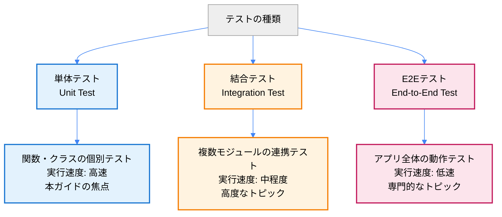

# 初心者向けテスト入門ガイド

## 🎯 このガイドの目標

**⏱️ 学習時間**: 18分 | **👤 対象**: プログラミング経験があるが、テストは初心者

このガイドでは、TypeScript Minecraft Cloneプロジェクトでテストを書く基礎を学びます。「なぜテストが必要か？」から「実際にテストを書いて実行する」まで、段階的に進めます。

> 📍 **学習フロー**: **[18分 基本テスト]** → [20分 実践テスト] → [25分 高度技術] → [30分 包括戦略]

## 1. テストとは何か？

### 1.1 なぜテストが重要なのか

```typescript
// ❌ テストなしの開発
function calculateDistance(pos1: Position, pos2: Position): number {
  return Math.sqrt(
    Math.pow(pos2.x - pos1.x, 2) +
    Math.pow(pos2.y - pos1.y, 2) +
    Math.pow(pos2.z - pos1.z, 2)
  );
}
// バグがあってもリリース後まで分からない...
```

```typescript
// ✅ テストありの開発
import { describe, it, expect } from 'vitest';

describe('calculateDistance', () => {
  it('正しい距離を計算する', () => {
    const pos1 = { x: 0, y: 0, z: 0 };
    const pos2 = { x: 3, y: 4, z: 0 };

    const result = calculateDistance(pos1, pos2);

    expect(result).toBe(5); // 3-4-5の直角三角形
  });

  it('同じ位置の距離は0', () => {
    const pos = { x: 10, y: 20, z: 30 };

    const result = calculateDistance(pos, pos);

    expect(result).toBe(0);
  });
});
// バグを早期発見！安心してリファクタリング可能
```

### 1.2 テストの種類



## 2. Vitestの基本

### 2.1 テストファイルの構造

```typescript
// 📁 src/domain/position.test.ts
import { describe, it, expect } from 'vitest';
import { Position, PositionOps } from './position';

// 🏗️ テストスイート（関連するテストをグループ化）
describe('Position', () => {

  // 🧪 個別のテストケース
  it('有効な座標を作成できる', () => {
    // 準備 (Arrange)
    const x = 100;
    const y = 64;
    const z = -50;

    // 実行 (Act)
    const position: Position = { x, y, z };

    // 検証 (Assert)
    expect(position.x).toBe(100);
    expect(position.y).toBe(64);
    expect(position.z).toBe(-50);
  });

  it('距離計算が正しく動作する', () => {
    // AAA パターン（Arrange-Act-Assert）
    const pos1 = { x: 0, y: 0, z: 0 };
    const pos2 = { x: 6, y: 8, z: 0 };

    const distance = PositionOps.distance(pos1, pos2);

    expect(distance).toBe(10);
  });
});
```

### 2.2 基本的なアサーション

```typescript
describe('Vitestアサーション入門', () => {
  it('等価性の検証', () => {
    // 🔍 値の比較
    expect(2 + 2).toBe(4);                    // 厳密等価（===）
    expect({ x: 1, y: 2 }).toEqual({ x: 1, y: 2 }); // オブジェクトの内容比較

    // 🔍 真偽値の検証
    expect(true).toBeTruthy();                // 真値判定
    expect(false).toBeFalsy();                // 偽値判定
    expect(null).toBeNull();                  // nullチェック
    expect(undefined).toBeUndefined();        // undefinedチェック
  });

  it('数値の検証', () => {
    const health = 85;

    expect(health).toBeGreaterThan(50);       // > 50
    expect(health).toBeGreaterThanOrEqual(85); // >= 85
    expect(health).toBeLessThan(100);         // < 100
    expect(health).toBeCloseTo(85.0, 0);      // 浮動小数点の近似比較
  });

  it('文字列の検証', () => {
    const playerName = "Steve";

    expect(playerName).toContain("teve");      // 部分文字列を含む
    expect(playerName).toMatch(/^S/);          // 正規表現マッチ
    expect(playerName).toHaveLength(5);        // 文字列長
  });

  it('配列・オブジェクトの検証', () => {
    const inventory = ["stone", "wood", "dirt"];

    expect(inventory).toHaveLength(3);         // 配列長
    expect(inventory).toContain("wood");       // 要素を含む
    expect(inventory).toEqual(                 // 配列の内容全体
      expect.arrayContaining(["stone", "wood"])
    );

    const player = { name: "Alex", health: 20 };
    expect(player).toHaveProperty("health");   // プロパティ存在
    expect(player).toHaveProperty("health", 20); // プロパティ値
  });
});
```

## 3. 実際のMinecraftコンポーネントをテストする

### 3.1 Position のテスト

```typescript
// 📁 src/domain/position.test.ts
import { describe, it, expect } from 'vitest';
import { Position, PositionOps } from './position';

describe('Position', () => {
  describe('基本機能', () => {
    it('座標が正しく設定される', () => {
      const pos: Position = { x: 10, y: 64, z: -25 };

      expect(pos.x).toBe(10);
      expect(pos.y).toBe(64);
      expect(pos.z).toBe(-25);
    });
  });

  describe('PositionOps', () => {
    describe('distance', () => {
      it('2点間の距離を正しく計算する', () => {
        const pos1: Position = { x: 0, y: 0, z: 0 };
        const pos2: Position = { x: 3, y: 4, z: 0 };

        const result = PositionOps.distance(pos1, pos2);

        expect(result).toBe(5); // 3-4-5の三角形
      });

      it('同じ位置の距離は0', () => {
        const pos: Position = { x: 100, y: 200, z: 300 };

        const result = PositionOps.distance(pos, pos);

        expect(result).toBe(0);
      });

      it('3次元での距離計算', () => {
        const pos1: Position = { x: 1, y: 2, z: 3 };
        const pos2: Position = { x: 4, y: 6, z: 8 };

        const result = PositionOps.distance(pos1, pos2);

        // √[(4-1)² + (6-2)² + (8-3)²] = √[9 + 16 + 25] = √50 ≈ 7.07
        expect(result).toBeCloseTo(7.07, 2);
      });
    });

    describe('getAdjacent', () => {
      it('北方向の隣接座標を取得', () => {
        const pos: Position = { x: 0, y: 64, z: 0 };

        const result = PositionOps.getAdjacent(pos, 'north');

        expect(result).toEqual({ x: 0, y: 64, z: -1 });
      });

      it('すべての方向で正しい隣接座標を取得', () => {
        const center: Position = { x: 10, y: 20, z: 30 };

        expect(PositionOps.getAdjacent(center, 'north')).toEqual({ x: 10, y: 20, z: 29 });
        expect(PositionOps.getAdjacent(center, 'south')).toEqual({ x: 10, y: 20, z: 31 });
        expect(PositionOps.getAdjacent(center, 'east')).toEqual({ x: 11, y: 20, z: 30 });
        expect(PositionOps.getAdjacent(center, 'west')).toEqual({ x: 9, y: 20, z: 30 });
        expect(PositionOps.getAdjacent(center, 'up')).toEqual({ x: 10, y: 21, z: 30 });
        expect(PositionOps.getAdjacent(center, 'down')).toEqual({ x: 10, y: 19, z: 30 });
      });
    });

    describe('isValid', () => {
      it('有効な座標はtrueを返す', () => {
        const validPos: Position = { x: 1000, y: 100, z: -500 };

        const result = PositionOps.isValid(validPos);

        expect(result).toBe(true);
      });

      it('Y座標が範囲外の場合はfalseを返す', () => {
        const invalidPos: Position = { x: 0, y: 500, z: 0 }; // Y > 320

        const result = PositionOps.isValid(invalidPos);

        expect(result).toBe(false);
      });

      it('X/Z座標が範囲外の場合はfalseを返す', () => {
        const invalidPos: Position = { x: 40_000_000, y: 64, z: 0 }; // X > 30M

        const result = PositionOps.isValid(invalidPos);

        expect(result).toBe(false);
      });
    });
  });
});
```

### 3.2 Block のテスト

```typescript
// 📁 src/domain/block.test.ts
import { describe, it, expect } from 'vitest';
import { Block, BlockOps } from './block';

describe('Block', () => {
  describe('BlockOps', () => {
    describe('createAir', () => {
      it('空気ブロックを正しく作成する', () => {
        const airBlock = BlockOps.createAir();

        expect(airBlock.type).toBe('air');
        expect(airBlock.transparent).toBe(true);
        expect(airBlock.hardness).toBe(0);
        expect(airBlock.lightLevel).toBe(15);
      });
    });

    describe('createStone', () => {
      it('石ブロックを正しく作成する', () => {
        const stoneBlock = BlockOps.createStone();

        expect(stoneBlock.type).toBe('stone');
        expect(stoneBlock.transparent).toBe(false);
        expect(stoneBlock.hardness).toBe(1.5);
        expect(stoneBlock.lightLevel).toBe(0);
      });
    });

    describe('canBreak', () => {
      it('岩盤以外のブロックは破壊可能', () => {
        const stoneBlock = BlockOps.createStone();

        const result = BlockOps.canBreak(stoneBlock);

        expect(result).toBe(true);
      });

      it('岩盤は破壊不可能', () => {
        const bedrockBlock: Block = {
          id: "bedrock" as any,
          type: "bedrock",
          hardness: 0 as any,
          lightLevel: 0 as any,
          transparent: false
        };

        const result = BlockOps.canBreak(bedrockBlock);

        expect(result).toBe(false);
      });
    });

    describe('getDrops', () => {
      it('石ブロックは石をドロップする', () => {
        const stoneBlock = BlockOps.createStone();

        const drops = BlockOps.getDrops(stoneBlock);

        expect(drops).toEqual(["stone"]);
      });

      it('空気ブロックは何もドロップしない', () => {
        const airBlock = BlockOps.createAir();

        const drops = BlockOps.getDrops(airBlock);

        expect(drops).toEqual([]);
      });
    });
  });
});
```

## 4. テストの実行とデバッグ

### 4.1 基本的な実行方法

```bash
# 📁 プロジェクトルートで実行

# すべてのテストを実行
npm run test

# ファイル監視モードで実行（ファイル変更時に自動実行）
npm run test -- --watch

# 特定のファイルのみテスト
npm run test src/domain/position.test.ts

# パターンマッチでテスト実行
npm run test -- --grep "Position"

# カバレッジ付きで実行
npm run test:coverage
```

### 4.2 テスト結果の読み方

```bash
# ✅ 成功例
 ✓ src/domain/position.test.ts (8)
   ✓ Position (8)
     ✓ 基本機能 (1)
       ✓ 座標が正しく設定される
     ✓ PositionOps (7)
       ✓ distance (3)
         ✓ 2点間の距離を正しく計算する
         ✓ 同じ位置の距離は0
         ✓ 3次元での距離計算

# ❌ 失敗例
 ❌ src/domain/position.test.ts (1)
   ❌ Position > PositionOps > distance > 2点間の距離を正しく計算する
     AssertionError: expected 4 to be 5
      ❯ src/domain/position.test.ts:15:27
         14|     const result = PositionOps.distance(pos1, pos2);
         15|     expect(result).toBe(5);
         16|
```

### 4.3 デバッグ技術

```typescript
describe('デバッグ技術', () => {
  it('console.logを使った値確認', () => {
    const pos1 = { x: 0, y: 0, z: 0 };
    const pos2 = { x: 3, y: 4, z: 0 };

    console.log('入力値:', { pos1, pos2 }); // デバッグ出力

    const result = PositionOps.distance(pos1, pos2);

    console.log('計算結果:', result); // デバッグ出力

    expect(result).toBe(5);
  });

  it('中間値のアサーションで問題箇所を特定', () => {
    const pos1 = { x: 0, y: 0, z: 0 };
    const pos2 = { x: 3, y: 4, z: 0 };

    // 計算過程を分解してテスト
    const deltaX = pos2.x - pos1.x;
    const deltaY = pos2.y - pos1.y;
    const deltaZ = pos2.z - pos1.z;

    expect(deltaX).toBe(3);
    expect(deltaY).toBe(4);
    expect(deltaZ).toBe(0);

    const sumSquares = deltaX ** 2 + deltaY ** 2 + deltaZ ** 2;
    expect(sumSquares).toBe(25);

    const result = Math.sqrt(sumSquares);
    expect(result).toBe(5);
  });
});
```

## 5. よくあるテストパターン

### 5.1 境界値テスト

```typescript
describe('境界値テスト', () => {
  it('座標の境界値をテスト', () => {
    // Y座標の最小値・最大値
    expect(PositionOps.isValid({ x: 0, y: -64, z: 0 })).toBe(true);  // 最小値
    expect(PositionOps.isValid({ x: 0, y: 320, z: 0 })).toBe(true);  // 最大値
    expect(PositionOps.isValid({ x: 0, y: -65, z: 0 })).toBe(false); // 最小値-1
    expect(PositionOps.isValid({ x: 0, y: 321, z: 0 })).toBe(false); // 最大値+1

    // X/Z座標の境界値
    expect(PositionOps.isValid({ x: 30_000_000, y: 0, z: 0 })).toBe(true);   // 最大値
    expect(PositionOps.isValid({ x: -30_000_000, y: 0, z: 0 })).toBe(true);  // 最小値
    expect(PositionOps.isValid({ x: 30_000_001, y: 0, z: 0 })).toBe(false);  // 最大値+1
    expect(PositionOps.isValid({ x: -30_000_001, y: 0, z: 0 })).toBe(false); // 最小値-1
  });
});
```

### 5.2 異常系テスト

```typescript
describe('異常系テスト', () => {
  it('無効な入力に対する適切な処理', () => {
    // NaNの処理
    const pos1 = { x: 0, y: 0, z: 0 };
    const pos2 = { x: NaN, y: 0, z: 0 };

    const result = PositionOps.distance(pos1, pos2);

    expect(Number.isNaN(result)).toBe(true); // NaNが返される
  });

  it('Infinityの処理', () => {
    const pos1 = { x: 0, y: 0, z: 0 };
    const pos2 = { x: Infinity, y: 0, z: 0 };

    const result = PositionOps.distance(pos1, pos2);

    expect(result).toBe(Infinity);
  });
});
```

### 5.3 複数パターンのテスト

```typescript
describe('複数パターンのテスト', () => {
  // テスト.each を使った効率的なパターンテスト
  it.each([
    [{ x: 0, y: 0, z: 0 }, { x: 3, y: 4, z: 0 }, 5],
    [{ x: 0, y: 0, z: 0 }, { x: 0, y: 0, z: 0 }, 0],
    [{ x: 1, y: 1, z: 1 }, { x: 4, y: 5, z: 6 }, Math.sqrt(50)],
    [{ x: -5, y: 0, z: 0 }, { x: 5, y: 0, z: 0 }, 10]
  ])('distance(%o, %o) = %f', (pos1, pos2, expected) => {
    const result = PositionOps.distance(pos1, pos2);
    expect(result).toBeCloseTo(expected, 2);
  });
});
```

## 6. テストの組織化とベストプラクティス

### 6.1 テストファイルの構成

```
src/
├── domain/
│   ├── position.ts
│   ├── position.test.ts    # ✅ 同じディレクトリに配置
│   ├── block.ts
│   ├── block.test.ts
│   └── player/
│       ├── player.ts
│       └── player.test.ts  # ✅ サブディレクトリでも同じ構造
└── __tests__/              # ❌ 分離は避ける（関連が見えにくい）
```

### 6.2 テスト命名規則

```typescript
describe('テスト対象のクラス/関数名', () => {
  describe('メソッド名/機能名', () => {
    it('期待される動作を日本語で明確に記述', () => {
      // テストコード
    });

    it('異常系: エラー条件での動作を明記', () => {
      // エラー系テストコード
    });
  });
});

// 良い例
describe('PlayerOps', () => {
  describe('create', () => {
    it('デフォルト値でプレイヤーを作成する', () => {});
    it('カスタム位置でプレイヤーを作成する', () => {});
    it('異常系: 無効な名前でエラーを投げる', () => {});
  });
});
```

### 6.3 可読性の高いテスト

```typescript
describe('可読性の高いテスト', () => {
  it('Given-When-Then パターン', () => {
    // Given（前提条件）
    const player = PlayerOps.create("TestPlayer");
    const damage = 5;

    // When（実行）
    const damagedPlayer = PlayerOps.damage(player, damage);

    // Then（結果検証）
    expect(damagedPlayer.health).toBe(15); // 20 - 5 = 15
    expect(damagedPlayer.name).toBe("TestPlayer"); // 名前は変わらない
  });

  it('意図を明確にするコメント', () => {
    const player = PlayerOps.create("Steve", { x: 0, y: 64, z: 0 });

    // 致命的なダメージを与える
    const fatalDamage = 25; // プレイヤーの初期HP 20を超える

    const result = PlayerOps.damage(player, fatalDamage);

    expect(result.health).toBe(0); // HPは0未満にならない
    expect(PlayerOps.isAlive(result)).toBe(false); // 死亡状態
  });
});
```

## 7. 次のステップ

### 7.1 今回学んだこと

- ✅ テストの基本概念と重要性
- ✅ Vitestの基本的な使い方
- ✅ describe、it、expectの使い方
- ✅ 基本的なアサーション
- ✅ Minecraftコンポーネントの実践テスト
- ✅ テスト実行とデバッグ方法
- ✅ よくあるテストパターン

### 7.2 次に学ぶべきこと

1. **モッキング** - 外部依存の切り離し
2. **非同期テスト** - Promise、Effect-TSパターンのテスト
3. **統合テスト** - 複数コンポーネントの連携テスト
4. **カバレッジ** - テストの網羅性測定
5. **パフォーマンステスト** - 実行速度の検証

### 7.3 実践課題

以下のコンポーネントに対して、今回学んだパターンでテストを書いてみましょう：

```typescript
// 課題1: ChunkOps.toId のテスト
expect(ChunkOps.toId({ x: 5, z: -3 })).toBe("chunk_5_-3");

// 課題2: PlayerOps.move の境界値テスト
// Y座標が-64未満または320超過の場合の動作をテスト

// 課題3: BlockOps.getDrops の複数パターンテスト
// 異なるブロックタイプでのドロップアイテム検証
```

## まとめ

`★ Insight ─────────────────────────────────────`
このガイドで初心者が実践的なテスト技術を習得できます：
1. **AAA パターン**: Arrange-Act-Assert で構造化されたテスト
2. **境界値テスト**: エッジケースでの動作確認が重要
3. **デバッグ技術**: console.logと段階的アサーションで問題特定

Minecraftプロジェクト特有の座標、ブロック、プレイヤーエンティティのテストパターンを通じて、実用的なテスト作成技術を学習できました。
`─────────────────────────────────────────────────`

> 🔗 **Continue Learning**: [実践的テストガイド](./testing-guide.md) - Effect-TS統合、モッキング、高度なテストパターン