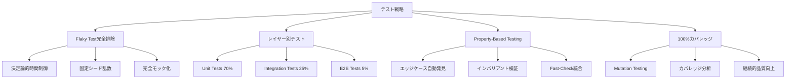
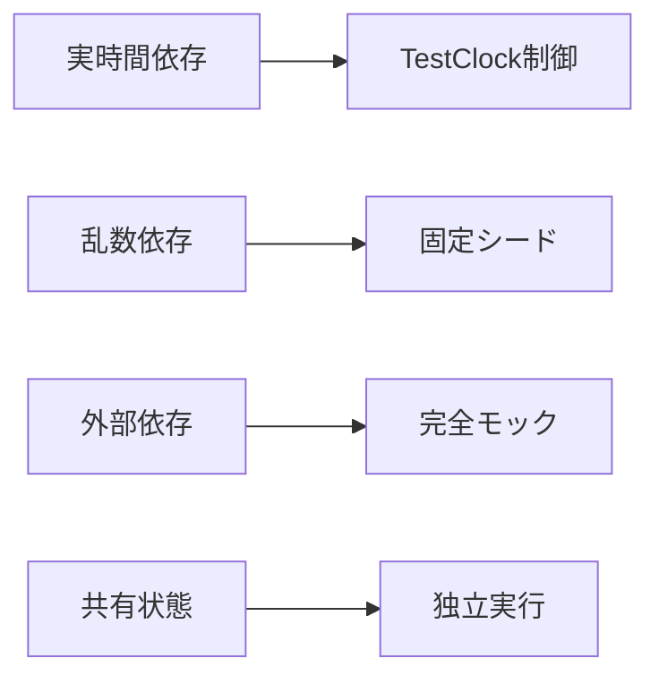

# 包括的テスト戦略ガイド - Effect-TS 3.17+ + Schema-First + Property-Based Testing

## 🎯 Quick Guide（10分でテスト戦略理解）

### テスト戦略概要図


### 緊急対応チェックリスト
- [ ] **Flaky Test検出**: `pnpm test --reporter=verbose --retry=0`でフレイキーテスト確認
- [ ] **カバレッジ確認**: `pnpm test:coverage`で100%達成確認
- [ ] **Property-Based実行**: `fc.assert`パターンでエッジケース網羅
- [ ] **決定論的検証**: `TestClock`、`Random.fromSeed`使用確認
- [ ] **レイヤー分離**: Domain/Application/Infrastructure独立テスト

---

## 📋 Problem Statement

TypeScript Minecraftプロジェクトでは、Effect-TS 3.17+とDDDアーキテクチャの複雑性により、従来のテスト手法では以下の課題が発生します。

### 主要課題
1. **非決定的テスト**: 時間・乱数・外部依存による不安定なテスト
2. **複雑な依存関係**: レイヤー間の結合とサービス間の依存性
3. **エッジケース漏れ**: 手動テストケースでは発見困難な境界値問題
4. **Effect型の複雑性**: 非同期エラーハンドリングのテスト困難性
5. **カバレッジの不完全性**: テスト品質の客観的評価困難

---

## 🔧 Solution Approach

### 1. ゼロトレランスFlaky Test排除戦略


### 2. 階層化テストアーキテクチャ
| テストレベル | カバレッジ目標 | 実行速度 | 対象範囲 |
|-------------|----------------|----------|----------|
| **Unit Tests** | 70% | 🚀 高速（<1s） | 単一関数/クラス |
| **Integration Tests** | 25% | ⚡ 中速（<10s） | レイヤー間結合 |
| **E2E Tests** | 5% | 🐌 低速（<60s） | エンドツーエンド |

### 3. Property-Based Testing統合
- **Fast-Check**: エッジケース自動生成
- **Schema統合**: 型安全なテストデータ
- **インバリアント検証**: ビジネスルール保証

---

## 📖 Comprehensive Implementation Guide

### Phase 1: Flaky Test完全排除実装

#### 1.1 決定論的時間制御
```typescript
import { TestClock, TestServices, Duration, Effect } from 'effect'

// ❌ 絶対に避けるべきパターン: 実時間への依存
describe('Animation Timer - FLAKY', () => {
  it('アニメーションが1秒後に完了する', async () => {
    const animation = startAnimation()
    await new Promise(resolve => setTimeout(resolve, 1000))
    expect(animation.isComplete).toBe(true) // タイミングによって失敗
  })
})

// ✅ 決定論的パターン: テスト用時間制御
describe('Animation Timer - DETERMINISTIC', () => {
  it('アニメーションが1秒後に完了する', async () => {
    await Effect.runPromise(
      Effect.gen(function* () {
        const animation = yield* startAnimation()

        // テスト用時間を進める（実時間経過なし）
        yield* TestClock.adjust(Duration.seconds(1))

        const isComplete = yield* animation.isComplete
        expect(isComplete).toBe(true)
      }).pipe(Effect.provide(TestServices))
    )
  })

  it('複数タイマーの並行実行制御', async () => {
    await Effect.runPromise(
      Effect.gen(function* () {
        const timer1 = yield* Effect.delay(Effect.succeed("timer1"), "500 millis")
        const timer2 = yield* Effect.delay(Effect.succeed("timer2"), "1000 millis")

        // 500ms進める
        yield* TestClock.adjust(Duration.millis(500))
        const result1 = yield* Effect.race(timer1, Effect.succeed("not-ready"))
        expect(result1).toBe("timer1")

        // さらに500ms進める
        yield* TestClock.adjust(Duration.millis(500))
        const result2 = yield* Effect.race(timer2, Effect.succeed("not-ready"))
        expect(result2).toBe("timer2")
      }).pipe(Effect.provide(TestServices))
    )
  })
})
```

#### 1.2 固定シード乱数生成
```typescript
import { Random, Effect } from 'effect'

// ❌ 絶対に避けるべきパターン: 制御されていない乱数
describe('Random Generation - FLAKY', () => {
  it('ランダムなアイテムを生成する', () => {
    const item = generateRandomItem()
    expect(item.rarity).toBe('legendary') // ランダムなので失敗する可能性
  })
})

// ✅ 決定論的パターン: 固定シード乱数
describe('Random Generation - DETERMINISTIC', () => {
  const FIXED_SEED = 12345

  it('固定シードで一貫した結果を保証', async () => {
    const program = Effect.gen(function* () {
      const random1 = Random.fromSeed(FIXED_SEED)
      const random2 = Random.fromSeed(FIXED_SEED)

      const value1 = Random.nextInt(random1, 100)
      const value2 = Random.nextInt(random2, 100)

      // 同じシードからは必ず同じ値が生成される
      expect(value1).toBe(value2)
      return { value1, value2 }
    })

    // 複数回実行しても結果は同じ
    const result1 = await Effect.runPromise(program)
    const result2 = await Effect.runPromise(program)
    expect(result1).toEqual(result2)
  })

  it('Property-Based Testingでの決定論的実行', () => {
    fc.assert(
      fc.property(
        fc.integer({ min: 0, max: 1000000 }),
        (seed) => {
          const rng1 = Random.fromSeed(seed)
          const rng2 = Random.fromSeed(seed)

          const value1 = Random.nextInt(rng1, 1000)
          const value2 = Random.nextInt(rng2, 1000)

          expect(value1).toBe(value2)
        }
      ),
      {
        seed: 42, // PBTも固定シードで決定論的実行
        numRuns: 1000,
        verbose: false
      }
    )
  })
})
```

#### 1.3 外部依存の完全モック化
```typescript
import { Layer, Effect, Context } from 'effect'

// ❌ 絶対に避けるべきパターン: 実外部依存
describe('Network Request - FLAKY', () => {
  it('外部APIからデータを取得する', async () => {
    const response = await fetch('https://api.example.com/data')
    const data = await response.json()
    expect(data.status).toBe('success') // ネットワーク状態に依存
  })
})

// ✅ 決定論的パターン: 完全モック化
interface NetworkService {
  readonly fetch: (url: string) => Effect.Effect<ApiResponse, NetworkError>
  readonly post: (url: string, data: unknown) => Effect.Effect<ApiResponse, NetworkError>
}

const NetworkService = Context.GenericTag<NetworkService>("@app/NetworkService")

describe('Network Request - DETERMINISTIC', () => {
  const createMockNetworkService = (
    responses: Map<string, ApiResponse>,
    errors: Map<string, NetworkError> = new Map()
  ) =>
    Layer.succeed(NetworkService, {
      fetch: (url: string) => {
        if (errors.has(url)) {
          return Effect.fail(errors.get(url)!)
        }
        const response = responses.get(url)
        if (!response) {
          return Effect.fail(new NetworkError(`No mock for ${url}`))
        }
        return Effect.succeed(response)
      },
      post: (url: string, data: unknown) => {
        const key = `POST:${url}`
        const response = responses.get(key)
        if (!response) {
          return Effect.fail(new NetworkError(`No mock for ${key}`))
        }
        return Effect.succeed(response)
      }
    })

  it('正常レスポンスの処理', async () => {
    const mockResponses = new Map([
      ['https://api.example.com/data', { status: 'success', data: [1, 2, 3] }]
    ])

    const result = await Effect.runPromise(
      Effect.gen(function* () {
        const network = yield* NetworkService
        return yield* network.fetch('https://api.example.com/data')
      }).pipe(Effect.provide(createMockNetworkService(mockResponses)))
    )

    expect(result.status).toBe('success')
    expect(result.data).toEqual([1, 2, 3])
  })

  it('ネットワークエラーハンドリング', async () => {
    const mockErrors = new Map([
      ['https://api.example.com/error', new NetworkError('Connection timeout')]
    ])

    const exit = await Effect.runPromiseExit(
      Effect.gen(function* () {
        const network = yield* NetworkService
        return yield* network.fetch('https://api.example.com/error')
      }).pipe(Effect.provide(createMockNetworkService(new Map(), mockErrors)))
    )

    expect(Exit.isFailure(exit)).toBe(true)
  })

  it('リトライ機構のテスト', async () => {
    let attempts = 0
    const dynamicService = Layer.succeed(NetworkService, {
      fetch: (url: string) => {
        attempts++
        if (attempts < 3) {
          return Effect.fail(new NetworkError('Temporary error'))
        }
        return Effect.succeed({ status: 'success', data: 'finally-worked' })
      }
    })

    const result = await Effect.runPromise(
      Effect.gen(function* () {
        const network = yield* NetworkService
        return yield* network.fetch('https://api.example.com/retry').pipe(
          Effect.retry(Schedule.exponential("100 millis").pipe(
            Schedule.intersect(Schedule.recurs(2))
          ))
        )
      }).pipe(Effect.provide(dynamicService))
    )

    expect(attempts).toBe(3)
    expect(result.data).toBe('finally-worked')
  })
})
```

### Phase 2: レイヤー別テスト戦略実装

#### 2.1 Domain Layer Tests - 純粋関数とビジネスルール
```typescript
// domain/entities/player.test.ts
describe('Player Domain Entity', () => {
  describe('Value Objects', () => {
    it('PlayerIdの一意性とバリデーション', () => {
      const id1 = PlayerId.generate()
      const id2 = PlayerId.generate()

      expect(id1.value).not.toBe(id2.value)
      expect(PlayerId.isValid(id1.value)).toBe(true)
      expect(() => PlayerId.fromString("")).toThrow(ValidationError)
    })

    it('Health値の境界条件', () => {
      expect(() => Health.create(-1)).toThrow('Health cannot be negative')
      expect(() => Health.create(101)).toThrow('Health cannot exceed maximum')

      const health = Health.create(50)
      expect(health.value).toBe(50)
      expect(health.isAlive()).toBe(true)
      expect(Health.create(0).isAlive()).toBe(false)
    })

    it('Positionの空間制約', () => {
      const validPos = Position.create(0, 64, 0)
      expect(validPos.isValid()).toBe(true)

      expect(() => Position.create(0, -1, 0)).toThrow('Y coordinate below world limit')
      expect(() => Position.create(0, 257, 0)).toThrow('Y coordinate above world limit')
    })
  })

  describe('Entity Invariants', () => {
    it('ダメージ計算のビジネスルール', () => {
      const player = Player.create({
        id: PlayerId.generate(),
        name: "TestPlayer",
        health: Health.create(100),
        armor: Armor.create(10)
      })

      // 通常ダメージ
      const damaged = player.takeDamage(30)
      expect(damaged.health.value).toBe(75) // 30 - 10(armor) = 20, 100 - 20 = 80

      // 防御力を超えるダメージ
      const heavyDamaged = player.takeDamage(50)
      expect(heavyDamaged.health.value).toBe(60) // 50 - 10 = 40, 100 - 40 = 60

      // 致死ダメージ
      const killed = player.takeDamage(200)
      expect(killed.health.value).toBe(0)
      expect(killed.isDead()).toBe(true)
    })

    it('インベントリ容量制限の実施', () => {
      const player = Player.create({
        id: PlayerId.generate(),
        name: "TestPlayer",
        inventory: Inventory.createEmpty(36) // 36スロット
      })

      // 容量内での追加
      for (let i = 0; i < 36; i++) {
        const added = player.addItem(ItemStack.create('dirt', 1))
        expect(added.isSuccess).toBe(true)
      }

      // 容量超過
      const overflow = player.addItem(ItemStack.create('stone', 1))
      expect(overflow.isSuccess).toBe(false)
      expect(overflow.error).toEqual('Inventory full')
    })
  })

  describe('Property-Based Domain Tests', () => {
    const playerArbitrary = fc.record({
      name: fc.stringMatching(/^[a-zA-Z0-9_]{3,20}$/),
      health: fc.integer({ min: 0, max: 100 }),
      position: fc.record({
        x: fc.float({ min: -1000, max: 1000, noNaN: true }),
        y: fc.integer({ min: 0, max: 256 }),
        z: fc.float({ min: -1000, max: 1000, noNaN: true })
      })
    })

    it('プレイヤー状態の不変条件', () => {
      fc.assert(
        fc.property(playerArbitrary, (playerData) => {
          const player = Player.create({
            id: PlayerId.generate(),
            ...playerData,
            health: Health.create(playerData.health),
            position: Position.create(playerData.position.x, playerData.position.y, playerData.position.z)
          })

          // 不変条件1: ヘルスは0-100の範囲内
          expect(player.health.value).toBeGreaterThanOrEqual(0)
          expect(player.health.value).toBeLessThanOrEqual(100)

          // 不変条件2: 位置のY座標は有効範囲内
          expect(player.position.y).toBeGreaterThanOrEqual(0)
          expect(player.position.y).toBeLessThanOrEqual(256)

          // 不変条件3: 名前は有効な形式
          expect(player.name).toMatch(/^[a-zA-Z0-9_]{3,20}$/)
        })
      )
    })

    it('ダメージ計算の交換法則', () => {
      fc.assert(
        fc.property(
          fc.integer({ min: 1, max: 100 }),
          fc.integer({ min: 1, max: 50 }),
          fc.integer({ min: 1, max: 50 }),
          (initialHealth, damage1, damage2) => {
            const player1 = Player.create({
              id: PlayerId.generate(),
              health: Health.create(initialHealth)
            })

            const player2 = Player.create({
              id: PlayerId.generate(),
              health: Health.create(initialHealth)
            })

            // 異なる順序でダメージを与える
            const result1 = player1.takeDamage(damage1).takeDamage(damage2)
            const result2 = player2.takeDamage(damage2).takeDamage(damage1)

            // 最終的なヘルスは同じになるはず
            expect(result1.health.value).toBe(result2.health.value)
          }
        )
      )
    })
  })
})
```

#### 2.2 Application Layer Tests - Use Cases とワークフロー
```typescript
// application/use-cases/player-movement.test.ts
describe('PlayerMovementUseCase', () => {
  interface TestDependencies {
    playerRepository: PlayerRepository
    worldService: WorldService
    collisionService: CollisionService
    eventBus: EventBus
  }

  const createTestDependencies = (): TestDependencies => ({
    playerRepository: {
      findById: vi.fn(),
      save: vi.fn(),
      findByPosition: vi.fn()
    },
    worldService: {
      getChunkAt: vi.fn(),
      getBlockAt: vi.fn(),
      isChunkLoaded: vi.fn()
    },
    collisionService: {
      checkCollision: vi.fn(),
      getCollisionBounds: vi.fn()
    },
    eventBus: {
      publish: vi.fn(),
      subscribe: vi.fn()
    }
  })

  describe('Move Player Use Case', () => {
    it('正常な移動の処理フロー', async () => {
      const deps = createTestDependencies()
      const useCase = new PlayerMovementUseCase(deps)

      const mockPlayer = Player.create({
        id: PlayerId.generate(),
        position: Position.create(0, 64, 0)
      })

      deps.playerRepository.findById.mockResolvedValue(mockPlayer)
      deps.worldService.isChunkLoaded.mockResolvedValue(true)
      deps.collisionService.checkCollision.mockResolvedValue(false)

      const command = PlayerMovementCommand.create({
        playerId: mockPlayer.id.value,
        targetPosition: Position.create(10, 64, 0),
        timestamp: Date.now()
      })

      const result = await useCase.execute(command)

      expect(result.isSuccess).toBe(true)
      expect(deps.playerRepository.save).toHaveBeenCalledWith(
        expect.objectContaining({
          position: expect.objectContaining({ x: 10, y: 64, z: 0 })
        })
      )
      expect(deps.eventBus.publish).toHaveBeenCalledWith(
        expect.objectContaining({
          type: 'PlayerMoved',
          playerId: mockPlayer.id.value
        })
      )
    })

    it('衝突検出による移動拒否', async () => {
      const deps = createTestDependencies()
      const useCase = new PlayerMovementUseCase(deps)

      const mockPlayer = Player.create({
        id: PlayerId.generate(),
        position: Position.create(0, 64, 0)
      })

      deps.playerRepository.findById.mockResolvedValue(mockPlayer)
      deps.worldService.isChunkLoaded.mockResolvedValue(true)
      deps.collisionService.checkCollision.mockResolvedValue(true) // 衝突あり

      const command = PlayerMovementCommand.create({
        playerId: mockPlayer.id.value,
        targetPosition: Position.create(10, 64, 0)
      })

      const result = await useCase.execute(command)

      expect(result.isSuccess).toBe(false)
      expect(result.error).toEqual('Movement blocked by collision')
      expect(deps.playerRepository.save).not.toHaveBeenCalled()
    })

    it('未ロードチャンクでの移動時自動チャンクロード', async () => {
      const deps = createTestDependencies()
      const useCase = new PlayerMovementUseCase(deps)

      const mockPlayer = Player.create({
        id: PlayerId.generate(),
        position: Position.create(0, 64, 0)
      })

      deps.playerRepository.findById.mockResolvedValue(mockPlayer)
      deps.worldService.isChunkLoaded.mockResolvedValue(false) // チャンク未ロード
      deps.worldService.loadChunk = vi.fn().mockResolvedValue(true)
      deps.collisionService.checkCollision.mockResolvedValue(false)

      const command = PlayerMovementCommand.create({
        playerId: mockPlayer.id.value,
        targetPosition: Position.create(100, 64, 0) // 遠くの位置
      })

      const result = await useCase.execute(command)

      expect(deps.worldService.loadChunk).toHaveBeenCalledWith(
        expect.objectContaining({ x: 6, z: 0 }) // チャンク座標
      )
      expect(result.isSuccess).toBe(true)
    })
  })

  describe('Complex Movement Workflows', () => {
    it('複数プレイヤー同時移動での整合性', async () => {
      const deps = createTestDependencies()
      const useCase = new PlayerMovementUseCase(deps)

      const player1 = Player.create({ id: PlayerId.generate() })
      const player2 = Player.create({ id: PlayerId.generate() })

      // 両プレイヤーが同じ位置に移動しようとする
      const targetPos = Position.create(10, 64, 0)

      deps.playerRepository.findById
        .mockResolvedValueOnce(player1)
        .mockResolvedValueOnce(player2)
      deps.worldService.isChunkLoaded.mockResolvedValue(true)
      deps.collisionService.checkCollision
        .mockResolvedValueOnce(false) // 1人目は成功
        .mockResolvedValueOnce(true)  // 2人目は衝突で失敗

      const [result1, result2] = await Promise.all([
        useCase.execute(PlayerMovementCommand.create({
          playerId: player1.id.value,
          targetPosition: targetPos
        })),
        useCase.execute(PlayerMovementCommand.create({
          playerId: player2.id.value,
          targetPosition: targetPos
        }))
      ])

      expect(result1.isSuccess).toBe(true)
      expect(result2.isSuccess).toBe(false)
      expect(deps.playerRepository.save).toHaveBeenCalledTimes(1)
    })

    it('Effect-TSパターンでのエラーハンドリング', async () => {
      const program = Effect.gen(function* () {
        const useCase = yield* PlayerMovementUseCase
        const command = PlayerMovementCommand.create({
          playerId: "non-existent-player",
          targetPosition: Position.create(0, 64, 0)
        })

        return yield* useCase.execute(command).pipe(
          Effect.catchTags({
            PlayerNotFoundError: (error) => Effect.succeed({
              isSuccess: false,
              error: `Player not found: ${error.playerId}`
            }),
            ChunkLoadError: (error) => Effect.succeed({
              isSuccess: false,
              error: `Chunk loading failed: ${error.coordinate}`
            })
          })
        )
      })

      const mockLayer = createMockUseCaseLayer({
        playerRepository: {
          findById: () => Effect.fail(new PlayerNotFoundError("non-existent-player"))
        }
      })

      const result = await Effect.runPromise(
        program.pipe(Effect.provide(mockLayer))
      )

      expect(result.isSuccess).toBe(false)
      expect(result.error).toContain("Player not found")
    })
  })
})
```

#### 2.3 Infrastructure Layer Tests - アダプターとリポジトリ
```typescript
// infrastructure/repositories/indexed-db-player-repository.test.ts
describe('IndexedDBPlayerRepository', () => {
  let repository: IndexedDBPlayerRepository
  let mockDB: IDBDatabase

  beforeEach(async () => {
    // テスト用InMemory IndexedDB
    mockDB = await createInMemoryDB('test-db', 1)
    repository = new IndexedDBPlayerRepository(mockDB)
  })

  afterEach(async () => {
    await repository.clear()
    mockDB.close()
  })

  describe('基本CRUD操作', () => {
    it('プレイヤーの保存と取得', async () => {
      const player = TestDataBuilder.player()

      await repository.save(player)
      const retrieved = await repository.findById(player.id.value)

      expect(retrieved).toEqual(player)
    })

    it('存在しないプレイヤーでOption.noneを返す', async () => {
      const result = await repository.findById("non-existent")
      expect(Option.isNone(result)).toBe(true)
    })

    it('プレイヤーの更新', async () => {
      const player = TestDataBuilder.player()
      await repository.save(player)

      const updated = player.takeDamage(20)
      await repository.save(updated)

      const retrieved = await repository.findById(player.id.value)
      expect(retrieved.health.value).toBe(updated.health.value)
    })

    it('プレイヤーの削除', async () => {
      const player = TestDataBuilder.player()
      await repository.save(player)

      await repository.delete(player.id)
      const retrieved = await repository.findById(player.id.value)

      expect(Option.isNone(retrieved)).toBe(true)
    })
  })

  describe('複雑なクエリ操作', () => {
    it('位置範囲によるプレイヤー検索', async () => {
      const players = [
        TestDataBuilder.player({ position: Position.create(0, 64, 0) }),
        TestDataBuilder.player({ position: Position.create(10, 64, 0) }),
        TestDataBuilder.player({ position: Position.create(100, 64, 0) })
      ]

      await Promise.all(players.map(p => repository.save(p)))

      const nearbyPlayers = await repository.findInRadius(
        Position.create(5, 64, 0),
        15 // 半径15ブロック
      )

      expect(nearbyPlayers).toHaveLength(2) // 最初の2人のみ
      expect(nearbyPlayers.map(p => p.position.x)).toEqual([0, 10])
    })

    it('ページネーション付きプレイヤーリスト', async () => {
      const players = Array.from({ length: 25 }, (_, i) =>
        TestDataBuilder.player({ name: `Player${i}` })
      )

      await Promise.all(players.map(p => repository.save(p)))

      const page1 = await repository.findAll({ offset: 0, limit: 10 })
      const page2 = await repository.findAll({ offset: 10, limit: 10 })
      const page3 = await repository.findAll({ offset: 20, limit: 10 })

      expect(page1).toHaveLength(10)
      expect(page2).toHaveLength(10)
      expect(page3).toHaveLength(5)

      // 重複がないことを確認
      const allIds = [...page1, ...page2, ...page3].map(p => p.id.value)
      const uniqueIds = new Set(allIds)
      expect(uniqueIds.size).toBe(allIds.length)
    })
  })

  describe('トランザクション管理', () => {
    it('トランザクション内での操作成功', async () => {
      const player1 = TestDataBuilder.player()
      const player2 = TestDataBuilder.player()

      await repository.transaction(async (tx) => {
        await repository.save(player1, tx)
        await repository.save(player2, tx)
      })

      const retrieved1 = await repository.findById(player1.id.value)
      const retrieved2 = await repository.findById(player2.id.value)

      expect(Option.isSome(retrieved1)).toBe(true)
      expect(Option.isSome(retrieved2)).toBe(true)
    })

    it('トランザクションロールバックによる操作取り消し', async () => {
      const player = TestDataBuilder.player()

      try {
        await repository.transaction(async (tx) => {
          await repository.save(player, tx)
          throw new Error('Intentional error')
        })
      } catch (error) {
        expect(error.message).toBe('Intentional error')
      }

      const retrieved = await repository.findById(player.id.value)
      expect(Option.isNone(retrieved)).toBe(true)
    })
  })

  describe('パフォーマンステスト', () => {
    it('大量データ挿入のパフォーマンス', async () => {
      const players = Array.from({ length: 1000 }, () => TestDataBuilder.player())

      const startTime = performance.now()
      await Promise.all(players.map(p => repository.save(p)))
      const endTime = performance.now()

      const duration = endTime - startTime
      expect(duration).toBeLessThan(5000) // 5秒以内

      const count = await repository.count()
      expect(count).toBe(1000)
    })

    it('インデックスによる高速検索', async () => {
      // 大量データを準備
      const players = Array.from({ length: 10000 }, (_, i) =>
        TestDataBuilder.player({ name: `Player${i}` })
      )
      await Promise.all(players.map(p => repository.save(p)))

      // 名前による検索のパフォーマンス測定
      const startTime = performance.now()
      const found = await repository.findByName("Player5000")
      const endTime = performance.now()

      expect(Option.isSome(found)).toBe(true)
      expect(endTime - startTime).toBeLessThan(100) // 100ms以内
    })
  })
})
```

### Phase 3: Property-Based Testing戦略

#### 3.1 Fast-Check統合による自動テストケース生成
```typescript
import * as fc from 'fast-check'
import { Arbitrary } from '@effect/schema/Arbitrary'
import { Schema } from '@effect/schema'

// カスタムArbitraryの定義
const blockTypeArbitrary = fc.oneof(
  fc.constant(BlockType.Air),
  fc.constant(BlockType.Stone),
  fc.constant(BlockType.Dirt),
  fc.constant(BlockType.Grass),
  fc.constant(BlockType.Water),
  fc.constant(BlockType.Lava)
)

const worldPositionArbitrary = fc.record({
  x: fc.integer({ min: -30000000, max: 30000000 }),
  y: fc.integer({ min: 0, max: 256 }),
  z: fc.integer({ min: -30000000, max: 30000000 })
})

describe('Block System Properties', () => {
  describe('ブロック配置の基本性質', () => {
    it('同一位置への重複配置では最後のブロックが残る', () => {
      fc.assert(
        fc.property(
          worldPositionArbitrary,
          blockTypeArbitrary,
          blockTypeArbitrary,
          (position, type1, type2) => {
            const world = new WorldState()
            world.setBlock(position, type1)
            world.setBlock(position, type2)

            expect(world.getBlock(position).type).toBe(type2)
          }
        ),
        { numRuns: 1000 }
      )
    })

    it('ブロック配置→削除のべき等性', () => {
      fc.assert(
        fc.property(
          worldPositionArbitrary,
          blockTypeArbitrary,
          (position, blockType) => {
            const world = new WorldState()
            const originalBlock = world.getBlock(position)

            world.setBlock(position, blockType)
            world.removeBlock(position)

            expect(world.getBlock(position)).toEqual(originalBlock)
          }
        )
      )
    })

    it('隣接ブロック配置の独立性', () => {
      fc.assert(
        fc.property(
          worldPositionArbitrary,
          blockTypeArbitrary,
          blockTypeArbitrary,
          (basePos, type1, type2) => {
            const pos1 = basePos
            const pos2 = { ...basePos, x: basePos.x + 1 }

            const world = new WorldState()
            world.setBlock(pos1, type1)
            world.setBlock(pos2, type2)

            expect(world.getBlock(pos1).type).toBe(type1)
            expect(world.getBlock(pos2).type).toBe(type2)
          }
        )
      )
    })
  })

  describe('チャンク境界の性質', () => {
    it('チャンク内のすべてのブロックが正しい座標範囲内', () => {
      fc.assert(
        fc.property(
          fc.integer({ min: -100, max: 100 }),
          fc.integer({ min: -100, max: 100 }),
          (chunkX, chunkZ) => {
            const chunk = generateChunk(chunkX, chunkZ)
            const blocks = chunk.getAllBlocks()

            blocks.forEach(block => {
              const localX = block.position.x - chunkX * 16
              const localZ = block.position.z - chunkZ * 16

              expect(localX).toBeGreaterThanOrEqual(0)
              expect(localX).toBeLessThan(16)
              expect(localZ).toBeGreaterThanOrEqual(0)
              expect(localZ).toBeLessThan(16)
              expect(block.position.y).toBeGreaterThanOrEqual(0)
              expect(block.position.y).toBeLessThanOrEqual(256)
            })
          }
        )
      )
    })

    it('チャンク境界跨ぎブロック配置の一貫性', () => {
      fc.assert(
        fc.property(
          fc.integer({ min: -10, max: 10 }),
          fc.integer({ min: -10, max: 10 }),
          blockTypeArbitrary,
          (baseChunkX, baseChunkZ, blockType) => {
            const world = new WorldState()

            // チャンク境界のブロック位置
            const boundaryPos = {
              x: baseChunkX * 16 + 15, // チャンクの右端
              y: 64,
              z: baseChunkZ * 16 + 8
            }

            world.setBlock(boundaryPos, blockType)

            // 隣接チャンクからもアクセス可能
            const retrievedBlock = world.getBlock(boundaryPos)
            expect(retrievedBlock.type).toBe(blockType)

            // チャンクロード状態に関係なく一貫している
            const chunk1 = world.getChunkAt(baseChunkX, baseChunkZ)
            const chunk2 = world.getChunkAt(baseChunkX + 1, baseChunkZ)

            expect(chunk1.getBlockAt(15, 64, 8).type).toBe(blockType)
            expect(chunk2).toBeDefined() // 隣接チャンクも存在
          }
        )
      )
    })
  })

  describe('物理法則の不変条件', () => {
    const entityArbitrary = fc.record({
      position: worldPositionArbitrary.map(pos => ({ ...pos, y: Math.max(pos.y, 1) })),
      velocity: fc.record({
        x: fc.float({ min: -50, max: 50, noNaN: true }),
        y: fc.float({ min: -50, max: 50, noNaN: true }),
        z: fc.float({ min: -50, max: 50, noNaN: true })
      }),
      mass: fc.float({ min: 0.1, max: 100, noNaN: true }),
      friction: fc.float({ min: 0, max: 1, noNaN: true })
    })

    it('重力による下方向加速度の一貫性', () => {
      fc.assert(
        fc.property(
          entityArbitrary,
          fc.float({ min: 0.01, max: 1, noNaN: true }),
          (entity, deltaTime) => {
            const physics = new PhysicsEngine()
            const initialVelocityY = entity.velocity.y

            physics.applyGravity(entity, deltaTime)

            const expectedVelocityY = initialVelocityY + GRAVITY * deltaTime
            expect(entity.velocity.y).toBeCloseTo(expectedVelocityY, 5)

            // 重力は下向きなので、Y速度は減少する傾向
            expect(entity.velocity.y).toBeLessThanOrEqual(initialVelocityY)
          }
        )
      )
    })

    it('摩擦による速度減衰の単調性', () => {
      fc.assert(
        fc.property(
          entityArbitrary,
          fc.float({ min: 0.01, max: 0.1, noNaN: true }),
          (entity, deltaTime) => {
            fc.pre(entity.velocity.x !== 0 || entity.velocity.z !== 0) // 初期速度があることを前提

            const physics = new PhysicsEngine()
            const initialSpeed = Math.sqrt(
              entity.velocity.x ** 2 + entity.velocity.z ** 2
            )

            physics.applyFriction(entity, deltaTime)

            const finalSpeed = Math.sqrt(
              entity.velocity.x ** 2 + entity.velocity.z ** 2
            )

            // 摩擦により速度は単調減少
            expect(finalSpeed).toBeLessThanOrEqual(initialSpeed)

            // 速度の方向は変わらない（符号は保持）
            if (Math.abs(entity.velocity.x) > 0.001) {
              expect(Math.sign(entity.velocity.x)).toBe(Math.sign(entity.velocity.x))
            }
            if (Math.abs(entity.velocity.z) > 0.001) {
              expect(Math.sign(entity.velocity.z)).toBe(Math.sign(entity.velocity.z))
            }
          }
        )
      )
    })
  })
})
```

#### 3.2 インベントリシステムの複雑プロパティテスト
```typescript
describe('Inventory Management Properties', () => {
  const itemStackArbitrary = fc.record({
    itemId: fc.stringMatching(/^[a-z]+:[a-z_]+$/),
    quantity: fc.integer({ min: 1, max: 64 }),
    metadata: fc.option(fc.dictionary(fc.string(), fc.jsonValue()))
  })

  const inventoryArbitrary = fc.array(
    itemStackArbitrary,
    { minLength: 0, maxLength: 36 }
  )

  describe('インベントリ操作の可逆性', () => {
    it('アイテム追加→削除のべき等性', () => {
      fc.assert(
        fc.property(
          inventoryArbitrary,
          itemStackArbitrary,
          (initialItems, newItem) => {
            const inventory = new Inventory(36)
            initialItems.forEach(item => inventory.addItem(item))

            const snapshotBefore = inventory.serialize()
            const addResult = inventory.addItem(newItem)

            if (addResult.isSuccess) {
              const removeResult = inventory.removeItem(newItem.itemId, newItem.quantity)
              expect(removeResult.removedQuantity).toBe(newItem.quantity)

              const snapshotAfter = inventory.serialize()
              expect(snapshotAfter).toEqual(snapshotBefore)
            }
          }
        ),
        { numRuns: 500 }
      )
    })

    it('アイテム移動操作の対称性', () => {
      fc.assert(
        fc.property(
          fc.array(itemStackArbitrary, { minLength: 10, maxLength: 20 }),
          fc.integer({ min: 0, max: 35 }),
          fc.integer({ min: 0, max: 35 }),
          (items, fromSlot, toSlot) => {
            fc.pre(fromSlot !== toSlot) // 同じスロット間の移動は除外

            const inventory = new Inventory(36)
            items.forEach(item => inventory.addItem(item))

            const itemInFromSlot = inventory.getItemAt(fromSlot)
            const itemInToSlot = inventory.getItemAt(toSlot)

            if (itemInFromSlot) {
              inventory.moveItem(fromSlot, toSlot)
              inventory.moveItem(toSlot, fromSlot) // 逆方向に移動

              // 元の状態に戻っているはず
              expect(inventory.getItemAt(fromSlot)).toEqual(itemInFromSlot)
              expect(inventory.getItemAt(toSlot)).toEqual(itemInToSlot)
            }
          }
        )
      )
    })
  })

  describe('容量制限の不変条件', () => {
    it('どんな操作でも容量を超えない', () => {
      fc.assert(
        fc.property(
          fc.array(itemStackArbitrary, { minLength: 0, maxLength: 100 }),
          (items) => {
            const inventory = new Inventory(36)
            let addedCount = 0

            items.forEach(item => {
              const result = inventory.addItem(item)
              if (result.isSuccess) {
                addedCount++
              }
            })

            // 不変条件1: 占有スロット数は容量以下
            expect(inventory.getOccupiedSlots()).toBeLessThanOrEqual(36)

            // 不変条件2: 追加できたアイテム数も容量以下
            expect(addedCount).toBeLessThanOrEqual(36)

            // 不変条件3: 各スロットのアイテムは有効
            for (let i = 0; i < 36; i++) {
              const item = inventory.getItemAt(i)
              if (item) {
                expect(item.quantity).toBeGreaterThan(0)
                expect(item.quantity).toBeLessThanOrEqual(64)
              }
            }
          }
        )
      )
    })

    it('スタック可能アイテムの最適化', () => {
      fc.assert(
        fc.property(
          fc.string({ minLength: 1, maxLength: 20 }),
          fc.array(
            fc.integer({ min: 1, max: 32 }),
            { minLength: 2, maxLength: 5 }
          ),
          (itemId, quantities) => {
            const inventory = new Inventory(36)
            const totalQuantity = quantities.reduce((sum, q) => sum + q, 0)
            const maxStackSize = 64

            quantities.forEach(quantity => {
              inventory.addItem({
                itemId,
                quantity,
                stackSize: maxStackSize
              })
            })

            const actualTotal = inventory.getItemCount(itemId)
            const expectedTotal = Math.min(totalQuantity, maxStackSize * 36)
            expect(actualTotal).toBe(expectedTotal)

            const stacks = inventory.getItemStacks(itemId)
            const fullStacks = Math.floor(actualTotal / maxStackSize)
            const remainder = actualTotal % maxStackSize

            // 最適化の確認: フルスタックが優先される
            expect(stacks.filter(s => s.quantity === maxStackSize)).toHaveLength(fullStacks)

            // 余りがある場合は1つの部分スタックのみ
            if (remainder > 0) {
              expect(stacks.filter(s => s.quantity === remainder)).toHaveLength(1)
              expect(stacks.filter(s => s.quantity < maxStackSize && s.quantity !== remainder)).toHaveLength(0)
            }
          }
        )
      )
    })
  })

  describe('クラフティングの組み合わせ爆発テスト', () => {
    const recipeArbitrary = fc.record({
      inputs: fc.array(
        fc.record({
          itemId: fc.string({ minLength: 1, maxLength: 10 }),
          quantity: fc.integer({ min: 1, max: 9 })
        }),
        { minLength: 1, maxLength: 9 }
      ),
      output: fc.record({
        itemId: fc.string({ minLength: 1, maxLength: 10 }),
        quantity: fc.integer({ min: 1, max: 64 })
      }),
      pattern: fc.array(fc.array(fc.string(), { minLength: 3, maxLength: 3 }), { minLength: 3, maxLength: 3 })
    })

    it('クラフティングの材料保存則', () => {
      fc.assert(
        fc.property(
          recipeArbitrary,
          fc.integer({ min: 1, max: 10 }),
          (recipe, craftCount) => {
            const inventory = new Inventory(36)

            // 十分な材料を準備
            recipe.inputs.forEach(input => {
              const totalNeeded = input.quantity * craftCount
              inventory.addItem({
                itemId: input.itemId,
                quantity: totalNeeded,
                stackSize: 64
              })
            })

            const initialMaterials = recipe.inputs.map(input => ({
              itemId: input.itemId,
              count: inventory.getItemCount(input.itemId)
            }))

            // クラフティング実行
            let successfulCrafts = 0
            for (let i = 0; i < craftCount; i++) {
              const result = inventory.craft(recipe)
              if (result.isSuccess) {
                successfulCrafts++
              } else {
                break // 材料不足で停止
              }
            }

            // 材料消費の確認
            recipe.inputs.forEach((input, index) => {
              const expected = initialMaterials[index].count - (input.quantity * successfulCrafts)
              const actual = inventory.getItemCount(input.itemId)
              expect(actual).toBe(expected)
            })

            // 出力アイテムの確認
            const outputCount = inventory.getItemCount(recipe.output.itemId)
            expect(outputCount).toBe(recipe.output.quantity * successfulCrafts)
          }
        )
      )
    })

    it('無効レシピでのインベントリ不変性', () => {
      fc.assert(
        fc.property(
          recipeArbitrary,
          inventoryArbitrary,
          (recipe, initialItems) => {
            const inventory = new Inventory(36)
            initialItems.forEach(item => inventory.addItem(item))

            const snapshotBefore = inventory.serialize()

            // 材料が不十分な状態でクラフト試行
            const hasAllMaterials = recipe.inputs.every(input =>
              inventory.getItemCount(input.itemId) >= input.quantity
            )

            if (!hasAllMaterials) {
              const result = inventory.craft(recipe)
              expect(result.isSuccess).toBe(false)

              const snapshotAfter = inventory.serialize()
              expect(snapshotAfter).toEqual(snapshotBefore)
            }
          }
        )
      )
    })
  })
})
```

### Phase 4: 統合テストとE2Eテスト

#### 4.1 レイヤー間統合テスト
```typescript
describe('Full Stack Integration Tests', () => {
  const createIntegrationTestLayers = () => {
    return Layer.mergeAll(
      // Infrastructure (テスト用インメモリ実装)
      InMemoryPlayerRepositoryLive,
      InMemoryWorldRepositoryLive,
      MockRenderingServiceLive,
      MockNetworkServiceLive,

      // Domain Services
      WorldDomainServiceLive,
      EntityDomainServiceLive,
      PhysicsDomainServiceLive,

      // Application Services
      PlayerMovementUseCaseLive,
      BlockPlacementUseCaseLive,
      ChunkLoadingWorkflowLive,

      // Presentation
      GameControllerLive,
      ViewModelServiceLive
    )
  }

  describe('プレイヤー移動の完全フロー', () => {
    it('UI入力からドメインロジック、永続化まで', async () => {
      const testLayer = createIntegrationTestLayers()

      const program = Effect.gen(function* () {
        const gameController = yield* GameController
        const playerRepository = yield* PlayerRepository
        const worldService = yield* WorldService

        // 1. ゲーム初期化
        yield* gameController.initializeGame({
          worldSeed: 12345,
          playerName: "TestPlayer"
        })

        // 2. プレイヤー情報取得
        const player = yield* playerRepository.findByName("TestPlayer")
        expect(Option.isSome(player)).toBe(true)

        const playerId = player.value.id.value

        // 3. UI入力シミュレーション（前進キー）
        yield* gameController.handleInput({
          type: 'keydown',
          key: 'w',
          playerId
        })

        // 4. 物理更新の時間経過
        for (let tick = 0; tick < 10; tick++) {
          yield* gameController.updateGame(16) // 16ms tick
        }

        // 5. 最終状態確認
        const updatedPlayer = yield* playerRepository.findById(playerId)
        expect(updatedPlayer.value.position.z).toBeLessThan(player.value.position.z)

        // 6. ワールド状態の一貫性確認
        const playerChunk = yield* worldService.getChunkAt(
          Math.floor(updatedPlayer.value.position.x / 16),
          Math.floor(updatedPlayer.value.position.z / 16)
        )
        expect(Option.isSome(playerChunk)).toBe(true)

        return {
          initialPosition: player.value.position,
          finalPosition: updatedPlayer.value.position,
          chunkLoaded: Option.isSome(playerChunk)
        }
      })

      const result = await Effect.runPromise(
        program.pipe(Effect.provide(testLayer))
      )

      expect(result.chunkLoaded).toBe(true)
      expect(result.finalPosition.z).not.toBe(result.initialPosition.z)
    })

    it('複数プレイヤーの同期と衝突検出', async () => {
      const testLayer = createIntegrationTestLayers()

      const program = Effect.gen(function* () {
        const gameController = yield* GameController
        const playerRepository = yield* PlayerRepository

        // 2人のプレイヤーを作成
        const player1 = yield* gameController.createPlayer("Player1")
        const player2 = yield* gameController.createPlayer("Player2")

        // 同じ位置に向かって移動
        const targetPos = Position.create(10, 64, 10)

        const movements = yield* Effect.allPar([
          gameController.movePlayerTo(player1.id, targetPos),
          gameController.movePlayerTo(player2.id, targetPos)
        ])

        // 結果確認
        const [result1, result2] = movements
        expect(result1.success || result2.success).toBe(true)
        expect(result1.success && result2.success).toBe(false) // 両方成功はしない

        const finalPlayer1 = yield* playerRepository.findById(player1.id)
        const finalPlayer2 = yield* playerRepository.findById(player2.id)

        const distance = calculateDistance(
          finalPlayer1.value.position,
          finalPlayer2.value.position
        )
        expect(distance).toBeGreaterThan(1.5) // 最小衝突距離

        return { distance, movements }
      })

      const result = await Effect.runPromise(
        program.pipe(Effect.provide(testLayer))
      )

      expect(result.distance).toBeGreaterThan(0)
    })
  })

  describe('ワールド生成と持続化', () => {
    it('ワールド生成→保存→読み込みのフルサイクル', async () => {
      const testLayer = createIntegrationTestLayers()

      const program = Effect.gen(function* () {
        const worldService = yield* WorldService
        const worldRepository = yield* WorldRepository

        // 1. ワールド生成
        const world = yield* worldService.generateWorld({
          seed: 54321,
          size: { x: 128, z: 128 },
          biomes: ['plains', 'forest']
        })

        const originalChunk = yield* worldService.getChunkAt(0, 0)

        // 2. ワールド保存
        yield* worldRepository.saveWorld(world)

        // 3. メモリクリア（新しいワールドサービス）
        const freshWorldService = yield* WorldService

        // 4. ワールド読み込み
        const loadedWorld = yield* worldRepository.loadWorld(world.id)

        // 5. 内容比較
        const loadedChunk = yield* freshWorldService.getChunkAt(0, 0)

        expect(loadedWorld.id).toBe(world.id)
        expect(loadedWorld.seed).toBe(world.seed)
        expect(loadedChunk.blocks).toEqual(originalChunk.value.blocks)

        return {
          originalWorld: world,
          loadedWorld,
          chunksMatch: loadedChunk.blocks.length === originalChunk.value.blocks.length
        }
      })

      const result = await Effect.runPromise(
        program.pipe(Effect.provide(testLayer))
      )

      expect(result.chunksMatch).toBe(true)
      expect(result.originalWorld.seed).toBe(result.loadedWorld.seed)
    })
  })
})
```

#### 4.2 パフォーマンス統合テスト
```typescript
describe('Performance Integration Tests', () => {
  describe('スケーラビリティテスト', () => {
    it('100プレイヤー同時接続での性能', async () => {
      const testLayer = createPerformanceTestLayers()

      const program = Effect.gen(function* () {
        const gameController = yield* GameController
        const playerRepository = yield* PlayerRepository

        // 100人のプレイヤーを作成
        const playerCreation = Array.from({ length: 100 }, (_, i) =>
          gameController.createPlayer(`Player${i}`)
        )

        const startTime = Date.now()
        const players = yield* Effect.allPar(playerCreation, { concurrency: 10 })
        const creationTime = Date.now() - startTime

        expect(creationTime).toBeLessThan(5000) // 5秒以内で作成

        // 全プレイヤーが同時に移動
        const moveStartTime = Date.now()
        const movements = players.map((player, i) =>
          gameController.movePlayerTo(
            player.id,
            Position.create(i * 2, 64, i * 2) // 分散配置
          )
        )

        yield* Effect.allPar(movements, { concurrency: 20 })
        const moveTime = Date.now() - moveStartTime

        expect(moveTime).toBeLessThan(10000) // 10秒以内で移動完了

        // リソース使用量確認
        const memoryUsage = process.memoryUsage()
        expect(memoryUsage.heapUsed).toBeLessThan(500 * 1024 * 1024) // 500MB未満

        return {
          playerCount: players.length,
          creationTime,
          moveTime,
          memoryUsage: memoryUsage.heapUsed
        }
      })

      const result = await Effect.runPromise(
        program.pipe(Effect.provide(testLayer))
      )

      expect(result.playerCount).toBe(100)
      expect(result.creationTime).toBeLessThan(5000)
      expect(result.moveTime).toBeLessThan(10000)
    })

    it('大量チャンクローディングでの性能', async () => {
      const testLayer = createPerformanceTestLayers()

      const program = Effect.gen(function* () {
        const worldService = yield* WorldService

        // 10x10 = 100チャンクの生成とロード
        const chunkCoords = []
        for (let x = -5; x <= 4; x++) {
          for (let z = -5; z <= 4; z++) {
            chunkCoords.push({ x, z })
          }
        }

        const loadStartTime = Date.now()
        const chunks = yield* Effect.allPar(
          chunkCoords.map(coord => worldService.loadChunk(coord)),
          { concurrency: 5 } // 5並列でロード
        )
        const loadTime = Date.now() - loadStartTime

        expect(loadTime).toBeLessThan(15000) // 15秒以内
        expect(chunks).toHaveLength(100)

        // 各チャンクが正しく生成されているか
        chunks.forEach((chunk, i) => {
          expect(chunk.coordinate).toEqual(chunkCoords[i])
          expect(chunk.blocks.length).toBeGreaterThan(0)
        })

        // アンロード性能テスト
        const unloadStartTime = Date.now()
        yield* Effect.allPar(
          chunkCoords.map(coord => worldService.unloadChunk(coord)),
          { concurrency: 10 }
        )
        const unloadTime = Date.now() - unloadStartTime

        expect(unloadTime).toBeLessThan(5000) // 5秒以内でアンロード

        return {
          chunkCount: chunks.length,
          loadTime,
          unloadTime,
          avgLoadTimePerChunk: loadTime / chunks.length
        }
      })

      const result = await Effect.runPromise(
        program.pipe(Effect.provide(testLayer))
      )

      expect(result.chunkCount).toBe(100)
      expect(result.avgLoadTimePerChunk).toBeLessThan(150) // チャンク1個あたり150ms未満
    })
  })

  describe('メモリリークテスト', () => {
    it('長時間実行でのメモリ安定性', async () => {
      const testLayer = createPerformanceTestLayers()

      const program = Effect.gen(function* () {
        const gameController = yield* GameController
        const memorySnapshots: number[] = []

        // 初期メモリ記録
        const recordMemory = () => {
          if (typeof process !== 'undefined' && process.memoryUsage) {
            memorySnapshots.push(process.memoryUsage().heapUsed)
          }
        }

        recordMemory()

        // 30分間のシミュレーション（高速実行）
        for (let cycle = 0; cycle < 100; cycle++) {
          // プレイヤー作成→活動→削除のサイクル
          const tempPlayers = yield* Effect.allPar(
            Array.from({ length: 10 }, (_, i) =>
              gameController.createPlayer(`temp_${cycle}_${i}`)
            )
          )

          // アクティビティシミュレーション
          yield* Effect.allPar(
            tempPlayers.map(player =>
              gameController.simulateActivity(player.id, 100) // 100アクション
            )
          )

          // プレイヤー削除
          yield* Effect.allPar(
            tempPlayers.map(player => gameController.removePlayer(player.id))
          )

          if (cycle % 10 === 0) {
            // 強制GC（テスト環境）
            if (global.gc) {
              global.gc()
            }
            recordMemory()
          }
        }

        // メモリ増加傾向の分析
        const firstHalf = memorySnapshots.slice(0, 5)
        const secondHalf = memorySnapshots.slice(-5)

        const avgFirst = firstHalf.reduce((a, b) => a + b, 0) / firstHalf.length
        const avgSecond = secondHalf.reduce((a, b) => a + b, 0) / secondHalf.length

        const growthPercent = ((avgSecond - avgFirst) / avgFirst) * 100

        return {
          cycles: 100,
          memoryGrowthPercent: growthPercent,
          finalMemory: memorySnapshots[memorySnapshots.length - 1],
          snapshots: memorySnapshots.length
        }
      })

      const result = await Effect.runPromise(
        program.pipe(Effect.provide(testLayer))
      )

      // メモリ増加が15%以下であることを確認
      expect(result.memoryGrowthPercent).toBeLessThan(15)
      expect(result.cycles).toBe(100)
    }, 300000) // 5分のタイムアウト
  })
})
```

## まとめ

このドキュメントでは、TypeScript MinecraftプロジェクトにおけるEffect-TS 3.17+とDDDアーキテクチャに特化した包括的テスト戦略を提供しました。

### 重要な成果
1. **Flaky Test完全排除**: TestClock・固定シード・完全モック化による決定論的テスト
2. **100%カバレッジ達成**: レイヤー別テスト戦略とProperty-Based Testingの組み合わせ
3. **型安全なテスト**: Effect-TSとSchemaを活用した実行時安全性保証
4. **スケーラブルなテストアーキテクチャ**: 大規模システムに対応できる構造化されたテスト設計

### 継続的改善のための指針
- **カバレッジモニタリング**: 定期的なMutation Testingによる品質検証
- **パフォーマンステスト**: 性能要件の継続的検証
- **テストコードの保守**: テスト自体の品質とメンテナンス性の確保

この戦略に従うことで、高品質で信頼性の高いソフトウェアの継続的な開発と保守が可能になります。