# 包括的テスト戦略ガイド - エンタープライズグレードテスティング

## ⚡ エンタープライズグレードテスト戦略概要

> ⚠️ **前提条件**: [テスティング基朮ガイド](./testing-guide.md)と[高度なテスト技術](./advanced-testing-techniques.md)を習得済みの上級者向け戦略です。

### エンタープライズグレード戦略マップ

```mermaid
flowchart TD
    A[エンタープライズテスト戦略] --> B[Zero-Tolerance Flaky Test]
    A --> C[大規模統合テスト]
    A --> D[Chaos Engineering]
    A --> E[継続的品質保証]

    B --> B1[決定論的実行環境]
    B --> B2[シードベースランダムネス]
    B --> B3[タイムトラベルテスト]

    C --> C1[マルチレイヤー統合]
    C --> C2[パフォーマンステスト]
    C --> C3[スケーラビリティ検証]

    D --> D1[システム障害シミュレーション]
    D --> D2[ランダムフェイルオーバーテスト]
    D --> D3[レジリエンシー検証]

    E --> E1[Mutation Testing]
    E --> E2[カバレッジ分析]
    E --> E3[テスト品質メトリクス]
```



### ミッションクリティカルチェックリスト

- [ ] **Zero Flaky Test**: 全テストが100回連続実行で100%成功率
- [ ] **カバレッジ100%**: Mutation Testingで品質検証済み
- [ ] **パフォーマンス基準**: 60FPS維持、メモリ2GB以下
- [ ] **Chaos Engineering**: 30%障害率でシステム正常動作
- [ ] **スケーラビリティ**: 1000プレイヤー同時接続テスト済み

## ⚠️ エンタープライズレベルの挑戦

大規模リアルタイムゲームシステムでは、従来のテスト手法では対応不可能な課題が発生します。

### クリティカルチャレンジ

1. **ゼロトレランス信頼性**: 一度でも失敗するテストの完全排除
2. **リアルタイム性能要件**: 60FPS維持、メモリ2GB以下の極限的性能制約
3. **システム的障害耐性**: 異常状態でのシステム継続性
4. **大規模スケーリング**: 1000+同時プレイヤーでの安定動作
5. **コンプライアンス統制**: 金融グレードのテスト品質保証

## 🎯 エンタープライズグレードソリューション

### 1. Zero-Tolerance Flaky Test 戦略

「一度でも失敗するテストは存在してはいけない」という絶対的哲学のもと、全ての不確定性を排除します。

```mermaid
graph TD
    A[不確定要因完全排除] --> B[決定論的時間制御]
    A --> C[シードベース乱数]
    A --> D[コンプリートモックシステム]
    A --> E[ステートレス実行]

    B --> B1[TestClockでタイムトラベル]
    C --> C1[再現可能ランダムネス]
    D --> D1[完全仮想化環境]
    E --> E1[グローバル状態完全除去]
```



### 2. エンタープライズレベルテストピラミッド

| テストレベル          | カバレッジ | SLA    | 品質水準         | 自動化率 |
| --------------------- | ---------- | ------ | ---------------- | -------- |
| **Property-Based**    | 85%        | <500ms | 数学的証明       | 100%     |
| **Integration**       | 12%        | <5s    | ビジネスロジック | 100%     |
| **Chaos Engineering** | 3%         | <30s   | レジリエンシー   | 100%     |

### 3. エンタープライズ品質保証フレームワーク

- **Mutation Testing**: テストのテストで品質を定量化
- **Chaos Engineering**: システム障害シミュレーション
- **Performance SLA**: 非機能要件をテストで保証

---

## 📖 エンタープライズ実装ガイド

### Phase 1: Zero-Tolerance Flaky Test 実装

#### 1.1 決定論的時間制御

```typescript
import { TestClock, TestServices, Duration, Effect } from 'effect'

// ❌ 絶対に避けるべきパターン: 実時間への依存
describe('Animation Timer - FLAKY', () => {
  it('アニメーションが1秒後に完了する', () => {
    return Effect.runPromise(
      Effect.gen(function* () {
        const animation = yield* startAnimation()
        yield* Effect.delay(Effect.void, Duration.seconds(1))
        const isComplete = yield* animation.isComplete
        expect(isComplete).toBe(true) // タイミングによって失敗
      }).pipe(Effect.provide(TestServices))
    )
  })
})

// ✅ 決定論的パターン: テスト用時間制御
describe('Animation Timer - DETERMINISTIC', () => {
  it('アニメーションが1秒後に完了する', () => {
    return Effect.runPromise(
      Effect.gen(function* () {
        const animation = yield* startAnimation()

        // テスト用時間を進める（実時間経過なし）
        yield* TestClock.adjust(Duration.seconds(1))

        const isComplete = yield* animation.isComplete
        expect(isComplete).toBe(true)
      }).pipe(Effect.provide(TestServices))
    )
  })

  it('複数タイマーの並行実行制御', () => {
    return Effect.runPromise(
      Effect.gen(function* () {
        const timer1 = yield* Effect.delay(Effect.succeed('timer1'), '500 millis')
        const timer2 = yield* Effect.delay(Effect.succeed('timer2'), '1000 millis')

        // 500ms進める
        yield* TestClock.adjust(Duration.millis(500))
        const result1 = yield* Effect.race(timer1, Effect.succeed('not-ready'))
        expect(result1).toBe('timer1')

        // さらに500ms進める
        yield* TestClock.adjust(Duration.millis(500))
        const result2 = yield* Effect.race(timer2, Effect.succeed('not-ready'))
        expect(result2).toBe('timer2')
      }).pipe(Effect.provide(TestServices))
    )
  })
})
```

#### 1.2 固定シード乱数生成

```typescript
import { Random, Effect } from 'effect'

// ❌ 絶対に避けるべきパターン: 制御されていない乱数
describe('Random Generation - FLAKY', () => {
  it('ランダムなアイテムを生成する', () => {
    const item = generateRandomItem()
    expect(item.rarity).toBe('legendary') // ランダムなので失敗する可能性
  })
})

// ✅ 決定論的パターン: 固定シード乱数
describe('Random Generation - DETERMINISTIC', () => {
  const FIXED_SEED = 12345

  it('固定シードで一貫した結果を保証', () => {
    const program = Effect.gen(function* () {
      const random1 = Random.fromSeed(FIXED_SEED)
      const random2 = Random.fromSeed(FIXED_SEED)

      const value1 = Random.nextInt(random1, 100)
      const value2 = Random.nextInt(random2, 100)

      // 同じシードからは必ず同じ値が生成される
      expect(value1).toBe(value2)
      return { value1, value2 }
    })

    // 複数回実行しても結果は同じ
    return Effect.gen(function* () {
      const result1 = yield* program
      const result2 = yield* program
      expect(result1).toEqual(result2)
    }).pipe(Effect.runPromise)
  })

  it('Property-Based Testingでの決定論的実行', () => {
    it.prop(
      it.prop(fc.integer({ min: 0, max: 1000000 }), (seed) => {
        const rng1 = Random.fromSeed(seed)
        const rng2 = Random.fromSeed(seed)

        const value1 = Random.nextInt(rng1, 1000)
        const value2 = Random.nextInt(rng2, 1000)

        expect(value1).toBe(value2)
      }),
      {
        seed: 42, // PBTも固定シードで決定論的実行
        numRuns: 1000,
        verbose: false,
      }
    )
  })
})
```

#### 1.3 外部依存の完全モック化

```typescript
import { Layer, Effect, Context } from 'effect'

// ❌ 絶対に避けるべきパターン: 実外部依存
describe('Network Request - FLAKY', () => {
  it('外部APIからデータを取得する', () => {
    return Effect.runPromise(
      Effect.gen(function* () {
        const response = yield* Effect.tryPromise({
          try: () => fetch('https://api.example.com/data'),
          catch: (error) => new NetworkError(String(error)),
        })
        const data = yield* Effect.tryPromise({
          try: () => response.json(),
          catch: (error) => new NetworkError(String(error)),
        })
        expect(data.status).toBe('success') // ネットワーク状態に依存
      })
    )
  })
})

// ✅ 決定論的パターン: 完全モック化
interface NetworkService {
  readonly fetch: (url: string) => Effect.Effect<ApiResponse, NetworkError>
  readonly post: (url: string, data: unknown) => Effect.Effect<ApiResponse, NetworkError>
}

const NetworkService = Context.GenericTag<NetworkService>('@app/NetworkService')

describe('Network Request - DETERMINISTIC', () => {
  const createMockNetworkService = (
    responses: Map<string, ApiResponse>,
    errors: Map<string, NetworkError> = new Map()
  ) =>
    Layer.succeed(NetworkService, {
      fetch: (url: string) => {
        if (errors.has(url)) {
          return Effect.fail(errors.get(url)!)
        }
        const response = responses.get(url)
        if (!response) {
          return Effect.fail(new NetworkError(`No mock for ${url}`))
        }
        return Effect.succeed(response)
      },
      post: (url: string, data: unknown) => {
        const key = `POST:${url}`
        const response = responses.get(key)
        if (!response) {
          return Effect.fail(new NetworkError(`No mock for ${key}`))
        }
        return Effect.succeed(response)
      },
    })

  it('正常レスポンスの処理', () => {
    const mockResponses = new Map([['https://api.example.com/data', { status: 'success', data: [1, 2, 3] }]])

    return Effect.runPromise(
      Effect.gen(function* () {
        const network = yield* NetworkService
        const result = yield* network.fetch('https://api.example.com/data')

        expect(result.status).toBe('success')
        expect(result.data).toEqual([1, 2, 3])

        return result
      }).pipe(Effect.provide(createMockNetworkService(mockResponses)))
    )
  })

  it('ネットワークエラーハンドリング', () => {
    const mockErrors = new Map([['https://api.example.com/error', new NetworkError('Connection timeout')]])

    return Effect.runPromiseExit(
      Effect.gen(function* () {
        const network = yield* NetworkService
        return yield* network.fetch('https://api.example.com/error')
      }).pipe(Effect.provide(createMockNetworkService(new Map(), mockErrors)))
    ).then((exit) => {
      expect(Exit.isFailure(exit)).toBe(true)
    })
  })

  it('リトライ機構のテスト', () => {
    let attempts = 0
    const dynamicService = Layer.succeed(NetworkService, {
      fetch: (url: string) => {
        attempts++
        if (attempts < 3) {
          return Effect.fail(new NetworkError('Temporary error'))
        }
        return Effect.succeed({ status: 'success', data: 'finally-worked' })
      },
    })

    return Effect.runPromise(
      Effect.gen(function* () {
        const network = yield* NetworkService
        const result = yield* network
          .fetch('https://api.example.com/retry')
          .pipe(Effect.retry(Schedule.exponential('100 millis').pipe(Schedule.intersect(Schedule.recurs(2)))))

        expect(attempts).toBe(3)
        expect(result.data).toBe('finally-worked')

        return result
      }).pipe(Effect.provide(dynamicService))
    )
  })
})
```

### Phase 2: レイヤー別テスト戦略実装

#### 2.1 Domain Layer Tests - 純粋関数とビジネスルール

```typescript
// domain/entities/player.test.ts
describe('Player Domain Entity', () => {
  describe('Value Objects', () => {
    it('PlayerIdの一意性とバリデーション', () => {
      const id1 = PlayerId.generate()
      const id2 = PlayerId.generate()

      expect(id1.value).not.toBe(id2.value)
      expect(PlayerId.isValid(id1.value)).toBe(true)
      expect(() => PlayerId.fromString('')).toThrow(ValidationError)
    })

    it('Health値の境界条件', () => {
      expect(() => Health.create(-1)).toThrow('Health cannot be negative')
      expect(() => Health.create(101)).toThrow('Health cannot exceed maximum')

      const health = Health.create(50)
      expect(health.value).toBe(50)
      expect(health.isAlive()).toBe(true)
      expect(Health.create(0).isAlive()).toBe(false)
    })

    it('Positionの空間制約', () => {
      const validPos = Position.create(0, 64, 0)
      expect(validPos.isValid()).toBe(true)

      expect(() => Position.create(0, -1, 0)).toThrow('Y coordinate below world limit')
      expect(() => Position.create(0, 257, 0)).toThrow('Y coordinate above world limit')
    })
  })

  describe('Entity Invariants', () => {
    it('ダメージ計算のビジネスルール', () => {
      const player = Player.create({
        id: PlayerId.generate(),
        name: 'TestPlayer',
        health: Health.create(100),
        armor: Armor.create(10),
      })

      // 通常ダメージ
      const damaged = player.takeDamage(30)
      expect(damaged.health.value).toBe(75) // 30 - 10(armor) = 20, 100 - 20 = 80

      // 防御力を超えるダメージ
      const heavyDamaged = player.takeDamage(50)
      expect(heavyDamaged.health.value).toBe(60) // 50 - 10 = 40, 100 - 40 = 60

      // 致死ダメージ
      const killed = player.takeDamage(200)
      expect(killed.health.value).toBe(0)
      expect(killed.isDead()).toBe(true)
    })

    it('インベントリ容量制限の実施', () => {
      const player = Player.create({
        id: PlayerId.generate(),
        name: 'TestPlayer',
        inventory: Inventory.createEmpty(36), // 36スロット
      })

      // 容量内での追加 - Effect-TSパターン
      Array.makeBy(36, (i) => i).forEach((i) => {
        const added = player.addItem(ItemStack.create('dirt', 1))
        expect(added.isSuccess).toBe(true)
      })

      // 容量超過
      const overflow = player.addItem(ItemStack.create('stone', 1))
      expect(overflow.isSuccess).toBe(false)
      expect(overflow.error).toEqual('Inventory full')
    })
  })

  describe('Property-Based Domain Tests', () => {
    const playerArbitrary = fc.record({
      name: fc.stringMatching(/^[a-zA-Z0-9_]{3,20}$/),
      health: fc.integer({ min: 0, max: 100 }),
      position: fc.record({
        x: fc.float({ min: -1000, max: 1000, noNaN: true }),
        y: fc.integer({ min: 0, max: 256 }),
        z: fc.float({ min: -1000, max: 1000, noNaN: true }),
      }),
    })

    it('プレイヤー状態の不変条件', () => {
      it.prop(
        it.prop(playerArbitrary, (playerData) => {
          const player = Player.create({
            id: PlayerId.generate(),
            ...playerData,
            health: Health.create(playerData.health),
            position: Position.create(playerData.position.x, playerData.position.y, playerData.position.z),
          })

          // 不変条件1: ヘルスは0-100の範囲内
          expect(player.health.value).toBeGreaterThanOrEqual(0)
          expect(player.health.value).toBeLessThanOrEqual(100)

          // 不変条件2: 位置のY座標は有効範囲内
          expect(player.position.y).toBeGreaterThanOrEqual(0)
          expect(player.position.y).toBeLessThanOrEqual(256)

          // 不変条件3: 名前は有効な形式
          expect(player.name).toMatch(/^[a-zA-Z0-9_]{3,20}$/)
        })
      )
    })

    it('ダメージ計算の交換法則', () => {
      it.prop(
        it.prop(
          fc.integer({ min: 1, max: 100 }),
          fc.integer({ min: 1, max: 50 }),
          fc.integer({ min: 1, max: 50 }),
          (initialHealth, damage1, damage2) => {
            const player1 = Player.create({
              id: PlayerId.generate(),
              health: Health.create(initialHealth),
            })

            const player2 = Player.create({
              id: PlayerId.generate(),
              health: Health.create(initialHealth),
            })

            // 異なる順序でダメージを与える
            const result1 = player1.takeDamage(damage1).takeDamage(damage2)
            const result2 = player2.takeDamage(damage2).takeDamage(damage1)

            // 最終的なヘルスは同じになるはず
            expect(result1.health.value).toBe(result2.health.value)
          }
        )
      )
    })
  })
})
```

#### 2.2 Application Layer Tests - Use Cases とワークフロー

```typescript
// application/use-cases/player-movement.test.ts
describe('PlayerMovementUseCase', () => {
  interface TestDependencies {
    playerRepository: PlayerRepository
    worldService: WorldService
    collisionService: CollisionService
    eventBus: EventBus
  }

  const createTestDependencies = (): TestDependencies => ({
    playerRepository: {
      findById: vi.fn(),
      save: vi.fn(),
      findByPosition: vi.fn(),
    },
    worldService: {
      getChunkAt: vi.fn(),
      getBlockAt: vi.fn(),
      isChunkLoaded: vi.fn(),
    },
    collisionService: {
      checkCollision: vi.fn(),
      getCollisionBounds: vi.fn(),
    },
    eventBus: {
      publish: vi.fn(),
      subscribe: vi.fn(),
    },
  })

  describe('Move Player Use Case', () => {
    it('正常な移動の処理フロー', () => {
      return Effect.runPromise(
        Effect.gen(function* () {
          const deps = createTestDependencies()
          const useCase = new PlayerMovementUseCase(deps)

          const mockPlayer = Player.create({
            id: PlayerId.generate(),
            position: Position.create(0, 64, 0),
          })

          deps.playerRepository.findById.mockImplementation(() => Effect.succeed(mockPlayer))
          deps.worldService.isChunkLoaded.mockImplementation(() => Effect.succeed(true))
          deps.collisionService.checkCollision.mockImplementation(() => Effect.succeed(false))

          const command = PlayerMovementCommand.create({
            playerId: mockPlayer.id.value,
            targetPosition: Position.create(10, 64, 0),
            timestamp: Date.now(),
          })

          const result = yield* useCase.execute(command)

          expect(result.isSuccess).toBe(true)
          expect(deps.playerRepository.save).toHaveBeenCalledWith(
            expect.objectContaining({
              position: expect.objectContaining({ x: 10, y: 64, z: 0 }),
            })
          )
          expect(deps.eventBus.publish).toHaveBeenCalledWith(
            expect.objectContaining({
              type: 'PlayerMoved',
              playerId: mockPlayer.id.value,
            })
          )
        })
      )
    })

    it('衝突検出による移動拒否', () => {
      return Effect.runPromise(
        Effect.gen(function* () {
          const deps = createTestDependencies()
          const useCase = new PlayerMovementUseCase(deps)

          const mockPlayer = Player.create({
            id: PlayerId.generate(),
            position: Position.create(0, 64, 0),
          })

          deps.playerRepository.findById.mockImplementation(() => Effect.succeed(mockPlayer))
          deps.worldService.isChunkLoaded.mockImplementation(() => Effect.succeed(true))
          deps.collisionService.checkCollision.mockImplementation(() => Effect.succeed(true)) // 衝突あり

          const command = PlayerMovementCommand.create({
            playerId: mockPlayer.id.value,
            targetPosition: Position.create(10, 64, 0),
          })

          const result = yield* useCase.execute(command)

          expect(result.isSuccess).toBe(false)
          expect(result.error).toEqual('Movement blocked by collision')
          expect(deps.playerRepository.save).not.toHaveBeenCalled()
        })
      )
    })

    it('未ロードチャンクでの移動時自動チャンクロード', () => {
      return Effect.runPromise(
        Effect.gen(function* () {
          const deps = createTestDependencies()
          const useCase = new PlayerMovementUseCase(deps)

          const mockPlayer = Player.create({
            id: PlayerId.generate(),
            position: Position.create(0, 64, 0),
          })

          deps.playerRepository.findById.mockImplementation(() => Effect.succeed(mockPlayer))
          deps.worldService.isChunkLoaded.mockImplementation(() => Effect.succeed(false)) // チャンク未ロード
          deps.worldService.loadChunk = vi.fn().mockImplementation(() => Effect.succeed(true))
          deps.collisionService.checkCollision.mockImplementation(() => Effect.succeed(false))

          const command = PlayerMovementCommand.create({
            playerId: mockPlayer.id.value,
            targetPosition: Position.create(100, 64, 0), // 遠くの位置
          })

          const result = yield* useCase.execute(command)

          expect(deps.worldService.loadChunk).toHaveBeenCalledWith(
            expect.objectContaining({ x: 6, z: 0 }) // チャンク座標
          )
          expect(result.isSuccess).toBe(true)
        })
      )
    })
  })

  describe('Complex Movement Workflows', () => {
    it('複数プレイヤー同時移動での整合性', () => {
      return Effect.runPromise(
        Effect.gen(function* () {
          const deps = createTestDependencies()
          const useCase = new PlayerMovementUseCase(deps)

          const player1 = Player.create({ id: PlayerId.generate() })
          const player2 = Player.create({ id: PlayerId.generate() })

          // 両プレイヤーが同じ位置に移動しようとする
          const targetPos = Position.create(10, 64, 0)

          let findByIdCallCount = 0
          deps.playerRepository.findById.mockImplementation(() => {
            findByIdCallCount++
            return Effect.succeed(findByIdCallCount === 1 ? player1 : player2)
          })
          deps.worldService.isChunkLoaded.mockImplementation(() => Effect.succeed(true))

          let collisionCallCount = 0
          deps.collisionService.checkCollision.mockImplementation(() => {
            collisionCallCount++
            return Effect.succeed(collisionCallCount === 1 ? false : true) // 1人目は成功、2人目は衝突で失敗
          })

          const [result1, result2] = yield* Effect.all(
            [
              useCase.execute(
                PlayerMovementCommand.create({
                  playerId: player1.id.value,
                  targetPosition: targetPos,
                })
              ),
              useCase.execute(
                PlayerMovementCommand.create({
                  playerId: player2.id.value,
                  targetPosition: targetPos,
                })
              ),
            ],
            { concurrency: 'unbounded' }
          )

          expect(result1.isSuccess).toBe(true)
          expect(result2.isSuccess).toBe(false)
          expect(deps.playerRepository.save).toHaveBeenCalledTimes(1)
        })
      )
    })

    it('Effect-TSパターンでのエラーハンドリング', () => {
      const program = Effect.gen(function* () {
        const useCase = yield* PlayerMovementUseCase
        const command = PlayerMovementCommand.create({
          playerId: 'non-existent-player',
          targetPosition: Position.create(0, 64, 0),
        })

        return yield* useCase.execute(command).pipe(
          Effect.catchTags({
            PlayerNotFoundError: (error) =>
              Effect.succeed({
                isSuccess: false,
                error: `Player not found: ${error.playerId}`,
              }),
            ChunkLoadError: (error) =>
              Effect.succeed({
                isSuccess: false,
                error: `Chunk loading failed: ${error.coordinate}`,
              }),
          })
        )
      })

      const mockLayer = createMockUseCaseLayer({
        playerRepository: {
          findById: () => Effect.fail(new PlayerNotFoundError('non-existent-player')),
        },
      })

      return Effect.runPromise(
        program.pipe(
          Effect.provide(mockLayer),
          Effect.map((result) => {
            expect(result.isSuccess).toBe(false)
            expect(result.error).toContain('Player not found')
            return result
          })
        )
      )
    })
  })
})
```

#### 2.3 Infrastructure Layer Tests - アダプターとリポジトリ

```typescript
// infrastructure/repositories/indexed-db-player-repository.test.ts
describe('IndexedDBPlayerRepository', () => {
  let repository: IndexedDBPlayerRepository
  let mockDB: IDBDatabase

  beforeEach(() => {
    return Effect.runPromise(
      Effect.gen(function* () {
        // テスト用InMemory IndexedDB
        mockDB = yield* Effect.tryPromise({
          try: () => createInMemoryDB('test-db', 1),
          catch: (error) => new DatabaseError(String(error)),
        })
        repository = new IndexedDBPlayerRepository(mockDB)
      })
    )
  })

  afterEach(() => {
    return Effect.runPromise(
      Effect.gen(function* () {
        yield* Effect.tryPromise({
          try: () => repository.clear(),
          catch: (error) => new DatabaseError(String(error)),
        })
        mockDB.close()
      })
    )
  })

  describe('基本CRUD操作', () => {
    it('プレイヤーの保存と取得', () => {
      return Effect.runPromise(
        Effect.gen(function* () {
          const player = TestDataBuilder.player()

          yield* Effect.tryPromise({
            try: () => repository.save(player),
            catch: (error) => new DatabaseError(String(error)),
          })
          const retrieved = yield* Effect.tryPromise({
            try: () => repository.findById(player.id.value),
            catch: (error) => new DatabaseError(String(error)),
          })

          expect(retrieved).toEqual(player)
        })
      )
    })

    it('存在しないプレイヤーでOption.noneを返す', () => {
      return Effect.runPromise(
        Effect.gen(function* () {
          const result = yield* Effect.tryPromise({
            try: () => repository.findById('non-existent'),
            catch: (error) => new DatabaseError(String(error)),
          })
          expect(Option.isNone(result)).toBe(true)
        })
      )
    })

    it('プレイヤーの更新', () => {
      return Effect.runPromise(
        Effect.gen(function* () {
          const player = TestDataBuilder.player()
          yield* Effect.tryPromise({
            try: () => repository.save(player),
            catch: (error) => new DatabaseError(String(error)),
          })

          const updated = player.takeDamage(20)
          yield* Effect.tryPromise({
            try: () => repository.save(updated),
            catch: (error) => new DatabaseError(String(error)),
          })

          const retrieved = yield* Effect.tryPromise({
            try: () => repository.findById(player.id.value),
            catch: (error) => new DatabaseError(String(error)),
          })
          expect(retrieved.health.value).toBe(updated.health.value)
        })
      )
    })

    it('プレイヤーの削除', () => {
      return Effect.runPromise(
        Effect.gen(function* () {
          const player = TestDataBuilder.player()
          yield* Effect.tryPromise({
            try: () => repository.save(player),
            catch: (error) => new DatabaseError(String(error)),
          })

          yield* Effect.tryPromise({
            try: () => repository.delete(player.id),
            catch: (error) => new DatabaseError(String(error)),
          })
          const retrieved = yield* Effect.tryPromise({
            try: () => repository.findById(player.id.value),
            catch: (error) => new DatabaseError(String(error)),
          })

          expect(Option.isNone(retrieved)).toBe(true)
        })
      )
    })
  })

  describe('複雑なクエリ操作', () => {
    it('位置範囲によるプレイヤー検索', () => {
      return Effect.runPromise(
        Effect.gen(function* () {
          const players = [
            TestDataBuilder.player({ position: Position.create(0, 64, 0) }),
            TestDataBuilder.player({ position: Position.create(10, 64, 0) }),
            TestDataBuilder.player({ position: Position.create(100, 64, 0) }),
          ]

          yield* Effect.all(
            players.map((p) =>
              Effect.tryPromise({
                try: () => repository.save(p),
                catch: (error) => new DatabaseError(String(error)),
              })
            ),
            { concurrency: 'unbounded' }
          )

          const nearbyPlayers = yield* Effect.tryPromise({
            try: () =>
              repository.findInRadius(
                Position.create(5, 64, 0),
                15 // 半径15ブロック
              ),
            catch: (error) => new DatabaseError(String(error)),
          })

          expect(nearbyPlayers).toHaveLength(2) // 最初の2人のみ
          expect(nearbyPlayers.map((p) => p.position.x)).toEqual([0, 10])
        })
      )
    })

    it('ページネーション付きプレイヤーリスト', () => {
      return Effect.runPromise(
        Effect.gen(function* () {
          const players = Array.from({ length: 25 }, (_, i) => TestDataBuilder.player({ name: `Player${i}` }))

          yield* Effect.all(
            players.map((p) =>
              Effect.tryPromise({
                try: () => repository.save(p),
                catch: (error) => new DatabaseError(String(error)),
              })
            ),
            { concurrency: 'unbounded' }
          )

          const [page1, page2, page3] = yield* Effect.all([
            Effect.tryPromise({
              try: () => repository.findAll({ offset: 0, limit: 10 }),
              catch: (error) => new DatabaseError(String(error)),
            }),
            Effect.tryPromise({
              try: () => repository.findAll({ offset: 10, limit: 10 }),
              catch: (error) => new DatabaseError(String(error)),
            }),
            Effect.tryPromise({
              try: () => repository.findAll({ offset: 20, limit: 10 }),
              catch: (error) => new DatabaseError(String(error)),
            }),
          ])

          expect(page1).toHaveLength(10)
          expect(page2).toHaveLength(10)
          expect(page3).toHaveLength(5)

          // 重複がないことを確認
          const allIds = [...page1, ...page2, ...page3].map((p) => p.id.value)
          const uniqueIds = new Set(allIds)
          expect(uniqueIds.size).toBe(allIds.length)
        })
      )
    })
  })

  describe('トランザクション管理', () => {
    it('トランザクション内での操作成功', () => {
      return Effect.runPromise(
        Effect.gen(function* () {
          const player1 = TestDataBuilder.player()
          const player2 = TestDataBuilder.player()

          yield* Effect.tryPromise({
            try: () =>
              repository.transaction((tx) =>
                Effect.runPromise(
                  Effect.gen(function* () {
                    yield* Effect.tryPromise({
                      try: () => repository.save(player1, tx),
                      catch: (error) => new DatabaseError(String(error)),
                    })
                    yield* Effect.tryPromise({
                      try: () => repository.save(player2, tx),
                      catch: (error) => new DatabaseError(String(error)),
                    })
                  })
                )
              ),
            catch: (error) => new DatabaseError(String(error)),
          })

          const [retrieved1, retrieved2] = yield* Effect.all([
            Effect.tryPromise({
              try: () => repository.findById(player1.id.value),
              catch: (error) => new DatabaseError(String(error)),
            }),
            Effect.tryPromise({
              try: () => repository.findById(player2.id.value),
              catch: (error) => new DatabaseError(String(error)),
            }),
          ])

          expect(Option.isSome(retrieved1)).toBe(true)
          expect(Option.isSome(retrieved2)).toBe(true)
        })
      )
    })

    it('トランザクションロールバックによる操作取り消し', () => {
      return Effect.runPromise(
        Effect.gen(function* () {
          const player = TestDataBuilder.player()

          const exit = yield* Effect.exit(
            Effect.tryPromise({
              try: () =>
                repository.transaction((tx) =>
                  Effect.runPromise(
                    Effect.gen(function* () {
                      yield* Effect.tryPromise({
                        try: () => repository.save(player, tx),
                        catch: (error) => new DatabaseError(String(error)),
                      })
                      yield* Effect.fail(new Error('Intentional error'))
                    })
                  )
                ),
              catch: (error) => error,
            })
          )

          if (Exit.isFailure(exit)) {
            expect(exit.cause._tag).toBe('Fail')
            expect(exit.cause.error.message).toBe('Intentional error')
          }

          const retrieved = yield* Effect.tryPromise({
            try: () => repository.findById(player.id.value),
            catch: (error) => new DatabaseError(String(error)),
          })
          expect(Option.isNone(retrieved)).toBe(true)
        })
      )
    })
  })

  describe('パフォーマンステスト', () => {
    it('大量データ挿入のパフォーマンス', () => {
      return Effect.runPromise(
        Effect.gen(function* () {
          const players = Array.from({ length: 1000 }, () => TestDataBuilder.player())

          const startTime = performance.now()
          yield* Effect.all(
            players.map((p) =>
              Effect.tryPromise({
                try: () => repository.save(p),
                catch: (error) => new DatabaseError(String(error)),
              })
            ),
            { concurrency: 'unbounded' }
          )
          const endTime = performance.now()

          const duration = endTime - startTime
          expect(duration).toBeLessThan(5000) // 5秒以内

          const count = yield* Effect.tryPromise({
            try: () => repository.count(),
            catch: (error) => new DatabaseError(String(error)),
          })
          expect(count).toBe(1000)
        })
      )
    })

    it('インデックスによる高速検索', () => {
      return Effect.runPromise(
        Effect.gen(function* () {
          // 大量データを準備
          const players = Array.from({ length: 10000 }, (_, i) => TestDataBuilder.player({ name: `Player${i}` }))
          yield* Effect.all(
            players.map((p) =>
              Effect.tryPromise({
                try: () => repository.save(p),
                catch: (error) => new DatabaseError(String(error)),
              })
            ),
            { concurrency: 'unbounded' }
          )

          // 名前による検索のパフォーマンス測定
          const startTime = performance.now()
          const found = yield* Effect.tryPromise({
            try: () => repository.findByName('Player5000'),
            catch: (error) => new DatabaseError(String(error)),
          })
          const endTime = performance.now()

          expect(Option.isSome(found)).toBe(true)
          expect(endTime - startTime).toBeLessThan(100) // 100ms以内
        })
      )
    })
  })
})
```

### Phase 3: Property-Based Testing戦略

#### 3.1 Effect-TS 3.17+ 統合とSTMによる並行Property-Based Testing

```typescript
import { Effect, STM, Layer, Context, Schema, Fiber, Duration } from 'effect'
import { Arbitrary } from '@effect/schema/Arbitrary'
import { describe, it, expect } from '@@effect/vitest/vitest'
import * as fc from '@effect/vitest'

// Schema-first approach for type-safe property testing
const BlockTypeSchema = Schema.Literal('air', 'stone', 'dirt', 'grass', 'water', 'lava', 'wood', 'iron', 'diamond')
const blockTypeArbitrary = Arbitrary.make(BlockTypeSchema)

const WorldPositionSchema = Schema.Struct({
  x: Schema.Number.pipe(Schema.int(), Schema.between(-30000000, 30000000)),
  y: Schema.Number.pipe(Schema.int(), Schema.between(0, 256)),
  z: Schema.Number.pipe(Schema.int(), Schema.between(-30000000, 30000000)),
})
const worldPositionArbitrary = Arbitrary.make(WorldPositionSchema)

// Service interfaces for dependency injection
interface WorldService {
  readonly setBlock: (position: WorldPosition, blockType: BlockType) => Effect.Effect<void, WorldError>
  readonly getBlock: (position: WorldPosition) => Effect.Effect<Block, WorldError>
  readonly removeBlock: (position: WorldPosition) => Effect.Effect<void, WorldError>
  readonly getChunkAt: (chunkX: number, chunkZ: number) => Effect.Effect<Chunk, WorldError>
}

const WorldService = Context.GenericTag<WorldService>('@game/WorldService')

const worldPositionArbitrary = fc.record({
  x: fc.integer({ min: -30000000, max: 30000000 }),
  y: fc.integer({ min: 0, max: 256 }),
  z: fc.integer({ min: -30000000, max: 30000000 }),
})

// STM-enhanced concurrent block operations
describe('Advanced Block System Properties', () => {
  describe('STM統合による並行ブロック操作', () => {
    it.prop([worldPositionArbitrary, blockTypeArbitrary, blockTypeArbitrary])(
      'concurrent block placement maintains consistency',
      (position, type1, type2) =>
        Effect.gen(function* () {
          const worldService = yield* WorldService

          // STMを使用した原子的ブロック操作
          const blockStateRef = yield* STM.makeRef<BlockType | null>(null)

          const operation1 = STM.gen(function* () {
            yield* STM.set(blockStateRef, type1)
            return yield* Effect.runSync(worldService.setBlock(position, type1))
          })

          const operation2 = STM.gen(function* () {
            yield* STM.set(blockStateRef, type2)
            return yield* Effect.runSync(worldService.setBlock(position, type2))
          })

          // 並行実行で最後の操作が勝つ
          yield* STM.commit(STM.race(operation1, operation2))

          const finalBlock = yield* worldService.getBlock(position)
          const finalState = yield* STM.commit(STM.get(blockStateRef))

          expect([type1, type2]).toContain(finalBlock.type)
          expect(finalBlock.type).toBe(finalState)
        }).pipe(Effect.provide(WorldServiceLive))
    )

    it.prop([worldPositionArbitrary, blockTypeArbitrary])(
      'block placement and removal idempotency with STM',
      (position, blockType) =>
        Effect.gen(function* () {
          const worldService = yield* WorldService

          // 初期状態の取得
          const originalBlock = yield* worldService.getBlock(position)

          // STMトランザクション内でのブロック操作
          yield* STM.gen(function* () {
            // 1. ブロック配置
            yield* Effect.runSync(worldService.setBlock(position, blockType))

            // 2. 即座に削除
            yield* Effect.runSync(worldService.removeBlock(position))

            return 'completed'
          }).pipe(STM.commit)

          // 元の状態に戻っていることを確認
          const finalBlock = yield* worldService.getBlock(position)
          expect(finalBlock.type).toBe(originalBlock.type)
        }).pipe(Effect.provide(WorldServiceLive))
    )

    it('隣接ブロック配置の独立性', () => {
      it.prop(
        it.prop(worldPositionArbitrary, blockTypeArbitrary, blockTypeArbitrary, (basePos, type1, type2) => {
          const pos1 = basePos
          const pos2 = { ...basePos, x: basePos.x + 1 }

          const world = new WorldState()
          world.setBlock(pos1, type1)
          world.setBlock(pos2, type2)

          expect(world.getBlock(pos1).type).toBe(type1)
          expect(world.getBlock(pos2).type).toBe(type2)
        })
      )
    })
  })

  describe('チャンク境界の性質', () => {
    it('チャンク内のすべてのブロックが正しい座標範囲内', () => {
      it.prop(
        it.prop(fc.integer({ min: -100, max: 100 }), fc.integer({ min: -100, max: 100 }), (chunkX, chunkZ) => {
          const chunk = generateChunk(chunkX, chunkZ)
          const blocks = chunk.getAllBlocks()

          blocks.forEach((block) => {
            const localX = block.position.x - chunkX * 16
            const localZ = block.position.z - chunkZ * 16

            expect(localX).toBeGreaterThanOrEqual(0)
            expect(localX).toBeLessThan(16)
            expect(localZ).toBeGreaterThanOrEqual(0)
            expect(localZ).toBeLessThan(16)
            expect(block.position.y).toBeGreaterThanOrEqual(0)
            expect(block.position.y).toBeLessThanOrEqual(256)
          })
        })
      )
    })

    it('チャンク境界跨ぎブロック配置の一貫性', () => {
      it.prop(
        it.prop(
          fc.integer({ min: -10, max: 10 }),
          fc.integer({ min: -10, max: 10 }),
          blockTypeArbitrary,
          (baseChunkX, baseChunkZ, blockType) => {
            const world = new WorldState()

            // チャンク境界のブロック位置
            const boundaryPos = {
              x: baseChunkX * 16 + 15, // チャンクの右端
              y: 64,
              z: baseChunkZ * 16 + 8,
            }

            world.setBlock(boundaryPos, blockType)

            // 隣接チャンクからもアクセス可能
            const retrievedBlock = world.getBlock(boundaryPos)
            expect(retrievedBlock.type).toBe(blockType)

            // チャンクロード状態に関係なく一貫している
            const chunk1 = world.getChunkAt(baseChunkX, baseChunkZ)
            const chunk2 = world.getChunkAt(baseChunkX + 1, baseChunkZ)

            expect(chunk1.getBlockAt(15, 64, 8).type).toBe(blockType)
            expect(chunk2).toBeDefined() // 隣接チャンクも存在
          }
        )
      )
    })
  })

  describe('物理法則の不変条件', () => {
    const entityArbitrary = fc.record({
      position: worldPositionArbitrary.map((pos) => ({ ...pos, y: Math.max(pos.y, 1) })),
      velocity: fc.record({
        x: fc.float({ min: -50, max: 50, noNaN: true }),
        y: fc.float({ min: -50, max: 50, noNaN: true }),
        z: fc.float({ min: -50, max: 50, noNaN: true }),
      }),
      mass: fc.float({ min: 0.1, max: 100, noNaN: true }),
      friction: fc.float({ min: 0, max: 1, noNaN: true }),
    })

    it('重力による下方向加速度の一貫性', () => {
      it.prop(
        it.prop(entityArbitrary, fc.float({ min: 0.01, max: 1, noNaN: true }), (entity, deltaTime) => {
          const physics = new PhysicsEngine()
          const initialVelocityY = entity.velocity.y

          physics.applyGravity(entity, deltaTime)

          const expectedVelocityY = initialVelocityY + GRAVITY * deltaTime
          expect(entity.velocity.y).toBeCloseTo(expectedVelocityY, 5)

          // 重力は下向きなので、Y速度は減少する傾向
          expect(entity.velocity.y).toBeLessThanOrEqual(initialVelocityY)
        })
      )
    })

    it('摩擦による速度減衰の単調性', () => {
      it.prop(
        it.prop(entityArbitrary, fc.float({ min: 0.01, max: 0.1, noNaN: true }), (entity, deltaTime) => {
          fc.pre(entity.velocity.x !== 0 || entity.velocity.z !== 0) // 初期速度があることを前提

          const physics = new PhysicsEngine()
          const initialSpeed = Math.sqrt(entity.velocity.x ** 2 + entity.velocity.z ** 2)

          physics.applyFriction(entity, deltaTime)

          const finalSpeed = Math.sqrt(entity.velocity.x ** 2 + entity.velocity.z ** 2)

          // 摩擦により速度は単調減少
          expect(finalSpeed).toBeLessThanOrEqual(initialSpeed)

          // 速度の方向は変わらない（符号は保持）
          if (Math.abs(entity.velocity.x) > 0.001) {
            expect(Math.sign(entity.velocity.x)).toBe(Math.sign(entity.velocity.x))
          }
          if (Math.abs(entity.velocity.z) > 0.001) {
            expect(Math.sign(entity.velocity.z)).toBe(Math.sign(entity.velocity.z))
          }
        })
      )
    })
  })
})
```

#### 3.2 STM統合によるインベントリシステムの並行Property-Based Testing

```typescript
// Schema-driven inventory system
const ItemStackSchema = Schema.Struct({
  itemId: Schema.String.pipe(Schema.pattern(/^[a-z]+:[a-z_]+$/)),
  quantity: Schema.Number.pipe(Schema.int(), Schema.between(1, 64)),
  metadata: Schema.optional(Schema.Record(Schema.String, Schema.JsonValue)),
  stackSize: Schema.optional(Schema.Number.pipe(Schema.int(), Schema.between(1, 64))),
})

const InventorySchema = Schema.Struct({
  items: Schema.Array(ItemStackSchema).pipe(Schema.maxItems(36)),
  capacity: Schema.Number.pipe(Schema.int(), Schema.between(1, 100)),
})

const itemStackArbitrary = Arbitrary.make(ItemStackSchema)
const inventoryArbitrary = Arbitrary.make(InventorySchema)

// Service interface for inventory operations
interface InventoryService {
  readonly addItem: (inventory: Inventory, item: ItemStack) => Effect.Effect<AddItemResult, InventoryError>
  readonly removeItem: (
    inventory: Inventory,
    itemId: string,
    quantity: number
  ) => Effect.Effect<RemoveItemResult, InventoryError>
  readonly moveItem: (inventory: Inventory, fromSlot: number, toSlot: number) => Effect.Effect<void, InventoryError>
  readonly craft: (inventory: Inventory, recipe: Recipe) => Effect.Effect<CraftResult, InventoryError>
}

const InventoryService = Context.GenericTag<InventoryService>('@game/InventoryService')

describe('STM-Enhanced Inventory Properties', () => {
  describe('STM並行操作での可逆性', () => {
    it.prop([inventoryArbitrary, itemStackArbitrary])(
      'concurrent add/remove operations maintain consistency',
      (initialInventory, newItem) =>
        Effect.gen(function* () {
          const inventoryService = yield* InventoryService

          // STMを使用した在庫状態管理
          const inventoryRef = yield* STM.makeRef(initialInventory)

          // 初期状態のセットアップ
          yield* STM.gen(function* () {
            const inventory = yield* STM.get(inventoryRef)
            yield* STM.forEach(inventory.items, (item) =>
              STM.fromEffect(Effect.sync(() => Effect.runSync(inventoryService.addItem(inventory, item))))
            )
          }).pipe(STM.commit)

          const snapshotBefore = yield* STM.commit(STM.get(inventoryRef))

          // 並行アイテム操作のシミュレーション
          const concurrentOperations = yield* Effect.allPar(
            [
              // 操作1: アイテム追加
              Effect.gen(function* () {
                const inventory = yield* STM.commit(STM.get(inventoryRef))
                return yield* inventoryService.addItem(inventory, newItem)
              }),
              // 操作2: 同じアイテムの削除試行
              Effect.gen(function* () {
                const inventory = yield* STM.commit(STM.get(inventoryRef))
                return yield* inventoryService.removeItem(inventory, newItem.itemId, newItem.quantity)
              }).pipe(Effect.delay(Duration.millis(10))), // 若干の遅延
            ],
            { concurrency: 2 }
          )

          const [addResult, removeResult] = concurrentOperations

          // STMトランザクションで最終状態を確認
          const finalState = yield* STM.commit(STM.get(inventoryRef))

          // 並行操作の整合性を検証
          if (Either.isRight(addResult) && Either.isRight(removeResult)) {
            // 両方成功した場合、元の状態に戻るはず
            expect(finalState.items.length).toBeLessThanOrEqual(snapshotBefore.items.length + 1)
          }

          return { addResult, removeResult, finalItemCount: finalState.items.length }
        }).pipe(Effect.provide(InventoryServiceLive))
    )

    it('アイテム移動操作の対称性', () => {
      it.prop(
        it.prop(
          Schema.Array(itemStackArbitrary, { minLength: 10, maxLength: 20 }),
          fc.integer({ min: 0, max: 35 }),
          fc.integer({ min: 0, max: 35 }),
          (items, fromSlot, toSlot) => {
            fc.pre(fromSlot !== toSlot) // 同じスロット間の移動は除外

            const inventory = new Inventory(36)
            items.forEach((item) => inventory.addItem(item))

            const itemInFromSlot = inventory.getItemAt(fromSlot)
            const itemInToSlot = inventory.getItemAt(toSlot)

            if (itemInFromSlot) {
              inventory.moveItem(fromSlot, toSlot)
              inventory.moveItem(toSlot, fromSlot) // 逆方向に移動

              // 元の状態に戻っているはず
              expect(inventory.getItemAt(fromSlot)).toEqual(itemInFromSlot)
              expect(inventory.getItemAt(toSlot)).toEqual(itemInToSlot)
            }
          }
        )
      )
    })
  })

  describe('容量制限の不変条件', () => {
    it('どんな操作でも容量を超えない', () => {
      it.prop(
        it.prop(Schema.Array(itemStackArbitrary, { minLength: 0, maxLength: 100 }), (items) => {
          const inventory = new Inventory(36)
          let addedCount = 0

          items.forEach((item) => {
            const result = inventory.addItem(item)
            if (result.isSuccess) {
              addedCount++
            }
          })

          // 不変条件1: 占有スロット数は容量以下
          expect(inventory.getOccupiedSlots()).toBeLessThanOrEqual(36)

          // 不変条件2: 追加できたアイテム数も容量以下
          expect(addedCount).toBeLessThanOrEqual(36)

          // 不変条件3: 各スロットのアイテムは有効 - Effect-TSパターン
          Array.makeBy(36, (i) => i).forEach((i) => {
            const item = inventory.getItemAt(i)
            if (item) {
              expect(item.quantity).toBeGreaterThan(0)
              expect(item.quantity).toBeLessThanOrEqual(64)
            }
          })
        })
      )
    })

    it('スタック可能アイテムの最適化', () => {
      it.prop(
        it.prop(
          fc.string({ minLength: 1, maxLength: 20 }),
          Schema.Array(fc.integer({ min: 1, max: 32 }), { minLength: 2, maxLength: 5 }),
          (itemId, quantities) => {
            const inventory = new Inventory(36)
            const totalQuantity = quantities.reduce((sum, q) => sum + q, 0)
            const maxStackSize = 64

            quantities.forEach((quantity) => {
              inventory.addItem({
                itemId,
                quantity,
                stackSize: maxStackSize,
              })
            })

            const actualTotal = inventory.getItemCount(itemId)
            const expectedTotal = Math.min(totalQuantity, maxStackSize * 36)
            expect(actualTotal).toBe(expectedTotal)

            const stacks = inventory.getItemStacks(itemId)
            const fullStacks = Math.floor(actualTotal / maxStackSize)
            const remainder = actualTotal % maxStackSize

            // 最適化の確認: フルスタックが優先される
            expect(stacks.filter((s) => s.quantity === maxStackSize)).toHaveLength(fullStacks)

            // 余りがある場合は1つの部分スタックのみ
            if (remainder > 0) {
              expect(stacks.filter((s) => s.quantity === remainder)).toHaveLength(1)
              expect(stacks.filter((s) => s.quantity < maxStackSize && s.quantity !== remainder)).toHaveLength(0)
            }
          }
        )
      )
    })
  })

  describe('クラフティングの組み合わせ爆発テスト', () => {
    const recipeArbitrary = fc.record({
      inputs: Schema.Array(
        fc.record({
          itemId: fc.string({ minLength: 1, maxLength: 10 }),
          quantity: fc.integer({ min: 1, max: 9 }),
        }),
        { minLength: 1, maxLength: 9 }
      ),
      output: fc.record({
        itemId: fc.string({ minLength: 1, maxLength: 10 }),
        quantity: fc.integer({ min: 1, max: 64 }),
      }),
      pattern: Schema.Array(Schema.Array(Schema.String, { minLength: 3, maxLength: 3 }), {
        minLength: 3,
        maxLength: 3,
      }),
    })

    it('クラフティングの材料保存則', () => {
      it.prop(
        it.prop(recipeArbitrary, fc.integer({ min: 1, max: 10 }), (recipe, craftCount) => {
          const inventory = new Inventory(36)

          // 十分な材料を準備
          recipe.inputs.forEach((input) => {
            const totalNeeded = input.quantity * craftCount
            inventory.addItem({
              itemId: input.itemId,
              quantity: totalNeeded,
              stackSize: 64,
            })
          })

          const initialMaterials = recipe.inputs.map((input) => ({
            itemId: input.itemId,
            count: inventory.getItemCount(input.itemId),
          }))

          // クラフティング実行 - Effect-TSパターン
          let successfulCrafts = 0
          let shouldBreak = false
          Array.makeBy(craftCount, (i) => i).forEach((i) => {
            if (!shouldBreak) {
              const result = inventory.craft(recipe)
              if (result.isSuccess) {
                successfulCrafts++
              } else {
                shouldBreak = true // 材料不足で停止
              }
            }
          })

          // 材料消費の確認
          recipe.inputs.forEach((input, index) => {
            const expected = initialMaterials[index].count - input.quantity * successfulCrafts
            const actual = inventory.getItemCount(input.itemId)
            expect(actual).toBe(expected)
          })

          // 出力アイテムの確認
          const outputCount = inventory.getItemCount(recipe.output.itemId)
          expect(outputCount).toBe(recipe.output.quantity * successfulCrafts)
        })
      )
    })

    it('無効レシピでのインベントリ不変性', () => {
      it.prop(
        it.prop(recipeArbitrary, inventoryArbitrary, (recipe, initialItems) => {
          const inventory = new Inventory(36)
          initialItems.forEach((item) => inventory.addItem(item))

          const snapshotBefore = inventory.serialize()

          // 材料が不十分な状態でクラフト試行
          const hasAllMaterials = recipe.inputs.every((input) => inventory.getItemCount(input.itemId) >= input.quantity)

          if (!hasAllMaterials) {
            const result = inventory.craft(recipe)
            expect(result.isSuccess).toBe(false)

            const snapshotAfter = inventory.serialize()
            expect(snapshotAfter).toEqual(snapshotBefore)
          }
        })
      )
    })
  })

  describe('Fiber-based 並行クラフティング', () => {
    it.prop([
      Schema.Array(
        fc.record({
          inputs: Schema.Array(
            fc.record({
              itemId: fc.string({ minLength: 3, maxLength: 15 }),
              quantity: fc.integer({ min: 1, max: 5 }),
            }),
            { minLength: 1, maxLength: 3 }
          ),
          output: fc.record({
            itemId: fc.string({ minLength: 3, maxLength: 15 }),
            quantity: fc.integer({ min: 1, max: 10 }),
          }),
        }),
        { minLength: 1, maxLength: 5 }
      ),
    ])('concurrent crafting operations maintain resource conservation', (recipes) =>
      Effect.gen(function* () {
        const inventoryService = yield* InventoryService

        // 複数レシピの並行クラフティング
        const craftingFibers = recipes.map((recipe) =>
          Effect.gen(function* () {
            const inventory = yield* createTestInventoryWithMaterials(recipe.inputs)

            // 材料の初期合計を計算
            const initialMaterials = recipe.inputs.reduce((total, input) => total + input.quantity, 0)

            const craftResult = yield* inventoryService.craft(inventory, recipe)

            // 成功した場合の材料保存則を検証
            if (Either.isRight(craftResult)) {
              const remainingMaterials = yield* calculateRemainingMaterials(inventory, recipe.inputs)
              const consumedMaterials = initialMaterials - remainingMaterials
              const expectedConsumption = recipe.inputs.reduce((sum, input) => sum + input.quantity, 0)

              expect(consumedMaterials).toBe(expectedConsumption)
            }

            return craftResult
          }).pipe(Effect.fork)
        )

        const fibers = yield* Effect.allPar(craftingFibers)
        const results = yield* Effect.allPar(fibers.map(Fiber.join))

        // 全体的な材料保存則の検証
        const successfulCrafts = results.filter(Either.isRight).length
        expect(successfulCrafts).toBeGreaterThanOrEqual(0)
        expect(successfulCrafts).toBeLessThanOrEqual(recipes.length)

        return { totalRecipes: recipes.length, successfulCrafts }
      }).pipe(Effect.provide(InventoryServiceLive))
    )
  })
})
```

#### 3.3 @@effect/vitest/vitest 3.15.0+ 統合による高度なProperty-Based Testing

```typescript
import { describe, it, expect } from '@@effect/vitest/vitest'
import * as fc from '@effect/vitest'

// Vitest統合による改善されたPBTレポーティング
describe('Fast-check 3.15.0+ Integration Features', () => {
  it.prop([Schema.Number.pipe(Schema.int()), Schema.Number.pipe(Schema.int())], {
    numRuns: 1000,
    seed: 42,
    verbose: true,
    examples: [
      [0, 0],
      [Number.MAX_SAFE_INTEGER, 1],
      [-1, Number.MAX_SAFE_INTEGER],
    ],
  })('mathematical properties with enhanced reporting', (a, b) => {
    // 交換法則
    expect(a + b).toBe(b + a)

    // 結合法則
    expect(a + b + 0).toBe(a + (b + 0))

    // 恒等元
    expect(a + 0).toBe(a)
  })

  it.prop([Schema.Array(Schema.Number.pipe(Schema.int()), { minLength: 1, maxLength: 100 })], {
    numRuns: 500,
    timeout: 5000,
    examples: [[[1]], [[1, 2, 3]], [Array.from({ length: 50 }, (_, i) => i)]],
  })('array operations maintain invariants', (arr) => {
    const sorted = [...arr].sort((a, b) => a - b)

    // 長さ不変
    expect(sorted.length).toBe(arr.length)

    // 要素保存
    expect(sorted.reduce((sum, x) => sum + x, 0)).toBe(arr.reduce((sum, x) => sum + x, 0))

    // ソート順序
    const isSortedAscending = sorted.slice(1).every((value, index) => value >= sorted[index])
    expect(isSortedAscending).toBe(true)
  })

  // Schema統合による型安全なProperty Testing
  it.prop([Arbitrary.make(GameEntitySchema)])('game entities maintain schema compliance', (entity) =>
    Effect.gen(function* () {
      // Schemaによる自動バリデーション
      const validated = yield* Schema.decodeUnknown(GameEntitySchema)(entity)

      expect(validated.health).toBeGreaterThanOrEqual(0)
      expect(validated.health).toBeLessThanOrEqual(100)
      expect(['player', 'mob', 'item']).toContain(validated.type)

      // UUID形式の検証
      expect(validated.id).toMatch(/^[0-9a-f]{8}-[0-9a-f]{4}-[1-5][0-9a-f]{3}-[89ab][0-9a-f]{3}-[0-9a-f]{12}$/i)
    })
  )
})
```

### Phase 4: 統合テストとE2Eテスト

#### 4.1 レイヤー間統合テスト

```typescript
describe('Full Stack Integration Tests', () => {
  const createIntegrationTestLayers = () => {
    return Layer.mergeAll(
      // Infrastructure (テスト用インメモリ実装)
      PlayerRepositoryInMemoryLayer,
      InMemoryWorldRepositoryLive,
      MockRenderingServiceLive,
      MockNetworkServiceLive,

      // Domain Services
      WorldDomainServiceLive,
      EntityDomainServiceLive,
      PhysicsDomainServiceLive,

      // Application Services
      PlayerMovementUseCaseLive,
      BlockPlacementUseCaseLive,
      ChunkLoadingWorkflowLive,

      // Presentation
      GameControllerLive,
      ViewModelServiceLive
    )
  }

  describe('プレイヤー移動の完全フロー', () => {
    it('UI入力からドメインロジック、永続化まで', () => {
      const testLayer = createIntegrationTestLayers()

      const program = Effect.gen(function* () {
        const gameController = yield* GameController
        const playerRepository = yield* PlayerRepository
        const worldService = yield* WorldService

        // 1. ゲーム初期化
        yield* gameController.initializeGame({
          worldSeed: 12345,
          playerName: 'TestPlayer',
        })

        // 2. プレイヤー情報取得
        const player = yield* playerRepository.findByName('TestPlayer')
        expect(Option.isSome(player)).toBe(true)

        const playerId = player.value.id.value

        // 3. UI入力シミュレーション（前進キー）
        yield* gameController.handleInput({
          type: 'keydown',
          key: 'w',
          playerId,
        })

        // 4. 物理更新の時間経過 - Effect-TSパターン
        yield* Effect.forEach(
          Array.makeBy(10, (i) => i),
          (_) => gameController.updateGame(16) // 16ms tick
        )

        // 5. 最終状態確認
        const updatedPlayer = yield* playerRepository.findById(playerId)
        expect(updatedPlayer.value.position.z).toBeLessThan(player.value.position.z)

        // 6. ワールド状態の一貫性確認
        const playerChunk = yield* worldService.getChunkAt(
          Math.floor(updatedPlayer.value.position.x / 16),
          Math.floor(updatedPlayer.value.position.z / 16)
        )
        expect(Option.isSome(playerChunk)).toBe(true)

        return {
          initialPosition: player.value.position,
          finalPosition: updatedPlayer.value.position,
          chunkLoaded: Option.isSome(playerChunk),
        }
      })

      return Effect.runPromise(
        program.pipe(
          Effect.provide(testLayer),
          Effect.map((result) => {
            expect(result.chunkLoaded).toBe(true)
            expect(result.finalPosition.z).not.toBe(result.initialPosition.z)
            return result
          })
        )
      )
    })

    it('複数プレイヤーの同期と衝突検出', () => {
      const testLayer = createIntegrationTestLayers()

      const program = Effect.gen(function* () {
        const gameController = yield* GameController
        const playerRepository = yield* PlayerRepository

        // 2人のプレイヤーを作成
        const player1 = yield* gameController.createPlayer('Player1')
        const player2 = yield* gameController.createPlayer('Player2')

        // 同じ位置に向かって移動
        const targetPos = Position.create(10, 64, 10)

        const movements = yield* Effect.all(
          [gameController.movePlayerTo(player1.id, targetPos), gameController.movePlayerTo(player2.id, targetPos)],
          { concurrency: 'unbounded' }
        )

        // 結果確認
        const [result1, result2] = movements
        expect(result1.success || result2.success).toBe(true)
        expect(result1.success && result2.success).toBe(false) // 両方成功はしない

        const finalPlayer1 = yield* playerRepository.findById(player1.id)
        const finalPlayer2 = yield* playerRepository.findById(player2.id)

        const distance = calculateDistance(finalPlayer1.value.position, finalPlayer2.value.position)
        expect(distance).toBeGreaterThan(1.5) // 最小衝突距離

        return { distance, movements }
      })

      return Effect.runPromise(
        program.pipe(
          Effect.provide(testLayer),
          Effect.map((result) => {
            expect(result.distance).toBeGreaterThan(0)
            return result
          })
        )
      )
    })
  })

  describe('ワールド生成と持続化', () => {
    it('ワールド生成→保存→読み込みのフルサイクル', () => {
      const testLayer = createIntegrationTestLayers()

      const program = Effect.gen(function* () {
        const worldService = yield* WorldService
        const worldRepository = yield* WorldRepository

        // 1. ワールド生成
        const world = yield* worldService.generateWorld({
          seed: 54321,
          size: { x: 128, z: 128 },
          biomes: ['plains', 'forest'],
        })

        const originalChunk = yield* worldService.getChunkAt(0, 0)

        // 2. ワールド保存
        yield* worldRepository.saveWorld(world)

        // 3. メモリクリア（新しいワールドサービス）
        const freshWorldService = yield* WorldService

        // 4. ワールド読み込み
        const loadedWorld = yield* worldRepository.loadWorld(world.id)

        // 5. 内容比較
        const loadedChunk = yield* freshWorldService.getChunkAt(0, 0)

        expect(loadedWorld.id).toBe(world.id)
        expect(loadedWorld.seed).toBe(world.seed)
        expect(loadedChunk.blocks).toEqual(originalChunk.value.blocks)

        return {
          originalWorld: world,
          loadedWorld,
          chunksMatch: loadedChunk.blocks.length === originalChunk.value.blocks.length,
        }
      })

      return Effect.runPromise(
        program.pipe(
          Effect.provide(testLayer),
          Effect.map((result) => {
            expect(result.chunksMatch).toBe(true)
            expect(result.originalWorld.seed).toBe(result.loadedWorld.seed)
            return result
          })
        )
      )
    })
  })
})
```

#### 4.2 パフォーマンス統合テスト

```typescript
describe('Performance Integration Tests', () => {
  describe('スケーラビリティテスト', () => {
    it('100プレイヤー同時接続での性能', () => {
      const testLayer = createPerformanceTestLayers()

      const program = Effect.gen(function* () {
        const gameController = yield* GameController
        const playerRepository = yield* PlayerRepository

        // 100人のプレイヤーを作成
        const playerCreation = Array.from({ length: 100 }, (_, i) => gameController.createPlayer(`Player${i}`))

        const startTime = Date.now()
        const players = yield* Effect.all(playerCreation, { concurrency: 10 })
        const creationTime = Date.now() - startTime

        expect(creationTime).toBeLessThan(5000) // 5秒以内で作成

        // 全プレイヤーが同時に移動
        const moveStartTime = Date.now()
        const movements = players.map((player, i) =>
          gameController.movePlayerTo(
            player.id,
            Position.create(i * 2, 64, i * 2) // 分散配置
          )
        )

        yield* Effect.all(movements, { concurrency: 20 })
        const moveTime = Date.now() - moveStartTime

        expect(moveTime).toBeLessThan(10000) // 10秒以内で移動完了

        // リソース使用量確認
        const memoryUsage = process.memoryUsage()
        expect(memoryUsage.heapUsed).toBeLessThan(500 * 1024 * 1024) // 500MB未満

        return {
          playerCount: players.length,
          creationTime,
          moveTime,
          memoryUsage: memoryUsage.heapUsed,
        }
      })

      return Effect.runPromise(
        program.pipe(
          Effect.provide(testLayer),
          Effect.map((result) => {
            expect(result.playerCount).toBe(100)
            expect(result.creationTime).toBeLessThan(5000)
            expect(result.moveTime).toBeLessThan(10000)
            return result
          })
        )
      )
    })

    it('大量チャンクローディングでの性能', () => {
      const testLayer = createPerformanceTestLayers()

      const program = Effect.gen(function* () {
        const worldService = yield* WorldService

        // 10x10 = 100チャンクの生成とロード - Effect-TSパターン
        const chunkCoords: Array<{ x: number; z: number }> = []
        const xRange = Array.makeBy(10, (i) => i - 5)
        const zRange = Array.makeBy(10, (i) => i - 5)

        xRange.forEach((x) => {
          zRange.forEach((z) => {
            chunkCoords.push({ x, z })
          })
        })

        const loadStartTime = Date.now()
        const chunks = yield* Effect.all(
          chunkCoords.map((coord) => worldService.loadChunk(coord)),
          { concurrency: 5 } // 5並列でロード
        )
        const loadTime = Date.now() - loadStartTime

        expect(loadTime).toBeLessThan(15000) // 15秒以内
        expect(chunks).toHaveLength(100)

        // 各チャンクが正しく生成されているか
        chunks.forEach((chunk, i) => {
          expect(chunk.coordinate).toEqual(chunkCoords[i])
          expect(chunk.blocks.length).toBeGreaterThan(0)
        })

        // アンロード性能テスト
        const unloadStartTime = Date.now()
        yield* Effect.all(
          chunkCoords.map((coord) => worldService.unloadChunk(coord)),
          { concurrency: 10 }
        )
        const unloadTime = Date.now() - unloadStartTime

        expect(unloadTime).toBeLessThan(5000) // 5秒以内でアンロード

        return {
          chunkCount: chunks.length,
          loadTime,
          unloadTime,
          avgLoadTimePerChunk: loadTime / chunks.length,
        }
      })

      return Effect.runPromise(
        program.pipe(
          Effect.provide(testLayer),
          Effect.map((result) => {
            expect(result.chunkCount).toBe(100)
            expect(result.avgLoadTimePerChunk).toBeLessThan(150) // チャンク1個あたり150ms未満
            return result
          })
        )
      )
    })
  })

  describe('メモリリークテスト', () => {
    it('長時間実行でのメモリ安定性', () => {
      const testLayer = createPerformanceTestLayers()

      const program = Effect.gen(function* () {
        const gameController = yield* GameController
        const memorySnapshots: number[] = []

        // 初期メモリ記録
        const recordMemory = () => {
          if (typeof process !== 'undefined' && process.memoryUsage) {
            memorySnapshots.push(process.memoryUsage().heapUsed)
          }
        }

        recordMemory()

        // 30分間のシミュレーション（高速実行）- Effect-TSパターン
        yield* Effect.forEach(
          Array.makeBy(100, (i) => i),
          (cycle) =>
            Effect.gen(function* () {
              // プレイヤー作成→活動→削除のサイクル
              const tempPlayers = yield* Effect.all(
                Array.from({ length: 10 }, (_, i) => gameController.createPlayer(`temp_${cycle}_${i}`)),
                { concurrency: 'unbounded' }
              )

              // アクティビティシミュレーション
              yield* Effect.all(
                tempPlayers.map(
                  (player) => gameController.simulateActivity(player.id, 100) // 100アクション
                ),
                { concurrency: 'unbounded' }
              )

              // プレイヤー削除
              yield* Effect.all(
                tempPlayers.map((player) => gameController.removePlayer(player.id)),
                { concurrency: 'unbounded' }
              )

              if (cycle % 10 === 0) {
                // 強制GC（テスト環境）
                if (global.gc) {
                  global.gc()
                }
                recordMemory()
              }
            })
        )

        // メモリ増加傾向の分析
        const firstHalf = memorySnapshots.slice(0, 5)
        const secondHalf = memorySnapshots.slice(-5)

        const avgFirst = firstHalf.reduce((a, b) => a + b, 0) / firstHalf.length
        const avgSecond = secondHalf.reduce((a, b) => a + b, 0) / secondHalf.length

        const growthPercent = ((avgSecond - avgFirst) / avgFirst) * 100

        return {
          cycles: 100,
          memoryGrowthPercent: growthPercent,
          finalMemory: memorySnapshots[memorySnapshots.length - 1],
          snapshots: memorySnapshots.length,
        }
      })

      return Effect.runPromise(
        program.pipe(
          Effect.provide(testLayer),
          Effect.map((result) => {
            // メモリ増加が15%以下であることを確認
            expect(result.memoryGrowthPercent).toBeLessThan(15)
            expect(result.cycles).toBe(100)
            return result
          })
        )
      )
    }, 300000) // 5分のタイムアウト
  })
})
```

## まとめ

このドキュメントでは、TypeScript MinecraftプロジェクトにおけるEffect-TS 3.17+とDDDアーキテクチャに特化した包括的テスト戦略を提供しました。

### 重要な成果

1. **Flaky Test完全排除**: TestClock・固定シード・完全モック化による決定論的テスト
2. **100%カバレッジ達成**: レイヤー別テスト戦略とProperty-Based Testingの組み合わせ
3. **型安全なテスト**: Effect-TSとSchemaを活用した実行時安全性保証
4. **スケーラブルなテストアーキテクチャ**: 大規模システムに対応できる構造化されたテスト設計

### 継続的改善のための指針

- **カバレッジモニタリング**: 定期的なMutation Testingによる品質検証
- **パフォーマンステスト**: 性能要件の継続的検証
- **テストコードの保守**: テスト自体の品質とメンテナンス性の確保

この戦略に従うことで、高品質で信頼性の高いソフトウェアの継続的な開発と保守が可能になります。
