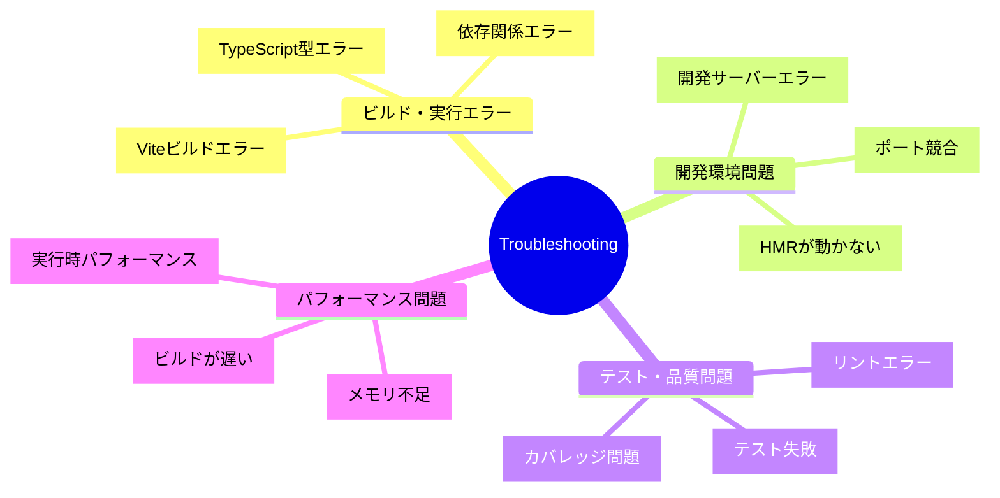

# トラブルシューティング

## 🧭 ナビゲーション

> **📍 現在位置**: [ホーム](../../README.md) → [リファレンス](../README.md) → **トラブルシューティング**
>
> **🎯 目標**: 開発中の全問題を即座解決
>
> **⏱️ 所要時間**: 30分（問題解決マスター）
>
> **📚 使用法**: 問題発生時の緊急参照・予防策確認

### 📋 緊急時クイックアクセス
- **🔥 高緊急度**: [プロジェクト停止レベル](#high-priority-issues)
- **⚡ 中緊急度**: [開発効率に影響](#medium-priority-issues)
- **🔧 低緊急度**: [最適化・改善](#low-priority-issues)

---

TypeScript Minecraftプロジェクトで発生する可能性のある問題と解決方法の完全ガイドです。

## 📋 問題カテゴリ



## 🚨 緊急度別問題解決

### 🔥 高緊急度（プロジェクト停止レベル）

| 問題 | 症状 | 解決方法 |
|-----|------|---------|
| [TypeScript型エラー](#typescript-type-errors) | `pnpm build` 失敗 | 型定義確認・tsconfig調整 |
| [依存関係エラー](#dependency-errors) | `pnpm install` 失敗 | キャッシュクリア・バージョン確認 |
| [開発サーバー起動失敗](#dev-server-errors) | `pnpm dev` 失敗 | ポート・権限・設定確認 |

### ⚡ 中緊急度（開発効率に影響）

| 問題 | 症状 | 解決方法 |
|-----|------|---------|
| [HMRが動かない](#hmr-issues) | ファイル変更が反映されない | Vite設定・ブラウザキャッシュ確認 |
| [テスト失敗](#test-failures) | `pnpm test` でエラー | テスト環境・モック確認 |
| [リントエラー](#lint-errors) | コード品質チェック失敗 | ESLint設定・ルール調整 |

### 🔧 低緊急度（最適化・改善）

| 問題 | 症状 | 解決方法 |
|-----|------|---------|
| [ビルドが遅い](#build-performance) | ビルド時間が長い | Vite設定最適化・依存関係見直し |
| [バンドルサイズが大きい](#bundle-size) | アプリケーションが重い | Tree-shaking・コード分割 |
| [メモリ使用量が多い](#memory-usage) | 開発中にメモリ不足 | Node.js設定・プロセス管理 |

## 🔍 問題診断フロー

### 1. 基本診断コマンド
```bash
# 全体的な健康状態チェック
pnpm check

# 依存関係の問題確認
npm ls --depth=0

# TypeScript設定確認
npx tsc --showConfig

# Vite設定確認
npx vite --debug
```

### 2. ログレベル設定
```bash
# デバッグ情報を詳細表示
DEBUG=* pnpm dev

# 特定モジュールのデバッグ
DEBUG=vite:* pnpm dev

# エラーのみ表示
LOG_LEVEL=error pnpm dev
```

## 🛠️ 具体的問題解決

### TypeScript型エラー {#typescript-type-errors}

#### よくある症状
```
error TS2345: Argument of type 'unknown' is not assignable to parameter of type 'Position'
error TS2322: Type 'string' is not assignable to type 'BlockType'
```

#### 解決手順

1. **型定義の確認**
   ```bash
   # TypeScript設定確認
   npm run type-check

   # より詳細な型エラー表示
   npx tsc --noEmit --pretty
   ```

2. **Effect-TS Schema使用時の型エラー**
   ```typescript
   // ❌ 問題のあるコード
   const position = { x: "1", y: 2, z: 3 }

   // ✅ 修正後
   const position = Schema.decodeUnknownSync(PositionSchema)({ x: 1, y: 2, z: 3 })
   ```

3. **Generic型の問題**
   ```typescript
   // ❌ 問題のあるコード
   const effect: Effect.Effect<unknown> = getPlayer()

   // ✅ 修正後
   const effect: Effect.Effect<Player, PlayerError> = getPlayer()
   ```

### 依存関係エラー {#dependency-errors}

#### よくある症状
```
npm ERR! peer dep missing: effect@^3.17.0, required by @effect/schema@^0.75.5
npm ERR! Could not resolve dependency
```

#### 解決手順

1. **キャッシュクリア**
   ```bash
   # npm キャッシュクリア
   npm cache clean --force

   # node_modules削除・再インストール
   rm -rf node_modules package-lock.json
   pnpm install
   ```

2. **バージョン競合解決**
   ```bash
   # 競合確認
   npm ls effect

   # 特定バージョンで固定
   pnpm add effect@3.17.13 --save-exact
   ```

3. **peer dependency解決**
   ```bash
   # peer dependency自動インストール
   # .npmrcに以下を追加してからインストール
   # public-hoist-pattern[]=*
   pnpm install
   ```

### 開発サーバーエラー {#dev-server-errors}

#### よくある症状
```
Error: listen EADDRINUSE: address already in use :::5173
Error: Permission denied
```

#### 解決手順

1. **ポート競合**
   ```bash
   # 使用中のポート確認
   lsof -ti:5173

   # プロセス終了
   kill -9 $(lsof -ti:5173)

   # 別ポートで起動
   PORT=3000 pnpm dev
   ```

2. **権限問題**
   ```bash
   # Node.js権限確認
   ls -la $(which node)

   # npm権限修正
   npm config set prefix '~/.npm-global'
   ```

### HMR問題 {#hmr-issues}

#### よくある症状
- ファイル変更がブラウザに反映されない
- Hot Module Replacementが動作しない

#### 解決手順

1. **Vite HMR設定確認**
   ```typescript
   // vite.config.ts
   export default defineConfig({
     server: {
       hmr: {
         overlay: true,  // エラーオーバーレイ表示
         port: 24678     // HMR専用ポート
       }
     }
   })
   ```

2. **ブラウザキャッシュクリア**
   ```bash
   # 強制リロード
   # Ctrl+Shift+R (Windows/Linux)
   # Cmd+Shift+R (Mac)

   # または開発者ツールで無効化
   ```

3. **ファイルウォッチング問題**
   ```bash
   # ファイルウォッチャー制限確認 (Linux)
   cat /proc/sys/fs/inotify/max_user_watches

   # 制限値を増加
   echo fs.inotify.max_user_watches=524288 | sudo tee -a /etc/sysctl.conf
   ```

### テスト失敗 {#test-failures}

#### よくある症状
```
TypeError: Cannot read properties of undefined
ReferenceError: window is not defined
Error: Module not found
```

#### 解決手順

1. **テスト環境設定確認**
   ```typescript
   // vitest.config.ts
   export default defineConfig({
     test: {
       environment: 'jsdom',  // ブラウザ環境シミュレーション
       globals: true,         // global APIの有効化
       setupFiles: ['./src/test/setup.ts']
     }
   })
   ```

2. **Effect-TS テストでのContext問題**
   ```typescript
   // テスト用Context設定
   const testLayer = Layer.mergeAll(
     TestContext.TestContext,
     MockWorldService
   )

   const runTest = (effect) =>
     Effect.runSync(Effect.provide(effect, testLayer))
   ```

3. **非同期テストのタイムアウト**
   ```typescript
   // タイムアウト時間延長
   test('async operation', async () => {
     // テストコード
   }, 10000)  // 10秒タイムアウト
   ```

### リントエラー {#lint-errors}

#### よくある症状
```
error: 'any' type is not allowed
error: Unexpected use of 'class'
warning: 'console.log' is not allowed in production
```

#### 解決手順

1. **OXLint設定調整**
   ```json
   // .oxlintrc.json
   {
     "rules": {
       "no-any": "warn",
       "no-console": ["error", { "allow": ["warn", "error"] }]
     }
   }
   ```

2. **Effect-TS規約違反**
   ```typescript
   // ❌ クラスの使用
   interface PlayerService {}

   // ✅ Schema.Struct + Context使用
   const PlayerService = Context.GenericTag<PlayerService>()
   const PlayerServiceLive = Layer.succeed(PlayerService, {})
   ```

3. **自動修正可能なエラー**
   ```bash
   # 自動修正実行
   pnpm lint:fix

   # Prettierとの統合修正
   pnpm format
   ```

## 🔧 高度なトラブルシューティング

### デバッグ技術

#### 1. TypeScriptデバッグ
```bash
# 型情報の詳細確認
npx tsc --noEmit --listFiles

# 型解決過程の表示
npx tsc --noEmit --traceResolution
```

#### 2. Viteデバッグ
```bash
# Vite内部ログ表示
DEBUG=vite:* pnpm dev

# 依存関係プリバンドルの確認
rm -rf node_modules/.vite && DEBUG=vite:deps pnpm dev
```

#### 3. テストデバッグ
```bash
# テストデバッグモード
pnpm test -- --inspect-brk

# 特定テストのみ実行
pnpm test -- --grep "PlayerService"
```

### パフォーマンス分析

#### 1. ビルドパフォーマンス {#build-performance}
```bash
# ビルド時間測定
time pnpm build

# バンドル分析
pnpm build && npx vite-bundle-analyzer

# 依存関係分析
npx madge --circular src/
```

#### 2. メモリ使用量 {#memory-usage}
```bash
# Node.jsメモリ制限増加
NODE_OPTIONS="--max-old-space-size=4096" pnpm build

# メモリ使用量監視
node --trace-gc script.js
```

#### 3. バンドルサイズ {#bundle-size}
```typescript
// vite.config.ts - コード分割
export default defineConfig({
  build: {
    rollupOptions: {
      output: {
        manualChunks: {
          'effect': ['effect', '@effect/schema'],
          'three': ['three'],
          'utils': ['uuid', 'alea']
        }
      }
    }
  }
})
```

## 📊 問題パターン分析

### 頻出問題ランキング

| 順位 | 問題 | 発生頻度 | 解決時間 |
|------|------|---------|---------|
| 1 | TypeScript型エラー | 40% | 5-15分 |
| 2 | 依存関係バージョン競合 | 25% | 10-30分 |
| 3 | Vite設定問題 | 15% | 5-20分 |
| 4 | テスト環境設定 | 10% | 10-40分 |
| 5 | リント設定競合 | 10% | 5-10分 |

### 環境別問題

| 環境 | よくある問題 | 対処法 |
|------|-------------|--------|
| Windows | パス区切り文字問題 | path.posix使用 |
| macOS | Node.js権限問題 | nvm使用推奨 |
| Linux | ファイルウォッチ制限 | inotify制限値増加 |
| Docker | ボリュームマウント問題 | node_modules除外 |

## 🚨 予防策

### 開発環境セットアップ

1. **推奨Node.jsバージョン**
   ```bash
   # .nvmrcファイル作成
   echo "20" > .nvmrc

   # Node.jsバージョン固定
   nvm use
   ```

2. **エディター設定**
   ```json
   // エディタ設定ファイルの例
   {
     "typescript.preferences.importModuleSpecifier": "relative",
     "editor.codeActionsOnSave": {
       "source.fixAll.oxlint": true
     }
   }
   ```

3. **Git hooks設定**
   ```bash
   # pre-commitフックで品質チェック
   npx husky add .husky/pre-commit "pnpm check"
   ```

### 監視・アラート

```typescript
// パフォーマンス監視
const performanceObserver = new PerformanceObserver((list) => {
  const entries = list.getEntries()
  entries.forEach((entry) => {
    if (entry.duration > 100) {
      console.warn(`Slow operation detected: ${entry.name}`)
    }
  })
})

performanceObserver.observe({ entryTypes: ['function'] })
```

## 🔗 関連リソース

- [CLI Commands](../cli-commands/README.md) - トラブルシューティング用コマンド
- [Configuration](../configuration/README.md) - 設定関連問題の解決
- [API Reference](../api-reference/README.md) - API使用時の問題解決

## 📞 サポート情報

### 問題報告テンプレート

```markdown
## 問題の概要
[問題の簡潔な説明]

## 環境情報
- OS: [Windows/macOS/Linux]
- Node.js: [バージョン]
- npm: [バージョン]

## 再現手順
1. [手順1]
2. [手順2]
3. [手順3]

## 期待される動作
[期待していた結果]

## 実際の動作
[実際に発生した結果]

## エラーメッセージ
```
[エラーメッセージやスタックトレース]
```

## 試した解決策
[既に試した対処法]
```
