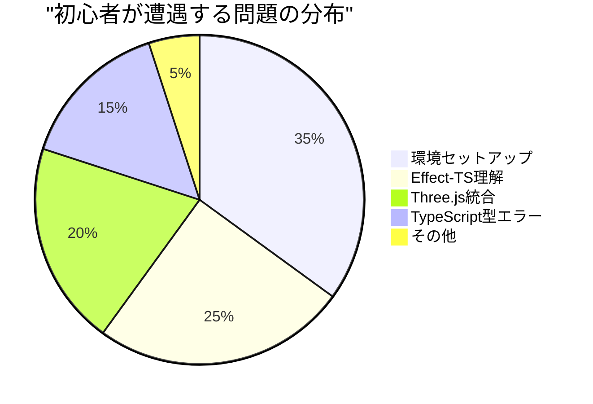

# 🛠️ 初心者向けトラブルシューティング - よくある問題と解決策

## 🎯 このガイドの目的

**即座に問題解決**: 開発中につまづきやすいポイントを事前に把握し、効率的に解決

**学習の継続性**: トラブルで学習が止まらないよう、段階的な解決方法を提供

## 📊 問題発生パターン分析



## 🚨 Section 1: 環境セットアップ問題（35%）

### 問題1: `npm install`でエラーが発生する

**症状**:
```bash
❌ npm ERR! peer dep missing: typescript@>=5.0.0
❌ npm ERR! network timeout at: https://registry.npmjs.org/
```

**原因と解決法**:

<details>
<summary>🔧 解決方法A: 依存関係の問題</summary>

```bash
# 1. npm キャッシュクリア
npm cache clean --force

# 2. node_modules削除
rm -rf node_modules package-lock.json

# 3. 最新のTypeScriptを先にインストール
npm install -g typescript@latest

# 4. 再インストール
npm install
```

**理由**: peer dependencyの版数不整合が原因

</details>

<details>
<summary>🔧 解決方法B: ネットワークの問題</summary>

```bash
# 1. レジストリ設定確認
npm config get registry

# 2. デフォルトレジストリに戻す
npm config set registry https://registry.npmjs.org/

# 3. または日本のミラーを使用
npm config set registry https://registry.npmmirror.com/

# 4. タイムアウト時間を延長
npm config set timeout 60000
```

**理由**: ネットワーク接続やプロキシ設定の問題

</details>

**予防策**:
- Node.js 18.x以上を使用
- npm 9.x以上にアップデート: `npm install -g npm@latest`

### 問題2: 開発サーバーが起動しない

**症状**:
```bash
❌ Error: listen EADDRINUSE: address already in use :::5173
❌ TypeError: Cannot read property 'vite' of undefined
```

**即座に試す解決法**:

```bash
# ポートが使用中の場合
lsof -ti:5173 | xargs kill -9  # Macの場合
netstat -ano | findstr :5173    # Windowsの場合

# 別のポートを使用
npm run dev -- --port 3000

# プロセス全体をリセット
pkill -f vite
npm run dev
```

**根本的解決**:
```json
// package.json での設定
{
  "scripts": {
    "dev": "vite --port 3000 --host 0.0.0.0"
  }
}
```

## ⚡ Section 2: Effect-TS理解問題（25%）

### 問題3: `yield*`の意味がわからない

**よくある混乱**:
```typescript
// ❌ 間違った理解
const result = getUser(id)           // これはPromise<User>？
const user = await getUser(id)       // こう書けば良い？

// ✅ 正しい理解
const user = yield* getUser(id)      // Effect型を展開してUser型を取得
```

**段階的理解法**:

<details>
<summary>📚 Step 1: 基本概念</summary>

```typescript
// Effect は「将来実行される処理の設計図」
const getUserEffect: Effect<User, UserNotFound, UserService> = getUser(id)

// yield* は「設計図を実行して結果を取り出す」操作
const user: User = yield* getUserEffect

// 通常の関数との比較
function normalFunction() {
  return "結果"  // 即座に値を返す
}

const effectFunction = Effect.succeed("結果")  // 実行計画を返す
```

</details>

<details>
<summary>📚 Step 2: 実践パターン</summary>

```typescript
// パターン1: 単純な値取得
const getPlayerName = (id: string) => Effect.gen(function* () {
  const player = yield* findPlayer(id)  // Player型を取得
  return player.name                     // string型を返す
})

// パターン2: エラーハンドリング付き
const safeGetPlayerName = (id: string) => Effect.gen(function* () {
  const player = yield* findPlayer(id).pipe(
    Effect.catchTag("PlayerNotFound", () =>
      Effect.succeed({ name: "Unknown Player" })
    )
  )
  return player.name
})

// パターン3: 複数の副作用合成
const updatePlayerStats = (id: string, stats: Stats) => Effect.gen(function* () {
  const player = yield* findPlayer(id)
  const updated = yield* updateStats(player, stats)
  yield* savePlayer(updated)
  yield* logUpdate(player.name, stats)
  return updated
})
```

</details>

**実践的覚え方**:
1. `Effect.gen(function* () { ... })` で始める
2. 副作用のある処理は `yield*` を付ける
3. 普通の値はそのまま使う

### 問題4: エラーハンドリングがわからない

**典型的な混乱**:
```typescript
// ❌ try-catchを使おうとする
try {
  const result = yield* dangerousOperation()
} catch (error) {
  // これは動作しません
}

// ✅ Effect.catchTagを使う
const result = yield* dangerousOperation().pipe(
  Effect.catchTag("OperationFailed", (error) =>
    Effect.succeed(defaultValue)
  )
)
```

**エラーハンドリングパターン集**:

<details>
<summary>🔧 基本的なエラー処理</summary>

```typescript
// パターン1: 特定エラーをキャッチ
const safeDivide = (a: number, b: number) =>
  b === 0
    ? Effect.fail(new DivisionByZero())
    : Effect.succeed(a / b)

const calculate = Effect.gen(function* () {
  const result = yield* safeDivide(10, 0).pipe(
    Effect.catchTag("DivisionByZero", () => Effect.succeed(0))
  )
  return result  // 0
})

// パターン2: 複数エラータイプの処理
const processUser = (id: string) => Effect.gen(function* () {
  return yield* getUser(id).pipe(
    Effect.catchTag("UserNotFound", () =>
      Effect.succeed(createGuestUser())
    ),
    Effect.catchTag("DatabaseError", () =>
      Effect.fail(new ServiceUnavailable())
    )
  )
})
```

</details>

<details>
<summary>🔧 高度なエラー処理</summary>

```typescript
// パターン3: リトライ機能付き
const robustOperation = Effect.gen(function* () {
  return yield* unstableOperation().pipe(
    Effect.retry(Schedule.exponential("100 millis").pipe(
      Schedule.compose(Schedule.recurs(3))
    )),
    Effect.catchAll(() => Effect.succeed("フォールバック値"))
  )
})

// パターン4: エラー変換
const apiCall = Effect.gen(function* () {
  return yield* httpRequest("/api/data").pipe(
    Effect.mapError((httpError) =>
      new ApplicationError({
        message: "API呼び出しに失敗しました",
        cause: httpError
      })
    )
  )
})
```

</details>

## 🎨 Section 3: Three.js統合問題（20%）

### 問題5: ブロックが表示されない

**チェックリスト方式で診断**:

```typescript
// デバッグ用チェック関数
const diagnoseRenderingIssue = Effect.gen(function* () {
  console.log("🔍 レンダリング問題診断開始")

  // チェック1: レンダラーの初期化
  const renderer = yield* getRenderer()
  console.log("✅ レンダラー:", renderer ? "OK" : "❌ NG")

  // チェック2: シーンの存在
  const scene = yield* getScene()
  console.log("✅ シーン:", scene ? "OK" : "❌ NG")
  console.log(`  - オブジェクト数: ${scene.children.length}`)

  // チェック3: カメラの位置
  const camera = yield* getCamera()
  console.log("✅ カメラ位置:", camera.position)
  console.log("✅ カメラ向き:", camera.rotation)

  // チェック4: ライティング
  const lights = scene.children.filter(child => child instanceof THREE.Light)
  console.log("✅ ライト数:", lights.length)

  // チェック5: メッシュの詳細
  scene.children.forEach((child, index) => {
    if (child instanceof THREE.Mesh) {
      console.log(`  メッシュ${index}:`)
      console.log(`    位置: (${child.position.x}, ${child.position.y}, ${child.position.z})`)
      console.log(`    表示: ${child.visible}`)
      console.log(`    マテリアル: ${child.material.type}`)
    }
  })
})
```

**よくある原因と解決法**:

<details>
<summary>🔧 カメラ位置の問題</summary>

```typescript
// ❌ 問題: カメラがブロック内部にある
camera.position.set(0, 0, 0)  // ブロックと同じ位置

// ✅ 解決: カメラを適切な位置に配置
camera.position.set(5, 5, 5)   // ブロックから離す
camera.lookAt(0, 0, 0)         // ブロックを見る方向

// 💡 デバッグ用: カメラの位置を可視化
const cameraHelper = new THREE.CameraHelper(camera)
scene.add(cameraHelper)
```

</details>

<details>
<summary>🔧 ライティングの問題</summary>

```typescript
// ❌ 問題: ライトがない（真っ暗）
// 何も設定しない状態

// ✅ 解決: 基本的なライティング設定
const setupLighting = Effect.gen(function* () {
  const scene = yield* getScene()

  // 環境光（全体的な明るさ）
  const ambientLight = new THREE.AmbientLight(0x404040, 0.4)
  scene.add(ambientLight)

  // 指向性光（太陽光のような光）
  const directionalLight = new THREE.DirectionalLight(0xffffff, 0.8)
  directionalLight.position.set(10, 10, 5)
  scene.add(directionalLight)

  console.log("✅ ライティング設定完了")
})
```

</details>

<details>
<summary>🔧 メッシュ作成の問題</summary>

```typescript
// ❌ 問題: メッシュが正しく作成されていない
const createBrokenBlock = () => {
  const geometry = new THREE.BoxGeometry(1, 1, 1)
  // マテリアルなし！
  const mesh = new THREE.Mesh(geometry)  // 表示されない
  return mesh
}

// ✅ 解決: 完全なメッシュ作成
const createBlock = (blockType: BlockType) => Effect.gen(function* () {
  const geometry = new THREE.BoxGeometry(1, 1, 1)

  // マテリアルを正しく作成
  const material = new THREE.MeshLambertMaterial({
    color: getBlockColor(blockType)
  })

  const mesh = new THREE.Mesh(geometry, material)

  // デバッグ情報を付与
  mesh.userData = {
    blockType,
    createdAt: Date.now(),
    debug: true
  }

  console.log(`✅ ブロック作成: ${blockType}`)
  return mesh
})
```

</details>

### 問題6: パフォーマンスが悪い（フレームレート低下）

**段階的最適化アプローチ**:

```typescript
// Phase 1: 問題の測定
const performanceMonitor = Effect.gen(function* () {
  let frameCount = 0
  let lastTime = performance.now()

  const measureFPS = () => {
    frameCount++
    const currentTime = performance.now()

    if (currentTime - lastTime >= 1000) {
      const fps = frameCount
      console.log(`🎯 FPS: ${fps}`)

      if (fps < 30) {
        console.warn("⚠️  パフォーマンス低下を検出")
        yield* diagnosePerformanceIssues()
      }

      frameCount = 0
      lastTime = currentTime
    }
  }

  return measureFPS
})

// Phase 2: パフォーマンス診断
const diagnosePerformanceIssues = Effect.gen(function* () {
  const scene = yield* getScene()
  const renderer = yield* getRenderer()

  console.log("🔍 パフォーマンス診断:")
  console.log(`  - メッシュ数: ${scene.children.length}`)
  console.log(`  - 三角形数: ${calculateTriangleCount(scene)}`)
  console.log(`  - テクスチャメモリ: ${calculateTextureMemory(scene)}MB`)

  // GPUメモリ使用量（WebGLコンテキストから）
  const gl = renderer.getContext()
  const info = renderer.info
  console.log(`  - 描画コール数: ${info.render.calls}`)
  console.log(`  - GPU三角形数: ${info.render.triangles}`)
})

// Phase 3: 最適化実行
const optimizePerformance = Effect.gen(function* () {
  // 1. 不要なメッシュを削除
  yield* removeInvisibleMeshes()

  // 2. テクスチャサイズを最適化
  yield* optimizeTextures()

  // 3. インスタンス化でメッシュを統合
  yield* enableInstancedRendering()

  console.log("✅ パフォーマンス最適化完了")
})
```

## 🔤 Section 4: TypeScript型エラー問題（15%）

### 問題7: Schema検証エラーが理解できない

**よくあるエラーメッセージの解読**:

```typescript
// ❌ エラーメッセージ例
// Type 'Effect<never, ParseError, never>' is not assignable to type 'Effect<User, UserError, UserService>'
//   Types of property '_E' are incompatible.

// 🔍 原因の特定方法
const debugSchemaValidation = Effect.gen(function* () {
  const rawData = { name: "Player1", age: "25" }  // ageが文字列！

  // Step 1: スキーマ定義を確認
  const UserSchema = Schema.Struct({
    name: Schema.String,
    age: Schema.Number  // 数値を期待
  })

  // Step 2: 段階的にデバッグ
  console.log("📝 生データ:", rawData)

  try {
    const user = yield* Schema.decodeUnknown(UserSchema)(rawData)
    console.log("✅ 検証成功:", user)
  } catch (error) {
    console.log("❌ 検証失敗:", error)

    // Step 3: フィールド単位で確認
    console.log("🔍 フィールド別チェック:")
    console.log("  name:", typeof rawData.name, "✅")
    console.log("  age:", typeof rawData.age, "❌ 文字列が渡されています")
  }
})
```

**型安全なパターン集**:

<details>
<summary>🔧 基本的なSchema使用法</summary>

```typescript
// パターン1: 基本的な型定義
const PlayerSchema = Schema.Struct({
  id: Schema.String.pipe(Schema.brand("PlayerId")),
  name: Schema.String.pipe(Schema.nonEmpty()),
  level: Schema.Number.pipe(Schema.int(), Schema.between(1, 100)),
  position: Schema.Struct({
    x: Schema.Number,
    y: Schema.Number,
    z: Schema.Number
  })
})

// パターン2: オプショナルフィールド
const BlockSchema = Schema.Struct({
  type: Schema.Literal("stone", "grass", "dirt"),
  position: PositionSchema,
  metadata: Schema.optional(Schema.Record(Schema.String, Schema.Unknown))
})

// パターン3: Union型（複数の可能性）
const GameEventSchema = Schema.Union(
  Schema.Struct({ type: Schema.Literal("player_move"), playerId: Schema.String }),
  Schema.Struct({ type: Schema.Literal("block_place"), position: PositionSchema }),
  Schema.Struct({ type: Schema.Literal("chat_message"), message: Schema.String })
)
```

</details>

### 問題8: Context依存注入でエラー

**典型的なエラーと解決**:

```typescript
// ❌ よくあるエラー
// Argument of type 'Effect<string, never, PlayerService>'
// is not assignable to parameter of type 'Effect<string, never, never>'

// 🔍 原因: サービス依存が解決されていない
const brokenFunction = Effect.gen(function* () {
  // PlayerServiceに依存するが、提供されていない
  const player = yield* PlayerService.getPlayer("123")
  return player.name
})

// ✅ 解決: 依存性を明示的に解決
const correctFunction = Effect.gen(function* () {
  const playerService = yield* PlayerService
  const player = yield* playerService.getPlayer("123")
  return player.name
})

// または、Layerで一括解決
const mainProgram = correctFunction.pipe(
  Effect.provide(PlayerServiceLive)
)
```

## 🎯 Section 5: 予防的デバッグテクニック

### デバッグ環境の構築

```typescript
// 統合デバッグシステム
const createDebugEnvironment = Effect.gen(function* () {
  // 1. ログレベル設定
  const logger = yield* Logger.make({
    logLevel: "debug",
    format: "pretty"
  })

  // 2. パフォーマンス監視
  const perfMonitor = yield* createPerformanceMonitor()

  // 3. エラートラッキング
  const errorTracker = yield* createErrorTracker()

  // 4. 開発者ツール統合
  if (typeof window !== "undefined") {
    (window as any).debugMinecraft = {
      getSceneInfo: () => analyzeScene(),
      checkPerformance: () => perfMonitor.report(),
      getErrorHistory: () => errorTracker.getHistory()
    }
  }

  return { logger, perfMonitor, errorTracker }
})
```

### 自動テストによる問題予防

```typescript
// 基本機能の自動テスト
const runBasicTests = Effect.gen(function* () {
  console.log("🧪 基本機能テスト実行中...")

  // テスト1: ブロック作成・配置
  yield* testBlockOperations()

  // テスト2: レンダリング機能
  yield* testRenderingSystem()

  // テスト3: エラーハンドリング
  yield* testErrorHandling()

  console.log("✅ すべてのテストが通過しました")
})

const testBlockOperations = Effect.gen(function* () {
  const position = { x: 0, y: 0, z: 0 }

  // 正常系
  yield* placeBlock(position, "stone")
  const placedBlock = yield* getBlockAt(position)

  if (placedBlock?.type !== "stone") {
    return yield* Effect.fail(new TestError("ブロック配置テストが失敗"))
  }

  // エラー系
  const result = yield* placeBlock(position, "grass").pipe(
    Effect.either
  )

  if (result._tag !== "Left") {
    return yield* Effect.fail(new TestError("重複配置エラーテストが失敗"))
  }

  console.log("✅ ブロック操作テスト完了")
})
```

## 🔗 サポートリソース

### 学習リソース

1. **Effect-TS公式**: [https://effect.website/](https://effect.website/)
2. **Three.js公式**: [https://threejs.org/docs/](https://threejs.org/docs/)
3. **TypeScript Handbook**: [https://www.typescriptlang.org/docs/](https://www.typescriptlang.org/docs/)

### コミュニティサポート

- **Discord**: Effect-TS Community（英語）
- **GitHub Issues**: プロジェクト固有の問題報告
- **Stack Overflow**: `effect-ts`、`three.js`、`typescript`タグ

### 緊急時の対処法

```bash
# 1. 完全な環境リセット
rm -rf node_modules package-lock.json
npm cache clean --force
npm install

# 2. 開発サーバーの完全リスタート
pkill -f vite
pkill -f typescript
npm run dev

# 3. ブラウザキャッシュクリア
# DevTools > Application > Storage > Clear site data
```

## 📋 問題解決チェックリスト

### 問題発生時の行動順序

1. **[ ]** エラーメッセージを正確にコピー
2. **[ ]** 直前に変更した内容を確認
3. **[ ]** ブラウザのコンソールをチェック
4. **[ ]** 該当セクションの解決法を試行
5. **[ ]** デバッグコードを追加して状況確認
6. **[ ]** 最小再現例を作成
7. **[ ]** コミュニティに質問（必要に応じて）

---

**🎯 Troubleshooting Goal**: 問題に遭遇しても、15分以内に解決の糸口を見つけられる力を身につける ✅