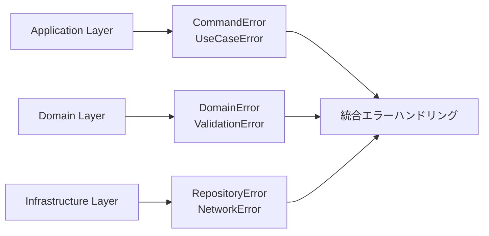

# エラー解決ガイド - 体系的なTypeScriptエラー診断と修正

## 🎯 Quick Guide（5分で問題解決）

### エラー診断フロー
```mermaid
flowchart TD
    A[コンパイルエラー発生] --> B{エラーカテゴリ判定}
    B -->|Schema関連| C[Schema検証エラー]
    B -->|Service関連| D[Context.GenericTagエラー]
    B -->|Pattern Matching| E[Match式エラー]
    B -->|型推論失敗| F[早期リターンエラー]
    B -->|副作用混入| G[純粋関数エラー]

    C --> H[Schema.decodeUnknownで修正]
    D --> I[@app/ServiceNameパターンで修正]
    E --> J[Match.exhaustiveで修正]
    F --> K[yield*で早期リターン修正]
    G --> L[Effect分離で修正]
```

### 緊急対応チェックリスト
- [ ] **型チェック実行**: `pnpm typecheck` でエラー確認
- [ ] **エラー分類**: Schema / Service / Match / 早期リターン / 副作用
- [ ] **該当パターン適用**: 下記解決パターンから選択
- [ ] **レイヤー固有対応**: Application / Domain / Infrastructure
- [ ] **テスト実行**: `pnpm test` で動作確認

---

## 📋 Problem Statement

TypeScript Minecraftプロジェクトでは、Effect-TS 3.17+への移行とDDDアーキテクチャ導入により、従来のTypeScript開発とは異なる型エラーパターンが発生します。

### 主要課題
1. **Schema検証エラー**: 動的バリデーションでの型安全性確保
2. **Service型不整合**: Context.GenericTag使用での型推論問題
3. **Pattern Matching**: Match.exhaustiveでの網羅性保証
4. **Effect型推論**: 早期リターンパターンでの型推論失敗
5. **副作用分離**: 純粋関数とEffect操作の境界管理

---

## 🔧 Solution Approach

### 1. レイヤー別エラー戦略


### 2. エラー診断マトリクス
| エラーパターン | 症状 | 診断方法 | 優先度 |
|---------------|------|--------|---------|
| Schema検証 | `Type 'unknown' is not assignable` | Schema.decodeUnknown確認 | 🔥 高 |
| Context.GenericTag | `Property does not exist` | @app/ServiceNameパターン確認 | 🔥 高 |
| Match式網羅 | `Not all code paths return` | Match.exhaustive確認 | ⚠️ 中 |
| 早期リターン | `Type inference failed` | yield*パターン確認 | ⚠️ 中 |
| 副作用混入 | `Pure function side effect` | Effect分離確認 | 💡 低 |

---

## 📖 Step-by-Step Resolution Guide

## 現在のエラー状況

### エラー分類

プロジェクトにおける主要なTypeScriptエラーは以下のカテゴリに分類されます：

1. **Schema検証エラー** - Schema.Structとバリデーション関連の不整合
2. **Context.GenericTag型エラー** - "@app/ServiceName"パターンの型不一致
3. **Match式の網羅性エラー** - Match.exhaustiveの型安全性
4. **早期リターンパターンエラー** - 条件分岐での型推論問題
5. **純粋関数の副作用エラー** - Effect分離での型不整合

## 一般的なエラーパターンと解決方法

### 1. Schema検証エラーの解決

#### エラーパターン
```typescript
// ❌ エラー: Schema.Structの型不一致（Data.structは廃止パターン）
// const UserData = Data.struct<{ name: string; age: number }>({
//   name: "",
//   age: 0
// })

// ✅ 正しいパターン: Schema.Structを使用
const UserDataSchema = Schema.Struct({
  name: Schema.String,
  age: Schema.Number
})
type UserData = Schema.Schema.Type<typeof UserDataSchema>

const validateUser = (input: unknown): Effect.Effect<UserData, ValidationError> =>
  Schema.decodeUnknown(UserDataSchema)(input)
    .pipe(Effect.mapError(error => new ValidationError({ cause: error })))
```

#### 解決方法
```typescript
// ✅ 正しい: Schema.Structによる安全なバリデーション
const UserSchema = Schema.Struct({
  name: Schema.String,
  age: Schema.Number.pipe(Schema.int(), Schema.positive())
})

type User = Schema.Schema.Type<typeof UserSchema>

const ValidationError = Schema.Struct({
  _tag: Schema.Literal("ValidationError"),
  message: Schema.String,
  field: Schema.optional(Schema.String)
})

type ValidationError = Schema.Schema.Type<typeof ValidationError>

const validateUser = (input: unknown): Effect.Effect<User, ValidationError> =>
  Schema.decodeUnknownEither(UserSchema)(input).pipe(
    Effect.mapError(error => ({
      _tag: "ValidationError" as const,
      message: "User validation failed",
      field: error.path?.toString()
    }))
  )
```

### 2. Context.GenericTagパターンの型エラー

#### エラーパターン
```typescript
// ❌ エラー: 古いContext.Tag使用パターン
const ServiceTag = Context.Tag<ServiceInterface>()

export const ServiceLive: Layer.Layer<ServiceInterface> = Layer.effect(
  ServiceTag,
  Effect.succeed({
    // プロパティが不足
  })
)
```

#### 解決方法
```typescript
// ✅ 正しい: "@app/ServiceName"パターンで型安全なService定義
interface GameServiceInterface {
  readonly startGame: (config: GameConfig) => Effect.Effect<void, GameError>
  readonly stopGame: () => Effect.Effect<void, never>
  readonly getState: () => Effect.Effect<GameState, never>
}

const GameService = Context.GenericTag<GameServiceInterface>("@app/GameService")

// ゲームエラースキーマ定義
const GameError = Schema.Struct({
  _tag: Schema.Literal("GameError"),
  message: Schema.String,
  code: Schema.String,
  timestamp: Schema.DateTimeUtc,
  context: Schema.optional(Schema.Record(Schema.String, Schema.Unknown))
})

type GameError = Schema.Schema.Type<typeof GameError>

const createGameError = (message: string, code: string, context?: Record<string, unknown>): GameError => ({
  _tag: "GameError",
  message,
  code,
  timestamp: new Date().toISOString(),
  context
})

const makeGameServiceLive = Effect.gen(function* () {
  const worldService = yield* WorldService
  const playerService = yield* PlayerService

  return GameService.of({
    startGame: (config) => Effect.gen(function* () {
      // 早期リターン: 設定検証
      if (!config.worldConfig) {
        return yield* Effect.fail(
          createGameError(
            "World config is required",
            "MISSING_WORLD_CONFIG",
            { providedConfig: config }
          )
        )
      }

      // バリデーションの強化
      const validConfig = yield* Schema.decodeUnknownEither(WorldConfigSchema)(config.worldConfig).pipe(
        Effect.mapError(parseError =>
          createGameError(
            "Invalid world config format",
            "INVALID_WORLD_CONFIG",
            { parseError: parseError.message }
          )
        )
      )

      yield* worldService.initialize(validConfig)
      yield* playerService.spawn(config.playerConfig)
    }),

    stopGame: () => Effect.gen(function* () {
      yield* worldService.cleanup()
      yield* playerService.despawn()
    }),

    getState: () => Effect.gen(function* () {
      const [worldState, playerState] = yield* Effect.all([
        worldService.getState(),
        playerService.getState()
      ])
      return { world: worldState, player: playerState }
    })
  })
})

const GameServiceLive = Layer.effect(GameService, makeGameServiceLive)
```

### 3. Match式の網羅性エラー

#### エラーパターン
```typescript
// ❌ エラー: switch文での型安全性不足
const handleAction = (action: GameAction): Effect.Effect<void> => {
  switch (action.type) {
    case "MOVE":
      return handleMove(action)
    case "ATTACK":
      return handleAttack(action)
    // 他のケースが漏れている
  }
}
```

#### 解決方法
```typescript
// ✅ 正しい: Match.exhaustiveによる網羅性保証
import { Match } from "effect"

type GameAction =
  | { readonly _tag: "Move"; readonly direction: Direction; readonly playerId: string }
  | { readonly _tag: "Attack"; readonly target: EntityId; readonly playerId: string }
  | { readonly _tag: "UseItem"; readonly item: ItemId; readonly playerId: string }

const handleAction = (action: GameAction): Effect.Effect<void, GameError> =>
  Match.value(action).pipe(
    Match.tag("Move", ({ direction, playerId }) =>
      Effect.gen(function* () {
        // 早期リターン: プレイヤー検証
        const playerResult = yield* findPlayer(playerId).pipe(Effect.either)
        if (Either.isLeft(playerResult)) {
          return yield* Effect.fail(
            createGameError(
              "Player not found",
              "PLAYER_NOT_FOUND",
              { playerId, requestedAction: "move" }
            )
          )
        }

        const player = playerResult.right

        // 方向のバリデーション
        const validDirection = yield* validateDirection(direction).pipe(
          Effect.mapError(() =>
            createGameError(
              "Invalid movement direction",
              "INVALID_DIRECTION",
              { direction, playerId }
            )
          )
        )

        yield* movePlayer(player, validDirection)
      })
    ),
    Match.tag("Attack", ({ target, playerId }) =>
      handleAttack(target, playerId).pipe(
        Effect.mapError(error =>
          createGameError(
            "Attack action failed",
            "ATTACK_FAILED",
            { target, playerId, originalError: error }
          )
        )
      )
    ),
    Match.tag("UseItem", ({ item, playerId }) =>
      handleUseItem(item, playerId).pipe(
        Effect.mapError(error =>
          createGameError(
            "Item usage failed",
            "ITEM_USE_FAILED",
            { item, playerId, originalError: error }
          )
        )
      )
    ),
    Match.exhaustive // コンパイル時に全ケース網羅を保証
  )
```

### 4. 早期リターンパターンの型推論エラー

#### エラーパターン
```typescript
// ❌ エラー: 条件分岐での型推論が失敗
const processData = (input: unknown): Effect.Effect<ProcessedData, ValidationError> => {
  if (!input) {
    return Effect.fail(new ValidationError({ message: "Input is required" })) // 型エラー
  }

  // 処理続行
  return Effect.succeed(processInput(input))
}
```

#### 解決方法
```typescript
// ✅ 正しい: 早期リターンでのyield*使用
// ValidationErrorスキーマ定義
const ValidationError = Schema.Struct({
  _tag: Schema.Literal("ValidationError"),
  message: Schema.String,
  field: Schema.optional(Schema.String),
  value: Schema.optional(Schema.Unknown),
  errors: Schema.optional(Schema.Array(Schema.String)),
  timestamp: Schema.DateTimeUtc
})

type ValidationError = Schema.Schema.Type<typeof ValidationError>

const createValidationError = (
  message: string,
  field?: string,
  value?: unknown,
  errors?: string[]
): ValidationError => ({
  _tag: "ValidationError",
  message,
  field,
  value,
  errors,
  timestamp: new Date().toISOString()
})

const processData = (input: unknown): Effect.Effect<ProcessedData, ValidationError> =>
  Effect.gen(function* () {
    // 早期リターン: 入力検証
    if (!input) {
      return yield* Effect.fail(
        createValidationError(
          "Input is required",
          "input",
          input
        )
      )
    }

    // 型ガードでの安全な処理
    if (typeof input !== "object" || input === null) {
      return yield* Effect.fail(
        createValidationError(
          "Input must be an object",
          "input",
          input,
          [`Expected object, got ${typeof input}`]
        )
      )
    }

    // Schemaバリデーションでの安全な処理
    const validatedInput = yield* Schema.decodeUnknownEither(ProcessDataSchema)(input).pipe(
      Effect.mapError(parseError =>
        createValidationError(
          "Input validation failed",
          parseError.path?.toString(),
          input,
          [parseError.message]
        )
      )
    )

    // バリデーション済みデータでの処理続行
    return yield* processValidInput(validatedInput)
  })
```

### 5. 純粋関数の副作用分離エラー

#### エラーパターン
```typescript
// ❌ エラー: 純粋関数内での副作用
const calculateDistance = (from: Position, to: Position): number => {
  console.log("Calculating distance") // 副作用が混入
  return Math.sqrt((to.x - from.x) ** 2 + (to.y - from.y) ** 2)
}
```

#### 解決方法
```typescript
// ✅ 正しい: 純粋関数とEffect操作の分離
const calculateDistance = (from: Position, to: Position): number =>
  Math.sqrt((to.x - from.x) ** 2 + (to.y - from.y) ** 2)

const calculateDistanceWithLogging = (
  from: Position,
  to: Position
): Effect.Effect<number, never> =>
  Effect.gen(function* () {
    yield* Effect.log("Calculating distance")
    const distance = calculateDistance(from, to)
    yield* Effect.log(`Distance calculated: ${distance}`)
    return distance
  })
```

## レイヤー別エラー解決戦略

### Application Layer

Application層では、ユースケースとハンドラーのエラー型を適切に管理する必要があります：

```typescript
// Command Handler の正しい実装パターン
interface CommandHandlersInterface {
  readonly handlePlayerMovement: (command: PlayerMovementCommand) => Effect.Effect<void, CommandError>
  readonly handleBlockInteraction: (command: BlockInteractionCommand) => Effect.Effect<void, CommandError>
}

const CommandHandlers = Context.GenericTag<CommandHandlersInterface>("@app/CommandHandlers")

// コマンドエラースキーマ
const CommandError = Schema.Struct({
  _tag: Schema.Literal("CommandError"),
  commandType: Schema.String,
  message: Schema.String,
  cause: Schema.optional(Schema.Unknown),
  timestamp: Schema.DateTimeUtc
})

type CommandError = Schema.Schema.Type<typeof CommandError>

const makeCommandHandlersLive = Effect.gen(function* () {
  const playerMoveUseCase = yield* PlayerMoveUseCase
  const blockPlaceUseCase = yield* BlockPlaceUseCase

  return CommandHandlers.of({
    handlePlayerMovement: (command) => Effect.gen(function* () {
      yield* Effect.log(`Handling player movement command: ${command.playerId}`)

      yield* playerMoveUseCase.execute(command).pipe(
        Effect.catchTags({
          EntityNotFoundError: (error) => Effect.gen(function* () {
            yield* Effect.logWarning(`Entity not found: ${error.entityId}`)
            return yield* Effect.fail({
              _tag: "CommandError" as const,
              commandType: "PlayerMovement",
              message: "Player entity not found",
              cause: error,
              timestamp: new Date().toISOString()
            })
          }),
          ChunkNotLoadedError: (error) => Effect.gen(function* () {
            yield* Effect.logWarning(`Chunk not loaded: ${error.coordinate}`)
            return yield* Effect.fail({
              _tag: "CommandError" as const,
              commandType: "PlayerMovement",
              message: "Required chunk not loaded",
              cause: error,
              timestamp: new Date().toISOString()
            })
          })
        }),
        Effect.catchAll(unknownError => Effect.gen(function* () {
          yield* Effect.logError(`Unexpected error in player movement: ${unknownError}`)
          return yield* Effect.fail({
            _tag: "CommandError" as const,
            commandType: "PlayerMovement",
            message: "Unexpected error occurred",
            cause: unknownError,
            timestamp: new Date().toISOString()
          })
        }))
      )
    }),

    handleBlockInteraction: (command) => Effect.gen(function* () {
      yield* Effect.log(`Handling block interaction: ${command.action} at ${command.position}`)

      yield* blockPlaceUseCase.execute(command).pipe(
        Effect.mapError(error => ({
          _tag: "CommandError" as const,
          commandType: "BlockInteraction",
          message: "Block interaction failed",
          cause: error,
          timestamp: new Date().toISOString()
        }))
      )
    })
  })
})

export const CommandHandlersLive = Layer.effect(CommandHandlers, makeCommandHandlersLive)
```

### Domain Layer

Domain層では純粋な関数とEffect型を使用：

```typescript
// Domain Service の正しい実装パターン
export interface WorldDomainServiceInterface {
  readonly getEntity: (id: EntityId) => Effect.Effect<Entity, EntityNotFoundError | DomainError>
  readonly updateEntity: (entity: Entity) => Effect.Effect<void, ValidationError | DomainError>
  readonly validateEntity: (entity: Entity) => Effect.Effect<boolean, ValidationError>
}

const WorldDomainService = Context.GenericTag<WorldDomainServiceInterface>("@app/WorldDomainService")

// Domainエラースキーマ
const DomainError = Schema.Struct({
  _tag: Schema.Literal("DomainError"),
  domain: Schema.String,
  operation: Schema.String,
  message: Schema.String,
  entityId: Schema.optional(Schema.String),
  timestamp: Schema.DateTimeUtc
})

type DomainError = Schema.Schema.Type<typeof DomainError>

const EntityNotFoundError = Schema.Struct({
  _tag: Schema.Literal("EntityNotFoundError"),
  entityId: Schema.String,
  searchContext: Schema.optional(Schema.String),
  timestamp: Schema.DateTimeUtc
})

type EntityNotFoundError = Schema.Schema.Type<typeof EntityNotFoundError>

const makeWorldDomainServiceLive = Effect.gen(function* () {
  const entityRepository = yield* EntityRepository

  return WorldDomainService.of({
    getEntity: (id) => Effect.gen(function* () {
      yield* Effect.log(`Searching for entity: ${id}`)

      const entityOption = yield* entityRepository.findById(id).pipe(
        Effect.either
      )

      if (Either.isLeft(entityOption)) {
        return yield* Effect.fail({
          _tag: "EntityNotFoundError" as const,
          entityId: id,
          searchContext: "WorldDomainService.getEntity",
          timestamp: new Date().toISOString()
        })
      }

      const entity = entityOption.right
      if (!entity) {
        return yield* Effect.fail({
          _tag: "EntityNotFoundError" as const,
          entityId: id,
          searchContext: "Entity exists but is null",
          timestamp: new Date().toISOString()
        })
      }

      return entity
    }),

    validateEntity: (entity) => Effect.gen(function* () {
      // スキーマバリデーション
      const validationResult = yield* Schema.decodeUnknownEither(EntitySchema)(entity).pipe(
        Effect.either
      )

      if (Either.isLeft(validationResult)) {
        return yield* Effect.fail(
          createValidationError(
            "Entity validation failed",
            "entity",
            entity,
            [validationResult.left.message]
          )
        )
      }

      // ビジネスルール検証
      const businessRulesValid = yield* validateBusinessRules(entity)
      return businessRulesValid
    }),

    updateEntity: (entity) => Effect.gen(function* () {
      const isValid = yield* WorldDomainService.validateEntity(entity)
      if (!isValid) {
        return yield* Effect.fail(
          createValidationError(
            "Entity failed business rule validation",
            "entity",
            entity
          )
        )
      }

      yield* entityRepository.save(entity).pipe(
        Effect.mapError(repositoryError => ({
          _tag: "DomainError" as const,
          domain: "World",
          operation: "updateEntity",
          message: "Failed to save entity",
          entityId: entity.id,
          timestamp: new Date().toISOString()
        }))
      )
    })
  })
})

export const WorldDomainServiceLive = Layer.effect(WorldDomainService, makeWorldDomainServiceLive)
```

### Infrastructure Layer

Infrastructure層ではアダプターパターンでエラーを変換：

```typescript
// Adapter の正しい実装パターン
interface RepositoryPortInterface {
  readonly save: (data: EntityData) => Effect.Effect<void, RepositoryError>
  readonly load: (id: string) => Effect.Effect<EntityData | null, RepositoryError>
  readonly delete: (id: string) => Effect.Effect<void, RepositoryError>
}

const RepositoryPort = Context.GenericTag<RepositoryPortInterface>("@app/RepositoryPort")

// Repositoryエラースキーマ
const RepositoryError = Schema.Struct({
  _tag: Schema.Literal("RepositoryError"),
  operation: Schema.String,
  message: Schema.String,
  entityId: Schema.optional(Schema.String),
  cause: Schema.optional(Schema.Unknown),
  timestamp: Schema.DateTimeUtc,
  retryable: Schema.Boolean
})

type RepositoryError = Schema.Schema.Type<typeof RepositoryError>

const createRepositoryError = (
  operation: string,
  message: string,
  options: {
    entityId?: string
    cause?: unknown
    retryable?: boolean
  } = {}
): RepositoryError => ({
  _tag: "RepositoryError",
  operation,
  message,
  entityId: options.entityId,
  cause: options.cause,
  timestamp: new Date().toISOString(),
  retryable: options.retryable ?? false
})

const makeRepositoryAdapterLive = Effect.gen(function* () {
  const storage = yield* StorageService

  return RepositoryPort.of({
    save: (data) => Effect.gen(function* () {
      yield* Effect.log(`Saving entity: ${data.id}`)

      yield* storage.persist(data).pipe(
        Effect.mapError((error) =>
          createRepositoryError(
            "save",
            "Failed to persist entity data",
            {
              entityId: data.id,
              cause: error,
              retryable: isRetryableError(error)
            }
          )
        ),
        Effect.timeout("30 seconds"),
        Effect.retry(
          Schedule.exponential("100 millis").pipe(
            Schedule.intersect(Schedule.recurs(3))
          )
        )
      )
    }),

    load: (id) => Effect.gen(function* () {
      yield* Effect.log(`Loading entity: ${id}`)

      const result = yield* storage.retrieve(id).pipe(
        Effect.mapError((error) =>
          createRepositoryError(
            "load",
            "Failed to retrieve entity data",
            {
              entityId: id,
              cause: error,
              retryable: isRetryableError(error)
            }
          )
        ),
        Effect.timeout("10 seconds")
      )

      return result
    }),

    delete: (id) => Effect.gen(function* () {
      yield* Effect.log(`Deleting entity: ${id}`)

      yield* storage.remove(id).pipe(
        Effect.mapError((error) =>
          createRepositoryError(
            "delete",
            "Failed to delete entity data",
            {
              entityId: id,
              cause: error,
              retryable: false // 削除はリトライしない
            }
          )
        )
      )
    })
  })
})

// リトライ可能なエラーかどうかを判定するヘルパー関数
const isRetryableError = (error: unknown): boolean => {
  if (typeof error === 'object' && error !== null && 'code' in error) {
    const errorCode = (error as any).code
    return ['NETWORK_ERROR', 'TIMEOUT', 'SERVICE_UNAVAILABLE'].includes(errorCode)
  }
  return false
}

export const RepositoryAdapterLive = Layer.effect(RepositoryPort, makeRepositoryAdapterLive)
```

## 型チェックコマンド

### 基本的な型チェック
```bash
# 全体の型チェック
pnpm typecheck

# 特定のレイヤーのみチェック
pnpm typecheck:domain
pnpm typecheck:application
pnpm typecheck:infrastructure
```

### エラーの詳細表示
```bash
# エラーの詳細を表示
pnpm typecheck --verbose

# 特定ファイルのエラーのみ表示
pnpm typecheck | grep "command.handler"
```

## トラブルシューティング

### 1. Effect型の推論が効かない場合

型アノテーションを明示的に追加：

```typescript
// 型推論が効かない場合
const result = Effect.gen(function* () {
  // ...
})

// 明示的に型を指定
const result: Effect.Effect<ReturnType, ErrorType, Requirements> =
  Effect.gen(function* () {
    // ...
  })
```

### 2. Layerの依存関係が複雑な場合

依存関係を段階的に構築：

```typescript
// 複雑な依存関係を段階的に構築
const baseLayers = Layer.mergeAll(
  ConfigLive,
  LoggerLive
)

const domainLayers = Layer.mergeAll(
  WorldDomainServiceLive,
  EntityDomainServiceLive
).pipe(Layer.provide(baseLayers))

const applicationLayers = Layer.mergeAll(
  UseCasesLive,
  HandlersLive
).pipe(Layer.provide(domainLayers))
```

### 3. 循環依存の解決

ポートパターンを使用して循環を防ぐ：

```typescript
// ポートを定義して循環を防ぐ
export interface ServiceAPort {
  operationA: () => Effect.Effect<void>
}

export interface ServiceBPort {
  operationB: () => Effect.Effect<void>
}

// 各サービスはポートに依存
export const ServiceALive = Layer.effect(
  ServiceATag,
  Effect.gen(function* () {
    const serviceB = yield* ServiceBPort
    // 実装
  })
)
```

## ベストプラクティス

### 1. エラー型の明示

すべてのEffect操作でエラー型を明示的に定義：

```typescript
// ✅ 良い例：エラー型が明確
export const operation = (): Effect.Effect<
  Result,
  ValidationError | NetworkError,
  Dependencies
> => {
  // 実装
}
```

### 2. タグ付きエラーの活用

エラーをタグ付きクラスとして定義し、パターンマッチングで処理：

```typescript
// エラー定義（Schema-basedアプローチ）
const NetworkError = Schema.Struct({
  _tag: Schema.Literal("NetworkError"),
  url: Schema.String,
  statusCode: Schema.Number,
  method: Schema.String,
  message: Schema.String,
  timestamp: Schema.DateTimeUtc,
  retryAfter: Schema.optional(Schema.Number)
})

type NetworkError = Schema.Schema.Type<typeof NetworkError>

const createNetworkError = (
  url: string,
  statusCode: number,
  method: string = 'GET',
  message?: string,
  retryAfter?: number
): NetworkError => ({
  _tag: "NetworkError",
  url,
  statusCode,
  method,
  message: message ?? `HTTP ${statusCode} error`,
  timestamp: new Date().toISOString(),
  retryAfter
})

// エラー処理（最新Effect-TSパターン）
const handleNetworkRequest = (url: string) => Effect.gen(function* () {
  yield* makeHttpRequest(url).pipe(
    Effect.catchTag('NetworkError', (error) => Effect.gen(function* () {
      yield* Effect.log(`Network error at ${error.url}: ${error.statusCode}`)

      // ステータスコードごとの処理
      if (error.statusCode >= 500) {
        // サーバーエラー: リトライ
        return yield* Effect.retry(
          makeHttpRequest(url),
          Schedule.exponential("1 second").pipe(
            Schedule.intersect(Schedule.recurs(3))
          )
        )
      } else if (error.statusCode === 429 && error.retryAfter) {
        // Rate Limit: 指定された時間待機
        yield* Effect.sleep(`${error.retryAfter} seconds`)
        return yield* makeHttpRequest(url)
      } else {
        // クライアントエラー: デフォルト値を返す
        return defaultValue
      }
    }))
  )
})
```

### 3. Layer構成の整理

Layerは責務ごとに分割し、明確な依存関係を維持：

```typescript
// 責務ごとにLayerを分割
export const CoreLayer = Layer.mergeAll(
  ConfigLive,
  LoggerLive
)

export const DomainLayer = Layer.mergeAll(
  EntityServiceLive,
  WorldServiceLive
)

export const AppLayer = DomainLayer.pipe(
  Layer.provideMerge(CoreLayer)
)
```

## 参考リソース

- [Effect-TS公式ドキュメント](https://effect.website/)
- [TypeScript Strict Mode Guide](https://www.typescriptlang.org/tsconfig#strict)
- [Effect-TS Error Handling](https://effect.website/docs/guides/error-handling)
- [Effect-TS Layer System](https://effect.website/docs/guides/dependency-injection)