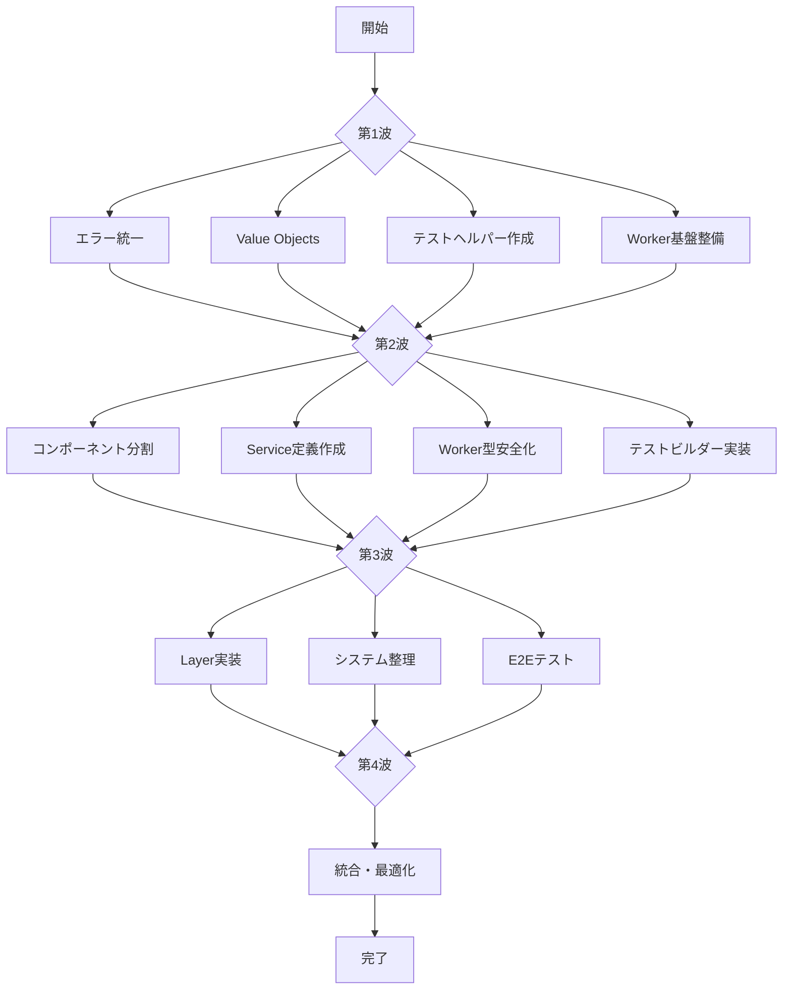

# ts-minecraft 並列実行可能なリファクタリング計画

## 🚀 並列実行フロー



## 📋 第1波：独立作業（並列実行可能）

### Team A: エラー統一とコア構造
```bash
# 並列実行可能なタスク
├── エラー定義の統一（domain/errors.ts）
├── core/errors ディレクトリ作成
└── エラー階層構造の実装
```

**作業内容:**
```typescript
// src/core/errors/base/domain-error.ts
export class DomainError extends Data.TaggedError("DomainError")<{
  message: string
  cause?: unknown
}> {}

// src/core/errors/entity-errors.ts
export class EntityNotFoundError extends Data.TaggedError("EntityNotFoundError")<{
  entityId: EntityId
  message: string
}> {}

// src/core/errors/index.ts
export * from './base/domain-error'
export * from './entity-errors'
export * from './component-errors'
export * from './world-errors'
```

### Team B: Value Objects実装
```bash
# 並列実行可能なタスク
├── core/values/coordinates 作成
├── core/values/physics 作成
└── Data.Struct パターン適用
```

**作業内容:**
```typescript
// src/core/values/coordinates/position.value.ts
import { Data, pipe } from 'effect'
import * as S from 'effect/Schema'

export const PositionSchema = S.Struct({
  x: S.Number.pipe(S.finite()),
  y: S.Number.pipe(S.finite()),
  z: S.Number.pipe(S.finite()),
})

export type Position = Data.Struct<{
  readonly x: number
  readonly y: number
  readonly z: number
}>

export const Position = Data.struct<Position>()

// 振る舞いの定義
export const translate = (dx: number, dy: number, dz: number) =>
  (pos: Position): Position =>
    Position({
      x: pos.x + dx,
      y: pos.y + dy,
      z: pos.z + dz,
    })
```

### Team C: テスト基盤の整備
```bash
# 並列実行可能なタスク
├── test-utils/builders 作成
├── test-utils/fixtures 作成
└── test-utils/mocks 作成
```

**作業内容:**
```typescript
// src/test-utils/builders/entity.builder.ts
type EntityBuilderState = {
  readonly id: EntityId
  readonly components: ReadonlyMap<string, unknown>
}

export const entityBuilder = {
  create: (id = EntityId.make()): EntityBuilderState => ({
    id,
    components: new Map()
  }),
  
  withComponent: <T>(name: string, component: T) =>
    (state: EntityBuilderState): EntityBuilderState => ({
      ...state,
      components: new Map(state.components).set(name, component)
    }),
    
  build: (state: EntityBuilderState) => state
}
```

### Team D: Worker基盤の準備
```bash
# 並列実行可能なタスク
├── workers/shared/worker-base.ts 作成
├── workers/shared/message-types.ts 作成
└── 型安全なハンドラー定義
```

**作業内容:**
```typescript
// src/workers/shared/worker-base.ts
import { Effect, Schema as S, pipe } from 'effect'

export type WorkerHandler<TIn, TOut> = (
  input: TIn
) => Effect.Effect<TOut>

export const createWorker = <TIn, TOut>(config: {
  inputSchema: S.Schema<TIn>
  outputSchema: S.Schema<TOut>
  handler: WorkerHandler<TIn, TOut>
}) => {
  const handleMessage = (e: MessageEvent) =>
    pipe(
      S.decodeUnknown(config.inputSchema)(e.data),
      Effect.flatMap(config.handler),
      Effect.flatMap(S.encode(config.outputSchema)),
      Effect.tap((encoded) =>
        Effect.sync(() => self.postMessage(encoded))
      ),
      Effect.catchAll((error) =>
        Effect.sync(() =>
          self.postMessage({ type: 'error', error })
        )
      ),
      Effect.runPromise
    )

  return {
    start: () => {
      self.onmessage = handleMessage
    }
  }
}
```

## 📋 第2波：第1波完了後の並列作業

### Team A: コンポーネント分割
```bash
# 依存: エラー統一、Value Objects
├── core/components/physics 作成
├── core/components/rendering 作成
└── core/components/gameplay 作成
```

### Team B: Service定義の作成
```bash
# 依存: エラー統一
├── services/world/world.service.ts
├── services/rendering/renderer.service.ts
└── services/input/input-manager.service.ts
```

### Team C: Worker実装の型安全化
```bash
# 依存: Worker基盤
├── workers/terrain の移行
├── workers/mesh の移行
└── メッセージ型の統一
```

### Team D: テストビルダーの拡張
```bash
# 依存: テスト基盤、Value Objects
├── world.builder.ts
├── chunk.builder.ts
└── player.builder.ts
```

## 📋 第3波：統合作業

### Team A+B: Layer実装とService統合
```bash
# 依存: Service定義、コンポーネント分割
├── infrastructure/layers/core 作成
├── infrastructure/layers/rendering 作成
└── AppLive の統合
```

### Team C: システムのリファクタリング
```bash
# 依存: コンポーネント分割、Service定義
├── systems/movement の整理
├── systems/world の整理
└── systems/interaction の整理
```

### Team D: E2Eテストの実装
```bash
# 依存: 全テストビルダー
├── e2e/game-loop.e2e.spec.ts
├── e2e/world-generation.e2e.spec.ts
└── e2e/player-interaction.e2e.spec.ts
```

## 📋 第4波：最終統合と最適化

### 全チーム協働
```bash
├── import文の一括更新
├── 循環依存の解消
├── デッドコードの削除
├── パフォーマンス測定
└── ドキュメント更新
```

## 🔧 並列実行のための環境設定

### Git ブランチ戦略
```bash
main
├── refactor/wave1-errors      (Team A)
├── refactor/wave1-values      (Team B)
├── refactor/wave1-test-utils  (Team C)
├── refactor/wave1-workers     (Team D)
└── refactor/integration       (統合用)
```

### 並列実行スクリプト
```json
// package.json
{
  "scripts": {
    "refactor:wave1": "concurrently \"npm run refactor:errors\" \"npm run refactor:values\" \"npm run refactor:test-utils\" \"npm run refactor:workers\"",
    "refactor:errors": "tsx scripts/refactor/errors.ts",
    "refactor:values": "tsx scripts/refactor/values.ts",
    "refactor:test-utils": "tsx scripts/refactor/test-utils.ts",
    "refactor:workers": "tsx scripts/refactor/workers.ts",
    "refactor:validate": "npm run typecheck && npm run lint && npm run test"
  }
}
```

## 📊 進捗管理

### タスク依存関係マトリックス

| タスク | 依存先 | ブロッカー | 並列可能 |
|--------|--------|------------|----------|
| エラー統一 | なし | なし | ✅ |
| Value Objects | なし | なし | ✅ |
| テスト基盤 | なし | なし | ✅ |
| Worker基盤 | なし | なし | ✅ |
| コンポーネント分割 | エラー統一, Value Objects | 第1波完了 | ✅ |
| Service定義 | エラー統一 | 第1波完了 | ✅ |
| Worker型安全化 | Worker基盤 | 第1波完了 | ✅ |
| Layer実装 | Service定義 | 第2波完了 | ❌ |
| システム整理 | コンポーネント分割 | 第2波完了 | ✅ |
| 統合テスト | 全テスト基盤 | 第3波完了 | ❌ |

## 🎯 成功基準

### 各波の完了条件

**第1波（2日間）:**
- [ ] エラークラスの重複が0
- [ ] 全Value ObjectsがData.Struct使用
- [ ] テストビルダー基本実装完了
- [ ] Worker基盤の型定義完了

**第2波（2日間）:**
- [ ] components.ts が機能別に分割
- [ ] 全ServiceのTag定義完了
- [ ] Worker通信が100%型安全
- [ ] テストビルダー全機能実装

**第3波（2日間）:**
- [ ] 全ServiceにLayer実装
- [ ] システムの責務が明確化
- [ ] E2Eテスト3件以上作成

**第4波（1日間）:**
- [ ] 循環依存0件
- [ ] import文整理完了
- [ ] パフォーマンス測定実施
- [ ] ドキュメント更新完了

## 🔄 継続的インテグレーション

### 自動マージ戦略
```yaml
# .github/workflows/auto-merge.yml
name: Auto Merge Refactor Branches

on:
  pull_request:
    branches: [refactor/integration]

jobs:
  validate:
    runs-on: ubuntu-latest
    steps:
      - uses: actions/checkout@v3
      - name: Install dependencies
        run: pnpm install
      - name: Type check
        run: pnpm typecheck
      - name: Lint
        run: pnpm lint
      - name: Test
        run: pnpm test
      - name: Check circular deps
        run: npx madge --circular src/
```

### コンフリクト解決ガイドライン

1. **インポートのコンフリクト:** 
   - 新しいcore構造を優先
   - 古いdomainパスは削除

2. **型定義のコンフリクト:**
   - Schema定義を優先
   - type aliasは段階的に移行

3. **テストのコンフリクト:**
   - 新しいテストビルダーを使用
   - 古いモックは削除

## 📝 チーム間コミュニケーション

### デイリースタンドアップ項目
- 完了したタスク
- 進行中のタスク
- ブロッカー
- 他チームへの依存

### 統合ポイント
- 第1波完了: Day 2 終了時
- 第2波完了: Day 4 終了時
- 第3波完了: Day 6 終了時
- 最終統合: Day 7

## 🚨 リスク管理

### 想定リスクと対策

| リスク | 影響度 | 対策 |
|--------|--------|------|
| 大規模な型エラー | 高 | 段階的な移行、型アサーション使用 |
| テスト失敗 | 中 | 並列でテスト修正チーム配置 |
| パフォーマンス劣化 | 中 | ベンチマーク実施、ロールバック準備 |
| マージコンフリクト | 低 | 小さいPR、頻繁なリベース |

## ✅ チェックリスト

### 開始前確認
- [ ] 全テストがグリーン
- [ ] main ブランチ最新化
- [ ] バックアップブランチ作成
- [ ] チーム分担確認

### 各波完了時確認
- [ ] 型チェック通過
- [ ] リント通過
- [ ] テスト通過
- [ ] 循環依存なし
- [ ] ドキュメント更新

### 最終確認
- [ ] パフォーマンステスト実施
- [ ] カバレッジ90%以上
- [ ] READMEに変更内容記載
- [ ] PRレビュー完了