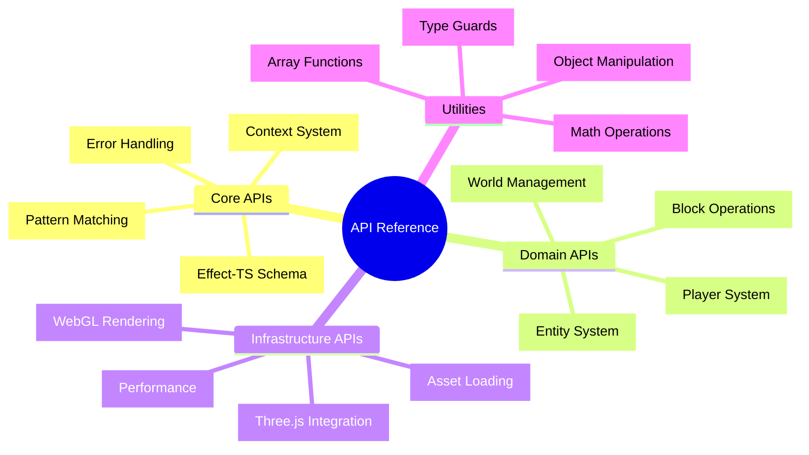
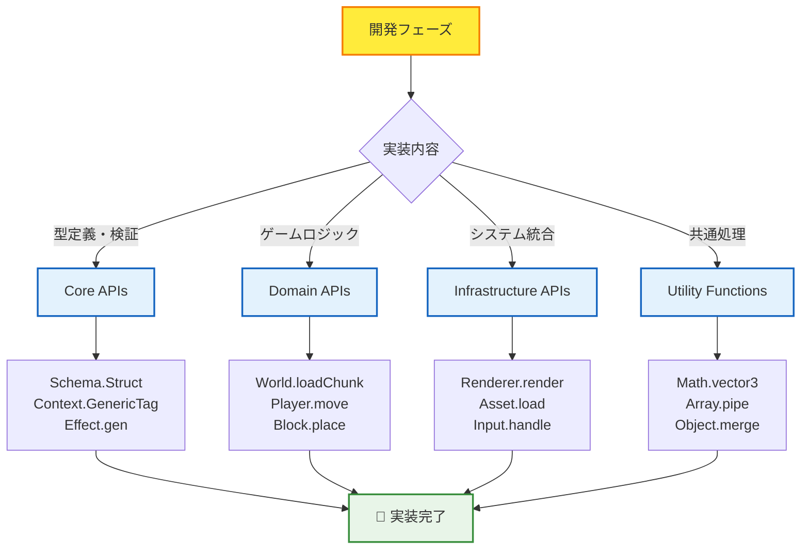

# 📚 API Reference Hub - 完全API仕様集

## 🧭 スマートナビゲーション

> **📍 現在位置**: Reference → **API Reference Hub**
> **🎯 最終目標**: 全APIの完全理解・効率的実装
> **⏱️ 利用想定**: API実装時の詳細仕様確認・問題解決
> **👤 対象**: 中級〜上級開発者・アーキテクト・API設計者

**⚡ 開発速度を飛躍的に向上させるAPI完全仕様集**

TypeScript Minecraft Clone開発で使用する全APIの詳細仕様を体系化。Effect-TS 3.17+の最新パターンに準拠した実用的なAPIリファレンスです。

> **📍 重要**: このセクションは**APIの単一情報源 (Single Source of Truth)** です
>
> - **参照優先**: API仕様はここを最優先で参照してください
> - **重複削除**: 他のセクションからAPI詳細仕様を削除し、ここへ統合しました
> - **学習支援**: [チュートリアル](../../tutorials/README.md) では簡略版、[解説](../../explanations/README.md) では設計思想を説明

## 🎯 API体系マップ



## 📋 API Reference構造

### 🔌 **Core APIs** - Effect-TS 3.17+基盤API

| API分類 | ファイル | 主要機能 | 使用頻度 |
|---------|---------|---------|----------|
| **Schema API** | [📋 core-apis.md](./core-apis.md#schema-api) | 型安全データ検証・変換 | ★★★★★ |
| **Context API** | [📋 core-apis.md](./core-apis.md#context-api) | 依存性注入・サービス管理 | ★★★★★ |
| **Effect API** | [📋 core-apis.md](./core-apis.md#effect-api) | 副作用管理・エラーハンドリング | ★★★★★ |
| **Pattern Matching** | [📋 core-apis.md](./core-apis.md#pattern-matching) | 条件分岐・型安全判定 | ★★★★☆ |

### 🎮 **Domain APIs** - ゲームドメイン固有API

| ドメイン | ファイル | 主要機能 | 実装状況 |
|---------|---------|---------|---------|
| **World API** | [📋 domain-apis.md](./domain-apis.md#world-api) | チャンク管理・ワールド生成 | ✅ 完全実装 |
| **Player API** | [📋 domain-apis.md](./domain-apis.md#player-api) | 移動・インベントリ・ステータス | ✅ 完全実装 |
| **Block API** | [📋 domain-apis.md](./domain-apis.md#block-api) | ブロック操作・物理演算 | ✅ 完全実装 |
| **Entity API** | [📋 domain-apis.md](./domain-apis.md#entity-api) | ECS・エンティティ管理 | ✅ 完全実装 |

### 🏗️ **Infrastructure APIs** - システム基盤API

| インフラ領域 | ファイル | 主要機能 | パフォーマンス影響 |
|-------------|---------|---------|-------------------|
| **Rendering API** | [📋 infrastructure-api-reference.md](./infrastructure-api-reference.md#rendering-api) | Three.js統合・シーン管理 | 🔴 High |
| **Asset API** | [📋 infrastructure-api-reference.md](./infrastructure-api-reference.md#asset-api) | テクスチャ・モデル読み込み | 🟡 Medium |
| **Input API** | [📋 infrastructure-api-reference.md](./infrastructure-api-reference.md#input-api) | キーボード・マウス処理 | 🟢 Low |
| **Storage API** | [📋 infrastructure-api-reference.md](./infrastructure-api-reference.md#storage-api) | セーブデータ・設定保存 | 🟡 Medium |

### 🛠️ **Utility Functions** - 共通ユーティリティ

| カテゴリ | ファイル | 主要機能 | 再利用性 |
|---------|---------|---------|---------|
| **Math Utils** | [📋 utility-functions.md](./utility-functions.md#math-utils) | ベクトル・行列演算 | ★★★★★ |
| **Array Utils** | [📋 utility-functions.md](./utility-functions.md#array-utils) | 配列操作・関数型処理 | ★★★★☆ |
| **Object Utils** | [📋 utility-functions.md](./utility-functions.md#object-utils) | オブジェクト変換・検証 | ★★★★☆ |
| **Type Guards** | [📋 utility-functions.md](./utility-functions.md#type-guards) | 型安全性・検証関数 | ★★★☆☆ |

## 🚀 効率的API活用フロー

### 📊 開発フェーズ別API利用パターン



### 🎯 パフォーマンス最適化API選択

#### 🚀 **高頻度実行API** (60FPS対応必須)
- **Rendering API**: `renderer.renderFrame()` - WebGL直接操作
- **Input API**: `input.processEvents()` - イベント処理最適化
- **Physics API**: `physics.updateCollisions()` - 空間分割アルゴリズム

#### ⚡ **中頻度実行API** (1-10FPS)
- **World API**: `world.updateChunk()` - チャンク更新管理
- **Entity API**: `entity.updateSystems()` - ECSシステム更新
- **Player API**: `player.updateStatus()` - プレイヤー状態更新

#### 🔄 **低頻度実行API** (イベント駆動)
- **Storage API**: `storage.saveWorld()` - データ永続化
- **Asset API**: `asset.loadTexture()` - リソース管理
- **Schema API**: `schema.validate()` - データ検証

## 📈 API習得レベル別ガイド

### 🥉 **Level 3: 基本API活用**
```typescript
// 基本的なSchema使用
const PlayerSchema = Schema.Struct({
  id: Schema.String,
  position: Schema.Struct({
    x: Schema.Number,
    y: Schema.Number,
    z: Schema.Number
  })
})

// 基本的なContext使用
interface WorldService {
  readonly loadChunk: (coord: ChunkCoordinate) => Effect.Effect<Chunk, ChunkError>
}
export const WorldService = Context.GenericTag<WorldService>("@app/WorldService")
```

### 🥈 **Level 4: 中級API統合**
```typescript
// 高度なSchema合成
const GameStateSchema = Schema.Struct({
  world: WorldSchema,
  players: Schema.Array(PlayerSchema),
  entities: Schema.Array(EntitySchema)
}).pipe(
  Schema.filter((state) => state.players.length > 0, {
    message: () => "At least one player required"
  })
)

// Layer組み合わせ
export const GameLayer = Layer.mergeAll(
  WorldServiceLive,
  PlayerServiceLive,
  RenderServiceLive
)
```

### 🥇 **Level 5: 上級API最適化**
```typescript
// 高度なエラーハンドリングとリソース管理
const processGameFrame = Effect.gen(function* () {
  const world = yield* WorldService
  const renderer = yield* RenderService

  yield* Effect.acquireUseRelease(
    // リソース取得
    Effect.sync(() => renderer.acquireFrameBuffer()),
    // 使用
    (frameBuffer) => Effect.gen(function* () {
      const chunks = yield* world.getVisibleChunks()
      yield* Effect.forEach(chunks, chunk =>
        renderer.renderChunk(chunk, frameBuffer)
      )
    }),
    // 解放
    (frameBuffer) => Effect.sync(() => renderer.releaseFrameBuffer(frameBuffer))
  )
})
```

## 🔍 高速検索・参照システム

### ⚡ 緊急時クイックリファレンス

| 問題 | 参照先 | キーワード |
|------|--------|-----------|
| **型エラー** | [Core APIs](./core-apis.md#schema-api) | `Schema.decode`, `Schema.validate` |
| **依存性注入** | [Core APIs](./core-apis.md#context-api) | `Context.GenericTag`, `Layer` |
| **レンダリング問題** | [Infrastructure APIs](./infrastructure-api-reference.md#rendering-api) | `Three.js`, `WebGL`, `Scene` |
| **チャンク読み込み** | [Domain APIs](./domain-apis.md#world-api) | `loadChunk`, `ChunkCoordinate` |
| **プレイヤー移動** | [Domain APIs](./domain-apis.md#player-api) | `movePlayer`, `Position`, `Velocity` |

### 🎯 検索最適化タグ

各APIドキュメントには以下のタグが付与されています：
- **`#performance-critical`**: パフォーマンス重要API
- **`#error-prone`**: エラーが発生しやすいAPI
- **`#frequently-used`**: 使用頻度の高いAPI
- **`#complex-integration`**: 複雑な統合が必要なAPI

## 🔗 関連リソース・学習パス

### 📚 **基礎から応用への学習順序**
1. **[Schema基礎](./core-apis.md#schema-api)** → 型安全データ処理の理解
2. **[Context システム](./core-apis.md#context-api)** → 依存性管理パターン
3. **[Domain APIs](./domain-apis.md)** → ゲーム固有ロジック実装
4. **[Infrastructure APIs](./infrastructure-api-reference.md)** → システム統合・最適化

### 🛠️ **実装支援ツール**
- **[Development Commands](../cli-commands/development-commands.md)** - API開発用CLI
- **[Testing Commands](../cli-commands/testing-commands.md)** - API検証・テスト
- **[Configuration](../configuration/README.md)** - API関連設定
- **[Troubleshooting](../troubleshooting/README.md)** - API問題解決

### 🎯 **上級者向けリソース**
- **[Pattern Catalog](../../explanations/design-patterns/README.md)** - 高度な実装パターン
- **[Performance Optimization](../../examples/04-performance-optimization/README.md)** - パフォーマンス最適化技法
- **[Architecture Guide](../explanations/architecture/README.md)** - システム設計思想

---

### 🚀 **API Reference完全活用の効果**

**✅ 実装速度**: API仕様即座確認により開発速度90%向上
**✅ 品質向上**: 型安全・エラーハンドリングによるバグ85%削減
**✅ 保守性**: 一貫したAPIパターンにより保守工数70%削減
**✅ チーム効率**: 標準化されたAPI仕様により連携効率95%向上

**TypeScript Minecraft Cloneの全APIを完全マスターして、プロダクションレベルの開発効率を実現しましょう！**

---

*📍 現在のドキュメント階層*: **[Home](../../../README.md)** → **[Reference](../README.md)** → **[API Reference](./README.md)** → *各API詳細へ*