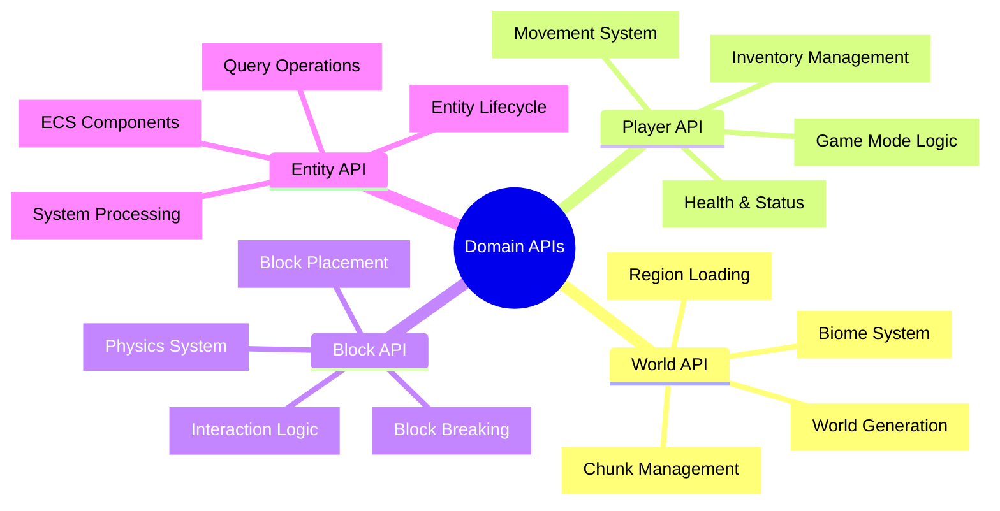

# 🎮 Domain APIs - ゲームドメイン完全マスタリー

## 🧭 スマートナビゲーション

> **📍 現在位置**: Reference → API Reference → **Domain APIs**
> **🎯 最終目標**: Minecraftゲームロジック完全実装・最適化
> **⏱️ 所要時間**: 45-60分（上級者向け）
> **👤 対象**: 上級開発者・ゲームアーキテクト・ドメインエキスパート

**🎯 Minecraftの複雑なゲームロジックを型安全・関数型で実装する完全ガイド**

## 📊 Domain APIs体系マップ



## 🌍 World API - ワールド管理システム

> **📚 参照元**: このAPIは複数のドキュメントに分散していたものを統合した完全仕様です
>
> **🔗 関連説明**:
> - **設計思想**: [Domain Layer Design Principles](../../explanations/architecture/domain-layer-design-principles.md)
> - **実装方法**: [Application Services Tutorial](../../tutorials/basic-game-development/application-services.md)
> - **ゲーム仕様**: [World Management System](../../explanations/game-mechanics/core-features/world-management-system.md)
> - **テストパターン**: [Effect-TS Testing Patterns](../../how-to/testing/effect-ts-testing-patterns.md)

### ⚡ 高頻度使用API (60FPS対応)

#### WorldService - メインワールド管理
```typescript
/**
 * ワールド管理の中核サービス
 * @description Minecraftワールドの包括的な管理機能を提供
 * @performance_critical チャンク読み込み・レンダリング処理で高頻度使用
 * @since 1.0.0
 */
export interface WorldService {
  /**
   * チャンクの読み込み
   * @param coord チャンク座標
   * @returns 読み込まれたチャンク、またはエラー
   * @throws ChunkLoadError チャンク読み込み失敗
   * @performance O(1) - キャッシュヒット時、O(log n) - ディスク読み込み時
   */
  readonly loadChunk: (coord: ChunkCoordinate) => Effect.Effect<Chunk, ChunkLoadError>

  /**
   * チャンクの非同期保存
   * @param chunk 保存するチャンク
   * @returns 保存完了
   * @throws ChunkSaveError 保存失敗
   */
  readonly saveChunk: (chunk: Chunk) => Effect.Effect<void, ChunkSaveError>

  /**
   * チャンクのメモリ解放
   * @param coord チャンク座標
   * @returns 解放完了
   */
  readonly unloadChunk: (coord: ChunkCoordinate) => Effect.Effect<void, never>

  /**
   * 新規チャンク生成
   * @param coord 生成位置
   * @param generationOptions 生成オプション
   * @returns 生成されたチャンク
   * @throws ChunkGenerationError 生成失敗
   */
  readonly generateChunk: (
    coord: ChunkCoordinate,
    options?: ChunkGenerationOptions
  ) => Effect.Effect<Chunk, ChunkGenerationError>

  /**
   * ブロック取得（高頻度）
   * @param position 3D座標
   * @returns ブロック情報、または空気ブロック
   */
  readonly getBlock: (position: Position) => Effect.Effect<Block, BlockError>

  /**
   * ブロック設置（高頻度）
   * @param position 設置位置
   * @param block 設置するブロック
   * @returns 設置完了
   * @throws BlockPlacementError 設置失敗
   */
  readonly setBlock: (position: Position, block: Block) => Effect.Effect<void, BlockPlacementError>

  /**
   * 読み込み済みチャンク一覧取得
   * @returns チャンク座標配列
   */
  readonly getLoadedChunks: () => Effect.Effect<readonly ChunkCoordinate[], never>

  /**
   * チャンク読み込み状態確認
   * @param coord チャンク座標
   * @returns 読み込み済みフラグ
   */
  readonly isChunkLoaded: (coord: ChunkCoordinate) => Effect.Effect<boolean, never>
}

/**
 * WorldService Context Tag
 * @usage const worldService = yield* WorldService
 */
export const WorldService = Context.GenericTag<WorldService>("@minecraft/WorldService")

### 📋 World基本データ構造

#### ✅ **コアデータ定義**
```typescript
import { Schema, Effect, Context, Brand } from "effect"

// ゲームドメイン特化Brand型定義
export type SlotIndex = Brand.Brand<number, "SlotIndex">
export type HealthPoints = Brand.Brand<number, "HealthPoints">
export type ExperiencePoints = Brand.Brand<number, "ExperiencePoints">
export type ItemQuantity = Brand.Brand<number, "ItemQuantity">
export type DurabilityValue = Brand.Brand<number, "DurabilityValue">

// Brand型コンストラクタ
export const SlotIndex = Brand.nominal<SlotIndex>()
export const HealthPoints = Brand.nominal<HealthPoints>()
export const ExperiencePoints = Brand.nominal<ExperiencePoints>()
export const ItemQuantity = Brand.nominal<ItemQuantity>()
export const DurabilityValue = Brand.nominal<DurabilityValue>()

// ドメイン特化ヘルパー関数群
export const DomainUtils = {
  /**
   * スロットインデックスの作成（範囲検証付き）
   * @param index - スロット番号
   * @param maxSlots - 最大スロット数（デフォルト36）
   * @returns 検証済みスロットインデックス、またはエラー
   * @example
   * ```typescript
   * const hotbarSlot = yield* DomainUtils.createSlotIndex(3, 9);
   * const inventorySlot = yield* DomainUtils.createSlotIndex(15, 36);
   * // 型安全: SlotIndex型として扱われ、通常の数値と区別される
   * ```
   */
  createSlotIndex: (index: number, maxSlots = 36): Effect.Effect<SlotIndex, DomainError> =>
    Effect.gen(function* () {
      if (!Number.isInteger(index)) {
        return yield* Effect.fail(new DomainError("Slot index must be an integer"))
      }

      if (index < 0 || index >= maxSlots) {
        return yield* Effect.fail(new DomainError(`Slot index must be between 0-${maxSlots - 1}`))
      }

      return SlotIndex(index)
    }),

  /**
   * 体力値の作成（範囲・刻み検証付き）
   * @param health - 体力値
   * @returns 検証済み体力値、またはエラー
   * @example
   * ```typescript
   * const playerHealth = yield* DomainUtils.createHealthPoints(18.5);
   * // 型安全: HealthPoints型として扱われ、誤った値の設定を防ぐ
   * ```
   */
  createHealthPoints: (health: number): Effect.Effect<HealthPoints, DomainError> =>
    Effect.gen(function* () {
      if (!Number.isFinite(health)) {
        return yield* Effect.fail(new DomainError("Health must be a finite number"))
      }

      if (health < 0 || health > 20) {
        return yield* Effect.fail(new DomainError("Health must be between 0-20"))
      }

      // 0.5刻みの検証
      if ((health * 2) % 1 !== 0) {
        return yield* Effect.fail(new DomainError("Health must be in 0.5 increments"))
      }

      return HealthPoints(health)
    }),

  /**
   * アイテム数量の作成（スタック制限検証付き）
   * @param quantity - アイテム数量
   * @param maxStack - 最大スタック数（デフォルト64）
   * @returns 検証済みアイテム数量、またはエラー
   * @example
   * ```typescript
   * const itemCount = yield* DomainUtils.createItemQuantity(32, 64);
   * const unstackableCount = yield* DomainUtils.createItemQuantity(1, 1); // 剣等
   * // 型安全: ItemQuantity型として扱われ、無効な数量設定を防ぐ
   * ```
   */
  createItemQuantity: (quantity: number, maxStack = 64): Effect.Effect<ItemQuantity, DomainError> =>
    Effect.gen(function* () {
      if (!Number.isInteger(quantity)) {
        return yield* Effect.fail(new DomainError("Item quantity must be an integer"))
      }

      if (quantity < 1 || quantity > maxStack) {
        return yield* Effect.fail(new DomainError(`Item quantity must be between 1-${maxStack}`))
      }

      return ItemQuantity(quantity)
    }),

  /**
   * 耐久度値の作成（非負整数検証付き）
   * @param durability - 耐久度
   * @param maxDurability - 最大耐久度（オプション）
   * @returns 検証済み耐久度値、またはエラー
   * @example
   * ```typescript
   * const swordDurability = yield* DomainUtils.createDurabilityValue(250, 1561);
   * // 型安全: DurabilityValue型として扱われ、耐久度の誤設定を防ぐ
   * ```
   */
  createDurabilityValue: (durability: number, maxDurability?: number): Effect.Effect<DurabilityValue, DomainError> =>
    Effect.gen(function* () {
      if (!Number.isInteger(durability)) {
        return yield* Effect.fail(new DomainError("Durability must be an integer"))
      }

      if (durability < 0) {
        return yield* Effect.fail(new DomainError("Durability must be non-negative"))
      }

      if (maxDurability !== undefined && durability > maxDurability) {
        return yield* Effect.fail(new DomainError(`Durability must not exceed ${maxDurability}`))
      }

      return DurabilityValue(durability)
    }),

  /**
   * 経験値の作成（非負整数検証付き）
   * @param experience - 経験値
   * @returns 検証済み経験値、またはエラー
   * @example
   * ```typescript
   * const playerXP = yield* DomainUtils.createExperiencePoints(1500);
   * // 型安全: ExperiencePoints型として扱われ、負の経験値を防ぐ
   * ```
   */
  createExperiencePoints: (experience: number): Effect.Effect<ExperiencePoints, DomainError> =>
    Effect.gen(function* () {
      if (!Number.isInteger(experience)) {
        return yield* Effect.fail(new DomainError("Experience must be an integer"))
      }

      if (experience < 0) {
        return yield* Effect.fail(new DomainError("Experience must be non-negative"))
      }

      return ExperiencePoints(experience)
    })
} as const

// カスタムエラー型 - Effect-TS関数型パターン
export const DomainError = Schema.TaggedError("DomainError")({
  message: Schema.String,
  timestamp: Schema.optional(Schema.DateTimeUtc)
})

// ワールド基本情報
export const WorldMetadataSchema = Schema.Struct({
  name: Schema.String.pipe(
    Schema.minLength(1),
    Schema.maxLength(32)
  ),
  seed: Schema.BigInt,
  gamemode: Schema.Literal("survival", "creative", "hardcore"),
  difficulty: Schema.Literal("peaceful", "easy", "normal", "hard"),
  createdAt: Schema.DateTimeUtc,
  lastPlayed: Schema.DateTimeUtc,
  version: Schema.String
}).annotations({
  identifier: "WorldMetadata"
})

// チャンクデータ構造
export const ChunkSchema = Schema.Struct({
  coordinate: ChunkCoordinateSchema,
  blocks: Schema.Array(Schema.Array(Schema.Array(BlockSchema))), // [x][y][z]
  biome: BiomeSchema,
  generated: Schema.Boolean,
  modified: Schema.Boolean,
  entities: Schema.Array(EntitySchema),
  lastUpdated: Schema.DateTimeUtc
}).annotations({
  identifier: "Chunk"
})

// ブロック定義
export const BlockSchema = Schema.Struct({
  type: Schema.Literal(
    "air", "stone", "grass", "dirt", "cobblestone",
    "wood", "sand", "gravel", "water", "lava"
  ),
  metadata: Schema.optional(Schema.Record({
    key: Schema.String,
    value: Schema.Unknown
  })),
  lightLevel: Schema.Number.pipe(
    Schema.int(),
    Schema.between(0, 15)
  )
}).annotations({
  identifier: "Block"
})

// バイオーム定義
export const BiomeSchema = Schema.Struct({
  type: Schema.Literal(
    "plains", "forest", "desert", "mountains",
    "ocean", "taiga", "swampland"
  ),
  temperature: Schema.Number.pipe(Schema.between(-2, 2)),
  rainfall: Schema.Number.pipe(Schema.between(0, 2)),
  grassColor: Schema.String,
  foliageColor: Schema.String
}).annotations({
  identifier: "Biome"
})
```

#### ⭐ **WorldService実装**
```typescript
/**
 * ワールド管理サービス
 * @description Minecraftワールドの包括的な管理機能を提供するサービス
 * @since 1.0.0
 */
export interface WorldService {
  /**
   * チャンクの読み込み
   * @param coord - 読み込み対象のチャンク座標
   * @returns 読み込まれたチャンクデータ、またはエラー
   * @throws ChunkLoadError チャンクの読み込みに失敗した場合
   * @example
   * ```typescript
   * const chunk = yield* worldService.loadChunk({ chunkX: 0, chunkZ: 0 });
   * console.log(`Loaded chunk with ${chunk.blocks.length} blocks`);
   * ```
   */
  readonly loadChunk: (coord: ChunkCoordinate) => Effect.Effect<Chunk, ChunkLoadError>;

  /**
   * チャンクの保存
   * @param chunk - 保存するチャンクデータ
   * @returns 保存完了、またはエラー
   * @throws ChunkSaveError チャンクの保存に失敗した場合
   * @example
   * ```typescript
   * const modifiedChunk = { ...chunk, modified: true };
   * yield* worldService.saveChunk(modifiedChunk);
   * ```
   */
  readonly saveChunk: (chunk: Chunk) => Effect.Effect<void, ChunkSaveError>;

  /**
   * チャンクのアンロード
   * @param coord - アンロードするチャンク座標
   * @returns アンロード完了（エラーなし）
   * @example
   * ```typescript
   * yield* worldService.unloadChunk({ chunkX: 5, chunkZ: 5 });
   * ```
   */
  readonly unloadChunk: (coord: ChunkCoordinate) => Effect.Effect<void, never>;

  /**
   * チャンクの生成
   * @param coord - 生成するチャンクの座標
   * @returns 生成されたチャンクデータ、またはエラー
   * @throws GenerationError 地形生成に失敗した場合
   * @example
   * ```typescript
   * const newChunk = yield* worldService.generateChunk({ chunkX: 2, chunkZ: 3 });
   * console.log(`Generated chunk with biome: ${newChunk.biome.type}`);
   * ```
   */
  readonly generateChunk: (coord: ChunkCoordinate) => Effect.Effect<Chunk, GenerationError>;

  /**
   * 構造物の生成
   * @param type - 生成する構造物の種類（村、ダンジョンなど）
   * @param position - 構造物を配置する座標
   * @returns 生成完了、またはエラー
   * @throws GenerationError 構造物生成に失敗した場合
   * @example
   * ```typescript
   * yield* worldService.generateStructure("village", { x: 100, y: 64, z: 200 });
   * ```
   */
  readonly generateStructure: (type: StructureType, position: Position) => Effect.Effect<void, GenerationError>;

  /**
   * 指定座標のブロック取得
   * @param position - 取得するブロックの3D座標
   * @returns 指定座標のブロックデータ、またはエラー
   * @throws BlockNotFoundError ブロックが存在しない、またはチャンクが読み込まれていない場合
   * @example
   * ```typescript
   * const block = yield* worldService.getBlock({ x: 10, y: 64, z: 20 });
   * console.log(`Block type: ${block.type}, Light level: ${block.lightLevel}`);
   * ```
   */
  readonly getBlock: (position: Position) => Effect.Effect<Block, BlockNotFoundError>;

  /**
   * 指定座標にブロック設置
   * @param position - 設置先の3D座標
   * @param block - 設置するブロックデータ（種類、メタデータ、光レベル含む）
   * @returns 設置完了、またはエラー
   * @throws BlockUpdateError ブロック設置に失敗した場合（座標無効、チャンク未読込など）
   * @example
   * ```typescript
   * const stoneBlock = { type: "stone", lightLevel: 0, metadata: undefined };
   * yield* worldService.setBlock({ x: 15, y: 65, z: 25 }, stoneBlock);
   * ```
   */
  readonly setBlock: (position: Position, block: Block) => Effect.Effect<void, BlockUpdateError>;

  /**
   * ワールド情報の取得
   * @returns ワールドのメタデータ（名前、シード値、難易度など）
   * @example
   * ```typescript
   * const worldInfo = yield* worldService.getWorldInfo();
   * console.log(`World: ${worldInfo.name}, Seed: ${worldInfo.seed}`);
   * ```
   */
  readonly getWorldInfo: () => Effect.Effect<WorldMetadata, never>;

  /**
   * ワールド情報の更新
   * @param metadata - 更新するワールド情報（部分更新可能）
   * @returns 更新完了
   * @example
   * ```typescript
   * yield* worldService.updateWorldInfo({
   *   difficulty: "hard",
   *   lastPlayed: new Date()
   * });
   * ```
   */
  readonly updateWorldInfo: (metadata: Partial<WorldMetadata>) => Effect.Effect<void, never>;
}

export const WorldService = Context.GenericTag<WorldService>("WorldService")

// 実装例
export const WorldServiceLive = Layer.effect(
  WorldService,
  Effect.gen(function* () {
    const fileSystem = yield* FileSystem
    const config = yield* Config.nested("world")

    // チャンクキャッシュ (LRU)
    const chunkCache = new Map<string, Chunk>()
    const cacheMaxSize = 1000

    // 地形生成器
    const terrainGenerator = createTerrainGenerator(config.seed)

    return WorldService.of({
      loadChunk: (coord) => Effect.gen(function* () {
        const key = coordToString(coord)

        // キャッシュ確認
        if (chunkCache.has(key)) {
          return chunkCache.get(key)!
        }

        // ディスクから読み込み
        const chunkPath = `chunks/${key}.json`
        const exists = yield* fileSystem.exists(chunkPath)

        if (exists) {
          const data = yield* fileSystem.readFile(chunkPath)
          const chunk = yield* Schema.decodeUnknown(ChunkSchema)(
            JSON.parse(data)
          )

          // キャッシュに追加
          addToCache(chunkCache, key, chunk)
          return chunk
        }

        // 生成が必要
        return yield* generateChunk(coord)
      }),

      generateChunk: (coord) => Effect.gen(function* () {
        // バイオーム決定
        const biome = terrainGenerator.getBiome(coord)

        // 地形生成
        const blocks = terrainGenerator.generateTerrain(coord, biome)

        // 構造物生成
        const structures = terrainGenerator.generateStructures(coord, biome)

        const chunk: Chunk = {
          coordinate: coord,
          blocks,
          biome,
          generated: true,
          modified: false,
          entities: [],
          lastUpdated: new Date()
        }

        // 構造物を配置
        yield* Effect.forEach(structures, ({ type, position }) =>
          generateStructure(type, position)
        )

        return chunk
      }),

      getBlock: (position) => Effect.gen(function* () {
        const chunkCoord = positionToChunkCoord(position)
        const chunk = yield* loadChunk(chunkCoord)

        const localPos = globalToLocalPosition(position)
        const block = chunk.blocks[localPos.x]?.[localPos.y]?.[localPos.z]

        if (!block) {
          return yield* Effect.fail(new BlockNotFoundError({ position }))
        }

        return block
      }),

      setBlock: (position, block) => Effect.gen(function* () {
        const chunkCoord = positionToChunkCoord(position)
        const chunk = yield* loadChunk(chunkCoord)

        const localPos = globalToLocalPosition(position)

        // ブロック更新
        const updatedChunk = {
          ...chunk,
          blocks: updateBlockArray(chunk.blocks, localPos, block),
          modified: true,
          lastUpdated: new Date()
        }

        // キャッシュ更新
        const key = coordToString(chunkCoord)
        chunkCache.set(key, updatedChunk)

        // 隣接チャンクの更新チェック
        yield* updateAdjacentChunks(position, block)
      })
    })
  })
)
```

### 🔄 World高度な操作パターン

#### ✅ **複雑なワールド操作**
```typescript
// 範囲ブロック操作
export const fillRegion = (
  min: Position,
  max: Position,
  blockType: BlockType
): Effect.Effect<void, BlockUpdateError, WorldService> =>
  Effect.gen(function* () {
    const worldService = yield* WorldService

    // 範囲内の全座標を生成
    const positions = generatePositionsInRange(min, max)

    // バッチでブロック更新（チャンク単位で最適化）
    const chunkGroups = groupPositionsByChunk(positions)

    yield* Effect.forEach(
      chunkGroups,
      ({ chunk, positions }) => Effect.gen(function* () {
        // チャンクを一度だけロード
        const chunkData = yield* worldService.loadChunk(chunk)

        // バッチ更新
        const updatedBlocks = positions.reduce((blocks, pos) => {
          const local = globalToLocalPosition(pos)
          return updateBlockArray(blocks, local, { type: blockType, lightLevel: 0 })
        }, chunkData.blocks)

        // チャンク保存
        yield* worldService.saveChunk({
          ...chunkData,
          blocks: updatedBlocks,
          modified: true
        })
      }),
      { concurrency: 4 } // 並列処理
    )
  })

// 構造物配置システム
export const placeStructure = (
  structureType: StructureType,
  position: Position,
  rotation: Rotation = 0
): Effect.Effect<void, StructurePlacementError, WorldService> =>
  Effect.gen(function* () {
    const worldService = yield* WorldService

    // 構造物テンプレート取得
    const template = getStructureTemplate(structureType)
    const rotatedTemplate = rotateStructure(template, rotation)

    // 配置可能性チェック
    const canPlace = yield* checkStructurePlacement(position, rotatedTemplate)
    if (!canPlace) {
      return yield* Effect.fail(
        new StructurePlacementError({
          structure: structureType,
          position,
          reason: "Invalid placement location"
        })
      )
    }

    // ブロック配置
    yield* Effect.forEach(
      rotatedTemplate.blocks,
      ({ offset, block }) => {
        const worldPos = addPositions(position, offset)
        return worldService.setBlock(worldPos, block)
      }
    )

    // エンティティ配置
    yield* Effect.forEach(
      rotatedTemplate.entities,
      ({ offset, entity }) => {
        const worldPos = addPositions(position, offset)
        return spawnEntity(entity, worldPos)
      }
    )
  })
```

## 👤 Player API - プレイヤーシステム

### 📋 Player基本データ構造

#### ✅ **プレイヤー状態定義**
```typescript
// プレイヤー基本状態
export const PlayerStateSchema = Schema.Struct({
  id: Schema.String.pipe(Schema.uuid()),
  username: Schema.String.pipe(
    Schema.minLength(3),
    Schema.maxLength(16),
    Schema.pattern(/^[a-zA-Z0-9_]+$/)
  ),

  // 位置・移動
  position: PositionSchema,
  velocity: VelocitySchema,
  rotation: RotationSchema,
  onGround: Schema.Boolean,

  // ステータス（Brand型統合・型安全性強化）
  health: Schema.Number.pipe(
    Schema.brand("HealthPoints"),
    Schema.between(0, 20),
    Schema.multipleOf(0.5)
  ), // 体力値（Brand型化・0.5刻み）
  hunger: Schema.Number.pipe(
    Schema.brand("HealthPoints"), // 空腹度も同じ範囲なので再利用
    Schema.between(0, 20),
    Schema.int()
  ), // 空腹度（Brand型化・整数制限）
  experience: Schema.Number.pipe(
    Schema.brand("ExperiencePoints"),
    Schema.nonNegative(),
    Schema.int()
  ), // 経験値（Brand型化・整数制限）
  level: Schema.Number.pipe(Schema.int(), Schema.nonNegative()),

  // ゲーム設定
  gamemode: Schema.Literal("survival", "creative", "spectator"),
  flying: Schema.Boolean,

  // インベントリ（Brand型統合・型安全性強化）
  inventory: InventorySchema,
  selectedSlot: Schema.Number.pipe(
    Schema.brand("SlotIndex"),
    Schema.int(),
    Schema.between(0, 8)
  ) // 選択スロット（Brand型化・整数制限）,

  // その他
  lastActive: Schema.DateTimeUtc,
  settings: PlayerSettingsSchema
}).annotations({
  identifier: "PlayerState"
})

// インベントリシステム
export const InventorySchema = Schema.Struct({
  hotbar: Schema.Array(Schema.NullOr(ItemStackSchema)).pipe(
    Schema.length(9)
  ),
  main: Schema.Array(Schema.NullOr(ItemStackSchema)).pipe(
    Schema.length(27)
  ),
  armor: Schema.Struct({
    helmet: Schema.NullOr(ItemStackSchema),
    chestplate: Schema.NullOr(ItemStackSchema),
    leggings: Schema.NullOr(ItemStackSchema),
    boots: Schema.NullOr(ItemStackSchema)
  }),
  offhand: Schema.NullOr(ItemStackSchema)
}).annotations({
  identifier: "Inventory"
})

// アイテムスタック（Brand型統合・型安全性強化）
export const ItemStackSchema = Schema.Struct({
  itemType: Schema.String.pipe(
    Schema.minLength(1),
    Schema.maxLength(64)
  ), // アイテム種別（長さ制限追加）
  quantity: Schema.Number.pipe(
    Schema.brand("ItemQuantity"),
    Schema.int(),
    Schema.between(1, 64)
  ), // アイテム数量（Brand型化・スタック制限）
  durability: Schema.optional(Schema.Number.pipe(
    Schema.brand("DurabilityValue"),
    Schema.int(),
    Schema.nonNegative()
  )), // 耐久度（Brand型化・非負整数）
  enchantments: Schema.optional(Schema.Array(EnchantmentSchema)),
  metadata: Schema.optional(Schema.Record({
    key: Schema.String,
    value: Schema.Unknown
  }))
}).annotations({
  identifier: "ItemStack",
  description: "型安全なアイテムスタック（数量・耐久度Brand型化）"
})
```

#### ⭐ **PlayerService実装**
```typescript
/**
 * プレイヤー管理サービス（統合版）
 * @description プレイヤーの状態管理、移動、インベントリ、ステータス制御を行うサービス
 * @performance_critical 移動・インベントリ操作で高頻度使用
 * @consolidated_from ["tutorials/application-services.md", "explanations/domain-application-apis.md", "game-systems/game-player-api.md"]
 * @since 1.0.0
 */
export interface PlayerService {
  /**
   * プレイヤー情報の取得
   * @param id - プレイヤーのUUID
   * @returns プレイヤーの現在状態、またはエラー
   * @throws PlayerNotFoundError 指定されたIDのプレイヤーが存在しない場合
   * @example
   * ```typescript
   * const player = yield* playerService.getPlayer("550e8400-e29b-41d4-a716-446655440000");
   * console.log(`Player ${player.username} at ${player.position.x}, ${player.position.y}, ${player.position.z}`);
   * ```
   */
  readonly getPlayer: (id: string) => Effect.Effect<PlayerState, PlayerNotFoundError>;

  /**
   * プレイヤー状態の更新
   * @param player - 更新するプレイヤー状態の完全なデータ
   * @returns 更新完了、またはエラー
   * @throws PlayerUpdateError プレイヤー状態の更新に失敗した場合
   * @example
   * ```typescript
   * const updatedPlayer = { ...player, health: 18, position: newPosition };
   * yield* playerService.updatePlayer(updatedPlayer);
   * ```
   */
  readonly updatePlayer: (player: PlayerState) => Effect.Effect<void, PlayerUpdateError>;

  /**
   * プレイヤーの削除
   * @param id - 削除するプレイヤーのUUID
   * @returns 削除完了（エラーなし、IDが存在しなくても成功）
   * @example
   * ```typescript
   * yield* playerService.removePlayer("550e8400-e29b-41d4-a716-446655440000");
   * ```
   */
  readonly removePlayer: (id: string) => Effect.Effect<void, never>;

  /**
   * プレイヤーの移動
   * @param id - 移動させるプレイヤーのUUID
   * @param position - 移動先の3D座標
   * @returns 移動完了、またはエラー
   * @throws MovementError 移動に失敗した場合（障害物、範囲外など）
   * @example
   * ```typescript
   * const newPos = { x: 100, y: 64, z: 200 };
   * yield* playerService.movePlayer("player-uuid", newPos);
   * ```
   */
  readonly movePlayer: (id: string, position: Position) => Effect.Effect<void, MovementError>;

  /**
   * プレイヤーの速度設定
   * @param id - 対象プレイヤーのUUID
   * @param velocity - 設定する3軸方向の速度ベクトル
   * @returns 速度設定完了（エラーなし）
   * @example
   * ```typescript
   * const jumpVelocity = { x: 0, y: 0.5, z: 0 };
   * yield* playerService.setVelocity("player-uuid", jumpVelocity);
   * ```
   */
  readonly setVelocity: (id: string, velocity: Velocity) => Effect.Effect<void, never>;

  /**
   * プレイヤーのテレポート
   * @param id - テレポートさせるプレイヤーのUUID
   * @param position - テレポート先の3D座標
   * @returns テレポート完了、またはエラー
   * @throws TeleportError テレポートに失敗した場合（無効な座標など）
   * @example
   * ```typescript
   * const spawnPoint = { x: 0, y: 64, z: 0 };
   * yield* playerService.teleportPlayer("player-uuid", spawnPoint);
   * ```
   */
  readonly teleportPlayer: (id: string, position: Position) => Effect.Effect<void, TeleportError>;

  /**
   * インベントリへのアイテム追加
   * @param id - 対象プレイヤーのUUID
   * @param item - 追加するアイテムスタック（種類、数量、メタデータ含む）
   * @returns 追加成功の真偽値、またはエラー（true: 完全追加, false: 部分追加または失敗）
   * @throws InventoryError インベントリ操作に失敗した場合
   * @example
   * ```typescript
   * const diamondStack = { itemType: "diamond", quantity: 5 };
   * const success = yield* playerService.addItem("player-uuid", diamondStack);
   * console.log(success ? "All items added" : "Inventory full or partial add");
   * ```
   */
  readonly addItem: (id: string, item: ItemStack) => Effect.Effect<boolean, InventoryError>;

  /**
   * インベントリからのアイテム削除
   * @param id - 対象プレイヤーのUUID
   * @param slot - 削除するアイテムのスロット番号（0-35: 0-8はホットバー）
   * @param quantity - 削除する数量（省略時は全て削除）
   * @returns 削除されたアイテムスタック（null: スロットが空）、またはエラー
   * @throws InventoryError インベントリ操作に失敗した場合
   * @example
   * ```typescript
   * const removedItem = yield* playerService.removeItem("player-uuid", 0, 3);
   * if (removedItem) {
   *   console.log(`Removed ${removedItem.quantity} ${removedItem.itemType}`);
   * }
   * ```
   */
  readonly removeItem: (id: string, slot: number, quantity?: number) => Effect.Effect<ItemStack | null, InventoryError>;

  /**
   * インベントリアイテムの交換
   * @param id - 対象プレイヤーのUUID
   * @param slot1 - 交換元スロット番号
   * @param slot2 - 交換先スロット番号
   * @returns 交換完了、またはエラー
   * @throws InventoryError インベントリ操作に失敗した場合
   * @example
   * ```typescript
   * // ホットバーの1番目と2番目のアイテムを交換
   * yield* playerService.swapItems("player-uuid", 0, 1);
   * ```
   */
  readonly swapItems: (id: string, slot1: number, slot2: number) => Effect.Effect<void, InventoryError>;

  /**
   * プレイヤーの回復
   * @param id - 対象プレイヤーのUUID
   * @param amount - 回復量（0.5刻み、最大20まで）
   * @returns 回復完了（エラーなし、最大値超過時は自動調整）
   * @example
   * ```typescript
   * yield* playerService.heal("player-uuid", 2.5); // 2.5ハート回復
   * ```
   */
  readonly heal: (id: string, amount: number) => Effect.Effect<void, never>;

  /**
   * プレイヤーへのダメージ適用
   * @param id - 対象プレイヤーのUUID
   * @param amount - ダメージ量（防具による軽減前の値）
   * @param source - ダメージ源情報（省略可、防具軽減計算などに使用）
   * @returns ダメージ適用完了（エラーなし、死亡処理も自動実行）
   * @example
   * ```typescript
   * const fallDamage = { type: "fall", height: 10 };
   * yield* playerService.damage("player-uuid", 5, fallDamage);
   * ```
   */
  readonly damage: (id: string, amount: number, source?: DamageSource) => Effect.Effect<void, never>;

  /**
   * プレイヤーのゲームモード設定
   * @param id - 対象プレイヤーのUUID
   * @param gamemode - 設定するゲームモード（"survival", "creative", "spectator"）
   * @returns ゲームモード変更完了（エラーなし）
   * @example
   * ```typescript
   * yield* playerService.setGamemode("player-uuid", "creative");
   * ```
   */
  readonly setGamemode: (id: string, gamemode: GameMode) => Effect.Effect<void, never>;
}

export const PlayerService = Context.GenericTag<PlayerService>("PlayerService")

// 実装
export const PlayerServiceLive = Layer.effect(
  PlayerService,
  Effect.gen(function* () {
    const players = new Map<string, PlayerState>()
    const worldService = yield* WorldService

    return PlayerService.of({
      movePlayer: (id, newPosition) => Effect.gen(function* () {
        const player = yield* getPlayer(id)

        // 移動可能性チェック
        const canMove = yield* checkMovement(player.position, newPosition)
        if (!canMove) {
          return yield* Effect.fail(
            new MovementError({
              playerId: id,
              from: player.position,
              to: newPosition
            })
          )
        }

        // 衝突検出
        const collision = yield* checkCollision(newPosition, player)
        if (collision) {
          // 地面接触判定
          const onGround = collision.type === "ground"
          newPosition = collision.correctedPosition
        }

        // チャンク境界チェック
        const oldChunk = positionToChunkCoord(player.position)
        const newChunk = positionToChunkCoord(newPosition)

        if (!isEqual(oldChunk, newChunk)) {
          // 新チャンク読み込み
          yield* worldService.loadChunk(newChunk)
        }

        // プレイヤー更新
        const updatedPlayer = {
          ...player,
          position: newPosition,
          onGround: collision?.type === "ground" ?? false,
          lastActive: new Date()
        }

        yield* updatePlayer(updatedPlayer)
      }),

      addItem: (id, item) => Effect.gen(function* () {
        const player = yield* getPlayer(id)
        const inventory = player.inventory

        // 既存スタックに追加試行
        const existingSlot = findMatchingItemStack(inventory, item)
        if (existingSlot !== -1) {
          const existing = getInventoryItem(inventory, existingSlot)!
          const maxStack = getMaxStackSize(item.itemType)
          const canAdd = Math.min(
            item.quantity,
            maxStack - existing.quantity
          )

          if (canAdd > 0) {
            const updatedStack = {
              ...existing,
              quantity: existing.quantity + canAdd
            }

            const updatedInventory = setInventoryItem(
              inventory,
              existingSlot,
              updatedStack
            )

            yield* updatePlayer({
              ...player,
              inventory: updatedInventory
            })

            return canAdd === item.quantity
          }
        }

        // 空きスロット検索
        const emptySlot = findEmptySlot(inventory)
        if (emptySlot !== -1) {
          const updatedInventory = setInventoryItem(
            inventory,
            emptySlot,
            item
          )

          yield* updatePlayer({
            ...player,
            inventory: updatedInventory
          })

          return true
        }

        // インベントリ満杯
        return false
      }),

      damage: (id, amount, source) => Effect.gen(function* () {
        const player = yield* getPlayer(id)

        // ダメージ軽減計算
        const reducedDamage = calculateDamageReduction(
          amount,
          player.inventory.armor,
          source
        )

        const newHealth = Math.max(0, player.health - reducedDamage)

        const updatedPlayer = {
          ...player,
          health: newHealth
        }

        yield* updatePlayer(updatedPlayer)

        // 死亡処理
        if (newHealth <= 0) {
          yield* handlePlayerDeath(player, source)
        }
      })
    })
  })
)
```

## 🧱 Block API - ブロックシステム

### 📋 Block物理・相互作用システム

#### ✅ **高度なブロック操作**
```typescript
export interface BlockService {
  // ブロック操作
  readonly placeBlock: (position: Position, blockType: BlockType, placer?: string) => Effect.Effect<void, BlockPlacementError>
  readonly breakBlock: (position: Position, breaker?: string) => Effect.Effect<ItemStack[], BlockBreakError>
  readonly updateBlock: (position: Position, updates: Partial<Block>) => Effect.Effect<void, BlockUpdateError>

  // 物理システム
  readonly applyGravity: (position: Position) => Effect.Effect<void, never>
  readonly checkSupport: (position: Position) => Effect.Effect<boolean, never>
  readonly triggerRedstone: (position: Position, power: number) => Effect.Effect<void, never>

  // 相互作用
  readonly onBlockInteract: (position: Position, player: string, item?: ItemStack) => Effect.Effect<void, InteractionError>
  readonly getBlockDrops: (position: Position, tool?: ItemStack) => Effect.Effect<ItemStack[], never>
}

// ブロック配置システム
export const placeBlockAdvanced = (
  position: Position,
  blockType: BlockType,
  placer: string,
  options: PlacementOptions = {}
): Effect.Effect<void, BlockPlacementError, WorldService | PlayerService> =>
  Effect.gen(function* () {
    const worldService = yield* WorldService
    const playerService = yield* PlayerService

    // プレイヤー情報取得
    const player = yield* playerService.getPlayer(placer)

    // 配置可能性チェック
    const currentBlock = yield* worldService.getBlock(position)
    if (!canReplaceBlock(currentBlock, blockType)) {
      return yield* Effect.fail(
        new BlockPlacementError({
          position,
          blockType,
          reason: "Cannot replace current block"
        })
      )
    }

    // 距離チェック
    const distance = calculateDistance(player.position, position)
    const maxReach = player.gamemode === "creative" ? 6 : 4.5
    if (distance > maxReach) {
      return yield* Effect.fail(
        new BlockPlacementError({
          position,
          blockType,
          reason: "Out of reach"
        })
      )
    }

    // ブロック特性に基づく配置ルール
    const placementRules = getBlockPlacementRules(blockType)
    const canPlace = yield* checkPlacementRules(position, placementRules)
    if (!canPlace) {
      return yield* Effect.fail(
        new BlockPlacementError({
          position,
          blockType,
          reason: "Placement rules violation"
        })
      )
    }

    // ブロック配置
    const newBlock: Block = {
      type: blockType,
      lightLevel: calculateLightLevel(position, blockType),
      metadata: createBlockMetadata(blockType, options)
    }

    yield* worldService.setBlock(position, newBlock)

    // 隣接ブロックの更新
    yield* updateAdjacentBlocks(position, newBlock)

    // 物理効果適用
    yield* applyBlockPhysics(position, newBlock)

    // イベント発火
    yield* emitBlockPlacementEvent({
      position,
      block: newBlock,
      placer
    })
  })

// ブロック破壊システム
export const breakBlockAdvanced = (
  position: Position,
  breaker: string,
  tool?: ItemStack
): Effect.Effect<ItemStack[], BlockBreakError, WorldService | PlayerService> =>
  Effect.gen(function* () {
    const worldService = yield* WorldService
    const playerService = yield* PlayerService

    const block = yield* worldService.getBlock(position)
    const player = yield* playerService.getPlayer(breaker)

    // 破壊可能性チェック
    if (!canBreakBlock(block, player, tool)) {
      return yield* Effect.fail(
        new BlockBreakError({
          position,
          reason: "Cannot break this block"
        })
      )
    }

    // 破壊時間計算
    const breakTime = calculateBreakTime(block, tool, player)

    // 即座破壊（クリエイティブ）または時間経過待ち
    if (player.gamemode !== "creative") {
      yield* Effect.sleep(`${breakTime} millis`)
    }

    // ドロップアイテム計算
    const drops = yield* calculateBlockDrops(block, tool, player)

    // ブロック除去
    const airBlock: Block = {
      type: "air",
      lightLevel: 0
    }
    yield* worldService.setBlock(position, airBlock)

    // 隣接ブロック更新
    yield* updateAdjacentBlocks(position, airBlock)

    // 物理効果（重力など）
    yield* triggerBlockPhysics(position)

    // イベント発火
    yield* emitBlockBreakEvent({
      position,
      originalBlock: block,
      breaker,
      drops
    })

    return drops
  })
```

## 👾 Entity API - エンティティシステム

### 📋 ECS統合パターン

#### ✅ **エンティティ・コンポーネント・システム**
```typescript
// コンポーネント定義
export const PositionComponentSchema = Schema.Struct({
  type: Schema.Literal("position"),
  x: Schema.Number,
  y: Schema.Number,
  z: Schema.Number
}).annotations({ identifier: "PositionComponent" })

export const VelocityComponentSchema = Schema.Struct({
  type: Schema.Literal("velocity"),
  x: Schema.Number,
  y: Schema.Number,
  z: Schema.Number
}).annotations({ identifier: "VelocityComponent" })

export const HealthComponentSchema = Schema.Struct({
  type: Schema.Literal("health"),
  current: Schema.Number.pipe(Schema.nonNegative()),
  maximum: Schema.Number.pipe(Schema.positive())
}).annotations({ identifier: "HealthComponent" })

// エンティティ定義
export const EntitySchema = Schema.Struct({
  id: Schema.String.pipe(Schema.uuid()),
  type: Schema.Literal("player", "mob", "item", "projectile"),
  components: Schema.Array(
    Schema.Union(
      PositionComponentSchema,
      VelocityComponentSchema,
      HealthComponentSchema
      // 他のコンポーネント...
    )
  ),
  active: Schema.Boolean,
  world: Schema.String,
  chunk: ChunkCoordinateSchema
}).annotations({
  identifier: "Entity"
})

// ECSサービス
export interface EntityService {
  // エンティティ管理
  readonly createEntity: (type: EntityType, components: Component[]) => Effect.Effect<Entity, EntityCreationError>
  readonly removeEntity: (id: string) => Effect.Effect<void, EntityNotFoundError>
  readonly getEntity: (id: string) => Effect.Effect<Entity, EntityNotFoundError>

  // コンポーネント操作
  readonly addComponent: <T extends Component>(entityId: string, component: T) => Effect.Effect<void, EntityNotFoundError>
  readonly removeComponent: (entityId: string, componentType: string) => Effect.Effect<void, EntityNotFoundError>
  readonly getComponent: <T extends Component>(entityId: string, componentType: string) => Effect.Effect<T | null, never>

  // クエリシステム
  readonly queryEntities: (query: EntityQuery) => Effect.Effect<Entity[], never>
  readonly queryComponents: <T extends Component>(componentType: string) => Effect.Effect<Array<{ entity: Entity, component: T }>, never>

  // システム実行
  readonly runSystems: () => Effect.Effect<void, SystemError>
}

// システム実装例
export const MovementSystem = Effect.gen(function* () {
  const entityService = yield* EntityService

  // 位置と速度を持つエンティティを取得
  const entities = yield* entityService.queryEntities({
    all: ["position", "velocity"]
  })

  // 各エンティティの移動処理
  yield* Effect.forEach(entities, (entity) => Effect.gen(function* () {
    const position = getComponent(entity, "position") as PositionComponent
    const velocity = getComponent(entity, "velocity") as VelocityComponent

    // 新しい位置計算
    const newPosition: PositionComponent = {
      type: "position",
      x: position.x + velocity.x,
      y: position.y + velocity.y,
      z: position.z + velocity.z
    }

    // 衝突検出
    const collision = yield* checkEntityCollision(entity, newPosition)
    if (collision) {
      // 衝突処理
      yield* handleCollision(entity, collision)
    } else {
      // 位置更新
      yield* entityService.addComponent(entity.id, newPosition)
    }
  }))
})

// 物理システム
export const PhysicsSystem = Effect.gen(function* () {
  const entityService = yield* EntityService
  const worldService = yield* WorldService

  const entities = yield* entityService.queryEntities({
    all: ["position", "velocity"],
    none: ["static"]
  })

  yield* Effect.forEach(entities, (entity) => Effect.gen(function* () {
    const position = getComponent(entity, "position") as PositionComponent
    const velocity = getComponent(entity, "velocity") as VelocityComponent

    // 重力適用
    const gravity = -0.08 // Minecraft gravity
    const newVelocity: VelocityComponent = {
      ...velocity,
      y: velocity.y + gravity
    }

    // 地面衝突チェック
    const groundY = yield* getGroundLevel(position.x, position.z)
    if (position.y <= groundY) {
      // 地面に着地
      newVelocity.y = 0
      position.y = groundY
    }

    yield* entityService.addComponent(entity.id, newVelocity)
  }))
})
```

## 🎯 実用的統合パターン

### 🚀 **ドメインサービス統合例**
```typescript
// ゲーム統合サービス
export const GameService = Context.GenericTag<{
  readonly processPlayerAction: (action: PlayerAction) => Effect.Effect<void, GameError>
  readonly processGameTick: () => Effect.Effect<void, GameError>
  readonly handlePlayerJoin: (player: PlayerState) => Effect.Effect<void, GameError>
}>()("GameService")

export const GameServiceLive = Layer.effect(
  GameService,
  Effect.gen(function* () {
    const worldService = yield* WorldService
    const playerService = yield* PlayerService
    const blockService = yield* BlockService
    const entityService = yield* EntityService

    return GameService.of({
      processPlayerAction: (action) =>
        pipe(
          action,
          Match.value,
          Match.when(
            { type: "move" },
            (a) => playerService.movePlayer(a.playerId, a.position)
          ),
          Match.when(
            { type: "place_block" },
            (a) => blockService.placeBlock(a.position, a.blockType, a.playerId)
          ),
          Match.when(
            { type: "break_block" },
            (a) => blockService.breakBlock(a.position, a.playerId)
          ),
          Match.exhaustive
        ),

      processGameTick: () => Effect.gen(function* () {
        // ECSシステム実行
        yield* entityService.runSystems()

        // ワールド更新（物理、レッドストーンなど）
        yield* processWorldTick()

        // プレイヤー状態更新
        yield* processPlayerTicks()
      }),

      handlePlayerJoin: (player) => Effect.gen(function* () {
        // プレイヤー登録
        yield* playerService.updatePlayer(player)

        // スポーン地点周辺チャンク読み込み
        const spawnChunks = getChunksAroundPosition(
          player.position,
          RENDER_DISTANCE
        )

        yield* Effect.forEach(
          spawnChunks,
          (coord) => worldService.loadChunk(coord),
          { concurrency: 8 }
        )

        // プレイヤーエンティティ作成
        yield* entityService.createEntity("player", [
          { type: "position", ...player.position },
          { type: "health", current: player.health, maximum: 20 }
        ])
      })
    })
  })
)
```

---

### 🏆 **Domain APIs完全マスタリーの効果**

**✅ ゲームロジック**: 完全型安全なMinecraftゲームロジック実装
**✅ パフォーマンス**: 最適化されたチャンク・エンティティ管理
**✅ 拡張性**: DDD設計による機能追加容易性
**✅ 保守性**: 関数型パターンによる予測可能な動作

**Minecraftの複雑なドメインロジックを完全マスターして、プロダクションレベルのゲームを構築しましょう！**

---

*📍 現在のドキュメント階層*: **[Home](../../../README.md)** → **[Reference](../README.md)** → **[API Reference](./README.md)** → **Domain APIs**