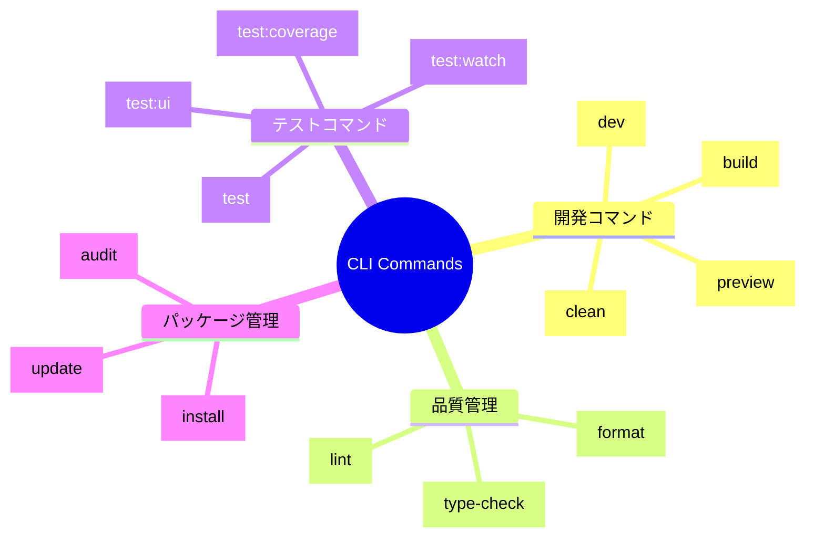

# CLIコマンド一覧

TypeScript Minecraftプロジェクトで利用可能なCLIコマンドの完全リファレンスです。

## 📋 コマンド体系



## 🗂️ コマンドカテゴリ

| カテゴリ                                      | 説明                       | 主要コマンド                          |
| --------------------------------------------- | -------------------------- | ------------------------------------- |
| [**開発コマンド**](./development-commands.md) | 開発・ビルド・プレビュー   | `dev`, `build`, `preview`             |
| [**テストコマンド**](./testing-commands.md)   | テスト実行・カバレッジ測定 | `test`, `test:watch`, `test:coverage` |

## ⚡ クイックスタート

### 開発開始

```bash
# 依存関係インストール
pnpm install

# 開発サーバー起動
npm run dev
```

### ビルド・デプロイ

```bash
# プロダクションビルド
npm run build

# ビルド結果をプレビュー
pnpm preview
```

### 品質チェック

```bash
# リント・フォーマット・型チェックを一括実行
pnpm check

# テスト実行
npm test
```

## 🔍 コマンド検索

### 目的別コマンド検索

| やりたいこと             | コマンド                | 詳細                                                  |
| ------------------------ | ----------------------- | ----------------------------------------------------- |
| 開発を始めたい           | `npm run dev`           | [開発コマンド](./development-commands.md#dev)         |
| ビルドしたい             | `npm run build`         | [開発コマンド](./development-commands.md#build)       |
| テストしたい             | `npm test`              | [テストコマンド](./testing-commands.md#test)          |
| コードを整形したい       | `npm run format`        | [開発コマンド](./development-commands.md#format)      |
| 型エラーをチェックしたい | `npm run type-check`    | [開発コマンド](./development-commands.md#type-check)  |
| カバレッジを測定したい   | `npm run test:coverage` | [テストコマンド](./testing-commands.md#test-coverage) |

### エラー状況別コマンド

| エラー・問題             | 推奨コマンド         | 詳細                     |
| ------------------------ | -------------------- | ------------------------ | ---------------- |
| 型エラーが発生           | `npm run type-check` | 型エラーの詳細確認       |
| リントエラー             | `npm run lint`       | Biomeエラーの確認       |
| フォーマットが乱れている | `npm run format`     | Biomeによる自動整形   |
| テストが失敗             | `pnpm test:watch`    | ウォッチモードでのテスト |
| ビルドが失敗             | `pnpm build 2>&1     | tee build.log`           | ビルドログの保存 |

## 🛠️ カスタマイゼーション

### 環境変数によるコマンド制御

```bash
# 開発環境でのデバッグ有効化
DEBUG=true npm run dev

# プロダクションビルドの最適化レベル調整
BUILD_OPTIMIZATION=aggressive npm run build

# テストの並列実行数調整
TEST_WORKERS=4 pnpm test
```

### package.jsonスクリプト拡張

```json
{
  "scripts": {
    "dev:debug": "DEBUG=true pnpm dev",
    "build:analyze": "pnpm build && npx vite-bundle-analyzer",
    "test:debug": "pnpm test -- --inspect-brk"
  }
}
```

## 📊 パフォーマンス指標

| コマンド     | 平均実行時間 | メモリ使用量 | 最適化         |
| ------------ | ------------ | ------------ | -------------- |
| `pnpm dev`   | 2-5秒        | 200-400MB    | HMR有効        |
| `pnpm build` | 30-60秒      | 800MB-1.2GB  | Tree-shaking   |
| `pnpm test`  | 5-15秒       | 300-600MB    | 並列実行       |
| `pnpm lint`  | 3-8秒        | 150-300MB    | キャッシュ活用 |

## 🔗 関連リソース

- [Configuration Reference](../configuration/README.md) - 設定ファイルの詳細
- [Troubleshooting](../troubleshooting/README.md) - コマンド実行時のトラブル対応
- [API Reference](../api-reference/README.md) - プログラム内でのコマンド実行API

## 💡 Tips

### 効率的な開発フロー

```bash
# 1. 開発サーバー起動（別ターミナル）
npm run dev

# 2. ウォッチモードでテスト実行（別ターミナル）
pnpm test:watch

# 3. 型チェックを定期実行
watch -n 30 'pnpm typecheck'
```

### CI/CD向けコマンド組み合わせ

```bash
# CI用の完全チェック
pnpm check && pnpm build && pnpm test:coverage
```

## 📝 コマンド追加ガイド

新しいコマンドを追加する場合の手順：

1. **package.jsonのscriptsセクションに追加**
2. **該当カテゴリのドキュメントに記載**
3. **このREADME.mdの検索テーブルを更新**
4. **必要に応じてCI/CDパイプラインを更新**
