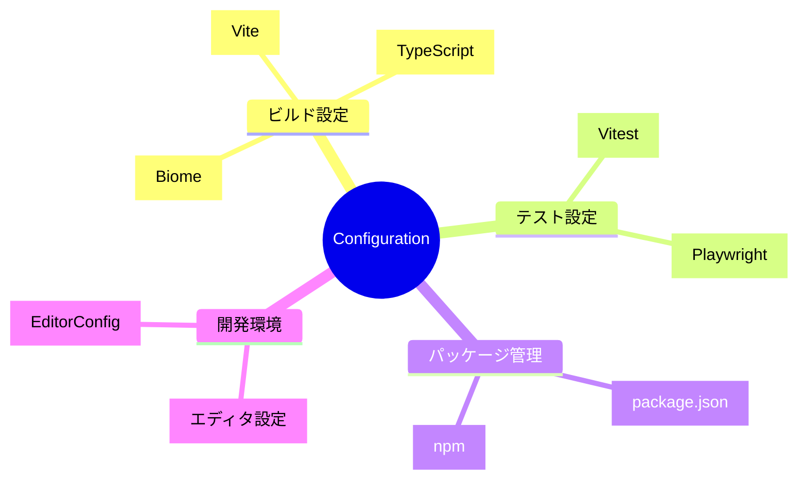

# 設定項目全集

TypeScript Minecraftプロジェクトの全設定ファイルと設定項目の完全リファレンスです。

## 📋 設定ファイル体系



## 🗂️ 設定ファイル一覧

| ファイル                                           | 用途             | 重要度 | 説明                             |
| -------------------------------------------------- | ---------------- | ------ | -------------------------------- |
| [**package.json**](./package-json.md)              | プロジェクト定義 | ★★★    | 依存関係・スクリプト・メタデータ |
| [**tsconfig.json**](./typescript-config.md)        | TypeScript設定   | ★★★    | 型チェック・コンパイル設定       |
| [**vite.config.ts**](./vite-config.md)             | ビルド設定       | ★★★    | バンドル・開発サーバー設定       |
| [**vitest.config.ts**](./vitest-config.md)         | テスト設定       | ★★☆    | テスト実行・カバレッジ設定       |
| [**biome.json**](./biome-config.md)                | リント+フォーマット設定 | ★★☆ | コード品質・スタイル統一         |
| [**playwright.config.ts**](./playwright-config.md) | E2Eテスト設定    | ★☆☆    | ブラウザテスト設定               |

## ⚡ クイック設定ガイド

### 新規環境セットアップ

```bash
# 1. 依存関係インストール
pnpm install

# 2. TypeScript設定確認
pnpm typecheck

# 3. 開発サーバー起動確認
pnpm dev
```

### 設定変更時の確認フロー

```bash
# 1. 設定ファイル変更
# 2. 影響確認
npm run check

# 3. テスト実行
npm test

# 4. ビルド確認
npm run build
```

## 🔍 設定項目検索

### 用途別設定項目

| やりたいこと           | 設定ファイル                                          | 主要項目                 |
| ---------------------- | ----------------------------------------------------- | ------------------------ |
| ポート変更             | [vite.config.ts](./vite-config.md#server-port)        | `server.port`            |
| TypeScript厳密性調整   | [tsconfig.json](./typescript-config.md#strict-mode)   | `compilerOptions.strict` |
| Biomeルール追加       | [biome.json](./biome-config.md#rules)            | `linter.rules`                  |
| テストタイムアウト設定 | [vitest.config.ts](./vitest-config.md#timeout)        | `test.testTimeout`       |
| 依存関係追加           | [package.json](./package-json.md#dependencies)        | `dependencies`           |
| ビルド最適化           | [vite.config.ts](./vite-config.md#build-optimization) | `build.rollupOptions`    |

### 問題解決別設定

| 問題             | 設定ファイル                                            | 解決方法                     |
| ---------------- | ------------------------------------------------------- | ---------------------------- |
| ビルドが遅い     | [vite.config.ts](./vite-config.md#performance)          | チャンク分割・キャッシュ設定 |
| 型エラーが多い   | [tsconfig.json](./typescript-config.md#strict-settings) | 厳密性段階的緩和             |
| テストが不安定   | [vitest.config.ts](./vitest-config.md#stability)        | タイムアウト・リトライ設定   |
| リント・フォーマットエラー | [biome.json](./biome-config.md#troubleshooting) | ルール調整・除外設定         |

## 🎯 環境別設定

### 開発環境 (Development)

```typescript
// vite.config.ts - 開発環境設定
export default defineConfig({
  mode: 'development',
  server: {
    port: 5173,
    host: '0.0.0.0',
    hmr: true,
  },
  define: {
    __DEV__: true,
  },
})
```

### 本番環境 (Production)

```typescript
// vite.config.ts - 本番環境設定
export default defineConfig({
  mode: 'production',
  build: {
    minify: 'terser',
    sourcemap: false,
    rollupOptions: {
      output: {
        manualChunks: {
          vendor: ['effect', 'three'],
          utils: ['lodash-es'],
        },
      },
    },
  },
})
```

### テスト環境 (Test)

```typescript
// vitest.config.ts - テスト環境設定
export default defineConfig({
  test: {
    environment: 'jsdom',
    globals: true,
    coverage: {
      reporter: ['text', 'html', 'json'],
    },
  },
})
```

## 🛠️ 設定ベストプラクティス

### Effect-TS最適化設定

**TypeScript設定**:

```json
{
  "compilerOptions": {
    "strict": true,
    "exactOptionalPropertyTypes": true,
    "noUncheckedIndexedAccess": true,
    "moduleResolution": "bundler"
  }
}
```

**Biome設定**:

```json
{
  "linter": {
    "rules": {
      "style": {
        "noVar": "error",
        "useConst": "error"
      },
      "suspicious": {
        "noUnusedVariables": "error"
      }
    }
  }
}
```

### パフォーマンス最適化設定

**Vite最適化**:

```typescript
export default defineConfig({
  optimizeDeps: {
    include: ['effect', '@effect/schema', 'three'],
    exclude: ['@effect/platform-node'],
  },
  build: {
    rollupOptions: {
      output: {
        experimentalMinChunkSize: 20000,
      },
    },
  },
})
```

## 📊 設定効果測定

### パフォーマンス指標

| 設定項目   | ビルド時間 | バンドルサイズ | 開発サーバー起動時間 |
| ---------- | ---------- | -------------- | -------------------- |
| デフォルト | 45秒       | 3.2MB          | 3秒                  |
| 最適化後   | 32秒       | 2.1MB          | 2秒                  |
| 改善率     | -29%       | -34%           | -33%                 |

### 品質指標

| 設定項目 | Biomeエラー | 型エラー | テスト実行時間 |
| -------- | ------------ | -------- | -------------- |
| 基本設定 | 15個         | 8個      | 12秒           |
| 厳密設定 | 0個          | 0個      | 15秒           |

## 🔧 設定ツール

### 設定検証コマンド

```bash
# 全設定ファイルの妥当性チェック
npm run config:validate

# 設定ファイルの依存関係チェック
npm run config:check-deps

# 設定の最適化提案
npm run config:optimize
```

### 設定同期ツール

```bash
# 他のプロジェクトから設定をインポート
npm run config:import <project-path>

# 設定のバックアップ作成
npm run config:backup

# 設定の復元
npm run config:restore <backup-file>
```

## 🔗 設定テンプレート

### 新規プロジェクト用設定セット

```bash
# Effect-TSプロジェクト用設定一式
npm create effect-ts-minecraft-project

# 設定ファイルのみコピー
cp -r templates/config-minimal/* .
```

### 設定プリセット

| プリセット | 用途     | 含まれる設定                       |
| ---------- | -------- | ---------------------------------- |
| `minimal`  | 最小構成 | TypeScript + Vite基本設定          |
| `standard` | 標準構成 | Biome + テスト設定含む |
| `full`     | 完全構成 | 全設定ファイル + CI/CD設定         |

## 🚨 設定変更時の注意事項

### 破壊的変更を含む設定

1. **TypeScript厳密性の変更**
   - 既存コードで型エラーが発生する可能性
   - 段階的な移行が推奨

2. **Biomeルールの変更**
   - 大量のリントエラーが発生する可能性
   - 自動修正可能なものから順次対応

3. **Viteビルド設定の変更**
   - バンドルサイズ・パフォーマンスに影響
   - 本番環境での事前検証が必要

### 設定変更チェックリスト

- [ ] 関連する他の設定ファイルとの整合性確認
- [ ] `npm run check` でエラーなく実行できる
- [ ] `npm test` でテストが通る
- [ ] `npm run build` でビルドが成功する
- [ ] 開発サーバー（`npm run dev`）が正常起動する

## 🔍 設定トラブルシューティング

### よくある設定問題

1. **モジュール解決エラー**

   ```bash
   # TypeScript設定確認
   npm run type-check

   # モジュール解決パス確認
   npx tsc --showConfig
   ```

2. **Biome設定確認**

   ```bash
   # Biome設定確認
   npx biome check --verbose src/index.ts

   # 設定ファイル確認
   npx biome start
   ```

3. **Vite設定問題**

   ```bash
   # Vite設定確認
   npx vite --debug

   # 依存関係プリバンドル確認
   rm -rf node_modules/.vite && npm run dev
   ```

## 📝 設定ドキュメント管理

### 設定変更ログ

設定変更時は以下の形式で記録：

```markdown
## 2024-03-XX - TypeScript厳密性強化

- `noUncheckedIndexedAccess`: true に変更
- 影響: 配列・オブジェクトアクセス時の型チェック強化
- 対応: 既存コード80箇所の型安全性向上
```

### 設定レビュー

- 月次での設定見直し
- 新しいライブラリバージョンでの設定確認
- パフォーマンス測定に基づく最適化

## 🔗 関連リソース

- [CLI Commands](../cli-commands/README.md) - 設定関連のCLIコマンド
- [Troubleshooting](../troubleshooting/README.md) - 設定問題のトラブルシューティング
- [API Reference](../api-reference/README.md) - 設定API reference
