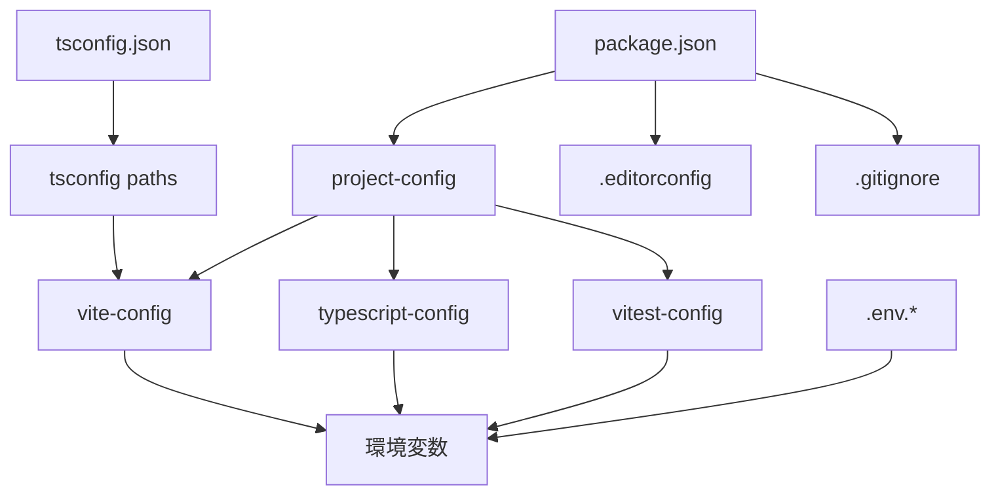

# Project Configuration

> **プロジェクト設定**: プロジェクト全体の設定管理とワークフロー構築

## 概要

TypeScript Minecraftプロジェクトのプロジェクトレベル設定について詳しく解説します。環境変数管理、ワークフロー設定、エディター統合、Git設定など、開発効率を最大化する実用的な設定例を豊富に提供します。

## 基本プロジェクト構成

### プロジェクト構造とメタデータ

```json
// package.json（基本設定）
{
  "name": "ts-minecraft",
  "version": "1.0.0",
  "type": "module",
  "private": true,
  "description": "TypeScript implementation of Minecraft using Three.js and Effect-TS",
  "homepage": "https://github.com/your-org/ts-minecraft#readme",
  "repository": {
    "type": "git",
    "url": "git+https://github.com/your-org/ts-minecraft.git"
  },
  "bugs": {
    "url": "https://github.com/your-org/ts-minecraft/issues"
  },
  "author": "Your Name <your.email@example.com>",
  "license": "MIT",

  // Node.js/npm設定
  "engines": {
    "node": ">=22.0.0",
    "pnpm": ">=8.15.0"
  },
  "packageManager": "pnpm@8.15.0",

  // モジュール設定
  "main": "./dist/index.js",
  "module": "./dist/index.mjs",
  "types": "./dist/index.d.ts",
  "exports": {
    ".": {
      "import": "./dist/index.mjs",
      "require": "./dist/index.js",
      "types": "./dist/index.d.ts"
    }
  },

  // ファイル配布設定
  "files": ["dist", "public", "src", "README.md", "LICENSE"],

  // キーワード（検索性向上）
  "keywords": ["minecraft", "typescript", "three.js", "effect-ts", "voxel", "game", "webgl"]
}
```

## 📋 環境変数管理

### 完全な.env設定例

```bash
# .env.local（ローカル開発用）
# 🔥 機密情報 - Gitには含めない

# 開発サーバー設定
VITE_PORT=3000
VITE_HOST=localhost
VITE_OPEN=true

# API設定
VITE_API_BASE_URL=http://localhost:8080
VITE_WS_URL=ws://localhost:3002

# 機能フラグ
VITE_ENABLE_DEBUG_MODE=true
VITE_ENABLE_PROFILING=true
VITE_ENABLE_EXPERIMENTAL_FEATURES=true

# 外部サービス（開発用ダミー）
VITE_ANALYTICS_ID=dev-analytics
VITE_SENTRY_DSN=dev-sentry-dsn

# パフォーマンス設定
VITE_MAX_CHUNKS=16
VITE_PRELOAD_CHUNKS=true

# セキュリティ設定（開発用）
VITE_CSP_ENABLED=false
VITE_CORS_ORIGIN=*
```

```bash
# .env.production（本番環境用）
# 🚀 本番設定 - セキュリティ重視

# 本番API
VITE_API_BASE_URL=https://api.minecraft-ts.example.com
VITE_WS_URL=wss://ws.minecraft-ts.example.com

# 機能フラグ（本番）
VITE_ENABLE_DEBUG_MODE=false
VITE_ENABLE_PROFILING=false
VITE_ENABLE_EXPERIMENTAL_FEATURES=false

# 外部サービス（本番）
VITE_ANALYTICS_ID=prod-ga4-measurement-id
VITE_SENTRY_DSN=https://your-sentry-dsn@sentry.io/project-id

# パフォーマンス最適化
VITE_MAX_CHUNKS=8
VITE_PRELOAD_CHUNKS=false
VITE_CDN_URL=https://cdn.minecraft-ts.example.com

# セキュリティ強化
VITE_CSP_ENABLED=true
VITE_CORS_ORIGIN=https://minecraft-ts.example.com
VITE_RATE_LIMIT_ENABLED=true
```

```bash
# .env.test（テスト環境用）
# 🧪 テスト専用設定

# テストサーバー
VITE_API_BASE_URL=http://localhost:8081
VITE_WS_URL=ws://localhost:3003

# テスト用機能
VITE_ENABLE_TEST_UTILS=true
VITE_ENABLE_MOCKS=true
VITE_ENABLE_COVERAGE=true

# テストパフォーマンス
VITE_TEST_TIMEOUT=30000
VITE_MAX_WORKERS=4

# テスト用外部サービス
VITE_ANALYTICS_ID=test-analytics
VITE_SENTRY_DSN=test-sentry-dsn
```

### TypeScript環境変数型定義

```typescript
// src/types/env.d.ts
/// <reference types="vite/client" />

interface ImportMetaEnv {
  // サーバー設定
  readonly VITE_PORT: string
  readonly VITE_HOST: string
  readonly VITE_OPEN: string

  // API設定
  readonly VITE_API_BASE_URL: string
  readonly VITE_WS_URL: string
  readonly VITE_CDN_URL?: string

  // 機能フラグ
  readonly VITE_ENABLE_DEBUG_MODE: string
  readonly VITE_ENABLE_PROFILING: string
  readonly VITE_ENABLE_EXPERIMENTAL_FEATURES: string
  readonly VITE_ENABLE_TEST_UTILS?: string
  readonly VITE_ENABLE_MOCKS?: string

  // 外部サービス
  readonly VITE_ANALYTICS_ID: string
  readonly VITE_SENTRY_DSN: string

  // パフォーマンス
  readonly VITE_MAX_CHUNKS: string
  readonly VITE_PRELOAD_CHUNKS: string
  readonly VITE_TEST_TIMEOUT?: string
  readonly VITE_MAX_WORKERS?: string

  // セキュリティ
  readonly VITE_CSP_ENABLED: string
  readonly VITE_CORS_ORIGIN: string
  readonly VITE_RATE_LIMIT_ENABLED?: string
}

interface ImportMeta {
  readonly env: ImportMetaEnv
}

// 実行時設定アクセスヘルパー
declare global {
  interface Window {
    __APP_CONFIG__: {
      apiBaseUrl: string
      wsUrl: string
      debugMode: boolean
      version: string
    }
  }
}
```

### 環境別設定管理

```typescript
// src/config/env.ts
import { Effect, Layer, Context } from 'effect'
import { Schema } from '@effect/schema'

// 環境変数スキーマ定義
const EnvConfigSchema = Schema.Struct({
  // サーバー設定
  port: Schema.NumberFromString.pipe(Schema.int(), Schema.positive()),
  host: Schema.String,

  // API設定
  apiBaseUrl: Schema.String.pipe(Schema.startsWith('http')),
  wsUrl: Schema.String.pipe(Schema.startsWith('ws')),
  cdnUrl: Schema.optional(Schema.String),

  // 機能フラグ
  debugMode: Schema.transform(Schema.String, Schema.Boolean, {
    strict: true,
    decode: (s) => s === 'true',
    encode: (b) => String(b),
  }),
  profilingEnabled: Schema.BooleanFromString,
  experimentalFeatures: Schema.BooleanFromString,

  // 外部サービス
  analyticsId: Schema.String,
  sentryDsn: Schema.String,

  // パフォーマンス設定
  maxChunks: Schema.NumberFromString.pipe(Schema.int(), Schema.positive()),
  preloadChunks: Schema.BooleanFromString,

  // セキュリティ設定
  cspEnabled: Schema.BooleanFromString,
  corsOrigin: Schema.String,
  rateLimitEnabled: Schema.optional(Schema.BooleanFromString),
})

type EnvConfig = Schema.Schema.Type<typeof EnvConfigSchema>

// 環境設定Context - 関数型パターン
export const EnvConfigService = Context.GenericTag<EnvConfig>('@app/EnvConfigService')

// 環境変数の読み込みと検証
const loadEnvConfig = (): Effect.Effect<EnvConfig, Error> =>
  Effect.try(() => ({
    port: import.meta.env.VITE_PORT || '3000',
    host: import.meta.env.VITE_HOST || 'localhost',
    apiBaseUrl: import.meta.env.VITE_API_BASE_URL,
    wsUrl: import.meta.env.VITE_WS_URL,
    cdnUrl: import.meta.env.VITE_CDN_URL,
    debugMode: import.meta.env.VITE_ENABLE_DEBUG_MODE || 'false',
    profilingEnabled: import.meta.env.VITE_ENABLE_PROFILING || 'false',
    experimentalFeatures: import.meta.env.VITE_ENABLE_EXPERIMENTAL_FEATURES || 'false',
    analyticsId: import.meta.env.VITE_ANALYTICS_ID,
    sentryDsn: import.meta.env.VITE_SENTRY_DSN,
    maxChunks: import.meta.env.VITE_MAX_CHUNKS || '16',
    preloadChunks: import.meta.env.VITE_PRELOAD_CHUNKS || 'true',
    cspEnabled: import.meta.env.VITE_CSP_ENABLED || 'false',
    corsOrigin: import.meta.env.VITE_CORS_ORIGIN || '*',
    rateLimitEnabled: import.meta.env.VITE_RATE_LIMIT_ENABLED,
  })).pipe(Effect.flatMap(Schema.decodeUnknown(EnvConfigSchema)))

// 環境設定Layer
export const EnvConfigLive = Layer.effect(EnvConfigService, loadEnvConfig())

// 使用例
export const useEnvConfig = () =>
  Effect.gen(function* () {
    const config = yield* EnvConfigService

    // デバッグモードの確認
    if (config.debugMode) {
      console.log('Debug mode enabled')
    }

    // API URL構築
    const apiUrl = config.cdnUrl ? `${config.cdnUrl}/api` : `${config.apiBaseUrl}/api`

    return { ...config, apiUrl }
  })
```

## 🔧 開発ワークフロー設定

### Git設定とフック

```bash
# .gitignore（完全版）
# 依存関係
node_modules/
.pnpm-store/
.npm/

# ビルド成果物
dist/
build/
.vite/
.turbo/

# ログ
*.log
logs/
.pnpm-debug.log*

# 環境設定
.env.local
.env.production.local
.env.test.local

# エディタ設定
.vscode/
.idea/
*.swp
*.swo

# OS生成ファイル
.DS_Store
Thumbs.db

# テスト
coverage/
.nyc_output/
junit.xml

# 一時ファイル
tmp/
temp/
*.tmp
*.temp

# キャッシュ
.cache/
.parcel-cache/

# バックアップ
*.bak
*.backup
```

```json
# .husky/pre-commit（品質チェック）
#!/usr/bin/env sh
. "$(dirname -- "$0")/_/husky.sh"

# ステージングファイルのリント
npx lint-staged

# 型チェック
pnpm typecheck

# テスト実行（変更ファイルのみ）
pnpm test:related
```

```json
# .husky/commit-msg（コミットメッセージ検証）
#!/usr/bin/env sh
. "$(dirname -- "$0")/_/husky.sh"

# Conventional Commits準拠チェック
npx commitlint --edit "$1"
```

```json
# .lintstagedrc.json（段階的品質チェック）
{
  "*.{ts,tsx}": [
    "oxlint --fix",
    "pnpm typecheck:file"
  ],
  "*.{js,jsx}": [
    "oxlint --fix"
  ],
  "*.{css,scss,sass}": [
    "oxlint --fix",
    "stylelint --fix"
  ],
  "*.{json,md,yml,yaml}": [
    "oxlint --fix"
  ],
  "package.json": [
    "sort-package-json"
  ]
}
```

### EditorConfig設定

```ini
# .editorconfig
root = true

[*]
charset = utf-8
end_of_line = lf
insert_final_newline = true
trim_trailing_whitespace = true
indent_style = space
indent_size = 2

[*.{js,ts,tsx,vue}]
indent_size = 2

[*.{json,yml,yaml}]
indent_size = 2

[*.md]
trim_trailing_whitespace = false

[*.{py,go}]
indent_size = 4

[Makefile]
indent_style = tab
```

## 🚀 環境別プロジェクト設定

### 開発環境設定

```typescript
// config/development.ts
export const developmentConfig = {
  // デバッグ設定
  debug: {
    enabled: true,
    level: 'verbose',
    showWarnings: true,
    enableSourceMaps: true,
  },

  // ホットリロード設定
  hotReload: {
    enabled: true,
    overlay: true,
    liveReload: false, // HMRを優先
  },

  // パフォーマンス設定（開発用）
  performance: {
    bundleAnalyzer: false,
    memoryLimit: '2048mb',
    optimizeChunks: false, // 開発速度を優先
  },

  // Three.js開発設定
  threejs: {
    enableStats: true,
    enableAxesHelper: true,
    enableGridHelper: true,
    shadowMapType: 'BasicShadowMap', // 軽量版
  },

  // Effect-TS開発設定
  effectTS: {
    enableTracing: true,
    logLevel: 'Debug',
    enableFiberDump: true,
  },

  // Mock設定
  mocks: {
    enabled: true,
    apiDelay: 500, // レスポンス遅延シミュレーション
    errorRate: 0.1, // 10%でエラー発生
  },
}
```

### 本番環境設定

```typescript
// config/production.ts
export const productionConfig = {
  // 最適化設定
  optimization: {
    minify: true,
    treeshaking: true,
    codesplitting: true,
    compression: 'gzip',
  },

  // セキュリティ設定
  security: {
    csp: {
      enabled: true,
      directives: {
        defaultSrc: ["'self'"],
        scriptSrc: ["'self'", "'unsafe-eval'"], // Three.js用
        styleSrc: ["'self'", "'unsafe-inline'"],
        imgSrc: ["'self'", 'data:', 'https:'],
        connectSrc: ["'self'", 'wss:', 'https:'],
      },
    },
    hsts: true,
    noSniff: true,
  },

  // パフォーマンス設定
  performance: {
    maxAssetSize: 512000, // 500KB
    maxEntrypointSize: 512000,
    assetOptimization: true,
    preloadCriticalChunks: true,
  },

  // Three.js本番設定
  threejs: {
    enableStats: false,
    shadowMapType: 'PCFSoftShadowMap', // 高品質版
    powerPreference: 'high-performance',
    antialias: true,
  },

  // Effect-TS本番設定
  effectTS: {
    enableTracing: false,
    logLevel: 'Error',
    enableFiberDump: false,
  },

  // 監視設定
  monitoring: {
    sentry: {
      enabled: true,
      sampleRate: 0.1,
      tracesSampleRate: 0.01,
    },
    analytics: {
      enabled: true,
      anonymizeIp: true,
    },
  },
}
```

### CI/CD設定

```typescript
// config/ci.ts
export const ciConfig = {
  // テスト設定
  testing: {
    coverage: {
      threshold: {
        global: {
          branches: 80,
          functions: 80,
          lines: 80,
          statements: 80,
        },
      },
    },
    timeout: 60000,
    retries: 3,
  },

  // ビルド設定
  build: {
    parallel: true,
    cacheEnabled: true,
    nodeOptions: '--max-old-space-size=4096',
  },

  // 品質ゲート
  qualityGates: {
    typeCheck: true,
    lint: true,
    formatCheck: true,
    securityScan: true,
  },
}
```

## 🎯 パフォーマンス設定

### バンドルサイズ最適化

```typescript
// config/bundle-optimization.ts
export const bundleOptimization = {
  // チャンク分割戦略
  chunks: {
    // ライブラリ別分割
    vendor: {
      'effect-core': ['effect', '@effect/schema'],
      'three-core': ['three'],
      'three-extras': ['three/examples/jsm'],
      utils: ['lodash-es', 'date-fns'],
    },

    // 機能別分割
    features: {
      'game-core': ['./src/domain', './src/application/core'],
      'game-systems': ['./src/application/systems'],
      'game-ui': ['./src/presentation/components'],
      'game-renderer': ['./src/infrastructure/rendering'],
    },

    // 動的インポート対象
    dynamic: ['./src/workers/*', './src/assets/models/*', './src/locales/*'],
  },

  // Tree shaking設定
  treeShaking: {
    sideEffects: false,
    usedExports: true,
    providedExports: true,
    concatenateModules: true,
  },
}
```

### メモリ管理設定

```typescript
// config/memory-management.ts
export const memoryManagement = {
  // Three.js メモリ設定
  threejs: {
    textureDisposal: {
      enabled: true,
      interval: 30000, // 30秒間隔
      maxUnusedTime: 120000, // 2分未使用で破棄
    },
    geometryPooling: {
      enabled: true,
      maxPoolSize: 100,
    },
    materialCaching: {
      enabled: true,
      maxCacheSize: 50,
    },
  },

  // Effect-TS メモリ設定
  effectTS: {
    fiberCleaning: {
      enabled: true,
      interval: 60000,
    },
    contextPooling: {
      enabled: true,
      maxPoolSize: 20,
    },
  },

  // ワーカー設定
  workers: {
    maxWorkers: navigator.hardwareConcurrency || 4,
    workerTerminationTimeout: 10000,
  },
}
```

## 🧪 テスト環境設定

### テスト設定パターン

```typescript
// config/test-environments.ts
export const testEnvironments = {
  // ユニットテスト環境
  unit: {
    environment: 'jsdom',
    setupFiles: ['./src/test/setup.ts'],
    testMatch: ['**/*.test.ts', '**/*.spec.ts'],
    collectCoverageFrom: ['src/**/*.ts', '!src/**/*.d.ts', '!src/test/**/*'],
  },

  // 統合テスト環境
  integration: {
    environment: 'jsdom',
    setupFiles: ['./src/test/integration-setup.ts'],
    testMatch: ['**/*.integration.test.ts'],
    timeout: 30000,
  },

  // E2Eテスト環境
  e2e: {
    baseURL: 'http://localhost:3000',
    browsers: ['chromium', 'firefox'],
    screenshot: 'only-on-failure',
    video: 'retain-on-failure',
  },

  // Effect-TSテスト設定
  effectTS: {
    testLayer: 'TestLayer',
    mockServices: true,
    timeoutMultiplier: 2,
  },
}
```

## 🔍 監視・ログ設定

### 包括的ログ設定

```typescript
// config/logging.ts
export const loggingConfig = {
  // 環境別ログレベル
  levels: {
    development: 'debug',
    test: 'warn',
    staging: 'info',
    production: 'error',
  },

  // ログフォーマット
  format: {
    timestamp: true,
    colorize: true,
    errors: { stack: true },
  },

  // ログ出力先
  transports: {
    console: {
      enabled: true,
      level: 'debug',
    },
    file: {
      enabled: false, // ブラウザでは無効
      filename: 'app.log',
      maxsize: 10485760, // 10MB
      maxFiles: 5,
    },
    remote: {
      enabled: true,
      endpoint: '/api/logs',
      batchSize: 10,
      flushInterval: 5000,
    },
  },

  // Effect-TS ログ統合
  effectTS: {
    enableFiberTracing: false,
    logSpans: true,
    logLevel: 'Info',
  },
}
```

## 🛠️ トラブルシューティング

### よくある設定問題と解決法

#### 1. 環境変数が読み込まれない

**症状**: `import.meta.env.VITE_*` が undefined

**解決策**:

```bash
# 1. 環境変数ファイルの確認
ls -la .env*

# 2. ファイル名の確認（ピリオド忘れ注意）
# ❌ 間違い: env.local
# ✅ 正解: .env.local

# 3. 変数名プレフィックス確認
# ❌ 間違い: API_URL=...
# ✅ 正解: VITE_API_URL=...
```

#### 2. Git hooksが動作しない

**症状**: pre-commit、commit-msgが実行されない

**解決策**:

```bash
# Huskyの再インストール
pnpm husky install

# フック権限の確認・修正
chmod +x .husky/pre-commit
chmod +x .husky/commit-msg

# Git設定の確認
git config core.hooksPath
```

#### 3. パフォーマンス問題

**症状**: 開発サーバーが遅い、メモリ不足

**解決策**:

```bash
# Node.jsメモリ制限増加
NODE_OPTIONS="--max-old-space-size=8192" pnpm dev

# 依存関係の最適化
pnpm rebuild
rm -rf node_modules/.vite
pnpm dev
```

#### 4. 型エラーが解決しない

**症状**: TypeScript型エラーが環境間で異なる

**解決策**:

```bash
# TypeScriptキャッシュクリア
pnpm tsc --build --clean

# Node.js/npm環境統一確認
node --version  # 推奨: v20.x
pnpm --version  # 推奨: v8.x

# 型定義の再インストール
pnpm add -D @types/node@latest
```

## 📊 設定の依存関係

### 設定ファイル間の依存関係マップ



### 設定変更時のチェックリスト

1. **環境変数変更時**:
   - [ ] 型定義更新 (`src/types/env.d.ts`)
   - [ ] 全環境の.envファイル更新
   - [ ] CI/CD環境変数設定

2. **依存関係変更時**:
   - [ ] package.jsonバージョン更新
   - [ ] 型定義パッケージ確認
   - [ ] Vite最適化設定確認

3. **ビルド設定変更時**:
   - [ ] 開発環境での動作確認
   - [ ] 本番ビルドテスト
   - [ ] パフォーマンス影響測定

## 🛠️ Nix環境統合設定

### devenv.nix プロジェクト設定

```nix
# devenv.nix - プロジェクト全体のNix設定
{ pkgs, config, inputs, ... }: {
  cachix.enable = false;
  dotenv.disableHint = true;

  # プロジェクト依存パッケージ
  packages = with pkgs; [
    # 開発必須ツール
    typescript
    typescript-language-server
    nodejs_22
    nodePackages.pnpm

    # 開発効率化ツール
    git
    curl
    jq
    tree
    ripgrep
    fd

    # ブラウザー（開発・テスト用）
    chromium
    firefox

    # システム統合ツール
    direnv
    nix-direnv
  ];

  # Node.js環境設定
  languages.javascript = {
    enable = true;
    pnpm.enable = true;
    package = pkgs.nodejs_22;
    corepack.enable = true;
  };

  # TypeScript統合
  languages.typescript.enable = true;

  # 開発用環境変数
  env = {
    # プロジェクト情報
    PROJECT_NAME = "ts-minecraft";
    PROJECT_VERSION = "1.0.0";
    NODE_ENV = "development";

    # Nix固有設定
    NIX_PROJECT = "true";
    DEVENV_PROJECT_ROOT = "${toString ./.}";

    # パフォーマンス最適化
    NODE_OPTIONS = "--max-old-space-size=4096 --experimental-vm-modules";

    # TypeScript設定
    TS_NODE_COMPILER_OPTIONS = builtins.toJSON {
      module = "NodeNext";
      target = "ES2022";
      moduleResolution = "NodeNext";
    };

    # 開発ツール設定
    BROWSER = "chromium";
    EDITOR = "\${EDITOR:-code}";
    PAGER = "less -R";

    # Vite設定
    VITE_DEV_MODE = "true";
    VITE_NIX_ENV = "true";
  };

  # 開発用スクリプト
  scripts = {
    setup.exec = ''
      echo "🏗️  Setting up TypeScript Minecraft project..."
      echo "Node.js: $(node --version)"
      echo "pnpm: $(pnpm --version)"
      echo "TypeScript: $(tsc --version)"

      if [ ! -f "pnpm-lock.yaml" ]; then
        echo "📦 Installing dependencies..."
        pnpm install
      else
        echo "✅ Dependencies already installed"
      fi

      echo "🚀 Project setup complete!"
    '';

    dev.exec = ''
      echo "🚀 Starting development server..."
      pnpm dev
    '';

    build.exec = ''
      echo "🏗️  Building project..."
      pnpm build
    '';

    test.exec = ''
      echo "🧪 Running tests..."
      pnpm test
    '';

    check.exec = ''
      echo "🔍 Running all checks..."
      pnpm typecheck
      pnpm lint
      pnpm test
    '';

    clean.exec = ''
      echo "🧹 Cleaning build artifacts..."
      rm -rf dist node_modules/.vite node_modules/.cache .tsbuildinfo
      echo "✅ Clean complete"
    '';
  };

  # プロセス管理（開発サーバー）
  processes = {
    vite-dev = {
      exec = "pnpm dev";
      process-compose = {
        availability = {
          restart = "on_failure";
          max_restarts = 3;
        };
      };
    };
  };

  # Git設定
  git = {
    hooks = {
      pre-commit = ''
        echo "🔍 Running pre-commit checks..."
        pnpm lint-staged
      '';
      commit-msg = ''
        echo "📝 Validating commit message..."
        pnpm commitlint --edit "$1"
      '';
    };
  };

  # 開発サービス（必要に応じて有効化）
  services = {
    postgres = {
      enable = false;
      listen_addresses = "127.0.0.1";
      port = 5432;
      initialDatabases = [
        { name = "ts_minecraft_dev"; }
      ];
    };

    redis = {
      enable = false;
      port = 6379;
    };
  };

  # プロジェクトメタデータ
  devcontainer = {
    enable = false; # devenv使用時は通常不要
    settings = {
      name = "TypeScript Minecraft";
      customizations = {
        vscode = {
          extensions = [
            "ms-vscode.vscode-typescript-next"
            "oxc-project.oxc-vscode"
          ];
        };
      };
    };
  };
}
```

### Nix Flake統合

```nix
# flake.nix - Nixプロジェクト定義
{
  description = "TypeScript Minecraft - Nix development environment";

  inputs = {
    nixpkgs.url = "github:NixOS/nixpkgs/nixos-unstable";
    devenv.url = "github:cachix/devenv";
    nix2container.url = "github:nlewo/nix2container";
    nix2container.inputs.nixpkgs.follows = "nixpkgs";
    mk-shell-bin.url = "github:rrbutani/nix-mk-shell-bin";
  };

  outputs = inputs@{ flake-parts, nixpkgs, devenv, ... }:
    flake-parts.lib.mkFlake { inherit inputs; } {
      imports = [
        inputs.devenv.flakeModule
      ];
      systems = [ "x86_64-linux" "i686-linux" "x86_64-darwin" "aarch64-linux" "aarch64-darwin" ];

      perSystem = { config, self', inputs', pkgs, system, ... }: {
        # devenv環境定義
        devenv.shells.default = {
          name = "ts-minecraft-dev";

          imports = [
            ./devenv.nix
          ];

          # 追加のNix設定
          packages = with pkgs; [
            # CI/CD ツール
            act # GitHub Actions local runner

            # パフォーマンス分析
            hyperfine

            # デバッグツール
            lldb
            gdb
          ];

          # 開発用証明書生成
          scripts.generate-certs.exec = ''
            mkdir -p certs
            if [ ! -f "certs/key.pem" ]; then
              echo "🔐 Generating development certificates..."
              ${pkgs.openssl}/bin/openssl req -x509 -newkey rsa:4096 -keyout certs/key.pem -out certs/cert.pem -days 365 -nodes -subj '/CN=localhost'
              echo "✅ Development certificates generated"
            fi
          '';

          enterShell = ''
            echo "🏗️  TypeScript Minecraft Development Environment"
            echo "================================================"
            echo ""
            echo "🔧 Available commands:"
            echo "  setup  - Initial project setup"
            echo "  dev    - Start development server"
            echo "  build  - Build project"
            echo "  test   - Run tests"
            echo "  check  - Run all quality checks"
            echo "  clean  - Clean build artifacts"
            echo ""
            echo "📝 Quick start:"
            echo "  1. Run 'setup' to initialize the project"
            echo "  2. Run 'dev' to start development server"
            echo ""
          '';
        };

        # Dockerイメージビルド（本番用）
        packages = {
          dockerImage = pkgs.dockerTools.buildImage {
            name = "ts-minecraft";
            tag = "latest";

            contents = with pkgs; [
              nodejs_22
              coreutils
              bash
            ];

            config = {
              Cmd = [ "node" "dist/index.js" ];
              WorkingDir = "/app";
              ExposedPorts = {
                "3000/tcp" = {};
              };
            };
          };

          # 本番用最適化ビルド
          production-build = pkgs.stdenv.mkDerivation {
            name = "ts-minecraft-prod";
            src = ./.;

            buildInputs = with pkgs; [
              nodejs_22
              nodePackages.pnpm
              typescript
            ];

            buildPhase = ''
              export HOME=$(mktemp -d)
              pnpm config set store-dir $HOME/.pnpm-store
              pnpm install --frozen-lockfile --production=false
              pnpm build
            '';

            installPhase = ''
              mkdir -p $out
              cp -r dist $out/
              cp package.json $out/
            '';
          };
        };
      };

      # CI/CDフック
      flake = {
        # GitHub Actions統合
        nixConfig = {
          extra-trusted-public-keys = "devenv.cachix.org-1:w1cLUi8dv3hnoSPGAuibQv+f9TZLr6cv/Hm9XgU50cw=";
          extra-substituters = "https://devenv.cachix.org";
        };
      };
    };
}
```

### package.json Nix統合拡張

```json
{
  "scripts": {
    // Nix開発環境用スクリプト
    "nix:setup": "nix develop --command setup",
    "nix:dev": "nix develop --command dev",
    "nix:build": "nix develop --command build",
    "nix:test": "nix develop --command test",
    "nix:check": "nix develop --command check",
    "nix:clean": "nix develop --command clean",

    // Docker統合
    "docker:build": "nix build .#dockerImage",
    "docker:load": "docker load < result",
    "docker:run": "docker run -p 3000:3000 ts-minecraft:latest",

    // Nix環境確認
    "env:check": "echo 'Node.js:' $(node --version) && echo 'pnpm:' $(pnpm --version) && echo 'TypeScript:' $(tsc --version)",
    "env:nix-info": "nix --version && echo 'devenv active:' ${DEVENV_ROOT:-'false'}"
  },

  // Nix環境での依存関係最適化
  "pnpm": {
    "overrides": {
      // Nix store由来のパッケージを優先
      "typescript": "^5.6.0",
      "@types/node": "^22.0.0"
    },
    "packageExtensions": {
      "effect": {
        "peerDependencies": {
          "typescript": "^5.6.0"
        }
      }
    }
  },

  // Nix環境メタデータ
  "nix": {
    "devenv": {
      "enable": true,
      "configFile": "./devenv.nix"
    },
    "flake": {
      "enable": true,
      "configFile": "./flake.nix"
    },
    "requirements": {
      "node": "22.x",
      "pnpm": "8.x",
      "typescript": "5.x"
    }
  }
}
```

### .envrc（direnv統合）

```bash
# .envrc - 自動環境切り替え
if ! has nix_direnv_version || ! nix_direnv_version 3.0.4; then
  source_url "https://raw.githubusercontent.com/nix-community/nix-direnv/3.0.4/direnvrc" "sha256-DzlYZ33mWF/Gs8DDeyjr8mnVmQGx7ASYqA5WlxwvBG4="
fi

# devenv環境の読み込み
use devenv

# プロジェクト固有の環境変数
export PROJECT_ROOT="$(pwd)"
export PATH_add="$PROJECT_ROOT/node_modules/.bin"

# 開発用設定
export NODE_ENV=development
export DEBUG="ts-minecraft:*"

# Nix環境確認
if [ -n "${DEVENV_ROOT:-}" ]; then
  echo "✅ devenv environment loaded"
  echo "   Project: ts-minecraft"
  echo "   Node.js: $(node --version 2>/dev/null || echo 'not available')"
  echo "   devenv root: $DEVENV_ROOT"
else
  echo "⚠️  devenv environment not active"
  echo "   Run 'direnv allow' to enable automatic environment loading"
fi
```

### Nix CI/CD統合

```yaml
# .github/workflows/nix.yml
name: Nix CI/CD

on:
  push:
    branches: [main, develop]
  pull_request:
    branches: [main]

jobs:
  nix-build:
    runs-on: ubuntu-latest
    steps:
      - uses: actions/checkout@v4

      - name: Install Nix
        uses: cachix/install-nix-action@v25
        with:
          github_access_token: ${{ secrets.GITHUB_TOKEN }}

      - name: Setup Cachix
        uses: cachix/cachix-action@v14
        with:
          name: devenv

      - name: Build with Nix
        run: |
          nix develop --command setup
          nix develop --command build

      - name: Run tests with Nix
        run: nix develop --command test

      - name: Quality checks
        run: nix develop --command check

      - name: Build Docker image
        if: github.ref == 'refs/heads/main'
        run: |
          nix build .#dockerImage
          docker load < result
          echo "ts-minecraft:latest" > image-name.txt

      - name: Upload Docker image
        if: github.ref == 'refs/heads/main'
        uses: actions/upload-artifact@v4
        with:
          name: docker-image
          path: |
            result
            image-name.txt
```

## 📚 関連ドキュメント

### 設定ファイル関連

- [Package.json設定](./package-json.md) - npm/pnpmパッケージ管理
- [TypeScript設定](./typescript-config.md) - TypeScript compilerOptions
- [Vite設定](./vite-config.md) - Vite開発・ビルド設定
- [Vitest設定](./vitest-config.md) - テスト実行環境
- [Build設定](./build-config.md) - ビルドパイプライン
- [Development設定](./development-config.md) - 開発環境最適化
- [devenv.nix](../../../devenv.nix) - Nix開発環境設定
- [flake.nix](../../../flake.nix) - Nixプロジェクト定義

### 外部リファレンス

- [Node.js環境変数](https://nodejs.org/api/process.html#process_process_env)
- [Vite環境変数](https://vitejs.dev/guide/env-and-mode.html)
- [Git Hooks](https://git-scm.com/docs/githooks)
- [EditorConfig](https://editorconfig.org/)

### プロジェクト固有

- [開発ガイド](../../how-to/development/README.md)
- [デプロイガイド](../../how-to/deployment/README.md)
- [トラブルシューティング](../troubleshooting/README.md)
