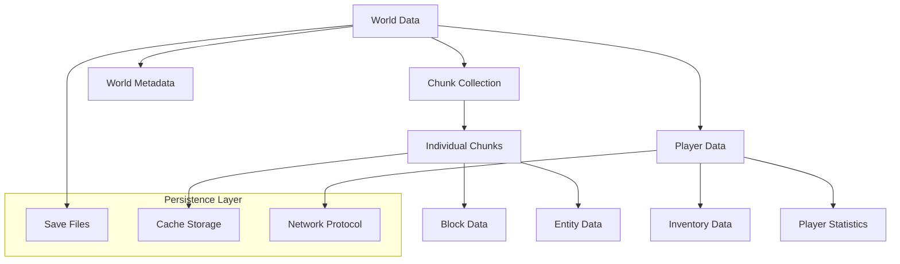

# データモデル仕様書

TypeScript Minecraft Cloneにおける、Effect-TS Schemaベースの型安全なデータモデル設計と実装仕様。DDD原則に基づくドメイン駆動設計とパフォーマンス最適化を重視したデータアーキテクチャを定義します。

## 📊 データアーキテクチャ概要

### 🏗️ **階層構造**


## 📋 データモデル仕様書一覧

### 🌍 **ワールドデータ**
- **[ワールドデータ構造](world-data-structure.md)** - ゲーム世界全体のデータ構造設計
- **[チャンク形式](chunk-format.md)** - 16x16x256ブロック単位のデータ形式
- **[セーブファイル形式](save-file-format.md)** - ゲーム状態の永続化フォーマット

## 🎯 設計原則

### 📐 **型安全性とスキーマ駆動設計**
Effect-TS 3.17+ Schemaによる完全な型安全性とランタイム検証を実現:

```typescript
import { Schema, Brand, Match, Effect, Context } from "effect"

// Brand型による厳密な型区別
export type BlockId = string & Brand.Brand<"BlockId">
export type ChunkCoordinate = string & Brand.Brand<"ChunkCoordinate">

export const BlockId = Brand.nominal<BlockId>()
export const ChunkCoordinate = Brand.nominal<ChunkCoordinate>()

// 統一されたスキーマ定義パターン
export const PositionSchema = Schema.Struct({
  x: Schema.Number,
  y: Schema.Number.pipe(Schema.clamp(-64, 320)), // ワールド高度制限
  z: Schema.Number
})

export const BlockStateSchema = Schema.Struct({
  id: Schema.String.pipe(Schema.brand(BlockId)),
  material: Schema.Literal("stone", "wood", "dirt", "air", "water"),
  position: PositionSchema,
  properties: Schema.Record({
    key: Schema.String,
    value: Schema.Union(
      Schema.String,
      Schema.Number,
      Schema.Boolean
    )
  }),
  hardness: Schema.Number.pipe(Schema.between(0, 50)),
  lightLevel: Schema.Number.pipe(Schema.clamp(0, 15)),
  waterlogged: Schema.Boolean,
  transparent: Schema.Boolean
})

// 型の自動導出
export interface Position extends Schema.Schema.Type<typeof PositionSchema> {}
export interface BlockState extends Schema.Schema.Type<typeof BlockStateSchema> {}
```

### 🔄 **関数型イミュータブル設計**
すべてのデータ構造は不変性を保持し、Effect型による副作用管理と関数合成を活用:

```typescript
// イミュータブルなワールドデータ構造
export interface WorldData {
  readonly id: WorldId
  readonly name: string
  readonly seed: number
  readonly dimensions: ReadonlyMap<DimensionId, DimensionData>
  readonly metadata: WorldMetadata
  readonly createdAt: Date
  readonly lastModified: Date
}

// 関数型更新パターンとEffect合成
export const updateBlockState = (
  world: WorldData,
  position: Position,
  newState: BlockState
): Effect.Effect<WorldData, WorldError, WorldService> =>
  Effect.gen(function* () {
    const chunkCoord = yield* calculateChunkCoordinate(position)
    const chunk = yield* WorldService.getChunk(chunkCoord)

    const updatedChunk = yield* ChunkService.setBlockState(
      chunk,
      toLocalPosition(position),
      newState
    )

    const updatedWorld = pipe(
      world,
      updateDimension(DimensionId("overworld"), dimension =>
        updateChunk(dimension, chunkCoord, updatedChunk)
      ),
      updateMetadata(metadata => ({
        ...metadata,
        lastModified: new Date(),
        modificationCount: metadata.modificationCount + 1
      }))
    )

    return updatedWorld
  })

// パイプライン合成による複合操作
export const placeBlocksInArea = (
  world: WorldData,
  area: BoundingBox,
  blockState: BlockState
): Effect.Effect<WorldData, WorldError, WorldService> =>
  pipe(
    generatePositionsInArea(area),
    Effect.reduce(world, (currentWorld, position) =>
      updateBlockState(currentWorld, position, blockState)
    )
  )
```

### ⚡ **パフォーマンス最適化**
- **遅延読み込み**: 必要時のみデータロード
- **効率的なシリアライゼーション**: バイナリ形式での高速I/O
- **圧縮**: データサイズ削減と転送速度向上
- **差分更新**: 変更分のみの同期

## 🗂️ ドメイン駆動データ分類

### 🌐 **ワールド境界づけられたコンテキスト**
地形生成と永続的な世界構造を管理:

```typescript
// ワールドドメインの集約ルート
export const WorldAggregateSchema = Schema.Struct({
  id: Schema.String.pipe(Schema.brand(WorldId)),
  name: Schema.String.pipe(
    Schema.minLength(1),
    Schema.maxLength(32),
    Schema.pattern(/^[\w\s-]+$/)
  ),
  seed: Schema.BigInt,
  dimensions: Schema.Map({
    key: Schema.String.pipe(Schema.brand(DimensionId)),
    value: DimensionSchema
  }),
  worldBorder: WorldBorderSchema,
  gameRules: GameRulesSchema,
  generatorSettings: GeneratorSettingsSchema
})

// 地形生成データ（不変）
export const TerrainDataSchema = Schema.Struct({
  heightMap: Schema.Array(Schema.Number), // 高度マップ
  biomeMap: Schema.Array(Schema.String.pipe(Schema.brand(BiomeId))),
  structureMap: Schema.Map({
    key: PositionSchema,
    value: StructureReferenceSchema
  }),
  geologicalData: Schema.Struct({
    oreDistribution: Schema.Map({
      key: Schema.String.pipe(Schema.brand(OreTypeId)),
      value: OreVeinSchema
    }),
    caveSystems: Schema.Array(CaveSystemSchema),
    aquifers: Schema.Array(AquiferSchema)
  })
})
```

### 🏃 **ゲーム状態境界づけられたコンテキスト**
リアルタイムで変化するゲーム実行時状態:

```typescript
// ゲーム状態集約
export const GameStateAggregateSchema = Schema.Struct({
  worldTime: Schema.BigInt,
  dayTime: Schema.Number.pipe(Schema.clamp(0, 24000)),
  weather: WeatherStateSchema,
  activeEntities: Schema.Map({
    key: Schema.String.pipe(Schema.brand(EntityId)),
    value: EntityStateSchema
  }),
  chunkStates: Schema.Map({
    key: Schema.String.pipe(Schema.brand(ChunkCoordinate)),
    value: ChunkStateSchema
  }),
  pendingUpdates: Schema.Array(WorldUpdateEventSchema)
})

// エンティティ状態（ECSパターン）
export const EntityStateSchema = Schema.Struct({
  id: Schema.String.pipe(Schema.brand(EntityId)),
  components: Schema.Map({
    key: Schema.String.pipe(Schema.brand(ComponentTypeId)),
    value: ComponentDataSchema
  }),
  version: Schema.Number, // オプティミスティックロッキング用
  lastUpdate: Schema.Date
})
```

### 👤 **プレイヤー境界づけられたコンテキスト**
プレイヤー固有の状態と進行データ:

```typescript
// プレイヤー集約ルート
export const PlayerAggregateSchema = Schema.Struct({
  id: Schema.String.pipe(Schema.brand(PlayerId)),
  profile: PlayerProfileSchema,
  gameState: PlayerGameStateSchema,
  inventory: InventoryAggregateSchema,
  statistics: PlayerStatisticsSchema,
  achievements: Schema.Set(Schema.String.pipe(Schema.brand(AchievementId))),
  preferences: PlayerPreferencesSchema
})

// プレイヤーインベントリ集約
export const InventoryAggregateSchema = Schema.Struct({
  slots: Schema.Array(
    Schema.nullable(ItemStackSchema)
  ).pipe(Schema.itemsCount(36)), // メインインベントリ
  armor: Schema.Array(
    Schema.nullable(ItemStackSchema)
  ).pipe(Schema.itemsCount(4)),
  offhand: Schema.nullable(ItemStackSchema),
  enderChest: Schema.Array(
    Schema.nullable(ItemStackSchema)
  ).pipe(Schema.itemsCount(27)),
  selectedSlot: Schema.Number.pipe(Schema.clamp(0, 8)),
  version: Schema.Number // 並行編集制御
})
```

## 💾 ストレージ戦略

### 🗄️ **ファイルベースストレージ**
```
saves/
├── world_name/
│   ├── world.json          # ワールド設定
│   ├── players/            # プレイヤーデータ
│   │   ├── uuid1.json
│   │   └── uuid2.json
│   └── chunks/             # チャンクデータ
│       ├── 0_0.chunk       # 圧縮バイナリ
│       ├── 0_1.chunk
│       └── region_0_0/     # リージョン単位
│           └── chunks.dat
```

### ⚡ **Effect-TS多階層キャッシュシステム**
```typescript
// Context駆動の階層化キャッシュサービス
export interface CacheService {
  readonly get: <T>(key: string, schema: Schema.Schema<T, T>) => Effect.Effect<Option.Option<T>, CacheError>
  readonly set: <T>(key: string, value: T, schema: Schema.Schema<T, T>) => Effect.Effect<void, CacheError>
  readonly invalidate: (pattern: string) => Effect.Effect<number, CacheError>
  readonly stats: () => Effect.Effect<CacheStats, never>
}

export const CacheService = Context.GenericTag<CacheService>("CacheService")

// 実装例：多段キャッシュ戦略
export const makeCacheService = Effect.gen(function* () {
  // L1: インメモリ高速キャッシュ（LRU）
  const l1Cache = yield* Cache.make({
    capacity: 1000,
    timeToLive: Duration.minutes(5)
  })

  // L2: 永続化キャッシュ（IndexedDB/Redis）
  const l2Cache = yield* PersistentCache.make()

  return CacheService.of({
    get: <T>(key: string, schema: Schema.Schema<T, T>) =>
      pipe(
        l1Cache.get(key),
        Effect.flatMap(Option.match({
          onNone: () => pipe(
            l2Cache.get(key),
            Effect.flatMap(Option.match({
              onNone: () => Effect.succeed(Option.none()),
              onSome: (data) => pipe(
                Schema.decode(schema)(data),
                Effect.flatMap(decoded => pipe(
                  l1Cache.set(key, decoded),
                  Effect.as(Option.some(decoded))
                ))
              )
            }))
          ),
          onSome: (cached) => Effect.succeed(Option.some(cached))
        }))
      ),

    set: <T>(key: string, value: T, schema: Schema.Schema<T, T>) =>
      pipe(
        Schema.encode(schema)(value),
        Effect.flatMap(encoded =>
          Effect.all([
            l1Cache.set(key, value),
            l2Cache.set(key, encoded)
          ])
        ),
        Effect.asVoid
      )
  })
})

// チャンク固有のキャッシュ戦略
export interface ChunkCacheService {
  readonly getChunk: (coord: ChunkCoordinate) => Effect.Effect<Option.Option<ChunkData>, CacheError>
  readonly preloadNearby: (center: ChunkCoordinate, radius: number) => Effect.Effect<void, CacheError>
  readonly markDirty: (coord: ChunkCoordinate) => Effect.Effect<void, CacheError>
  readonly flushDirty: () => Effect.Effect<number, CacheError>
}

export const ChunkCacheService = Context.GenericTag<ChunkCacheService>("ChunkCacheService")

// 使用例：キャッシュ駆動のチャンク管理
export const loadChunkWithCache = (coord: ChunkCoordinate) =>
  Effect.gen(function* () {
    const chunkCache = yield* ChunkCacheService

    // キャッシュから検索
    const cached = yield* chunkCache.getChunk(coord)

    return yield* pipe(
      cached,
      Option.match({
        onSome: (chunk) => Effect.succeed(chunk),
        onNone: () => pipe(
          // ディスクから読み込み
          ChunkPersistence.load(coord),
          Effect.flatMap(chunk =>
            // キャッシュに保存してから返す
            pipe(
              chunkCache.setChunk(coord, chunk),
              Effect.as(chunk)
            )
          )
        )
      })
    )
  })
```

### 🌐 **ネットワーク同期**
```typescript
// 同期データ形式
export const NetworkUpdate = Schema.Union(
  BlockUpdate,        // ブロック変更
  EntityUpdate,       // エンティティ状態
  ChunkUnload,        // チャンク解除
  PlayerSync          // プレイヤー同期
)
```

## 🔢 スキーマ進化・バージョニング戦略

### 📈 **段階的スキーママイグレーション**
```typescript
import { Schema, Effect, Match, pipe } from "effect"

// バージョン付きスキーマパターン
export const createVersionedSchema = <T>(
  currentVersion: number,
  currentSchema: Schema.Schema<T, T>,
  migrations: ReadonlyRecord<number, (data: unknown) => Effect.Effect<T, MigrationError>>
) => Schema.transformOrFail(
  Schema.Struct({
    version: Schema.Number,
    data: Schema.Unknown
  }),
  currentSchema,
  {
    decode: (input) => pipe(
      input.version,
      Match.value,
      Match.when(currentVersion, () =>
        Schema.decode(currentSchema)(input.data)
      ),
      Match.when(Match.number, (version) => pipe(
        migrations[version] ?? Effect.fail(new UnsupportedVersionError(version)),
        Effect.flatMap(migration => migration(input.data))
      )),
      Match.exhaustive
    ),
    encode: (value) => Effect.succeed({
      version: currentVersion,
      data: value
    })
  }
)

// 具体的な使用例：プレイヤーデータのスキーマ進化
export const PlayerDataV3 = createVersionedSchema(3, PlayerSchema, {
  1: migratePlayerV1ToV3,
  2: migratePlayerV2ToV3
})

// マイグレーション戦略の実装
const migratePlayerV1ToV3 = (data: unknown): Effect.Effect<PlayerData, MigrationError> =>
  Effect.gen(function* () {
    // V1 -> V2 -> V3の段階的マイグレーション
    const v2Data = yield* migratePlayerV1ToV2(data)
    const v3Data = yield* migratePlayerV2ToV3(v2Data)
    return v3Data
  })

// バックアップ付きマイグレーション実行
export const safelyMigrateWorld = (
  worldId: WorldId,
  targetVersion: number
): Effect.Effect<WorldData, MigrationError, WorldService | BackupService> =>
  Effect.gen(function* () {
    const worldService = yield* WorldService
    const backupService = yield* BackupService

    // 現在のワールドデータを読み込み
    const currentWorld = yield* worldService.loadWorld(worldId)

    // マイグレーション前のバックアップ作成
    const backupId = yield* backupService.createBackup(worldId, {
      reason: `Migration to version ${targetVersion}`,
      timestamp: new Date()
    })

    try {
      // マイグレーション実行
      const migratedWorld = yield* migrateWorldData(currentWorld, targetVersion)
      yield* worldService.saveWorld(migratedWorld)

      // 検証
      yield* validateMigration(migratedWorld, targetVersion)

      return migratedWorld
    } catch (error) {
      // エラー時はバックアップから復旧
      yield* backupService.restoreFromBackup(worldId, backupId)
      return yield* Effect.fail(new MigrationFailedError(error))
    }
  })
```

### 🔒 **下位互換性保証**
```typescript
// 下位互換性を維持するスキーマ拡張パターン
export const extendSchemaCompatibly = <T, U>(
  baseSchema: Schema.Schema<T, T>,
  extension: Schema.Schema<U, U>,
  defaultValues: U
) => Schema.Struct({
  ...baseSchema.fields,
  ...extension.fields
}).pipe(
  Schema.attachPropertySignature("__compatibility_version", Schema.Number),
  Schema.transform(
    Schema.Struct(baseSchema.fields),
    {
      decode: (base) => ({ ...base, ...defaultValues }),
      encode: (extended) => {
        // 下位互換性のために基本フィールドのみを抽出
        const base = Object.keys(baseSchema.fields).reduce(
          (acc, key) => ({ ...acc, [key]: extended[key] }),
          {} as T
        )
        return base
      }
    }
  )
)

// レガシーデータの自動修復
export const repairLegacyData = <T>(
  data: unknown,
  schema: Schema.Schema<T, T>,
  repairStrategies: ReadonlyArray<(data: unknown) => Option.Option<T>>
): Effect.Effect<T, DataRepairError> =>
  pipe(
    Schema.decode(schema)(data),
    Effect.orElse(() =>
      pipe(
        repairStrategies,
        Effect.reduce(Option.none<T>(), (acc, strategy) =>
          pipe(
            acc,
            Option.orElse(() => strategy(data))
          )
        ),
        Effect.flatMap(
          Option.match({
            onNone: () => Effect.fail(new UnrepairableDataError()),
            onSome: (repaired) => Effect.succeed(repaired)
          })
        )
      )
    )
  )
```

## 📊 データ検証・整合性保証

### ✅ **多段階バリデーション戦略**
```typescript
// 包括的なデータ整合性検証
export interface ValidationService {
  readonly validateSchema: <T>(data: unknown, schema: Schema.Schema<T, T>) => Effect.Effect<T, ValidationError>
  readonly validateBusinessRules: <T>(data: T, rules: ReadonlyArray<BusinessRule<T>>) => Effect.Effect<T, BusinessRuleError>
  readonly validateDataIntegrity: (worldData: WorldData) => Effect.Effect<WorldData, IntegrityError>
}

export const ValidationService = Context.GenericTag<ValidationService>("ValidationService")

// ビジネスルール定義
export interface BusinessRule<T> {
  readonly name: string
  readonly validate: (data: T) => Effect.Effect<boolean, ValidationError>
  readonly message: string
}

// プレイヤーデータのビジネスルール例
const playerBusinessRules: ReadonlyArray<BusinessRule<PlayerData>> = [
  {
    name: "ValidHealthRange",
    validate: (player) =>
      Effect.succeed(player.health >= 0 && player.health <= 20),
    message: "プレイヤーの体力は0-20の範囲である必要があります"
  },
  {
    name: "ValidInventorySlots",
    validate: (player) =>
      Effect.succeed(player.inventory.slots.length === 36),
    message: "インベントリスロット数は36である必要があります"
  },
  {
    name: "UniqueItemIds",
    validate: (player) => {
      const itemIds = player.inventory.slots
        .filter(Option.isSome)
        .map(slot => slot.value.id)
      const uniqueIds = new Set(itemIds)
      return Effect.succeed(itemIds.length === uniqueIds.size)
    },
    message: "インベントリ内のアイテムIDが重複しています"
  }
]

// 統合バリデーション関数
export const validatePlayerData = (data: unknown): Effect.Effect<
  PlayerData,
  ValidationError,
  ValidationService
> =>
  Effect.gen(function* () {
    const validationService = yield* ValidationService

    // 1. スキーマバリデーション
    const playerData = yield* validationService.validateSchema(data, PlayerSchema)

    // 2. ビジネスルールバリデーション
    const validatedPlayer = yield* validationService.validateBusinessRules(
      playerData,
      playerBusinessRules
    )

    return validatedPlayer
  })

// ワールドデータ整合性チェック
const validateWorldDataIntegrity = (worldData: WorldData): Effect.Effect<
  WorldData,
  IntegrityError,
  ChunkService | PlayerService
> =>
  Effect.gen(function* () {
    const chunkService = yield* ChunkService
    const playerService = yield* PlayerService

    // チャンク境界の連続性チェック
    yield* validateChunkContinuity(worldData.chunks, chunkService)

    // プレイヤー参照の有効性チェック
    yield* validatePlayerReferences(worldData.players, playerService)

    // エンティティ座標の範囲チェック
    yield* validateEntityPositions(worldData.entities)

    // 循環参照チェック
    yield* validateNoCircularReferences(worldData)

    return worldData
  })
```

### 🔍 **リアルタイム整合性監視**
```typescript
// リアルタイム整合性モニタリング
export interface IntegrityMonitor {
  readonly startMonitoring: () => Effect.Effect<void, never>
  readonly checkIntegrity: () => Effect.Effect<IntegrityReport, IntegrityError>
  readonly repairCorruption: (issues: ReadonlyArray<IntegrityIssue>) => Effect.Effect<RepairResult, RepairError>
}

export const IntegrityMonitor = Context.GenericTag<IntegrityMonitor>("IntegrityMonitor")

// 整合性問題の分類
export const IntegrityIssueSchema = Schema.TaggedUnion("type", {
  ChunkBoundaryMismatch: Schema.Struct({
    type: Schema.Literal("ChunkBoundaryMismatch"),
    chunkA: ChunkCoordinateSchema,
    chunkB: ChunkCoordinateSchema,
    severity: Schema.Literal("low", "medium", "high")
  }),
  OrphanedEntity: Schema.Struct({
    type: Schema.Literal("OrphanedEntity"),
    entityId: EntityIdSchema,
    position: PositionSchema,
    severity: Schema.Literal("medium", "high")
  }),
  InvalidItemReference: Schema.Struct({
    type: Schema.Literal("InvalidItemReference"),
    itemId: ItemIdSchema,
    containerId: ContainerIdSchema,
    severity: Schema.Literal("high")
  }),
  DuplicatedEntity: Schema.Struct({
    type: Schema.Literal("DuplicatedEntity"),
    entityIds: Schema.Array(EntityIdSchema),
    severity: Schema.Literal("high")
  })
})

export interface IntegrityIssue extends Schema.Schema.Type<typeof IntegrityIssueSchema> {}

// 整合性チェック実装
export const makeIntegrityMonitor = Effect.gen(function* () {
  const logger = yield* Logger

  return IntegrityMonitor.of({
    startMonitoring: () =>
      pipe(
        // 定期的な整合性チェック（5分間隔）
        Stream.periodic(Duration.minutes(5)),
        Stream.mapEffect(() =>
          pipe(
            IntegrityMonitor.checkIntegrity(),
            Effect.tap(report =>
              report.issues.length > 0
                ? logger.warn(`Found ${report.issues.length} integrity issues`)
                : Effect.void
            ),
            Effect.catchAll(error =>
              logger.error(`Integrity check failed: ${error.message}`)
            )
          )
        ),
        Stream.runDrain
      ),

    checkIntegrity: () =>
      Effect.gen(function* () {
        const issues: IntegrityIssue[] = []

        // 各種チェックを並列実行
        const checkResults = yield* Effect.all([
          checkChunkBoundaries(),
          checkEntityReferences(),
          checkItemReferences(),
          checkDuplicatedEntities()
        ], { concurrency: 4 })

        checkResults.forEach(result => issues.push(...result))

        return {
          timestamp: new Date(),
          issues,
          severity: calculateOverallSeverity(issues)
        }
      }),

    repairCorruption: (issues) =>
      pipe(
        issues,
        Effect.reduce({
          repaired: 0,
          failed: 0,
          details: []
        }, (acc, issue) =>
          pipe(
            repairSingleIssue(issue),
            Effect.map(result => ({
              repaired: acc.repaired + (result.success ? 1 : 0),
              failed: acc.failed + (result.success ? 0 : 1),
              details: [...acc.details, result]
            }))
          )
        )
      )
  })
})
```

## 🚀 高性能データ処理・最適化戦略

### 📈 **パフォーマンス目標値**
```typescript
// パフォーマンス SLA 定義
export const PerformanceTargets = {
  ChunkLoading: {
    maxLatency: Duration.millis(50),     // チャンク読み込み < 50ms
    maxThroughput: 100,                  // 100 chunks/second
    cacheHitRate: 0.85                   // 85%以上のキャッシュヒット率
  },
  WorldSaving: {
    maxLatency: Duration.millis(25),     // チャンク保存 < 25ms
    batchSize: 50,                       // バッチ保存サイズ
    compressionRatio: 0.4                // 60%以上の圧縮率
  },
  MemoryUsage: {
    maxHeapSize: 2 * 1024 * 1024 * 1024, // 2GB上限
    maxActiveChunks: 400,                // 400チャンク同時保持
    gcThreshold: 0.8                     // 80%でGC実行
  }
} as const

// パフォーマンスメトリクス収集
export interface PerformanceMetrics {
  readonly chunkLoadTime: Histogram
  readonly chunkSaveTime: Histogram
  readonly memoryUsage: Gauge
  readonly cacheHitRate: Counter
  readonly errorRate: Counter
}

export const PerformanceMetrics = Context.GenericTag<PerformanceMetrics>("PerformanceMetrics")

// メトリクス装飾付きサービス
export const withPerformanceTracking = <R, E, A>(
  operation: Effect.Effect<A, E, R>,
  metricName: string
): Effect.Effect<A, E, R | PerformanceMetrics> =>
  Effect.gen(function* () {
    const metrics = yield* PerformanceMetrics
    const startTime = yield* Clock.currentTimeMillis

    try {
      const result = yield* operation
      const endTime = yield* Clock.currentTimeMillis

      // 成功メトリクス記録
      yield* metrics.chunkLoadTime.record(endTime - startTime)

      return result
    } catch (error) {
      // エラーメトリクス記録
      yield* metrics.errorRate.increment()
      throw error
    }
  })
```

### ⚡ **高度なパフォーマンス最適化技法**
```typescript
// SIMD対応の高速データ処理
export const optimizedChunkProcessor = Effect.gen(function* () {
  const simdSupport = yield* checkSIMDSupport()

  return {
    // SIMD最適化されたブロック処理
    processBlockBatch: simdSupport
      ? processBlocksBatchSIMD
      : processBlocksBatchScalar,

    // 並列パイプライン処理
    loadChunksOptimized: (coordinates: ReadonlyArray<ChunkCoordinate>) =>
      pipe(
        coordinates,
        // ステージ1: 並列読み込み（I/O bound）
        Effect.all(coord =>
          pipe(
            loadChunkFromDisk(coord),
            withPerformanceTracking("chunk_load")
          ),
          { concurrency: 8, batching: true }
        ),
        // ステージ2: 並列解凍（CPU bound）
        Effect.flatMap(compressedChunks =>
          Effect.all(
            compressedChunks.map(decompressChunk),
            { concurrency: 4 }
          )
        ),
        // ステージ3: 並列デシリアライズ
        Effect.flatMap(rawChunks =>
          Effect.all(
            rawChunks.map(chunk =>
              Schema.decode(ChunkDataSchema)(chunk)
            ),
            { concurrency: 6 }
          )
        )
      ),

    // バックグラウンド最適化タスク
    backgroundOptimization: () =>
      pipe(
        // 定期的な最適化タスク実行
        Stream.periodic(Duration.seconds(30)),
        Stream.mapEffect(() =>
          Effect.all([
            compactMemoryFragmentation(),
            optimizeCacheLayout(),
            preloadPredictiveChunks(),
            garbageCollectUnusedData()
          ], { concurrency: 2 })
        ),
        Stream.runDrain,
        Effect.fork // バックグラウンド実行
      )
  }
})

// Structure of Arrays (SoA) 最適化
export interface OptimizedChunkData {
  // ブロックデータをSoA形式で格納（キャッシュ効率向上）
  readonly blockTypes: Uint16Array      // 連続メモリレイアウト
  readonly blockStates: Uint32Array     // ビットパッキング
  readonly lightLevels: Uint8Array      // 4ビット*2値パッキング
  readonly metadata: Map<number, unknown> // 疎な追加データ

  // インデックス構造
  readonly spatialIndex: R3Tree         // 3D空間インデックス
  readonly materialIndex: Map<MaterialType, Set<number>> // マテリアル別インデックス
}

// メモリプール管理による GC 圧力軽減
export interface ChunkMemoryPool {
  readonly acquire: () => Effect.Effect<OptimizedChunkData, PoolExhaustedError>
  readonly release: (chunk: OptimizedChunkData) => Effect.Effect<void, never>
  readonly stats: () => Effect.Effect<PoolStats, never>
}

export const makeChunkMemoryPool = (maxSize: number = 200) =>
  Effect.gen(function* () {
    const availableChunks = yield* Queue.bounded<OptimizedChunkData>(maxSize)
    const activeChunks = yield* Ref.make(new Set<OptimizedChunkData>())

    // プール初期化
    yield* pipe(
      Range.make(0, maxSize),
      Effect.forEach(() =>
        pipe(
          createEmptyChunk(),
          Effect.flatMap(chunk => availableChunks.offer(chunk))
        )
      )
    )

    return ChunkMemoryPool.of({
      acquire: () =>
        pipe(
          availableChunks.take,
          Effect.tap(chunk =>
            Ref.update(activeChunks, set => set.add(chunk))
          )
        ),

      release: (chunk) =>
        pipe(
          resetChunk(chunk), // チャンクをリセット
          Effect.flatMap(() => availableChunks.offer(chunk)),
          Effect.tap(() =>
            Ref.update(activeChunks, set => {
              set.delete(chunk)
              return set
            })
          ),
          Effect.asVoid
        )
    })
  })
```

## 🔐 セキュリティ考慮事項

### 🛡️ **データ保護**
- セーブファイルの暗号化（オプション）
- チート検知システム
- データ改ざん防止

### 🔑 **アクセス制御**
- ファイルシステム権限
- プレイヤーデータ分離
- 管理者権限管理

## 🧪 テスト戦略

### 🔬 **データテスト**
```typescript
describe("World Data Persistence", () => {
  it("should maintain data integrity across save/load cycles", () =>
    Effect.gen(function* () {
      const originalWorld = yield* generateTestWorld()

      yield* saveWorld("test_world", originalWorld)
      const loadedWorld = yield* loadWorld("test_world")

      expect(loadedWorld).toEqual(originalWorld)
    }))
})
```

### 📊 **パフォーマンステスト**
- 大量データのロード・セーブ時間測定
- メモリリーク検出
- 並行アクセステスト

## 🔗 関連ドキュメント

- **[API設計](../02-api-design/)** - データアクセスAPI
- **[コア機能](../../explanations/game-mechanics/core-features/)** - データ利用システム
- **[セキュリティ仕様](../04-security-specification.md)** - データ保護要件
- **[アーキテクチャ](../../01-architecture/)** - システム設計基盤

---

💾 **重要**: データモデルの変更時は下位互換性とマイグレーション戦略を必ず検討してください。