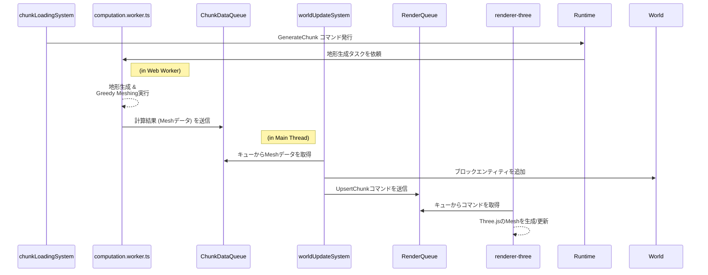

# レンダリングとUI

このドキュメントでは、ゲーム世界の視覚的な表現を担当するシステム群について解説します。これには、地形やエンティティの描画、プレイヤーの視線追跡（ターゲティング）、そしてユーザーインターフェース（UI）の表示が含まれます。

---

## 1. 設計思想: 関心の分離

レンダリングパイプラインは、**ゲームロジック**（何を描画すべきか）と**レンダリングエンジン**（どのように描画するか）の責務を明確に分離するように設計されています。これにより、一方の変更が他方に影響を与えにくくなり、コードの保守性とテスト容易性が向上します。

この分離を実現するため、両者の間には **`ChunkDataQueue`** と **`RenderQueue`** という2つの非同期キューが介在します。ゲームロジック（System）は直接Three.jsのAPIを呼び出すのではなく、描画したい内容をコマンドとして`RenderQueue`に送信し、それ以降の処理を`Renderer`に委任します。

---

## 2. レンダリングパイプライン (地形データフロー)

プレイヤーが新しい領域に移動した際の、チャンク生成から描画までの非同期データフローは以下のようになります。

### 各ステップの解説

1.  **`chunkLoadingSystem`**: プレイヤーの移動を検知し、新しく必要になったチャンクの `GenerateChunk` コマンドを発行します。
2.  **`computation.worker.ts` (Web Worker)**: メインスレッドをブロックしないよう、バックグラウンドで重い計算処理（地形生成、Greedy Meshing）を実行し、結果のメッシュデータを `ChunkDataQueue` に送信します。
3.  **`worldUpdateSystem`**:
    - メインスレッドで `ChunkDataQueue` を監視し、データがあれば1フレームに1つだけ取り出します（負荷分散）。
    - 取り出したデータに基づき、ブロックのエンティティを `World` に追加します。
    - メッシュデータをレンダリング可能なコマンド（`UpsertChunk`）に変換し、`RenderQueue` に送信します。
4.  **`renderer-three`**: `RenderQueue` を監視し、コマンドを受け取って初めてThree.jsのAPIを呼び出し、シーンにメッシュを実際に生成・更新・削除します。

---

## 3. `renderer-three` の内部アーキテクチャ

Three.jsを用いた具体的なレンダリング処理は `src/infrastructure/renderer-three/` にカプセル化されており、責務に応じてさらにモジュール分割されています。

- **`context.ts`**: Three.jsの `WebGLRenderer`, `Scene`, `PerspectiveCamera` といった、アプリケーション全体で単一のインスタンスを持つべきコアオブジェクトを管理する `ThreeContext` を提供します。
- **`index.ts`**: `Renderer`サービスの`Live`レイヤー（本番実装）を提供します。内部に`requestAnimationFrame`で駆動するレンダリングループを持ち、以下の責務を担います。
  - **コマンド処理**: `RenderQueue`を監視し、チャンクのメッシュの追加・削除といったコマンドを処理します。
  - **状態同期**: `World`の状態（プレイヤーの位置やカメラの向き）をThree.jsのオブジェクトに同期させます。
  - **ハイライト**: `RaycastResult`サービスを監視し、ターゲットブロックのハイライト表示を更新します。
  - **シーン描画**: 毎フレーム、Three.jsのシーンをレンダリングします。
  - **ゲームティックの実行**: `gameLoop`から登録された、全システムを実行するコールバックを毎フレーム呼び出します。

---

## 4. 最適化手法

広大なボクセルワールドをリアルタイムで描画するため、以下の最適化手法を適用しています。

### Greedy Meshing (地形)

地形は何百万ものブロックで構成されるため、そのまま描画するとパフォーマンスが破綻します。この問題を解決するのが **Greedy Meshing** アルゴリズムです。隣接する同じ種類のブロックを検出し、それらを一つの大きな面（ポリゴン）に統合することで、頂点数とドローコールを劇的に削減します。この計算は非常に負荷が高いため、`computation.worker.ts` 内のWeb Workerで完全に非同期に実行されます。

### Instanced Rendering (動的オブジェクト)

プレイヤーやMOBなど、ワールド内を移動するオブジェクトには **Instanced Rendering** という手法を用います。Three.jsの `InstancedMesh` を使用し、同じ形状と材質を持つ多数のオブジェクトを**一度のドローコール**でまとめてレンダリングします。

---

## 5. ターゲット更新システム (Update Target System)

- **関連ソース**: [`src/systems/update-target-system.ts`](../../src/systems/update-target-system.ts)
- **責務**: プレイヤーの視線にあるオブジェクトを特定し、その情報を`Target`コンポーネントに記録すること。

### 設計思想: 関心の分離

この機能は、**関心の分離**を強く重視して設計されています。

- **`RaycastService` (インフラ層)**: Three.jsのような特定のレンダリングエンジンを使用して、シーンに対してレイキャストを実行する*方法*を知っています。
- **`updateTargetSystem` (システム層)**: レイキャストが*なぜ*必要なのかを知っています。`RaycastService`を呼び出して結果を取得し、プレイヤーの`Target`コンポーネントを更新します。
- **`blockInteractionSystem` (システム層)**: `Target`コンポーネントを読み取り、ブロックの設置や破壊などの*アクション*を実行します。

この設計により、ゲームロジック(`updateTargetSystem`)がレンダリングエンジンの詳細から完全に分離されることが保証されます。

### 処理フロー

1.  **レイキャストの実行**: `RaycastService`を呼び出し、カメラの中心から発せられるレイキャストの結果を取得します。
2.  **ターゲットが見つかった場合**:
    - ヒットした座標をもとに `SpatialGrid` サービスに問い合わせ、その位置に存在するエンティティを特定します。
    - 特定されたエンティティのID、位置、面の法線ベクトルを含む `TargetBlock` コンポーネントを作成し、プレイヤーエンティティにアタッチ（または更新）します。
3.  **ターゲットが見つからない場合**:
    - プレイヤーエンティティの`Target`コンポーネントを `TargetNone` に設定（または更新）します。

### データフロー

`Input` -> `cameraControlSystem` -> `CameraState` -> `RaycastService` -> **`updateTargetSystem`** -> `Target`

---

## 6. UIシステム (UI System)

- **関連ソース**: [`src/systems/ui.ts`](../../src/systems/ui.ts)
- **責務**: ホットバー、クロスヘア、ゲームメニューなど、ゲームの情報をプレイヤーに表示すること。

UIシステムは、ECSの `World` の状態と、ユーザーが目にするHTML/DOM要素との間の橋渡しをします。

### 処理フロー

1.  **`World` のクエリ**: `World`サービスにアクセスし、UI表示に必要なコンポーネント（例: `Hotbar`）を持つエンティティを検索します。
2.  **DOM要素の更新**: 取得した状態に基づいて、対応するDOM要素を更新します。
    - **ホットバーのレンダリング**: 9つのホットバースロットのDOM要素をループ処理します。
    - **テクスチャの表示**: 各スロットに対応する `BlockType` が存在する場合、そのブロックのテクスチャ画像をスロット要素の `backgroundImage` として設定します。
    - **選択スロットのハイライト**: `Hotbar`コンポーネントの`selectedIndex`と一致するスロットに `selected` CSSクラスを追加して視覚的にハイライトします。
