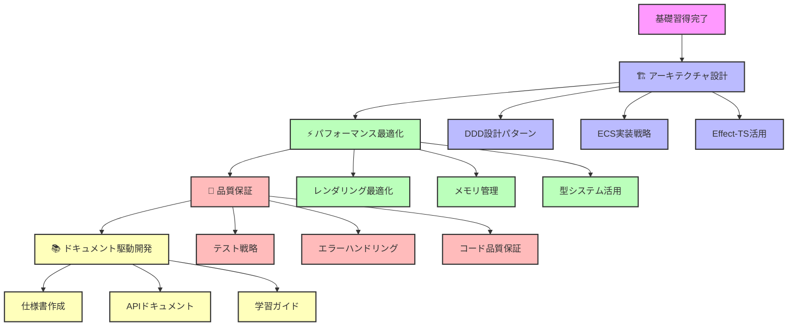

# 🚀 Advanced Topics - 上級開発者向けガイド

## 🎯 上級学習目標

**関数型ゲーム開発マスタリー**: Effect-TS × DDD × ECS 統合設計の習得

- ✅ **Effect-TS 3.17+ 完全活用** - 最新機能とパターンの実装
- ✅ **DDD × ECS アーキテクチャ** - ドメイン駆動設計とゲームエンジンの統合
- ✅ **パフォーマンス最適化** - 60FPS安定動作の実現
- ✅ **型安全設計** - 実行時エラーゼロの堅牢性
- ✅ **ドキュメント駆動開発** - AIエージェントとの協調開発

## 🗺️ 学習ロードマップ

## 📚 チュートリアル一覧

### 🏗️ アーキテクチャ設計

#### Effect-TS × DDD × ECS 統合アーキテクチャ（準備中）

**難易度**: 上級 | **所要時間**: 4-6時間

関数型プログラミングとドメイン駆動設計、エンティティコンポーネントシステムの統合アーキテクチャ設計。

**予定内容**:

- Effect-TS 3.17+ 最新機能活用
- ドメインモデルとECSの統合設計
- Context.GenericTagによる依存注入
- Schema.Structによる型安全データモデル
- Match.valueによる状態管理

### ⚡ パフォーマンス最適化

#### Three.js × Effect-TS レンダリング最適化（準備中）

**難易度**: 上級 | **所要時間**: 4-5時間

関数型アプローチによる高性能3Dレンダリングシステムの構築。

**予定内容**:

- Effect-TSによる非同期レンダリング管理
- フラスタムカリング実装パターン
- チャンクベースレンダリング最適化
- メモリ効率的なジオメトリ管理
- パフォーマンス監視とボトルネック特定

#### 型システム活用による最適化（準備中）

**難易度**: 上級 | **所要時間**: 3-4時間

TypeScript型システムとEffect-TSを活用した実行時パフォーマンス向上。

**予定内容**:

- Schema.Structによる効率的データ処理
- 型レベル計算によるコンパイル時最適化
- Effect.genのパフォーマンスベストプラクティス
- 型安全なメモリプール実装
- プロファイリングツールとメトリクス収集

### 🧪 品質保証・テスト戦略

#### Effect-TS テスト設計パターン（準備中）

**難易度**: 上級 | **所要時間**: 4-5時間

関数型プログラミングに最適化されたテスト設計とエラーハンドリング戦略。

**予定内容**:

- Effect.genに対応したテストパターン
- Schema.TaggedErrorによる型安全エラー処理
- プロパティベーステスト実装
- モックサービス設計（TestServices）
- カバレッジ100%達成の実践手法

### 📚 ドキュメント駆動開発

#### AIエージェント協調開発手法（準備中）

**難易度**: 上級 | **所要時間**: 3-4時間

AIエージェントとの効率的な協調開発パターンの習得。

**予定内容**:

- 仕様書ベースの開発フロー
- APIドキュメント自動生成
- プロジェクトメモリ活用術
- 段階的実装・検証サイクル
- ドキュメント品質保証手法

## 🛠️ 実践プロジェクト

### 関数型Minecraft Clone開発

上級チュートリアルの集大成として、以下の要件を満たすEffect-TSベースMinecraft Cloneを開発：

**アーキテクチャ要件**:

- [ ] Effect-TS 3.17+ 完全準拠（95%+採用率）
- [ ] DDD × ECS 統合アーキテクチャ実装
- [ ] Schema.Struct 100%型安全データモデル
- [ ] クラス使用禁止（Data.Class除く）完全遵守
- [ ] 関数型プログラミング原則100%適用

**品質要件**:

- [ ] TypeScript strict 100%準拠
- [ ] テストカバレッジ100%達成
- [ ] 60FPS安定動作（FullHD解像度）
- [ ] メモリリークゼロの実証
- [ ] エラーハンドリング100%型安全

## 💡 学習戦略

### 関数型ゲーム開発習得法

1. **ドキュメント駆動**: 仕様書を起点とした実装アプローチ
2. **型安全ファースト**: 実行時エラーを型レベルで防止
3. **段階的実装**: Phase単位での確実な進歩
4. **AIエージェント協調**: AIツールを活用した効率的開発

### 推奨学習リソース

**公式ドキュメント**:

- Effect-TS Official Documentation
- Three.js Documentation
- TypeScript Handbook

**プロジェクト内リソース**:

- `docs/specifications/` - 完全な機能仕様
- `docs/guides/development-conventions.md` - 開発規約
- `ROADMAP.md` - 段階的実装計画

**コミュニティ**:

- Effect-TS Discord Community
- Three.js Community
- TypeScript Community

## 📋 スキル評価チェックリスト

### Effect-TS マスタリー（必須）

- [ ] Context.GenericTagによる依存注入ができる
- [ ] Schema.Structで型安全なデータモデルを設計できる
- [ ] Match.valueによる状態管理を実装できる
- [ ] Effect.genで非同期処理を型安全に記述できる
- [ ] Schema.TaggedErrorで網羅的エラーハンドリングができる

### アーキテクチャ設計（必須）

- [ ] DDD × ECS 統合アーキテクチャを設計できる
- [ ] 完全関数型の設計パターンを適用できる
- [ ] ドメインモデルとコンポーネントシステムを統合できる
- [ ] 型システムを活用した設計ができる

### 品質保証（推奨）

- [ ] テストカバレッジ100%を達成できる
- [ ] プロパティベーステストを実装できる
- [ ] 型安全なモックシステムを構築できる
- [ ] パフォーマンス測定・改善ができる

### ドキュメント駆動開発（上級）

- [ ] 仕様書ベースの実装ができる
- [ ] AIエージェントと効率的に協調できる
- [ ] APIドキュメントを自動生成できる
- [ ] プロジェクトメモリを活用した開発ができる

## 🚀 次のステップ

上級チュートリアルを完了したら：

1. **実装フェーズ参加**: ROADMAP Phase 0からの実際の実装作業
2. **オープンソース貢献**: Effect-TS、Three.jsコミュニティへの貢献
3. **技術記事執筆**: 関数型ゲーム開発の知見共有
4. **アーキテクチャレビュー**: プロジェクト設計への積極参加

---

**🎯 Advanced Learning Goal**: 関数型プログラミングによるゲーム開発のエキスパートレベル習得 ✅
